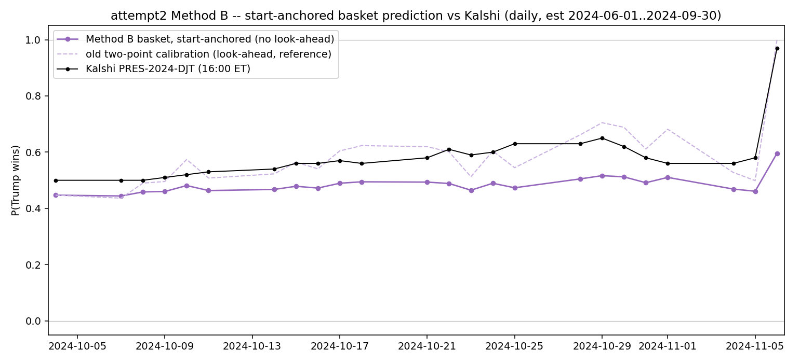

# 6. Hasbrouck price discovery — prediction market vs. an election-factor equity basket

## Goal

When election news arrives, does Kalshi's presidential contract move **before** the
equity market, or after? We build an equity basket that carries the election factor,
test whether the basket and Kalshi track a **common efficient price** (cointegration),
and — only if they do — measure **which side leads** (Hasbrouck 1995 information share).

---

## What we did — three stages

The sub-project went through three attempts. Each is kept in its own folder so the
whole path is visible.

1. **Daily weights, daily test** (`daily/`). Estimate the basket weights on daily
   data and run the price-discovery test on daily data. The basket **does** cointegrate
   with Kalshi (Engle-Granger), but there are only **24 daily observations** — far too
   few for a stable VECM / Hasbrouck decomposition. Not usable as the result.
2. **Daily weights, high-frequency test** (`high frequency/`). Take that same
   daily-estimated basket and apply it at **1 minute**. It **does NOT cointegrate** at
   1 minute — all three tests fail. A cointegrating vector fitted at the daily horizon
   is simply not the right vector at the minute scale. Not usable.
3. **High-frequency weights, high-frequency test** (`high frequency basket/`).
   Re-estimate the whole weight vector **directly on 1-minute data** and add **FXI**
   (China large-caps — a Trump-tariff proxy). Now the basket **cointegrates with Kalshi
   at 1 minute** (Engle-Granger, 5%). **This is the result.**

---

## Cointegration tests — the three stages side by side

Three tests each: **ADF** on the (1,−1) spread, **Engle-Granger** (scale-invariant —
the headline), and the **Johansen** trace. (Johansen critical values: 10% = 13.43,
5% = 15.49.)

| Stage | basket / test data | n | ADF spread(1,−1) | Engle-Granger | Johansen trace | Cointegrated? |
|---|---|---:|---:|---:|---:|---|
| **1 — daily** | daily weights, tested daily | 24 | 0.961 (no) | **0.002 ✓** | 14.08 (>10% cv) | EG yes at 5% — **but n=24, too few** |
| **2 — daily→HF** | daily weights, tested at 1-min | 9,361 | 0.583 (no) | 0.322 (no) | 6.98 (<15.49) | **NO — all three fail** |
| **3 — HF basket** | 1-min weights + FXI, at 1-min | 9,361 | 0.838 (no\*) | **0.037 ✓** | 12.41 (<13.43) | **YES — EG at 5%** |

\* The ADF (1,−1) test assumes a **unit** slope, but the basket underresponds (~0.3×),
so that test is mis-specified here; Engle-Granger, which estimates the slope, is the
gate. Level correlation basket-vs-Kalshi rises across the stages: 0.572 (stage 2) →
**0.917** (stage 3).

**The one line to remember:** the daily basket looks fine and the daily EG passes, but
the *same weights* fall apart at 1 minute (stage 2); only re-estimating the weights on
1-minute data (stage 3) produces a basket that cointegrates **at the frequency the
price-discovery test actually runs on.**

---

## The three baskets, visually

**Stage 1 — daily basket vs Kalshi.** Looks like it tracks:



**Stage 2 — the same (daily) weights applied at 1 minute.** The two series pull apart;
no cointegration (all three tests fail):


**Stage 3 — weights re-estimated at 1 minute + FXI.** Tracks again, and cointegrates
(EG 5%):


The daily picture is convincing, but a basket weighted from daily data does **not**
cointegrate once you look at it minute-by-minute — so it cannot carry a high-frequency
Hasbrouck test. That failure is the whole reason for stage 3.

---

## The result (Stage 3 — the high-frequency basket)

On the basket that actually cointegrates, the price-discovery step (VECM → Gonzalo-
Granger component shares + Hasbrouck 1995 information share) says:

- **Only the basket error-corrects.** When the two prices diverge, the basket moves
  back toward Kalshi: basket α = −0.00149 (t = **−4.04**). Kalshi's α (t = 1.73) is
  indistinguishable from zero — **Kalshi does not chase the basket.**
- **Hasbrouck information share: Kalshi 85.5%** (Gonzalo-Granger: basket 77.7% adjusting
  / Kalshi 22.3%).
- **One-sided catch-up + placebo.** The opening gap predicts the **basket's** next 90
  minutes (C1 slope −0.242, p = 0.003) but **not Kalshi's** (C2 slope −0.051, p = 0.683,
  flat). A significant C1 with a flat C2 rules out "both merely followed the same news."

**Reading:** information flows **prediction market → equity** — Kalshi leads, the equity
basket follows, absorbing about a third of each opening dislocation (level corr 0.917,
basket moves ~0.3× as far as Kalshi). Full detail, part-by-part, and limitations are in
[`high frequency basket/README.md`](high%20frequency%20basket/README.md).

---

## Methodology note — why a dollar-P&L basket, not a return index

In a two-state election model each asset's price **level** is affine in the win
probability `p`:

```
P_i,t = p_t · V_i(win) + (1 − p_t) · V_i(lose) + (non-election component)
so the election move is:   ΔP_i,t = ( V_i(win) − V_i(lose) ) · Δp_t     (dollars per probability point)
```

The election beta is a **dollar** quantity — the value gap between the two worlds. So
the basket is built as a **fixed-share dollar portfolio** `B_t = Σ n_i · P_i,t`, which
is exactly affine in `p` (compounding returns, or cumulating log returns, breaks that
linearity). Kalshi makes the parallel exact: its contract is an Arrow–Debreu $1 claim,
so its dollar price change **is** Δp. Weights are therefore estimated in dollar terms
(ΔP_i on Δp). This is what makes the start-anchored implied probability
`implied_p_t = Q0 + (B_t − B_0)` **exact within the model** rather than a linearization
of it (`Q0` = Kalshi's observed value on the first test day, known at t=0 — no look-ahead).

**No circularity.** Weights are estimated on a **different venue and an earlier period**
than the test — Polymarket (pre-test) for the weights, Kalshi (Oct 4 – Nov 6) for the
test — so the instrument is never fitted to the window it is evaluated on. Regular hours
only (09:30–16:00 ET); no overnight change ever enters a regression; DST-aware time
conversion across the 2024-11-03 EDT→EST change.

---

## Files

### `stock screen/` — pick the election-theme names (pre-test, hindsight-free)
| File | Role |
|---|---|
| `systematic_stock_screen.py` → `.csv` / `.txt` | Screens 1,303 liquid US stocks on Jun–Sep data. Two rankings: a **change** screen (corr of daily return with ΔP(Trump)) and a **level/cointegration** screen. Produces the candidate list for the adds. |
| `methodB_screened_stocks.py` → `_results.txt` | Builds the basket from the change-screen leaders and compares **five candidate compositions** on the Oct–Nov test window (the basket-selection table). |

### `daily/` — Stage 1 (daily weights + daily test)
| File | Role |
|---|---|
| `build_daily_panel.py` → `panel_daily.csv` | Daily panel of the asset prices + Polymarket P(Trump). |
| `methodB.py` → `methodB_weights/_pair/_results/.png` | Estimates the basket weights by a level cointegrating regression, then runs the daily cointegration gate vs Kalshi. |
| `hasbrouck.py` | Daily VECM → Gonzalo-Granger + Hasbrouck information share on the daily pair. **Kept for completeness, but it runs on only 24 daily observations — too few for a stable decomposition. This is exactly why the analysis moved to high frequency.** |

### `high frequency/` — Stage 2 (daily weights applied at 1 minute)
| File | Role |
|---|---|
| `build_hf_panel.py` → `hf_panel_1min.csv` | Aligns three sources (ETF UTC ticks, stock ET ticks, Kalshi UTC trades) onto one 1-minute ET grid. |
| `methodB_hf.py` → `hf_pair_1min.csv` / `_results.txt` / `.png` | Applies the **daily** weights at 1 minute (weights are **not** re-fitted here). |
| `hasbrouck_hf.py` → `hasbrouck_hf_results.txt` | The price-discovery step on this pair. |
| — | **Status: this basket does NOT cointegrate at 1 minute** (Stage 2 above — ADF 0.58, EG 0.32, Johansen 6.98), so its price-discovery output is **not usable**. The folder is kept only to document *why* the weights had to be re-estimated at high frequency. |

### `high frequency basket/` — Stage 3 (weights re-estimated at 1 minute + FXI) — **THE RESULT**
| File | Role |
|---|---|
| `fetch_polymarket_hf.py` | Downloads 1-min Polymarket P(Trump) → `polymarket_trump_hf_1min.csv` (validated against the daily series). |
| `build_panels.py` | Builds the two 1-min panels (`estim_panel_1min.csv` Sep; `test_panel_1min.csv` Oct–Nov). |
| `hasbrouck_basket.py` → `hf_basket_weights/_pair/_results/.png` | Steps 1–4 in one file: re-estimate weights, cointegration gate, VECM + information shares. |
| `README.md` | Full detail of this stage (the primary result). |

---

## The basket universe

**19 assets** — 11 Vanguard sector ETFs (VAW, VCR, VDC, VDE, VFH, VGT, VHT, VIS, VNQ,
VOX, VPU) + 8 election-theme adds (**MARA, COIN, GEO, IBKR, FSLR, RUN, DHI, TAN**). The
8 adds are one or two theme leaders each (from the screen of 1,303 pre-test stocks) so
that no single theme (crypto) dominates. At **high frequency (Stage 3) FXI is added →
20 assets**; FXI is China large-caps, an a-priori Trump-tariff proxy that removes broad
non-election variance and pushes the basket over the 5% Engle-Granger line.

A stocks-only 17-name alternative also cointegrates (and passes Johansen); it is reported
as a robustness check in `stock screen/methodB_screened_stocks_results.txt`. The
19/20-asset ETF-based basket remains the primary specification because it follows a rule
fixed in advance on pre-test data and stays a proxy for *the equity market* (keeping it
comparable with the sector-ETF lead-lag analysis elsewhere in the paper), rather than
being chosen to maximise a test-window statistic.
```

