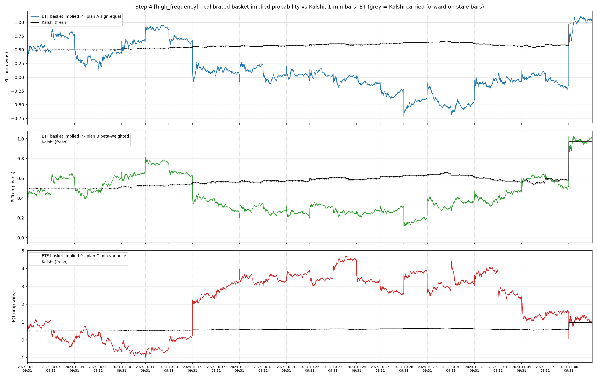
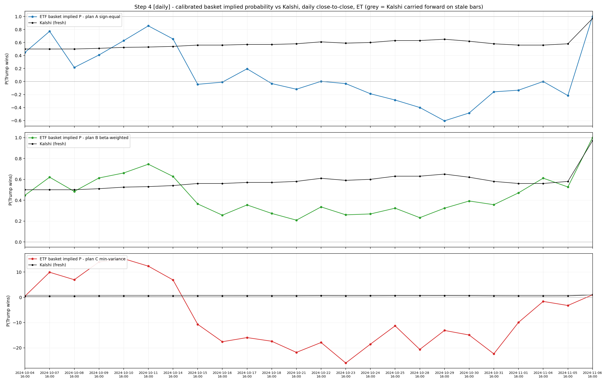

# Step 4 — Calibrate the basket to a probability, then test for cointegration

This report consolidates the four Step 4 text outputs (two-point calibration and
the cointegration gate, at both the high-frequency and daily grains) into one
document, and embeds the two paired figures.

Step 3 produced `B_t`, the basket's buy-and-hold level in return units. Step 4
maps `B_t` onto an implied probability using two known points, then tests whether
that implied probability and the Kalshi `PRES-2024-DJT` price are cointegrated —
the precondition for any VECM / Hasbrouck price-discovery analysis.

- **high_frequency** — 1-minute bars, overnight gaps included (9,325 bars, 24 days).
- **daily** — one close-to-close observation per day, which naturally carries the
  overnight move (24 days).

---

## Part 1 — Two-point calibration

Anchors (same at both grains):

- **p0 (sample start):** P(Trump) = 0.447 — Silver Bulletin model update,
  2024-09-30/10-01 (nearest update to the 2024-10-04 start).
- **p1 (election night):** P(Trump) = 1.0 — Trump won.

```
implied_p_t = q0 + (B_t - B@p0) * (q1 - q0) / (B@p1 - B@p0)
```

`B@p0` is the first-bar level (= 0 by construction); `B@p1` is the election-night
level. The **slope** is probability points per unit basket return.

### high_frequency

| plan | B_terminal | slope | impl_p min | impl_p max |
|---|---:|---:|---:|---:|
| A_sign_equal | +0.0917 | +6.03 | −0.742 | +1.111 |
| B_beta_weighted | +0.1546 | +3.58 | +0.115 | +1.028 |
| C_min_variance | −0.0276 | −20.04 | −0.988 | +4.731 |

### daily

| plan | B_terminal | slope | impl_p min | impl_p max |
|---|---:|---:|---:|---:|
| A_sign_equal | +0.0870 | +6.36 | −0.605 | +1.000 |
| B_beta_weighted | +0.1568 | +3.53 | +0.208 | +1.000 |
| C_min_variance | +0.0035 | +156.79 | −26.002 | +15.290 |

### Reading the three plans

- **Plan B (beta-weighted) is the best-behaved at both grains.** Its calibrated
  probability stays essentially inside [0,1] — [+0.115, +1.028] high-frequency and
  a clean [+0.208, +1.000] daily. This is the plan to carry downstream.
- **Plan A (sign-equal)** calibrates with a positive slope but is too noisy: it
  overshoots to −0.74 (high-frequency) / −0.61 (daily), so it cannot be read as a
  clean probability.
- **Plan C (min-variance) is unusable at both grains, but for different reasons.**
  - *high_frequency:* the basket level actually **fell** over the window
    (B_terminal = −0.028) while P(Trump) rose, so the slope is **negative**
    (−20.0) — an inverted signal that goes down when Trump's odds go up.
  - *daily:* the terminal level is **almost exactly zero** (+0.0035), so the slope
    **explodes** (+156.8) and the calibrated series blows up to ±26.
  Either way plan C is not a probability. It matches its Step-2 out-of-sample
  weakness: the min-variance weights are best in-sample but do not hold up
  out-of-sample. Kept in the CSVs for transparency only.

> The reference is Silver's ~Oct 1 update while the basket starts Oct 4; the
> ~3-day offset is the nearest model update to the sample start.

---

## Part 2b — Cointegration gate

Before any VECM / Hasbrouck, test whether each calibrated basket and Kalshi share
one efficient price. If they do, the spread is stationary (mean-reverting). If the
spread wanders (a unit root), the pair is **not** cointegrated and the Hasbrouck
information-share machinery is not legitimate for it.

Three readings per plan:

1. **spread(1,−1) ADF** — ADF on `implied_p − kalshi`; this is what the two-point
   calibration targets (both are meant to be P(Trump)).
2. **Engle–Granger** — regress `implied_p` on `kalshi`, ADF on the residual (lets
   the data pick the slope instead of imposing 1).
3. **Johansen trace** — `r = 0` vs `r ≥ 1`; trace stat vs its 95% critical value.

Cointegrated requires ADF/EG `p < 0.05`, or Johansen trace above its 95% value.

### high_frequency

**Full window 2024-10-04..11-06** — n = 9,325, 24 days, Kalshi fresh 75%

| plan | spread(1,−1) ADF p | EG b | EG ADF p | Johansen trace (95%=15.49) | verdict |
|---|---:|---:|---:|---:|:--|
| A_sign_equal | 0.461 | −0.01 | 0.534 | 3.31 | no |
| B_beta_weighted | 0.499 | +0.54 | 0.653 | 2.98 | no |
| C_min_variance | 0.503 | +4.49 | 0.665 | 4.42 | no |

**High-liquidity sub-window 2024-10-21..11-06** — n = 5,051, 13 days, Kalshi fresh 95%

| plan | spread(1,−1) ADF p | EG b | EG ADF p | Johansen trace (95%=15.49) | verdict |
|---|---:|---:|---:|---:|:--|
| A_sign_equal | 0.797 | +2.56 | 0.383 | 4.67 | no |
| B_beta_weighted | 0.794 | +1.44 | 0.587 | 3.21 | no |
| C_min_variance | 0.681 | −4.15 | 0.377 | 7.32 | no |

### daily

**Full window 2024-10-04..11-06** — n = 24, 24 days, Kalshi fresh 100%

| plan | spread(1,−1) ADF p | EG b | EG ADF p | Johansen trace (95%=15.49) | verdict |
|---|---:|---:|---:|---:|:--|
| A_sign_equal | 0.420 | +0.17 | 0.259 | 13.80 | no (near) |
| B_beta_weighted | 0.095 | +0.61 | 0.788 | 7.46 | no (ADF marginal) |
| C_min_variance | 0.306 | −30.80 | 0.061 | 5.34 | no |

**High-liquidity sub-window 2024-10-21..11-06** — n = 13, 13 days, Kalshi fresh 100%

| plan | spread(1,−1) ADF p | EG b | EG ADF p | Johansen trace (95%=15.49) | verdict |
|---|---:|---:|---:|---:|:--|
| A_sign_equal | 0.128 | +2.72 | 0.603 | 13.29 | no |
| B_beta_weighted | 0.587 | +1.46 | 0.664 | **22.82** | COINTEGRATED* |
| C_min_variance | 0.989 | +36.29 | 0.973 | **16.51** | COINTEGRATED* |

\* **These two flags are not trustworthy.** At n = 13 the Johansen trace test uses
asymptotic critical values that over-reject in small samples, so trace > 15.49 is
not credible here; for the same plan B the ADF (0.587) and Engle–Granger (0.664)
both say *no*, and the plots show the basket and Kalshi diverging between the
anchors. Plan C is degenerate anyway. Treat both as small-sample artifacts.

---

## Figures

Calibrated basket implied probability vs Kalshi, one weight plan per panel. Each
panel has its own y-axis (plan A and especially plan C stray outside [0,1]). Grey
= Kalshi carried forward on stale bars; black = fresh Kalshi trade.

**high_frequency (1-minute bars)**



**daily (close-to-close)**



---

## Bottom line

The two-point calibration forces `implied_p` and Kalshi to agree **only** at the
two anchors (sample start and election night). Between them the basket is driven
by moves the market does not share, so the spread wanders even though the
endpoints match.

- **No robust cointegration at either grain.** Every ADF and Engle–Granger test
  says *no*; the only two "COINTEGRATED" flags (daily plan B/C sub-window Johansen)
  are small-sample artifacts contradicted by the other tests and the figures.
- **Daily is better-behaved but does not rescue the relationship.** Plan B stays
  in a valid probability range and its full-window spread ADF is marginal
  (p = 0.095), but the basket still diverges from Kalshi between anchors.
- **This is not a weight-tuning problem.** Plan B is already the beta-weighted
  election-mimicking basket; any linear combination of these 11 broad sector ETFs
  carries too much non-election variance, which accumulates in the level and
  breaks cointegration. Contemporaneous return co-movement exists (mostly
  overnight) but does not amount to a shared efficient price.

Because cointegration fails, a VECM / Hasbrouck information-share analysis on this
pair is not legitimate. The honest conclusion is that the sector-ETF basket and
the Kalshi election price do **not** share one common price to attribute discovery
to.
