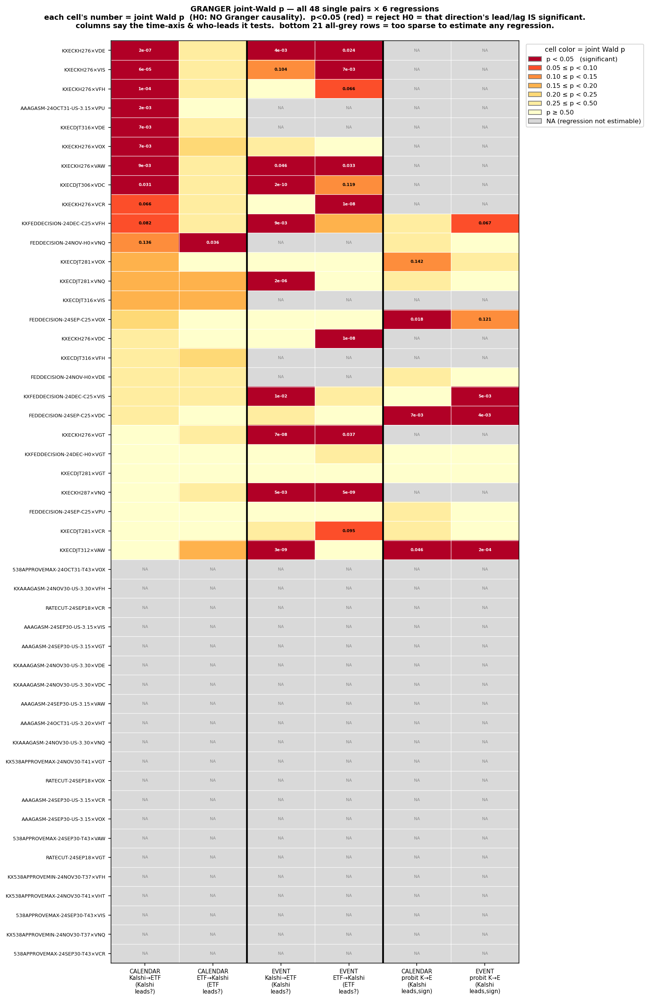
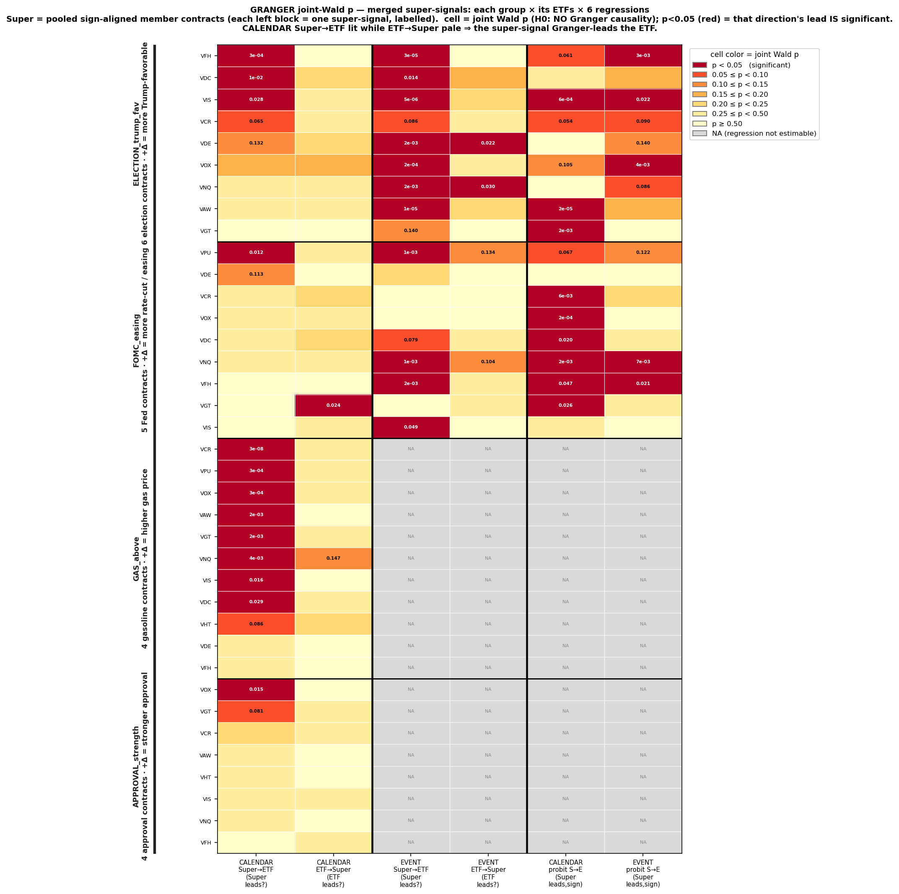

# Granger Report — Kalshi prediction markets × Vanguard sector ETFs

_Headline statistic: one joint Wald test per direction. Structure: **both core heatmaps up front** (single pairs, then merged super-signals) → overview & method → per-pair formulas+Wald detail → per-group detail. The main lead-lag reports (`leadlag_pairs_report.md`, `leadlag_merge_report.md`) no longer contain Granger. Method: `GRANGER_TEST.md`._

---

## CORE FIGURE 1 — single-pair Granger heatmap (all 48 pairs × 6 regressions)



_Rows = pairs; columns = time-axis × direction; cell colour = joint Wald p (p<0.05 red = that direction's lead/lag IS significant; NA = too sparse to estimate). CALENDAR Kalshi→ETF lights up while ETF→Kalshi stays pale ⇒ clean one-directional lead; EVENT is more bidirectional._

---

## CORE FIGURE 2 — merged super-signals Granger heatmap



_Each left block = one super-signal (labelled with its members & sign convention); rows = that group × each ETF. CALENDAR Super→ETF lit while ETF→Super pale ⇒ the super-signal Granger-leads the ETF (clearest for GAS and ELECTION)._

---

## COVERAGE — why 27 of 48 pairs carry results

```text
COVERAGE — 27 of 48 pairs carry Granger results; 21 are dropped (shown as NA rows in core figure 1).
================================================================================================

WHY 23 PAIRS ARE DROPPED (all fail at the SAME step — not a model failure, a data-density failure):

  The joint-Wald test needs enough *price-changing* observations to fit the smallest admissible model
  (K cause-lags + BIC own-lags + day fixed effects) and still have residual degrees of freedom for a
  valid Newey-West (hac-panel) covariance. The gate, applied BEFORE any regression is attempted:

     linear (calendar / event) :  # bars where Δprob actually moved  >=  2K + 5  = 11   (at K=3)
     probit  (Kalshi->ETF)     :  # usable observations              >=  30

  Every dropped pair fails this gate: the Kalshi contract barely traded during its overlap window, so
  after building bars almost no bar carries a non-zero price change. There is simply not enough
  independent information to identify a lag polynomial, let alone test it. Nothing is estimated and the
  row is left NA rather than reporting an under-identified / rank-deficient p-value.

  Of the 21 dropped, 0 had ZERO price-changing bars in the window (no trading / no
  quote updates at all); the remaining pairs had only a handful (1-9 changing bars, well under 11).

DROPPED PAIRS (price-changing bars measured on the same bar grid used for estimation):

  contract                        etf    cal  evt  probit   reason
  538APPROVEMAX-24OCT31-T43       VOX      2    2       2   too few price-changing bars (< 11 / < 30)
  KXAAAGASM-24NOV30-US-3.30       VDC      2    2       3   too few price-changing bars (< 11 / < 30)
  KXAAAGASM-24NOV30-US-3.30       VDE      2    2       3   too few price-changing bars (< 11 / < 30)
  KXAAAGASM-24NOV30-US-3.30       VFH      2    2       3   too few price-changing bars (< 11 / < 30)
  KXAAAGASM-24NOV30-US-3.30       VNQ      2    2       3   too few price-changing bars (< 11 / < 30)
  538APPROVEMAX-24SEP30-T43       VAW      3    3       4   too few price-changing bars (< 11 / < 30)
  538APPROVEMAX-24SEP30-T43       VCR      3    3       4   too few price-changing bars (< 11 / < 30)
  538APPROVEMAX-24SEP30-T43       VIS      3    3       4   too few price-changing bars (< 11 / < 30)
  AAAGASM-24OCT31-US-3.20         VHT      3    3       5   too few price-changing bars (< 11 / < 30)
  KX538APPROVEMAX-24NOV30-T41     VGT      3    3       3   too few price-changing bars (< 11 / < 30)
  KX538APPROVEMAX-24NOV30-T41     VHT      3    3       3   too few price-changing bars (< 11 / < 30)
  AAAGASM-24SEP30-US-3.15         VAW      5    5       6   too few price-changing bars (< 11 / < 30)
  AAAGASM-24SEP30-US-3.15         VCR      5    5       6   too few price-changing bars (< 11 / < 30)
  AAAGASM-24SEP30-US-3.15         VGT      5    5       6   too few price-changing bars (< 11 / < 30)
  AAAGASM-24SEP30-US-3.15         VIS      5    5       6   too few price-changing bars (< 11 / < 30)
  AAAGASM-24SEP30-US-3.15         VOX      5    5       6   too few price-changing bars (< 11 / < 30)
  KX538APPROVEMIN-24NOV30-T37     VFH      8    8      13   too few price-changing bars (< 11 / < 30)
  KX538APPROVEMIN-24NOV30-T37     VNQ      8    8      13   too few price-changing bars (< 11 / < 30)
  RATECUT-24SEP18                 VCR      8    8      21   too few price-changing bars (< 11 / < 30)
  RATECUT-24SEP18                 VGT      8    8      21   too few price-changing bars (< 11 / < 30)
  RATECUT-24SEP18                 VOX      8    8      21   too few price-changing bars (< 11 / < 30)

TAKEAWAY: the 25 estimable pairs are exactly those liquid enough to support valid inference; the drop
is a mechanical minimum-sample rule, applied identically to every pair, not a selection on results.
```

---

## OVERVIEW & METHOD

```text
GRANGER JOINT CAUSALITY — Kalshi prediction markets  vs  Vanguard sector ETFs
================================================================================================
This is the HEADLINE statistic: one joint Wald test per direction giving ONE p-value, replacing the
per-coefficient counting used in the main lead-lag report. It is the high-frequency reinstatement of
this project's daily Var.py results.test_causality (a VAR Granger Wald), and the object the advisor asked
for. Full method: GRANGER_TEST.md.

DEFINITIONS
   xₜ = Kalshi yes-probability change (Δprob) over bar t ;   yₜ = ETF log return over bar t.
   Only PAST lags of the 'cause' are used (j≥1); the contemporaneous (j=0) and future (j<0) terms are
   NOT part of the test. Each regression controls for the dependent variable's OWN past (ADL self-lags,
   order chosen by BIC).

THE TEST (per direction)
   Kalshi→ETF:  yₜ = α + Σ(i=1..p) φᵢ·yₜ₋ᵢ + Σ(j=1..K) bⱼ·xₜ₋ⱼ + day-FE ;   H0: b₁=…=b_K=0
   ETF→Kalshi:  xₜ = α + Σ(i=1..q) ψᵢ·xₜ₋ᵢ + Σ(j=1..K) dⱼ·yₜ₋ⱼ + day-FE ;   H0: d₁=…=d_K=0
   Reject H0 (p<0.05) ⇒ that variable Granger-leads the other. Comparing the two p's states who leads.

STANDARD ERRORS & VALIDITY
   Joint Wald uses panel Newey-West (hac-panel, bandwidth=K, within each trading-day block): full-rank
   (valid even for single-day event contracts, where day-clustering would be rank-deficient) and the
   microstructure-standard covariance for high-frequency intraday data. Δprob and log-returns are
   differenced ⇒ stationary ⇒ plain Granger is valid, no cointegration/VECM needed.

CONVENTIONS:  ET | 09:30-16:00 | ETF log return | median causal bars | day-grouped lags (no overnight)
              | adaptive bar & K by contract activity | ADL self-lags by BIC | significance p<0.05.

================================================================================================

CONCLUSIONS
================================================================================================
HEADLINE — the direction is asymmetric. Whenever Granger causality is significant it runs
Kalshi → ETF; the reverse (ETF → Kalshi) is essentially absent. This asymmetry — not the raw count
of significant pairs — is the robust finding, and it answers the project's question: the evidence
supports prediction markets LEADING sector ETFs, and does not support the reverse.

1. Direction is one-way (Kalshi → ETF)
   - Single pairs, calendar:  8 Kalshi-leads  vs  1 ETF-leads   (0 bidir, 18 neither, of 27).
   - Single pairs, event:     5 Kalshi-leads  vs  3 ETF-leads   (4 bidir, 9 neither, of 21).
   - Super-signals, calendar: 13 Super-leads   vs  1 ETF-leads   (0 bidir, 23 neither, of 37).
   - Super-signals, event:    9 Super-leads   vs  0 ETF-leads   (2 bidir, 7 neither, of 18).
   The reverse direction is significant in ~0 cases at every level — the lead is one-directional.

2. Weak and concentrated at the single-contract level
   - 18 of 27 single pairs show no Granger causality either way (calendar). The 8 that do are
     almost entirely one heavily-traded election contract across several ETFs (plus one FOMC pair):
       KXECKH276×VDE, KXECKH276×VIS, KXECKH276×VFH, AAAGASM-24OCT31-US-3.15×VPU, KXECDJT316×VDE, KXECKH276×VOX, KXECKH276×VAW, KXECDJT306×VDC.
   - So the lead is NOT a broad per-contract phenomenon; it is concentrated in the few LIQUID contracts.
     Illiquid contracts have no usable price-discovery process (consistent with the advisor's point).

3. Pooling restores power
   - Aggregating same-family contracts into sign-aligned super-signals (more degrees of freedom) lights
     up Super→ETF in 13/37 (calendar) and 9/18 (event), while the reverse stays ~0. The lead is
     real but needs aggregation to detect above single-contract noise.
   - Driven by: APPROVAL_strength, ELECTION_trump_fav, FOMC_easing, GAS_above (calendar), ELECTION_trump_fav, FOMC_easing (event);
     APPROVAL is too thin (no results). Election is the strongest and most consistent.

4. Caveats (state them)
   - Time-axis: the clean one-way result is on the CALENDAR (clock-time) axis. EVENT-time is muddier
     (3 single-pair ETF-leads, 4 bidirectional), most likely an artifact of sampling only at the sparse
     Kalshi trade instants (near-contemporaneous comovement misread as ETF-leads). The headline rests on
     calendar; event-time is robustness / a warning, not the basis for the claim.
   - Direction-only (probit) is weak: 3/13 (calendar) and 3/13 (event) significant. Predictability
     is in the MAGNITUDE of continuous returns more than in the up/down sign.
   - Multiple testing: 8 significant single pairs is only modestly above chance (~1.4 expected at 5%);
     the real signal is the ASYMMETRY (8:1 single, 13:1 pooled), not the absolute count.

BOTTOM LINE — High-frequency Granger tests show prediction markets one-directionally lead sector ETFs on
the clock-time axis (reverse essentially absent); the lead is concentrated in a few high-liquidity
contracts and is most robust after pooling same-family contracts into super-signals; direction-only
(probit) and event-time evidence is weaker. 'Lead' here means Granger precedence (predictive), not cause.

================================================================================================
SINGLE-PAIR SUMMARY (joint-Wald p per direction; * <.10  ** <.05  *** <.01)

rank contract               etf     cal K→E    cal E→K    evt K→E    evt E→K  verdict(cal/evt)
   1 KXFEDDECISION-24DEC-C2 VIS        0.46       0.25  0.0099***       0.43  -/K→E
   2 KXFEDDECISION-24DEC-C2 VFH      0.082*       0.49  0.0092***       0.15  -/K→E
   3 KXFEDDECISION-24DEC-H0 VGT        0.59       0.88       0.95       0.34  -/-
   4 FEDDECISION-24SEP-C25  VOX         0.2       0.71       0.89       0.64  -/-
   5 FEDDECISION-24SEP-C25  VPU        0.88       0.59       0.84       0.54  -/-
   6 FEDDECISION-24SEP-C25  VDC        0.48       0.75       0.37       0.74  -/-
   7 FEDDECISION-24NOV-H0   VNQ        0.14    0.036**          -          -  E→K/-
   8 FEDDECISION-24NOV-H0   VDE         0.4       0.38          -          -  -/-
   9 KXECDJT281             VNQ        0.16       0.19   2e-06***       0.56  -/K→E
  10 KXECDJT281             VOX        0.16       0.77        0.6       0.69  -/-
  11 KXECDJT281             VGT        0.65       0.64       0.78       0.59  -/-
  12 KXECDJT281             VCR         0.9       0.87        0.3     0.095*  -/-
  13 KXECDJT312             VAW        0.97       0.19 3.2e-09***       0.66  -/K→E
  14 KXECDJT306             VDC     0.031**       0.34 2.1e-10***       0.12  K→E/K→E
  15 KXECDJT316             VFH        0.37       0.23          -          -  -/-
  16 KXECDJT316             VIS        0.17       0.19          -          -  -/-
  17 KXECDJT316             VDE   0.0067***       0.49          -          -  K→E/-
  18 AAAGASM-24OCT31-US-3.1 VPU   0.0017***       0.58          -          -  K→E/-
  19 KXECKH276              VOX   0.0075***       0.23       0.38       0.86  K→E/-
  20 KXECKH276              VFH  0.00013***       0.32       0.65     0.066*  K→E/-
  21 KXECKH276              VIS    6e-05***       0.31        0.1  0.0068***  K→E/E→K
  22 KXECKH276              VCR      0.066*       0.42       0.59 1.1e-08***  -/E→K
  23 KXECKH276              VDE  2.5e-07***       0.41  0.0039***    0.024**  K→E/bi
  24 KXECKH276              VGT        0.53       0.35 6.7e-08***    0.037**  -/bi
  25 KXECKH276              VDC        0.31       0.63       0.84 1.5e-08***  -/E→K
  26 KXECKH276              VAW   0.0089***       0.34    0.046**    0.033**  K→E/bi
  27 KXECKH287              VNQ        0.65       0.33  0.0053*** 4.5e-09***  -/bi
```

---

## Single-pair detail — explicit formulas + joint Wald per direction

---

### Rank 1/48 — KXFEDDECISION-24DEC-C25 × VIS

```text
GRANGER CAUSALITY    —    Rank 1 / 48
================================================================================================
KXFEDDECISION-24DEC-C25   x   VIS
Contract : "Will the Federal Reserve Cut rates by 25bps at their December 2024 meeting?"
Window : 2024-10-31 to 2024-12-18     primary bar : 5min     Kalshi trades : 2308

Test: joint Wald H0 = all PAST cause-lags are 0 (controls the effect's own past; hac-panel SE).
p<0.05 ⇒ that variable Granger-leads the other.  (x=Δprob, y=ETF log return.)

1. CALENDAR-TIME (clock-time lags, full RTH grid)
   Direction A — Kalshi → ETF:
      yₜ = α + φ₁·yₜ₋₁ + Σ(j=1..10) bⱼ·xₜ₋ⱼ + Σ(d=1..32) γ_d·Day_d
      controls: ADL self-lags p=1 (BIC) ; cause block K=10 ; day-FE over 33 days ; hac-panel SE (bw=10).
      H0: b₁ = … = b_10 = 0   →   Wald χ²(10) = 9.82,  p = 0.457 
   Direction B — ETF → Kalshi:
      xₜ = α + ψ₁·xₜ₋₁ + Σ(j=1..10) dⱼ·yₜ₋ⱼ + Σ(d=1..32) γ_d·Day_d
      controls: ADL self-lags p=1 (BIC) ; cause block K=10 ; day-FE over 33 days ; hac-panel SE (bw=10).
      H0: d₁ = … = d_10 = 0   →   Wald χ²(10) = 12.55,  p = 0.25 
   Direction A (probit, ETF up/down):
      Pr(yₜ>0) = Φ( α + (no y self-lag term: BIC chose p=0) + Σ(j=1..10) bⱼ·xₜ₋ⱼ )
      controls: ADL self-lags p=0 (BIC) ; cause block K=10 ; sample spans 28 days (probit: no day-FE) ; hac-panel SE (bw=10).
      H0: b₁ = … = b_10 = 0   →   Wald χ²(10) = 8.85,  p = 0.547 
   => calendar verdict: neither direction significant.

2. EVENT-TIME (event-count lags)
   Direction A — Kalshi → ETF:
      yₜ = α + (no y self-lag term: BIC chose p=0) + Σ(j=1..10) bⱼ·xₜ₋ⱼ + Σ(d=1..27) γ_d·Day_d
      controls: ADL self-lags p=0 (BIC) ; cause block K=10 ; day-FE over 28 days ; hac-panel SE (bw=10).
      H0: b₁ = … = b_10 = 0   →   Wald χ²(10) = 23.24,  p = 0.00989 ***
   Direction B — ETF → Kalshi:
      xₜ = α + ψ₁·xₜ₋₁ + ψ₂·xₜ₋₂ + ψ₃·xₜ₋₃ + ψ₄·xₜ₋₄ + ψ₅·xₜ₋₅ + ψ₆·xₜ₋₆ + Σ(j=1..10) dⱼ·yₜ₋ⱼ + Σ(d=1..27) γ_d·Day_d
      controls: ADL self-lags p=6 (BIC) ; cause block K=10 ; day-FE over 28 days ; hac-panel SE (bw=10).
      H0: d₁ = … = d_10 = 0   →   Wald χ²(10) = 10.14,  p = 0.428 
   Direction A (probit, ETF up/down):
      Pr(yₜ>0) = Φ( α + (no y self-lag term: BIC chose p=0) + Σ(j=1..10) bⱼ·xₜ₋ⱼ )
      controls: ADL self-lags p=0 (BIC) ; cause block K=10 ; sample spans 28 days (probit: no day-FE) ; hac-panel SE (bw=10).
      H0: b₁ = … = b_10 = 0   →   Wald χ²(10) = 25.25,  p = 0.00489 ***
   => event verdict: Kalshi Granger-leads ETF.

3. OVERALL VERDICT
   Calendar says 'neither direction significant' but Event says 'Kalshi Granger-leads ETF' — not robust across time-axis.

------------------------------------------------------------------------------------------------
This pair's joint-Wald p per direction is also in the single-pair heatmap (core figure 1).
```

---

### Rank 2/48 — KXFEDDECISION-24DEC-C25 × VFH

```text
GRANGER CAUSALITY    —    Rank 2 / 48
================================================================================================
KXFEDDECISION-24DEC-C25   x   VFH
Contract : "Will the Federal Reserve Cut rates by 25bps at their December 2024 meeting?"
Window : 2024-10-31 to 2024-12-18     primary bar : 5min     Kalshi trades : 2308

Test: joint Wald H0 = all PAST cause-lags are 0 (controls the effect's own past; hac-panel SE).
p<0.05 ⇒ that variable Granger-leads the other.  (x=Δprob, y=ETF log return.)

1. CALENDAR-TIME (clock-time lags, full RTH grid)
   Direction A — Kalshi → ETF:
      yₜ = α + φ₁·yₜ₋₁ + Σ(j=1..10) bⱼ·xₜ₋ⱼ + Σ(d=1..32) γ_d·Day_d
      controls: ADL self-lags p=1 (BIC) ; cause block K=10 ; day-FE over 33 days ; hac-panel SE (bw=10).
      H0: b₁ = … = b_10 = 0   →   Wald χ²(10) = 16.67,  p = 0.0819 *
   Direction B — ETF → Kalshi:
      xₜ = α + ψ₁·xₜ₋₁ + Σ(j=1..10) dⱼ·yₜ₋ⱼ + Σ(d=1..32) γ_d·Day_d
      controls: ADL self-lags p=1 (BIC) ; cause block K=10 ; day-FE over 33 days ; hac-panel SE (bw=10).
      H0: d₁ = … = d_10 = 0   →   Wald χ²(10) = 9.41,  p = 0.494 
   Direction A (probit, ETF up/down):
      Pr(yₜ>0) = Φ( α + (no y self-lag term: BIC chose p=0) + Σ(j=1..10) bⱼ·xₜ₋ⱼ )
      controls: ADL self-lags p=0 (BIC) ; cause block K=10 ; sample spans 28 days (probit: no day-FE) ; hac-panel SE (bw=10).
      H0: b₁ = … = b_10 = 0   →   Wald χ²(10) = 11.41,  p = 0.326 
   => calendar verdict: neither direction significant.

2. EVENT-TIME (event-count lags)
   Direction A — Kalshi → ETF:
      yₜ = α + (no y self-lag term: BIC chose p=0) + Σ(j=1..10) bⱼ·xₜ₋ⱼ + Σ(d=1..27) γ_d·Day_d
      controls: ADL self-lags p=0 (BIC) ; cause block K=10 ; day-FE over 28 days ; hac-panel SE (bw=10).
      H0: b₁ = … = b_10 = 0   →   Wald χ²(10) = 23.44,  p = 0.00924 ***
   Direction B — ETF → Kalshi:
      xₜ = α + ψ₁·xₜ₋₁ + ψ₂·xₜ₋₂ + ψ₃·xₜ₋₃ + ψ₄·xₜ₋₄ + ψ₅·xₜ₋₅ + ψ₆·xₜ₋₆ + Σ(j=1..10) dⱼ·yₜ₋ⱼ + Σ(d=1..27) γ_d·Day_d
      controls: ADL self-lags p=6 (BIC) ; cause block K=10 ; day-FE over 28 days ; hac-panel SE (bw=10).
      H0: d₁ = … = d_10 = 0   →   Wald χ²(10) = 14.47,  p = 0.153 
   Direction A (probit, ETF up/down):
      Pr(yₜ>0) = Φ( α + (no y self-lag term: BIC chose p=0) + Σ(j=1..10) bⱼ·xₜ₋ⱼ )
      controls: ADL self-lags p=0 (BIC) ; cause block K=10 ; sample spans 28 days (probit: no day-FE) ; hac-panel SE (bw=10).
      H0: b₁ = … = b_10 = 0   →   Wald χ²(10) = 17.36,  p = 0.0667 *
   => event verdict: Kalshi Granger-leads ETF.

3. OVERALL VERDICT
   Calendar says 'neither direction significant' but Event says 'Kalshi Granger-leads ETF' — not robust across time-axis.

------------------------------------------------------------------------------------------------
This pair's joint-Wald p per direction is also in the single-pair heatmap (core figure 1).
```

---

### Rank 3/48 — KXFEDDECISION-24DEC-H0 × VGT

```text
GRANGER CAUSALITY    —    Rank 3 / 48
================================================================================================
KXFEDDECISION-24DEC-H0   x   VGT
Contract : "Will the Federal Reserve Hike rates by 0bps at their December 2024 meeting?"
Window : 2024-10-31 to 2024-12-18     primary bar : 10min     Kalshi trades : 1375

Test: joint Wald H0 = all PAST cause-lags are 0 (controls the effect's own past; hac-panel SE).
p<0.05 ⇒ that variable Granger-leads the other.  (x=Δprob, y=ETF log return.)

1. CALENDAR-TIME (clock-time lags, full RTH grid)
   Direction A — Kalshi → ETF:
      yₜ = α + (no y self-lag term: BIC chose p=0) + Σ(j=1..8) bⱼ·xₜ₋ⱼ + Σ(d=1..33) γ_d·Day_d
      controls: ADL self-lags p=0 (BIC) ; cause block K=8 ; day-FE over 34 days ; hac-panel SE (bw=8).
      H0: b₁ = … = b_8 = 0   →   Wald χ²(8) = 6.47,  p = 0.595 
   Direction B — ETF → Kalshi:
      xₜ = α + ψ₁·xₜ₋₁ + ψ₂·xₜ₋₂ + ψ₃·xₜ₋₃ + ψ₄·xₜ₋₄ + Σ(j=1..8) dⱼ·yₜ₋ⱼ + Σ(d=1..33) γ_d·Day_d
      controls: ADL self-lags p=4 (BIC) ; cause block K=8 ; day-FE over 34 days ; hac-panel SE (bw=8).
      H0: d₁ = … = d_8 = 0   →   Wald χ²(8) = 3.77,  p = 0.878 
   Direction A (probit, ETF up/down):
      Pr(yₜ>0) = Φ( α + (no y self-lag term: BIC chose p=0) + Σ(j=1..8) bⱼ·xₜ₋ⱼ )
      controls: ADL self-lags p=0 (BIC) ; cause block K=8 ; sample spans 26 days (probit: no day-FE) ; hac-panel SE (bw=8).
      H0: b₁ = … = b_8 = 0   →   Wald χ²(8) = 3.55,  p = 0.895 
   => calendar verdict: neither direction significant.

2. EVENT-TIME (event-count lags)
   Direction A — Kalshi → ETF:
      yₜ = α + φ₁·yₜ₋₁ + Σ(j=1..8) bⱼ·xₜ₋ⱼ + Σ(d=1..25) γ_d·Day_d
      controls: ADL self-lags p=1 (BIC) ; cause block K=8 ; day-FE over 26 days ; hac-panel SE (bw=8).
      H0: b₁ = … = b_8 = 0   →   Wald χ²(8) = 2.76,  p = 0.949 
   Direction B — ETF → Kalshi:
      xₜ = α + ψ₁·xₜ₋₁ + ψ₂·xₜ₋₂ + Σ(j=1..8) dⱼ·yₜ₋ⱼ + Σ(d=1..25) γ_d·Day_d
      controls: ADL self-lags p=2 (BIC) ; cause block K=8 ; day-FE over 26 days ; hac-panel SE (bw=8).
      H0: d₁ = … = d_8 = 0   →   Wald χ²(8) = 9.06,  p = 0.337 
   Direction A (probit, ETF up/down):
      Pr(yₜ>0) = Φ( α + (no y self-lag term: BIC chose p=0) + Σ(j=1..8) bⱼ·xₜ₋ⱼ )
      controls: ADL self-lags p=0 (BIC) ; cause block K=8 ; sample spans 26 days (probit: no day-FE) ; hac-panel SE (bw=8).
      H0: b₁ = … = b_8 = 0   →   Wald χ²(8) = 6.65,  p = 0.575 
   => event verdict: neither direction significant.

3. OVERALL VERDICT
   No Granger causality detected on either axis.

------------------------------------------------------------------------------------------------
This pair's joint-Wald p per direction is also in the single-pair heatmap (core figure 1).
```

---

### Rank 4/48 — FEDDECISION-24SEP-C25 × VOX

```text
GRANGER CAUSALITY    —    Rank 4 / 48
================================================================================================
FEDDECISION-24SEP-C25   x   VOX
Contract : "Will the Federal Reserve Cut rates by 25bps at their September 2024 meeting?"
Window : 2024-09-04 to 2024-09-18     primary bar : 2min     Kalshi trades : 1125

Test: joint Wald H0 = all PAST cause-lags are 0 (controls the effect's own past; hac-panel SE).
p<0.05 ⇒ that variable Granger-leads the other.  (x=Δprob, y=ETF log return.)

1. CALENDAR-TIME (clock-time lags, full RTH grid)
   Direction A — Kalshi → ETF:
      yₜ = α + φ₁·yₜ₋₁ + Σ(j=1..8) bⱼ·xₜ₋ⱼ + Σ(d=1..10) γ_d·Day_d
      controls: ADL self-lags p=1 (BIC) ; cause block K=8 ; day-FE over 11 days ; hac-panel SE (bw=8).
      H0: b₁ = … = b_8 = 0   →   Wald χ²(8) = 10.95,  p = 0.205 
   Direction B — ETF → Kalshi:
      xₜ = α + ψ₁·xₜ₋₁ + ψ₂·xₜ₋₂ + ψ₃·xₜ₋₃ + ψ₄·xₜ₋₄ + Σ(j=1..8) dⱼ·yₜ₋ⱼ + Σ(d=1..10) γ_d·Day_d
      controls: ADL self-lags p=4 (BIC) ; cause block K=8 ; day-FE over 11 days ; hac-panel SE (bw=8).
      H0: d₁ = … = d_8 = 0   →   Wald χ²(8) = 5.44,  p = 0.71 
   Direction A (probit, ETF up/down):
      Pr(yₜ>0) = Φ( α + (no y self-lag term: BIC chose p=0) + Σ(j=1..8) bⱼ·xₜ₋ⱼ )
      controls: ADL self-lags p=0 (BIC) ; cause block K=8 ; sample spans 10 days (probit: no day-FE) ; hac-panel SE (bw=8).
      H0: b₁ = … = b_8 = 0   →   Wald χ²(8) = 18.51,  p = 0.0177 **
   => calendar verdict: neither direction significant.

2. EVENT-TIME (event-count lags)
   Direction A — Kalshi → ETF:
      yₜ = α + (no y self-lag term: BIC chose p=0) + Σ(j=1..8) bⱼ·xₜ₋ⱼ + Σ(d=1..9) γ_d·Day_d
      controls: ADL self-lags p=0 (BIC) ; cause block K=8 ; day-FE over 10 days ; hac-panel SE (bw=8).
      H0: b₁ = … = b_8 = 0   →   Wald χ²(8) = 3.63,  p = 0.889 
   Direction B — ETF → Kalshi:
      xₜ = α + ψ₁·xₜ₋₁ + ψ₂·xₜ₋₂ + Σ(j=1..8) dⱼ·yₜ₋ⱼ + Σ(d=1..9) γ_d·Day_d
      controls: ADL self-lags p=2 (BIC) ; cause block K=8 ; day-FE over 10 days ; hac-panel SE (bw=8).
      H0: d₁ = … = d_8 = 0   →   Wald χ²(8) = 6.08,  p = 0.638 
   Direction A (probit, ETF up/down):
      Pr(yₜ>0) = Φ( α + φ₁·yₜ₋₁ + Σ(j=1..8) bⱼ·xₜ₋ⱼ )
      controls: ADL self-lags p=1 (BIC) ; cause block K=8 ; sample spans 10 days (probit: no day-FE) ; hac-panel SE (bw=8).
      H0: b₁ = … = b_8 = 0   →   Wald χ²(8) = 12.73,  p = 0.121 
   => event verdict: neither direction significant.

3. OVERALL VERDICT
   No Granger causality detected on either axis.

------------------------------------------------------------------------------------------------
This pair's joint-Wald p per direction is also in the single-pair heatmap (core figure 1).
```

---

### Rank 5/48 — FEDDECISION-24SEP-C25 × VPU

```text
GRANGER CAUSALITY    —    Rank 5 / 48
================================================================================================
FEDDECISION-24SEP-C25   x   VPU
Contract : "Will the Federal Reserve Cut rates by 25bps at their September 2024 meeting?"
Window : 2024-09-04 to 2024-09-18     primary bar : 2min     Kalshi trades : 1125

Test: joint Wald H0 = all PAST cause-lags are 0 (controls the effect's own past; hac-panel SE).
p<0.05 ⇒ that variable Granger-leads the other.  (x=Δprob, y=ETF log return.)

1. CALENDAR-TIME (clock-time lags, full RTH grid)
   Direction A — Kalshi → ETF:
      yₜ = α + φ₁·yₜ₋₁ + φ₂·yₜ₋₂ + φ₃·yₜ₋₃ + φ₄·yₜ₋₄ + φ₅·yₜ₋₅ + φ₆·yₜ₋₆ + Σ(j=1..8) bⱼ·xₜ₋ⱼ + Σ(d=1..10) γ_d·Day_d
      controls: ADL self-lags p=6 (BIC) ; cause block K=8 ; day-FE over 11 days ; hac-panel SE (bw=8).
      H0: b₁ = … = b_8 = 0   →   Wald χ²(8) = 3.75,  p = 0.879 
   Direction B — ETF → Kalshi:
      xₜ = α + ψ₁·xₜ₋₁ + ψ₂·xₜ₋₂ + ψ₃·xₜ₋₃ + ψ₄·xₜ₋₄ + Σ(j=1..8) dⱼ·yₜ₋ⱼ + Σ(d=1..10) γ_d·Day_d
      controls: ADL self-lags p=4 (BIC) ; cause block K=8 ; day-FE over 11 days ; hac-panel SE (bw=8).
      H0: d₁ = … = d_8 = 0   →   Wald χ²(8) = 6.53,  p = 0.588 
   Direction A (probit, ETF up/down):
      Pr(yₜ>0) = Φ( α + (no y self-lag term: BIC chose p=0) + Σ(j=1..8) bⱼ·xₜ₋ⱼ )
      controls: ADL self-lags p=0 (BIC) ; cause block K=8 ; sample spans 10 days (probit: no day-FE) ; hac-panel SE (bw=8).
      H0: b₁ = … = b_8 = 0   →   Wald χ²(8) = 9.01,  p = 0.341 
   => calendar verdict: neither direction significant.

2. EVENT-TIME (event-count lags)
   Direction A — Kalshi → ETF:
      yₜ = α + φ₁·yₜ₋₁ + φ₂·yₜ₋₂ + Σ(j=1..8) bⱼ·xₜ₋ⱼ + Σ(d=1..9) γ_d·Day_d
      controls: ADL self-lags p=2 (BIC) ; cause block K=8 ; day-FE over 10 days ; hac-panel SE (bw=8).
      H0: b₁ = … = b_8 = 0   →   Wald χ²(8) = 4.23,  p = 0.836 
   Direction B — ETF → Kalshi:
      xₜ = α + ψ₁·xₜ₋₁ + ψ₂·xₜ₋₂ + Σ(j=1..8) dⱼ·yₜ₋ⱼ + Σ(d=1..9) γ_d·Day_d
      controls: ADL self-lags p=2 (BIC) ; cause block K=8 ; day-FE over 10 days ; hac-panel SE (bw=8).
      H0: d₁ = … = d_8 = 0   →   Wald χ²(8) = 6.97,  p = 0.54 
   Direction A (probit, ETF up/down):
      Pr(yₜ>0) = Φ( α + (no y self-lag term: BIC chose p=0) + Σ(j=1..8) bⱼ·xₜ₋ⱼ )
      controls: ADL self-lags p=0 (BIC) ; cause block K=8 ; sample spans 10 days (probit: no day-FE) ; hac-panel SE (bw=8).
      H0: b₁ = … = b_8 = 0   →   Wald χ²(8) = 6.11,  p = 0.635 
   => event verdict: neither direction significant.

3. OVERALL VERDICT
   No Granger causality detected on either axis.

------------------------------------------------------------------------------------------------
This pair's joint-Wald p per direction is also in the single-pair heatmap (core figure 1).
```

---

### Rank 6/48 — FEDDECISION-24SEP-C25 × VDC

```text
GRANGER CAUSALITY    —    Rank 6 / 48
================================================================================================
FEDDECISION-24SEP-C25   x   VDC
Contract : "Will the Federal Reserve Cut rates by 25bps at their September 2024 meeting?"
Window : 2024-09-04 to 2024-09-18     primary bar : 2min     Kalshi trades : 1125

Test: joint Wald H0 = all PAST cause-lags are 0 (controls the effect's own past; hac-panel SE).
p<0.05 ⇒ that variable Granger-leads the other.  (x=Δprob, y=ETF log return.)

1. CALENDAR-TIME (clock-time lags, full RTH grid)
   Direction A — Kalshi → ETF:
      yₜ = α + φ₁·yₜ₋₁ + Σ(j=1..8) bⱼ·xₜ₋ⱼ + Σ(d=1..10) γ_d·Day_d
      controls: ADL self-lags p=1 (BIC) ; cause block K=8 ; day-FE over 11 days ; hac-panel SE (bw=8).
      H0: b₁ = … = b_8 = 0   →   Wald χ²(8) = 7.50,  p = 0.484 
   Direction B — ETF → Kalshi:
      xₜ = α + ψ₁·xₜ₋₁ + ψ₂·xₜ₋₂ + ψ₃·xₜ₋₃ + ψ₄·xₜ₋₄ + Σ(j=1..8) dⱼ·yₜ₋ⱼ + Σ(d=1..10) γ_d·Day_d
      controls: ADL self-lags p=4 (BIC) ; cause block K=8 ; day-FE over 11 days ; hac-panel SE (bw=8).
      H0: d₁ = … = d_8 = 0   →   Wald χ²(8) = 5.07,  p = 0.75 
   Direction A (probit, ETF up/down):
      Pr(yₜ>0) = Φ( α + (no y self-lag term: BIC chose p=0) + Σ(j=1..8) bⱼ·xₜ₋ⱼ )
      controls: ADL self-lags p=0 (BIC) ; cause block K=8 ; sample spans 10 days (probit: no day-FE) ; hac-panel SE (bw=8).
      H0: b₁ = … = b_8 = 0   →   Wald χ²(8) = 21.14,  p = 0.00678 ***
   => calendar verdict: neither direction significant.

2. EVENT-TIME (event-count lags)
   Direction A — Kalshi → ETF:
      yₜ = α + (no y self-lag term: BIC chose p=0) + Σ(j=1..8) bⱼ·xₜ₋ⱼ + Σ(d=1..9) γ_d·Day_d
      controls: ADL self-lags p=0 (BIC) ; cause block K=8 ; day-FE over 10 days ; hac-panel SE (bw=8).
      H0: b₁ = … = b_8 = 0   →   Wald χ²(8) = 8.73,  p = 0.366 
   Direction B — ETF → Kalshi:
      xₜ = α + ψ₁·xₜ₋₁ + ψ₂·xₜ₋₂ + Σ(j=1..8) dⱼ·yₜ₋ⱼ + Σ(d=1..9) γ_d·Day_d
      controls: ADL self-lags p=2 (BIC) ; cause block K=8 ; day-FE over 10 days ; hac-panel SE (bw=8).
      H0: d₁ = … = d_8 = 0   →   Wald χ²(8) = 5.14,  p = 0.742 
   Direction A (probit, ETF up/down):
      Pr(yₜ>0) = Φ( α + φ₁·yₜ₋₁ + Σ(j=1..8) bⱼ·xₜ₋ⱼ )
      controls: ADL self-lags p=1 (BIC) ; cause block K=8 ; sample spans 10 days (probit: no day-FE) ; hac-panel SE (bw=8).
      H0: b₁ = … = b_8 = 0   →   Wald χ²(8) = 22.28,  p = 0.00442 ***
   => event verdict: neither direction significant.

3. OVERALL VERDICT
   No Granger causality detected on either axis.

------------------------------------------------------------------------------------------------
This pair's joint-Wald p per direction is also in the single-pair heatmap (core figure 1).
```

---

### Rank 7/48 — FEDDECISION-24NOV-H0 × VNQ

```text
GRANGER CAUSALITY    —    Rank 7 / 48
================================================================================================
FEDDECISION-24NOV-H0   x   VNQ
Contract : "Will the Federal Reserve Hike rates by 0bps at their November 2024 meeting?"
Window : 2024-09-18 to 2024-11-07     primary bar : 10min     Kalshi trades : 452

Test: joint Wald H0 = all PAST cause-lags are 0 (controls the effect's own past; hac-panel SE).
p<0.05 ⇒ that variable Granger-leads the other.  (x=Δprob, y=ETF log return.)

1. CALENDAR-TIME (clock-time lags, full RTH grid)
   Direction A — Kalshi → ETF:
      yₜ = α + (no y self-lag term: BIC chose p=0) + Σ(j=1..6) bⱼ·xₜ₋ⱼ + Σ(d=1..35) γ_d·Day_d
      controls: ADL self-lags p=0 (BIC) ; cause block K=6 ; day-FE over 36 days ; hac-panel SE (bw=6).
      H0: b₁ = … = b_6 = 0   →   Wald χ²(6) = 9.75,  p = 0.136 
   Direction B — ETF → Kalshi:
      xₜ = α + (no x self-lag term: BIC chose p=0) + Σ(j=1..6) dⱼ·yₜ₋ⱼ + Σ(d=1..35) γ_d·Day_d
      controls: ADL self-lags p=0 (BIC) ; cause block K=6 ; day-FE over 36 days ; hac-panel SE (bw=6).
      H0: d₁ = … = d_6 = 0   →   Wald χ²(6) = 13.45,  p = 0.0364 **
   Direction A (probit, ETF up/down):
      Pr(yₜ>0) = Φ( α + (no y self-lag term: BIC chose p=0) + Σ(j=1..6) bⱼ·xₜ₋ⱼ )
      controls: ADL self-lags p=0 (BIC) ; cause block K=6 ; sample spans 12 days (probit: no day-FE) ; hac-panel SE (bw=6).
      H0: b₁ = … = b_6 = 0   →   Wald χ²(6) = 5.59,  p = 0.47 
   => calendar verdict: ETF Granger-leads Kalshi.

2. EVENT-TIME (event-count lags)
   (not estimable at this axis)

3. OVERALL VERDICT
   Only one axis significant: ETF Granger-leads Kalshi.

------------------------------------------------------------------------------------------------
This pair's joint-Wald p per direction is also in the single-pair heatmap (core figure 1).
```

---

### Rank 8/48 — FEDDECISION-24NOV-H0 × VDE

```text
GRANGER CAUSALITY    —    Rank 8 / 48
================================================================================================
FEDDECISION-24NOV-H0   x   VDE
Contract : "Will the Federal Reserve Hike rates by 0bps at their November 2024 meeting?"
Window : 2024-09-18 to 2024-11-07     primary bar : 10min     Kalshi trades : 452

Test: joint Wald H0 = all PAST cause-lags are 0 (controls the effect's own past; hac-panel SE).
p<0.05 ⇒ that variable Granger-leads the other.  (x=Δprob, y=ETF log return.)

1. CALENDAR-TIME (clock-time lags, full RTH grid)
   Direction A — Kalshi → ETF:
      yₜ = α + (no y self-lag term: BIC chose p=0) + Σ(j=1..6) bⱼ·xₜ₋ⱼ + Σ(d=1..35) γ_d·Day_d
      controls: ADL self-lags p=0 (BIC) ; cause block K=6 ; day-FE over 36 days ; hac-panel SE (bw=6).
      H0: b₁ = … = b_6 = 0   →   Wald χ²(6) = 6.25,  p = 0.396 
   Direction B — ETF → Kalshi:
      xₜ = α + (no x self-lag term: BIC chose p=0) + Σ(j=1..6) dⱼ·yₜ₋ⱼ + Σ(d=1..35) γ_d·Day_d
      controls: ADL self-lags p=0 (BIC) ; cause block K=6 ; day-FE over 36 days ; hac-panel SE (bw=6).
      H0: d₁ = … = d_6 = 0   →   Wald χ²(6) = 6.37,  p = 0.383 
   Direction A (probit, ETF up/down):
      Pr(yₜ>0) = Φ( α + (no y self-lag term: BIC chose p=0) + Σ(j=1..6) bⱼ·xₜ₋ⱼ )
      controls: ADL self-lags p=0 (BIC) ; cause block K=6 ; sample spans 12 days (probit: no day-FE) ; hac-panel SE (bw=6).
      H0: b₁ = … = b_6 = 0   →   Wald χ²(6) = 5.80,  p = 0.446 
   => calendar verdict: neither direction significant.

2. EVENT-TIME (event-count lags)
   (not estimable at this axis)

3. OVERALL VERDICT
   No Granger causality detected on either axis.

------------------------------------------------------------------------------------------------
This pair's joint-Wald p per direction is also in the single-pair heatmap (core figure 1).
```

---

### Rank 9/48 — KXECDJT281 × VNQ

```text
GRANGER CAUSALITY    —    Rank 9 / 48
================================================================================================
KXECDJT281   x   VNQ
Contract : "Will Trump win 281-257 - AZ, GA, NC, PA?"
Window : 2024-11-04 to 2024-11-25     primary bar : 5min     Kalshi trades : 308

Test: joint Wald H0 = all PAST cause-lags are 0 (controls the effect's own past; hac-panel SE).
p<0.05 ⇒ that variable Granger-leads the other.  (x=Δprob, y=ETF log return.)

1. CALENDAR-TIME (clock-time lags, full RTH grid)
   Direction A — Kalshi → ETF:
      yₜ = α + φ₁·yₜ₋₁ + Σ(j=1..5) bⱼ·xₜ₋ⱼ + Σ(d=1..10) γ_d·Day_d
      controls: ADL self-lags p=1 (BIC) ; cause block K=5 ; day-FE over 11 days ; hac-panel SE (bw=5).
      H0: b₁ = … = b_5 = 0   →   Wald χ²(5) = 7.85,  p = 0.165 
   Direction B — ETF → Kalshi:
      xₜ = α + ψ₁·xₜ₋₁ + ψ₂·xₜ₋₂ + Σ(j=1..5) dⱼ·yₜ₋ⱼ + Σ(d=1..10) γ_d·Day_d
      controls: ADL self-lags p=2 (BIC) ; cause block K=5 ; day-FE over 11 days ; hac-panel SE (bw=5).
      H0: d₁ = … = d_5 = 0   →   Wald χ²(5) = 7.40,  p = 0.193 
   Direction A (probit, ETF up/down):
      Pr(yₜ>0) = Φ( α + (no y self-lag term: BIC chose p=0) + Σ(j=1..5) bⱼ·xₜ₋ⱼ )
      controls: ADL self-lags p=0 (BIC) ; cause block K=5 ; sample spans 4 days (probit: no day-FE) ; hac-panel SE (bw=5).
      H0: b₁ = … = b_5 = 0   →   Wald χ²(5) = 6.36,  p = 0.273 
   => calendar verdict: neither direction significant.

2. EVENT-TIME (event-count lags)
   Direction A — Kalshi → ETF:
      yₜ = α + (no y self-lag term: BIC chose p=0) + Σ(j=1..5) bⱼ·xₜ₋ⱼ + Σ(d=1..3) γ_d·Day_d
      controls: ADL self-lags p=0 (BIC) ; cause block K=5 ; day-FE over 4 days ; hac-panel SE (bw=5).
      H0: b₁ = … = b_5 = 0   →   Wald χ²(5) = 34.36,  p = 2.02e-06 ***
   Direction B — ETF → Kalshi:
      xₜ = α + ψ₁·xₜ₋₁ + ψ₂·xₜ₋₂ + Σ(j=1..5) dⱼ·yₜ₋ⱼ + Σ(d=1..3) γ_d·Day_d
      controls: ADL self-lags p=2 (BIC) ; cause block K=5 ; day-FE over 4 days ; hac-panel SE (bw=5).
      H0: d₁ = … = d_5 = 0   →   Wald χ²(5) = 3.90,  p = 0.564 
   Direction A (probit, ETF up/down):
      Pr(yₜ>0) = Φ( α + (no y self-lag term: BIC chose p=0) + Σ(j=1..5) bⱼ·xₜ₋ⱼ )
      controls: ADL self-lags p=0 (BIC) ; cause block K=5 ; sample spans 4 days (probit: no day-FE) ; hac-panel SE (bw=5).
      H0: b₁ = … = b_5 = 0   →   Wald χ²(5) = 2.59,  p = 0.763 
   => event verdict: Kalshi Granger-leads ETF.

3. OVERALL VERDICT
   Calendar says 'neither direction significant' but Event says 'Kalshi Granger-leads ETF' — not robust across time-axis.

------------------------------------------------------------------------------------------------
This pair's joint-Wald p per direction is also in the single-pair heatmap (core figure 1).
```

---

### Rank 10/48 — KXECDJT281 × VOX

```text
GRANGER CAUSALITY    —    Rank 10 / 48
================================================================================================
KXECDJT281   x   VOX
Contract : "Will Trump win 281-257 - AZ, GA, NC, PA?"
Window : 2024-11-04 to 2024-11-25     primary bar : 5min     Kalshi trades : 308

Test: joint Wald H0 = all PAST cause-lags are 0 (controls the effect's own past; hac-panel SE).
p<0.05 ⇒ that variable Granger-leads the other.  (x=Δprob, y=ETF log return.)

1. CALENDAR-TIME (clock-time lags, full RTH grid)
   Direction A — Kalshi → ETF:
      yₜ = α + φ₁·yₜ₋₁ + Σ(j=1..5) bⱼ·xₜ₋ⱼ + Σ(d=1..10) γ_d·Day_d
      controls: ADL self-lags p=1 (BIC) ; cause block K=5 ; day-FE over 11 days ; hac-panel SE (bw=5).
      H0: b₁ = … = b_5 = 0   →   Wald χ²(5) = 7.94,  p = 0.16 
   Direction B — ETF → Kalshi:
      xₜ = α + ψ₁·xₜ₋₁ + ψ₂·xₜ₋₂ + Σ(j=1..5) dⱼ·yₜ₋ⱼ + Σ(d=1..10) γ_d·Day_d
      controls: ADL self-lags p=2 (BIC) ; cause block K=5 ; day-FE over 11 days ; hac-panel SE (bw=5).
      H0: d₁ = … = d_5 = 0   →   Wald χ²(5) = 2.56,  p = 0.767 
   Direction A (probit, ETF up/down):
      Pr(yₜ>0) = Φ( α + (no y self-lag term: BIC chose p=0) + Σ(j=1..5) bⱼ·xₜ₋ⱼ )
      controls: ADL self-lags p=0 (BIC) ; cause block K=5 ; sample spans 4 days (probit: no day-FE) ; hac-panel SE (bw=5).
      H0: b₁ = … = b_5 = 0   →   Wald χ²(5) = 8.27,  p = 0.142 
   => calendar verdict: neither direction significant.

2. EVENT-TIME (event-count lags)
   Direction A — Kalshi → ETF:
      yₜ = α + φ₁·yₜ₋₁ + φ₂·yₜ₋₂ + Σ(j=1..5) bⱼ·xₜ₋ⱼ + Σ(d=1..3) γ_d·Day_d
      controls: ADL self-lags p=2 (BIC) ; cause block K=5 ; day-FE over 4 days ; hac-panel SE (bw=5).
      H0: b₁ = … = b_5 = 0   →   Wald χ²(5) = 3.67,  p = 0.597 
   Direction B — ETF → Kalshi:
      xₜ = α + ψ₁·xₜ₋₁ + ψ₂·xₜ₋₂ + Σ(j=1..5) dⱼ·yₜ₋ⱼ + Σ(d=1..3) γ_d·Day_d
      controls: ADL self-lags p=2 (BIC) ; cause block K=5 ; day-FE over 4 days ; hac-panel SE (bw=5).
      H0: d₁ = … = d_5 = 0   →   Wald χ²(5) = 3.05,  p = 0.693 
   Direction A (probit, ETF up/down):
      Pr(yₜ>0) = Φ( α + (no y self-lag term: BIC chose p=0) + Σ(j=1..5) bⱼ·xₜ₋ⱼ )
      controls: ADL self-lags p=0 (BIC) ; cause block K=5 ; sample spans 4 days (probit: no day-FE) ; hac-panel SE (bw=5).
      H0: b₁ = … = b_5 = 0   →   Wald χ²(5) = 4.88,  p = 0.43 
   => event verdict: neither direction significant.

3. OVERALL VERDICT
   No Granger causality detected on either axis.

------------------------------------------------------------------------------------------------
This pair's joint-Wald p per direction is also in the single-pair heatmap (core figure 1).
```

---

### Rank 11/48 — KXECDJT281 × VGT

```text
GRANGER CAUSALITY    —    Rank 11 / 48
================================================================================================
KXECDJT281   x   VGT
Contract : "Will Trump win 281-257 - AZ, GA, NC, PA?"
Window : 2024-11-04 to 2024-11-25     primary bar : 5min     Kalshi trades : 308

Test: joint Wald H0 = all PAST cause-lags are 0 (controls the effect's own past; hac-panel SE).
p<0.05 ⇒ that variable Granger-leads the other.  (x=Δprob, y=ETF log return.)

1. CALENDAR-TIME (clock-time lags, full RTH grid)
   Direction A — Kalshi → ETF:
      yₜ = α + φ₁·yₜ₋₁ + φ₂·yₜ₋₂ + Σ(j=1..5) bⱼ·xₜ₋ⱼ + Σ(d=1..10) γ_d·Day_d
      controls: ADL self-lags p=2 (BIC) ; cause block K=5 ; day-FE over 11 days ; hac-panel SE (bw=5).
      H0: b₁ = … = b_5 = 0   →   Wald χ²(5) = 3.36,  p = 0.645 
   Direction B — ETF → Kalshi:
      xₜ = α + ψ₁·xₜ₋₁ + ψ₂·xₜ₋₂ + Σ(j=1..5) dⱼ·yₜ₋ⱼ + Σ(d=1..10) γ_d·Day_d
      controls: ADL self-lags p=2 (BIC) ; cause block K=5 ; day-FE over 11 days ; hac-panel SE (bw=5).
      H0: d₁ = … = d_5 = 0   →   Wald χ²(5) = 3.42,  p = 0.635 
   Direction A (probit, ETF up/down):
      Pr(yₜ>0) = Φ( α + (no y self-lag term: BIC chose p=0) + Σ(j=1..5) bⱼ·xₜ₋ⱼ )
      controls: ADL self-lags p=0 (BIC) ; cause block K=5 ; sample spans 4 days (probit: no day-FE) ; hac-panel SE (bw=5).
      H0: b₁ = … = b_5 = 0   →   Wald χ²(5) = 3.74,  p = 0.587 
   => calendar verdict: neither direction significant.

2. EVENT-TIME (event-count lags)
   Direction A — Kalshi → ETF:
      yₜ = α + (no y self-lag term: BIC chose p=0) + Σ(j=1..5) bⱼ·xₜ₋ⱼ + Σ(d=1..3) γ_d·Day_d
      controls: ADL self-lags p=0 (BIC) ; cause block K=5 ; day-FE over 4 days ; hac-panel SE (bw=5).
      H0: b₁ = … = b_5 = 0   →   Wald χ²(5) = 2.47,  p = 0.781 
   Direction B — ETF → Kalshi:
      xₜ = α + ψ₁·xₜ₋₁ + ψ₂·xₜ₋₂ + Σ(j=1..5) dⱼ·yₜ₋ⱼ + Σ(d=1..3) γ_d·Day_d
      controls: ADL self-lags p=2 (BIC) ; cause block K=5 ; day-FE over 4 days ; hac-panel SE (bw=5).
      H0: d₁ = … = d_5 = 0   →   Wald χ²(5) = 3.69,  p = 0.594 
   Direction A (probit, ETF up/down):
      Pr(yₜ>0) = Φ( α + (no y self-lag term: BIC chose p=0) + Σ(j=1..5) bⱼ·xₜ₋ⱼ )
      controls: ADL self-lags p=0 (BIC) ; cause block K=5 ; sample spans 4 days (probit: no day-FE) ; hac-panel SE (bw=5).
      H0: b₁ = … = b_5 = 0   →   Wald χ²(5) = 1.48,  p = 0.915 
   => event verdict: neither direction significant.

3. OVERALL VERDICT
   No Granger causality detected on either axis.

------------------------------------------------------------------------------------------------
This pair's joint-Wald p per direction is also in the single-pair heatmap (core figure 1).
```

---

### Rank 12/48 — KXECDJT281 × VCR

```text
GRANGER CAUSALITY    —    Rank 12 / 48
================================================================================================
KXECDJT281   x   VCR
Contract : "Will Trump win 281-257 - AZ, GA, NC, PA?"
Window : 2024-11-04 to 2024-11-25     primary bar : 5min     Kalshi trades : 308

Test: joint Wald H0 = all PAST cause-lags are 0 (controls the effect's own past; hac-panel SE).
p<0.05 ⇒ that variable Granger-leads the other.  (x=Δprob, y=ETF log return.)

1. CALENDAR-TIME (clock-time lags, full RTH grid)
   Direction A — Kalshi → ETF:
      yₜ = α + φ₁·yₜ₋₁ + Σ(j=1..5) bⱼ·xₜ₋ⱼ + Σ(d=1..10) γ_d·Day_d
      controls: ADL self-lags p=1 (BIC) ; cause block K=5 ; day-FE over 11 days ; hac-panel SE (bw=5).
      H0: b₁ = … = b_5 = 0   →   Wald χ²(5) = 1.58,  p = 0.904 
   Direction B — ETF → Kalshi:
      xₜ = α + ψ₁·xₜ₋₁ + ψ₂·xₜ₋₂ + Σ(j=1..5) dⱼ·yₜ₋ⱼ + Σ(d=1..10) γ_d·Day_d
      controls: ADL self-lags p=2 (BIC) ; cause block K=5 ; day-FE over 11 days ; hac-panel SE (bw=5).
      H0: d₁ = … = d_5 = 0   →   Wald χ²(5) = 1.85,  p = 0.87 
   Direction A (probit, ETF up/down):
      Pr(yₜ>0) = Φ( α + (no y self-lag term: BIC chose p=0) + Σ(j=1..5) bⱼ·xₜ₋ⱼ )
      controls: ADL self-lags p=0 (BIC) ; cause block K=5 ; sample spans 4 days (probit: no day-FE) ; hac-panel SE (bw=5).
      H0: b₁ = … = b_5 = 0   →   Wald χ²(5) = 6.49,  p = 0.261 
   => calendar verdict: neither direction significant.

2. EVENT-TIME (event-count lags)
   Direction A — Kalshi → ETF:
      yₜ = α + (no y self-lag term: BIC chose p=0) + Σ(j=1..5) bⱼ·xₜ₋ⱼ + Σ(d=1..3) γ_d·Day_d
      controls: ADL self-lags p=0 (BIC) ; cause block K=5 ; day-FE over 4 days ; hac-panel SE (bw=5).
      H0: b₁ = … = b_5 = 0   →   Wald χ²(5) = 6.08,  p = 0.298 
   Direction B — ETF → Kalshi:
      xₜ = α + ψ₁·xₜ₋₁ + ψ₂·xₜ₋₂ + Σ(j=1..5) dⱼ·yₜ₋ⱼ + Σ(d=1..3) γ_d·Day_d
      controls: ADL self-lags p=2 (BIC) ; cause block K=5 ; day-FE over 4 days ; hac-panel SE (bw=5).
      H0: d₁ = … = d_5 = 0   →   Wald χ²(5) = 9.37,  p = 0.0953 *
   Direction A (probit, ETF up/down):
      Pr(yₜ>0) = Φ( α + (no y self-lag term: BIC chose p=0) + Σ(j=1..5) bⱼ·xₜ₋ⱼ )
      controls: ADL self-lags p=0 (BIC) ; cause block K=5 ; sample spans 4 days (probit: no day-FE) ; hac-panel SE (bw=5).
      H0: b₁ = … = b_5 = 0   →   Wald χ²(5) = 4.09,  p = 0.537 
   => event verdict: neither direction significant.

3. OVERALL VERDICT
   No Granger causality detected on either axis.

------------------------------------------------------------------------------------------------
This pair's joint-Wald p per direction is also in the single-pair heatmap (core figure 1).
```

---

### Rank 13/48 — KXECDJT312 × VAW

```text
GRANGER CAUSALITY    —    Rank 13 / 48
================================================================================================
KXECDJT312   x   VAW
Contract : "Will Trump win 312-226 - swing state sweep?"
Window : 2024-11-04 to 2024-12-12     primary bar : 10min     Kalshi trades : 232

Test: joint Wald H0 = all PAST cause-lags are 0 (controls the effect's own past; hac-panel SE).
p<0.05 ⇒ that variable Granger-leads the other.  (x=Δprob, y=ETF log return.)

1. CALENDAR-TIME (clock-time lags, full RTH grid)
   Direction A — Kalshi → ETF:
      yₜ = α + φ₁·yₜ₋₁ + Σ(j=1..5) bⱼ·xₜ₋ⱼ + Σ(d=1..17) γ_d·Day_d
      controls: ADL self-lags p=1 (BIC) ; cause block K=5 ; day-FE over 18 days ; hac-panel SE (bw=5).
      H0: b₁ = … = b_5 = 0   →   Wald χ²(5) = 0.91,  p = 0.969 
   Direction B — ETF → Kalshi:
      xₜ = α + ψ₁·xₜ₋₁ + Σ(j=1..5) dⱼ·yₜ₋ⱼ + Σ(d=1..17) γ_d·Day_d
      controls: ADL self-lags p=1 (BIC) ; cause block K=5 ; day-FE over 18 days ; hac-panel SE (bw=5).
      H0: d₁ = … = d_5 = 0   →   Wald χ²(5) = 7.42,  p = 0.191 
   Direction A (probit, ETF up/down):
      Pr(yₜ>0) = Φ( α + φ₁·yₜ₋₁ + Σ(j=1..5) bⱼ·xₜ₋ⱼ )
      controls: ADL self-lags p=1 (BIC) ; cause block K=5 ; sample spans 4 days (probit: no day-FE) ; hac-panel SE (bw=5).
      H0: b₁ = … = b_5 = 0   →   Wald χ²(5) = 11.29,  p = 0.0458 **
   => calendar verdict: neither direction significant.

2. EVENT-TIME (event-count lags)
   Direction A — Kalshi → ETF:
      yₜ = α + (no y self-lag term: BIC chose p=0) + Σ(j=1..5) bⱼ·xₜ₋ⱼ + Σ(d=1..3) γ_d·Day_d
      controls: ADL self-lags p=0 (BIC) ; cause block K=5 ; day-FE over 4 days ; hac-panel SE (bw=5).
      H0: b₁ = … = b_5 = 0   →   Wald χ²(5) = 48.20,  p = 3.23e-09 ***
   Direction B — ETF → Kalshi:
      xₜ = α + ψ₁·xₜ₋₁ + ψ₂·xₜ₋₂ + Σ(j=1..5) dⱼ·yₜ₋ⱼ + Σ(d=1..3) γ_d·Day_d
      controls: ADL self-lags p=2 (BIC) ; cause block K=5 ; day-FE over 4 days ; hac-panel SE (bw=5).
      H0: d₁ = … = d_5 = 0   →   Wald χ²(5) = 3.25,  p = 0.661 
   Direction A (probit, ETF up/down):
      Pr(yₜ>0) = Φ( α + φ₁·yₜ₋₁ + Σ(j=1..5) bⱼ·xₜ₋ⱼ )
      controls: ADL self-lags p=1 (BIC) ; cause block K=5 ; sample spans 4 days (probit: no day-FE) ; hac-panel SE (bw=5).
      H0: b₁ = … = b_5 = 0   →   Wald χ²(5) = 23.80,  p = 0.000237 ***
   => event verdict: Kalshi Granger-leads ETF.

3. OVERALL VERDICT
   Calendar says 'neither direction significant' but Event says 'Kalshi Granger-leads ETF' — not robust across time-axis.

------------------------------------------------------------------------------------------------
This pair's joint-Wald p per direction is also in the single-pair heatmap (core figure 1).
```

---

### Rank 14/48 — KXECDJT306 × VDC

```text
GRANGER CAUSALITY    —    Rank 14 / 48
================================================================================================
KXECDJT306   x   VDC
Contract : "Will Trump win 306-232 - AZ, GA, MI, PA, WI, NC?"
Window : 2024-11-04 to 2024-12-16     primary bar : 10min     Kalshi trades : 123

Test: joint Wald H0 = all PAST cause-lags are 0 (controls the effect's own past; hac-panel SE).
p<0.05 ⇒ that variable Granger-leads the other.  (x=Δprob, y=ETF log return.)

1. CALENDAR-TIME (clock-time lags, full RTH grid)
   Direction A — Kalshi → ETF:
      yₜ = α + φ₁·yₜ₋₁ + Σ(j=1..4) bⱼ·xₜ₋ⱼ + Σ(d=1..12) γ_d·Day_d
      controls: ADL self-lags p=1 (BIC) ; cause block K=4 ; day-FE over 13 days ; hac-panel SE (bw=4).
      H0: b₁ = … = b_4 = 0   →   Wald χ²(4) = 10.63,  p = 0.031 **
   Direction B — ETF → Kalshi:
      xₜ = α + ψ₁·xₜ₋₁ + ψ₂·xₜ₋₂ + ψ₃·xₜ₋₃ + Σ(j=1..4) dⱼ·yₜ₋ⱼ + Σ(d=1..12) γ_d·Day_d
      controls: ADL self-lags p=3 (BIC) ; cause block K=4 ; day-FE over 13 days ; hac-panel SE (bw=4).
      H0: d₁ = … = d_4 = 0   →   Wald χ²(4) = 4.51,  p = 0.342 
   => calendar verdict: Kalshi Granger-leads ETF.

2. EVENT-TIME (event-count lags)
   Direction A — Kalshi → ETF:
      yₜ = α + (no y self-lag term: BIC chose p=0) + Σ(j=1..4) bⱼ·xₜ₋ⱼ + Σ(d=1..1) γ_d·Day_d
      controls: ADL self-lags p=0 (BIC) ; cause block K=4 ; day-FE over 2 days ; hac-panel SE (bw=4).
      H0: b₁ = … = b_4 = 0   →   Wald χ²(4) = 51.18,  p = 2.05e-10 ***
   Direction B — ETF → Kalshi:
      xₜ = α + (no x self-lag term: BIC chose p=0) + Σ(j=1..4) dⱼ·yₜ₋ⱼ + Σ(d=1..1) γ_d·Day_d
      controls: ADL self-lags p=0 (BIC) ; cause block K=4 ; day-FE over 2 days ; hac-panel SE (bw=4).
      H0: d₁ = … = d_4 = 0   →   Wald χ²(4) = 7.35,  p = 0.119 
   => event verdict: Kalshi Granger-leads ETF.

3. OVERALL VERDICT
   Both time-axes agree: Kalshi Granger-leads ETF (relatively robust).

------------------------------------------------------------------------------------------------
This pair's joint-Wald p per direction is also in the single-pair heatmap (core figure 1).
```

---

### Rank 15/48 — KXECDJT316 × VFH

```text
GRANGER CAUSALITY    —    Rank 15 / 48
================================================================================================
KXECDJT316   x   VFH
Contract : "Will Trump win 316-222 - AZ, GA, MI, MN, NC, PA, WI?"
Window : 2024-11-04 to 2024-12-12     primary bar : 10min     Kalshi trades : 59

Test: joint Wald H0 = all PAST cause-lags are 0 (controls the effect's own past; hac-panel SE).
p<0.05 ⇒ that variable Granger-leads the other.  (x=Δprob, y=ETF log return.)

1. CALENDAR-TIME (clock-time lags, full RTH grid)
   Direction A — Kalshi → ETF:
      yₜ = α + φ₁·yₜ₋₁ + Σ(j=1..4) bⱼ·xₜ₋ⱼ + Σ(d=1..6) γ_d·Day_d
      controls: ADL self-lags p=1 (BIC) ; cause block K=4 ; day-FE over 7 days ; hac-panel SE (bw=4).
      H0: b₁ = … = b_4 = 0   →   Wald χ²(4) = 4.24,  p = 0.374 
   Direction B — ETF → Kalshi:
      xₜ = α + ψ₁·xₜ₋₁ + Σ(j=1..4) dⱼ·yₜ₋ⱼ + Σ(d=1..6) γ_d·Day_d
      controls: ADL self-lags p=1 (BIC) ; cause block K=4 ; day-FE over 7 days ; hac-panel SE (bw=4).
      H0: d₁ = … = d_4 = 0   →   Wald χ²(4) = 5.67,  p = 0.225 
   => calendar verdict: neither direction significant.

2. EVENT-TIME (event-count lags)
   (not estimable at this axis)

3. OVERALL VERDICT
   No Granger causality detected on either axis.

------------------------------------------------------------------------------------------------
This pair's joint-Wald p per direction is also in the single-pair heatmap (core figure 1).
```

---

### Rank 16/48 — KXECDJT316 × VIS

```text
GRANGER CAUSALITY    —    Rank 16 / 48
================================================================================================
KXECDJT316   x   VIS
Contract : "Will Trump win 316-222 - AZ, GA, MI, MN, NC, PA, WI?"
Window : 2024-11-04 to 2024-12-12     primary bar : 10min     Kalshi trades : 59

Test: joint Wald H0 = all PAST cause-lags are 0 (controls the effect's own past; hac-panel SE).
p<0.05 ⇒ that variable Granger-leads the other.  (x=Δprob, y=ETF log return.)

1. CALENDAR-TIME (clock-time lags, full RTH grid)
   Direction A — Kalshi → ETF:
      yₜ = α + (no y self-lag term: BIC chose p=0) + Σ(j=1..4) bⱼ·xₜ₋ⱼ + Σ(d=1..6) γ_d·Day_d
      controls: ADL self-lags p=0 (BIC) ; cause block K=4 ; day-FE over 7 days ; hac-panel SE (bw=4).
      H0: b₁ = … = b_4 = 0   →   Wald χ²(4) = 6.45,  p = 0.168 
   Direction B — ETF → Kalshi:
      xₜ = α + ψ₁·xₜ₋₁ + Σ(j=1..4) dⱼ·yₜ₋ⱼ + Σ(d=1..6) γ_d·Day_d
      controls: ADL self-lags p=1 (BIC) ; cause block K=4 ; day-FE over 7 days ; hac-panel SE (bw=4).
      H0: d₁ = … = d_4 = 0   →   Wald χ²(4) = 6.09,  p = 0.192 
   => calendar verdict: neither direction significant.

2. EVENT-TIME (event-count lags)
   (not estimable at this axis)

3. OVERALL VERDICT
   No Granger causality detected on either axis.

------------------------------------------------------------------------------------------------
This pair's joint-Wald p per direction is also in the single-pair heatmap (core figure 1).
```

---

### Rank 17/48 — KXECDJT316 × VDE

```text
GRANGER CAUSALITY    —    Rank 17 / 48
================================================================================================
KXECDJT316   x   VDE
Contract : "Will Trump win 316-222 - AZ, GA, MI, MN, NC, PA, WI?"
Window : 2024-11-04 to 2024-12-12     primary bar : 10min     Kalshi trades : 59

Test: joint Wald H0 = all PAST cause-lags are 0 (controls the effect's own past; hac-panel SE).
p<0.05 ⇒ that variable Granger-leads the other.  (x=Δprob, y=ETF log return.)

1. CALENDAR-TIME (clock-time lags, full RTH grid)
   Direction A — Kalshi → ETF:
      yₜ = α + φ₁·yₜ₋₁ + Σ(j=1..4) bⱼ·xₜ₋ⱼ + Σ(d=1..6) γ_d·Day_d
      controls: ADL self-lags p=1 (BIC) ; cause block K=4 ; day-FE over 7 days ; hac-panel SE (bw=4).
      H0: b₁ = … = b_4 = 0   →   Wald χ²(4) = 14.19,  p = 0.00672 ***
   Direction B — ETF → Kalshi:
      xₜ = α + ψ₁·xₜ₋₁ + Σ(j=1..4) dⱼ·yₜ₋ⱼ + Σ(d=1..6) γ_d·Day_d
      controls: ADL self-lags p=1 (BIC) ; cause block K=4 ; day-FE over 7 days ; hac-panel SE (bw=4).
      H0: d₁ = … = d_4 = 0   →   Wald χ²(4) = 3.43,  p = 0.489 
   => calendar verdict: Kalshi Granger-leads ETF.

2. EVENT-TIME (event-count lags)
   (not estimable at this axis)

3. OVERALL VERDICT
   Only one axis significant: Kalshi Granger-leads ETF.

------------------------------------------------------------------------------------------------
This pair's joint-Wald p per direction is also in the single-pair heatmap (core figure 1).
```

---

### Rank 18/48 — AAAGASM-24OCT31-US-3.15 × VPU

```text
GRANGER CAUSALITY    —    Rank 18 / 48
================================================================================================
AAAGASM-24OCT31-US-3.15   x   VPU
Contract : "Will average **gas prices** be above $3.15?"
Window : 2024-10-02 to 2024-10-31     primary bar : 10min     Kalshi trades : 58

Test: joint Wald H0 = all PAST cause-lags are 0 (controls the effect's own past; hac-panel SE).
p<0.05 ⇒ that variable Granger-leads the other.  (x=Δprob, y=ETF log return.)

1. CALENDAR-TIME (clock-time lags, full RTH grid)
   Direction A — Kalshi → ETF:
      yₜ = α + φ₁·yₜ₋₁ + Σ(j=1..3) bⱼ·xₜ₋ⱼ + Σ(d=1..13) γ_d·Day_d
      controls: ADL self-lags p=1 (BIC) ; cause block K=3 ; day-FE over 14 days ; hac-panel SE (bw=3).
      H0: b₁ = … = b_3 = 0   →   Wald χ²(3) = 15.13,  p = 0.00171 ***
   Direction B — ETF → Kalshi:
      xₜ = α + ψ₁·xₜ₋₁ + ψ₂·xₜ₋₂ + Σ(j=1..3) dⱼ·yₜ₋ⱼ + Σ(d=1..13) γ_d·Day_d
      controls: ADL self-lags p=2 (BIC) ; cause block K=3 ; day-FE over 14 days ; hac-panel SE (bw=3).
      H0: d₁ = … = d_3 = 0   →   Wald χ²(3) = 1.97,  p = 0.578 
   => calendar verdict: Kalshi Granger-leads ETF.

2. EVENT-TIME (event-count lags)
   (not estimable at this axis)

3. OVERALL VERDICT
   Only one axis significant: Kalshi Granger-leads ETF.

------------------------------------------------------------------------------------------------
This pair's joint-Wald p per direction is also in the single-pair heatmap (core figure 1).
```

---

### Rank 19/48 — KXECKH276 × VOX

```text
GRANGER CAUSALITY    —    Rank 19 / 48
================================================================================================
KXECKH276   x   VOX
Contract : "Will Harris win 276-262 - PA, NV, MI, WI?"
Window : 2024-11-04 to 2024-11-26     primary bar : 10min     Kalshi trades : 43

Test: joint Wald H0 = all PAST cause-lags are 0 (controls the effect's own past; hac-panel SE).
p<0.05 ⇒ that variable Granger-leads the other.  (x=Δprob, y=ETF log return.)

1. CALENDAR-TIME (clock-time lags, full RTH grid)
   Direction A — Kalshi → ETF:
      yₜ = α + φ₁·yₜ₋₁ + Σ(j=1..3) bⱼ·xₜ₋ⱼ + Σ(d=1..5) γ_d·Day_d
      controls: ADL self-lags p=1 (BIC) ; cause block K=3 ; day-FE over 6 days ; hac-panel SE (bw=3).
      H0: b₁ = … = b_3 = 0   →   Wald χ²(3) = 11.98,  p = 0.00746 ***
   Direction B — ETF → Kalshi:
      xₜ = α + ψ₁·xₜ₋₁ + Σ(j=1..3) dⱼ·yₜ₋ⱼ + Σ(d=1..5) γ_d·Day_d
      controls: ADL self-lags p=1 (BIC) ; cause block K=3 ; day-FE over 6 days ; hac-panel SE (bw=3).
      H0: d₁ = … = d_3 = 0   →   Wald χ²(3) = 4.26,  p = 0.235 
   => calendar verdict: Kalshi Granger-leads ETF.

2. EVENT-TIME (event-count lags)
   Direction A — Kalshi → ETF:
      yₜ = α + (no y self-lag term: BIC chose p=0) + Σ(j=1..3) bⱼ·xₜ₋ⱼ
      controls: ADL self-lags p=0 (BIC) ; cause block K=3 ; no day-FE (single day) ; hac-panel SE (bw=3).
      H0: b₁ = … = b_3 = 0   →   Wald χ²(3) = 3.10,  p = 0.376 
   Direction B — ETF → Kalshi:
      xₜ = α + ψ₁·xₜ₋₁ + ψ₂·xₜ₋₂ + ψ₃·xₜ₋₃ + Σ(j=1..3) dⱼ·yₜ₋ⱼ
      controls: ADL self-lags p=3 (BIC) ; cause block K=3 ; no day-FE (single day) ; hac-panel SE (bw=3).
      H0: d₁ = … = d_3 = 0   →   Wald χ²(3) = 0.74,  p = 0.863 
   => event verdict: neither direction significant.

3. OVERALL VERDICT
   Calendar says 'Kalshi Granger-leads ETF' but Event says 'neither direction significant' — not robust across time-axis.

------------------------------------------------------------------------------------------------
This pair's joint-Wald p per direction is also in the single-pair heatmap (core figure 1).
```

---

### Rank 20/48 — KXECKH276 × VFH

```text
GRANGER CAUSALITY    —    Rank 20 / 48
================================================================================================
KXECKH276   x   VFH
Contract : "Will Harris win 276-262 - PA, NV, MI, WI?"
Window : 2024-11-04 to 2024-11-26     primary bar : 10min     Kalshi trades : 43

Test: joint Wald H0 = all PAST cause-lags are 0 (controls the effect's own past; hac-panel SE).
p<0.05 ⇒ that variable Granger-leads the other.  (x=Δprob, y=ETF log return.)

1. CALENDAR-TIME (clock-time lags, full RTH grid)
   Direction A — Kalshi → ETF:
      yₜ = α + (no y self-lag term: BIC chose p=0) + Σ(j=1..3) bⱼ·xₜ₋ⱼ + Σ(d=1..5) γ_d·Day_d
      controls: ADL self-lags p=0 (BIC) ; cause block K=3 ; day-FE over 6 days ; hac-panel SE (bw=3).
      H0: b₁ = … = b_3 = 0   →   Wald χ²(3) = 20.56,  p = 0.00013 ***
   Direction B — ETF → Kalshi:
      xₜ = α + ψ₁·xₜ₋₁ + Σ(j=1..3) dⱼ·yₜ₋ⱼ + Σ(d=1..5) γ_d·Day_d
      controls: ADL self-lags p=1 (BIC) ; cause block K=3 ; day-FE over 6 days ; hac-panel SE (bw=3).
      H0: d₁ = … = d_3 = 0   →   Wald χ²(3) = 3.52,  p = 0.319 
   => calendar verdict: Kalshi Granger-leads ETF.

2. EVENT-TIME (event-count lags)
   Direction A — Kalshi → ETF:
      yₜ = α + (no y self-lag term: BIC chose p=0) + Σ(j=1..3) bⱼ·xₜ₋ⱼ
      controls: ADL self-lags p=0 (BIC) ; cause block K=3 ; no day-FE (single day) ; hac-panel SE (bw=3).
      H0: b₁ = … = b_3 = 0   →   Wald χ²(3) = 1.62,  p = 0.655 
   Direction B — ETF → Kalshi:
      xₜ = α + ψ₁·xₜ₋₁ + ψ₂·xₜ₋₂ + ψ₃·xₜ₋₃ + Σ(j=1..3) dⱼ·yₜ₋ⱼ
      controls: ADL self-lags p=3 (BIC) ; cause block K=3 ; no day-FE (single day) ; hac-panel SE (bw=3).
      H0: d₁ = … = d_3 = 0   →   Wald χ²(3) = 7.19,  p = 0.0659 *
   => event verdict: neither direction significant.

3. OVERALL VERDICT
   Calendar says 'Kalshi Granger-leads ETF' but Event says 'neither direction significant' — not robust across time-axis.

------------------------------------------------------------------------------------------------
This pair's joint-Wald p per direction is also in the single-pair heatmap (core figure 1).
```

---

### Rank 21/48 — KXECKH276 × VIS

```text
GRANGER CAUSALITY    —    Rank 21 / 48
================================================================================================
KXECKH276   x   VIS
Contract : "Will Harris win 276-262 - PA, NV, MI, WI?"
Window : 2024-11-04 to 2024-11-26     primary bar : 10min     Kalshi trades : 43

Test: joint Wald H0 = all PAST cause-lags are 0 (controls the effect's own past; hac-panel SE).
p<0.05 ⇒ that variable Granger-leads the other.  (x=Δprob, y=ETF log return.)

1. CALENDAR-TIME (clock-time lags, full RTH grid)
   Direction A — Kalshi → ETF:
      yₜ = α + (no y self-lag term: BIC chose p=0) + Σ(j=1..3) bⱼ·xₜ₋ⱼ + Σ(d=1..5) γ_d·Day_d
      controls: ADL self-lags p=0 (BIC) ; cause block K=3 ; day-FE over 6 days ; hac-panel SE (bw=3).
      H0: b₁ = … = b_3 = 0   →   Wald χ²(3) = 22.17,  p = 6.01e-05 ***
   Direction B — ETF → Kalshi:
      xₜ = α + ψ₁·xₜ₋₁ + Σ(j=1..3) dⱼ·yₜ₋ⱼ + Σ(d=1..5) γ_d·Day_d
      controls: ADL self-lags p=1 (BIC) ; cause block K=3 ; day-FE over 6 days ; hac-panel SE (bw=3).
      H0: d₁ = … = d_3 = 0   →   Wald χ²(3) = 3.59,  p = 0.309 
   => calendar verdict: Kalshi Granger-leads ETF.

2. EVENT-TIME (event-count lags)
   Direction A — Kalshi → ETF:
      yₜ = α + φ₁·yₜ₋₁ + Σ(j=1..3) bⱼ·xₜ₋ⱼ
      controls: ADL self-lags p=1 (BIC) ; cause block K=3 ; no day-FE (single day) ; hac-panel SE (bw=3).
      H0: b₁ = … = b_3 = 0   →   Wald χ²(3) = 6.16,  p = 0.104 
   Direction B — ETF → Kalshi:
      xₜ = α + ψ₁·xₜ₋₁ + ψ₂·xₜ₋₂ + ψ₃·xₜ₋₃ + Σ(j=1..3) dⱼ·yₜ₋ⱼ
      controls: ADL self-lags p=3 (BIC) ; cause block K=3 ; no day-FE (single day) ; hac-panel SE (bw=3).
      H0: d₁ = … = d_3 = 0   →   Wald χ²(3) = 12.19,  p = 0.00676 ***
   => event verdict: ETF Granger-leads Kalshi.

3. OVERALL VERDICT
   Calendar says 'Kalshi Granger-leads ETF' but Event says 'ETF Granger-leads Kalshi' — not robust across time-axis.

------------------------------------------------------------------------------------------------
This pair's joint-Wald p per direction is also in the single-pair heatmap (core figure 1).
```

---

### Rank 22/48 — KXECKH276 × VCR

```text
GRANGER CAUSALITY    —    Rank 22 / 48
================================================================================================
KXECKH276   x   VCR
Contract : "Will Harris win 276-262 - PA, NV, MI, WI?"
Window : 2024-11-04 to 2024-11-26     primary bar : 10min     Kalshi trades : 43

Test: joint Wald H0 = all PAST cause-lags are 0 (controls the effect's own past; hac-panel SE).
p<0.05 ⇒ that variable Granger-leads the other.  (x=Δprob, y=ETF log return.)

1. CALENDAR-TIME (clock-time lags, full RTH grid)
   Direction A — Kalshi → ETF:
      yₜ = α + (no y self-lag term: BIC chose p=0) + Σ(j=1..3) bⱼ·xₜ₋ⱼ + Σ(d=1..5) γ_d·Day_d
      controls: ADL self-lags p=0 (BIC) ; cause block K=3 ; day-FE over 6 days ; hac-panel SE (bw=3).
      H0: b₁ = … = b_3 = 0   →   Wald χ²(3) = 7.20,  p = 0.0658 *
   Direction B — ETF → Kalshi:
      xₜ = α + ψ₁·xₜ₋₁ + Σ(j=1..3) dⱼ·yₜ₋ⱼ + Σ(d=1..5) γ_d·Day_d
      controls: ADL self-lags p=1 (BIC) ; cause block K=3 ; day-FE over 6 days ; hac-panel SE (bw=3).
      H0: d₁ = … = d_3 = 0   →   Wald χ²(3) = 2.83,  p = 0.418 
   => calendar verdict: neither direction significant.

2. EVENT-TIME (event-count lags)
   Direction A — Kalshi → ETF:
      yₜ = α + (no y self-lag term: BIC chose p=0) + Σ(j=1..3) bⱼ·xₜ₋ⱼ
      controls: ADL self-lags p=0 (BIC) ; cause block K=3 ; no day-FE (single day) ; hac-panel SE (bw=3).
      H0: b₁ = … = b_3 = 0   →   Wald χ²(3) = 1.91,  p = 0.591 
   Direction B — ETF → Kalshi:
      xₜ = α + ψ₁·xₜ₋₁ + ψ₂·xₜ₋₂ + ψ₃·xₜ₋₃ + Σ(j=1..3) dⱼ·yₜ₋ⱼ
      controls: ADL self-lags p=3 (BIC) ; cause block K=3 ; no day-FE (single day) ; hac-panel SE (bw=3).
      H0: d₁ = … = d_3 = 0   →   Wald χ²(3) = 39.91,  p = 1.11e-08 ***
   => event verdict: ETF Granger-leads Kalshi.

3. OVERALL VERDICT
   Calendar says 'neither direction significant' but Event says 'ETF Granger-leads Kalshi' — not robust across time-axis.

------------------------------------------------------------------------------------------------
This pair's joint-Wald p per direction is also in the single-pair heatmap (core figure 1).
```

---

### Rank 23/48 — KXECKH276 × VDE

```text
GRANGER CAUSALITY    —    Rank 23 / 48
================================================================================================
KXECKH276   x   VDE
Contract : "Will Harris win 276-262 - PA, NV, MI, WI?"
Window : 2024-11-04 to 2024-11-26     primary bar : 10min     Kalshi trades : 43

Test: joint Wald H0 = all PAST cause-lags are 0 (controls the effect's own past; hac-panel SE).
p<0.05 ⇒ that variable Granger-leads the other.  (x=Δprob, y=ETF log return.)

1. CALENDAR-TIME (clock-time lags, full RTH grid)
   Direction A — Kalshi → ETF:
      yₜ = α + φ₁·yₜ₋₁ + Σ(j=1..3) bⱼ·xₜ₋ⱼ + Σ(d=1..5) γ_d·Day_d
      controls: ADL self-lags p=1 (BIC) ; cause block K=3 ; day-FE over 6 days ; hac-panel SE (bw=3).
      H0: b₁ = … = b_3 = 0   →   Wald χ²(3) = 33.54,  p = 2.48e-07 ***
   Direction B — ETF → Kalshi:
      xₜ = α + ψ₁·xₜ₋₁ + Σ(j=1..3) dⱼ·yₜ₋ⱼ + Σ(d=1..5) γ_d·Day_d
      controls: ADL self-lags p=1 (BIC) ; cause block K=3 ; day-FE over 6 days ; hac-panel SE (bw=3).
      H0: d₁ = … = d_3 = 0   →   Wald χ²(3) = 2.86,  p = 0.414 
   => calendar verdict: Kalshi Granger-leads ETF.

2. EVENT-TIME (event-count lags)
   Direction A — Kalshi → ETF:
      yₜ = α + (no y self-lag term: BIC chose p=0) + Σ(j=1..3) bⱼ·xₜ₋ⱼ
      controls: ADL self-lags p=0 (BIC) ; cause block K=3 ; no day-FE (single day) ; hac-panel SE (bw=3).
      H0: b₁ = … = b_3 = 0   →   Wald χ²(3) = 13.36,  p = 0.00391 ***
   Direction B — ETF → Kalshi:
      xₜ = α + ψ₁·xₜ₋₁ + ψ₂·xₜ₋₂ + ψ₃·xₜ₋₃ + Σ(j=1..3) dⱼ·yₜ₋ⱼ
      controls: ADL self-lags p=3 (BIC) ; cause block K=3 ; no day-FE (single day) ; hac-panel SE (bw=3).
      H0: d₁ = … = d_3 = 0   →   Wald χ²(3) = 9.47,  p = 0.0237 **
   => event verdict: bidirectional (both reject).

3. OVERALL VERDICT
   Calendar says 'Kalshi Granger-leads ETF' but Event says 'bidirectional (both reject)' — not robust across time-axis.

------------------------------------------------------------------------------------------------
This pair's joint-Wald p per direction is also in the single-pair heatmap (core figure 1).
```

---

### Rank 24/48 — KXECKH276 × VGT

```text
GRANGER CAUSALITY    —    Rank 24 / 48
================================================================================================
KXECKH276   x   VGT
Contract : "Will Harris win 276-262 - PA, NV, MI, WI?"
Window : 2024-11-04 to 2024-11-26     primary bar : 10min     Kalshi trades : 43

Test: joint Wald H0 = all PAST cause-lags are 0 (controls the effect's own past; hac-panel SE).
p<0.05 ⇒ that variable Granger-leads the other.  (x=Δprob, y=ETF log return.)

1. CALENDAR-TIME (clock-time lags, full RTH grid)
   Direction A — Kalshi → ETF:
      yₜ = α + (no y self-lag term: BIC chose p=0) + Σ(j=1..3) bⱼ·xₜ₋ⱼ + Σ(d=1..5) γ_d·Day_d
      controls: ADL self-lags p=0 (BIC) ; cause block K=3 ; day-FE over 6 days ; hac-panel SE (bw=3).
      H0: b₁ = … = b_3 = 0   →   Wald χ²(3) = 2.20,  p = 0.533 
   Direction B — ETF → Kalshi:
      xₜ = α + ψ₁·xₜ₋₁ + Σ(j=1..3) dⱼ·yₜ₋ⱼ + Σ(d=1..5) γ_d·Day_d
      controls: ADL self-lags p=1 (BIC) ; cause block K=3 ; day-FE over 6 days ; hac-panel SE (bw=3).
      H0: d₁ = … = d_3 = 0   →   Wald χ²(3) = 3.27,  p = 0.352 
   => calendar verdict: neither direction significant.

2. EVENT-TIME (event-count lags)
   Direction A — Kalshi → ETF:
      yₜ = α + (no y self-lag term: BIC chose p=0) + Σ(j=1..3) bⱼ·xₜ₋ⱼ
      controls: ADL self-lags p=0 (BIC) ; cause block K=3 ; no day-FE (single day) ; hac-panel SE (bw=3).
      H0: b₁ = … = b_3 = 0   →   Wald χ²(3) = 36.21,  p = 6.75e-08 ***
   Direction B — ETF → Kalshi:
      xₜ = α + ψ₁·xₜ₋₁ + ψ₂·xₜ₋₂ + ψ₃·xₜ₋₃ + Σ(j=1..3) dⱼ·yₜ₋ⱼ
      controls: ADL self-lags p=3 (BIC) ; cause block K=3 ; no day-FE (single day) ; hac-panel SE (bw=3).
      H0: d₁ = … = d_3 = 0   →   Wald χ²(3) = 8.50,  p = 0.0367 **
   => event verdict: bidirectional (both reject).

3. OVERALL VERDICT
   Calendar says 'neither direction significant' but Event says 'bidirectional (both reject)' — not robust across time-axis.

------------------------------------------------------------------------------------------------
This pair's joint-Wald p per direction is also in the single-pair heatmap (core figure 1).
```

---

### Rank 25/48 — KXECKH276 × VDC

```text
GRANGER CAUSALITY    —    Rank 25 / 48
================================================================================================
KXECKH276   x   VDC
Contract : "Will Harris win 276-262 - PA, NV, MI, WI?"
Window : 2024-11-04 to 2024-11-26     primary bar : 10min     Kalshi trades : 43

Test: joint Wald H0 = all PAST cause-lags are 0 (controls the effect's own past; hac-panel SE).
p<0.05 ⇒ that variable Granger-leads the other.  (x=Δprob, y=ETF log return.)

1. CALENDAR-TIME (clock-time lags, full RTH grid)
   Direction A — Kalshi → ETF:
      yₜ = α + (no y self-lag term: BIC chose p=0) + Σ(j=1..3) bⱼ·xₜ₋ⱼ + Σ(d=1..5) γ_d·Day_d
      controls: ADL self-lags p=0 (BIC) ; cause block K=3 ; day-FE over 6 days ; hac-panel SE (bw=3).
      H0: b₁ = … = b_3 = 0   →   Wald χ²(3) = 3.55,  p = 0.314 
   Direction B — ETF → Kalshi:
      xₜ = α + ψ₁·xₜ₋₁ + Σ(j=1..3) dⱼ·yₜ₋ⱼ + Σ(d=1..5) γ_d·Day_d
      controls: ADL self-lags p=1 (BIC) ; cause block K=3 ; day-FE over 6 days ; hac-panel SE (bw=3).
      H0: d₁ = … = d_3 = 0   →   Wald χ²(3) = 1.72,  p = 0.633 
   => calendar verdict: neither direction significant.

2. EVENT-TIME (event-count lags)
   Direction A — Kalshi → ETF:
      yₜ = α + (no y self-lag term: BIC chose p=0) + Σ(j=1..3) bⱼ·xₜ₋ⱼ
      controls: ADL self-lags p=0 (BIC) ; cause block K=3 ; no day-FE (single day) ; hac-panel SE (bw=3).
      H0: b₁ = … = b_3 = 0   →   Wald χ²(3) = 0.82,  p = 0.844 
   Direction B — ETF → Kalshi:
      xₜ = α + ψ₁·xₜ₋₁ + ψ₂·xₜ₋₂ + ψ₃·xₜ₋₃ + Σ(j=1..3) dⱼ·yₜ₋ⱼ
      controls: ADL self-lags p=3 (BIC) ; cause block K=3 ; no day-FE (single day) ; hac-panel SE (bw=3).
      H0: d₁ = … = d_3 = 0   →   Wald χ²(3) = 39.33,  p = 1.48e-08 ***
   => event verdict: ETF Granger-leads Kalshi.

3. OVERALL VERDICT
   Calendar says 'neither direction significant' but Event says 'ETF Granger-leads Kalshi' — not robust across time-axis.

------------------------------------------------------------------------------------------------
This pair's joint-Wald p per direction is also in the single-pair heatmap (core figure 1).
```

---

### Rank 26/48 — KXECKH276 × VAW

```text
GRANGER CAUSALITY    —    Rank 26 / 48
================================================================================================
KXECKH276   x   VAW
Contract : "Will Harris win 276-262 - PA, NV, MI, WI?"
Window : 2024-11-04 to 2024-11-26     primary bar : 10min     Kalshi trades : 43

Test: joint Wald H0 = all PAST cause-lags are 0 (controls the effect's own past; hac-panel SE).
p<0.05 ⇒ that variable Granger-leads the other.  (x=Δprob, y=ETF log return.)

1. CALENDAR-TIME (clock-time lags, full RTH grid)
   Direction A — Kalshi → ETF:
      yₜ = α + φ₁·yₜ₋₁ + Σ(j=1..3) bⱼ·xₜ₋ⱼ + Σ(d=1..5) γ_d·Day_d
      controls: ADL self-lags p=1 (BIC) ; cause block K=3 ; day-FE over 6 days ; hac-panel SE (bw=3).
      H0: b₁ = … = b_3 = 0   →   Wald χ²(3) = 11.60,  p = 0.00889 ***
   Direction B — ETF → Kalshi:
      xₜ = α + ψ₁·xₜ₋₁ + Σ(j=1..3) dⱼ·yₜ₋ⱼ + Σ(d=1..5) γ_d·Day_d
      controls: ADL self-lags p=1 (BIC) ; cause block K=3 ; day-FE over 6 days ; hac-panel SE (bw=3).
      H0: d₁ = … = d_3 = 0   →   Wald χ²(3) = 3.37,  p = 0.338 
   => calendar verdict: Kalshi Granger-leads ETF.

2. EVENT-TIME (event-count lags)
   Direction A — Kalshi → ETF:
      yₜ = α + φ₁·yₜ₋₁ + φ₂·yₜ₋₂ + φ₃·yₜ₋₃ + Σ(j=1..3) bⱼ·xₜ₋ⱼ
      controls: ADL self-lags p=3 (BIC) ; cause block K=3 ; no day-FE (single day) ; hac-panel SE (bw=3).
      H0: b₁ = … = b_3 = 0   →   Wald χ²(3) = 8.00,  p = 0.046 **
   Direction B — ETF → Kalshi:
      xₜ = α + ψ₁·xₜ₋₁ + ψ₂·xₜ₋₂ + ψ₃·xₜ₋₃ + Σ(j=1..3) dⱼ·yₜ₋ⱼ
      controls: ADL self-lags p=3 (BIC) ; cause block K=3 ; no day-FE (single day) ; hac-panel SE (bw=3).
      H0: d₁ = … = d_3 = 0   →   Wald χ²(3) = 8.75,  p = 0.0328 **
   => event verdict: bidirectional (both reject).

3. OVERALL VERDICT
   Calendar says 'Kalshi Granger-leads ETF' but Event says 'bidirectional (both reject)' — not robust across time-axis.

------------------------------------------------------------------------------------------------
This pair's joint-Wald p per direction is also in the single-pair heatmap (core figure 1).
```

---

### Rank 27/48 — KXECKH287 × VNQ

```text
GRANGER CAUSALITY    —    Rank 27 / 48
================================================================================================
KXECKH287   x   VNQ
Contract : "Will Harris win 287-251 - PA, NV, MI, WI, AZ?"
Window : 2024-11-04 to 2024-11-21     primary bar : 10min     Kalshi trades : 39

Test: joint Wald H0 = all PAST cause-lags are 0 (controls the effect's own past; hac-panel SE).
p<0.05 ⇒ that variable Granger-leads the other.  (x=Δprob, y=ETF log return.)

1. CALENDAR-TIME (clock-time lags, full RTH grid)
   Direction A — Kalshi → ETF:
      yₜ = α + (no y self-lag term: BIC chose p=0) + Σ(j=1..3) bⱼ·xₜ₋ⱼ + Σ(d=1..4) γ_d·Day_d
      controls: ADL self-lags p=0 (BIC) ; cause block K=3 ; day-FE over 5 days ; hac-panel SE (bw=3).
      H0: b₁ = … = b_3 = 0   →   Wald χ²(3) = 1.66,  p = 0.646 
   Direction B — ETF → Kalshi:
      xₜ = α + ψ₁·xₜ₋₁ + Σ(j=1..3) dⱼ·yₜ₋ⱼ + Σ(d=1..4) γ_d·Day_d
      controls: ADL self-lags p=1 (BIC) ; cause block K=3 ; day-FE over 5 days ; hac-panel SE (bw=3).
      H0: d₁ = … = d_3 = 0   →   Wald χ²(3) = 3.45,  p = 0.328 
   => calendar verdict: neither direction significant.

2. EVENT-TIME (event-count lags)
   Direction A — Kalshi → ETF:
      yₜ = α + φ₁·yₜ₋₁ + φ₂·yₜ₋₂ + φ₃·yₜ₋₃ + Σ(j=1..3) bⱼ·xₜ₋ⱼ + Σ(d=1..1) γ_d·Day_d
      controls: ADL self-lags p=3 (BIC) ; cause block K=3 ; day-FE over 2 days ; hac-panel SE (bw=3).
      H0: b₁ = … = b_3 = 0   →   Wald χ²(3) = 12.71,  p = 0.00531 ***
   Direction B — ETF → Kalshi:
      xₜ = α + ψ₁·xₜ₋₁ + ψ₂·xₜ₋₂ + ψ₃·xₜ₋₃ + Σ(j=1..3) dⱼ·yₜ₋ⱼ + Σ(d=1..1) γ_d·Day_d
      controls: ADL self-lags p=3 (BIC) ; cause block K=3 ; day-FE over 2 days ; hac-panel SE (bw=3).
      H0: d₁ = … = d_3 = 0   →   Wald χ²(3) = 41.76,  p = 4.5e-09 ***
   => event verdict: bidirectional (both reject).

3. OVERALL VERDICT
   Calendar says 'neither direction significant' but Event says 'bidirectional (both reject)' — not robust across time-axis.

------------------------------------------------------------------------------------------------
This pair's joint-Wald p per direction is also in the single-pair heatmap (core figure 1).
```

---

# MERGE super-signals — detail

---

## MERGE — ELECTION_trump_fav  (Granger overview)

```text
MERGE super-signal — GRANGER overview :  ELECTION_trump_fav
================================================================================================
Each super-signal = members' sign-aligned Δprob pooled (member fixed effects, hac-panel SE by
member×day). Joint Wald per direction; S=combined super-signal, E=ETF. p<0.05 ⇒ that side leads.

ETF        cal S→E     cal E→S     evt S→E     evt E→S   verdict(cal / evt)
VAW           0.49        0.42  1.3e-05***        0.21   - / S→E
VCR         0.065*        0.37      0.086*        0.25   - / -
VDC      0.0096***        0.24     0.014**        0.19   S→E / S→E
VDE           0.13         0.2   0.0019***     0.022**   - / bidir
VFH     0.00027***         0.8  2.7e-05***        0.59   S→E / S→E
VGT           0.69        0.66        0.14        0.72   - / -
VIS        0.028**        0.35  4.9e-06***        0.24   S→E / S→E
VNQ           0.32        0.45   0.0019***      0.03**   - / bidir
VOX            0.2        0.18  0.00017***        0.34   - / S→E

Per-ETF pseudo-pairs (combined super-signal × each ETF) follow, each with explicit formulas + joint Wald.
```


### ELECTION_trump_fav (combined)  ×  VAW

```text
GRANGER —  ELECTION_trump_fav (combined super-signal)   x   VAW
================================================================================================
S = combined super-signal (members' sign-aligned Δprob, pooled — NOT a price level). x=Δprob(S), y=ETF log return.
Joint Wald H0 = all PAST cause-lags 0; member FE (linear); hac-panel SE by member×day. p<0.05 ⇒ leads.

1. CALENDAR-TIME
   Direction A — Super → ETF:
      yₜ = α + φ₁·yₜ₋₁ + Σ(j=1..6) bⱼ·xₜ₋ⱼ + Σ(d=1..21) γ_d·Day_d
      controls: ADL self-lags p=1 (BIC) ; cause block K=6 ; day-FE over 22 days ; hac-panel SE (bw=6).
      H0: b₁ = … = b_6 = 0   →   Wald χ²(6) = 5.47,  p = 0.485 
   Direction B — ETF → Super:
      xₜ = α + ψ₁·xₜ₋₁ + ψ₂·xₜ₋₂ + ψ₃·xₜ₋₃ + ψ₄·xₜ₋₄ + ψ₅·xₜ₋₅ + Σ(j=1..6) dⱼ·yₜ₋ⱼ + Σ(d=1..21) γ_d·Day_d
      controls: ADL self-lags p=5 (BIC) ; cause block K=6 ; day-FE over 22 days ; hac-panel SE (bw=6).
      H0: d₁ = … = d_6 = 0   →   Wald χ²(6) = 6.04,  p = 0.418 
   Direction A (probit, ETF up/down):
      Pr(yₜ>0) = Φ( α + (no y self-lag term: BIC chose p=0) + Σ(j=1..6) bⱼ·xₜ₋ⱼ )
      controls: ADL self-lags p=0 (BIC) ; cause block K=6 ; sample spans 4 days (probit: no day-FE) ; hac-panel SE (bw=6).
      H0: b₁ = … = b_6 = 0   →   Wald χ²(6) = 31.93,  p = 1.69e-05 ***
   => calendar verdict: neither direction significant.

2. EVENT-TIME
   Direction A — Super → ETF:
      yₜ = α + (no y self-lag term: BIC chose p=0) + Σ(j=1..6) bⱼ·xₜ₋ⱼ + Σ(d=1..4) γ_d·Day_d
      controls: ADL self-lags p=0 (BIC) ; cause block K=6 ; day-FE over 5 days ; hac-panel SE (bw=6).
      H0: b₁ = … = b_6 = 0   →   Wald χ²(6) = 32.54,  p = 1.28e-05 ***
   Direction B — ETF → Super:
      xₜ = α + ψ₁·xₜ₋₁ + ψ₂·xₜ₋₂ + ψ₃·xₜ₋₃ + ψ₄·xₜ₋₄ + ψ₅·xₜ₋₅ + Σ(j=1..6) dⱼ·yₜ₋ⱼ + Σ(d=1..4) γ_d·Day_d
      controls: ADL self-lags p=5 (BIC) ; cause block K=6 ; day-FE over 5 days ; hac-panel SE (bw=6).
      H0: d₁ = … = d_6 = 0   →   Wald χ²(6) = 8.33,  p = 0.215 
   Direction A (probit, ETF up/down):
      Pr(yₜ>0) = Φ( α + (no y self-lag term: BIC chose p=0) + Σ(j=1..6) bⱼ·xₜ₋ⱼ )
      controls: ADL self-lags p=0 (BIC) ; cause block K=6 ; sample spans 5 days (probit: no day-FE) ; hac-panel SE (bw=6).
      H0: b₁ = … = b_6 = 0   →   Wald χ²(6) = 8.92,  p = 0.178 
   => event verdict: Super Granger-leads ETF.
```


### ELECTION_trump_fav (combined)  ×  VCR

```text
GRANGER —  ELECTION_trump_fav (combined super-signal)   x   VCR
================================================================================================
S = combined super-signal (members' sign-aligned Δprob, pooled — NOT a price level). x=Δprob(S), y=ETF log return.
Joint Wald H0 = all PAST cause-lags 0; member FE (linear); hac-panel SE by member×day. p<0.05 ⇒ leads.

1. CALENDAR-TIME
   Direction A — Super → ETF:
      yₜ = α + φ₁·yₜ₋₁ + Σ(j=1..6) bⱼ·xₜ₋ⱼ + Σ(d=1..21) γ_d·Day_d
      controls: ADL self-lags p=1 (BIC) ; cause block K=6 ; day-FE over 22 days ; hac-panel SE (bw=6).
      H0: b₁ = … = b_6 = 0   →   Wald χ²(6) = 11.86,  p = 0.0651 *
   Direction B — ETF → Super:
      xₜ = α + ψ₁·xₜ₋₁ + ψ₂·xₜ₋₂ + ψ₃·xₜ₋₃ + ψ₄·xₜ₋₄ + ψ₅·xₜ₋₅ + Σ(j=1..6) dⱼ·yₜ₋ⱼ + Σ(d=1..21) γ_d·Day_d
      controls: ADL self-lags p=5 (BIC) ; cause block K=6 ; day-FE over 22 days ; hac-panel SE (bw=6).
      H0: d₁ = … = d_6 = 0   →   Wald χ²(6) = 6.47,  p = 0.372 
   Direction A (probit, ETF up/down):
      Pr(yₜ>0) = Φ( α + (no y self-lag term: BIC chose p=0) + Σ(j=1..6) bⱼ·xₜ₋ⱼ )
      controls: ADL self-lags p=0 (BIC) ; cause block K=6 ; sample spans 4 days (probit: no day-FE) ; hac-panel SE (bw=6).
      H0: b₁ = … = b_6 = 0   →   Wald χ²(6) = 12.40,  p = 0.0536 *
   => calendar verdict: neither direction significant.

2. EVENT-TIME
   Direction A — Super → ETF:
      yₜ = α + (no y self-lag term: BIC chose p=0) + Σ(j=1..6) bⱼ·xₜ₋ⱼ + Σ(d=1..4) γ_d·Day_d
      controls: ADL self-lags p=0 (BIC) ; cause block K=6 ; day-FE over 5 days ; hac-panel SE (bw=6).
      H0: b₁ = … = b_6 = 0   →   Wald χ²(6) = 11.08,  p = 0.086 *
   Direction B — ETF → Super:
      xₜ = α + ψ₁·xₜ₋₁ + ψ₂·xₜ₋₂ + ψ₃·xₜ₋₃ + ψ₄·xₜ₋₄ + ψ₅·xₜ₋₅ + Σ(j=1..6) dⱼ·yₜ₋ⱼ + Σ(d=1..4) γ_d·Day_d
      controls: ADL self-lags p=5 (BIC) ; cause block K=6 ; day-FE over 5 days ; hac-panel SE (bw=6).
      H0: d₁ = … = d_6 = 0   →   Wald χ²(6) = 7.81,  p = 0.253 
   Direction A (probit, ETF up/down):
      Pr(yₜ>0) = Φ( α + (no y self-lag term: BIC chose p=0) + Σ(j=1..6) bⱼ·xₜ₋ⱼ )
      controls: ADL self-lags p=0 (BIC) ; cause block K=6 ; sample spans 5 days (probit: no day-FE) ; hac-panel SE (bw=6).
      H0: b₁ = … = b_6 = 0   →   Wald χ²(6) = 10.95,  p = 0.09 *
   => event verdict: neither direction significant.
```


### ELECTION_trump_fav (combined)  ×  VDC

```text
GRANGER —  ELECTION_trump_fav (combined super-signal)   x   VDC
================================================================================================
S = combined super-signal (members' sign-aligned Δprob, pooled — NOT a price level). x=Δprob(S), y=ETF log return.
Joint Wald H0 = all PAST cause-lags 0; member FE (linear); hac-panel SE by member×day. p<0.05 ⇒ leads.

1. CALENDAR-TIME
   Direction A — Super → ETF:
      yₜ = α + φ₁·yₜ₋₁ + Σ(j=1..6) bⱼ·xₜ₋ⱼ + Σ(d=1..21) γ_d·Day_d
      controls: ADL self-lags p=1 (BIC) ; cause block K=6 ; day-FE over 22 days ; hac-panel SE (bw=6).
      H0: b₁ = … = b_6 = 0   →   Wald χ²(6) = 16.92,  p = 0.00959 ***
   Direction B — ETF → Super:
      xₜ = α + ψ₁·xₜ₋₁ + ψ₂·xₜ₋₂ + ψ₃·xₜ₋₃ + ψ₄·xₜ₋₄ + ψ₅·xₜ₋₅ + Σ(j=1..6) dⱼ·yₜ₋ⱼ + Σ(d=1..21) γ_d·Day_d
      controls: ADL self-lags p=5 (BIC) ; cause block K=6 ; day-FE over 22 days ; hac-panel SE (bw=6).
      H0: d₁ = … = d_6 = 0   →   Wald χ²(6) = 7.99,  p = 0.239 
   Direction A (probit, ETF up/down):
      Pr(yₜ>0) = Φ( α + φ₁·yₜ₋₁ + Σ(j=1..6) bⱼ·xₜ₋ⱼ )
      controls: ADL self-lags p=1 (BIC) ; cause block K=6 ; sample spans 4 days (probit: no day-FE) ; hac-panel SE (bw=6).
      H0: b₁ = … = b_6 = 0   →   Wald χ²(6) = 5.69,  p = 0.458 
   => calendar verdict: Super Granger-leads ETF.

2. EVENT-TIME
   Direction A — Super → ETF:
      yₜ = α + φ₁·yₜ₋₁ + Σ(j=1..6) bⱼ·xₜ₋ⱼ + Σ(d=1..4) γ_d·Day_d
      controls: ADL self-lags p=1 (BIC) ; cause block K=6 ; day-FE over 5 days ; hac-panel SE (bw=6).
      H0: b₁ = … = b_6 = 0   →   Wald χ²(6) = 15.87,  p = 0.0145 **
   Direction B — ETF → Super:
      xₜ = α + ψ₁·xₜ₋₁ + ψ₂·xₜ₋₂ + ψ₃·xₜ₋₃ + ψ₄·xₜ₋₄ + ψ₅·xₜ₋₅ + Σ(j=1..6) dⱼ·yₜ₋ⱼ + Σ(d=1..4) γ_d·Day_d
      controls: ADL self-lags p=5 (BIC) ; cause block K=6 ; day-FE over 5 days ; hac-panel SE (bw=6).
      H0: d₁ = … = d_6 = 0   →   Wald χ²(6) = 8.71,  p = 0.191 
   Direction A (probit, ETF up/down):
      Pr(yₜ>0) = Φ( α + φ₁·yₜ₋₁ + Σ(j=1..6) bⱼ·xₜ₋ⱼ )
      controls: ADL self-lags p=1 (BIC) ; cause block K=6 ; sample spans 5 days (probit: no day-FE) ; hac-panel SE (bw=6).
      H0: b₁ = … = b_6 = 0   →   Wald χ²(6) = 8.80,  p = 0.185 
   => event verdict: Super Granger-leads ETF.
```


### ELECTION_trump_fav (combined)  ×  VDE

```text
GRANGER —  ELECTION_trump_fav (combined super-signal)   x   VDE
================================================================================================
S = combined super-signal (members' sign-aligned Δprob, pooled — NOT a price level). x=Δprob(S), y=ETF log return.
Joint Wald H0 = all PAST cause-lags 0; member FE (linear); hac-panel SE by member×day. p<0.05 ⇒ leads.

1. CALENDAR-TIME
   Direction A — Super → ETF:
      yₜ = α + φ₁·yₜ₋₁ + φ₂·yₜ₋₂ + Σ(j=1..6) bⱼ·xₜ₋ⱼ + Σ(d=1..21) γ_d·Day_d
      controls: ADL self-lags p=2 (BIC) ; cause block K=6 ; day-FE over 22 days ; hac-panel SE (bw=6).
      H0: b₁ = … = b_6 = 0   →   Wald χ²(6) = 9.83,  p = 0.132 
   Direction B — ETF → Super:
      xₜ = α + ψ₁·xₜ₋₁ + ψ₂·xₜ₋₂ + ψ₃·xₜ₋₃ + ψ₄·xₜ₋₄ + ψ₅·xₜ₋₅ + Σ(j=1..6) dⱼ·yₜ₋ⱼ + Σ(d=1..21) γ_d·Day_d
      controls: ADL self-lags p=5 (BIC) ; cause block K=6 ; day-FE over 22 days ; hac-panel SE (bw=6).
      H0: d₁ = … = d_6 = 0   →   Wald χ²(6) = 8.53,  p = 0.202 
   Direction A (probit, ETF up/down):
      Pr(yₜ>0) = Φ( α + φ₁·yₜ₋₁ + Σ(j=1..6) bⱼ·xₜ₋ⱼ )
      controls: ADL self-lags p=1 (BIC) ; cause block K=6 ; sample spans 4 days (probit: no day-FE) ; hac-panel SE (bw=6).
      H0: b₁ = … = b_6 = 0   →   Wald χ²(6) = 4.54,  p = 0.604 
   => calendar verdict: neither direction significant.

2. EVENT-TIME
   Direction A — Super → ETF:
      yₜ = α + (no y self-lag term: BIC chose p=0) + Σ(j=1..6) bⱼ·xₜ₋ⱼ + Σ(d=1..4) γ_d·Day_d
      controls: ADL self-lags p=0 (BIC) ; cause block K=6 ; day-FE over 5 days ; hac-panel SE (bw=6).
      H0: b₁ = … = b_6 = 0   →   Wald χ²(6) = 20.93,  p = 0.00189 ***
   Direction B — ETF → Super:
      xₜ = α + ψ₁·xₜ₋₁ + ψ₂·xₜ₋₂ + ψ₃·xₜ₋₃ + ψ₄·xₜ₋₄ + ψ₅·xₜ₋₅ + Σ(j=1..6) dⱼ·yₜ₋ⱼ + Σ(d=1..4) γ_d·Day_d
      controls: ADL self-lags p=5 (BIC) ; cause block K=6 ; day-FE over 5 days ; hac-panel SE (bw=6).
      H0: d₁ = … = d_6 = 0   →   Wald χ²(6) = 14.76,  p = 0.0222 **
   Direction A (probit, ETF up/down):
      Pr(yₜ>0) = Φ( α + (no y self-lag term: BIC chose p=0) + Σ(j=1..6) bⱼ·xₜ₋ⱼ )
      controls: ADL self-lags p=0 (BIC) ; cause block K=6 ; sample spans 5 days (probit: no day-FE) ; hac-panel SE (bw=6).
      H0: b₁ = … = b_6 = 0   →   Wald χ²(6) = 9.65,  p = 0.14 
   => event verdict: bidirectional (both reject).
```


### ELECTION_trump_fav (combined)  ×  VFH

```text
GRANGER —  ELECTION_trump_fav (combined super-signal)   x   VFH
================================================================================================
S = combined super-signal (members' sign-aligned Δprob, pooled — NOT a price level). x=Δprob(S), y=ETF log return.
Joint Wald H0 = all PAST cause-lags 0; member FE (linear); hac-panel SE by member×day. p<0.05 ⇒ leads.

1. CALENDAR-TIME
   Direction A — Super → ETF:
      yₜ = α + φ₁·yₜ₋₁ + Σ(j=1..6) bⱼ·xₜ₋ⱼ + Σ(d=1..21) γ_d·Day_d
      controls: ADL self-lags p=1 (BIC) ; cause block K=6 ; day-FE over 22 days ; hac-panel SE (bw=6).
      H0: b₁ = … = b_6 = 0   →   Wald χ²(6) = 25.51,  p = 0.000274 ***
   Direction B — ETF → Super:
      xₜ = α + ψ₁·xₜ₋₁ + ψ₂·xₜ₋₂ + ψ₃·xₜ₋₃ + ψ₄·xₜ₋₄ + ψ₅·xₜ₋₅ + Σ(j=1..6) dⱼ·yₜ₋ⱼ + Σ(d=1..21) γ_d·Day_d
      controls: ADL self-lags p=5 (BIC) ; cause block K=6 ; day-FE over 22 days ; hac-panel SE (bw=6).
      H0: d₁ = … = d_6 = 0   →   Wald χ²(6) = 3.10,  p = 0.796 
   Direction A (probit, ETF up/down):
      Pr(yₜ>0) = Φ( α + φ₁·yₜ₋₁ + Σ(j=1..6) bⱼ·xₜ₋ⱼ )
      controls: ADL self-lags p=1 (BIC) ; cause block K=6 ; sample spans 4 days (probit: no day-FE) ; hac-panel SE (bw=6).
      H0: b₁ = … = b_6 = 0   →   Wald χ²(6) = 12.04,  p = 0.0611 *
   => calendar verdict: Super Granger-leads ETF.

2. EVENT-TIME
   Direction A — Super → ETF:
      yₜ = α + (no y self-lag term: BIC chose p=0) + Σ(j=1..6) bⱼ·xₜ₋ⱼ + Σ(d=1..4) γ_d·Day_d
      controls: ADL self-lags p=0 (BIC) ; cause block K=6 ; day-FE over 5 days ; hac-panel SE (bw=6).
      H0: b₁ = … = b_6 = 0   →   Wald χ²(6) = 30.84,  p = 2.72e-05 ***
   Direction B — ETF → Super:
      xₜ = α + ψ₁·xₜ₋₁ + ψ₂·xₜ₋₂ + ψ₃·xₜ₋₃ + ψ₄·xₜ₋₄ + ψ₅·xₜ₋₅ + Σ(j=1..6) dⱼ·yₜ₋ⱼ + Σ(d=1..4) γ_d·Day_d
      controls: ADL self-lags p=5 (BIC) ; cause block K=6 ; day-FE over 5 days ; hac-panel SE (bw=6).
      H0: d₁ = … = d_6 = 0   →   Wald χ²(6) = 4.64,  p = 0.591 
   Direction A (probit, ETF up/down):
      Pr(yₜ>0) = Φ( α + (no y self-lag term: BIC chose p=0) + Σ(j=1..6) bⱼ·xₜ₋ⱼ )
      controls: ADL self-lags p=0 (BIC) ; cause block K=6 ; sample spans 5 days (probit: no day-FE) ; hac-panel SE (bw=6).
      H0: b₁ = … = b_6 = 0   →   Wald χ²(6) = 19.65,  p = 0.00319 ***
   => event verdict: Super Granger-leads ETF.
```


### ELECTION_trump_fav (combined)  ×  VGT

```text
GRANGER —  ELECTION_trump_fav (combined super-signal)   x   VGT
================================================================================================
S = combined super-signal (members' sign-aligned Δprob, pooled — NOT a price level). x=Δprob(S), y=ETF log return.
Joint Wald H0 = all PAST cause-lags 0; member FE (linear); hac-panel SE by member×day. p<0.05 ⇒ leads.

1. CALENDAR-TIME
   Direction A — Super → ETF:
      yₜ = α + φ₁·yₜ₋₁ + φ₂·yₜ₋₂ + Σ(j=1..6) bⱼ·xₜ₋ⱼ + Σ(d=1..21) γ_d·Day_d
      controls: ADL self-lags p=2 (BIC) ; cause block K=6 ; day-FE over 22 days ; hac-panel SE (bw=6).
      H0: b₁ = … = b_6 = 0   →   Wald χ²(6) = 3.87,  p = 0.694 
   Direction B — ETF → Super:
      xₜ = α + ψ₁·xₜ₋₁ + ψ₂·xₜ₋₂ + ψ₃·xₜ₋₃ + ψ₄·xₜ₋₄ + ψ₅·xₜ₋₅ + Σ(j=1..6) dⱼ·yₜ₋ⱼ + Σ(d=1..21) γ_d·Day_d
      controls: ADL self-lags p=5 (BIC) ; cause block K=6 ; day-FE over 22 days ; hac-panel SE (bw=6).
      H0: d₁ = … = d_6 = 0   →   Wald χ²(6) = 4.12,  p = 0.66 
   Direction A (probit, ETF up/down):
      Pr(yₜ>0) = Φ( α + (no y self-lag term: BIC chose p=0) + Σ(j=1..6) bⱼ·xₜ₋ⱼ )
      controls: ADL self-lags p=0 (BIC) ; cause block K=6 ; sample spans 4 days (probit: no day-FE) ; hac-panel SE (bw=6).
      H0: b₁ = … = b_6 = 0   →   Wald χ²(6) = 20.79,  p = 0.002 ***
   => calendar verdict: neither direction significant.

2. EVENT-TIME
   Direction A — Super → ETF:
      yₜ = α + (no y self-lag term: BIC chose p=0) + Σ(j=1..6) bⱼ·xₜ₋ⱼ + Σ(d=1..4) γ_d·Day_d
      controls: ADL self-lags p=0 (BIC) ; cause block K=6 ; day-FE over 5 days ; hac-panel SE (bw=6).
      H0: b₁ = … = b_6 = 0   →   Wald χ²(6) = 9.66,  p = 0.14 
   Direction B — ETF → Super:
      xₜ = α + ψ₁·xₜ₋₁ + ψ₂·xₜ₋₂ + ψ₃·xₜ₋₃ + ψ₄·xₜ₋₄ + ψ₅·xₜ₋₅ + Σ(j=1..6) dⱼ·yₜ₋ⱼ + Σ(d=1..4) γ_d·Day_d
      controls: ADL self-lags p=5 (BIC) ; cause block K=6 ; day-FE over 5 days ; hac-panel SE (bw=6).
      H0: d₁ = … = d_6 = 0   →   Wald χ²(6) = 3.69,  p = 0.718 
   Direction A (probit, ETF up/down):
      Pr(yₜ>0) = Φ( α + (no y self-lag term: BIC chose p=0) + Σ(j=1..6) bⱼ·xₜ₋ⱼ )
      controls: ADL self-lags p=0 (BIC) ; cause block K=6 ; sample spans 5 days (probit: no day-FE) ; hac-panel SE (bw=6).
      H0: b₁ = … = b_6 = 0   →   Wald χ²(6) = 5.02,  p = 0.541 
   => event verdict: neither direction significant.
```


### ELECTION_trump_fav (combined)  ×  VIS

```text
GRANGER —  ELECTION_trump_fav (combined super-signal)   x   VIS
================================================================================================
S = combined super-signal (members' sign-aligned Δprob, pooled — NOT a price level). x=Δprob(S), y=ETF log return.
Joint Wald H0 = all PAST cause-lags 0; member FE (linear); hac-panel SE by member×day. p<0.05 ⇒ leads.

1. CALENDAR-TIME
   Direction A — Super → ETF:
      yₜ = α + φ₁·yₜ₋₁ + Σ(j=1..6) bⱼ·xₜ₋ⱼ + Σ(d=1..21) γ_d·Day_d
      controls: ADL self-lags p=1 (BIC) ; cause block K=6 ; day-FE over 22 days ; hac-panel SE (bw=6).
      H0: b₁ = … = b_6 = 0   →   Wald χ²(6) = 14.18,  p = 0.0277 **
   Direction B — ETF → Super:
      xₜ = α + ψ₁·xₜ₋₁ + ψ₂·xₜ₋₂ + ψ₃·xₜ₋₃ + ψ₄·xₜ₋₄ + ψ₅·xₜ₋₅ + Σ(j=1..6) dⱼ·yₜ₋ⱼ + Σ(d=1..21) γ_d·Day_d
      controls: ADL self-lags p=5 (BIC) ; cause block K=6 ; day-FE over 22 days ; hac-panel SE (bw=6).
      H0: d₁ = … = d_6 = 0   →   Wald χ²(6) = 6.69,  p = 0.35 
   Direction A (probit, ETF up/down):
      Pr(yₜ>0) = Φ( α + (no y self-lag term: BIC chose p=0) + Σ(j=1..6) bⱼ·xₜ₋ⱼ )
      controls: ADL self-lags p=0 (BIC) ; cause block K=6 ; sample spans 4 days (probit: no day-FE) ; hac-panel SE (bw=6).
      H0: b₁ = … = b_6 = 0   →   Wald χ²(6) = 23.84,  p = 0.000559 ***
   => calendar verdict: Super Granger-leads ETF.

2. EVENT-TIME
   Direction A — Super → ETF:
      yₜ = α + (no y self-lag term: BIC chose p=0) + Σ(j=1..6) bⱼ·xₜ₋ⱼ + Σ(d=1..4) γ_d·Day_d
      controls: ADL self-lags p=0 (BIC) ; cause block K=6 ; day-FE over 5 days ; hac-panel SE (bw=6).
      H0: b₁ = … = b_6 = 0   →   Wald χ²(6) = 34.70,  p = 4.92e-06 ***
   Direction B — ETF → Super:
      xₜ = α + ψ₁·xₜ₋₁ + ψ₂·xₜ₋₂ + ψ₃·xₜ₋₃ + ψ₄·xₜ₋₄ + ψ₅·xₜ₋₅ + Σ(j=1..6) dⱼ·yₜ₋ⱼ + Σ(d=1..4) γ_d·Day_d
      controls: ADL self-lags p=5 (BIC) ; cause block K=6 ; day-FE over 5 days ; hac-panel SE (bw=6).
      H0: d₁ = … = d_6 = 0   →   Wald χ²(6) = 8.02,  p = 0.237 
   Direction A (probit, ETF up/down):
      Pr(yₜ>0) = Φ( α + (no y self-lag term: BIC chose p=0) + Σ(j=1..6) bⱼ·xₜ₋ⱼ )
      controls: ADL self-lags p=0 (BIC) ; cause block K=6 ; sample spans 5 days (probit: no day-FE) ; hac-panel SE (bw=6).
      H0: b₁ = … = b_6 = 0   →   Wald χ²(6) = 14.74,  p = 0.0224 **
   => event verdict: Super Granger-leads ETF.
```


### ELECTION_trump_fav (combined)  ×  VNQ

```text
GRANGER —  ELECTION_trump_fav (combined super-signal)   x   VNQ
================================================================================================
S = combined super-signal (members' sign-aligned Δprob, pooled — NOT a price level). x=Δprob(S), y=ETF log return.
Joint Wald H0 = all PAST cause-lags 0; member FE (linear); hac-panel SE by member×day. p<0.05 ⇒ leads.

1. CALENDAR-TIME
   Direction A — Super → ETF:
      yₜ = α + φ₁·yₜ₋₁ + φ₂·yₜ₋₂ + Σ(j=1..6) bⱼ·xₜ₋ⱼ + Σ(d=1..21) γ_d·Day_d
      controls: ADL self-lags p=2 (BIC) ; cause block K=6 ; day-FE over 22 days ; hac-panel SE (bw=6).
      H0: b₁ = … = b_6 = 0   →   Wald χ²(6) = 7.00,  p = 0.321 
   Direction B — ETF → Super:
      xₜ = α + ψ₁·xₜ₋₁ + ψ₂·xₜ₋₂ + ψ₃·xₜ₋₃ + ψ₄·xₜ₋₄ + ψ₅·xₜ₋₅ + Σ(j=1..6) dⱼ·yₜ₋ⱼ + Σ(d=1..21) γ_d·Day_d
      controls: ADL self-lags p=5 (BIC) ; cause block K=6 ; day-FE over 22 days ; hac-panel SE (bw=6).
      H0: d₁ = … = d_6 = 0   →   Wald χ²(6) = 5.73,  p = 0.454 
   Direction A (probit, ETF up/down):
      Pr(yₜ>0) = Φ( α + (no y self-lag term: BIC chose p=0) + Σ(j=1..6) bⱼ·xₜ₋ⱼ )
      controls: ADL self-lags p=0 (BIC) ; cause block K=6 ; sample spans 4 days (probit: no day-FE) ; hac-panel SE (bw=6).
      H0: b₁ = … = b_6 = 0   →   Wald χ²(6) = 1.71,  p = 0.944 
   => calendar verdict: neither direction significant.

2. EVENT-TIME
   Direction A — Super → ETF:
      yₜ = α + (no y self-lag term: BIC chose p=0) + Σ(j=1..6) bⱼ·xₜ₋ⱼ + Σ(d=1..4) γ_d·Day_d
      controls: ADL self-lags p=0 (BIC) ; cause block K=6 ; day-FE over 5 days ; hac-panel SE (bw=6).
      H0: b₁ = … = b_6 = 0   →   Wald χ²(6) = 20.93,  p = 0.00189 ***
   Direction B — ETF → Super:
      xₜ = α + ψ₁·xₜ₋₁ + ψ₂·xₜ₋₂ + ψ₃·xₜ₋₃ + ψ₄·xₜ₋₄ + ψ₅·xₜ₋₅ + Σ(j=1..6) dⱼ·yₜ₋ⱼ + Σ(d=1..4) γ_d·Day_d
      controls: ADL self-lags p=5 (BIC) ; cause block K=6 ; day-FE over 5 days ; hac-panel SE (bw=6).
      H0: d₁ = … = d_6 = 0   →   Wald χ²(6) = 13.98,  p = 0.0299 **
   Direction A (probit, ETF up/down):
      Pr(yₜ>0) = Φ( α + (no y self-lag term: BIC chose p=0) + Σ(j=1..6) bⱼ·xₜ₋ⱼ )
      controls: ADL self-lags p=0 (BIC) ; cause block K=6 ; sample spans 4 days (probit: no day-FE) ; hac-panel SE (bw=6).
      H0: b₁ = … = b_6 = 0   →   Wald χ²(6) = 11.08,  p = 0.0859 *
   => event verdict: bidirectional (both reject).
```


### ELECTION_trump_fav (combined)  ×  VOX

```text
GRANGER —  ELECTION_trump_fav (combined super-signal)   x   VOX
================================================================================================
S = combined super-signal (members' sign-aligned Δprob, pooled — NOT a price level). x=Δprob(S), y=ETF log return.
Joint Wald H0 = all PAST cause-lags 0; member FE (linear); hac-panel SE by member×day. p<0.05 ⇒ leads.

1. CALENDAR-TIME
   Direction A — Super → ETF:
      yₜ = α + φ₁·yₜ₋₁ + φ₂·yₜ₋₂ + Σ(j=1..6) bⱼ·xₜ₋ⱼ + Σ(d=1..21) γ_d·Day_d
      controls: ADL self-lags p=2 (BIC) ; cause block K=6 ; day-FE over 22 days ; hac-panel SE (bw=6).
      H0: b₁ = … = b_6 = 0   →   Wald χ²(6) = 8.64,  p = 0.195 
   Direction B — ETF → Super:
      xₜ = α + ψ₁·xₜ₋₁ + ψ₂·xₜ₋₂ + ψ₃·xₜ₋₃ + ψ₄·xₜ₋₄ + ψ₅·xₜ₋₅ + Σ(j=1..6) dⱼ·yₜ₋ⱼ + Σ(d=1..21) γ_d·Day_d
      controls: ADL self-lags p=5 (BIC) ; cause block K=6 ; day-FE over 22 days ; hac-panel SE (bw=6).
      H0: d₁ = … = d_6 = 0   →   Wald χ²(6) = 8.87,  p = 0.181 
   Direction A (probit, ETF up/down):
      Pr(yₜ>0) = Φ( α + (no y self-lag term: BIC chose p=0) + Σ(j=1..6) bⱼ·xₜ₋ⱼ )
      controls: ADL self-lags p=0 (BIC) ; cause block K=6 ; sample spans 4 days (probit: no day-FE) ; hac-panel SE (bw=6).
      H0: b₁ = … = b_6 = 0   →   Wald χ²(6) = 10.50,  p = 0.105 
   => calendar verdict: neither direction significant.

2. EVENT-TIME
   Direction A — Super → ETF:
      yₜ = α + (no y self-lag term: BIC chose p=0) + Σ(j=1..6) bⱼ·xₜ₋ⱼ + Σ(d=1..4) γ_d·Day_d
      controls: ADL self-lags p=0 (BIC) ; cause block K=6 ; day-FE over 5 days ; hac-panel SE (bw=6).
      H0: b₁ = … = b_6 = 0   →   Wald χ²(6) = 26.64,  p = 0.000169 ***
   Direction B — ETF → Super:
      xₜ = α + ψ₁·xₜ₋₁ + ψ₂·xₜ₋₂ + ψ₃·xₜ₋₃ + ψ₄·xₜ₋₄ + ψ₅·xₜ₋₅ + Σ(j=1..6) dⱼ·yₜ₋ⱼ + Σ(d=1..4) γ_d·Day_d
      controls: ADL self-lags p=5 (BIC) ; cause block K=6 ; day-FE over 5 days ; hac-panel SE (bw=6).
      H0: d₁ = … = d_6 = 0   →   Wald χ²(6) = 6.79,  p = 0.341 
   Direction A (probit, ETF up/down):
      Pr(yₜ>0) = Φ( α + (no y self-lag term: BIC chose p=0) + Σ(j=1..6) bⱼ·xₜ₋ⱼ )
      controls: ADL self-lags p=0 (BIC) ; cause block K=6 ; sample spans 5 days (probit: no day-FE) ; hac-panel SE (bw=6).
      H0: b₁ = … = b_6 = 0   →   Wald χ²(6) = 18.96,  p = 0.00423 ***
   => event verdict: Super Granger-leads ETF.
```

---

## MERGE — FOMC_easing  (Granger overview)

```text
MERGE super-signal — GRANGER overview :  FOMC_easing
================================================================================================
Each super-signal = members' sign-aligned Δprob pooled (member fixed effects, hac-panel SE by
member×day). Joint Wald per direction; S=combined super-signal, E=ETF. p<0.05 ⇒ that side leads.

ETF        cal S→E     cal E→S     evt S→E     evt E→S   verdict(cal / evt)
VCR           0.31        0.22         0.6        0.84   - / -
VDC           0.41        0.25      0.079*        0.33   - / -
VDE           0.11        0.83        0.21        0.66   - / -
VFH           0.54        0.81    0.002***        0.43   - / S→E
VGT           0.79     0.024**        0.69        0.45   E→S / -
VIS            0.8        0.31     0.049**         0.9   - / S→E
VNQ           0.43        0.45   0.0014***         0.1   - / S→E
VOX           0.31        0.35        0.68         0.8   - / -
VPU        0.012**        0.32   0.0012***        0.13   S→E / S→E

Per-ETF pseudo-pairs (combined super-signal × each ETF) follow, each with explicit formulas + joint Wald.
```


### FOMC_easing (combined)  ×  VCR

```text
GRANGER —  FOMC_easing (combined super-signal)   x   VCR
================================================================================================
S = combined super-signal (members' sign-aligned Δprob, pooled — NOT a price level). x=Δprob(S), y=ETF log return.
Joint Wald H0 = all PAST cause-lags 0; member FE (linear); hac-panel SE by member×day. p<0.05 ⇒ leads.

1. CALENDAR-TIME
   Direction A — Super → ETF:
      yₜ = α + φ₁·yₜ₋₁ + φ₂·yₜ₋₂ + φ₃·yₜ₋₃ + φ₄·yₜ₋₄ + φ₅·yₜ₋₅ + φ₆·yₜ₋₆ + Σ(j=1..10) bⱼ·xₜ₋ⱼ + Σ(d=1..74) γ_d·Day_d
      controls: ADL self-lags p=6 (BIC) ; cause block K=10 ; day-FE over 75 days ; hac-panel SE (bw=10).
      H0: b₁ = … = b_10 = 0   →   Wald χ²(10) = 11.70,  p = 0.306 
   Direction B — ETF → Super:
      xₜ = α + ψ₁·xₜ₋₁ + ψ₂·xₜ₋₂ + ψ₃·xₜ₋₃ + ψ₄·xₜ₋₄ + ψ₅·xₜ₋₅ + Σ(j=1..10) dⱼ·yₜ₋ⱼ + Σ(d=1..74) γ_d·Day_d
      controls: ADL self-lags p=5 (BIC) ; cause block K=10 ; day-FE over 75 days ; hac-panel SE (bw=10).
      H0: d₁ = … = d_10 = 0   →   Wald χ²(10) = 13.12,  p = 0.217 
   Direction A (probit, ETF up/down):
      Pr(yₜ>0) = Φ( α + (no y self-lag term: BIC chose p=0) + Σ(j=1..10) bⱼ·xₜ₋ⱼ )
      controls: ADL self-lags p=0 (BIC) ; cause block K=10 ; sample spans 38 days (probit: no day-FE) ; hac-panel SE (bw=10).
      H0: b₁ = … = b_10 = 0   →   Wald χ²(10) = 24.57,  p = 0.00622 ***
   => calendar verdict: neither direction significant.

2. EVENT-TIME
   Direction A — Super → ETF:
      yₜ = α + φ₁·yₜ₋₁ + Σ(j=1..10) bⱼ·xₜ₋ⱼ + Σ(d=1..42) γ_d·Day_d
      controls: ADL self-lags p=1 (BIC) ; cause block K=10 ; day-FE over 43 days ; hac-panel SE (bw=10).
      H0: b₁ = … = b_10 = 0   →   Wald χ²(10) = 8.28,  p = 0.602 
   Direction B — ETF → Super:
      xₜ = α + ψ₁·xₜ₋₁ + ψ₂·xₜ₋₂ + ψ₃·xₜ₋₃ + ψ₄·xₜ₋₄ + ψ₅·xₜ₋₅ + ψ₆·xₜ₋₆ + Σ(j=1..10) dⱼ·yₜ₋ⱼ + Σ(d=1..42) γ_d·Day_d
      controls: ADL self-lags p=6 (BIC) ; cause block K=10 ; day-FE over 43 days ; hac-panel SE (bw=10).
      H0: d₁ = … = d_10 = 0   →   Wald χ²(10) = 5.70,  p = 0.84 
   Direction A (probit, ETF up/down):
      Pr(yₜ>0) = Φ( α + φ₁·yₜ₋₁ + Σ(j=1..10) bⱼ·xₜ₋ⱼ )
      controls: ADL self-lags p=1 (BIC) ; cause block K=10 ; sample spans 43 days (probit: no day-FE) ; hac-panel SE (bw=10).
      H0: b₁ = … = b_10 = 0   →   Wald χ²(10) = 13.13,  p = 0.216 
   => event verdict: neither direction significant.
```


### FOMC_easing (combined)  ×  VDC

```text
GRANGER —  FOMC_easing (combined super-signal)   x   VDC
================================================================================================
S = combined super-signal (members' sign-aligned Δprob, pooled — NOT a price level). x=Δprob(S), y=ETF log return.
Joint Wald H0 = all PAST cause-lags 0; member FE (linear); hac-panel SE by member×day. p<0.05 ⇒ leads.

1. CALENDAR-TIME
   Direction A — Super → ETF:
      yₜ = α + φ₁·yₜ₋₁ + Σ(j=1..10) bⱼ·xₜ₋ⱼ + Σ(d=1..74) γ_d·Day_d
      controls: ADL self-lags p=1 (BIC) ; cause block K=10 ; day-FE over 75 days ; hac-panel SE (bw=10).
      H0: b₁ = … = b_10 = 0   →   Wald χ²(10) = 10.33,  p = 0.412 
   Direction B — ETF → Super:
      xₜ = α + ψ₁·xₜ₋₁ + ψ₂·xₜ₋₂ + ψ₃·xₜ₋₃ + ψ₄·xₜ₋₄ + ψ₅·xₜ₋₅ + Σ(j=1..10) dⱼ·yₜ₋ⱼ + Σ(d=1..74) γ_d·Day_d
      controls: ADL self-lags p=5 (BIC) ; cause block K=10 ; day-FE over 75 days ; hac-panel SE (bw=10).
      H0: d₁ = … = d_10 = 0   →   Wald χ²(10) = 12.58,  p = 0.248 
   Direction A (probit, ETF up/down):
      Pr(yₜ>0) = Φ( α + φ₁·yₜ₋₁ + Σ(j=1..10) bⱼ·xₜ₋ⱼ )
      controls: ADL self-lags p=1 (BIC) ; cause block K=10 ; sample spans 38 days (probit: no day-FE) ; hac-panel SE (bw=10).
      H0: b₁ = … = b_10 = 0   →   Wald χ²(10) = 21.14,  p = 0.0201 **
   => calendar verdict: neither direction significant.

2. EVENT-TIME
   Direction A — Super → ETF:
      yₜ = α + φ₁·yₜ₋₁ + Σ(j=1..10) bⱼ·xₜ₋ⱼ + Σ(d=1..42) γ_d·Day_d
      controls: ADL self-lags p=1 (BIC) ; cause block K=10 ; day-FE over 43 days ; hac-panel SE (bw=10).
      H0: b₁ = … = b_10 = 0   →   Wald χ²(10) = 16.81,  p = 0.0786 *
   Direction B — ETF → Super:
      xₜ = α + ψ₁·xₜ₋₁ + ψ₂·xₜ₋₂ + ψ₃·xₜ₋₃ + ψ₄·xₜ₋₄ + ψ₅·xₜ₋₅ + ψ₆·xₜ₋₆ + Σ(j=1..10) dⱼ·yₜ₋ⱼ + Σ(d=1..42) γ_d·Day_d
      controls: ADL self-lags p=6 (BIC) ; cause block K=10 ; day-FE over 43 days ; hac-panel SE (bw=10).
      H0: d₁ = … = d_10 = 0   →   Wald χ²(10) = 11.35,  p = 0.331 
   Direction A (probit, ETF up/down):
      Pr(yₜ>0) = Φ( α + φ₁·yₜ₋₁ + Σ(j=1..10) bⱼ·xₜ₋ⱼ )
      controls: ADL self-lags p=1 (BIC) ; cause block K=10 ; sample spans 41 days (probit: no day-FE) ; hac-panel SE (bw=10).
      H0: b₁ = … = b_10 = 0   →   Wald χ²(10) = 10.96,  p = 0.36 
   => event verdict: neither direction significant.
```


### FOMC_easing (combined)  ×  VDE

```text
GRANGER —  FOMC_easing (combined super-signal)   x   VDE
================================================================================================
S = combined super-signal (members' sign-aligned Δprob, pooled — NOT a price level). x=Δprob(S), y=ETF log return.
Joint Wald H0 = all PAST cause-lags 0; member FE (linear); hac-panel SE by member×day. p<0.05 ⇒ leads.

1. CALENDAR-TIME
   Direction A — Super → ETF:
      yₜ = α + φ₁·yₜ₋₁ + Σ(j=1..10) bⱼ·xₜ₋ⱼ + Σ(d=1..74) γ_d·Day_d
      controls: ADL self-lags p=1 (BIC) ; cause block K=10 ; day-FE over 75 days ; hac-panel SE (bw=10).
      H0: b₁ = … = b_10 = 0   →   Wald χ²(10) = 15.56,  p = 0.113 
   Direction B — ETF → Super:
      xₜ = α + ψ₁·xₜ₋₁ + ψ₂·xₜ₋₂ + ψ₃·xₜ₋₃ + ψ₄·xₜ₋₄ + ψ₅·xₜ₋₅ + Σ(j=1..10) dⱼ·yₜ₋ⱼ + Σ(d=1..74) γ_d·Day_d
      controls: ADL self-lags p=5 (BIC) ; cause block K=10 ; day-FE over 75 days ; hac-panel SE (bw=10).
      H0: d₁ = … = d_10 = 0   →   Wald χ²(10) = 5.76,  p = 0.835 
   Direction A (probit, ETF up/down):
      Pr(yₜ>0) = Φ( α + φ₁·yₜ₋₁ + Σ(j=1..10) bⱼ·xₜ₋ⱼ )
      controls: ADL self-lags p=1 (BIC) ; cause block K=10 ; sample spans 38 days (probit: no day-FE) ; hac-panel SE (bw=10).
      H0: b₁ = … = b_10 = 0   →   Wald χ²(10) = 6.30,  p = 0.789 
   => calendar verdict: neither direction significant.

2. EVENT-TIME
   Direction A — Super → ETF:
      yₜ = α + (no y self-lag term: BIC chose p=0) + Σ(j=1..10) bⱼ·xₜ₋ⱼ + Σ(d=1..42) γ_d·Day_d
      controls: ADL self-lags p=0 (BIC) ; cause block K=10 ; day-FE over 43 days ; hac-panel SE (bw=10).
      H0: b₁ = … = b_10 = 0   →   Wald χ²(10) = 13.22,  p = 0.212 
   Direction B — ETF → Super:
      xₜ = α + ψ₁·xₜ₋₁ + ψ₂·xₜ₋₂ + ψ₃·xₜ₋₃ + ψ₄·xₜ₋₄ + ψ₅·xₜ₋₅ + ψ₆·xₜ₋₆ + Σ(j=1..10) dⱼ·yₜ₋ⱼ + Σ(d=1..42) γ_d·Day_d
      controls: ADL self-lags p=6 (BIC) ; cause block K=10 ; day-FE over 43 days ; hac-panel SE (bw=10).
      H0: d₁ = … = d_10 = 0   →   Wald χ²(10) = 7.73,  p = 0.655 
   Direction A (probit, ETF up/down):
      Pr(yₜ>0) = Φ( α + (no y self-lag term: BIC chose p=0) + Σ(j=1..10) bⱼ·xₜ₋ⱼ )
      controls: ADL self-lags p=0 (BIC) ; cause block K=10 ; sample spans 41 days (probit: no day-FE) ; hac-panel SE (bw=10).
      H0: b₁ = … = b_10 = 0   →   Wald χ²(10) = 9.27,  p = 0.507 
   => event verdict: neither direction significant.
```


### FOMC_easing (combined)  ×  VFH

```text
GRANGER —  FOMC_easing (combined super-signal)   x   VFH
================================================================================================
S = combined super-signal (members' sign-aligned Δprob, pooled — NOT a price level). x=Δprob(S), y=ETF log return.
Joint Wald H0 = all PAST cause-lags 0; member FE (linear); hac-panel SE by member×day. p<0.05 ⇒ leads.

1. CALENDAR-TIME
   Direction A — Super → ETF:
      yₜ = α + φ₁·yₜ₋₁ + φ₂·yₜ₋₂ + φ₃·yₜ₋₃ + φ₄·yₜ₋₄ + φ₅·yₜ₋₅ + Σ(j=1..10) bⱼ·xₜ₋ⱼ + Σ(d=1..74) γ_d·Day_d
      controls: ADL self-lags p=5 (BIC) ; cause block K=10 ; day-FE over 75 days ; hac-panel SE (bw=10).
      H0: b₁ = … = b_10 = 0   →   Wald χ²(10) = 8.91,  p = 0.54 
   Direction B — ETF → Super:
      xₜ = α + ψ₁·xₜ₋₁ + ψ₂·xₜ₋₂ + ψ₃·xₜ₋₃ + ψ₄·xₜ₋₄ + ψ₅·xₜ₋₅ + Σ(j=1..10) dⱼ·yₜ₋ⱼ + Σ(d=1..74) γ_d·Day_d
      controls: ADL self-lags p=5 (BIC) ; cause block K=10 ; day-FE over 75 days ; hac-panel SE (bw=10).
      H0: d₁ = … = d_10 = 0   →   Wald χ²(10) = 6.02,  p = 0.813 
   Direction A (probit, ETF up/down):
      Pr(yₜ>0) = Φ( α + (no y self-lag term: BIC chose p=0) + Σ(j=1..10) bⱼ·xₜ₋ⱼ )
      controls: ADL self-lags p=0 (BIC) ; cause block K=10 ; sample spans 38 days (probit: no day-FE) ; hac-panel SE (bw=10).
      H0: b₁ = … = b_10 = 0   →   Wald χ²(10) = 18.51,  p = 0.047 **
   => calendar verdict: neither direction significant.

2. EVENT-TIME
   Direction A — Super → ETF:
      yₜ = α + φ₁·yₜ₋₁ + Σ(j=1..10) bⱼ·xₜ₋ⱼ + Σ(d=1..42) γ_d·Day_d
      controls: ADL self-lags p=1 (BIC) ; cause block K=10 ; day-FE over 43 days ; hac-panel SE (bw=10).
      H0: b₁ = … = b_10 = 0   →   Wald χ²(10) = 27.66,  p = 0.00205 ***
   Direction B — ETF → Super:
      xₜ = α + ψ₁·xₜ₋₁ + ψ₂·xₜ₋₂ + ψ₃·xₜ₋₃ + ψ₄·xₜ₋₄ + ψ₅·xₜ₋₅ + ψ₆·xₜ₋₆ + Σ(j=1..10) dⱼ·yₜ₋ⱼ + Σ(d=1..42) γ_d·Day_d
      controls: ADL self-lags p=6 (BIC) ; cause block K=10 ; day-FE over 43 days ; hac-panel SE (bw=10).
      H0: d₁ = … = d_10 = 0   →   Wald χ²(10) = 10.13,  p = 0.429 
   Direction A (probit, ETF up/down):
      Pr(yₜ>0) = Φ( α + φ₁·yₜ₋₁ + Σ(j=1..10) bⱼ·xₜ₋ⱼ )
      controls: ADL self-lags p=1 (BIC) ; cause block K=10 ; sample spans 42 days (probit: no day-FE) ; hac-panel SE (bw=10).
      H0: b₁ = … = b_10 = 0   →   Wald χ²(10) = 20.99,  p = 0.0211 **
   => event verdict: Super Granger-leads ETF.
```


### FOMC_easing (combined)  ×  VGT

```text
GRANGER —  FOMC_easing (combined super-signal)   x   VGT
================================================================================================
S = combined super-signal (members' sign-aligned Δprob, pooled — NOT a price level). x=Δprob(S), y=ETF log return.
Joint Wald H0 = all PAST cause-lags 0; member FE (linear); hac-panel SE by member×day. p<0.05 ⇒ leads.

1. CALENDAR-TIME
   Direction A — Super → ETF:
      yₜ = α + φ₁·yₜ₋₁ + φ₂·yₜ₋₂ + φ₃·yₜ₋₃ + φ₄·yₜ₋₄ + φ₅·yₜ₋₅ + φ₆·yₜ₋₆ + Σ(j=1..10) bⱼ·xₜ₋ⱼ + Σ(d=1..74) γ_d·Day_d
      controls: ADL self-lags p=6 (BIC) ; cause block K=10 ; day-FE over 75 days ; hac-panel SE (bw=10).
      H0: b₁ = … = b_10 = 0   →   Wald χ²(10) = 6.24,  p = 0.795 
   Direction B — ETF → Super:
      xₜ = α + ψ₁·xₜ₋₁ + ψ₂·xₜ₋₂ + ψ₃·xₜ₋₃ + ψ₄·xₜ₋₄ + ψ₅·xₜ₋₅ + Σ(j=1..10) dⱼ·yₜ₋ⱼ + Σ(d=1..74) γ_d·Day_d
      controls: ADL self-lags p=5 (BIC) ; cause block K=10 ; day-FE over 75 days ; hac-panel SE (bw=10).
      H0: d₁ = … = d_10 = 0   →   Wald χ²(10) = 20.60,  p = 0.024 **
   Direction A (probit, ETF up/down):
      Pr(yₜ>0) = Φ( α + (no y self-lag term: BIC chose p=0) + Σ(j=1..10) bⱼ·xₜ₋ⱼ )
      controls: ADL self-lags p=0 (BIC) ; cause block K=10 ; sample spans 39 days (probit: no day-FE) ; hac-panel SE (bw=10).
      H0: b₁ = … = b_10 = 0   →   Wald χ²(10) = 20.34,  p = 0.0262 **
   => calendar verdict: ETF Granger-leads Super.

2. EVENT-TIME
   Direction A — Super → ETF:
      yₜ = α + φ₁·yₜ₋₁ + Σ(j=1..10) bⱼ·xₜ₋ⱼ + Σ(d=1..42) γ_d·Day_d
      controls: ADL self-lags p=1 (BIC) ; cause block K=10 ; day-FE over 43 days ; hac-panel SE (bw=10).
      H0: b₁ = … = b_10 = 0   →   Wald χ²(10) = 7.38,  p = 0.689 
   Direction B — ETF → Super:
      xₜ = α + ψ₁·xₜ₋₁ + ψ₂·xₜ₋₂ + ψ₃·xₜ₋₃ + ψ₄·xₜ₋₄ + ψ₅·xₜ₋₅ + ψ₆·xₜ₋₆ + Σ(j=1..10) dⱼ·yₜ₋ⱼ + Σ(d=1..42) γ_d·Day_d
      controls: ADL self-lags p=6 (BIC) ; cause block K=10 ; day-FE over 43 days ; hac-panel SE (bw=10).
      H0: d₁ = … = d_10 = 0   →   Wald χ²(10) = 9.89,  p = 0.45 
   Direction A (probit, ETF up/down):
      Pr(yₜ>0) = Φ( α + (no y self-lag term: BIC chose p=0) + Σ(j=1..10) bⱼ·xₜ₋ⱼ )
      controls: ADL self-lags p=0 (BIC) ; cause block K=10 ; sample spans 43 days (probit: no day-FE) ; hac-panel SE (bw=10).
      H0: b₁ = … = b_10 = 0   →   Wald χ²(10) = 10.39,  p = 0.407 
   => event verdict: neither direction significant.
```


### FOMC_easing (combined)  ×  VIS

```text
GRANGER —  FOMC_easing (combined super-signal)   x   VIS
================================================================================================
S = combined super-signal (members' sign-aligned Δprob, pooled — NOT a price level). x=Δprob(S), y=ETF log return.
Joint Wald H0 = all PAST cause-lags 0; member FE (linear); hac-panel SE by member×day. p<0.05 ⇒ leads.

1. CALENDAR-TIME
   Direction A — Super → ETF:
      yₜ = α + φ₁·yₜ₋₁ + φ₂·yₜ₋₂ + φ₃·yₜ₋₃ + φ₄·yₜ₋₄ + φ₅·yₜ₋₅ + φ₆·yₜ₋₆ + Σ(j=1..10) bⱼ·xₜ₋ⱼ + Σ(d=1..74) γ_d·Day_d
      controls: ADL self-lags p=6 (BIC) ; cause block K=10 ; day-FE over 75 days ; hac-panel SE (bw=10).
      H0: b₁ = … = b_10 = 0   →   Wald χ²(10) = 6.21,  p = 0.797 
   Direction B — ETF → Super:
      xₜ = α + ψ₁·xₜ₋₁ + ψ₂·xₜ₋₂ + ψ₃·xₜ₋₃ + ψ₄·xₜ₋₄ + ψ₅·xₜ₋₅ + Σ(j=1..10) dⱼ·yₜ₋ⱼ + Σ(d=1..74) γ_d·Day_d
      controls: ADL self-lags p=5 (BIC) ; cause block K=10 ; day-FE over 75 days ; hac-panel SE (bw=10).
      H0: d₁ = … = d_10 = 0   →   Wald χ²(10) = 11.59,  p = 0.313 
   Direction A (probit, ETF up/down):
      Pr(yₜ>0) = Φ( α + (no y self-lag term: BIC chose p=0) + Σ(j=1..10) bⱼ·xₜ₋ⱼ )
      controls: ADL self-lags p=0 (BIC) ; cause block K=10 ; sample spans 39 days (probit: no day-FE) ; hac-panel SE (bw=10).
      H0: b₁ = … = b_10 = 0   →   Wald χ²(10) = 12.51,  p = 0.252 
   => calendar verdict: neither direction significant.

2. EVENT-TIME
   Direction A — Super → ETF:
      yₜ = α + φ₁·yₜ₋₁ + Σ(j=1..10) bⱼ·xₜ₋ⱼ + Σ(d=1..42) γ_d·Day_d
      controls: ADL self-lags p=1 (BIC) ; cause block K=10 ; day-FE over 43 days ; hac-panel SE (bw=10).
      H0: b₁ = … = b_10 = 0   →   Wald χ²(10) = 18.37,  p = 0.049 **
   Direction B — ETF → Super:
      xₜ = α + ψ₁·xₜ₋₁ + ψ₂·xₜ₋₂ + ψ₃·xₜ₋₃ + ψ₄·xₜ₋₄ + ψ₅·xₜ₋₅ + ψ₆·xₜ₋₆ + Σ(j=1..10) dⱼ·yₜ₋ⱼ + Σ(d=1..42) γ_d·Day_d
      controls: ADL self-lags p=6 (BIC) ; cause block K=10 ; day-FE over 43 days ; hac-panel SE (bw=10).
      H0: d₁ = … = d_10 = 0   →   Wald χ²(10) = 4.79,  p = 0.905 
   Direction A (probit, ETF up/down):
      Pr(yₜ>0) = Φ( α + (no y self-lag term: BIC chose p=0) + Σ(j=1..10) bⱼ·xₜ₋ⱼ )
      controls: ADL self-lags p=0 (BIC) ; cause block K=10 ; sample spans 42 days (probit: no day-FE) ; hac-panel SE (bw=10).
      H0: b₁ = … = b_10 = 0   →   Wald χ²(10) = 8.21,  p = 0.608 
   => event verdict: Super Granger-leads ETF.
```


### FOMC_easing (combined)  ×  VNQ

```text
GRANGER —  FOMC_easing (combined super-signal)   x   VNQ
================================================================================================
S = combined super-signal (members' sign-aligned Δprob, pooled — NOT a price level). x=Δprob(S), y=ETF log return.
Joint Wald H0 = all PAST cause-lags 0; member FE (linear); hac-panel SE by member×day. p<0.05 ⇒ leads.

1. CALENDAR-TIME
   Direction A — Super → ETF:
      yₜ = α + φ₁·yₜ₋₁ + φ₂·yₜ₋₂ + φ₃·yₜ₋₃ + φ₄·yₜ₋₄ + φ₅·yₜ₋₅ + φ₆·yₜ₋₆ + Σ(j=1..10) bⱼ·xₜ₋ⱼ + Σ(d=1..74) γ_d·Day_d
      controls: ADL self-lags p=6 (BIC) ; cause block K=10 ; day-FE over 75 days ; hac-panel SE (bw=10).
      H0: b₁ = … = b_10 = 0   →   Wald χ²(10) = 10.16,  p = 0.427 
   Direction B — ETF → Super:
      xₜ = α + ψ₁·xₜ₋₁ + ψ₂·xₜ₋₂ + ψ₃·xₜ₋₃ + ψ₄·xₜ₋₄ + ψ₅·xₜ₋₅ + Σ(j=1..10) dⱼ·yₜ₋ⱼ + Σ(d=1..74) γ_d·Day_d
      controls: ADL self-lags p=5 (BIC) ; cause block K=10 ; day-FE over 75 days ; hac-panel SE (bw=10).
      H0: d₁ = … = d_10 = 0   →   Wald χ²(10) = 9.95,  p = 0.445 
   Direction A (probit, ETF up/down):
      Pr(yₜ>0) = Φ( α + (no y self-lag term: BIC chose p=0) + Σ(j=1..10) bⱼ·xₜ₋ⱼ )
      controls: ADL self-lags p=0 (BIC) ; cause block K=10 ; sample spans 39 days (probit: no day-FE) ; hac-panel SE (bw=10).
      H0: b₁ = … = b_10 = 0   →   Wald χ²(10) = 27.39,  p = 0.00226 ***
   => calendar verdict: neither direction significant.

2. EVENT-TIME
   Direction A — Super → ETF:
      yₜ = α + φ₁·yₜ₋₁ + Σ(j=1..10) bⱼ·xₜ₋ⱼ + Σ(d=1..42) γ_d·Day_d
      controls: ADL self-lags p=1 (BIC) ; cause block K=10 ; day-FE over 43 days ; hac-panel SE (bw=10).
      H0: b₁ = … = b_10 = 0   →   Wald χ²(10) = 28.76,  p = 0.00136 ***
   Direction B — ETF → Super:
      xₜ = α + ψ₁·xₜ₋₁ + ψ₂·xₜ₋₂ + ψ₃·xₜ₋₃ + ψ₄·xₜ₋₄ + ψ₅·xₜ₋₅ + ψ₆·xₜ₋₆ + Σ(j=1..10) dⱼ·yₜ₋ⱼ + Σ(d=1..42) γ_d·Day_d
      controls: ADL self-lags p=6 (BIC) ; cause block K=10 ; day-FE over 43 days ; hac-panel SE (bw=10).
      H0: d₁ = … = d_10 = 0   →   Wald χ²(10) = 15.85,  p = 0.104 
   Direction A (probit, ETF up/down):
      Pr(yₜ>0) = Φ( α + φ₁·yₜ₋₁ + Σ(j=1..10) bⱼ·xₜ₋ⱼ )
      controls: ADL self-lags p=1 (BIC) ; cause block K=10 ; sample spans 42 days (probit: no day-FE) ; hac-panel SE (bw=10).
      H0: b₁ = … = b_10 = 0   →   Wald χ²(10) = 24.25,  p = 0.00697 ***
   => event verdict: Super Granger-leads ETF.
```


### FOMC_easing (combined)  ×  VOX

```text
GRANGER —  FOMC_easing (combined super-signal)   x   VOX
================================================================================================
S = combined super-signal (members' sign-aligned Δprob, pooled — NOT a price level). x=Δprob(S), y=ETF log return.
Joint Wald H0 = all PAST cause-lags 0; member FE (linear); hac-panel SE by member×day. p<0.05 ⇒ leads.

1. CALENDAR-TIME
   Direction A — Super → ETF:
      yₜ = α + φ₁·yₜ₋₁ + φ₂·yₜ₋₂ + φ₃·yₜ₋₃ + φ₄·yₜ₋₄ + φ₅·yₜ₋₅ + Σ(j=1..10) bⱼ·xₜ₋ⱼ + Σ(d=1..74) γ_d·Day_d
      controls: ADL self-lags p=5 (BIC) ; cause block K=10 ; day-FE over 75 days ; hac-panel SE (bw=10).
      H0: b₁ = … = b_10 = 0   →   Wald χ²(10) = 11.65,  p = 0.309 
   Direction B — ETF → Super:
      xₜ = α + ψ₁·xₜ₋₁ + ψ₂·xₜ₋₂ + ψ₃·xₜ₋₃ + ψ₄·xₜ₋₄ + ψ₅·xₜ₋₅ + Σ(j=1..10) dⱼ·yₜ₋ⱼ + Σ(d=1..74) γ_d·Day_d
      controls: ADL self-lags p=5 (BIC) ; cause block K=10 ; day-FE over 75 days ; hac-panel SE (bw=10).
      H0: d₁ = … = d_10 = 0   →   Wald χ²(10) = 11.08,  p = 0.352 
   Direction A (probit, ETF up/down):
      Pr(yₜ>0) = Φ( α + (no y self-lag term: BIC chose p=0) + Σ(j=1..10) bⱼ·xₜ₋ⱼ )
      controls: ADL self-lags p=0 (BIC) ; cause block K=10 ; sample spans 37 days (probit: no day-FE) ; hac-panel SE (bw=10).
      H0: b₁ = … = b_10 = 0   →   Wald χ²(10) = 33.46,  p = 0.000228 ***
   => calendar verdict: neither direction significant.

2. EVENT-TIME
   Direction A — Super → ETF:
      yₜ = α + φ₁·yₜ₋₁ + Σ(j=1..10) bⱼ·xₜ₋ⱼ + Σ(d=1..42) γ_d·Day_d
      controls: ADL self-lags p=1 (BIC) ; cause block K=10 ; day-FE over 43 days ; hac-panel SE (bw=10).
      H0: b₁ = … = b_10 = 0   →   Wald χ²(10) = 7.51,  p = 0.677 
   Direction B — ETF → Super:
      xₜ = α + ψ₁·xₜ₋₁ + ψ₂·xₜ₋₂ + ψ₃·xₜ₋₃ + ψ₄·xₜ₋₄ + ψ₅·xₜ₋₅ + ψ₆·xₜ₋₆ + Σ(j=1..10) dⱼ·yₜ₋ⱼ + Σ(d=1..42) γ_d·Day_d
      controls: ADL self-lags p=6 (BIC) ; cause block K=10 ; day-FE over 43 days ; hac-panel SE (bw=10).
      H0: d₁ = … = d_10 = 0   →   Wald χ²(10) = 6.21,  p = 0.797 
   Direction A (probit, ETF up/down):
      Pr(yₜ>0) = Φ( α + φ₁·yₜ₋₁ + Σ(j=1..10) bⱼ·xₜ₋ⱼ )
      controls: ADL self-lags p=1 (BIC) ; cause block K=10 ; sample spans 42 days (probit: no day-FE) ; hac-panel SE (bw=10).
      H0: b₁ = … = b_10 = 0   →   Wald χ²(10) = 4.19,  p = 0.938 
   => event verdict: neither direction significant.
```


### FOMC_easing (combined)  ×  VPU

```text
GRANGER —  FOMC_easing (combined super-signal)   x   VPU
================================================================================================
S = combined super-signal (members' sign-aligned Δprob, pooled — NOT a price level). x=Δprob(S), y=ETF log return.
Joint Wald H0 = all PAST cause-lags 0; member FE (linear); hac-panel SE by member×day. p<0.05 ⇒ leads.

1. CALENDAR-TIME
   Direction A — Super → ETF:
      yₜ = α + φ₁·yₜ₋₁ + Σ(j=1..10) bⱼ·xₜ₋ⱼ + Σ(d=1..74) γ_d·Day_d
      controls: ADL self-lags p=1 (BIC) ; cause block K=10 ; day-FE over 75 days ; hac-panel SE (bw=10).
      H0: b₁ = … = b_10 = 0   →   Wald χ²(10) = 22.67,  p = 0.012 **
   Direction B — ETF → Super:
      xₜ = α + ψ₁·xₜ₋₁ + ψ₂·xₜ₋₂ + ψ₃·xₜ₋₃ + ψ₄·xₜ₋₄ + ψ₅·xₜ₋₅ + Σ(j=1..10) dⱼ·yₜ₋ⱼ + Σ(d=1..74) γ_d·Day_d
      controls: ADL self-lags p=5 (BIC) ; cause block K=10 ; day-FE over 75 days ; hac-panel SE (bw=10).
      H0: d₁ = … = d_10 = 0   →   Wald χ²(10) = 11.50,  p = 0.32 
   Direction A (probit, ETF up/down):
      Pr(yₜ>0) = Φ( α + φ₁·yₜ₋₁ + Σ(j=1..10) bⱼ·xₜ₋ⱼ )
      controls: ADL self-lags p=1 (BIC) ; cause block K=10 ; sample spans 39 days (probit: no day-FE) ; hac-panel SE (bw=10).
      H0: b₁ = … = b_10 = 0   →   Wald χ²(10) = 17.36,  p = 0.0668 *
   => calendar verdict: Super Granger-leads ETF.

2. EVENT-TIME
   Direction A — Super → ETF:
      yₜ = α + (no y self-lag term: BIC chose p=0) + Σ(j=1..10) bⱼ·xₜ₋ⱼ + Σ(d=1..42) γ_d·Day_d
      controls: ADL self-lags p=0 (BIC) ; cause block K=10 ; day-FE over 43 days ; hac-panel SE (bw=10).
      H0: b₁ = … = b_10 = 0   →   Wald χ²(10) = 29.20,  p = 0.00116 ***
   Direction B — ETF → Super:
      xₜ = α + ψ₁·xₜ₋₁ + ψ₂·xₜ₋₂ + ψ₃·xₜ₋₃ + ψ₄·xₜ₋₄ + ψ₅·xₜ₋₅ + ψ₆·xₜ₋₆ + Σ(j=1..10) dⱼ·yₜ₋ⱼ + Σ(d=1..42) γ_d·Day_d
      controls: ADL self-lags p=6 (BIC) ; cause block K=10 ; day-FE over 43 days ; hac-panel SE (bw=10).
      H0: d₁ = … = d_10 = 0   →   Wald χ²(10) = 14.94,  p = 0.134 
   Direction A (probit, ETF up/down):
      Pr(yₜ>0) = Φ( α + (no y self-lag term: BIC chose p=0) + Σ(j=1..10) bⱼ·xₜ₋ⱼ )
      controls: ADL self-lags p=0 (BIC) ; cause block K=10 ; sample spans 43 days (probit: no day-FE) ; hac-panel SE (bw=10).
      H0: b₁ = … = b_10 = 0   →   Wald χ²(10) = 15.28,  p = 0.122 
   => event verdict: Super Granger-leads ETF.
```

---

## MERGE — GAS_above  (Granger overview)

```text
MERGE super-signal — GRANGER overview :  GAS_above
================================================================================================
Each super-signal = members' sign-aligned Δprob pooled (member fixed effects, hac-panel SE by
member×day). Joint Wald per direction; S=combined super-signal, E=ETF. p<0.05 ⇒ that side leads.

ETF        cal S→E     cal E→S     evt S→E     evt E→S   verdict(cal / evt)
VAW      0.0017***        0.61           -           -   S→E / -
VCR     2.8e-08***         0.4           -           -   S→E / -
VDC        0.029**        0.49           -           -   S→E / -
VDE           0.36        0.75           -           -   - / -
VFH           0.44        0.78           -           -   - / -
VGT      0.0018***        0.46           -           -   S→E / -
VHT         0.086*        0.23           -           -   - / -
VIS        0.016**        0.84           -           -   S→E / -
VNQ      0.0037***        0.15           -           -   S→E / -
VOX     0.00033***         0.5           -           -   S→E / -
VPU      0.0003***        0.48           -           -   S→E / -

Per-ETF pseudo-pairs (combined super-signal × each ETF) follow, each with explicit formulas + joint Wald.
```


### GAS_above (combined)  ×  VAW

```text
GRANGER —  GAS_above (combined super-signal)   x   VAW
================================================================================================
S = combined super-signal (members' sign-aligned Δprob, pooled — NOT a price level). x=Δprob(S), y=ETF log return.
Joint Wald H0 = all PAST cause-lags 0; member FE (linear); hac-panel SE by member×day. p<0.05 ⇒ leads.

1. CALENDAR-TIME
   Direction A — Super → ETF:
      yₜ = α + φ₁·yₜ₋₁ + Σ(j=1..4) bⱼ·xₜ₋ⱼ + Σ(d=1..24) γ_d·Day_d
      controls: ADL self-lags p=1 (BIC) ; cause block K=4 ; day-FE over 25 days ; hac-panel SE (bw=4).
      H0: b₁ = … = b_4 = 0   →   Wald χ²(4) = 17.26,  p = 0.00172 ***
   Direction B — ETF → Super:
      xₜ = α + ψ₁·xₜ₋₁ + Σ(j=1..4) dⱼ·yₜ₋ⱼ + Σ(d=1..24) γ_d·Day_d
      controls: ADL self-lags p=1 (BIC) ; cause block K=4 ; day-FE over 25 days ; hac-panel SE (bw=4).
      H0: d₁ = … = d_4 = 0   →   Wald χ²(4) = 2.67,  p = 0.615 
   => calendar verdict: Super Granger-leads ETF.

2. EVENT-TIME
   (not estimable)
```


### GAS_above (combined)  ×  VCR

```text
GRANGER —  GAS_above (combined super-signal)   x   VCR
================================================================================================
S = combined super-signal (members' sign-aligned Δprob, pooled — NOT a price level). x=Δprob(S), y=ETF log return.
Joint Wald H0 = all PAST cause-lags 0; member FE (linear); hac-panel SE by member×day. p<0.05 ⇒ leads.

1. CALENDAR-TIME
   Direction A — Super → ETF:
      yₜ = α + φ₁·yₜ₋₁ + Σ(j=1..4) bⱼ·xₜ₋ⱼ + Σ(d=1..24) γ_d·Day_d
      controls: ADL self-lags p=1 (BIC) ; cause block K=4 ; day-FE over 25 days ; hac-panel SE (bw=4).
      H0: b₁ = … = b_4 = 0   →   Wald χ²(4) = 40.88,  p = 2.85e-08 ***
   Direction B — ETF → Super:
      xₜ = α + ψ₁·xₜ₋₁ + Σ(j=1..4) dⱼ·yₜ₋ⱼ + Σ(d=1..24) γ_d·Day_d
      controls: ADL self-lags p=1 (BIC) ; cause block K=4 ; day-FE over 25 days ; hac-panel SE (bw=4).
      H0: d₁ = … = d_4 = 0   →   Wald χ²(4) = 4.06,  p = 0.397 
   => calendar verdict: Super Granger-leads ETF.

2. EVENT-TIME
   (not estimable)
```


### GAS_above (combined)  ×  VDC

```text
GRANGER —  GAS_above (combined super-signal)   x   VDC
================================================================================================
S = combined super-signal (members' sign-aligned Δprob, pooled — NOT a price level). x=Δprob(S), y=ETF log return.
Joint Wald H0 = all PAST cause-lags 0; member FE (linear); hac-panel SE by member×day. p<0.05 ⇒ leads.

1. CALENDAR-TIME
   Direction A — Super → ETF:
      yₜ = α + φ₁·yₜ₋₁ + φ₂·yₜ₋₂ + Σ(j=1..4) bⱼ·xₜ₋ⱼ + Σ(d=1..24) γ_d·Day_d
      controls: ADL self-lags p=2 (BIC) ; cause block K=4 ; day-FE over 25 days ; hac-panel SE (bw=4).
      H0: b₁ = … = b_4 = 0   →   Wald χ²(4) = 10.82,  p = 0.0287 **
   Direction B — ETF → Super:
      xₜ = α + ψ₁·xₜ₋₁ + Σ(j=1..4) dⱼ·yₜ₋ⱼ + Σ(d=1..24) γ_d·Day_d
      controls: ADL self-lags p=1 (BIC) ; cause block K=4 ; day-FE over 25 days ; hac-panel SE (bw=4).
      H0: d₁ = … = d_4 = 0   →   Wald χ²(4) = 3.45,  p = 0.486 
   => calendar verdict: Super Granger-leads ETF.

2. EVENT-TIME
   (not estimable)
```


### GAS_above (combined)  ×  VDE

```text
GRANGER —  GAS_above (combined super-signal)   x   VDE
================================================================================================
S = combined super-signal (members' sign-aligned Δprob, pooled — NOT a price level). x=Δprob(S), y=ETF log return.
Joint Wald H0 = all PAST cause-lags 0; member FE (linear); hac-panel SE by member×day. p<0.05 ⇒ leads.

1. CALENDAR-TIME
   Direction A — Super → ETF:
      yₜ = α + φ₁·yₜ₋₁ + Σ(j=1..4) bⱼ·xₜ₋ⱼ + Σ(d=1..24) γ_d·Day_d
      controls: ADL self-lags p=1 (BIC) ; cause block K=4 ; day-FE over 25 days ; hac-panel SE (bw=4).
      H0: b₁ = … = b_4 = 0   →   Wald χ²(4) = 4.33,  p = 0.363 
   Direction B — ETF → Super:
      xₜ = α + ψ₁·xₜ₋₁ + Σ(j=1..4) dⱼ·yₜ₋ⱼ + Σ(d=1..24) γ_d·Day_d
      controls: ADL self-lags p=1 (BIC) ; cause block K=4 ; day-FE over 25 days ; hac-panel SE (bw=4).
      H0: d₁ = … = d_4 = 0   →   Wald χ²(4) = 1.95,  p = 0.745 
   => calendar verdict: neither direction significant.

2. EVENT-TIME
   (not estimable)
```


### GAS_above (combined)  ×  VFH

```text
GRANGER —  GAS_above (combined super-signal)   x   VFH
================================================================================================
S = combined super-signal (members' sign-aligned Δprob, pooled — NOT a price level). x=Δprob(S), y=ETF log return.
Joint Wald H0 = all PAST cause-lags 0; member FE (linear); hac-panel SE by member×day. p<0.05 ⇒ leads.

1. CALENDAR-TIME
   Direction A — Super → ETF:
      yₜ = α + φ₁·yₜ₋₁ + Σ(j=1..4) bⱼ·xₜ₋ⱼ + Σ(d=1..24) γ_d·Day_d
      controls: ADL self-lags p=1 (BIC) ; cause block K=4 ; day-FE over 25 days ; hac-panel SE (bw=4).
      H0: b₁ = … = b_4 = 0   →   Wald χ²(4) = 3.78,  p = 0.437 
   Direction B — ETF → Super:
      xₜ = α + ψ₁·xₜ₋₁ + Σ(j=1..4) dⱼ·yₜ₋ⱼ + Σ(d=1..24) γ_d·Day_d
      controls: ADL self-lags p=1 (BIC) ; cause block K=4 ; day-FE over 25 days ; hac-panel SE (bw=4).
      H0: d₁ = … = d_4 = 0   →   Wald χ²(4) = 1.75,  p = 0.781 
   => calendar verdict: neither direction significant.

2. EVENT-TIME
   (not estimable)
```


### GAS_above (combined)  ×  VGT

```text
GRANGER —  GAS_above (combined super-signal)   x   VGT
================================================================================================
S = combined super-signal (members' sign-aligned Δprob, pooled — NOT a price level). x=Δprob(S), y=ETF log return.
Joint Wald H0 = all PAST cause-lags 0; member FE (linear); hac-panel SE by member×day. p<0.05 ⇒ leads.

1. CALENDAR-TIME
   Direction A — Super → ETF:
      yₜ = α + φ₁·yₜ₋₁ + Σ(j=1..4) bⱼ·xₜ₋ⱼ + Σ(d=1..24) γ_d·Day_d
      controls: ADL self-lags p=1 (BIC) ; cause block K=4 ; day-FE over 25 days ; hac-panel SE (bw=4).
      H0: b₁ = … = b_4 = 0   →   Wald χ²(4) = 17.16,  p = 0.0018 ***
   Direction B — ETF → Super:
      xₜ = α + ψ₁·xₜ₋₁ + Σ(j=1..4) dⱼ·yₜ₋ⱼ + Σ(d=1..24) γ_d·Day_d
      controls: ADL self-lags p=1 (BIC) ; cause block K=4 ; day-FE over 25 days ; hac-panel SE (bw=4).
      H0: d₁ = … = d_4 = 0   →   Wald χ²(4) = 3.62,  p = 0.46 
   => calendar verdict: Super Granger-leads ETF.

2. EVENT-TIME
   (not estimable)
```


### GAS_above (combined)  ×  VHT

```text
GRANGER —  GAS_above (combined super-signal)   x   VHT
================================================================================================
S = combined super-signal (members' sign-aligned Δprob, pooled — NOT a price level). x=Δprob(S), y=ETF log return.
Joint Wald H0 = all PAST cause-lags 0; member FE (linear); hac-panel SE by member×day. p<0.05 ⇒ leads.

1. CALENDAR-TIME
   Direction A — Super → ETF:
      yₜ = α + φ₁·yₜ₋₁ + Σ(j=1..4) bⱼ·xₜ₋ⱼ + Σ(d=1..24) γ_d·Day_d
      controls: ADL self-lags p=1 (BIC) ; cause block K=4 ; day-FE over 25 days ; hac-panel SE (bw=4).
      H0: b₁ = … = b_4 = 0   →   Wald χ²(4) = 8.15,  p = 0.0863 *
   Direction B — ETF → Super:
      xₜ = α + ψ₁·xₜ₋₁ + Σ(j=1..4) dⱼ·yₜ₋ⱼ + Σ(d=1..24) γ_d·Day_d
      controls: ADL self-lags p=1 (BIC) ; cause block K=4 ; day-FE over 25 days ; hac-panel SE (bw=4).
      H0: d₁ = … = d_4 = 0   →   Wald χ²(4) = 5.59,  p = 0.232 
   => calendar verdict: neither direction significant.

2. EVENT-TIME
   (not estimable)
```


### GAS_above (combined)  ×  VIS

```text
GRANGER —  GAS_above (combined super-signal)   x   VIS
================================================================================================
S = combined super-signal (members' sign-aligned Δprob, pooled — NOT a price level). x=Δprob(S), y=ETF log return.
Joint Wald H0 = all PAST cause-lags 0; member FE (linear); hac-panel SE by member×day. p<0.05 ⇒ leads.

1. CALENDAR-TIME
   Direction A — Super → ETF:
      yₜ = α + φ₁·yₜ₋₁ + φ₂·yₜ₋₂ + Σ(j=1..4) bⱼ·xₜ₋ⱼ + Σ(d=1..24) γ_d·Day_d
      controls: ADL self-lags p=2 (BIC) ; cause block K=4 ; day-FE over 25 days ; hac-panel SE (bw=4).
      H0: b₁ = … = b_4 = 0   →   Wald χ²(4) = 12.17,  p = 0.0161 **
   Direction B — ETF → Super:
      xₜ = α + ψ₁·xₜ₋₁ + Σ(j=1..4) dⱼ·yₜ₋ⱼ + Σ(d=1..24) γ_d·Day_d
      controls: ADL self-lags p=1 (BIC) ; cause block K=4 ; day-FE over 25 days ; hac-panel SE (bw=4).
      H0: d₁ = … = d_4 = 0   →   Wald χ²(4) = 1.45,  p = 0.836 
   => calendar verdict: Super Granger-leads ETF.

2. EVENT-TIME
   (not estimable)
```


### GAS_above (combined)  ×  VNQ

```text
GRANGER —  GAS_above (combined super-signal)   x   VNQ
================================================================================================
S = combined super-signal (members' sign-aligned Δprob, pooled — NOT a price level). x=Δprob(S), y=ETF log return.
Joint Wald H0 = all PAST cause-lags 0; member FE (linear); hac-panel SE by member×day. p<0.05 ⇒ leads.

1. CALENDAR-TIME
   Direction A — Super → ETF:
      yₜ = α + φ₁·yₜ₋₁ + Σ(j=1..4) bⱼ·xₜ₋ⱼ + Σ(d=1..24) γ_d·Day_d
      controls: ADL self-lags p=1 (BIC) ; cause block K=4 ; day-FE over 25 days ; hac-panel SE (bw=4).
      H0: b₁ = … = b_4 = 0   →   Wald χ²(4) = 15.56,  p = 0.00366 ***
   Direction B — ETF → Super:
      xₜ = α + ψ₁·xₜ₋₁ + Σ(j=1..4) dⱼ·yₜ₋ⱼ + Σ(d=1..24) γ_d·Day_d
      controls: ADL self-lags p=1 (BIC) ; cause block K=4 ; day-FE over 25 days ; hac-panel SE (bw=4).
      H0: d₁ = … = d_4 = 0   →   Wald χ²(4) = 6.79,  p = 0.147 
   => calendar verdict: Super Granger-leads ETF.

2. EVENT-TIME
   (not estimable)
```


### GAS_above (combined)  ×  VOX

```text
GRANGER —  GAS_above (combined super-signal)   x   VOX
================================================================================================
S = combined super-signal (members' sign-aligned Δprob, pooled — NOT a price level). x=Δprob(S), y=ETF log return.
Joint Wald H0 = all PAST cause-lags 0; member FE (linear); hac-panel SE by member×day. p<0.05 ⇒ leads.

1. CALENDAR-TIME
   Direction A — Super → ETF:
      yₜ = α + φ₁·yₜ₋₁ + Σ(j=1..4) bⱼ·xₜ₋ⱼ + Σ(d=1..24) γ_d·Day_d
      controls: ADL self-lags p=1 (BIC) ; cause block K=4 ; day-FE over 25 days ; hac-panel SE (bw=4).
      H0: b₁ = … = b_4 = 0   →   Wald χ²(4) = 20.90,  p = 0.000332 ***
   Direction B — ETF → Super:
      xₜ = α + ψ₁·xₜ₋₁ + Σ(j=1..4) dⱼ·yₜ₋ⱼ + Σ(d=1..24) γ_d·Day_d
      controls: ADL self-lags p=1 (BIC) ; cause block K=4 ; day-FE over 25 days ; hac-panel SE (bw=4).
      H0: d₁ = … = d_4 = 0   →   Wald χ²(4) = 3.38,  p = 0.496 
   => calendar verdict: Super Granger-leads ETF.

2. EVENT-TIME
   (not estimable)
```


### GAS_above (combined)  ×  VPU

```text
GRANGER —  GAS_above (combined super-signal)   x   VPU
================================================================================================
S = combined super-signal (members' sign-aligned Δprob, pooled — NOT a price level). x=Δprob(S), y=ETF log return.
Joint Wald H0 = all PAST cause-lags 0; member FE (linear); hac-panel SE by member×day. p<0.05 ⇒ leads.

1. CALENDAR-TIME
   Direction A — Super → ETF:
      yₜ = α + φ₁·yₜ₋₁ + Σ(j=1..4) bⱼ·xₜ₋ⱼ + Σ(d=1..24) γ_d·Day_d
      controls: ADL self-lags p=1 (BIC) ; cause block K=4 ; day-FE over 25 days ; hac-panel SE (bw=4).
      H0: b₁ = … = b_4 = 0   →   Wald χ²(4) = 21.09,  p = 0.000303 ***
   Direction B — ETF → Super:
      xₜ = α + ψ₁·xₜ₋₁ + Σ(j=1..4) dⱼ·yₜ₋ⱼ + Σ(d=1..24) γ_d·Day_d
      controls: ADL self-lags p=1 (BIC) ; cause block K=4 ; day-FE over 25 days ; hac-panel SE (bw=4).
      H0: d₁ = … = d_4 = 0   →   Wald χ²(4) = 3.50,  p = 0.477 
   => calendar verdict: Super Granger-leads ETF.

2. EVENT-TIME
   (not estimable)
```

---

## MERGE — APPROVAL_strength  (Granger overview)

```text
MERGE super-signal — GRANGER overview :  APPROVAL_strength
================================================================================================
Each super-signal = members' sign-aligned Δprob pooled (member fixed effects, hac-panel SE by
member×day). Joint Wald per direction; S=combined super-signal, E=ETF. p<0.05 ⇒ that side leads.

ETF        cal S→E     cal E→S     evt S→E     evt E→S   verdict(cal / evt)
VAW           0.29        0.72           -           -   - / -
VCR           0.23        0.32           -           -   - / -
VFH           0.93        0.26           -           -   - / -
VGT         0.081*        0.33           -           -   - / -
VHT           0.31         0.6           -           -   - / -
VIS           0.35        0.43           -           -   - / -
VNQ           0.38        0.92           -           -   - / -
VOX        0.015**        0.61           -           -   S→E / -

Per-ETF pseudo-pairs (combined super-signal × each ETF) follow, each with explicit formulas + joint Wald.
```


### APPROVAL_strength (combined)  ×  VAW

```text
GRANGER —  APPROVAL_strength (combined super-signal)   x   VAW
================================================================================================
S = combined super-signal (members' sign-aligned Δprob, pooled — NOT a price level). x=Δprob(S), y=ETF log return.
Joint Wald H0 = all PAST cause-lags 0; member FE (linear); hac-panel SE by member×day. p<0.05 ⇒ leads.

1. CALENDAR-TIME
   Direction A — Super → ETF:
      yₜ = α + φ₁·yₜ₋₁ + Σ(j=1..4) bⱼ·xₜ₋ⱼ + Σ(d=1..30) γ_d·Day_d
      controls: ADL self-lags p=1 (BIC) ; cause block K=4 ; day-FE over 31 days ; hac-panel SE (bw=4).
      H0: b₁ = … = b_4 = 0   →   Wald χ²(4) = 4.99,  p = 0.288 
   Direction B — ETF → Super:
      xₜ = α + (no x self-lag term: BIC chose p=0) + Σ(j=1..4) dⱼ·yₜ₋ⱼ + Σ(d=1..30) γ_d·Day_d
      controls: ADL self-lags p=0 (BIC) ; cause block K=4 ; day-FE over 31 days ; hac-panel SE (bw=4).
      H0: d₁ = … = d_4 = 0   →   Wald χ²(4) = 2.07,  p = 0.723 
   => calendar verdict: neither direction significant.

2. EVENT-TIME
   (not estimable)
```


### APPROVAL_strength (combined)  ×  VCR

```text
GRANGER —  APPROVAL_strength (combined super-signal)   x   VCR
================================================================================================
S = combined super-signal (members' sign-aligned Δprob, pooled — NOT a price level). x=Δprob(S), y=ETF log return.
Joint Wald H0 = all PAST cause-lags 0; member FE (linear); hac-panel SE by member×day. p<0.05 ⇒ leads.

1. CALENDAR-TIME
   Direction A — Super → ETF:
      yₜ = α + φ₁·yₜ₋₁ + Σ(j=1..4) bⱼ·xₜ₋ⱼ + Σ(d=1..30) γ_d·Day_d
      controls: ADL self-lags p=1 (BIC) ; cause block K=4 ; day-FE over 31 days ; hac-panel SE (bw=4).
      H0: b₁ = … = b_4 = 0   →   Wald χ²(4) = 5.63,  p = 0.228 
   Direction B — ETF → Super:
      xₜ = α + (no x self-lag term: BIC chose p=0) + Σ(j=1..4) dⱼ·yₜ₋ⱼ + Σ(d=1..30) γ_d·Day_d
      controls: ADL self-lags p=0 (BIC) ; cause block K=4 ; day-FE over 31 days ; hac-panel SE (bw=4).
      H0: d₁ = … = d_4 = 0   →   Wald χ²(4) = 4.70,  p = 0.32 
   => calendar verdict: neither direction significant.

2. EVENT-TIME
   (not estimable)
```


### APPROVAL_strength (combined)  ×  VFH

```text
GRANGER —  APPROVAL_strength (combined super-signal)   x   VFH
================================================================================================
S = combined super-signal (members' sign-aligned Δprob, pooled — NOT a price level). x=Δprob(S), y=ETF log return.
Joint Wald H0 = all PAST cause-lags 0; member FE (linear); hac-panel SE by member×day. p<0.05 ⇒ leads.

1. CALENDAR-TIME
   Direction A — Super → ETF:
      yₜ = α + φ₁·yₜ₋₁ + Σ(j=1..4) bⱼ·xₜ₋ⱼ + Σ(d=1..30) γ_d·Day_d
      controls: ADL self-lags p=1 (BIC) ; cause block K=4 ; day-FE over 31 days ; hac-panel SE (bw=4).
      H0: b₁ = … = b_4 = 0   →   Wald χ²(4) = 0.84,  p = 0.934 
   Direction B — ETF → Super:
      xₜ = α + (no x self-lag term: BIC chose p=0) + Σ(j=1..4) dⱼ·yₜ₋ⱼ + Σ(d=1..30) γ_d·Day_d
      controls: ADL self-lags p=0 (BIC) ; cause block K=4 ; day-FE over 31 days ; hac-panel SE (bw=4).
      H0: d₁ = … = d_4 = 0   →   Wald χ²(4) = 5.29,  p = 0.259 
   => calendar verdict: neither direction significant.

2. EVENT-TIME
   (not estimable)
```


### APPROVAL_strength (combined)  ×  VGT

```text
GRANGER —  APPROVAL_strength (combined super-signal)   x   VGT
================================================================================================
S = combined super-signal (members' sign-aligned Δprob, pooled — NOT a price level). x=Δprob(S), y=ETF log return.
Joint Wald H0 = all PAST cause-lags 0; member FE (linear); hac-panel SE by member×day. p<0.05 ⇒ leads.

1. CALENDAR-TIME
   Direction A — Super → ETF:
      yₜ = α + φ₁·yₜ₋₁ + Σ(j=1..4) bⱼ·xₜ₋ⱼ + Σ(d=1..30) γ_d·Day_d
      controls: ADL self-lags p=1 (BIC) ; cause block K=4 ; day-FE over 31 days ; hac-panel SE (bw=4).
      H0: b₁ = … = b_4 = 0   →   Wald χ²(4) = 8.32,  p = 0.0806 *
   Direction B — ETF → Super:
      xₜ = α + (no x self-lag term: BIC chose p=0) + Σ(j=1..4) dⱼ·yₜ₋ⱼ + Σ(d=1..30) γ_d·Day_d
      controls: ADL self-lags p=0 (BIC) ; cause block K=4 ; day-FE over 31 days ; hac-panel SE (bw=4).
      H0: d₁ = … = d_4 = 0   →   Wald χ²(4) = 4.64,  p = 0.327 
   => calendar verdict: neither direction significant.

2. EVENT-TIME
   (not estimable)
```


### APPROVAL_strength (combined)  ×  VHT

```text
GRANGER —  APPROVAL_strength (combined super-signal)   x   VHT
================================================================================================
S = combined super-signal (members' sign-aligned Δprob, pooled — NOT a price level). x=Δprob(S), y=ETF log return.
Joint Wald H0 = all PAST cause-lags 0; member FE (linear); hac-panel SE by member×day. p<0.05 ⇒ leads.

1. CALENDAR-TIME
   Direction A — Super → ETF:
      yₜ = α + φ₁·yₜ₋₁ + Σ(j=1..4) bⱼ·xₜ₋ⱼ + Σ(d=1..30) γ_d·Day_d
      controls: ADL self-lags p=1 (BIC) ; cause block K=4 ; day-FE over 31 days ; hac-panel SE (bw=4).
      H0: b₁ = … = b_4 = 0   →   Wald χ²(4) = 4.76,  p = 0.313 
   Direction B — ETF → Super:
      xₜ = α + (no x self-lag term: BIC chose p=0) + Σ(j=1..4) dⱼ·yₜ₋ⱼ + Σ(d=1..30) γ_d·Day_d
      controls: ADL self-lags p=0 (BIC) ; cause block K=4 ; day-FE over 31 days ; hac-panel SE (bw=4).
      H0: d₁ = … = d_4 = 0   →   Wald χ²(4) = 2.77,  p = 0.597 
   => calendar verdict: neither direction significant.

2. EVENT-TIME
   (not estimable)
```


### APPROVAL_strength (combined)  ×  VIS

```text
GRANGER —  APPROVAL_strength (combined super-signal)   x   VIS
================================================================================================
S = combined super-signal (members' sign-aligned Δprob, pooled — NOT a price level). x=Δprob(S), y=ETF log return.
Joint Wald H0 = all PAST cause-lags 0; member FE (linear); hac-panel SE by member×day. p<0.05 ⇒ leads.

1. CALENDAR-TIME
   Direction A — Super → ETF:
      yₜ = α + (no y self-lag term: BIC chose p=0) + Σ(j=1..4) bⱼ·xₜ₋ⱼ + Σ(d=1..30) γ_d·Day_d
      controls: ADL self-lags p=0 (BIC) ; cause block K=4 ; day-FE over 31 days ; hac-panel SE (bw=4).
      H0: b₁ = … = b_4 = 0   →   Wald χ²(4) = 4.43,  p = 0.351 
   Direction B — ETF → Super:
      xₜ = α + (no x self-lag term: BIC chose p=0) + Σ(j=1..4) dⱼ·yₜ₋ⱼ + Σ(d=1..30) γ_d·Day_d
      controls: ADL self-lags p=0 (BIC) ; cause block K=4 ; day-FE over 31 days ; hac-panel SE (bw=4).
      H0: d₁ = … = d_4 = 0   →   Wald χ²(4) = 3.81,  p = 0.432 
   => calendar verdict: neither direction significant.

2. EVENT-TIME
   (not estimable)
```


### APPROVAL_strength (combined)  ×  VNQ

```text
GRANGER —  APPROVAL_strength (combined super-signal)   x   VNQ
================================================================================================
S = combined super-signal (members' sign-aligned Δprob, pooled — NOT a price level). x=Δprob(S), y=ETF log return.
Joint Wald H0 = all PAST cause-lags 0; member FE (linear); hac-panel SE by member×day. p<0.05 ⇒ leads.

1. CALENDAR-TIME
   Direction A — Super → ETF:
      yₜ = α + φ₁·yₜ₋₁ + Σ(j=1..4) bⱼ·xₜ₋ⱼ + Σ(d=1..30) γ_d·Day_d
      controls: ADL self-lags p=1 (BIC) ; cause block K=4 ; day-FE over 31 days ; hac-panel SE (bw=4).
      H0: b₁ = … = b_4 = 0   →   Wald χ²(4) = 4.22,  p = 0.377 
   Direction B — ETF → Super:
      xₜ = α + (no x self-lag term: BIC chose p=0) + Σ(j=1..4) dⱼ·yₜ₋ⱼ + Σ(d=1..30) γ_d·Day_d
      controls: ADL self-lags p=0 (BIC) ; cause block K=4 ; day-FE over 31 days ; hac-panel SE (bw=4).
      H0: d₁ = … = d_4 = 0   →   Wald χ²(4) = 0.93,  p = 0.92 
   => calendar verdict: neither direction significant.

2. EVENT-TIME
   (not estimable)
```


### APPROVAL_strength (combined)  ×  VOX

```text
GRANGER —  APPROVAL_strength (combined super-signal)   x   VOX
================================================================================================
S = combined super-signal (members' sign-aligned Δprob, pooled — NOT a price level). x=Δprob(S), y=ETF log return.
Joint Wald H0 = all PAST cause-lags 0; member FE (linear); hac-panel SE by member×day. p<0.05 ⇒ leads.

1. CALENDAR-TIME
   Direction A — Super → ETF:
      yₜ = α + φ₁·yₜ₋₁ + Σ(j=1..4) bⱼ·xₜ₋ⱼ + Σ(d=1..30) γ_d·Day_d
      controls: ADL self-lags p=1 (BIC) ; cause block K=4 ; day-FE over 31 days ; hac-panel SE (bw=4).
      H0: b₁ = … = b_4 = 0   →   Wald χ²(4) = 12.33,  p = 0.0151 **
   Direction B — ETF → Super:
      xₜ = α + (no x self-lag term: BIC chose p=0) + Σ(j=1..4) dⱼ·yₜ₋ⱼ + Σ(d=1..30) γ_d·Day_d
      controls: ADL self-lags p=0 (BIC) ; cause block K=4 ; day-FE over 31 days ; hac-panel SE (bw=4).
      H0: d₁ = … = d_4 = 0   →   Wald χ²(4) = 2.71,  p = 0.607 
   => calendar verdict: Super Granger-leads ETF.

2. EVENT-TIME
   (not estimable)
```
