# MERGE Report — super-signals as combined contracts

Each super-signal is treated as one **combined contract**: members' Δprob are sign-aligned (reverse contracts ×-1) and pooled — never their price levels (different thresholds are not comparable). The combined 'contract line' shown in the time-series figures is a **synthetic index** = cumulative bar-by-bar mean of the members' sign-aligned Δprob (start 0.5, in pp); it is NOT a real probability, only a carrier for visualizing the group's information flow. Each section: pooled overview (per-ETF graded-threshold direction table + lag-coef grid), then one pseudo-pair per ETF (combined contract × that ETF) with the same 6 figures + a direction table as the single-pair report. Regression: per-member fixed effects, day-clustered SE, ADL self-lags chosen by BIC; direction counts use raw p at p<0.05 / 0.10 / 0.15.

---

## MERGE — ELECTION_trump_fav  (pooled overview)

```text
MERGE super-signal:  ELECTION_trump_fav

Members pooled (sign-aligned Δprob, never concatenated price levels):
  +  KXECDJT281, KXECDJT306, KXECDJT312, KXECDJT316
  -  KXECKH276, KXECKH287   (reverse contracts: Δprob flipped so +Δ = same direction)
Relevant-ETF union (9): VAW, VCR, VDC, VDE, VFH, VGT, VIS, VNQ, VOX

Pooling engine: per-member lag/ADL shift, member fixed effects, day-clustered SE;
ADL self-lag order chosen per pooled regression by BIC (column n_ylags).
Direction counts below use RAW p (same graded-threshold convention as the single-pair report).

== CALENDAR (primary bar) ==
ETF      K  ADL   n_obs   Kalshi-leads(k>0) / ETF-leads(k<0)
VAW      6    1     631   p<0.05: K1/E1  p<0.10: K1/E1  p<0.15: K2/E1
VCR      6    3     631   p<0.05: K0/E2  p<0.10: K0/E3  p<0.15: K0/E4
VDC      6    1     631   p<0.05: K2/E4  p<0.10: K2/E4  p<0.15: K3/E4
VDE      6    1     631   p<0.05: K4/E3  p<0.10: K4/E3  p<0.15: K4/E3
VFH      6    1     631   p<0.05: K0/E0  p<0.10: K1/E1  p<0.15: K1/E2
VGT      6    4     631   p<0.05: K2/E1  p<0.10: K2/E1  p<0.15: K2/E1
VIS      6    6     631   p<0.05: K3/E2  p<0.10: K3/E2  p<0.15: K4/E2
VNQ      6    3     631   p<0.05: K4/E3  p<0.10: K4/E3  p<0.15: K4/E3
VOX      6    1     631   p<0.05: K1/E3  p<0.10: K1/E4  p<0.15: K1/E5

== EVENT (active-event subsequence) ==
ETF      K  ADL   n_obs   Kalshi-leads(k>0) / ETF-leads(k<0)
VAW      8    0      62   p<0.05: K1/E1  p<0.10: K3/E3  p<0.15: K3/E4
VCR      8    0      62   p<0.05: K3/E5  p<0.10: K4/E5  p<0.15: K6/E5
VDC      8    1      62   p<0.05: K3/E2  p<0.10: K4/E2  p<0.15: K4/E3
VDE      8    0      62   p<0.05: K5/E6  p<0.10: K6/E6  p<0.15: K6/E6
VFH      8    1      62   p<0.05: K4/E4  p<0.10: K5/E5  p<0.15: K6/E5
VGT      8    0      62   p<0.05: K3/E3  p<0.10: K4/E4  p<0.15: K4/E4
VIS      8    2      62   p<0.05: K7/E1  p<0.10: K7/E1  p<0.15: K7/E1
VNQ      8    0      62   p<0.05: K3/E3  p<0.10: K3/E3  p<0.15: K3/E3
VOX      8    0      62   p<0.05: K1/E1  p<0.10: K3/E2  p<0.15: K3/E2

== PROBIT (direction test Pr(ETF up)) ==
ETF      K  ADL   n_obs   Kalshi-leads(k>0) / ETF-leads(k<0)
VAW      8    -      97   p<0.05: K7/E7  p<0.10: K7/E8  p<0.15: K7/E8
VCR      8    -      97   p<0.05: K7/E8  p<0.10: K7/E8  p<0.15: K8/E8
VDC      8    -      95   p<0.05: K7/E7  p<0.10: K10/E8  p<0.15: K12/E8
VDE      8    -      96   p<0.05: K5/E6  p<0.10: K6/E8  p<0.15: K6/E9
VFH      8    -      91   p<0.05: K4/E3  p<0.10: K8/E5  p<0.15: K9/E6
VGT      8    -      98   p<0.05: K7/E6  p<0.10: K9/E9  p<0.15: K9/E10
VIS      8    -      97   p<0.05: K7/E4  p<0.10: K7/E7  p<0.15: K8/E7
VNQ      8    -      95   p<0.05: K3/E7  p<0.10: K7/E9  p<0.15: K8/E9
VOX      8    -      94   p<0.05: K8/E9  p<0.10: K8/E9  p<0.15: K10/E10

== Conclusion (calendar+event pooled across the group's ETFs) ==
  p<0.05: Kalshi-leads (K189/E187) | p<0.10: Kalshi-leads (K214/E210) | p<0.15: Kalshi-leads (K234/E229)
  Read alongside the single-pair tally; pooling buys df but the lead is in the sign, not magnitude.
```


### ELECTION_trump_fav (combined)  ×  VAW

```text
MERGE pseudo-pair:  ELECTION_trump_fav  ×  VAW

'Contract' = combined super-signal (members' sign-aligned Δprob, pooled — NOT a price level):
  +  KXECDJT281, KXECDJT306, KXECDJT312, KXECDJT316
  -  KXECKH276, KXECKH287   (reverse contracts: Δprob flipped)

Pooled regression vs this ETF (per-member FE, day-clustered SE, ADL self-lags by BIC).
Direction counts use RAW p (graded thresholds), k>0 Kalshi-leads / k<0 ETF-leads.

== CALENDAR (primary bar) ==
  K=6  ADL self-lags=1  n_obs=631
  p<0.05: Kalshi-leads 1 / ETF-leads 1   p<0.10: Kalshi-leads 1 / ETF-leads 1   p<0.15: Kalshi-leads 2 / ETF-leads 1

== EVENT (active-event) ==
  K=8  ADL self-lags=0  n_obs=62
  p<0.05: Kalshi-leads 1 / ETF-leads 1   p<0.10: Kalshi-leads 3 / ETF-leads 3   p<0.15: Kalshi-leads 3 / ETF-leads 4

== PROBIT (Pr(ETF up)) ==
  K=8  ADL self-lags=-  n_obs=97
  p<0.05: Kalshi-leads 7 / ETF-leads 7   p<0.10: Kalshi-leads 7 / ETF-leads 8   p<0.15: Kalshi-leads 7 / ETF-leads 8

== Conclusion (calendar+event) ==
  p<0.05: balanced/none (K2/E2) | p<0.10: balanced/none (K4/E4) | p<0.15: balanced/none (K5/E5)
```

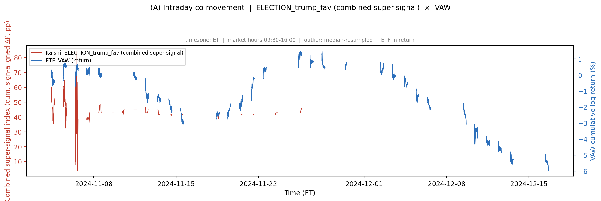
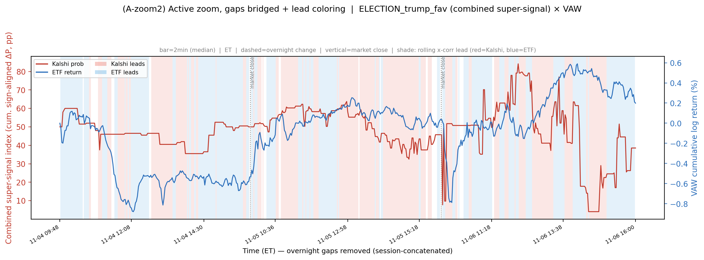
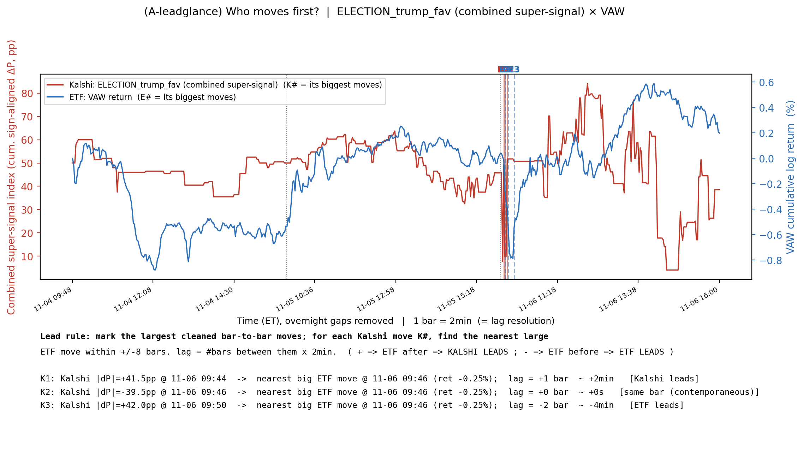
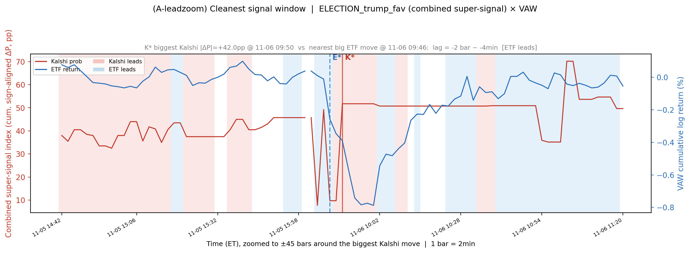
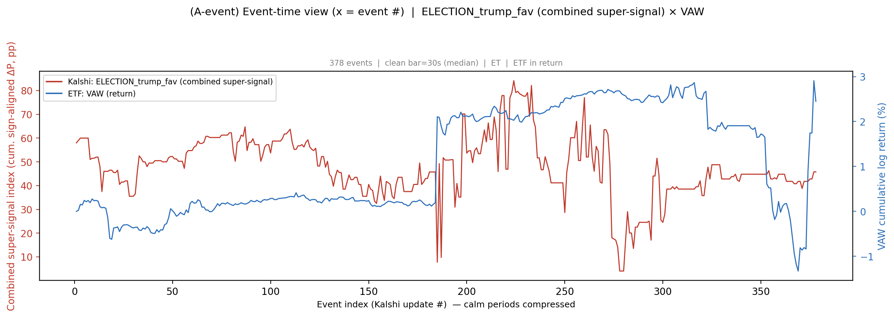
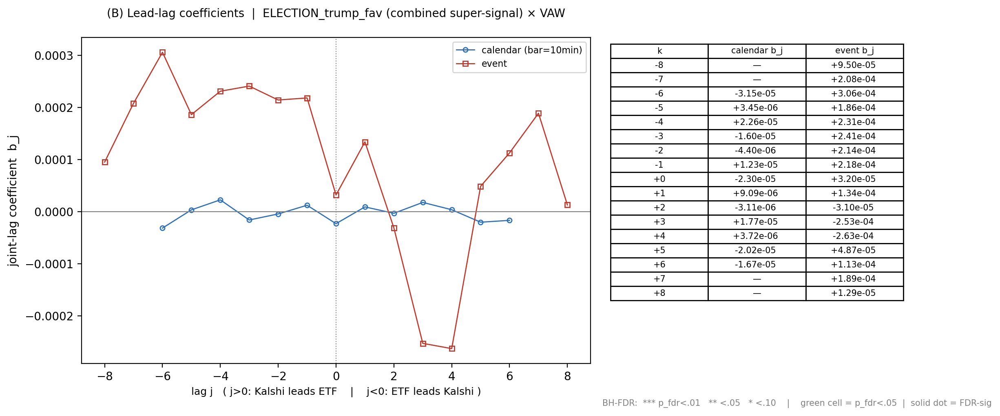


### ELECTION_trump_fav (combined)  ×  VCR

```text
MERGE pseudo-pair:  ELECTION_trump_fav  ×  VCR

'Contract' = combined super-signal (members' sign-aligned Δprob, pooled — NOT a price level):
  +  KXECDJT281, KXECDJT306, KXECDJT312, KXECDJT316
  -  KXECKH276, KXECKH287   (reverse contracts: Δprob flipped)

Pooled regression vs this ETF (per-member FE, day-clustered SE, ADL self-lags by BIC).
Direction counts use RAW p (graded thresholds), k>0 Kalshi-leads / k<0 ETF-leads.

== CALENDAR (primary bar) ==
  K=6  ADL self-lags=3  n_obs=631
  p<0.05: Kalshi-leads 0 / ETF-leads 2   p<0.10: Kalshi-leads 0 / ETF-leads 3   p<0.15: Kalshi-leads 0 / ETF-leads 4

== EVENT (active-event) ==
  K=8  ADL self-lags=0  n_obs=62
  p<0.05: Kalshi-leads 3 / ETF-leads 5   p<0.10: Kalshi-leads 4 / ETF-leads 5   p<0.15: Kalshi-leads 6 / ETF-leads 5

== PROBIT (Pr(ETF up)) ==
  K=8  ADL self-lags=-  n_obs=97
  p<0.05: Kalshi-leads 7 / ETF-leads 8   p<0.10: Kalshi-leads 7 / ETF-leads 8   p<0.15: Kalshi-leads 8 / ETF-leads 8

== Conclusion (calendar+event) ==
  p<0.05: ETF-leads (K3/E7) | p<0.10: ETF-leads (K4/E8) | p<0.15: ETF-leads (K6/E9)
```

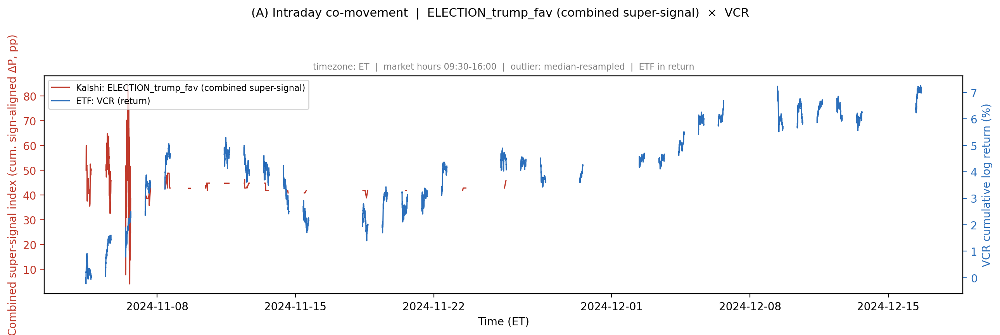
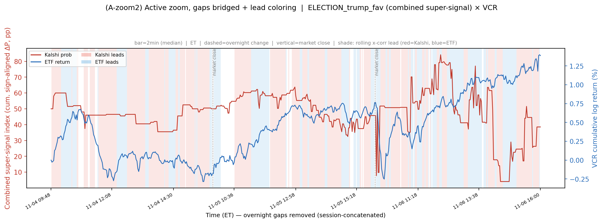
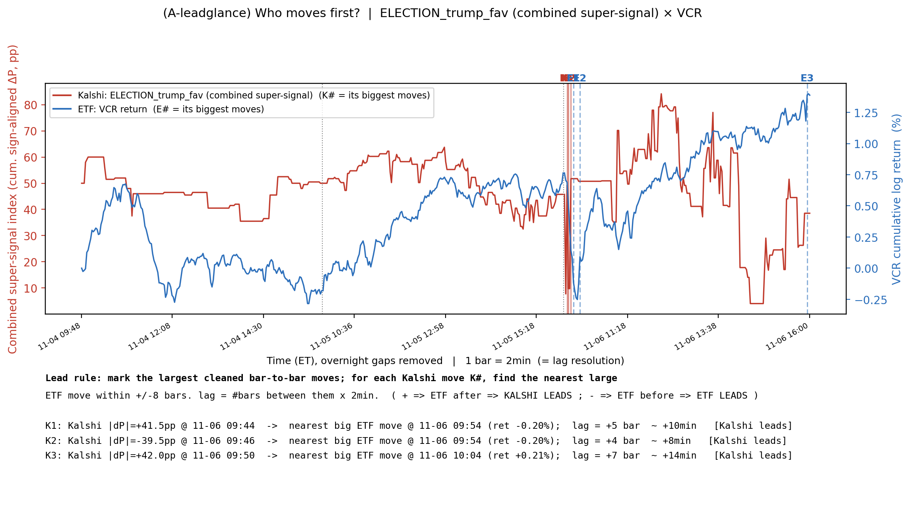
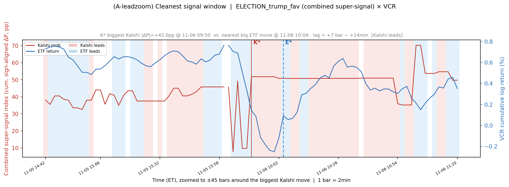
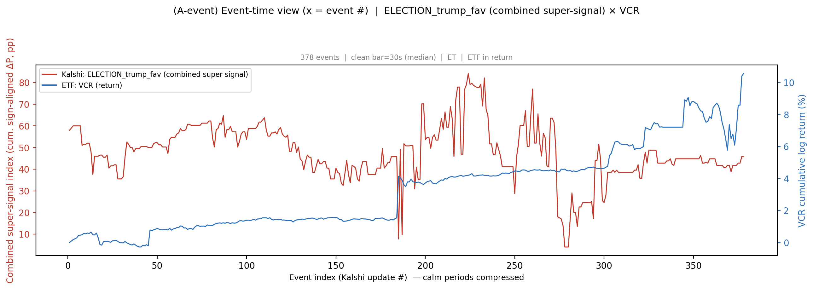
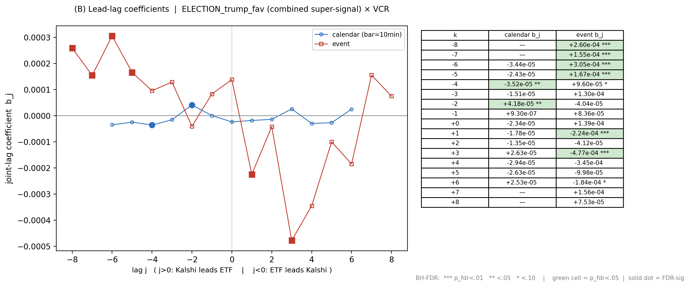


### ELECTION_trump_fav (combined)  ×  VDC

```text
MERGE pseudo-pair:  ELECTION_trump_fav  ×  VDC

'Contract' = combined super-signal (members' sign-aligned Δprob, pooled — NOT a price level):
  +  KXECDJT281, KXECDJT306, KXECDJT312, KXECDJT316
  -  KXECKH276, KXECKH287   (reverse contracts: Δprob flipped)

Pooled regression vs this ETF (per-member FE, day-clustered SE, ADL self-lags by BIC).
Direction counts use RAW p (graded thresholds), k>0 Kalshi-leads / k<0 ETF-leads.

== CALENDAR (primary bar) ==
  K=6  ADL self-lags=1  n_obs=631
  p<0.05: Kalshi-leads 2 / ETF-leads 4   p<0.10: Kalshi-leads 2 / ETF-leads 4   p<0.15: Kalshi-leads 3 / ETF-leads 4

== EVENT (active-event) ==
  K=8  ADL self-lags=1  n_obs=62
  p<0.05: Kalshi-leads 3 / ETF-leads 2   p<0.10: Kalshi-leads 4 / ETF-leads 2   p<0.15: Kalshi-leads 4 / ETF-leads 3

== PROBIT (Pr(ETF up)) ==
  K=8  ADL self-lags=-  n_obs=95
  p<0.05: Kalshi-leads 7 / ETF-leads 7   p<0.10: Kalshi-leads 10 / ETF-leads 8   p<0.15: Kalshi-leads 12 / ETF-leads 8

== Conclusion (calendar+event) ==
  p<0.05: ETF-leads (K5/E6) | p<0.10: balanced/none (K6/E6) | p<0.15: balanced/none (K7/E7)
```

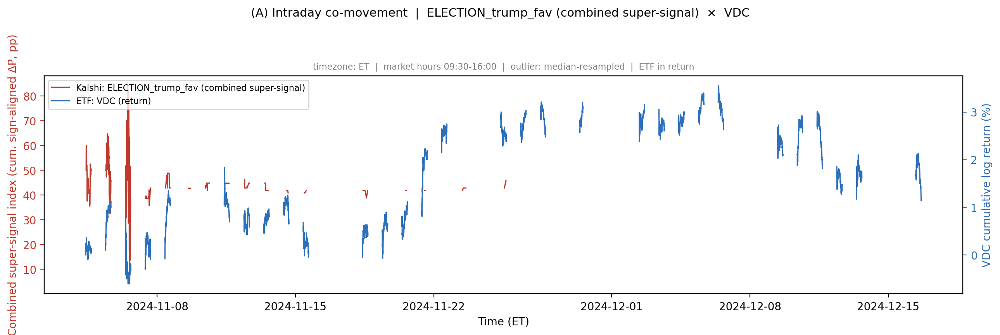
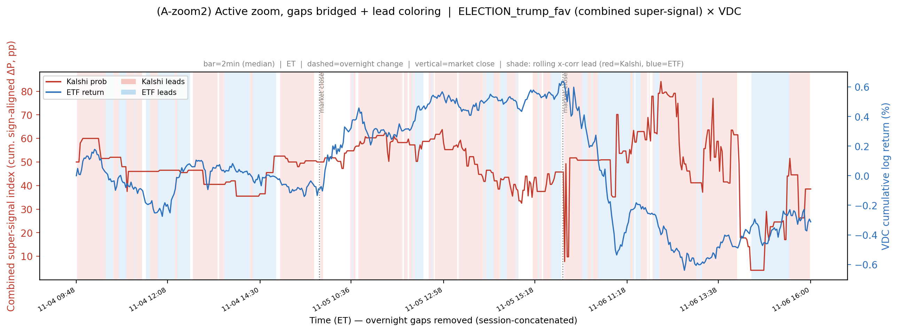
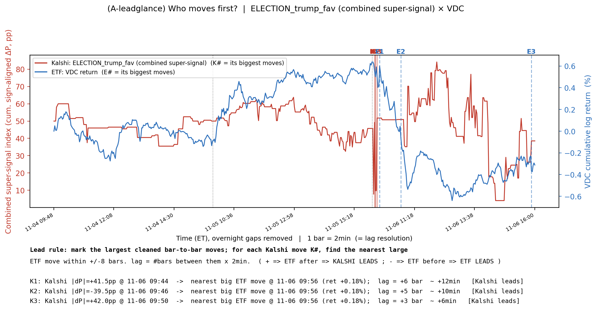
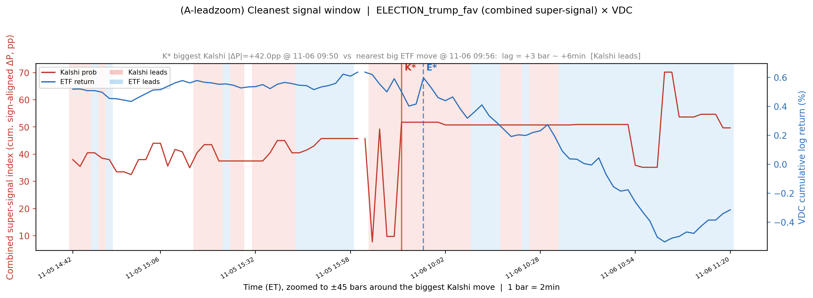
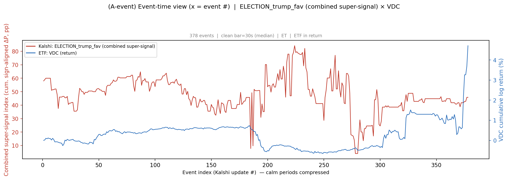
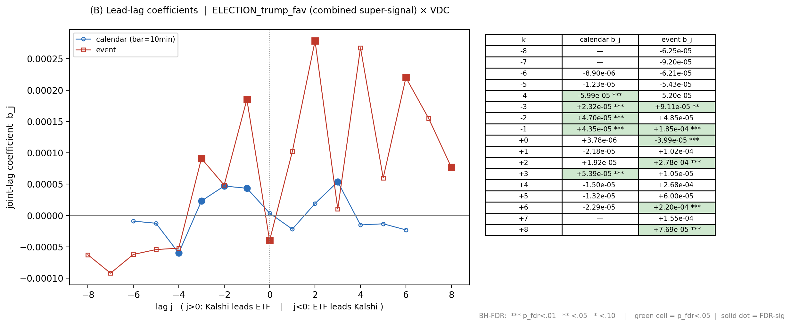


### ELECTION_trump_fav (combined)  ×  VDE

```text
MERGE pseudo-pair:  ELECTION_trump_fav  ×  VDE

'Contract' = combined super-signal (members' sign-aligned Δprob, pooled — NOT a price level):
  +  KXECDJT281, KXECDJT306, KXECDJT312, KXECDJT316
  -  KXECKH276, KXECKH287   (reverse contracts: Δprob flipped)

Pooled regression vs this ETF (per-member FE, day-clustered SE, ADL self-lags by BIC).
Direction counts use RAW p (graded thresholds), k>0 Kalshi-leads / k<0 ETF-leads.

== CALENDAR (primary bar) ==
  K=6  ADL self-lags=1  n_obs=631
  p<0.05: Kalshi-leads 4 / ETF-leads 3   p<0.10: Kalshi-leads 4 / ETF-leads 3   p<0.15: Kalshi-leads 4 / ETF-leads 3

== EVENT (active-event) ==
  K=8  ADL self-lags=0  n_obs=62
  p<0.05: Kalshi-leads 5 / ETF-leads 6   p<0.10: Kalshi-leads 6 / ETF-leads 6   p<0.15: Kalshi-leads 6 / ETF-leads 6

== PROBIT (Pr(ETF up)) ==
  K=8  ADL self-lags=-  n_obs=96
  p<0.05: Kalshi-leads 5 / ETF-leads 6   p<0.10: Kalshi-leads 6 / ETF-leads 8   p<0.15: Kalshi-leads 6 / ETF-leads 9

== Conclusion (calendar+event) ==
  p<0.05: balanced/none (K9/E9) | p<0.10: Kalshi-leads (K10/E9) | p<0.15: Kalshi-leads (K10/E9)
```

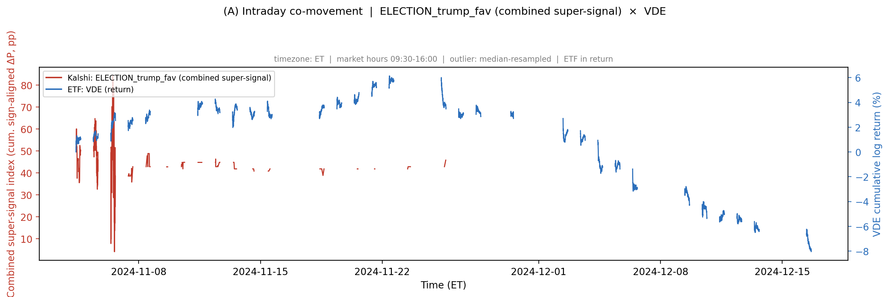
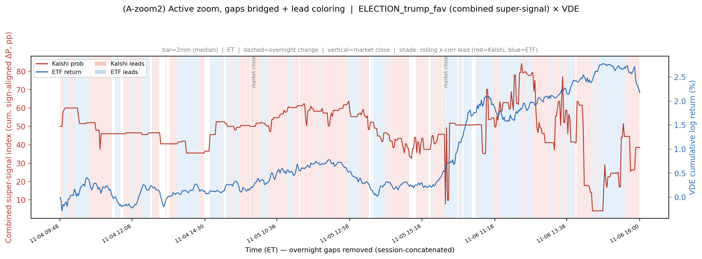
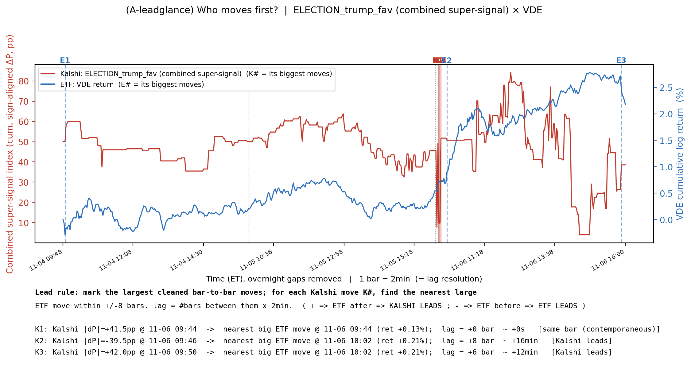
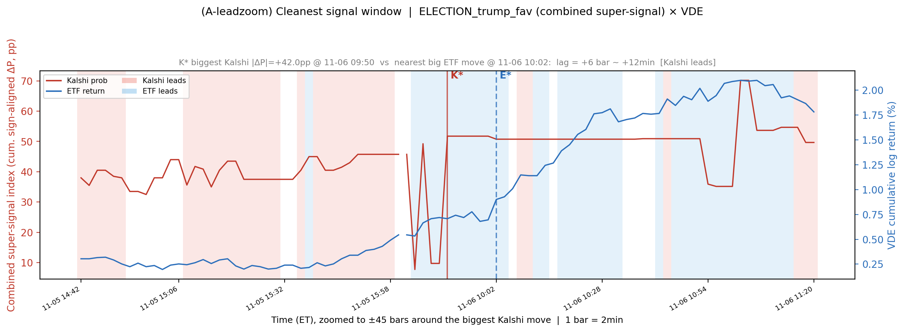
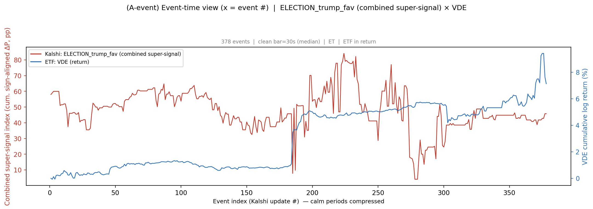
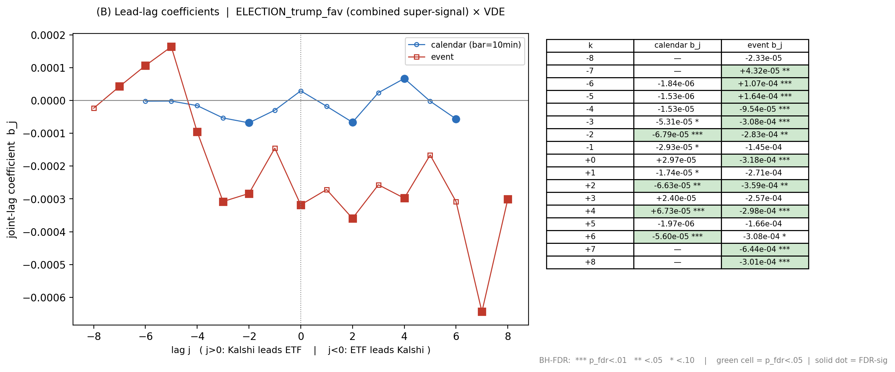


### ELECTION_trump_fav (combined)  ×  VFH

```text
MERGE pseudo-pair:  ELECTION_trump_fav  ×  VFH

'Contract' = combined super-signal (members' sign-aligned Δprob, pooled — NOT a price level):
  +  KXECDJT281, KXECDJT306, KXECDJT312, KXECDJT316
  -  KXECKH276, KXECKH287   (reverse contracts: Δprob flipped)

Pooled regression vs this ETF (per-member FE, day-clustered SE, ADL self-lags by BIC).
Direction counts use RAW p (graded thresholds), k>0 Kalshi-leads / k<0 ETF-leads.

== CALENDAR (primary bar) ==
  K=6  ADL self-lags=1  n_obs=631
  p<0.05: Kalshi-leads 0 / ETF-leads 0   p<0.10: Kalshi-leads 1 / ETF-leads 1   p<0.15: Kalshi-leads 1 / ETF-leads 2

== EVENT (active-event) ==
  K=8  ADL self-lags=1  n_obs=62
  p<0.05: Kalshi-leads 4 / ETF-leads 4   p<0.10: Kalshi-leads 5 / ETF-leads 5   p<0.15: Kalshi-leads 6 / ETF-leads 5

== PROBIT (Pr(ETF up)) ==
  K=8  ADL self-lags=-  n_obs=91
  p<0.05: Kalshi-leads 4 / ETF-leads 3   p<0.10: Kalshi-leads 8 / ETF-leads 5   p<0.15: Kalshi-leads 9 / ETF-leads 6

== Conclusion (calendar+event) ==
  p<0.05: balanced/none (K4/E4) | p<0.10: balanced/none (K6/E6) | p<0.15: balanced/none (K7/E7)
```

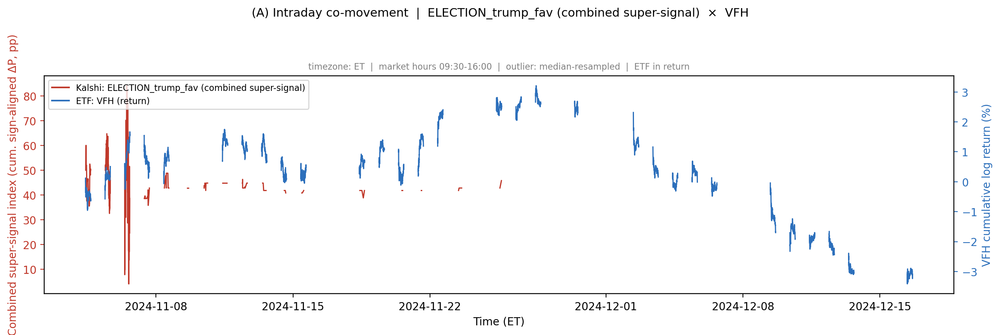
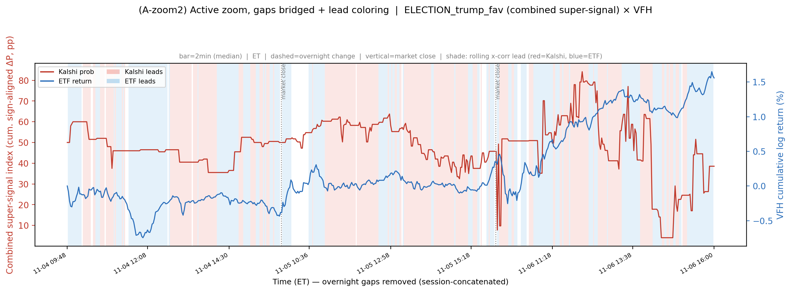
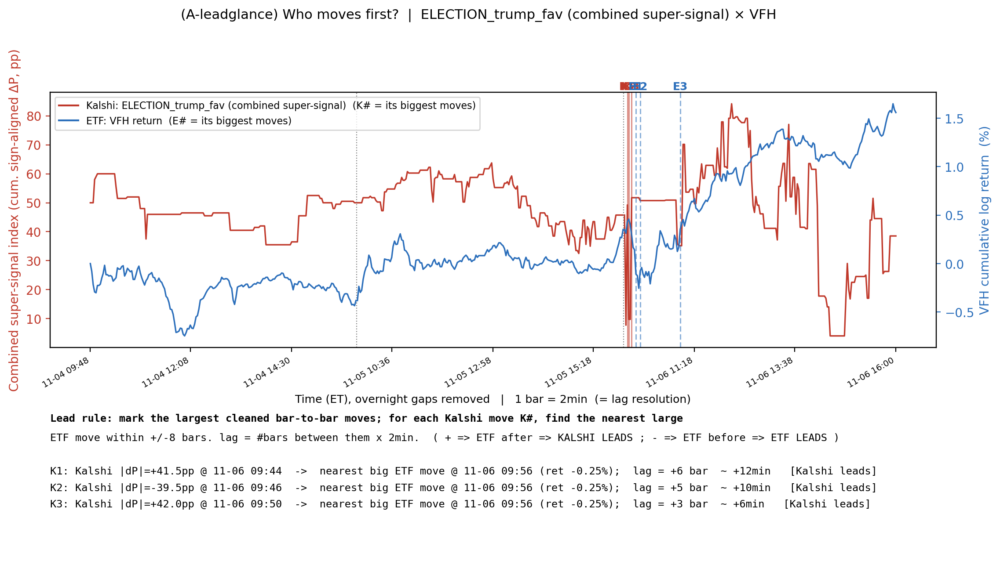
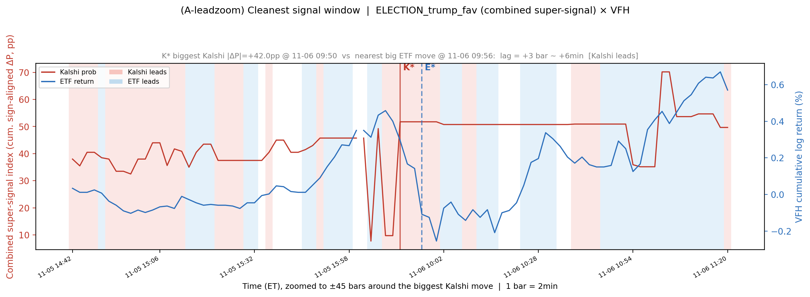
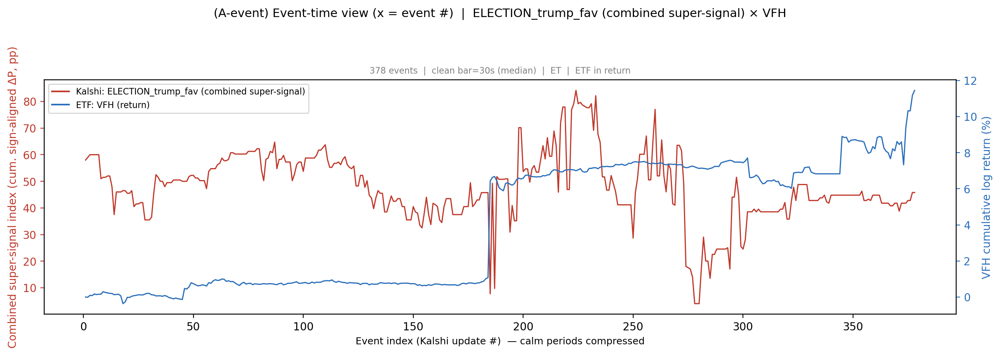
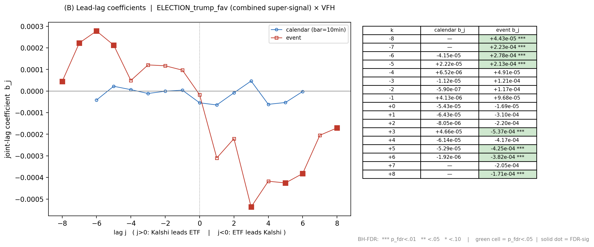


### ELECTION_trump_fav (combined)  ×  VGT

```text
MERGE pseudo-pair:  ELECTION_trump_fav  ×  VGT

'Contract' = combined super-signal (members' sign-aligned Δprob, pooled — NOT a price level):
  +  KXECDJT281, KXECDJT306, KXECDJT312, KXECDJT316
  -  KXECKH276, KXECKH287   (reverse contracts: Δprob flipped)

Pooled regression vs this ETF (per-member FE, day-clustered SE, ADL self-lags by BIC).
Direction counts use RAW p (graded thresholds), k>0 Kalshi-leads / k<0 ETF-leads.

== CALENDAR (primary bar) ==
  K=6  ADL self-lags=4  n_obs=631
  p<0.05: Kalshi-leads 2 / ETF-leads 1   p<0.10: Kalshi-leads 2 / ETF-leads 1   p<0.15: Kalshi-leads 2 / ETF-leads 1

== EVENT (active-event) ==
  K=8  ADL self-lags=0  n_obs=62
  p<0.05: Kalshi-leads 3 / ETF-leads 3   p<0.10: Kalshi-leads 4 / ETF-leads 4   p<0.15: Kalshi-leads 4 / ETF-leads 4

== PROBIT (Pr(ETF up)) ==
  K=8  ADL self-lags=-  n_obs=98
  p<0.05: Kalshi-leads 7 / ETF-leads 6   p<0.10: Kalshi-leads 9 / ETF-leads 9   p<0.15: Kalshi-leads 9 / ETF-leads 10

== Conclusion (calendar+event) ==
  p<0.05: Kalshi-leads (K5/E4) | p<0.10: Kalshi-leads (K6/E5) | p<0.15: Kalshi-leads (K6/E5)
```

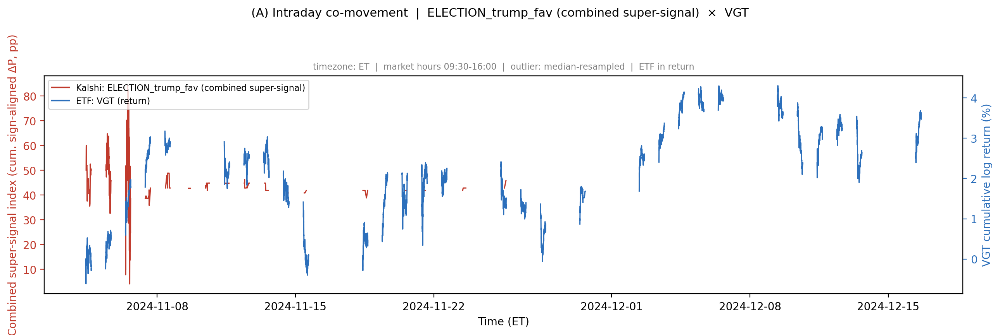
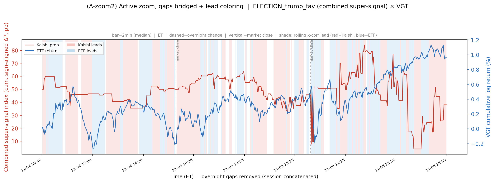
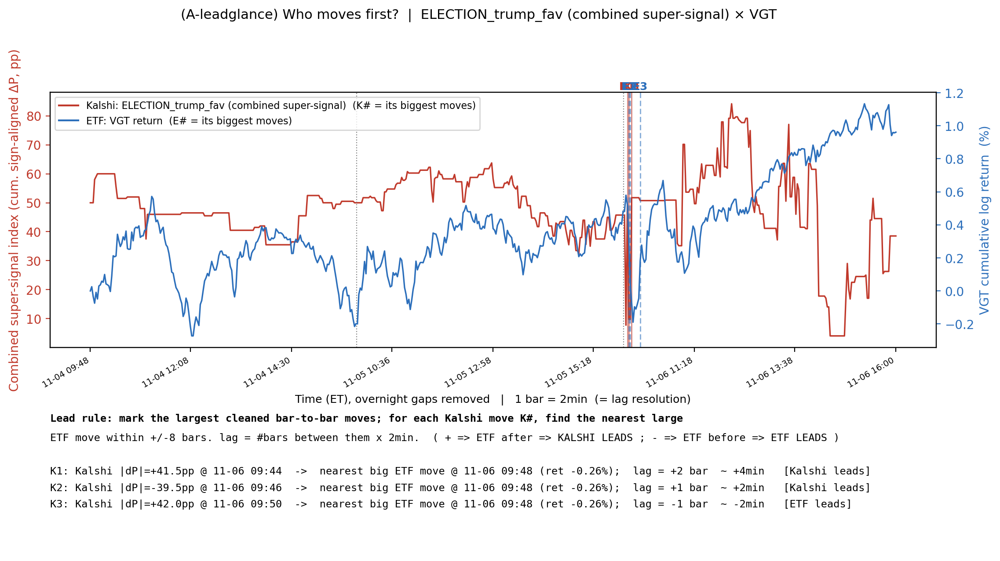
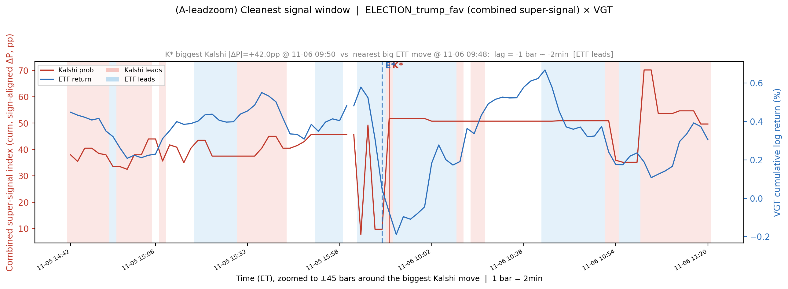
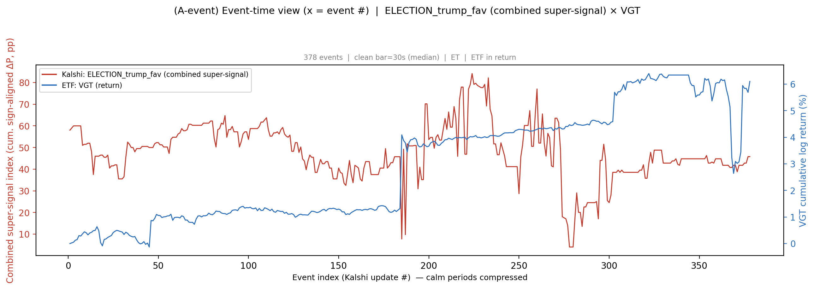
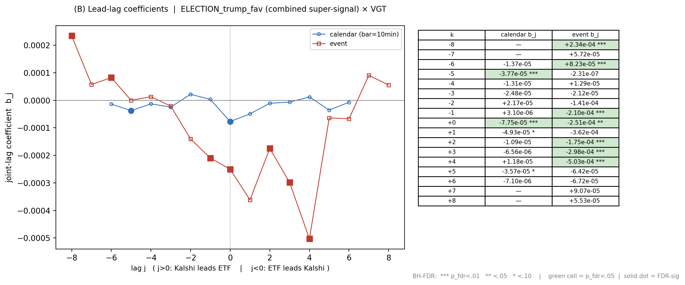


### ELECTION_trump_fav (combined)  ×  VIS

```text
MERGE pseudo-pair:  ELECTION_trump_fav  ×  VIS

'Contract' = combined super-signal (members' sign-aligned Δprob, pooled — NOT a price level):
  +  KXECDJT281, KXECDJT306, KXECDJT312, KXECDJT316
  -  KXECKH276, KXECKH287   (reverse contracts: Δprob flipped)

Pooled regression vs this ETF (per-member FE, day-clustered SE, ADL self-lags by BIC).
Direction counts use RAW p (graded thresholds), k>0 Kalshi-leads / k<0 ETF-leads.

== CALENDAR (primary bar) ==
  K=6  ADL self-lags=6  n_obs=631
  p<0.05: Kalshi-leads 3 / ETF-leads 2   p<0.10: Kalshi-leads 3 / ETF-leads 2   p<0.15: Kalshi-leads 4 / ETF-leads 2

== EVENT (active-event) ==
  K=8  ADL self-lags=2  n_obs=62
  p<0.05: Kalshi-leads 7 / ETF-leads 1   p<0.10: Kalshi-leads 7 / ETF-leads 1   p<0.15: Kalshi-leads 7 / ETF-leads 1

== PROBIT (Pr(ETF up)) ==
  K=8  ADL self-lags=-  n_obs=97
  p<0.05: Kalshi-leads 7 / ETF-leads 4   p<0.10: Kalshi-leads 7 / ETF-leads 7   p<0.15: Kalshi-leads 8 / ETF-leads 7

== Conclusion (calendar+event) ==
  p<0.05: Kalshi-leads (K10/E3) | p<0.10: Kalshi-leads (K10/E3) | p<0.15: Kalshi-leads (K11/E3)
```

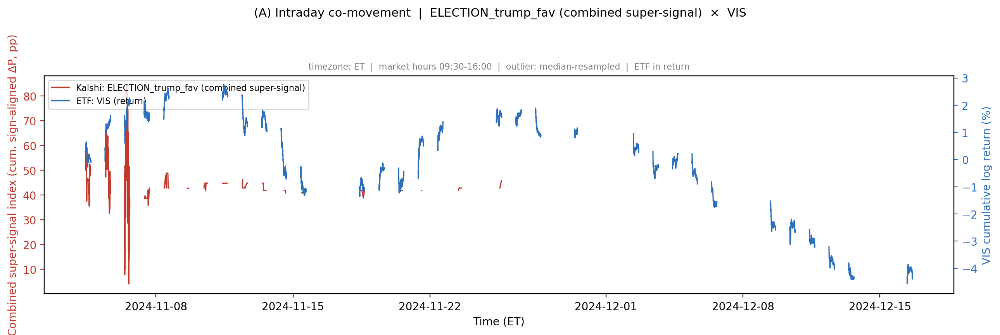
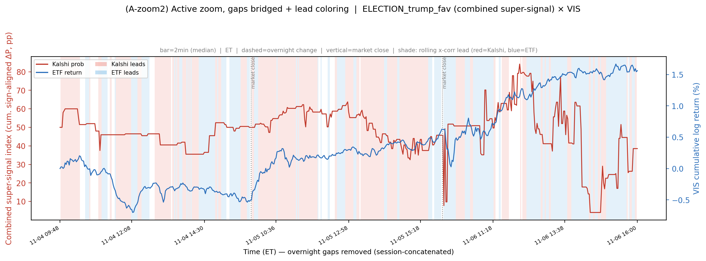

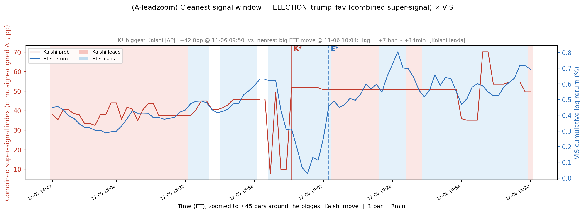
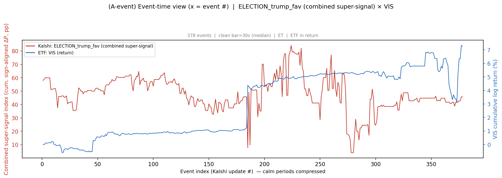
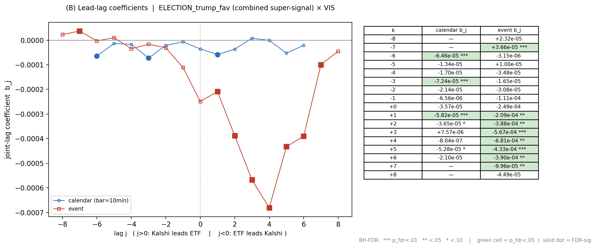


### ELECTION_trump_fav (combined)  ×  VNQ

```text
MERGE pseudo-pair:  ELECTION_trump_fav  ×  VNQ

'Contract' = combined super-signal (members' sign-aligned Δprob, pooled — NOT a price level):
  +  KXECDJT281, KXECDJT306, KXECDJT312, KXECDJT316
  -  KXECKH276, KXECKH287   (reverse contracts: Δprob flipped)

Pooled regression vs this ETF (per-member FE, day-clustered SE, ADL self-lags by BIC).
Direction counts use RAW p (graded thresholds), k>0 Kalshi-leads / k<0 ETF-leads.

== CALENDAR (primary bar) ==
  K=6  ADL self-lags=3  n_obs=631
  p<0.05: Kalshi-leads 4 / ETF-leads 3   p<0.10: Kalshi-leads 4 / ETF-leads 3   p<0.15: Kalshi-leads 4 / ETF-leads 3

== EVENT (active-event) ==
  K=8  ADL self-lags=0  n_obs=62
  p<0.05: Kalshi-leads 3 / ETF-leads 3   p<0.10: Kalshi-leads 3 / ETF-leads 3   p<0.15: Kalshi-leads 3 / ETF-leads 3

== PROBIT (Pr(ETF up)) ==
  K=8  ADL self-lags=-  n_obs=95
  p<0.05: Kalshi-leads 3 / ETF-leads 7   p<0.10: Kalshi-leads 7 / ETF-leads 9   p<0.15: Kalshi-leads 8 / ETF-leads 9

== Conclusion (calendar+event) ==
  p<0.05: Kalshi-leads (K7/E6) | p<0.10: Kalshi-leads (K7/E6) | p<0.15: Kalshi-leads (K7/E6)
```

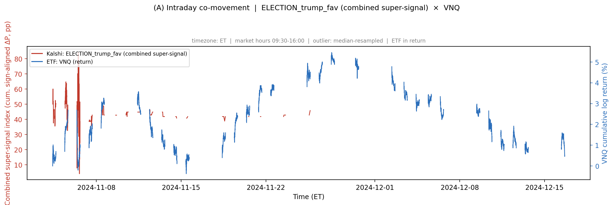
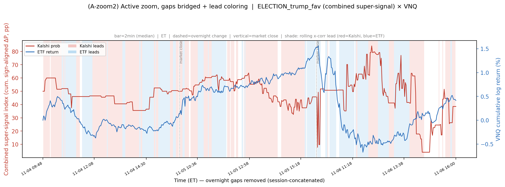
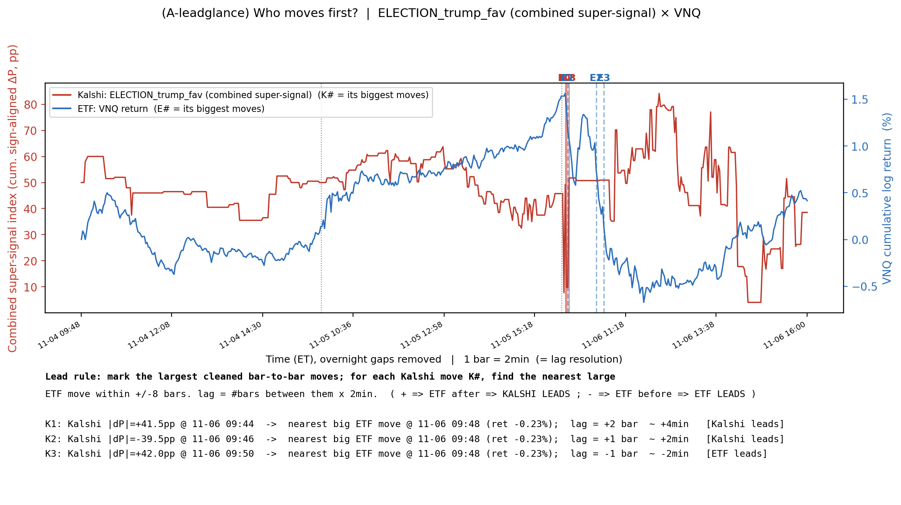
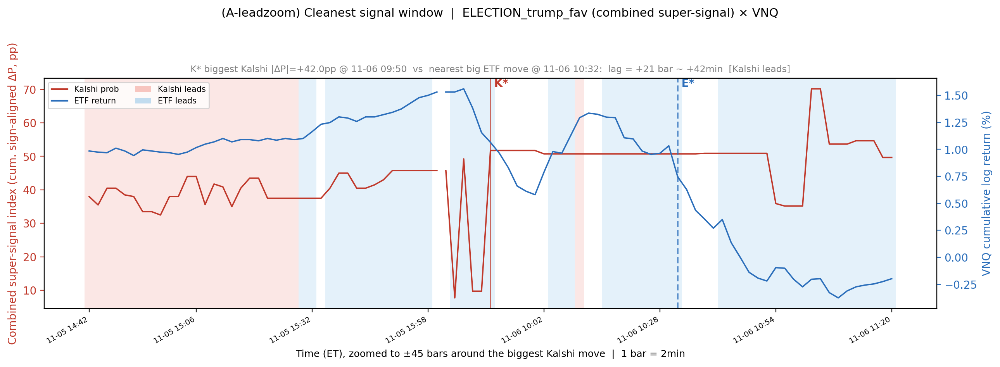
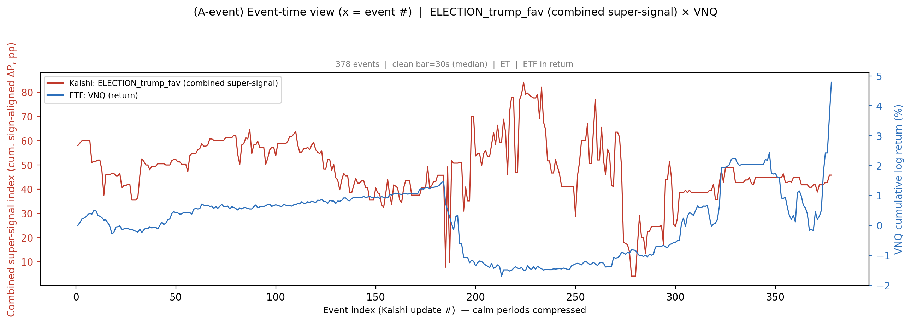
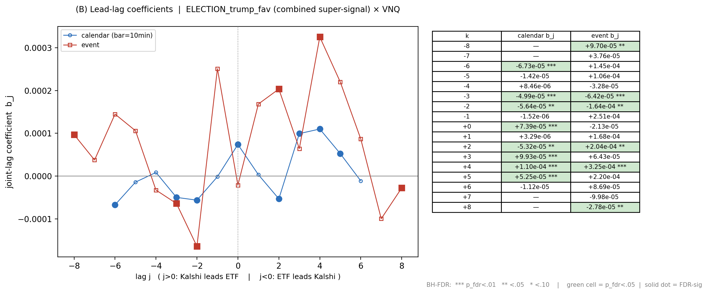


### ELECTION_trump_fav (combined)  ×  VOX

```text
MERGE pseudo-pair:  ELECTION_trump_fav  ×  VOX

'Contract' = combined super-signal (members' sign-aligned Δprob, pooled — NOT a price level):
  +  KXECDJT281, KXECDJT306, KXECDJT312, KXECDJT316
  -  KXECKH276, KXECKH287   (reverse contracts: Δprob flipped)

Pooled regression vs this ETF (per-member FE, day-clustered SE, ADL self-lags by BIC).
Direction counts use RAW p (graded thresholds), k>0 Kalshi-leads / k<0 ETF-leads.

== CALENDAR (primary bar) ==
  K=6  ADL self-lags=1  n_obs=631
  p<0.05: Kalshi-leads 1 / ETF-leads 3   p<0.10: Kalshi-leads 1 / ETF-leads 4   p<0.15: Kalshi-leads 1 / ETF-leads 5

== EVENT (active-event) ==
  K=8  ADL self-lags=0  n_obs=62
  p<0.05: Kalshi-leads 1 / ETF-leads 1   p<0.10: Kalshi-leads 3 / ETF-leads 2   p<0.15: Kalshi-leads 3 / ETF-leads 2

== PROBIT (Pr(ETF up)) ==
  K=8  ADL self-lags=-  n_obs=94
  p<0.05: Kalshi-leads 8 / ETF-leads 9   p<0.10: Kalshi-leads 8 / ETF-leads 9   p<0.15: Kalshi-leads 10 / ETF-leads 10

== Conclusion (calendar+event) ==
  p<0.05: ETF-leads (K2/E4) | p<0.10: ETF-leads (K4/E6) | p<0.15: ETF-leads (K4/E7)
```

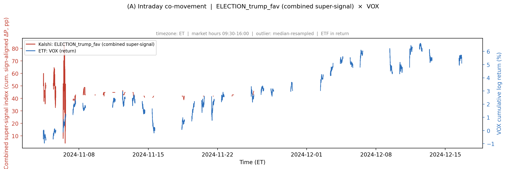
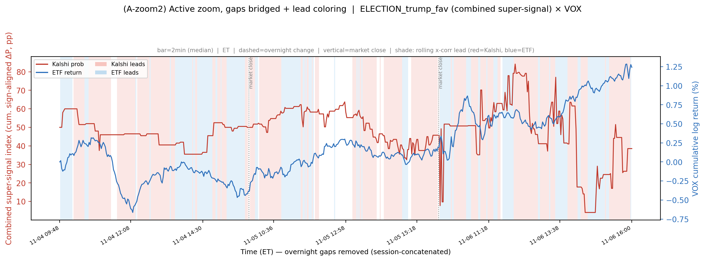
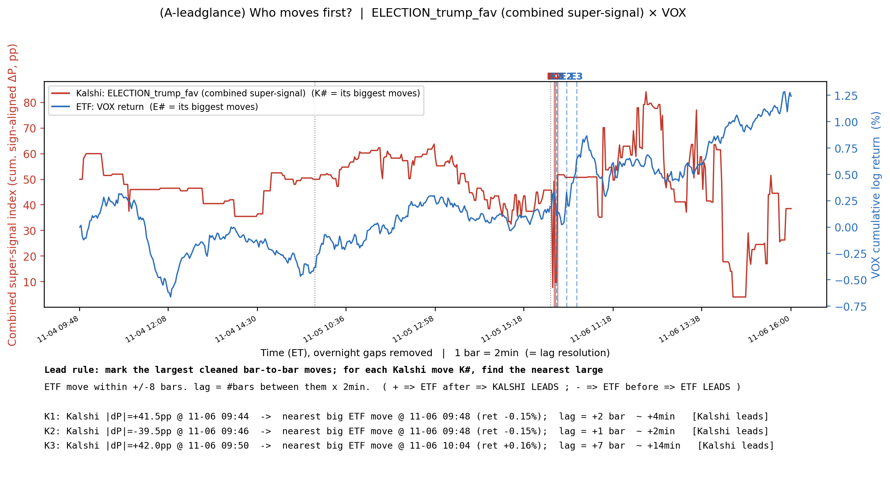
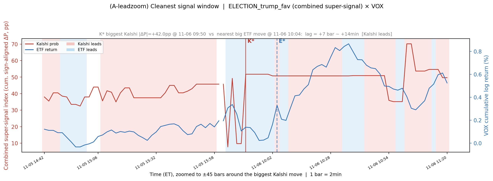
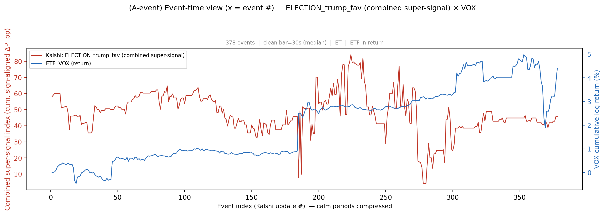
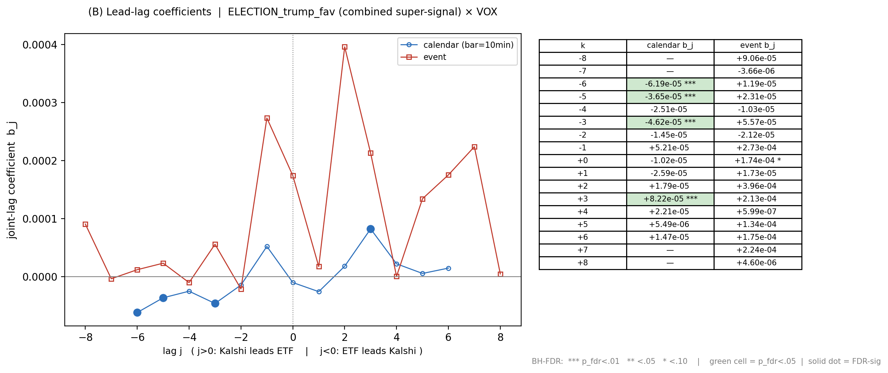

---

## MERGE — FOMC_easing  (pooled overview)

```text
MERGE super-signal:  FOMC_easing

Members pooled (sign-aligned Δprob, never concatenated price levels):
  +  FEDDECISION-24SEP-C25, RATECUT-24SEP18, KXFEDDECISION-24DEC-C25
  -  FEDDECISION-24NOV-H0, KXFEDDECISION-24DEC-H0   (reverse contracts: Δprob flipped so +Δ = same direction)
Relevant-ETF union (9): VCR, VDC, VDE, VFH, VGT, VIS, VNQ, VOX, VPU

Pooling engine: per-member lag/ADL shift, member fixed effects, day-clustered SE;
ADL self-lag order chosen per pooled regression by BIC (column n_ylags).
Direction counts below use RAW p (same graded-threshold convention as the single-pair report).

== CALENDAR (primary bar) ==
ETF      K  ADL   n_obs   Kalshi-leads(k>0) / ETF-leads(k<0)
VCR     10    1    1513   p<0.05: K0/E0  p<0.10: K1/E1  p<0.15: K1/E2
VDC     10    1    1513   p<0.05: K2/E2  p<0.10: K3/E3  p<0.15: K4/E4
VDE     10    0    1513   p<0.05: K2/E2  p<0.10: K3/E2  p<0.15: K4/E3
VFH     10    1    1513   p<0.05: K1/E1  p<0.10: K1/E1  p<0.15: K1/E1
VGT     10    2    1517   p<0.05: K1/E1  p<0.10: K1/E1  p<0.15: K2/E2
VIS     10    0    1513   p<0.05: K1/E2  p<0.10: K1/E2  p<0.15: K2/E2
VNQ     10    1    1517   p<0.05: K3/E1  p<0.10: K3/E1  p<0.15: K3/E2
VOX     10    1    1513   p<0.05: K2/E0  p<0.10: K2/E1  p<0.15: K3/E1
VPU     10    1    1513   p<0.05: K1/E3  p<0.10: K2/E3  p<0.15: K2/E4

== EVENT (active-event subsequence) ==
ETF      K  ADL   n_obs   Kalshi-leads(k>0) / ETF-leads(k<0)
VCR     10    1     547   p<0.05: K0/E1  p<0.10: K0/E1  p<0.15: K0/E1
VDC     10    1     547   p<0.05: K1/E0  p<0.10: K2/E1  p<0.15: K3/E1
VDE     10    0     547   p<0.05: K0/E1  p<0.10: K0/E1  p<0.15: K2/E4
VFH     10    1     547   p<0.05: K0/E0  p<0.10: K1/E0  p<0.15: K1/E0
VGT     10    1     547   p<0.05: K0/E1  p<0.10: K1/E1  p<0.15: K2/E1
VIS     10    1     547   p<0.05: K0/E0  p<0.10: K0/E1  p<0.15: K1/E1
VNQ     10    1     547   p<0.05: K1/E1  p<0.10: K2/E1  p<0.15: K2/E1
VOX     10    1     547   p<0.05: K1/E1  p<0.10: K3/E1  p<0.15: K3/E3
VPU     10    0     547   p<0.05: K0/E1  p<0.10: K1/E2  p<0.15: K3/E3

== PROBIT (direction test Pr(ETF up)) ==
ETF      K  ADL   n_obs   Kalshi-leads(k>0) / ETF-leads(k<0)
VCR     10    -     528   p<0.05: K3/E0  p<0.10: K4/E2  p<0.15: K5/E3
VDC     10    -     524   p<0.05: K1/E2  p<0.10: K3/E2  p<0.15: K3/E3
VDE     10    -     518   p<0.05: K0/E2  p<0.10: K3/E4  p<0.15: K4/E5
VFH     10    -     504   p<0.05: K4/E2  p<0.10: K6/E2  p<0.15: K8/E4
VGT     10    -     530   p<0.05: K2/E2  p<0.10: K4/E3  p<0.15: K4/E3
VIS     10    -     522   p<0.05: K1/E3  p<0.10: K3/E5  p<0.15: K5/E6
VNQ     10    -     507   p<0.05: K5/E3  p<0.10: K6/E4  p<0.15: K7/E5
VOX     10    -     511   p<0.05: K0/E0  p<0.10: K3/E1  p<0.15: K3/E3
VPU     10    -     519   p<0.05: K4/E2  p<0.10: K5/E3  p<0.15: K5/E5

== Conclusion (calendar+event pooled across the group's ETFs) ==
  p<0.05: ETF-leads (K54/E55) | p<0.10: Kalshi-leads (K85/E80) | p<0.15: ETF-leads (K105/E114)
  Read alongside the single-pair tally; pooling buys df but the lead is in the sign, not magnitude.
```


### FOMC_easing (combined)  ×  VCR

```text
MERGE pseudo-pair:  FOMC_easing  ×  VCR

'Contract' = combined super-signal (members' sign-aligned Δprob, pooled — NOT a price level):
  +  FEDDECISION-24SEP-C25, RATECUT-24SEP18, KXFEDDECISION-24DEC-C25
  -  FEDDECISION-24NOV-H0, KXFEDDECISION-24DEC-H0   (reverse contracts: Δprob flipped)

Pooled regression vs this ETF (per-member FE, day-clustered SE, ADL self-lags by BIC).
Direction counts use RAW p (graded thresholds), k>0 Kalshi-leads / k<0 ETF-leads.

== CALENDAR (primary bar) ==
  K=10  ADL self-lags=1  n_obs=1513
  p<0.05: Kalshi-leads 0 / ETF-leads 0   p<0.10: Kalshi-leads 1 / ETF-leads 1   p<0.15: Kalshi-leads 1 / ETF-leads 2

== EVENT (active-event) ==
  K=10  ADL self-lags=1  n_obs=547
  p<0.05: Kalshi-leads 0 / ETF-leads 1   p<0.10: Kalshi-leads 0 / ETF-leads 1   p<0.15: Kalshi-leads 0 / ETF-leads 1

== PROBIT (Pr(ETF up)) ==
  K=10  ADL self-lags=-  n_obs=528
  p<0.05: Kalshi-leads 3 / ETF-leads 0   p<0.10: Kalshi-leads 4 / ETF-leads 2   p<0.15: Kalshi-leads 5 / ETF-leads 3

== Conclusion (calendar+event) ==
  p<0.05: ETF-leads (K0/E1) | p<0.10: ETF-leads (K1/E2) | p<0.15: ETF-leads (K1/E3)
```

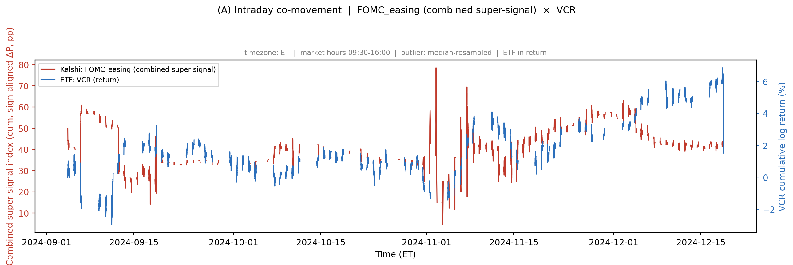
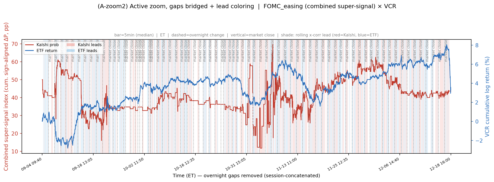
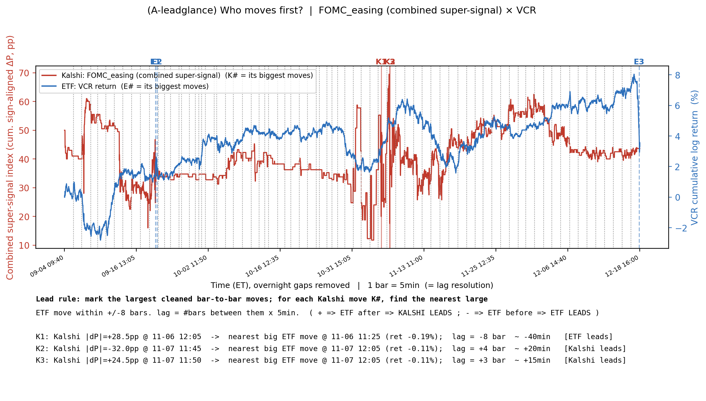
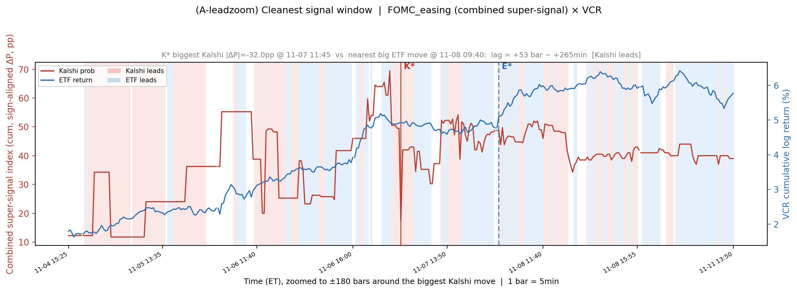
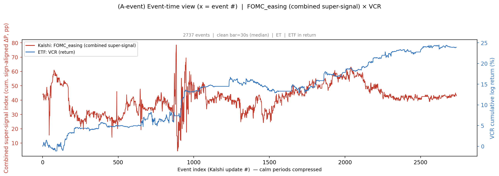
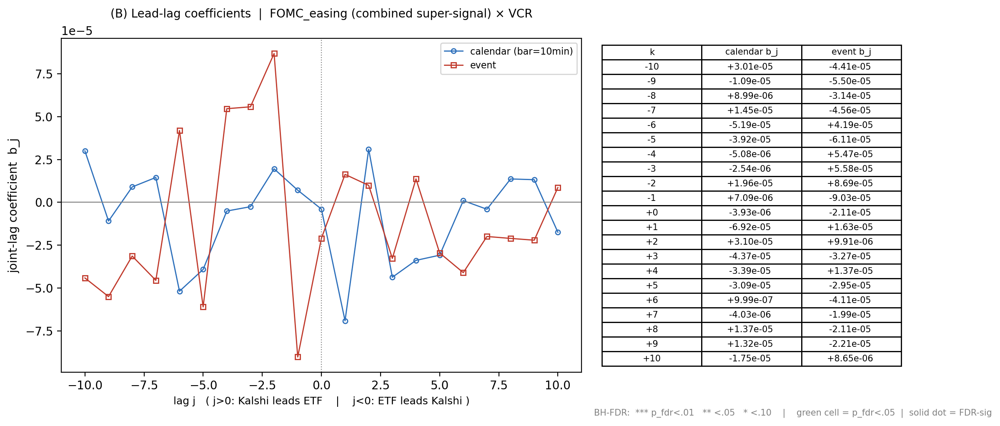


### FOMC_easing (combined)  ×  VDC

```text
MERGE pseudo-pair:  FOMC_easing  ×  VDC

'Contract' = combined super-signal (members' sign-aligned Δprob, pooled — NOT a price level):
  +  FEDDECISION-24SEP-C25, RATECUT-24SEP18, KXFEDDECISION-24DEC-C25
  -  FEDDECISION-24NOV-H0, KXFEDDECISION-24DEC-H0   (reverse contracts: Δprob flipped)

Pooled regression vs this ETF (per-member FE, day-clustered SE, ADL self-lags by BIC).
Direction counts use RAW p (graded thresholds), k>0 Kalshi-leads / k<0 ETF-leads.

== CALENDAR (primary bar) ==
  K=10  ADL self-lags=1  n_obs=1513
  p<0.05: Kalshi-leads 2 / ETF-leads 2   p<0.10: Kalshi-leads 3 / ETF-leads 3   p<0.15: Kalshi-leads 4 / ETF-leads 4

== EVENT (active-event) ==
  K=10  ADL self-lags=1  n_obs=547
  p<0.05: Kalshi-leads 1 / ETF-leads 0   p<0.10: Kalshi-leads 2 / ETF-leads 1   p<0.15: Kalshi-leads 3 / ETF-leads 1

== PROBIT (Pr(ETF up)) ==
  K=10  ADL self-lags=-  n_obs=524
  p<0.05: Kalshi-leads 1 / ETF-leads 2   p<0.10: Kalshi-leads 3 / ETF-leads 2   p<0.15: Kalshi-leads 3 / ETF-leads 3

== Conclusion (calendar+event) ==
  p<0.05: Kalshi-leads (K3/E2) | p<0.10: Kalshi-leads (K5/E4) | p<0.15: Kalshi-leads (K7/E5)
```

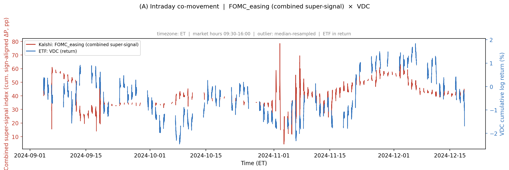
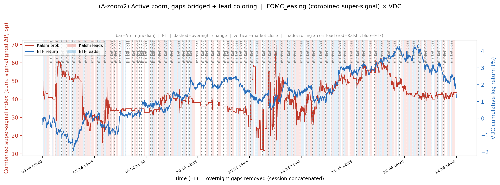
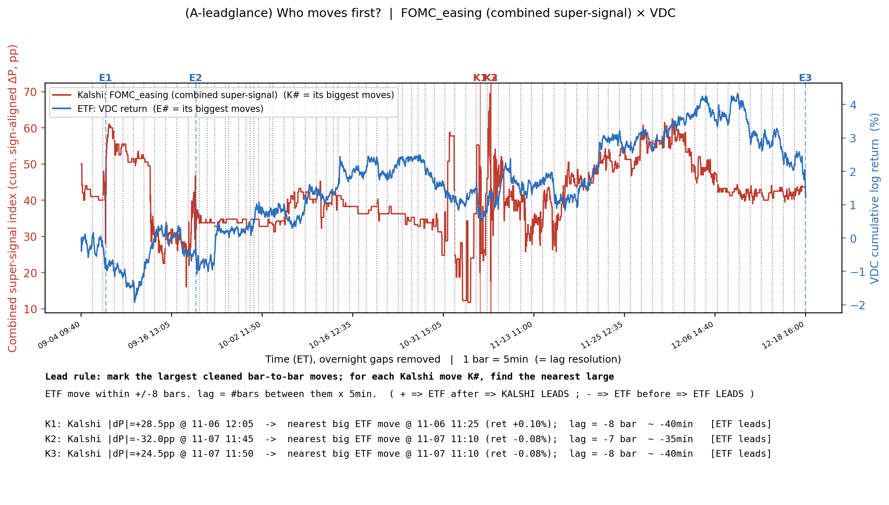
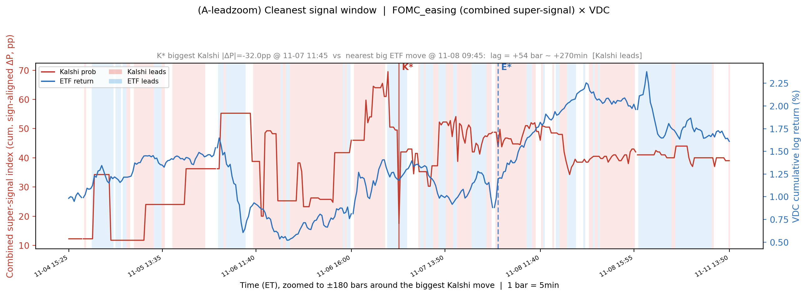
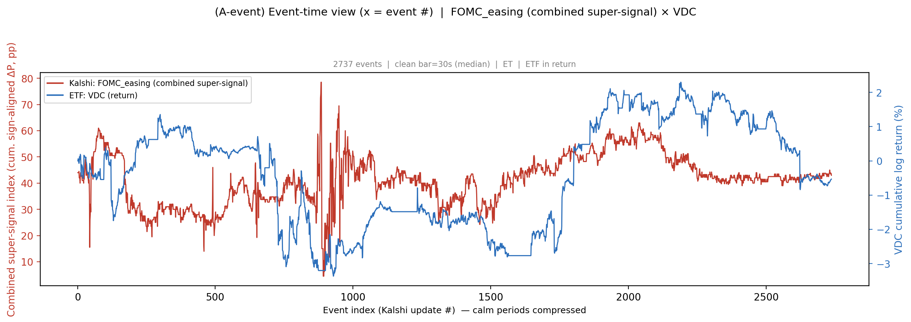
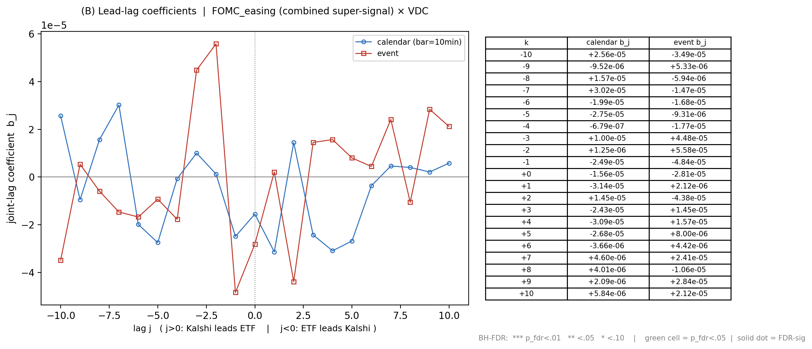


### FOMC_easing (combined)  ×  VDE

```text
MERGE pseudo-pair:  FOMC_easing  ×  VDE

'Contract' = combined super-signal (members' sign-aligned Δprob, pooled — NOT a price level):
  +  FEDDECISION-24SEP-C25, RATECUT-24SEP18, KXFEDDECISION-24DEC-C25
  -  FEDDECISION-24NOV-H0, KXFEDDECISION-24DEC-H0   (reverse contracts: Δprob flipped)

Pooled regression vs this ETF (per-member FE, day-clustered SE, ADL self-lags by BIC).
Direction counts use RAW p (graded thresholds), k>0 Kalshi-leads / k<0 ETF-leads.

== CALENDAR (primary bar) ==
  K=10  ADL self-lags=0  n_obs=1513
  p<0.05: Kalshi-leads 2 / ETF-leads 2   p<0.10: Kalshi-leads 3 / ETF-leads 2   p<0.15: Kalshi-leads 4 / ETF-leads 3

== EVENT (active-event) ==
  K=10  ADL self-lags=0  n_obs=547
  p<0.05: Kalshi-leads 0 / ETF-leads 1   p<0.10: Kalshi-leads 0 / ETF-leads 1   p<0.15: Kalshi-leads 2 / ETF-leads 4

== PROBIT (Pr(ETF up)) ==
  K=10  ADL self-lags=-  n_obs=518
  p<0.05: Kalshi-leads 0 / ETF-leads 2   p<0.10: Kalshi-leads 3 / ETF-leads 4   p<0.15: Kalshi-leads 4 / ETF-leads 5

== Conclusion (calendar+event) ==
  p<0.05: ETF-leads (K2/E3) | p<0.10: balanced/none (K3/E3) | p<0.15: ETF-leads (K6/E7)
```

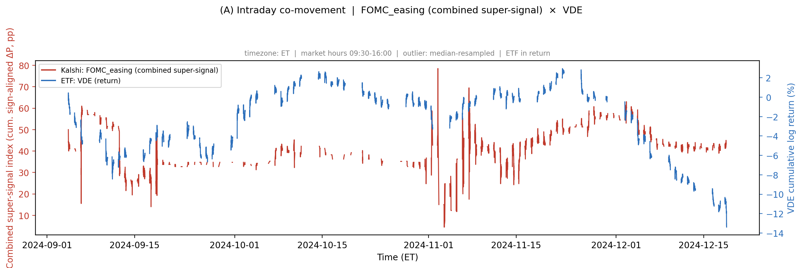
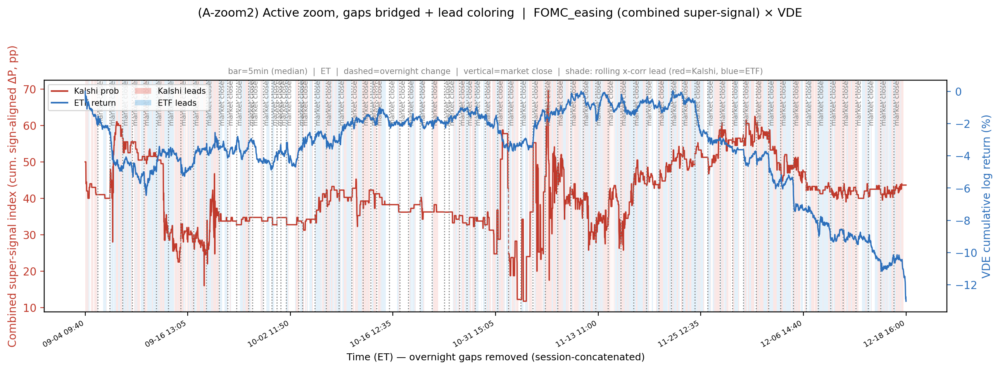
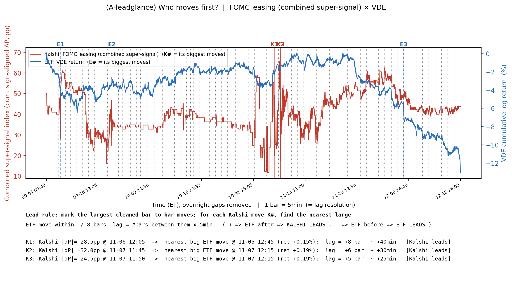
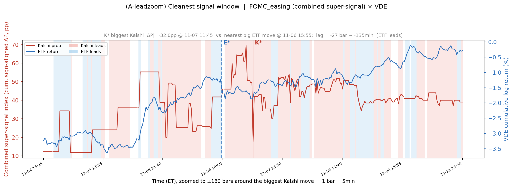
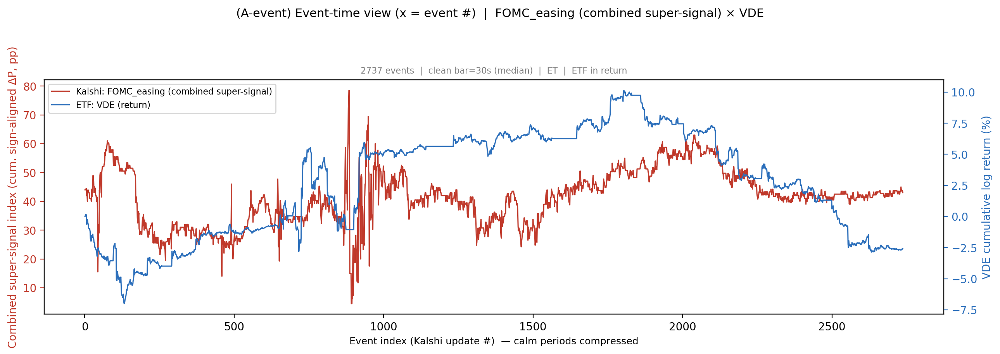
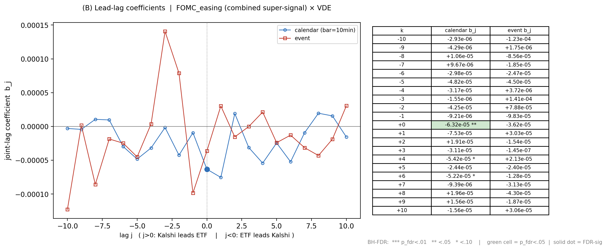


### FOMC_easing (combined)  ×  VFH

```text
MERGE pseudo-pair:  FOMC_easing  ×  VFH

'Contract' = combined super-signal (members' sign-aligned Δprob, pooled — NOT a price level):
  +  FEDDECISION-24SEP-C25, RATECUT-24SEP18, KXFEDDECISION-24DEC-C25
  -  FEDDECISION-24NOV-H0, KXFEDDECISION-24DEC-H0   (reverse contracts: Δprob flipped)

Pooled regression vs this ETF (per-member FE, day-clustered SE, ADL self-lags by BIC).
Direction counts use RAW p (graded thresholds), k>0 Kalshi-leads / k<0 ETF-leads.

== CALENDAR (primary bar) ==
  K=10  ADL self-lags=1  n_obs=1513
  p<0.05: Kalshi-leads 1 / ETF-leads 1   p<0.10: Kalshi-leads 1 / ETF-leads 1   p<0.15: Kalshi-leads 1 / ETF-leads 1

== EVENT (active-event) ==
  K=10  ADL self-lags=1  n_obs=547
  p<0.05: Kalshi-leads 0 / ETF-leads 0   p<0.10: Kalshi-leads 1 / ETF-leads 0   p<0.15: Kalshi-leads 1 / ETF-leads 0

== PROBIT (Pr(ETF up)) ==
  K=10  ADL self-lags=-  n_obs=504
  p<0.05: Kalshi-leads 4 / ETF-leads 2   p<0.10: Kalshi-leads 6 / ETF-leads 2   p<0.15: Kalshi-leads 8 / ETF-leads 4

== Conclusion (calendar+event) ==
  p<0.05: balanced/none (K1/E1) | p<0.10: Kalshi-leads (K2/E1) | p<0.15: Kalshi-leads (K2/E1)
```

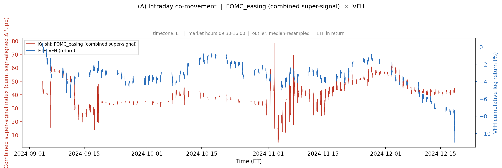
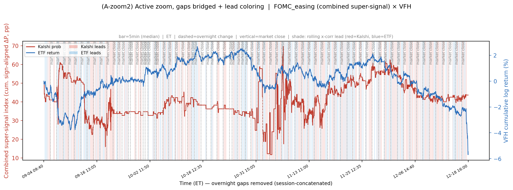
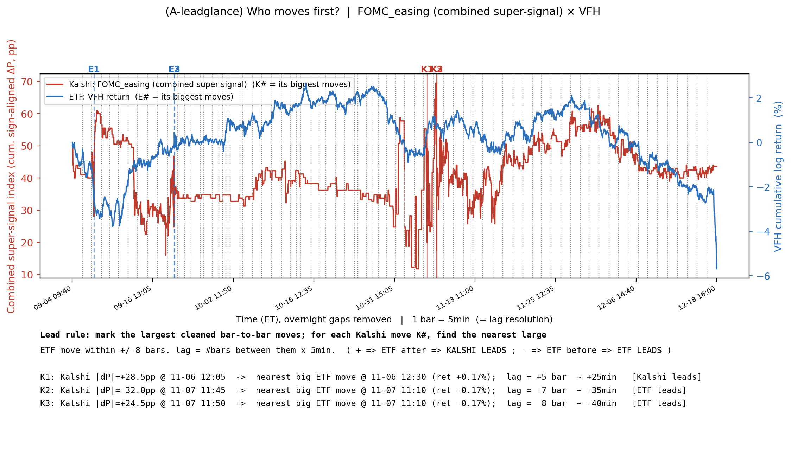
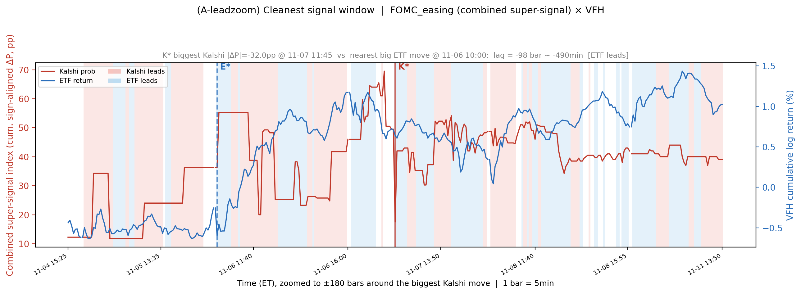
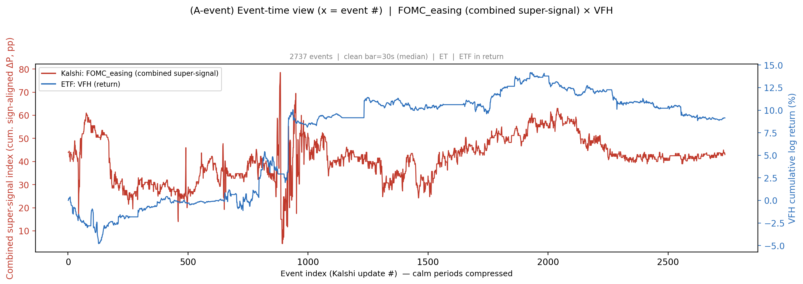
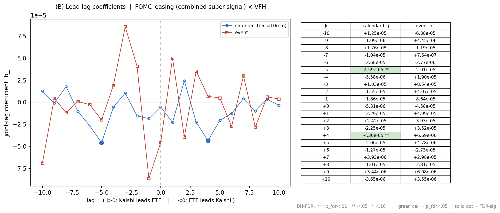


### FOMC_easing (combined)  ×  VGT

```text
MERGE pseudo-pair:  FOMC_easing  ×  VGT

'Contract' = combined super-signal (members' sign-aligned Δprob, pooled — NOT a price level):
  +  FEDDECISION-24SEP-C25, RATECUT-24SEP18, KXFEDDECISION-24DEC-C25
  -  FEDDECISION-24NOV-H0, KXFEDDECISION-24DEC-H0   (reverse contracts: Δprob flipped)

Pooled regression vs this ETF (per-member FE, day-clustered SE, ADL self-lags by BIC).
Direction counts use RAW p (graded thresholds), k>0 Kalshi-leads / k<0 ETF-leads.

== CALENDAR (primary bar) ==
  K=10  ADL self-lags=2  n_obs=1517
  p<0.05: Kalshi-leads 1 / ETF-leads 1   p<0.10: Kalshi-leads 1 / ETF-leads 1   p<0.15: Kalshi-leads 2 / ETF-leads 2

== EVENT (active-event) ==
  K=10  ADL self-lags=1  n_obs=547
  p<0.05: Kalshi-leads 0 / ETF-leads 1   p<0.10: Kalshi-leads 1 / ETF-leads 1   p<0.15: Kalshi-leads 2 / ETF-leads 1

== PROBIT (Pr(ETF up)) ==
  K=10  ADL self-lags=-  n_obs=530
  p<0.05: Kalshi-leads 2 / ETF-leads 2   p<0.10: Kalshi-leads 4 / ETF-leads 3   p<0.15: Kalshi-leads 4 / ETF-leads 3

== Conclusion (calendar+event) ==
  p<0.05: ETF-leads (K1/E2) | p<0.10: balanced/none (K2/E2) | p<0.15: Kalshi-leads (K4/E3)
```

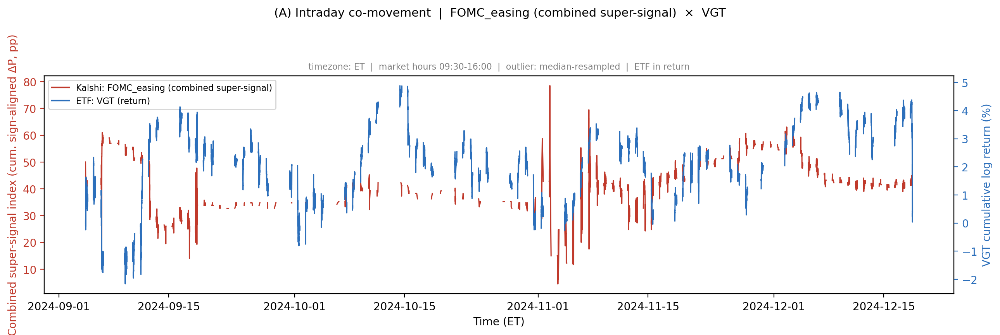
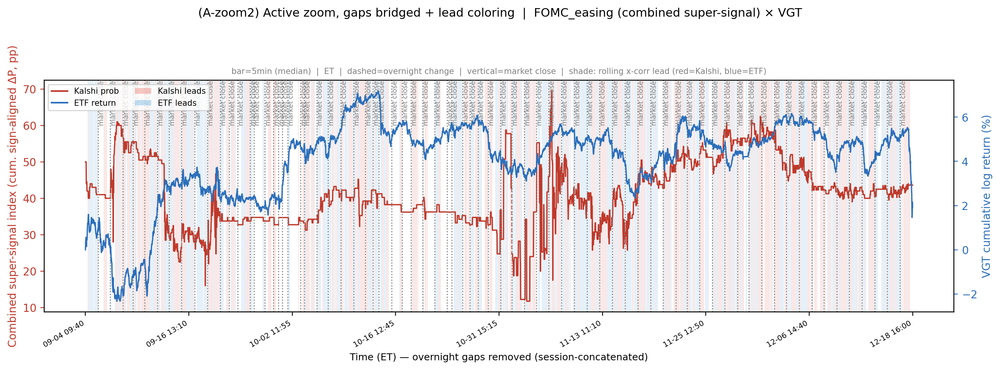
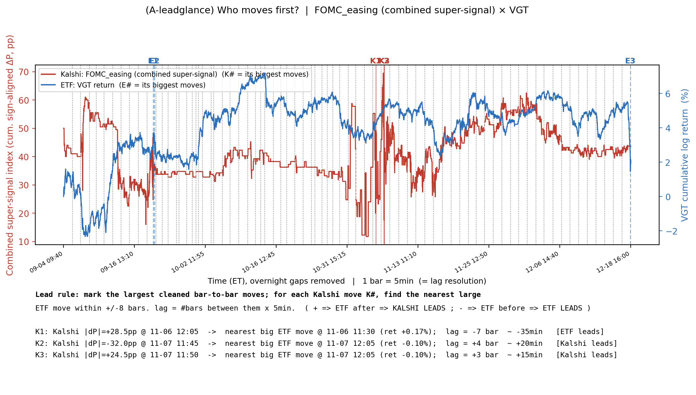
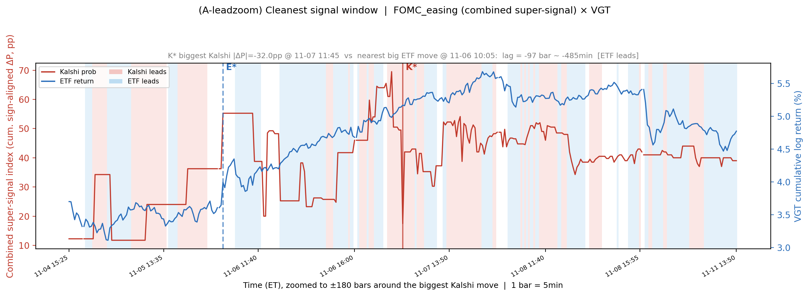
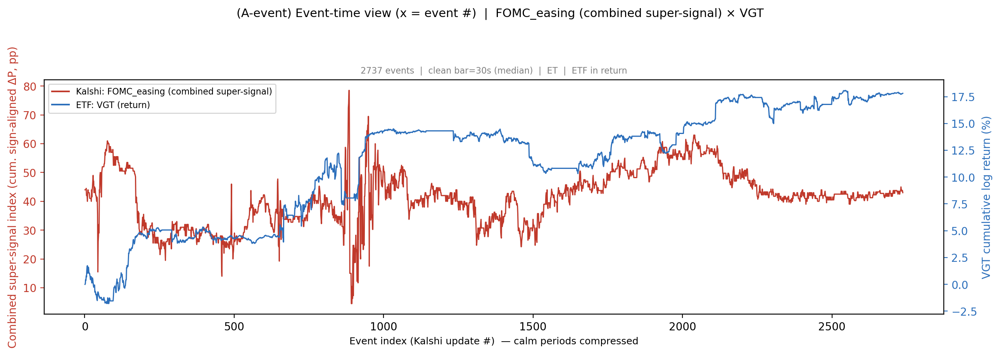
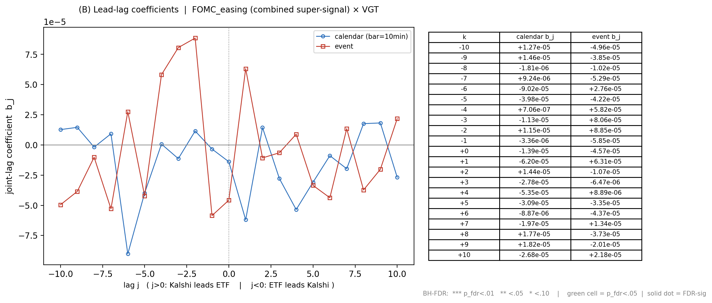


### FOMC_easing (combined)  ×  VIS

```text
MERGE pseudo-pair:  FOMC_easing  ×  VIS

'Contract' = combined super-signal (members' sign-aligned Δprob, pooled — NOT a price level):
  +  FEDDECISION-24SEP-C25, RATECUT-24SEP18, KXFEDDECISION-24DEC-C25
  -  FEDDECISION-24NOV-H0, KXFEDDECISION-24DEC-H0   (reverse contracts: Δprob flipped)

Pooled regression vs this ETF (per-member FE, day-clustered SE, ADL self-lags by BIC).
Direction counts use RAW p (graded thresholds), k>0 Kalshi-leads / k<0 ETF-leads.

== CALENDAR (primary bar) ==
  K=10  ADL self-lags=0  n_obs=1513
  p<0.05: Kalshi-leads 1 / ETF-leads 2   p<0.10: Kalshi-leads 1 / ETF-leads 2   p<0.15: Kalshi-leads 2 / ETF-leads 2

== EVENT (active-event) ==
  K=10  ADL self-lags=1  n_obs=547
  p<0.05: Kalshi-leads 0 / ETF-leads 0   p<0.10: Kalshi-leads 0 / ETF-leads 1   p<0.15: Kalshi-leads 1 / ETF-leads 1

== PROBIT (Pr(ETF up)) ==
  K=10  ADL self-lags=-  n_obs=522
  p<0.05: Kalshi-leads 1 / ETF-leads 3   p<0.10: Kalshi-leads 3 / ETF-leads 5   p<0.15: Kalshi-leads 5 / ETF-leads 6

== Conclusion (calendar+event) ==
  p<0.05: ETF-leads (K1/E2) | p<0.10: ETF-leads (K1/E3) | p<0.15: balanced/none (K3/E3)
```

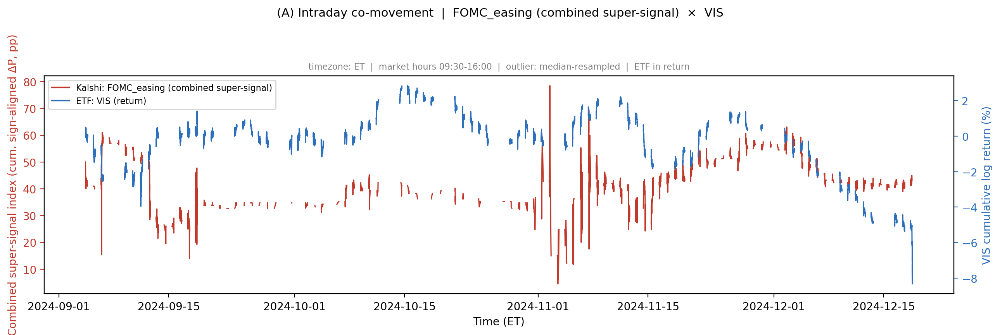
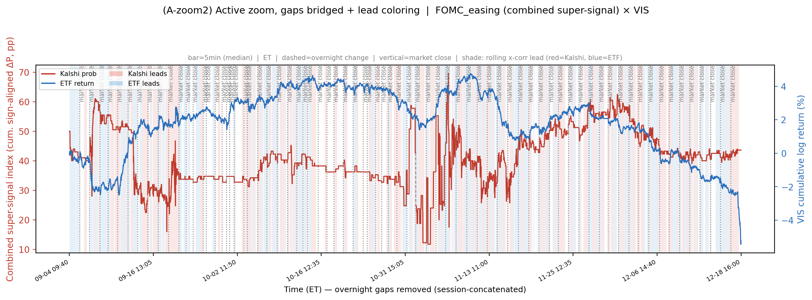
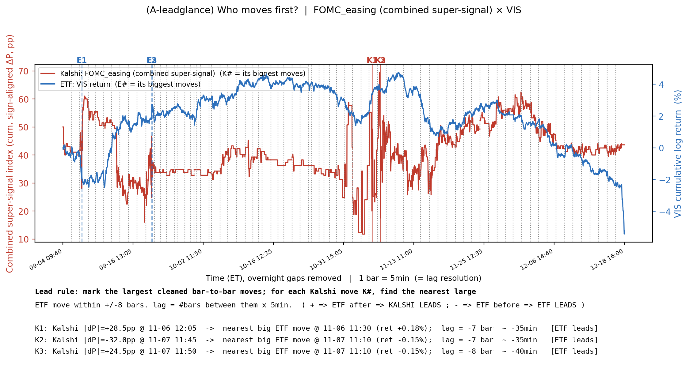
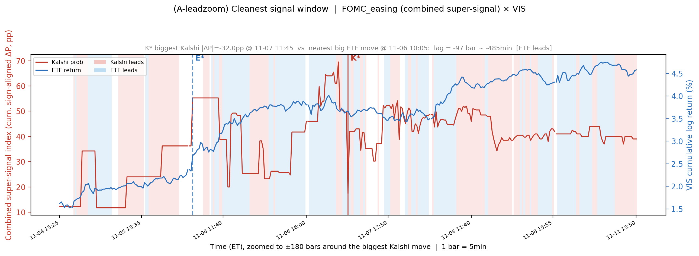
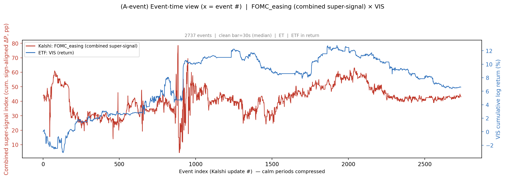
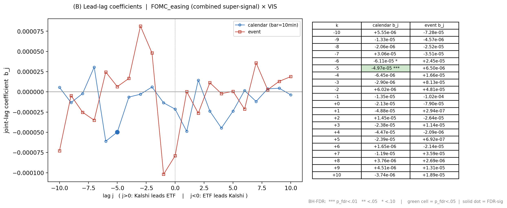


### FOMC_easing (combined)  ×  VNQ

```text
MERGE pseudo-pair:  FOMC_easing  ×  VNQ

'Contract' = combined super-signal (members' sign-aligned Δprob, pooled — NOT a price level):
  +  FEDDECISION-24SEP-C25, RATECUT-24SEP18, KXFEDDECISION-24DEC-C25
  -  FEDDECISION-24NOV-H0, KXFEDDECISION-24DEC-H0   (reverse contracts: Δprob flipped)

Pooled regression vs this ETF (per-member FE, day-clustered SE, ADL self-lags by BIC).
Direction counts use RAW p (graded thresholds), k>0 Kalshi-leads / k<0 ETF-leads.

== CALENDAR (primary bar) ==
  K=10  ADL self-lags=1  n_obs=1517
  p<0.05: Kalshi-leads 3 / ETF-leads 1   p<0.10: Kalshi-leads 3 / ETF-leads 1   p<0.15: Kalshi-leads 3 / ETF-leads 2

== EVENT (active-event) ==
  K=10  ADL self-lags=1  n_obs=547
  p<0.05: Kalshi-leads 1 / ETF-leads 1   p<0.10: Kalshi-leads 2 / ETF-leads 1   p<0.15: Kalshi-leads 2 / ETF-leads 1

== PROBIT (Pr(ETF up)) ==
  K=10  ADL self-lags=-  n_obs=507
  p<0.05: Kalshi-leads 5 / ETF-leads 3   p<0.10: Kalshi-leads 6 / ETF-leads 4   p<0.15: Kalshi-leads 7 / ETF-leads 5

== Conclusion (calendar+event) ==
  p<0.05: Kalshi-leads (K4/E2) | p<0.10: Kalshi-leads (K5/E2) | p<0.15: Kalshi-leads (K5/E3)
```

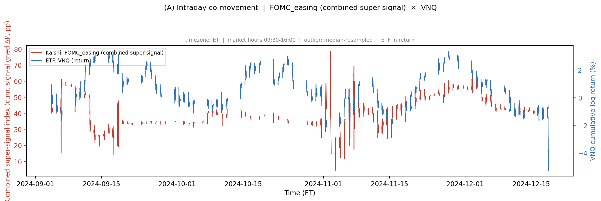
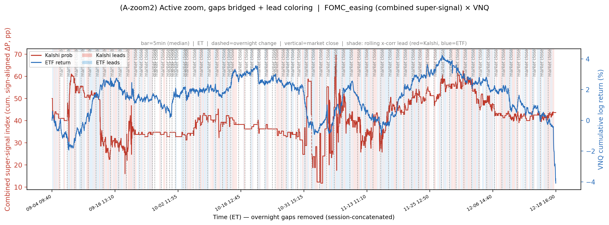
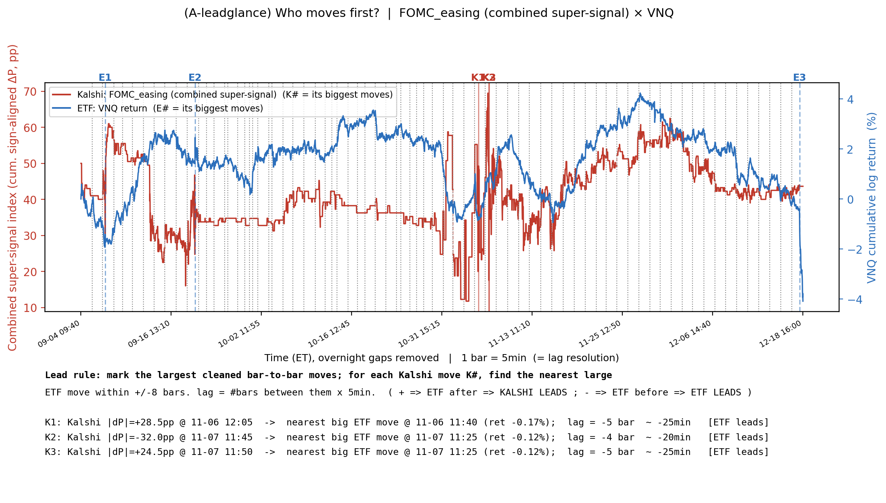
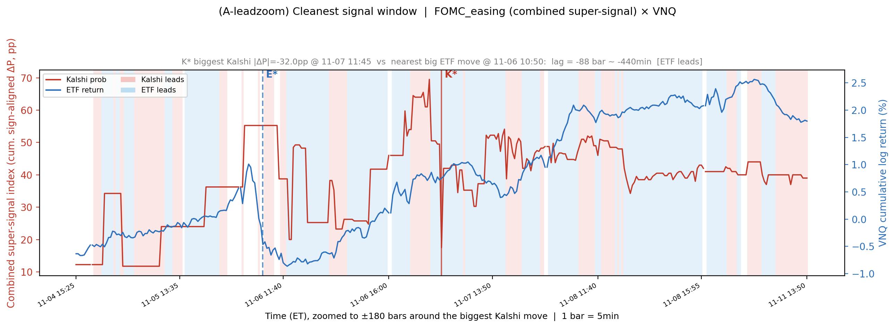
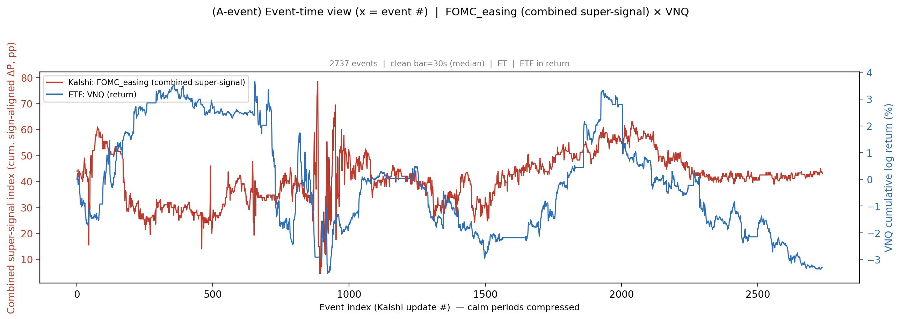
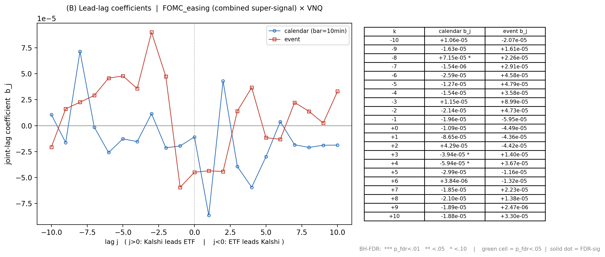


### FOMC_easing (combined)  ×  VOX

```text
MERGE pseudo-pair:  FOMC_easing  ×  VOX

'Contract' = combined super-signal (members' sign-aligned Δprob, pooled — NOT a price level):
  +  FEDDECISION-24SEP-C25, RATECUT-24SEP18, KXFEDDECISION-24DEC-C25
  -  FEDDECISION-24NOV-H0, KXFEDDECISION-24DEC-H0   (reverse contracts: Δprob flipped)

Pooled regression vs this ETF (per-member FE, day-clustered SE, ADL self-lags by BIC).
Direction counts use RAW p (graded thresholds), k>0 Kalshi-leads / k<0 ETF-leads.

== CALENDAR (primary bar) ==
  K=10  ADL self-lags=1  n_obs=1513
  p<0.05: Kalshi-leads 2 / ETF-leads 0   p<0.10: Kalshi-leads 2 / ETF-leads 1   p<0.15: Kalshi-leads 3 / ETF-leads 1

== EVENT (active-event) ==
  K=10  ADL self-lags=1  n_obs=547
  p<0.05: Kalshi-leads 1 / ETF-leads 1   p<0.10: Kalshi-leads 3 / ETF-leads 1   p<0.15: Kalshi-leads 3 / ETF-leads 3

== PROBIT (Pr(ETF up)) ==
  K=10  ADL self-lags=-  n_obs=511
  p<0.05: Kalshi-leads 0 / ETF-leads 0   p<0.10: Kalshi-leads 3 / ETF-leads 1   p<0.15: Kalshi-leads 3 / ETF-leads 3

== Conclusion (calendar+event) ==
  p<0.05: Kalshi-leads (K3/E1) | p<0.10: Kalshi-leads (K5/E2) | p<0.15: Kalshi-leads (K6/E4)
```

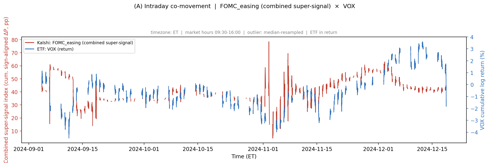
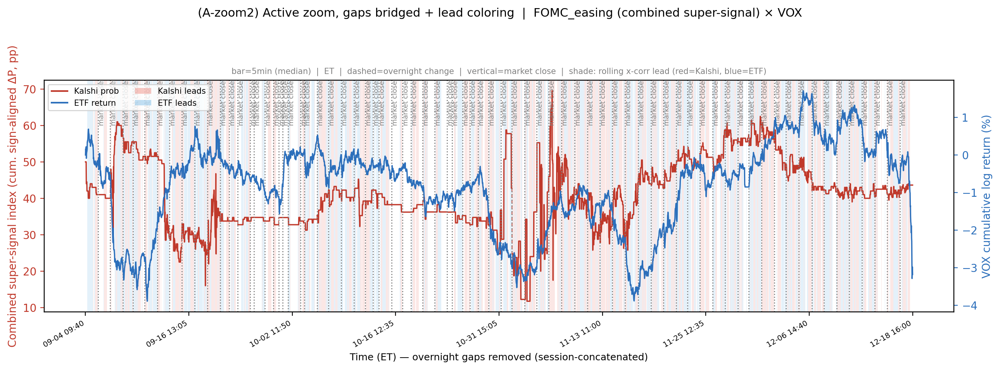
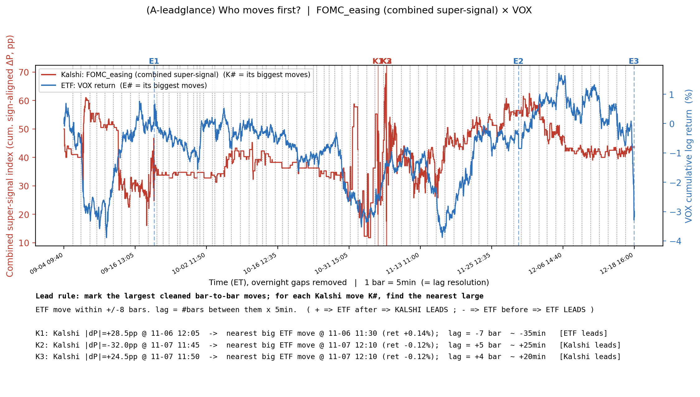
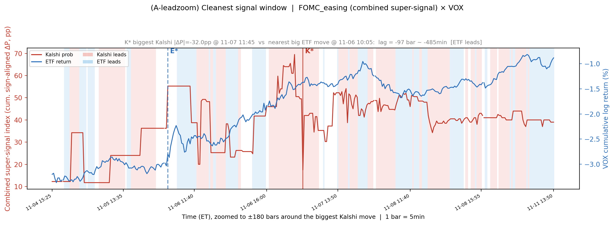
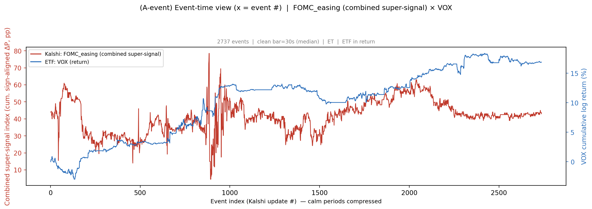
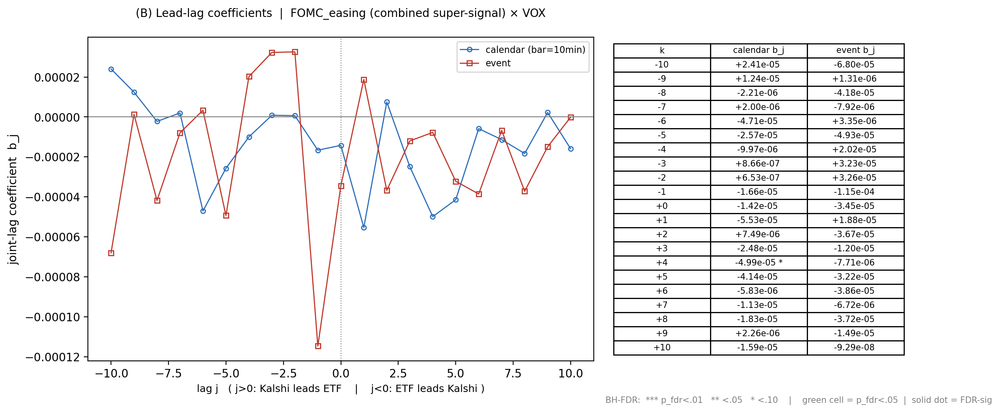


### FOMC_easing (combined)  ×  VPU

```text
MERGE pseudo-pair:  FOMC_easing  ×  VPU

'Contract' = combined super-signal (members' sign-aligned Δprob, pooled — NOT a price level):
  +  FEDDECISION-24SEP-C25, RATECUT-24SEP18, KXFEDDECISION-24DEC-C25
  -  FEDDECISION-24NOV-H0, KXFEDDECISION-24DEC-H0   (reverse contracts: Δprob flipped)

Pooled regression vs this ETF (per-member FE, day-clustered SE, ADL self-lags by BIC).
Direction counts use RAW p (graded thresholds), k>0 Kalshi-leads / k<0 ETF-leads.

== CALENDAR (primary bar) ==
  K=10  ADL self-lags=1  n_obs=1513
  p<0.05: Kalshi-leads 1 / ETF-leads 3   p<0.10: Kalshi-leads 2 / ETF-leads 3   p<0.15: Kalshi-leads 2 / ETF-leads 4

== EVENT (active-event) ==
  K=10  ADL self-lags=0  n_obs=547
  p<0.05: Kalshi-leads 0 / ETF-leads 1   p<0.10: Kalshi-leads 1 / ETF-leads 2   p<0.15: Kalshi-leads 3 / ETF-leads 3

== PROBIT (Pr(ETF up)) ==
  K=10  ADL self-lags=-  n_obs=519
  p<0.05: Kalshi-leads 4 / ETF-leads 2   p<0.10: Kalshi-leads 5 / ETF-leads 3   p<0.15: Kalshi-leads 5 / ETF-leads 5

== Conclusion (calendar+event) ==
  p<0.05: ETF-leads (K1/E4) | p<0.10: ETF-leads (K3/E5) | p<0.15: ETF-leads (K5/E7)
```

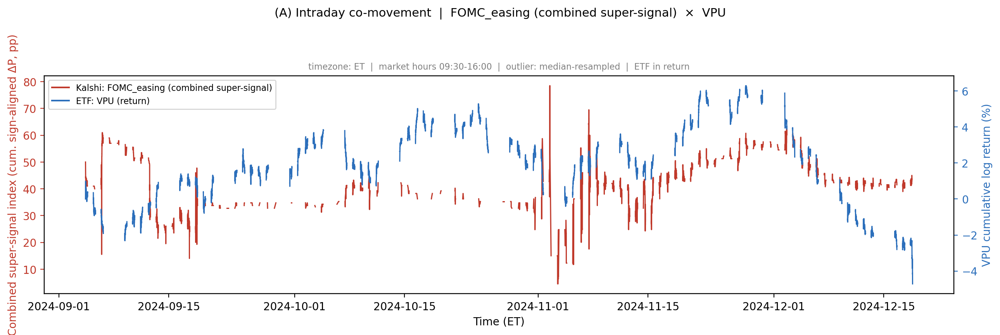
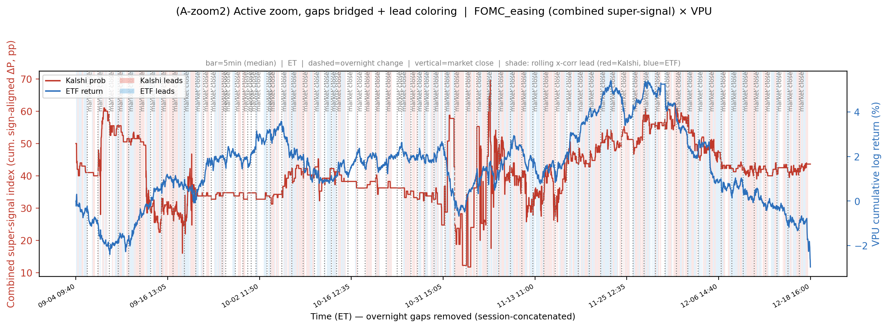
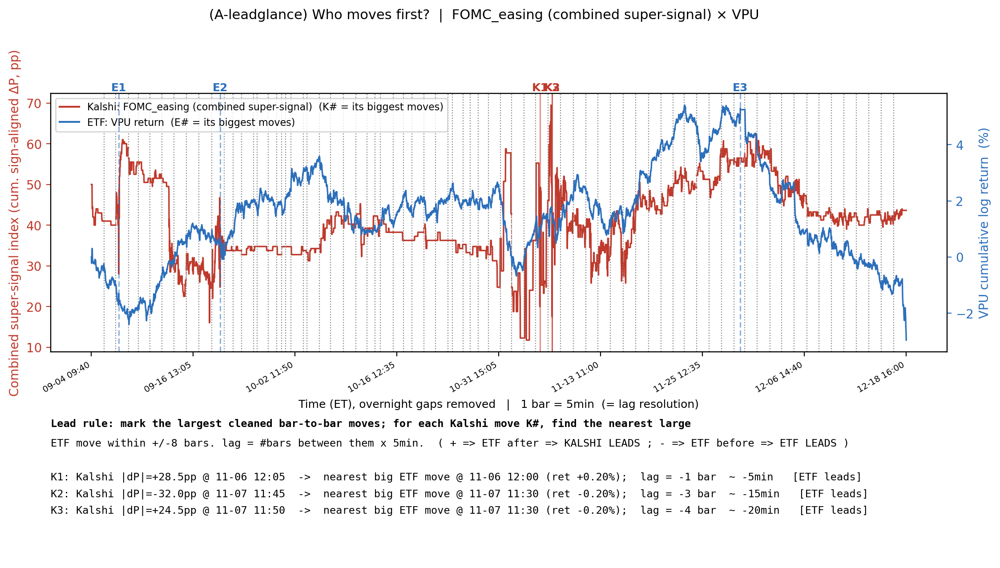
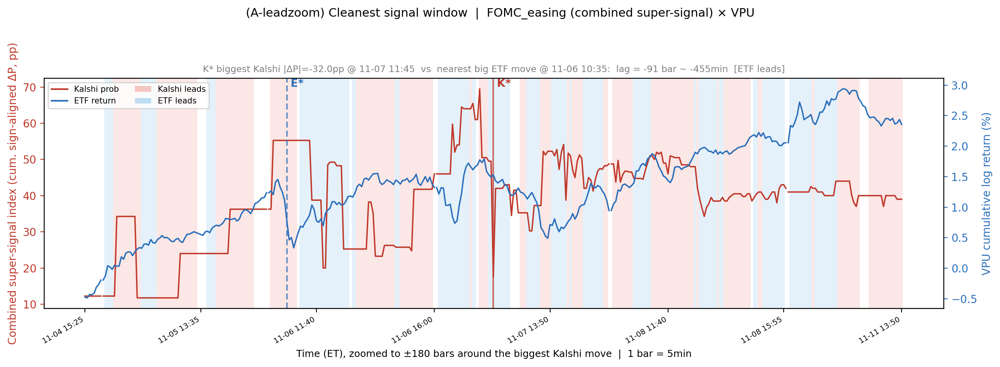
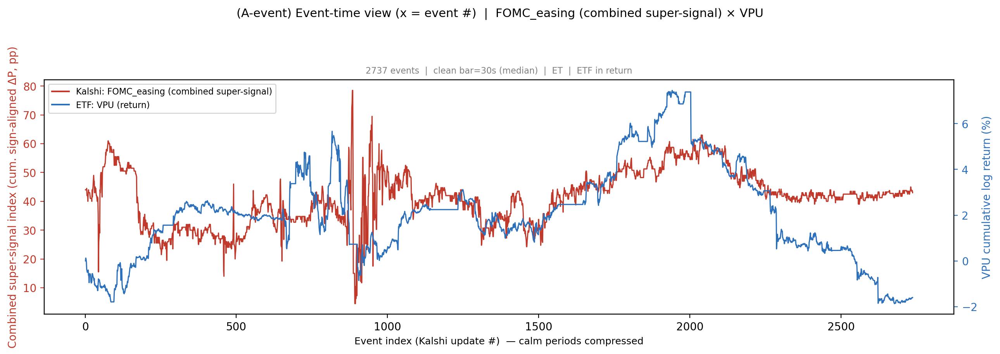
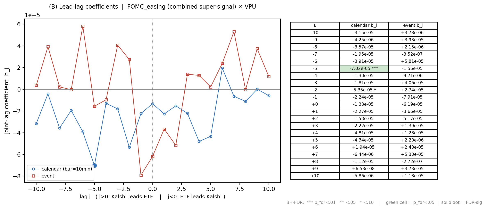

---

## MERGE — GAS_above  (pooled overview)

```text
MERGE super-signal:  GAS_above

Members pooled (sign-aligned Δprob, never concatenated price levels):
  +  AAAGASM-24OCT31-US-3.15, AAAGASM-24OCT31-US-3.20, AAAGASM-24SEP30-US-3.15, KXAAAGASM-24NOV30-US-3.30
  -  (none)
Relevant-ETF union (11): VAW, VCR, VDC, VDE, VFH, VGT, VHT, VIS, VNQ, VOX, VPU

Pooling engine: per-member lag/ADL shift, member fixed effects, day-clustered SE;
ADL self-lag order chosen per pooled regression by BIC (column n_ylags).
Direction counts below use RAW p (same graded-threshold convention as the single-pair report).

== CALENDAR (primary bar) ==
ETF      K  ADL   n_obs   Kalshi-leads(k>0) / ETF-leads(k<0)
VAW      4    1     334   p<0.05: K1/E0  p<0.10: K1/E0  p<0.15: K2/E1
VCR      4    3     334   p<0.05: K2/E1  p<0.10: K4/E1  p<0.15: K4/E1
VDC      4    2     334   p<0.05: K3/E2  p<0.10: K4/E2  p<0.15: K4/E2
VDE      4    1     334   p<0.05: K1/E0  p<0.10: K1/E0  p<0.15: K1/E0
VFH      4    1     334   p<0.05: K0/E1  p<0.10: K1/E1  p<0.15: K1/E1
VGT      4    1     334   p<0.05: K3/E3  p<0.10: K4/E3  p<0.15: K4/E3
VHT      4    1     334   p<0.05: K4/E1  p<0.10: K4/E1  p<0.15: K4/E1
VIS      4    1     334   p<0.05: K2/E2  p<0.10: K2/E3  p<0.15: K2/E3
VNQ      4    0     334   p<0.05: K1/E1  p<0.10: K1/E1  p<0.15: K1/E1
VOX      4    1     334   p<0.05: K2/E2  p<0.10: K3/E3  p<0.15: K4/E3
VPU      4    1     334   p<0.05: K2/E2  p<0.10: K3/E2  p<0.15: K3/E2

== EVENT (active-event subsequence) ==
ETF      K  ADL   n_obs   Kalshi-leads(k>0) / ETF-leads(k<0)
VAW      -    -        -   (no result)
VCR      -    -        -   (no result)
VDC      -    -        -   (no result)
VDE      -    -        -   (no result)
VFH      -    -        -   (no result)
VGT      -    -        -   (no result)
VHT      -    -        -   (no result)
VIS      -    -        -   (no result)
VNQ      -    -        -   (no result)
VOX      -    -        -   (no result)
VPU      -    -        -   (no result)

== PROBIT (direction test Pr(ETF up)) ==
ETF      K  ADL   n_obs   Kalshi-leads(k>0) / ETF-leads(k<0)
VAW      -    -        -   (no result)
VCR      -    -        -   (no result)
VDC      -    -        -   (no result)
VDE      -    -        -   (no result)
VFH      -    -        -   (no result)
VGT      -    -        -   (no result)
VHT      -    -        -   (no result)
VIS      -    -        -   (no result)
VNQ      -    -        -   (no result)
VOX      -    -        -   (no result)
VPU      -    -        -   (no result)

== Conclusion (calendar+event pooled across the group's ETFs) ==
  p<0.05: Kalshi-leads (K75/E69) | p<0.10: Kalshi-leads (K92/E78) | p<0.15: Kalshi-leads (K102/E89)
  Read alongside the single-pair tally; pooling buys df but the lead is in the sign, not magnitude.
```


### GAS_above (combined)  ×  VAW

```text
MERGE pseudo-pair:  GAS_above  ×  VAW

'Contract' = combined super-signal (members' sign-aligned Δprob, pooled — NOT a price level):
  +  AAAGASM-24OCT31-US-3.15, AAAGASM-24OCT31-US-3.20, AAAGASM-24SEP30-US-3.15, KXAAAGASM-24NOV30-US-3.30
  -  (none)

Pooled regression vs this ETF (per-member FE, day-clustered SE, ADL self-lags by BIC).
Direction counts use RAW p (graded thresholds), k>0 Kalshi-leads / k<0 ETF-leads.

== CALENDAR (primary bar) ==
  K=4  ADL self-lags=1  n_obs=334
  p<0.05: Kalshi-leads 1 / ETF-leads 0   p<0.10: Kalshi-leads 1 / ETF-leads 0   p<0.15: Kalshi-leads 2 / ETF-leads 1

== EVENT (active-event) ==
  (no result)

== PROBIT (Pr(ETF up)) ==
  (no result)

== Conclusion (calendar+event) ==
  p<0.05: Kalshi-leads (K1/E0) | p<0.10: Kalshi-leads (K1/E0) | p<0.15: Kalshi-leads (K2/E1)
```

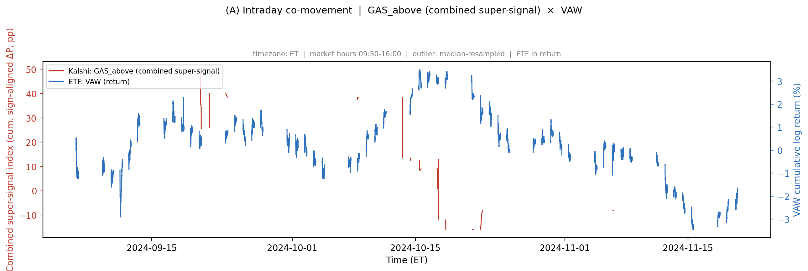
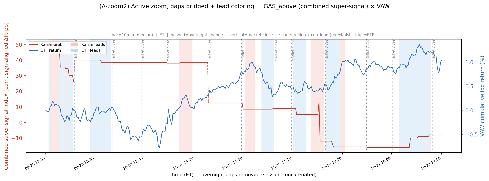
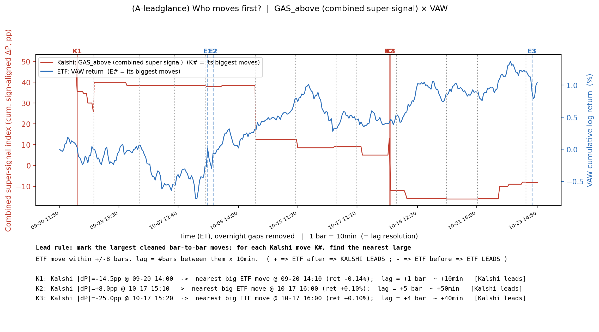
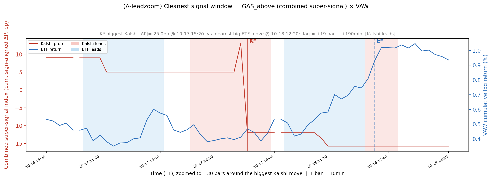
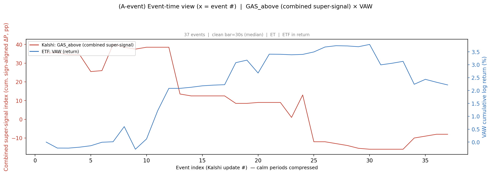
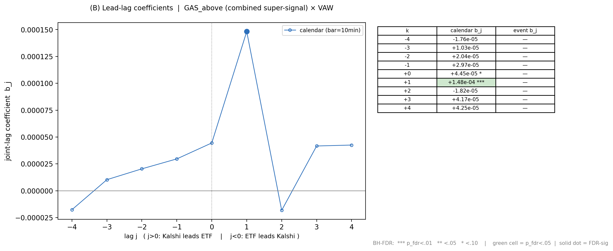


### GAS_above (combined)  ×  VCR

```text
MERGE pseudo-pair:  GAS_above  ×  VCR

'Contract' = combined super-signal (members' sign-aligned Δprob, pooled — NOT a price level):
  +  AAAGASM-24OCT31-US-3.15, AAAGASM-24OCT31-US-3.20, AAAGASM-24SEP30-US-3.15, KXAAAGASM-24NOV30-US-3.30
  -  (none)

Pooled regression vs this ETF (per-member FE, day-clustered SE, ADL self-lags by BIC).
Direction counts use RAW p (graded thresholds), k>0 Kalshi-leads / k<0 ETF-leads.

== CALENDAR (primary bar) ==
  K=4  ADL self-lags=3  n_obs=334
  p<0.05: Kalshi-leads 2 / ETF-leads 1   p<0.10: Kalshi-leads 4 / ETF-leads 1   p<0.15: Kalshi-leads 4 / ETF-leads 1

== EVENT (active-event) ==
  (no result)

== PROBIT (Pr(ETF up)) ==
  (no result)

== Conclusion (calendar+event) ==
  p<0.05: Kalshi-leads (K2/E1) | p<0.10: Kalshi-leads (K4/E1) | p<0.15: Kalshi-leads (K4/E1)
```

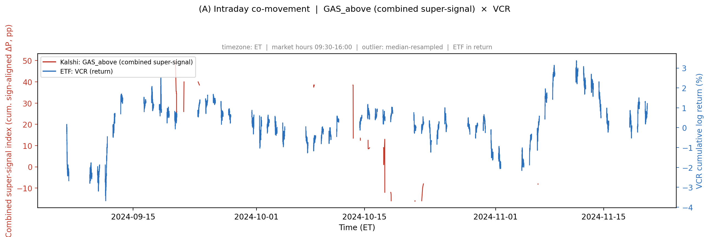
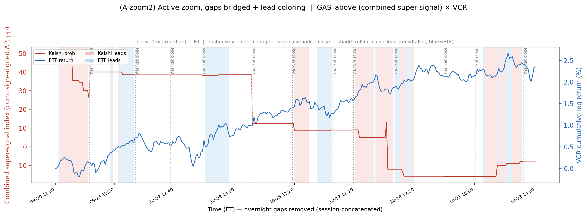
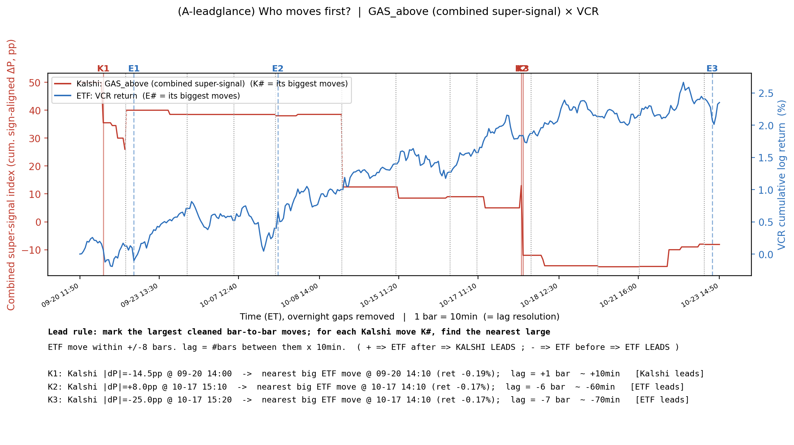
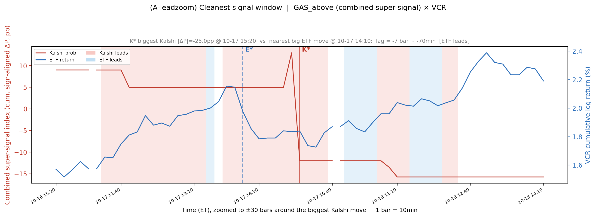
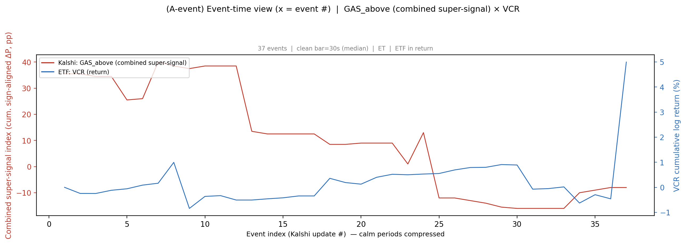
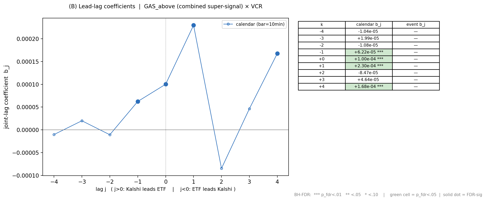


### GAS_above (combined)  ×  VDC

```text
MERGE pseudo-pair:  GAS_above  ×  VDC

'Contract' = combined super-signal (members' sign-aligned Δprob, pooled — NOT a price level):
  +  AAAGASM-24OCT31-US-3.15, AAAGASM-24OCT31-US-3.20, AAAGASM-24SEP30-US-3.15, KXAAAGASM-24NOV30-US-3.30
  -  (none)

Pooled regression vs this ETF (per-member FE, day-clustered SE, ADL self-lags by BIC).
Direction counts use RAW p (graded thresholds), k>0 Kalshi-leads / k<0 ETF-leads.

== CALENDAR (primary bar) ==
  K=4  ADL self-lags=2  n_obs=334
  p<0.05: Kalshi-leads 3 / ETF-leads 2   p<0.10: Kalshi-leads 4 / ETF-leads 2   p<0.15: Kalshi-leads 4 / ETF-leads 2

== EVENT (active-event) ==
  (no result)

== PROBIT (Pr(ETF up)) ==
  (no result)

== Conclusion (calendar+event) ==
  p<0.05: Kalshi-leads (K3/E2) | p<0.10: Kalshi-leads (K4/E2) | p<0.15: Kalshi-leads (K4/E2)
```

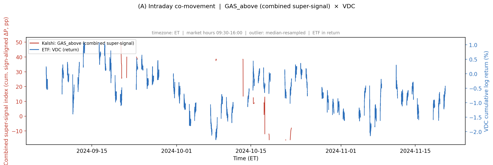
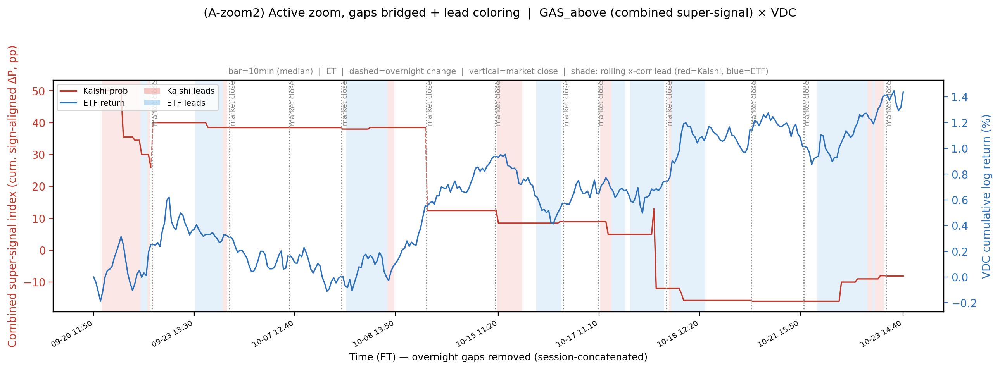
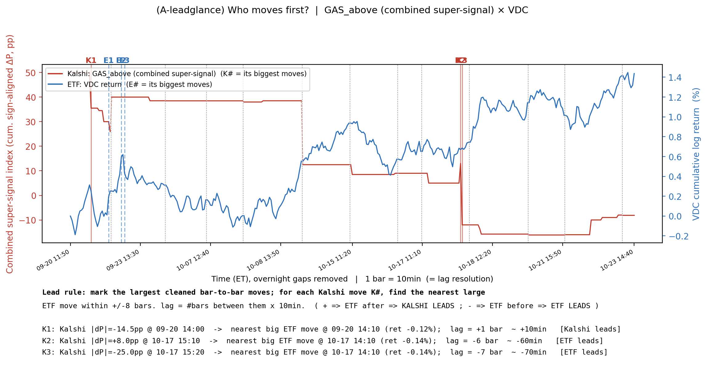
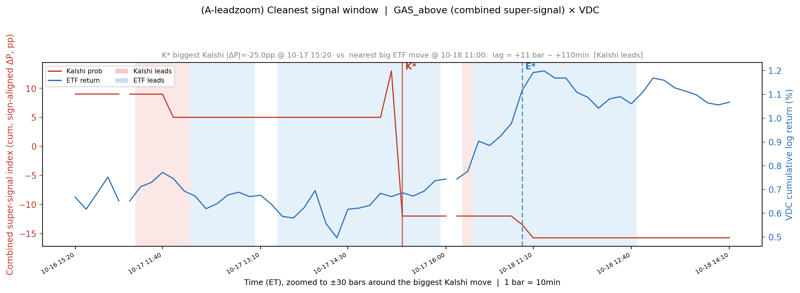
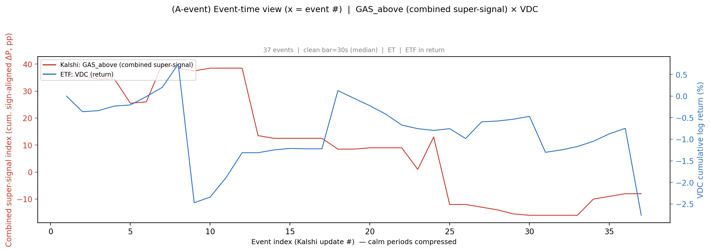
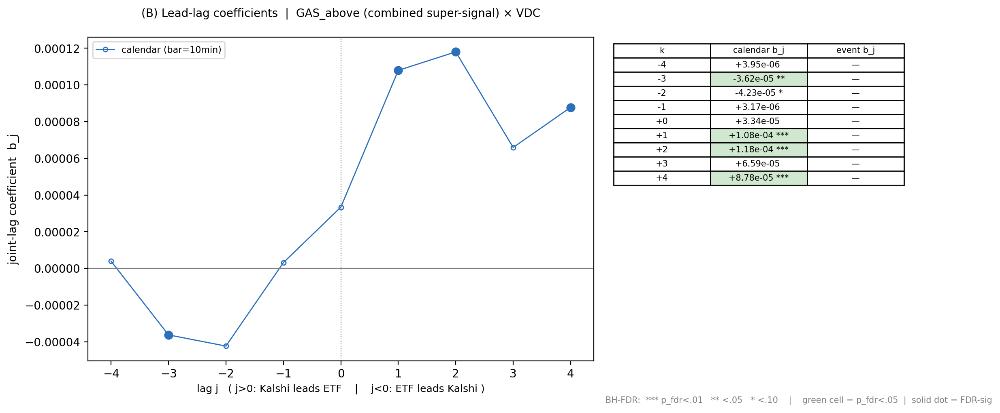


### GAS_above (combined)  ×  VDE

```text
MERGE pseudo-pair:  GAS_above  ×  VDE

'Contract' = combined super-signal (members' sign-aligned Δprob, pooled — NOT a price level):
  +  AAAGASM-24OCT31-US-3.15, AAAGASM-24OCT31-US-3.20, AAAGASM-24SEP30-US-3.15, KXAAAGASM-24NOV30-US-3.30
  -  (none)

Pooled regression vs this ETF (per-member FE, day-clustered SE, ADL self-lags by BIC).
Direction counts use RAW p (graded thresholds), k>0 Kalshi-leads / k<0 ETF-leads.

== CALENDAR (primary bar) ==
  K=4  ADL self-lags=1  n_obs=334
  p<0.05: Kalshi-leads 1 / ETF-leads 0   p<0.10: Kalshi-leads 1 / ETF-leads 0   p<0.15: Kalshi-leads 1 / ETF-leads 0

== EVENT (active-event) ==
  (no result)

== PROBIT (Pr(ETF up)) ==
  (no result)

== Conclusion (calendar+event) ==
  p<0.05: Kalshi-leads (K1/E0) | p<0.10: Kalshi-leads (K1/E0) | p<0.15: Kalshi-leads (K1/E0)
```

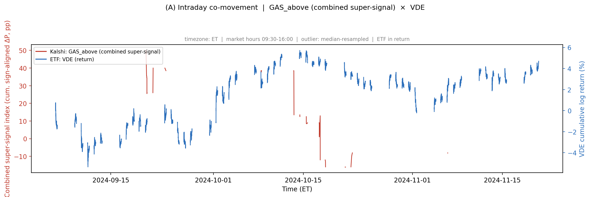
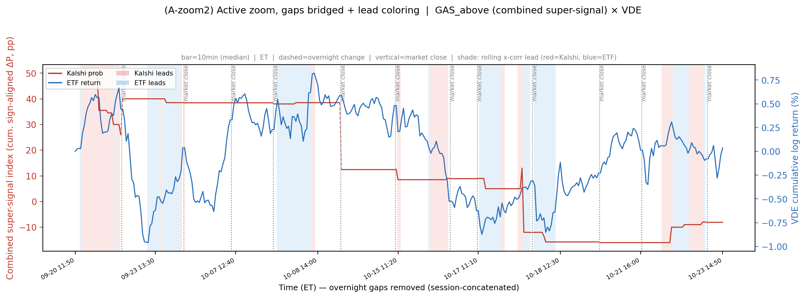
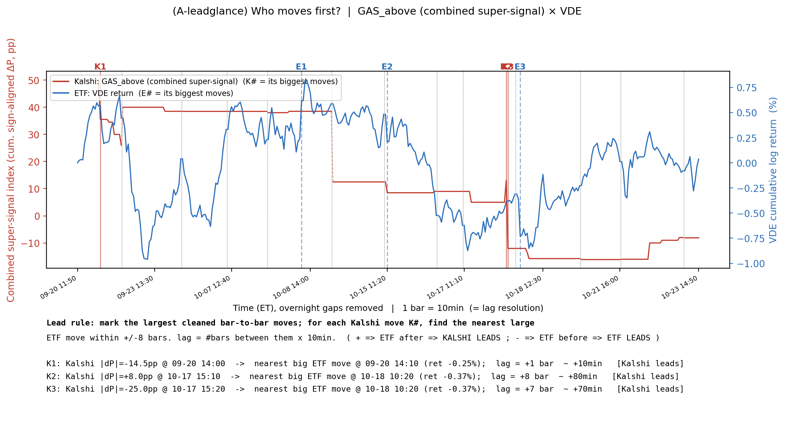
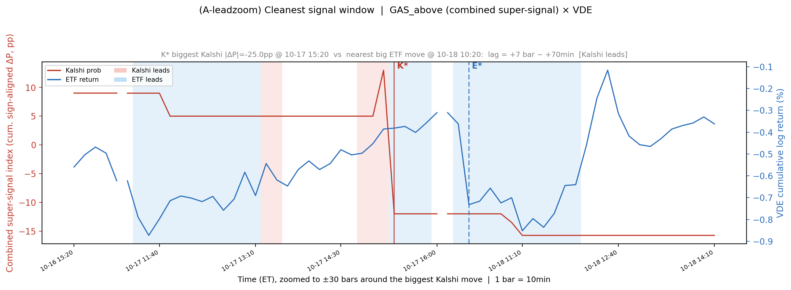
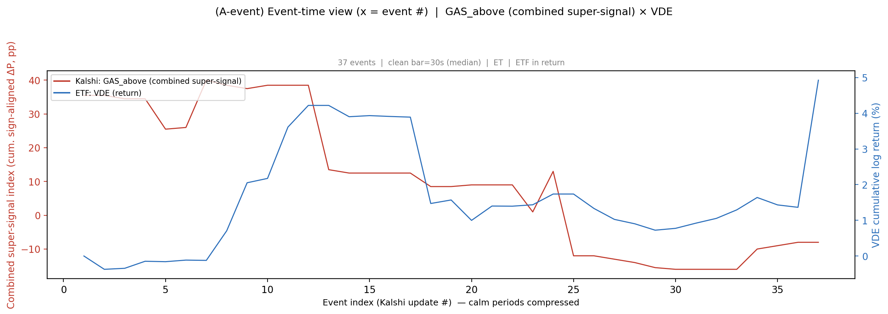
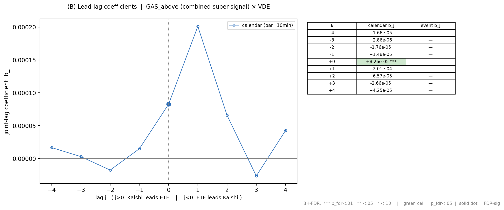


### GAS_above (combined)  ×  VFH

```text
MERGE pseudo-pair:  GAS_above  ×  VFH

'Contract' = combined super-signal (members' sign-aligned Δprob, pooled — NOT a price level):
  +  AAAGASM-24OCT31-US-3.15, AAAGASM-24OCT31-US-3.20, AAAGASM-24SEP30-US-3.15, KXAAAGASM-24NOV30-US-3.30
  -  (none)

Pooled regression vs this ETF (per-member FE, day-clustered SE, ADL self-lags by BIC).
Direction counts use RAW p (graded thresholds), k>0 Kalshi-leads / k<0 ETF-leads.

== CALENDAR (primary bar) ==
  K=4  ADL self-lags=1  n_obs=334
  p<0.05: Kalshi-leads 0 / ETF-leads 1   p<0.10: Kalshi-leads 1 / ETF-leads 1   p<0.15: Kalshi-leads 1 / ETF-leads 1

== EVENT (active-event) ==
  (no result)

== PROBIT (Pr(ETF up)) ==
  (no result)

== Conclusion (calendar+event) ==
  p<0.05: ETF-leads (K0/E1) | p<0.10: balanced/none (K1/E1) | p<0.15: balanced/none (K1/E1)
```

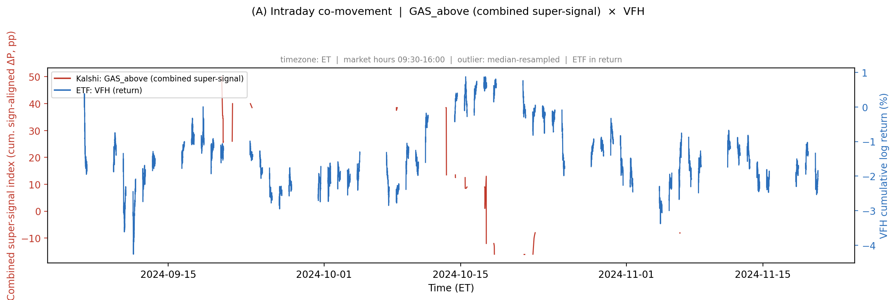
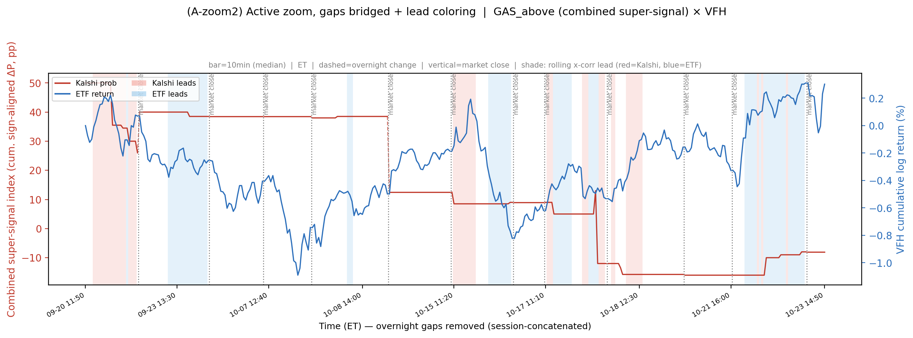
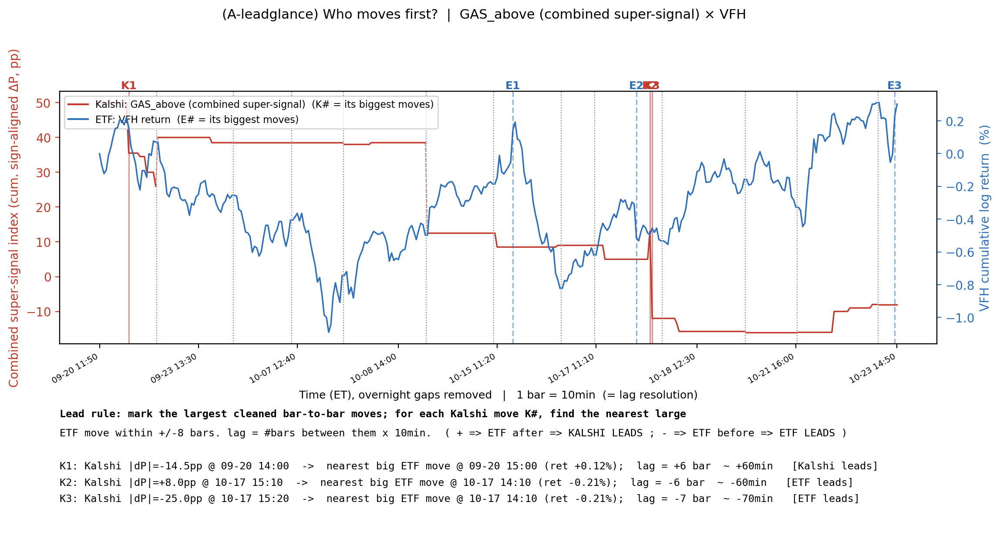
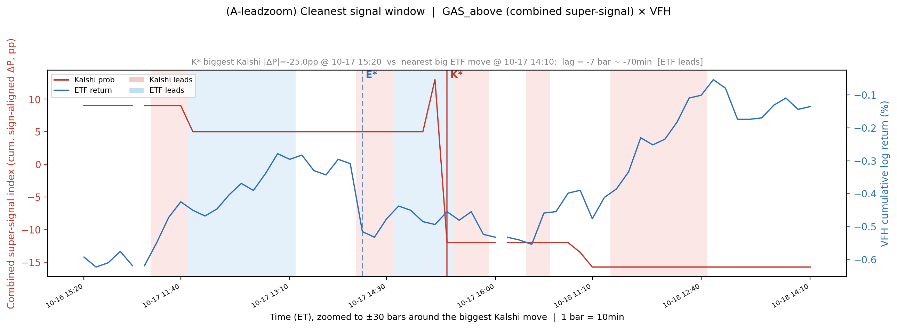
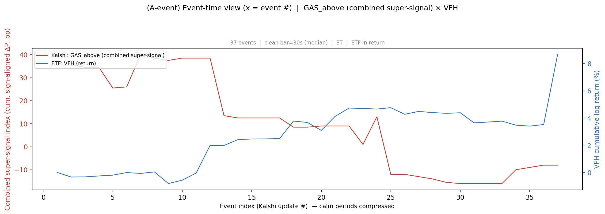
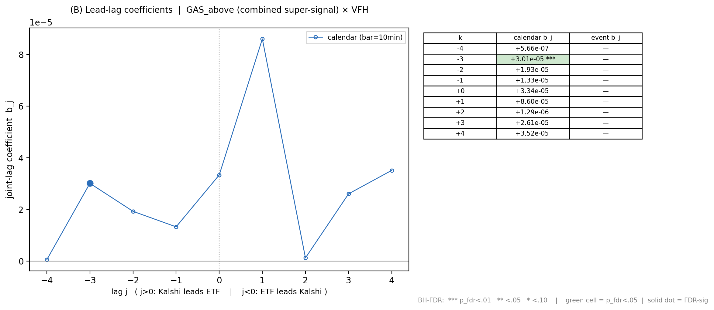


### GAS_above (combined)  ×  VGT

```text
MERGE pseudo-pair:  GAS_above  ×  VGT

'Contract' = combined super-signal (members' sign-aligned Δprob, pooled — NOT a price level):
  +  AAAGASM-24OCT31-US-3.15, AAAGASM-24OCT31-US-3.20, AAAGASM-24SEP30-US-3.15, KXAAAGASM-24NOV30-US-3.30
  -  (none)

Pooled regression vs this ETF (per-member FE, day-clustered SE, ADL self-lags by BIC).
Direction counts use RAW p (graded thresholds), k>0 Kalshi-leads / k<0 ETF-leads.

== CALENDAR (primary bar) ==
  K=4  ADL self-lags=1  n_obs=334
  p<0.05: Kalshi-leads 3 / ETF-leads 3   p<0.10: Kalshi-leads 4 / ETF-leads 3   p<0.15: Kalshi-leads 4 / ETF-leads 3

== EVENT (active-event) ==
  (no result)

== PROBIT (Pr(ETF up)) ==
  (no result)

== Conclusion (calendar+event) ==
  p<0.05: balanced/none (K3/E3) | p<0.10: Kalshi-leads (K4/E3) | p<0.15: Kalshi-leads (K4/E3)
```

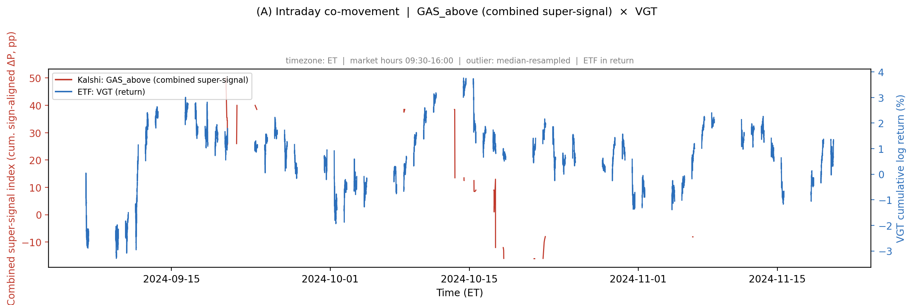
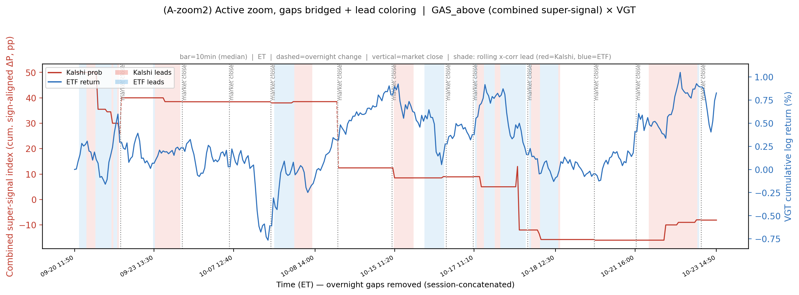
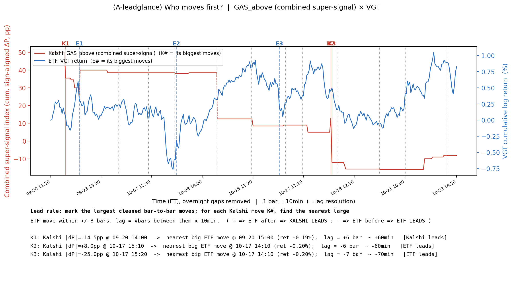
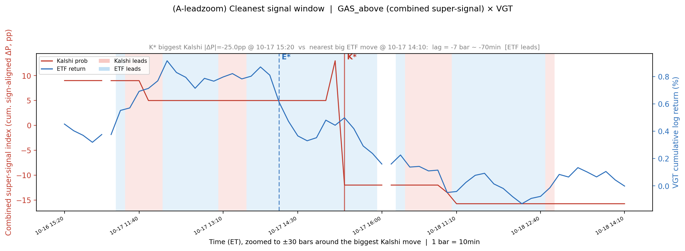
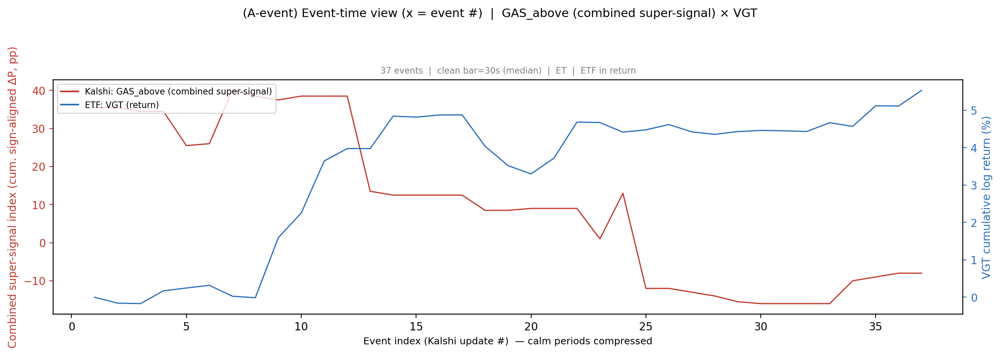
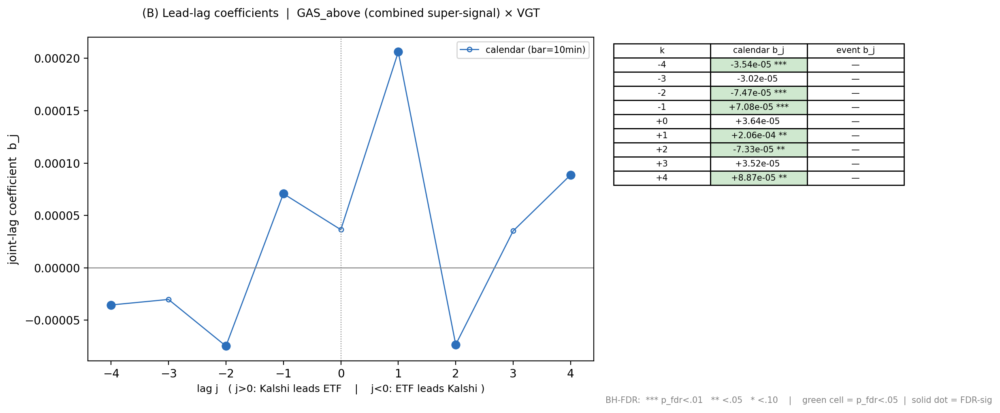


### GAS_above (combined)  ×  VHT

```text
MERGE pseudo-pair:  GAS_above  ×  VHT

'Contract' = combined super-signal (members' sign-aligned Δprob, pooled — NOT a price level):
  +  AAAGASM-24OCT31-US-3.15, AAAGASM-24OCT31-US-3.20, AAAGASM-24SEP30-US-3.15, KXAAAGASM-24NOV30-US-3.30
  -  (none)

Pooled regression vs this ETF (per-member FE, day-clustered SE, ADL self-lags by BIC).
Direction counts use RAW p (graded thresholds), k>0 Kalshi-leads / k<0 ETF-leads.

== CALENDAR (primary bar) ==
  K=4  ADL self-lags=1  n_obs=334
  p<0.05: Kalshi-leads 4 / ETF-leads 1   p<0.10: Kalshi-leads 4 / ETF-leads 1   p<0.15: Kalshi-leads 4 / ETF-leads 1

== EVENT (active-event) ==
  (no result)

== PROBIT (Pr(ETF up)) ==
  (no result)

== Conclusion (calendar+event) ==
  p<0.05: Kalshi-leads (K4/E1) | p<0.10: Kalshi-leads (K4/E1) | p<0.15: Kalshi-leads (K4/E1)
```

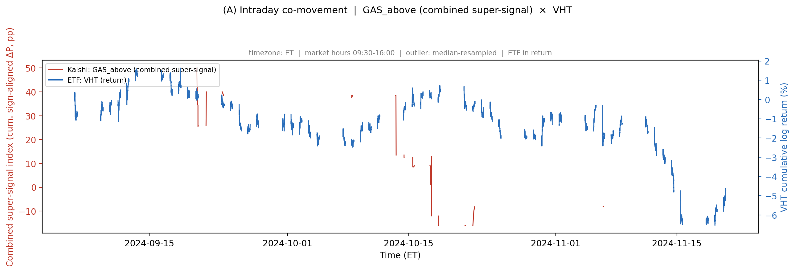
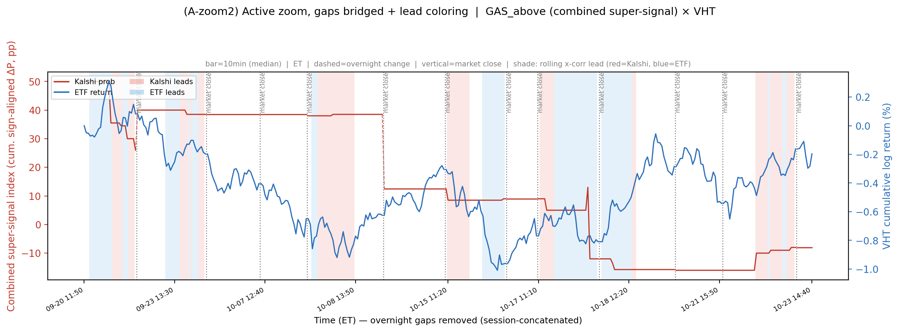
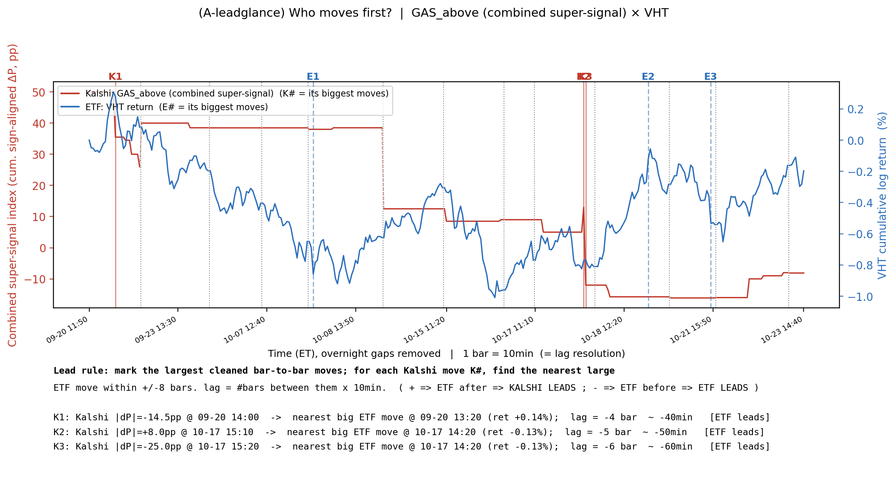
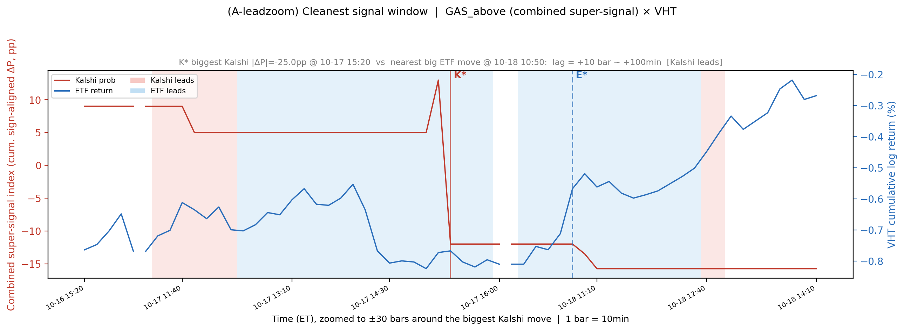
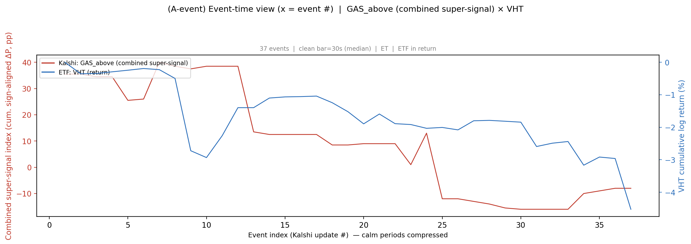
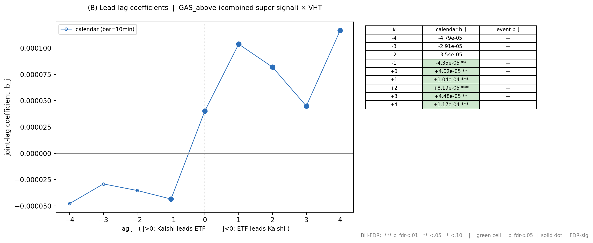


### GAS_above (combined)  ×  VIS

```text
MERGE pseudo-pair:  GAS_above  ×  VIS

'Contract' = combined super-signal (members' sign-aligned Δprob, pooled — NOT a price level):
  +  AAAGASM-24OCT31-US-3.15, AAAGASM-24OCT31-US-3.20, AAAGASM-24SEP30-US-3.15, KXAAAGASM-24NOV30-US-3.30
  -  (none)

Pooled regression vs this ETF (per-member FE, day-clustered SE, ADL self-lags by BIC).
Direction counts use RAW p (graded thresholds), k>0 Kalshi-leads / k<0 ETF-leads.

== CALENDAR (primary bar) ==
  K=4  ADL self-lags=1  n_obs=334
  p<0.05: Kalshi-leads 2 / ETF-leads 2   p<0.10: Kalshi-leads 2 / ETF-leads 3   p<0.15: Kalshi-leads 2 / ETF-leads 3

== EVENT (active-event) ==
  (no result)

== PROBIT (Pr(ETF up)) ==
  (no result)

== Conclusion (calendar+event) ==
  p<0.05: balanced/none (K2/E2) | p<0.10: ETF-leads (K2/E3) | p<0.15: ETF-leads (K2/E3)
```

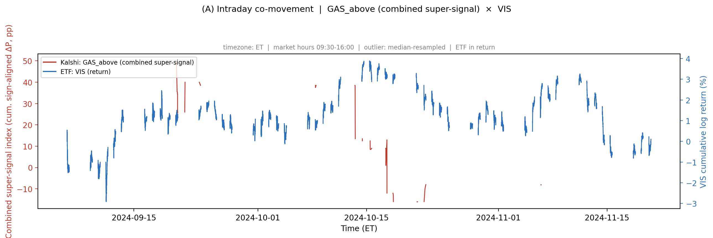
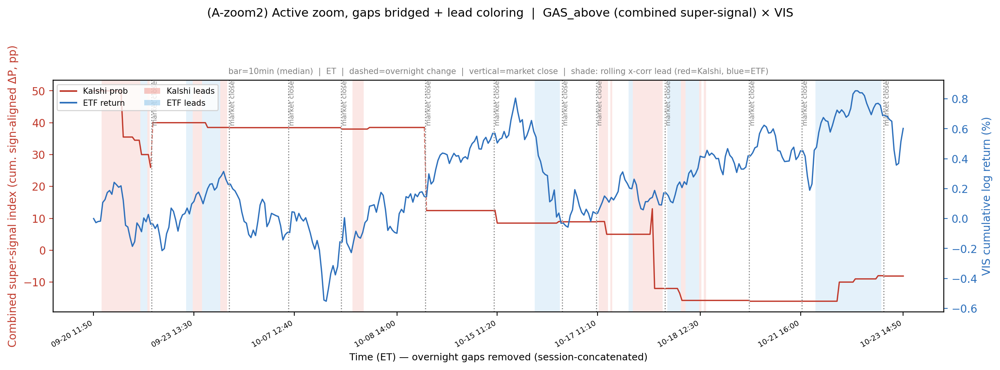
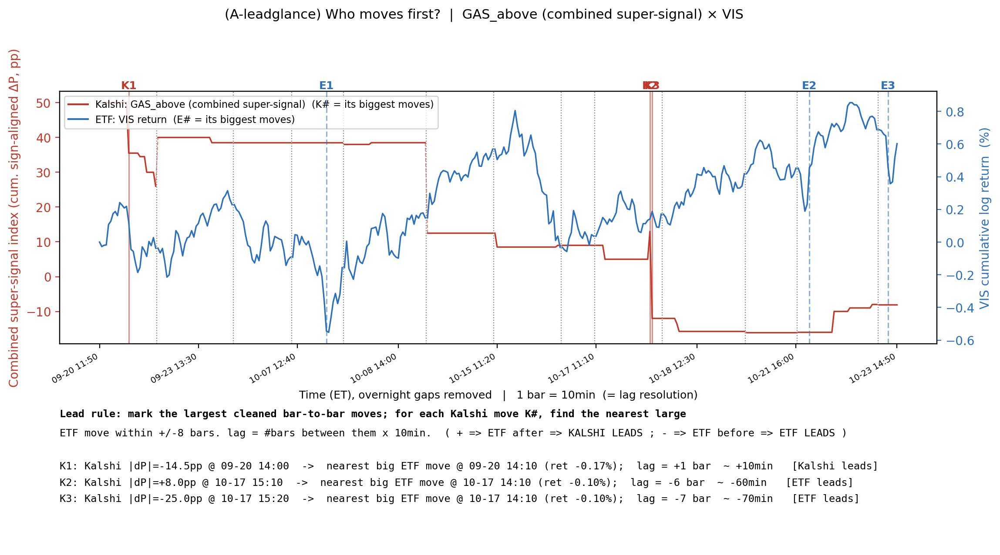
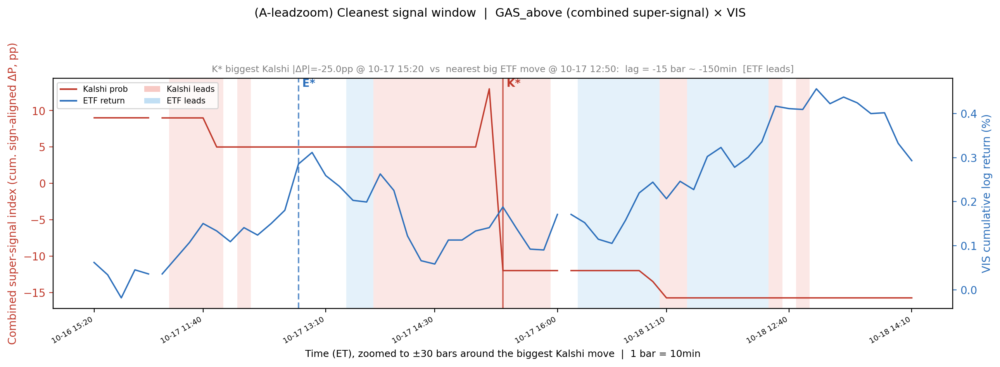
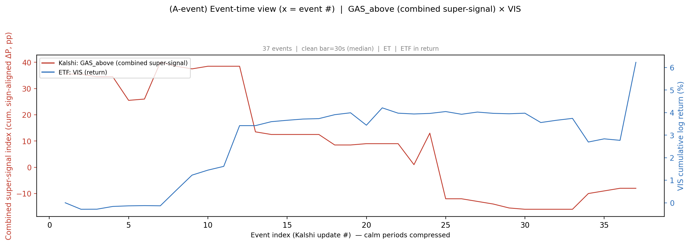
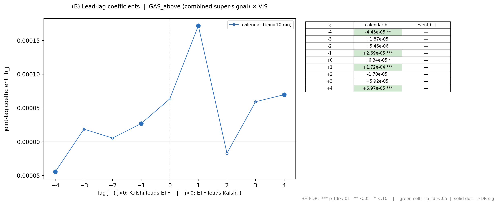


### GAS_above (combined)  ×  VNQ

```text
MERGE pseudo-pair:  GAS_above  ×  VNQ

'Contract' = combined super-signal (members' sign-aligned Δprob, pooled — NOT a price level):
  +  AAAGASM-24OCT31-US-3.15, AAAGASM-24OCT31-US-3.20, AAAGASM-24SEP30-US-3.15, KXAAAGASM-24NOV30-US-3.30
  -  (none)

Pooled regression vs this ETF (per-member FE, day-clustered SE, ADL self-lags by BIC).
Direction counts use RAW p (graded thresholds), k>0 Kalshi-leads / k<0 ETF-leads.

== CALENDAR (primary bar) ==
  K=4  ADL self-lags=0  n_obs=334
  p<0.05: Kalshi-leads 1 / ETF-leads 1   p<0.10: Kalshi-leads 1 / ETF-leads 1   p<0.15: Kalshi-leads 1 / ETF-leads 1

== EVENT (active-event) ==
  (no result)

== PROBIT (Pr(ETF up)) ==
  (no result)

== Conclusion (calendar+event) ==
  p<0.05: balanced/none (K1/E1) | p<0.10: balanced/none (K1/E1) | p<0.15: balanced/none (K1/E1)
```

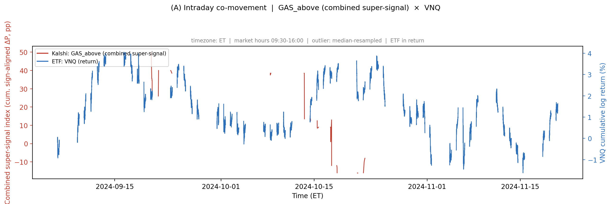
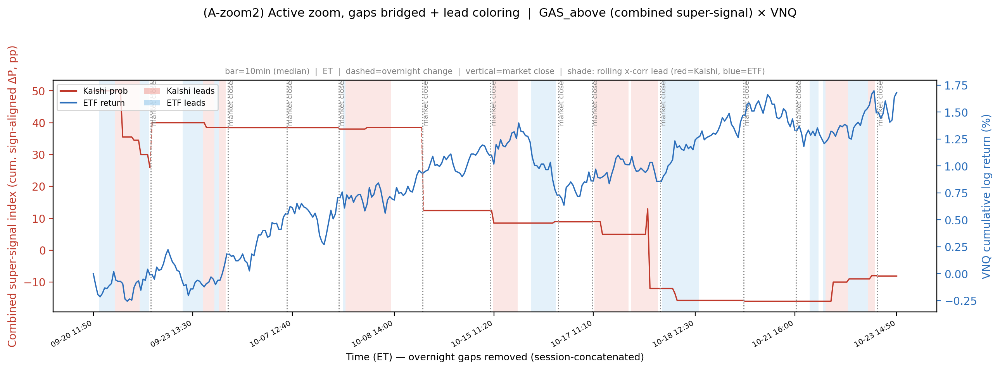
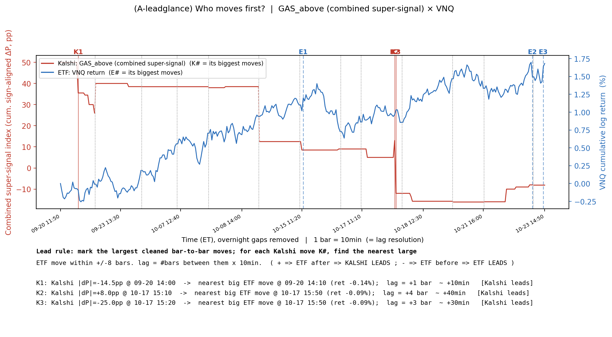
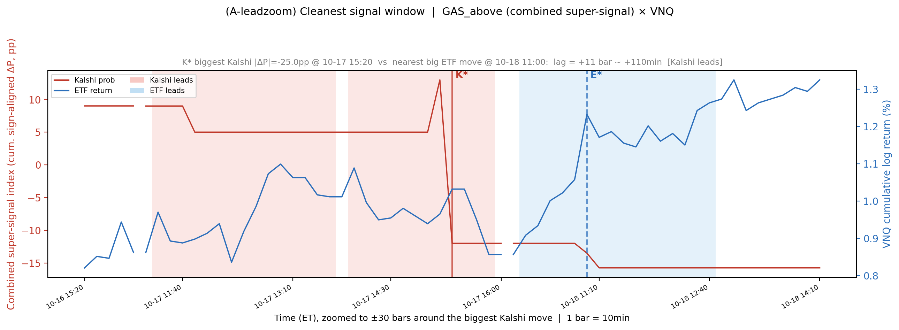
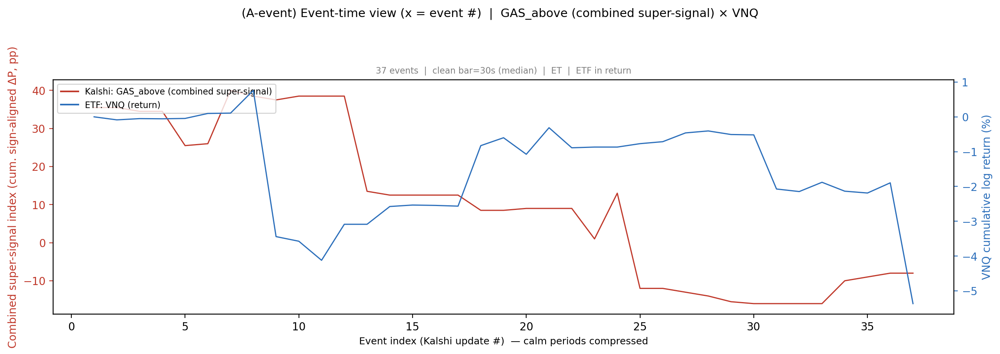
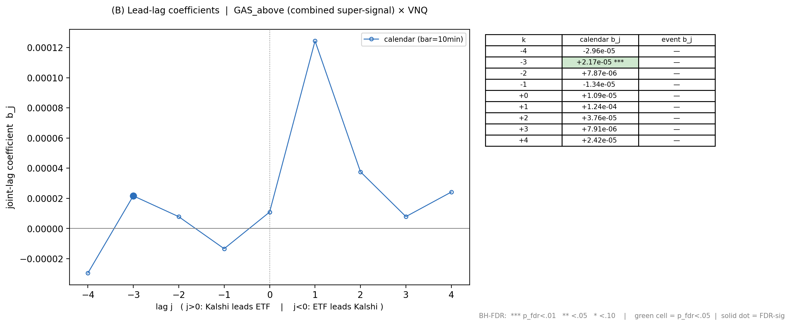


### GAS_above (combined)  ×  VOX

```text
MERGE pseudo-pair:  GAS_above  ×  VOX

'Contract' = combined super-signal (members' sign-aligned Δprob, pooled — NOT a price level):
  +  AAAGASM-24OCT31-US-3.15, AAAGASM-24OCT31-US-3.20, AAAGASM-24SEP30-US-3.15, KXAAAGASM-24NOV30-US-3.30
  -  (none)

Pooled regression vs this ETF (per-member FE, day-clustered SE, ADL self-lags by BIC).
Direction counts use RAW p (graded thresholds), k>0 Kalshi-leads / k<0 ETF-leads.

== CALENDAR (primary bar) ==
  K=4  ADL self-lags=1  n_obs=334
  p<0.05: Kalshi-leads 2 / ETF-leads 2   p<0.10: Kalshi-leads 3 / ETF-leads 3   p<0.15: Kalshi-leads 4 / ETF-leads 3

== EVENT (active-event) ==
  (no result)

== PROBIT (Pr(ETF up)) ==
  (no result)

== Conclusion (calendar+event) ==
  p<0.05: balanced/none (K2/E2) | p<0.10: balanced/none (K3/E3) | p<0.15: Kalshi-leads (K4/E3)
```

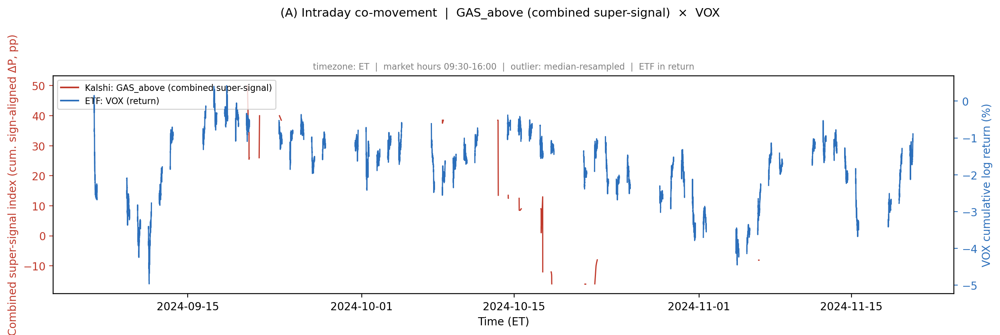
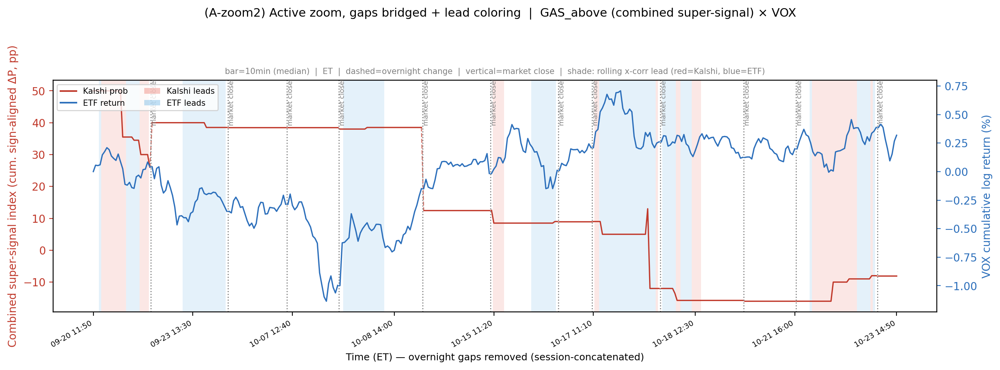
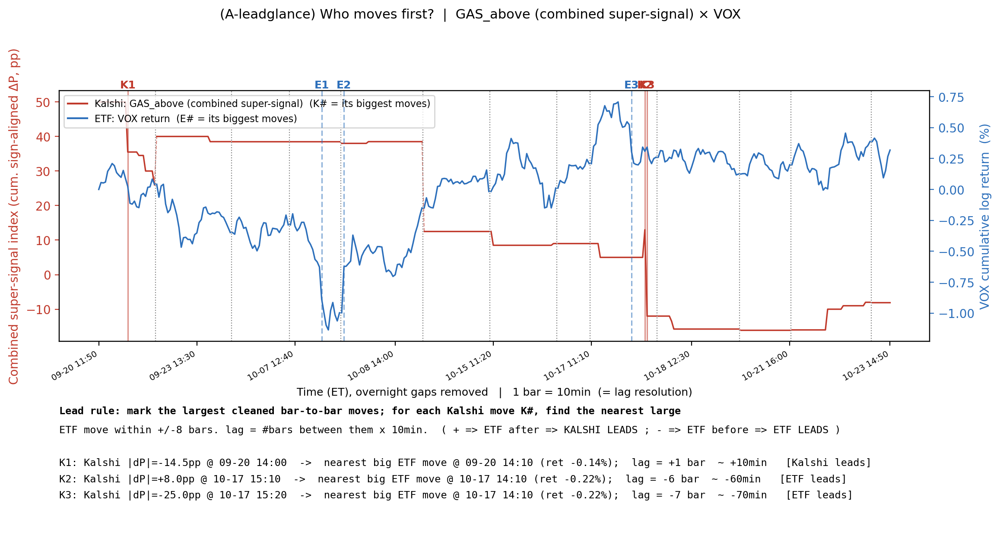
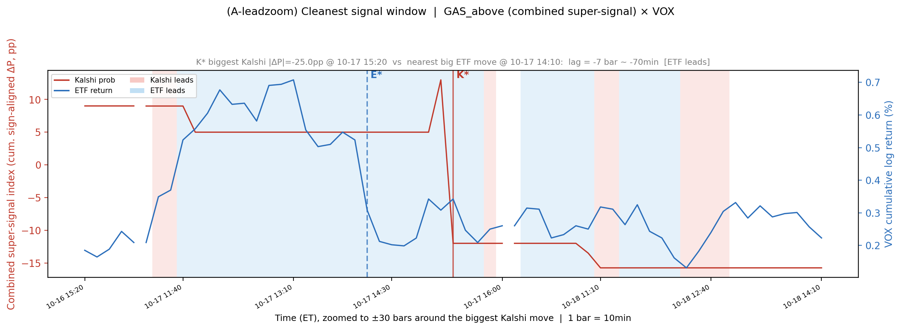
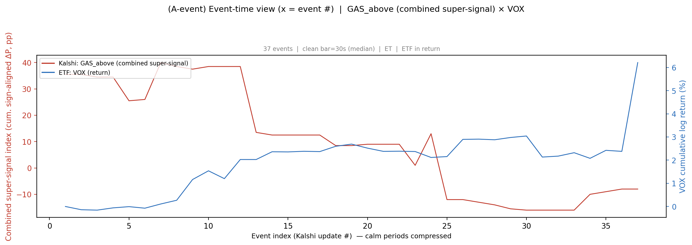
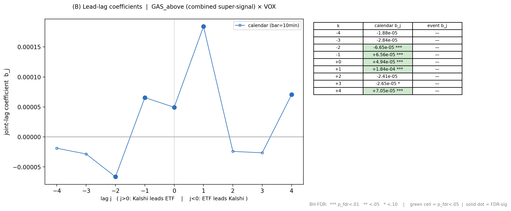


### GAS_above (combined)  ×  VPU

```text
MERGE pseudo-pair:  GAS_above  ×  VPU

'Contract' = combined super-signal (members' sign-aligned Δprob, pooled — NOT a price level):
  +  AAAGASM-24OCT31-US-3.15, AAAGASM-24OCT31-US-3.20, AAAGASM-24SEP30-US-3.15, KXAAAGASM-24NOV30-US-3.30
  -  (none)

Pooled regression vs this ETF (per-member FE, day-clustered SE, ADL self-lags by BIC).
Direction counts use RAW p (graded thresholds), k>0 Kalshi-leads / k<0 ETF-leads.

== CALENDAR (primary bar) ==
  K=4  ADL self-lags=1  n_obs=334
  p<0.05: Kalshi-leads 2 / ETF-leads 2   p<0.10: Kalshi-leads 3 / ETF-leads 2   p<0.15: Kalshi-leads 3 / ETF-leads 2

== EVENT (active-event) ==
  (no result)

== PROBIT (Pr(ETF up)) ==
  (no result)

== Conclusion (calendar+event) ==
  p<0.05: balanced/none (K2/E2) | p<0.10: Kalshi-leads (K3/E2) | p<0.15: Kalshi-leads (K3/E2)
```

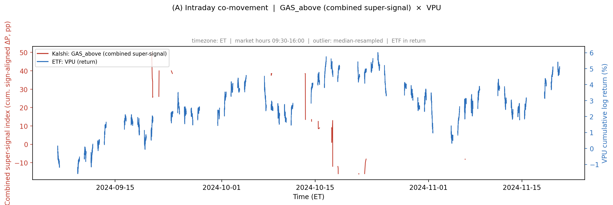
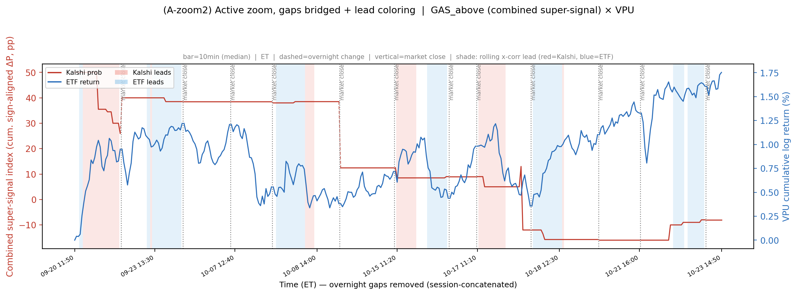
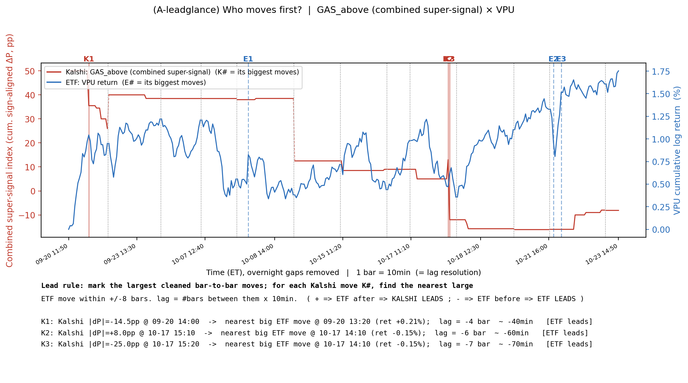
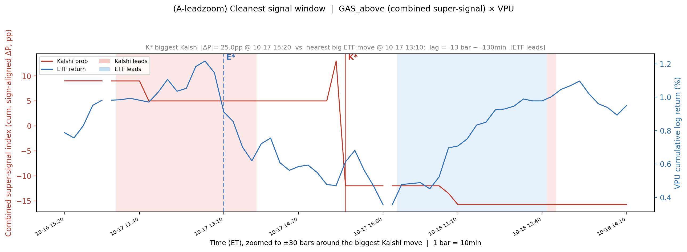
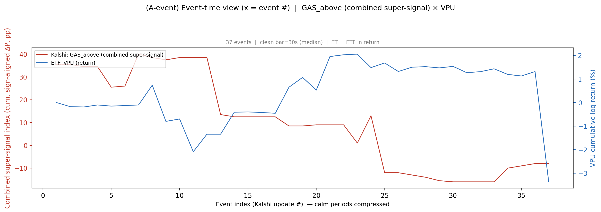
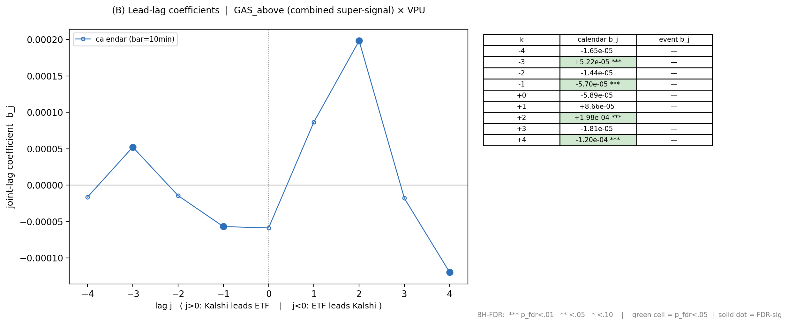

---

## MERGE — APPROVAL_strength  (pooled overview)

```text
MERGE super-signal:  APPROVAL_strength

Members pooled (sign-aligned Δprob, never concatenated price levels):
  +  538APPROVEMAX-24OCT31-T43, 538APPROVEMAX-24SEP30-T43, KX538APPROVEMAX-24NOV30-T41
  -  KX538APPROVEMIN-24NOV30-T37   (reverse contracts: Δprob flipped so +Δ = same direction)
Relevant-ETF union (8): VAW, VCR, VFH, VGT, VHT, VIS, VNQ, VOX

Pooling engine: per-member lag/ADL shift, member fixed effects, day-clustered SE;
ADL self-lag order chosen per pooled regression by BIC (column n_ylags).
Direction counts below use RAW p (same graded-threshold convention as the single-pair report).

== CALENDAR (primary bar) ==
ETF      K  ADL   n_obs   Kalshi-leads(k>0) / ETF-leads(k<0)
VAW      3    1    7058   p<0.05: K8/E0  p<0.10: K8/E1  p<0.15: K8/E2
VCR      3    1    7058   p<0.05: K0/E0  p<0.10: K2/E0  p<0.15: K2/E0
VFH      3    1    7059   p<0.05: K0/E2  p<0.10: K0/E2  p<0.15: K0/E2
VGT      3    1    7345   p<0.05: K5/E2  p<0.10: K5/E2  p<0.15: K7/E2
VHT      3    1    7188   p<0.05: K1/E1  p<0.10: K1/E1  p<0.15: K1/E1
VIS      3    1    7058   p<0.05: K2/E1  p<0.10: K2/E1  p<0.15: K4/E1
VNQ      3    1    7342   p<0.05: K1/E4  p<0.10: K2/E6  p<0.15: K2/E6
VOX      3    1    7091   p<0.05: K2/E1  p<0.10: K3/E1  p<0.15: K4/E2

== EVENT (active-event subsequence) ==
ETF      K  ADL   n_obs   Kalshi-leads(k>0) / ETF-leads(k<0)
VAW      -    -        -   (no result)
VCR      -    -        -   (no result)
VFH      -    -        -   (no result)
VGT      -    -        -   (no result)
VHT      -    -        -   (no result)
VIS      -    -        -   (no result)
VNQ      -    -        -   (no result)
VOX      -    -        -   (no result)

== PROBIT (direction test Pr(ETF up)) ==
ETF      K  ADL   n_obs   Kalshi-leads(k>0) / ETF-leads(k<0)
VAW      -    -        -   (no result)
VCR      -    -        -   (no result)
VFH      -    -        -   (no result)
VGT      -    -        -   (no result)
VHT      -    -        -   (no result)
VIS      -    -        -   (no result)
VNQ      -    -        -   (no result)
VOX      -    -        -   (no result)

== Conclusion (calendar+event pooled across the group's ETFs) ==
  p<0.05: Kalshi-leads (K19/E11) | p<0.10: Kalshi-leads (K23/E14) | p<0.15: Kalshi-leads (K28/E16)
  Read alongside the single-pair tally; pooling buys df but the lead is in the sign, not magnitude.
```


### APPROVAL_strength (combined)  ×  VAW

```text
MERGE pseudo-pair:  APPROVAL_strength  ×  VAW

'Contract' = combined super-signal (members' sign-aligned Δprob, pooled — NOT a price level):
  +  538APPROVEMAX-24OCT31-T43, 538APPROVEMAX-24SEP30-T43, KX538APPROVEMAX-24NOV30-T41
  -  KX538APPROVEMIN-24NOV30-T37   (reverse contracts: Δprob flipped)

Pooled regression vs this ETF (per-member FE, day-clustered SE, ADL self-lags by BIC).
Direction counts use RAW p (graded thresholds), k>0 Kalshi-leads / k<0 ETF-leads.

== CALENDAR (primary bar) ==
  K=3  ADL self-lags=1  n_obs=7058
  p<0.05: Kalshi-leads 8 / ETF-leads 0   p<0.10: Kalshi-leads 8 / ETF-leads 1   p<0.15: Kalshi-leads 8 / ETF-leads 2

== EVENT (active-event) ==
  (no result)

== PROBIT (Pr(ETF up)) ==
  (no result)

== Conclusion (calendar+event) ==
  p<0.05: Kalshi-leads (K8/E0) | p<0.10: Kalshi-leads (K8/E1) | p<0.15: Kalshi-leads (K8/E2)
```

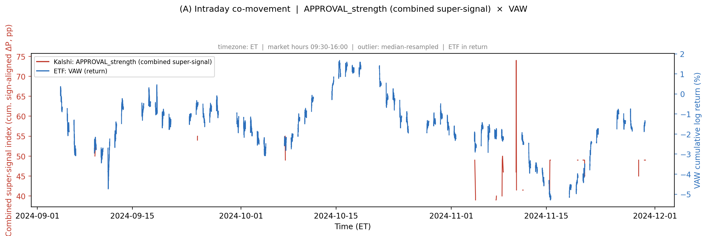
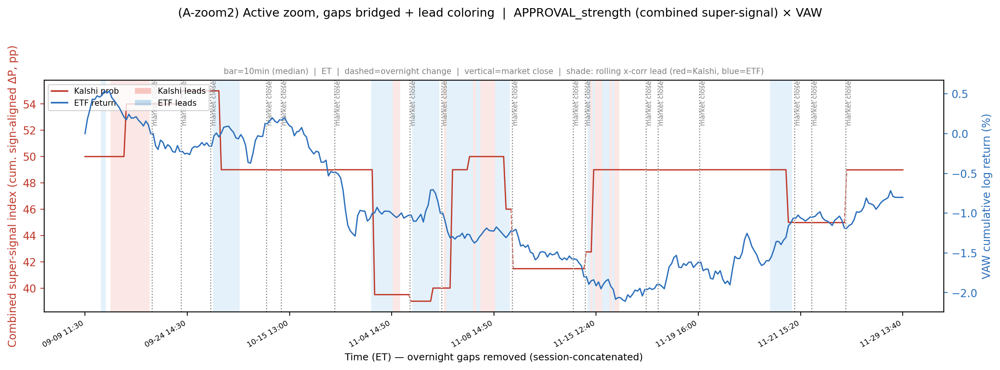
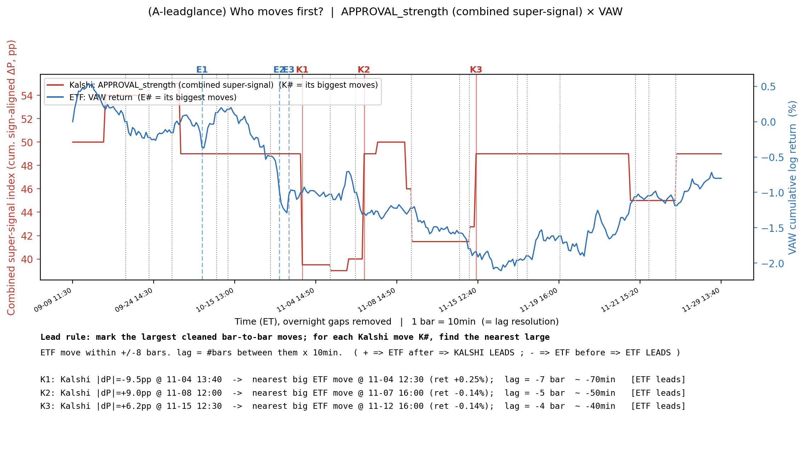
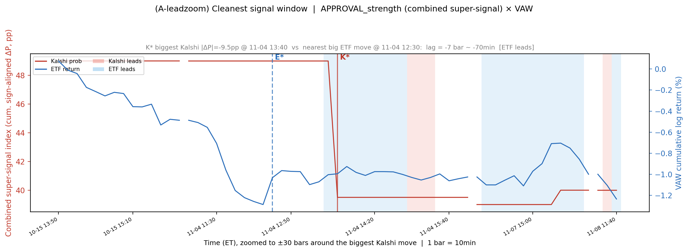
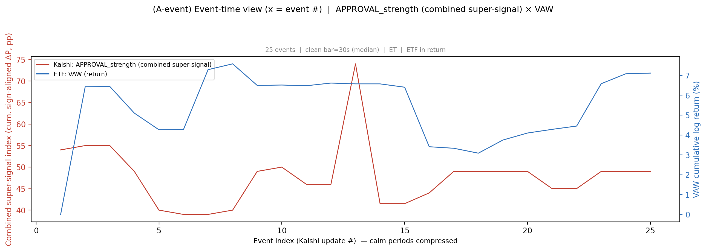
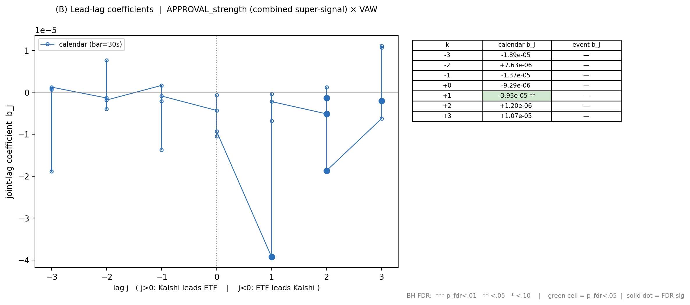


### APPROVAL_strength (combined)  ×  VCR

```text
MERGE pseudo-pair:  APPROVAL_strength  ×  VCR

'Contract' = combined super-signal (members' sign-aligned Δprob, pooled — NOT a price level):
  +  538APPROVEMAX-24OCT31-T43, 538APPROVEMAX-24SEP30-T43, KX538APPROVEMAX-24NOV30-T41
  -  KX538APPROVEMIN-24NOV30-T37   (reverse contracts: Δprob flipped)

Pooled regression vs this ETF (per-member FE, day-clustered SE, ADL self-lags by BIC).
Direction counts use RAW p (graded thresholds), k>0 Kalshi-leads / k<0 ETF-leads.

== CALENDAR (primary bar) ==
  K=3  ADL self-lags=1  n_obs=7058
  p<0.05: Kalshi-leads 0 / ETF-leads 0   p<0.10: Kalshi-leads 2 / ETF-leads 0   p<0.15: Kalshi-leads 2 / ETF-leads 0

== EVENT (active-event) ==
  (no result)

== PROBIT (Pr(ETF up)) ==
  (no result)

== Conclusion (calendar+event) ==
  p<0.05: balanced/none (K0/E0) | p<0.10: Kalshi-leads (K2/E0) | p<0.15: Kalshi-leads (K2/E0)
```

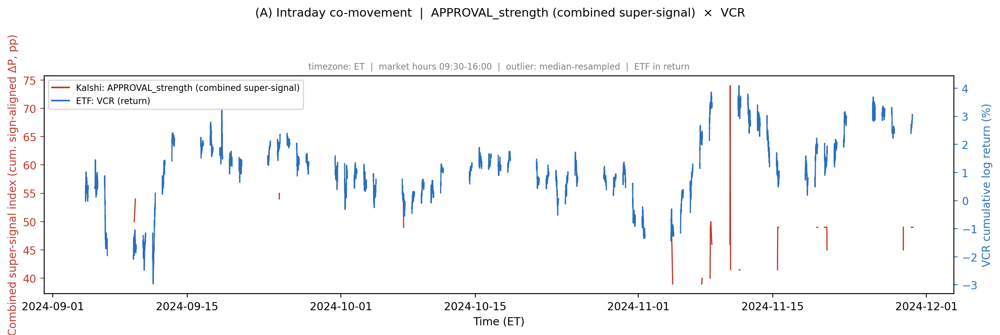
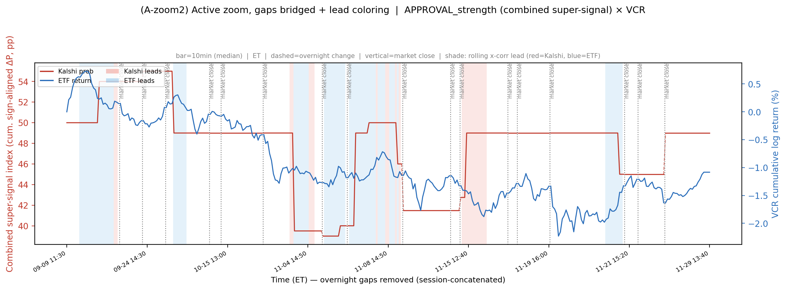
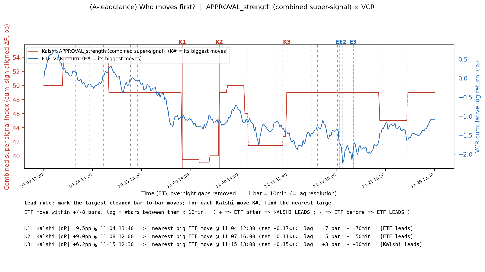
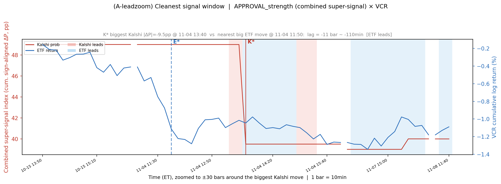
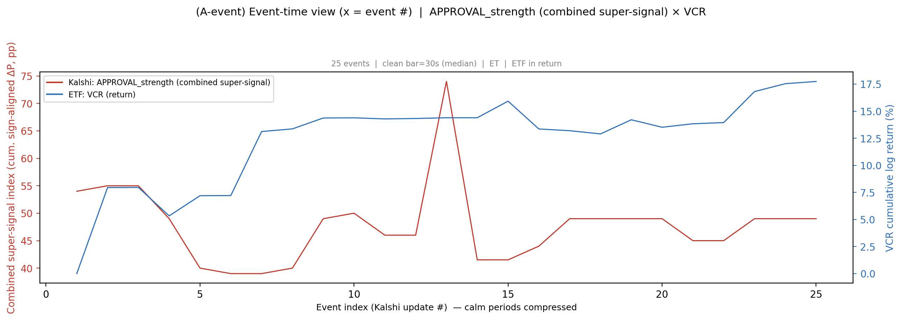
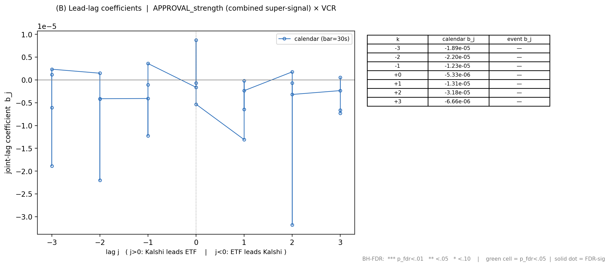


### APPROVAL_strength (combined)  ×  VFH

```text
MERGE pseudo-pair:  APPROVAL_strength  ×  VFH

'Contract' = combined super-signal (members' sign-aligned Δprob, pooled — NOT a price level):
  +  538APPROVEMAX-24OCT31-T43, 538APPROVEMAX-24SEP30-T43, KX538APPROVEMAX-24NOV30-T41
  -  KX538APPROVEMIN-24NOV30-T37   (reverse contracts: Δprob flipped)

Pooled regression vs this ETF (per-member FE, day-clustered SE, ADL self-lags by BIC).
Direction counts use RAW p (graded thresholds), k>0 Kalshi-leads / k<0 ETF-leads.

== CALENDAR (primary bar) ==
  K=3  ADL self-lags=1  n_obs=7059
  p<0.05: Kalshi-leads 0 / ETF-leads 2   p<0.10: Kalshi-leads 0 / ETF-leads 2   p<0.15: Kalshi-leads 0 / ETF-leads 2

== EVENT (active-event) ==
  (no result)

== PROBIT (Pr(ETF up)) ==
  (no result)

== Conclusion (calendar+event) ==
  p<0.05: ETF-leads (K0/E2) | p<0.10: ETF-leads (K0/E2) | p<0.15: ETF-leads (K0/E2)
```

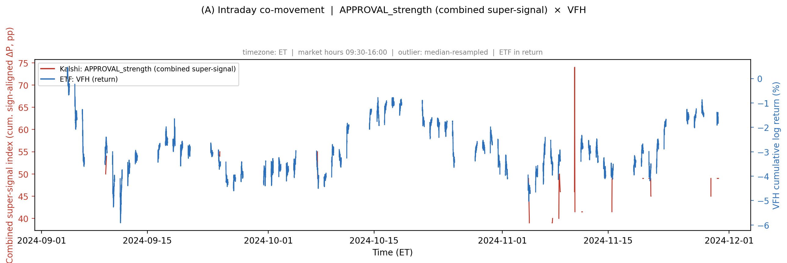
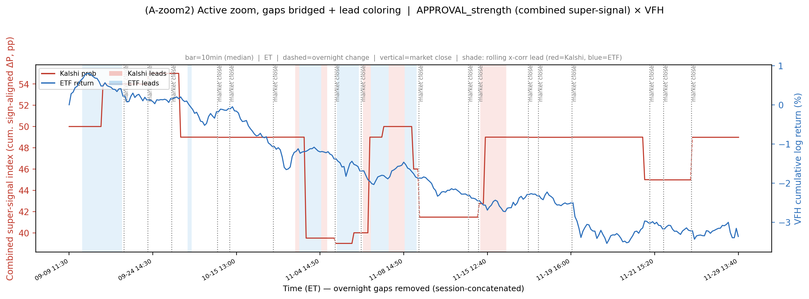
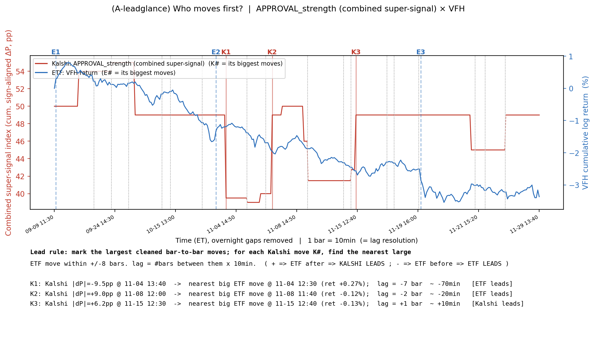
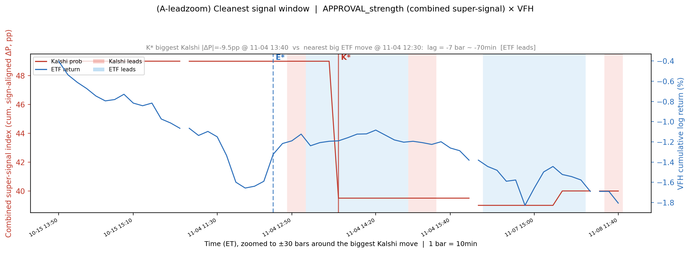
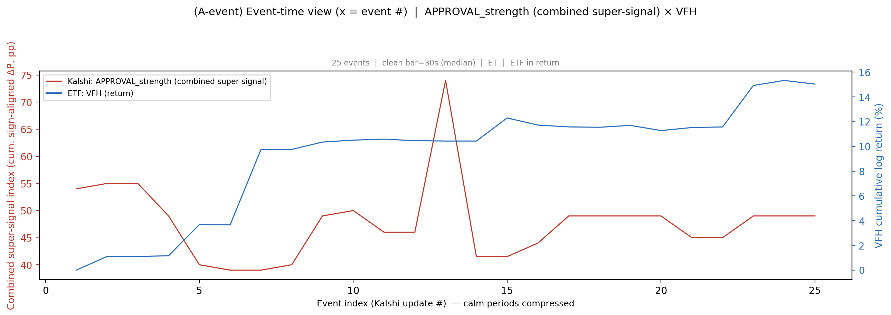
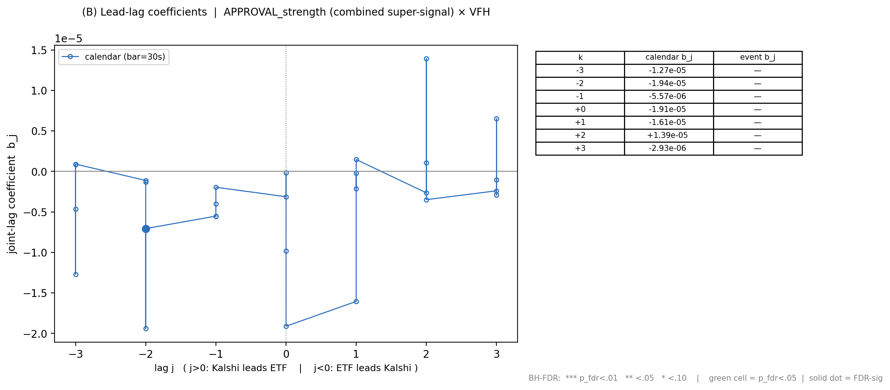


### APPROVAL_strength (combined)  ×  VGT

```text
MERGE pseudo-pair:  APPROVAL_strength  ×  VGT

'Contract' = combined super-signal (members' sign-aligned Δprob, pooled — NOT a price level):
  +  538APPROVEMAX-24OCT31-T43, 538APPROVEMAX-24SEP30-T43, KX538APPROVEMAX-24NOV30-T41
  -  KX538APPROVEMIN-24NOV30-T37   (reverse contracts: Δprob flipped)

Pooled regression vs this ETF (per-member FE, day-clustered SE, ADL self-lags by BIC).
Direction counts use RAW p (graded thresholds), k>0 Kalshi-leads / k<0 ETF-leads.

== CALENDAR (primary bar) ==
  K=3  ADL self-lags=1  n_obs=7345
  p<0.05: Kalshi-leads 5 / ETF-leads 2   p<0.10: Kalshi-leads 5 / ETF-leads 2   p<0.15: Kalshi-leads 7 / ETF-leads 2

== EVENT (active-event) ==
  (no result)

== PROBIT (Pr(ETF up)) ==
  (no result)

== Conclusion (calendar+event) ==
  p<0.05: Kalshi-leads (K5/E2) | p<0.10: Kalshi-leads (K5/E2) | p<0.15: Kalshi-leads (K7/E2)
```

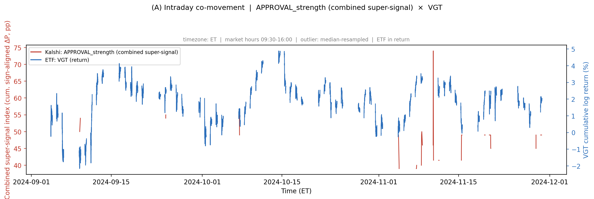
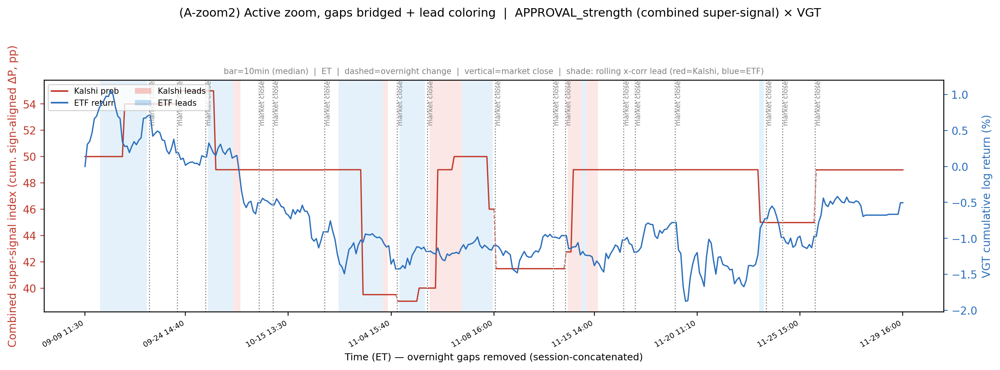
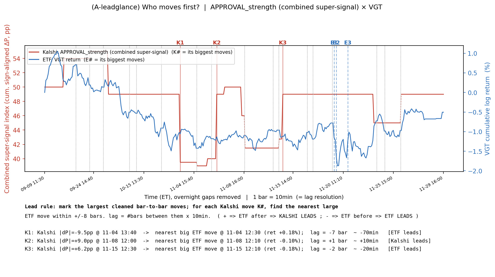
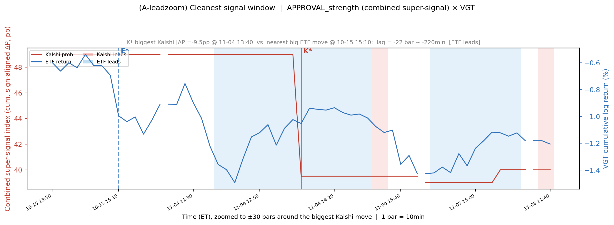
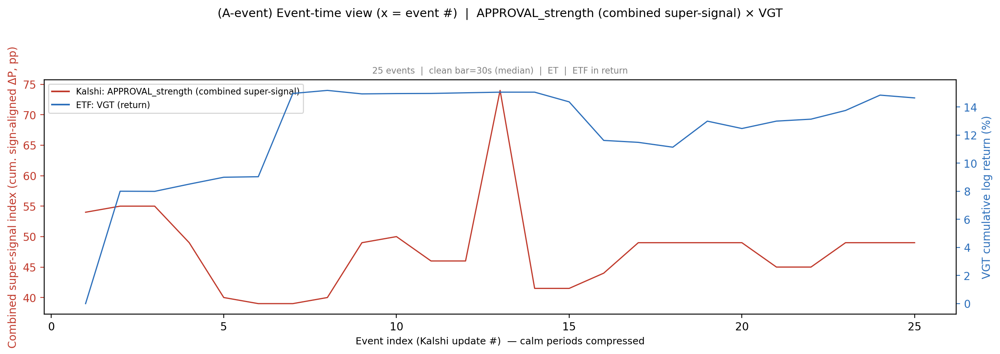
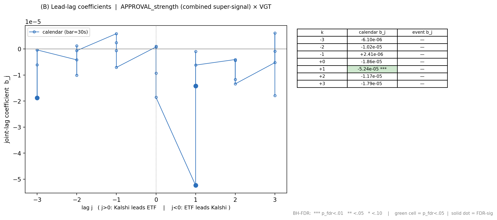


### APPROVAL_strength (combined)  ×  VHT

```text
MERGE pseudo-pair:  APPROVAL_strength  ×  VHT

'Contract' = combined super-signal (members' sign-aligned Δprob, pooled — NOT a price level):
  +  538APPROVEMAX-24OCT31-T43, 538APPROVEMAX-24SEP30-T43, KX538APPROVEMAX-24NOV30-T41
  -  KX538APPROVEMIN-24NOV30-T37   (reverse contracts: Δprob flipped)

Pooled regression vs this ETF (per-member FE, day-clustered SE, ADL self-lags by BIC).
Direction counts use RAW p (graded thresholds), k>0 Kalshi-leads / k<0 ETF-leads.

== CALENDAR (primary bar) ==
  K=3  ADL self-lags=1  n_obs=7188
  p<0.05: Kalshi-leads 1 / ETF-leads 1   p<0.10: Kalshi-leads 1 / ETF-leads 1   p<0.15: Kalshi-leads 1 / ETF-leads 1

== EVENT (active-event) ==
  (no result)

== PROBIT (Pr(ETF up)) ==
  (no result)

== Conclusion (calendar+event) ==
  p<0.05: balanced/none (K1/E1) | p<0.10: balanced/none (K1/E1) | p<0.15: balanced/none (K1/E1)
```

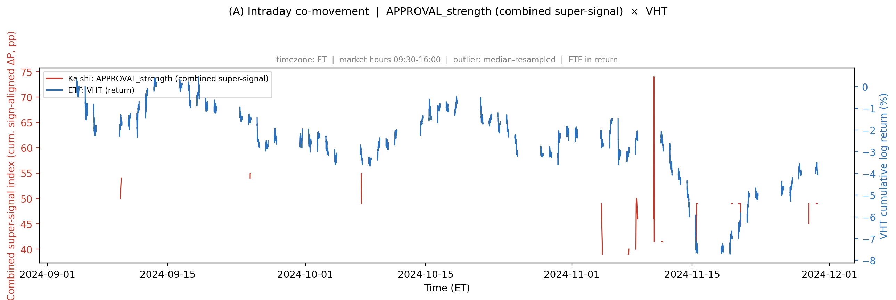
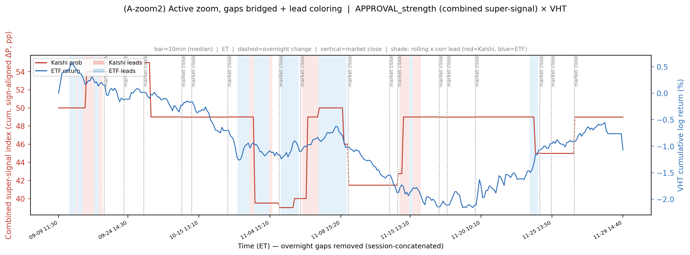
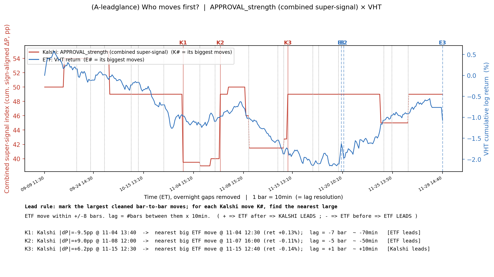
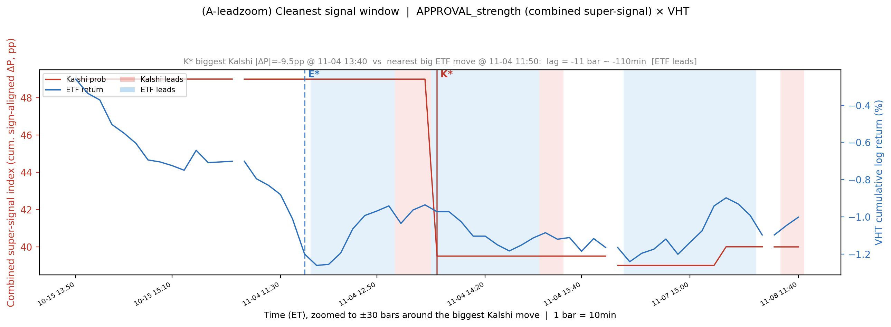
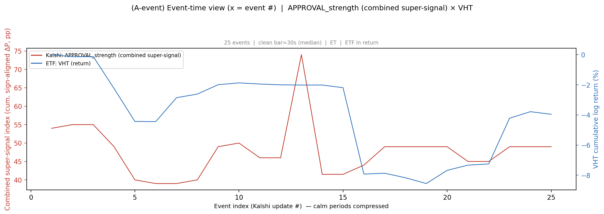
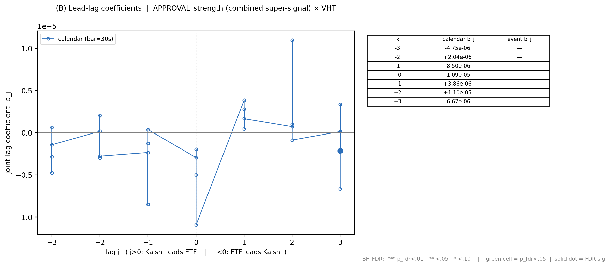


### APPROVAL_strength (combined)  ×  VIS

```text
MERGE pseudo-pair:  APPROVAL_strength  ×  VIS

'Contract' = combined super-signal (members' sign-aligned Δprob, pooled — NOT a price level):
  +  538APPROVEMAX-24OCT31-T43, 538APPROVEMAX-24SEP30-T43, KX538APPROVEMAX-24NOV30-T41
  -  KX538APPROVEMIN-24NOV30-T37   (reverse contracts: Δprob flipped)

Pooled regression vs this ETF (per-member FE, day-clustered SE, ADL self-lags by BIC).
Direction counts use RAW p (graded thresholds), k>0 Kalshi-leads / k<0 ETF-leads.

== CALENDAR (primary bar) ==
  K=3  ADL self-lags=1  n_obs=7058
  p<0.05: Kalshi-leads 2 / ETF-leads 1   p<0.10: Kalshi-leads 2 / ETF-leads 1   p<0.15: Kalshi-leads 4 / ETF-leads 1

== EVENT (active-event) ==
  (no result)

== PROBIT (Pr(ETF up)) ==
  (no result)

== Conclusion (calendar+event) ==
  p<0.05: Kalshi-leads (K2/E1) | p<0.10: Kalshi-leads (K2/E1) | p<0.15: Kalshi-leads (K4/E1)
```

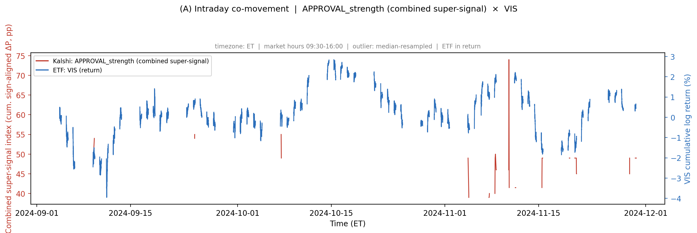
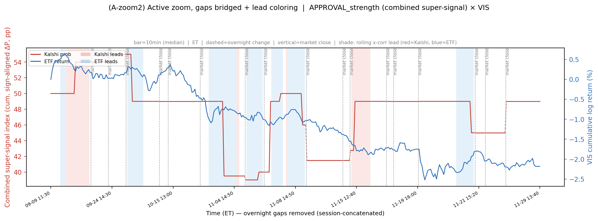
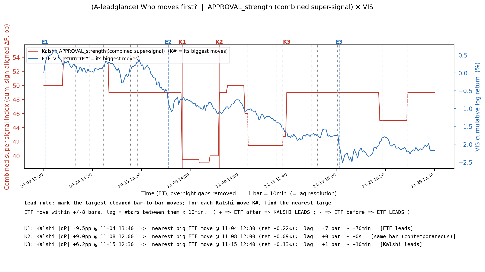
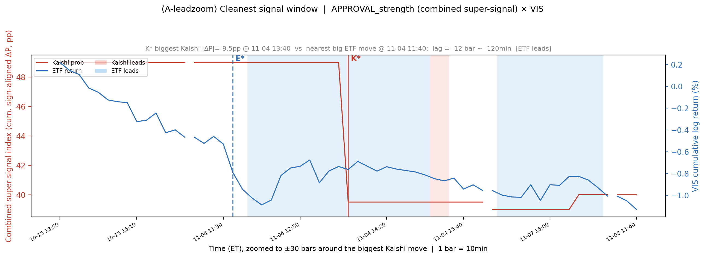
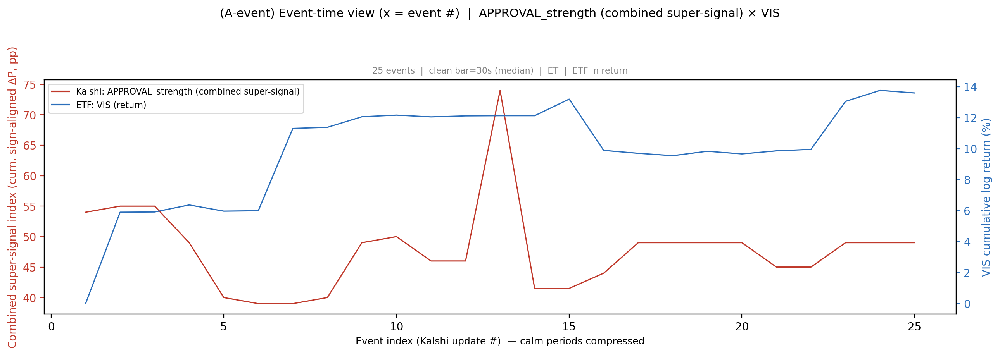
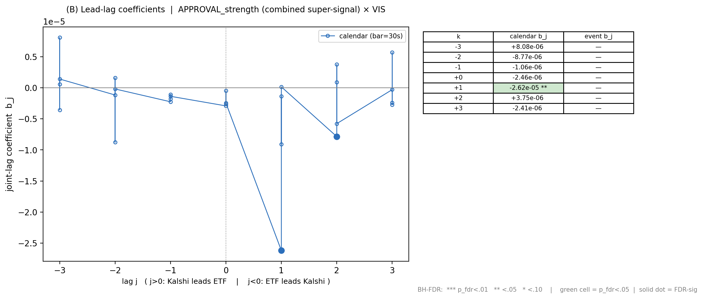


### APPROVAL_strength (combined)  ×  VNQ

```text
MERGE pseudo-pair:  APPROVAL_strength  ×  VNQ

'Contract' = combined super-signal (members' sign-aligned Δprob, pooled — NOT a price level):
  +  538APPROVEMAX-24OCT31-T43, 538APPROVEMAX-24SEP30-T43, KX538APPROVEMAX-24NOV30-T41
  -  KX538APPROVEMIN-24NOV30-T37   (reverse contracts: Δprob flipped)

Pooled regression vs this ETF (per-member FE, day-clustered SE, ADL self-lags by BIC).
Direction counts use RAW p (graded thresholds), k>0 Kalshi-leads / k<0 ETF-leads.

== CALENDAR (primary bar) ==
  K=3  ADL self-lags=1  n_obs=7342
  p<0.05: Kalshi-leads 1 / ETF-leads 4   p<0.10: Kalshi-leads 2 / ETF-leads 6   p<0.15: Kalshi-leads 2 / ETF-leads 6

== EVENT (active-event) ==
  (no result)

== PROBIT (Pr(ETF up)) ==
  (no result)

== Conclusion (calendar+event) ==
  p<0.05: ETF-leads (K1/E4) | p<0.10: ETF-leads (K2/E6) | p<0.15: ETF-leads (K2/E6)
```

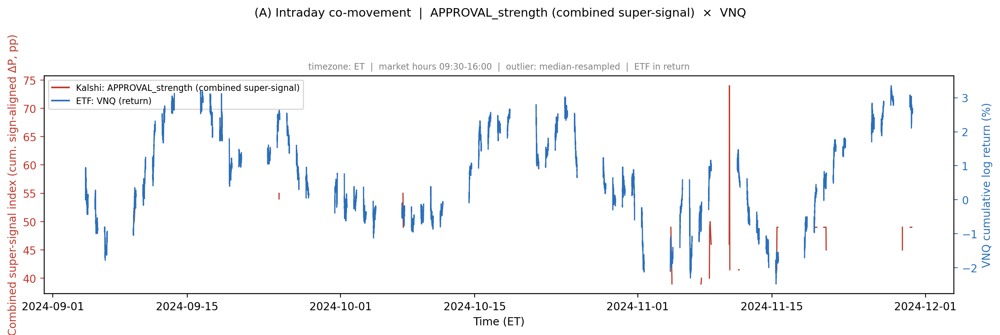
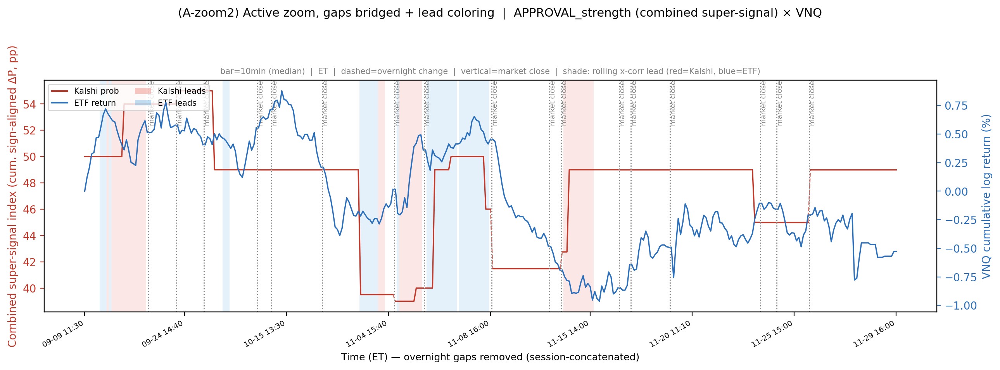
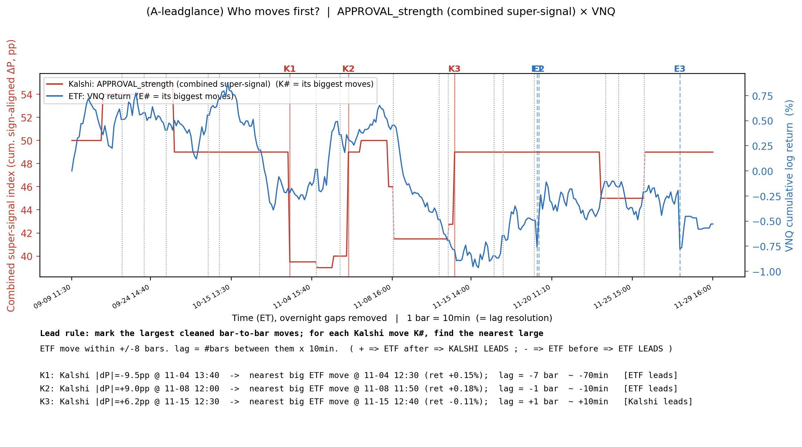
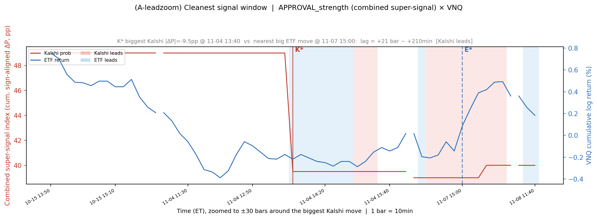
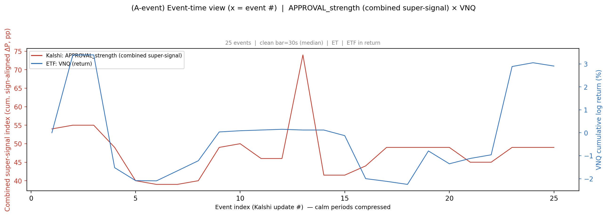
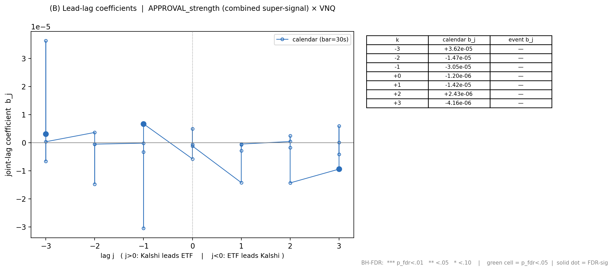


### APPROVAL_strength (combined)  ×  VOX

```text
MERGE pseudo-pair:  APPROVAL_strength  ×  VOX

'Contract' = combined super-signal (members' sign-aligned Δprob, pooled — NOT a price level):
  +  538APPROVEMAX-24OCT31-T43, 538APPROVEMAX-24SEP30-T43, KX538APPROVEMAX-24NOV30-T41
  -  KX538APPROVEMIN-24NOV30-T37   (reverse contracts: Δprob flipped)

Pooled regression vs this ETF (per-member FE, day-clustered SE, ADL self-lags by BIC).
Direction counts use RAW p (graded thresholds), k>0 Kalshi-leads / k<0 ETF-leads.

== CALENDAR (primary bar) ==
  K=3  ADL self-lags=1  n_obs=7091
  p<0.05: Kalshi-leads 2 / ETF-leads 1   p<0.10: Kalshi-leads 3 / ETF-leads 1   p<0.15: Kalshi-leads 4 / ETF-leads 2

== EVENT (active-event) ==
  (no result)

== PROBIT (Pr(ETF up)) ==
  (no result)

== Conclusion (calendar+event) ==
  p<0.05: Kalshi-leads (K2/E1) | p<0.10: Kalshi-leads (K3/E1) | p<0.15: Kalshi-leads (K4/E2)
```

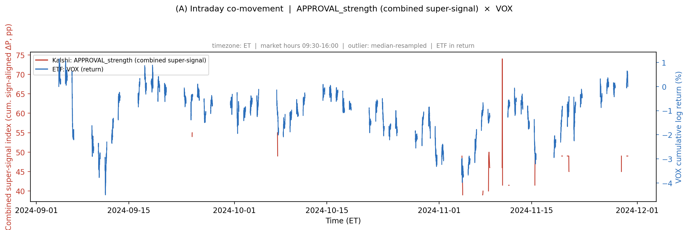
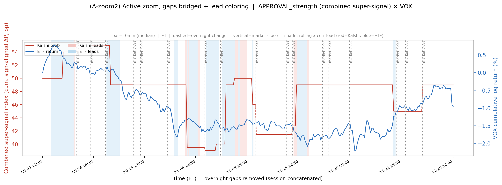
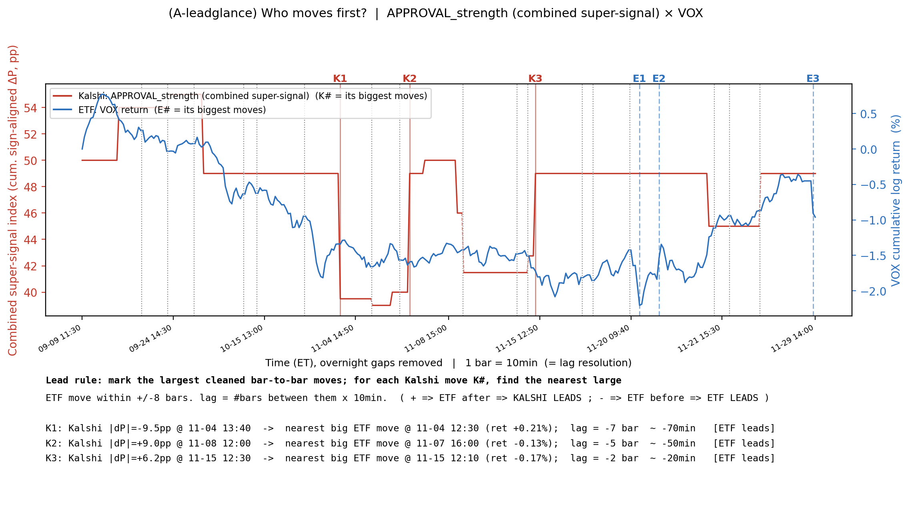
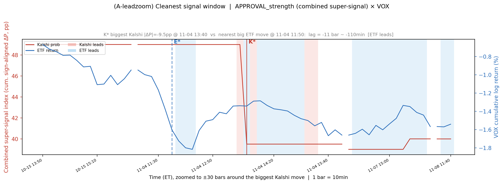
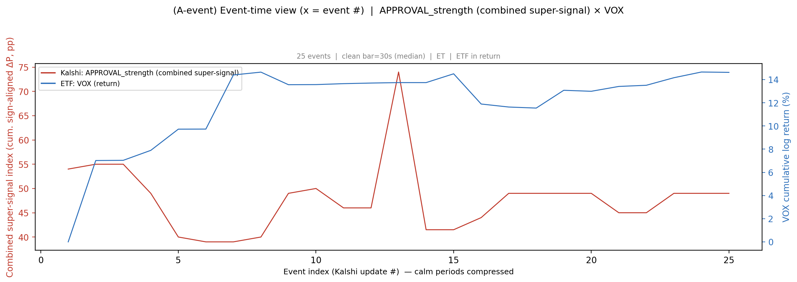
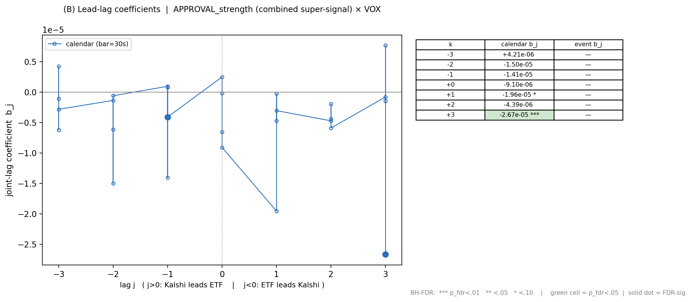
