# Lead-Lag Report — Kalshi prediction markets × Vanguard sector ETFs

_This Markdown mirrors `leadlag_pairs_report.pdf` in the same order: overview, then 48 ranked pairs (each: text analysis + figures), then 4 merged super-signals. Figures are the very PNGs the PDF embeds; text blocks are the same `.md` sources._

**Ranking order:** has_result → n_trades → n_sig (raw p<0.15) → best_p.  **Per-pair significance:** raw p<0.15.  **ADL ETF self-lags:** chosen per pair by BIC.

---

## OVERVIEW — conclusions (graded thresholds p<0.05 / 0.10 / 0.15)

````text
# Lead/Lag classification summary

Scope: all 48 pairs (Kalshi contract x ETF). Lean rule: across calendar+event, count
significant lags at p<0.05 / 0.10 / 0.15 (raw p; nested, p<0.05 ⊆ p<0.10 ⊆ p<0.15) per
direction (k>0 Kalshi-leads, k<0 ETF-leads). **A lean conclusion is produced at EACH tier**, not
a single chosen threshold, so the Overall and every cross-tab below appear three times (one per tier).
Reliability rule: tiered by residual df (= effective obs - #parameters), NOT a trade-count cutoff.

## Overall — lean counts at each threshold

```
        Kalshi-leads  ETF-leads  Balanced/mixed  No-sig-lead
p<0.05             6          8               8           26
p<0.1              6         10               8           24
p<0.15             6          8              10           24
```

## By contract type

**lean at p<0.05:**

```
lean_05        Kalshi-leads  ETF-leads  Balanced/mixed  No-sig-lead  Total
contract_type                                                             
Election                  5          6               5            2     18
GasPrice                  0          0               0           11     11
Rates(FOMC)               1          2               3            5     11
Approval                  0          0               0            8      8
```

**lean at p<0.1:**

```
lean_10        Kalshi-leads  ETF-leads  Balanced/mixed  No-sig-lead  Total
contract_type                                                             
Election                  3          7               6            2     18
GasPrice                  0          0               0           11     11
Rates(FOMC)               3          3               2            3     11
Approval                  0          0               0            8      8
```

**lean at p<0.15:**

```
lean_15        Kalshi-leads  ETF-leads  Balanced/mixed  No-sig-lead  Total
contract_type                                                             
Election                  3          7               6            2     18
GasPrice                  0          0               0           11     11
Rates(FOMC)               3          1               4            3     11
Approval                  0          0               0            8      8
```

## By event kind (sharp one-shot vs continuous)

**lean at p<0.05:**

```
lean_05          Kalshi-leads  ETF-leads  Balanced/mixed  No-sig-lead  Total
event_kind                                                                  
Sharp(one-shot)             6          8               8            7     29
Continuous                  0          0               0           19     19
```

**lean at p<0.1:**

```
lean_10          Kalshi-leads  ETF-leads  Balanced/mixed  No-sig-lead  Total
event_kind                                                                  
Sharp(one-shot)             6         10               8            5     29
Continuous                  0          0               0           19     19
```

**lean at p<0.15:**

```
lean_15          Kalshi-leads  ETF-leads  Balanced/mixed  No-sig-lead  Total
event_kind                                                                  
Sharp(one-shot)             6          8              10            5     29
Continuous                  0          0               0           19     19
```

## By ETF sector

**lean at p<0.05:**

```
lean_05       Kalshi-leads  ETF-leads  Balanced/mixed  No-sig-lead  Total
sector                                                                   
Comm                     1          1               1            3      6
Info-Tech                0          1               2            3      6
Cons.Disc                1          1               0            3      5
Financials               0          1               2            2      5
Industrials              2          0               1            2      5
Real-Estate              0          1               0            4      5
Cons.Staples             1          1               1            1      4
Energy                   1          0               0            3      4
Materials                0          2               0            2      4
Health                   0          0               0            2      2
Utilities                0          0               1            1      2
```

**lean at p<0.1:**

```
lean_10       Kalshi-leads  ETF-leads  Balanced/mixed  No-sig-lead  Total
sector                                                                   
Comm                     1          2               0            3      6
Info-Tech                0          1               2            3      6
Cons.Disc                0          1               1            3      5
Financials               1          1               1            2      5
Industrials              1          0               2            2      5
Real-Estate              0          1               1            3      5
Cons.Staples             1          1               1            1      4
Energy                   1          1               0            2      4
Materials                0          2               0            2      4
Health                   0          0               0            2      2
Utilities                1          0               0            1      2
```

**lean at p<0.15:**

```
lean_15       Kalshi-leads  ETF-leads  Balanced/mixed  No-sig-lead  Total
sector                                                                   
Comm                     1          2               0            3      6
Info-Tech                0          1               2            3      6
Cons.Disc                0          1               1            3      5
Financials               1          1               1            2      5
Industrials              1          0               2            2      5
Real-Estate              0          1               1            3      5
Cons.Staples             1          0               2            1      4
Energy                   1          0               1            2      4
Materials                0          2               0            2      4
Health                   0          0               0            2      2
Utilities                1          0               0            1      2
```

## By statistical reliability (df-based)

**lean at p<0.05:**

```
lean_05          Kalshi-leads  ETF-leads  Balanced/mixed  No-sig-lead  Total
reliability                                                                 
Cannot-estimate             0          0               0           23     23
Adequate                    1          4               5            2     12
Very-low-info               4          3               3            1     11
Low-info                    1          1               0            0      2
```

**lean at p<0.1:**

```
lean_10          Kalshi-leads  ETF-leads  Balanced/mixed  No-sig-lead  Total
reliability                                                                 
Cannot-estimate             0          0               0           23     23
Adequate                    3          6               3            0     12
Very-low-info               2          3               5            1     11
Low-info                    1          1               0            0      2
```

**lean at p<0.15:**

```
lean_15          Kalshi-leads  ETF-leads  Balanced/mixed  No-sig-lead  Total
reliability                                                                 
Cannot-estimate             0          0               0           23     23
Adequate                    3          4               5            0     12
Very-low-info               2          3               5            1     11
Low-info                    1          1               0            0      2
```

## Direction by graded significance (no single cutoff)

Report direction at p<0.05 / 0.10 / 0.15 rather than one threshold, to show robustness.

**calendar (primary bar)**  (coefficient = pair × lag, raw p)

```
 thresh |  sig | Kalshi(k>0) | ETF(k<0) | contemp
 p<0.05 |   73 |          34 |       35 |       4
 p<0.1  |   89 |          42 |       41 |       6
 p<0.15 |   98 |          46 |       46 |       6
```

**event (backward-diff, comparable to calendar)**  (coefficient = pair × lag, raw p)

```
 thresh |  sig | Kalshi(k>0) | ETF(k<0) | contemp
 p<0.05 |   19 |           5 |       12 |       2
 p<0.1  |   28 |           9 |       17 |       2
 p<0.15 |   34 |          14 |       18 |       2
```

**probit (direction-only; Kalshi-leads requires beta>0)**  (coefficient = pair × lag, raw p)

```
 thresh |  sig | Kalshi(k>0) | ETF(k<0) | contemp
 p<0.05 |   39 |           4 |       22 |       3
 p<0.1  |   65 |           6 |       37 |       5
 p<0.15 |   88 |          11 |       49 |       6
```

## Conclusion

- **Pairs without data expose themselves**: 23 **cannot be estimated** (params >= obs) and 11 have **very low df** (huge SE, 'significant' is untrustworthy) -- high-frequency lead-lag is only meaningful on the 12 pairs with adequate df.
- **Even the reliable group is not one-sided**: of 12 adequate-df pairs, lean by tier — p<0.05 K1/E4/B5/N2; p<0.1 K3/E6/B3/N0; p<0.15 K3/E4/B5/N0 — no side dominates at any threshold.
- **Direction is threshold-robust but method-split** (see graded table above): across p<0.05/0.10/0.15 the linear regressions (calendar, event) split ~1:1 with no net lead at any threshold, while the direction-only probit consistently favors ETF-leads (~5:1). Any lead lives in the *sign* of ETF moves, not their magnitude.
- **Construction note**: event uses the same causal backward-diff as calendar (differing only in active-event vs clock timepoints). An earlier forward-return event construction had spuriously inflated ETF-leads by overlapping each event's forward window with the next event; that artifact is removed, after which event splits ~1:1.
- **By type**: election / FOMC (one-shot event) contracts contribute almost all of the estimable, significant structure; gas-price / approval (continuous) contracts mostly fall in 'cannot estimate'.
- **Conclusion**: directional lead is **NOT concentrated in any single clean category**; the strongest signal comes from adequate-df one-shot-event contracts (election, FOMC), but within them Kalshi-leads and ETF-leads coexist -- supporting the main finding of 'no clean single-direction lead'.

## Pairs in each category (which pairs fall under each classification)

For each of the four dimensions, every category lists its pairs with their lean at each tier [05|10|15], abbreviated K=Kalshi-leads, E=ETF-leads, B=Balanced/mixed, N=No-sig-lead (so each count above can be traced to the actual pairs).

### By contract type

- **Approval** (8): 538APPROVEMAX-24OCT31-T43×VOX [N|N|N], 538APPROVEMAX-24SEP30-T43×VAW [N|N|N], 538APPROVEMAX-24SEP30-T43×VCR [N|N|N], 538APPROVEMAX-24SEP30-T43×VIS [N|N|N], KX538APPROVEMAX-24NOV30-T41×VGT [N|N|N], KX538APPROVEMAX-24NOV30-T41×VHT [N|N|N], KX538APPROVEMIN-24NOV30-T37×VFH [N|N|N], KX538APPROVEMIN-24NOV30-T37×VNQ [N|N|N]
- **Election** (18): KXECDJT281×VGT [B|B|B], KXECDJT316×VIS [K|B|B], KXECKH276×VCR [K|B|B], KXECKH276×VDC [B|B|B], KXECKH276×VFH [B|B|B], KXECKH276×VGT [B|B|B], KXECDJT281×VCR [E|E|E], KXECDJT281×VNQ [E|E|E], KXECDJT281×VOX [B|E|E], KXECDJT312×VAW [E|E|E], KXECDJT316×VFH [E|E|E], KXECKH276×VAW [E|E|E], KXECKH276×VOX [E|E|E], KXECDJT306×VDC [K|K|K], KXECKH276×VDE [K|K|K], KXECKH276×VIS [K|K|K], KXECDJT316×VDE [N|N|N], KXECKH287×VNQ [N|N|N]
- **GasPrice** (11): AAAGASM-24OCT31-US-3.15×VPU [N|N|N], AAAGASM-24OCT31-US-3.20×VHT [N|N|N], AAAGASM-24SEP30-US-3.15×VAW [N|N|N], AAAGASM-24SEP30-US-3.15×VCR [N|N|N], AAAGASM-24SEP30-US-3.15×VGT [N|N|N], AAAGASM-24SEP30-US-3.15×VIS [N|N|N], AAAGASM-24SEP30-US-3.15×VOX [N|N|N], KXAAAGASM-24NOV30-US-3.30×VDC [N|N|N], KXAAAGASM-24NOV30-US-3.30×VDE [N|N|N], KXAAAGASM-24NOV30-US-3.30×VFH [N|N|N], KXAAAGASM-24NOV30-US-3.30×VNQ [N|N|N]
- **Rates(FOMC)** (11): FEDDECISION-24NOV-H0×VDE [N|E|B], FEDDECISION-24NOV-H0×VNQ [N|B|B], FEDDECISION-24SEP-C25×VDC [E|E|B], KXFEDDECISION-24DEC-C25×VIS [B|B|B], KXFEDDECISION-24DEC-H0×VGT [E|E|E], FEDDECISION-24SEP-C25×VOX [K|K|K], FEDDECISION-24SEP-C25×VPU [B|K|K], KXFEDDECISION-24DEC-C25×VFH [B|K|K], RATECUT-24SEP18×VCR [N|N|N], RATECUT-24SEP18×VGT [N|N|N], RATECUT-24SEP18×VOX [N|N|N]

### By event kind (sharp vs continuous)

- **Continuous** (19): 538APPROVEMAX-24OCT31-T43×VOX [N|N|N], 538APPROVEMAX-24SEP30-T43×VAW [N|N|N], 538APPROVEMAX-24SEP30-T43×VCR [N|N|N], 538APPROVEMAX-24SEP30-T43×VIS [N|N|N], AAAGASM-24OCT31-US-3.15×VPU [N|N|N], AAAGASM-24OCT31-US-3.20×VHT [N|N|N], AAAGASM-24SEP30-US-3.15×VAW [N|N|N], AAAGASM-24SEP30-US-3.15×VCR [N|N|N], AAAGASM-24SEP30-US-3.15×VGT [N|N|N], AAAGASM-24SEP30-US-3.15×VIS [N|N|N], AAAGASM-24SEP30-US-3.15×VOX [N|N|N], KX538APPROVEMAX-24NOV30-T41×VGT [N|N|N], KX538APPROVEMAX-24NOV30-T41×VHT [N|N|N], KX538APPROVEMIN-24NOV30-T37×VFH [N|N|N], KX538APPROVEMIN-24NOV30-T37×VNQ [N|N|N], KXAAAGASM-24NOV30-US-3.30×VDC [N|N|N], KXAAAGASM-24NOV30-US-3.30×VDE [N|N|N], KXAAAGASM-24NOV30-US-3.30×VFH [N|N|N], KXAAAGASM-24NOV30-US-3.30×VNQ [N|N|N]
- **Sharp(one-shot)** (29): FEDDECISION-24NOV-H0×VDE [N|E|B], FEDDECISION-24NOV-H0×VNQ [N|B|B], FEDDECISION-24SEP-C25×VDC [E|E|B], KXECDJT281×VGT [B|B|B], KXECDJT316×VIS [K|B|B], KXECKH276×VCR [K|B|B], KXECKH276×VDC [B|B|B], KXECKH276×VFH [B|B|B], KXECKH276×VGT [B|B|B], KXFEDDECISION-24DEC-C25×VIS [B|B|B], KXECDJT281×VCR [E|E|E], KXECDJT281×VNQ [E|E|E], KXECDJT281×VOX [B|E|E], KXECDJT312×VAW [E|E|E], KXECDJT316×VFH [E|E|E], KXECKH276×VAW [E|E|E], KXECKH276×VOX [E|E|E], KXFEDDECISION-24DEC-H0×VGT [E|E|E], FEDDECISION-24SEP-C25×VOX [K|K|K], FEDDECISION-24SEP-C25×VPU [B|K|K], KXECDJT306×VDC [K|K|K], KXECKH276×VDE [K|K|K], KXECKH276×VIS [K|K|K], KXFEDDECISION-24DEC-C25×VFH [B|K|K], KXECDJT316×VDE [N|N|N], KXECKH287×VNQ [N|N|N], RATECUT-24SEP18×VCR [N|N|N], RATECUT-24SEP18×VGT [N|N|N], RATECUT-24SEP18×VOX [N|N|N]

### By ETF sector

- **Comm** (6): KXECDJT281×VOX [B|E|E], KXECKH276×VOX [E|E|E], FEDDECISION-24SEP-C25×VOX [K|K|K], 538APPROVEMAX-24OCT31-T43×VOX [N|N|N], AAAGASM-24SEP30-US-3.15×VOX [N|N|N], RATECUT-24SEP18×VOX [N|N|N]
- **Cons.Disc** (5): KXECKH276×VCR [K|B|B], KXECDJT281×VCR [E|E|E], 538APPROVEMAX-24SEP30-T43×VCR [N|N|N], AAAGASM-24SEP30-US-3.15×VCR [N|N|N], RATECUT-24SEP18×VCR [N|N|N]
- **Cons.Staples** (4): FEDDECISION-24SEP-C25×VDC [E|E|B], KXECKH276×VDC [B|B|B], KXECDJT306×VDC [K|K|K], KXAAAGASM-24NOV30-US-3.30×VDC [N|N|N]
- **Energy** (4): FEDDECISION-24NOV-H0×VDE [N|E|B], KXECKH276×VDE [K|K|K], KXAAAGASM-24NOV30-US-3.30×VDE [N|N|N], KXECDJT316×VDE [N|N|N]
- **Financials** (5): KXECKH276×VFH [B|B|B], KXECDJT316×VFH [E|E|E], KXFEDDECISION-24DEC-C25×VFH [B|K|K], KX538APPROVEMIN-24NOV30-T37×VFH [N|N|N], KXAAAGASM-24NOV30-US-3.30×VFH [N|N|N]
- **Health** (2): AAAGASM-24OCT31-US-3.20×VHT [N|N|N], KX538APPROVEMAX-24NOV30-T41×VHT [N|N|N]
- **Industrials** (5): KXECDJT316×VIS [K|B|B], KXFEDDECISION-24DEC-C25×VIS [B|B|B], KXECKH276×VIS [K|K|K], 538APPROVEMAX-24SEP30-T43×VIS [N|N|N], AAAGASM-24SEP30-US-3.15×VIS [N|N|N]
- **Info-Tech** (6): KXECDJT281×VGT [B|B|B], KXECKH276×VGT [B|B|B], KXFEDDECISION-24DEC-H0×VGT [E|E|E], AAAGASM-24SEP30-US-3.15×VGT [N|N|N], KX538APPROVEMAX-24NOV30-T41×VGT [N|N|N], RATECUT-24SEP18×VGT [N|N|N]
- **Materials** (4): KXECDJT312×VAW [E|E|E], KXECKH276×VAW [E|E|E], 538APPROVEMAX-24SEP30-T43×VAW [N|N|N], AAAGASM-24SEP30-US-3.15×VAW [N|N|N]
- **Real-Estate** (5): FEDDECISION-24NOV-H0×VNQ [N|B|B], KXECDJT281×VNQ [E|E|E], KX538APPROVEMIN-24NOV30-T37×VNQ [N|N|N], KXAAAGASM-24NOV30-US-3.30×VNQ [N|N|N], KXECKH287×VNQ [N|N|N]
- **Utilities** (2): FEDDECISION-24SEP-C25×VPU [B|K|K], AAAGASM-24OCT31-US-3.15×VPU [N|N|N]

### By reliability tier (df-based)

- **Adequate** (12): FEDDECISION-24NOV-H0×VDE [N|E|B], FEDDECISION-24NOV-H0×VNQ [N|B|B], FEDDECISION-24SEP-C25×VDC [E|E|B], KXECDJT281×VGT [B|B|B], KXFEDDECISION-24DEC-C25×VIS [B|B|B], KXECDJT281×VCR [E|E|E], KXECDJT281×VNQ [E|E|E], KXECDJT281×VOX [B|E|E], KXFEDDECISION-24DEC-H0×VGT [E|E|E], FEDDECISION-24SEP-C25×VOX [K|K|K], FEDDECISION-24SEP-C25×VPU [B|K|K], KXFEDDECISION-24DEC-C25×VFH [B|K|K]
- **Cannot-estimate** (23): 538APPROVEMAX-24OCT31-T43×VOX [N|N|N], 538APPROVEMAX-24SEP30-T43×VAW [N|N|N], 538APPROVEMAX-24SEP30-T43×VCR [N|N|N], 538APPROVEMAX-24SEP30-T43×VIS [N|N|N], AAAGASM-24OCT31-US-3.15×VPU [N|N|N], AAAGASM-24OCT31-US-3.20×VHT [N|N|N], AAAGASM-24SEP30-US-3.15×VAW [N|N|N], AAAGASM-24SEP30-US-3.15×VCR [N|N|N], AAAGASM-24SEP30-US-3.15×VGT [N|N|N], AAAGASM-24SEP30-US-3.15×VIS [N|N|N], AAAGASM-24SEP30-US-3.15×VOX [N|N|N], KX538APPROVEMAX-24NOV30-T41×VGT [N|N|N], KX538APPROVEMAX-24NOV30-T41×VHT [N|N|N], KX538APPROVEMIN-24NOV30-T37×VFH [N|N|N], KX538APPROVEMIN-24NOV30-T37×VNQ [N|N|N], KXAAAGASM-24NOV30-US-3.30×VDC [N|N|N], KXAAAGASM-24NOV30-US-3.30×VDE [N|N|N], KXAAAGASM-24NOV30-US-3.30×VFH [N|N|N], KXAAAGASM-24NOV30-US-3.30×VNQ [N|N|N], KXECKH287×VNQ [N|N|N], RATECUT-24SEP18×VCR [N|N|N], RATECUT-24SEP18×VGT [N|N|N], RATECUT-24SEP18×VOX [N|N|N]
- **Low-info** (2): KXECDJT312×VAW [E|E|E], KXECDJT306×VDC [K|K|K]
- **Very-low-info** (11): KXECDJT316×VIS [K|B|B], KXECKH276×VCR [K|B|B], KXECKH276×VDC [B|B|B], KXECKH276×VFH [B|B|B], KXECKH276×VGT [B|B|B], KXECDJT316×VFH [E|E|E], KXECKH276×VAW [E|E|E], KXECKH276×VOX [E|E|E], KXECKH276×VDE [K|K|K], KXECKH276×VIS [K|K|K], KXECDJT316×VDE [N|N|N]

> Note: auto-generated from the tables above; edit this file then merge into the report. Figure: plots/classification_summary.png.
````

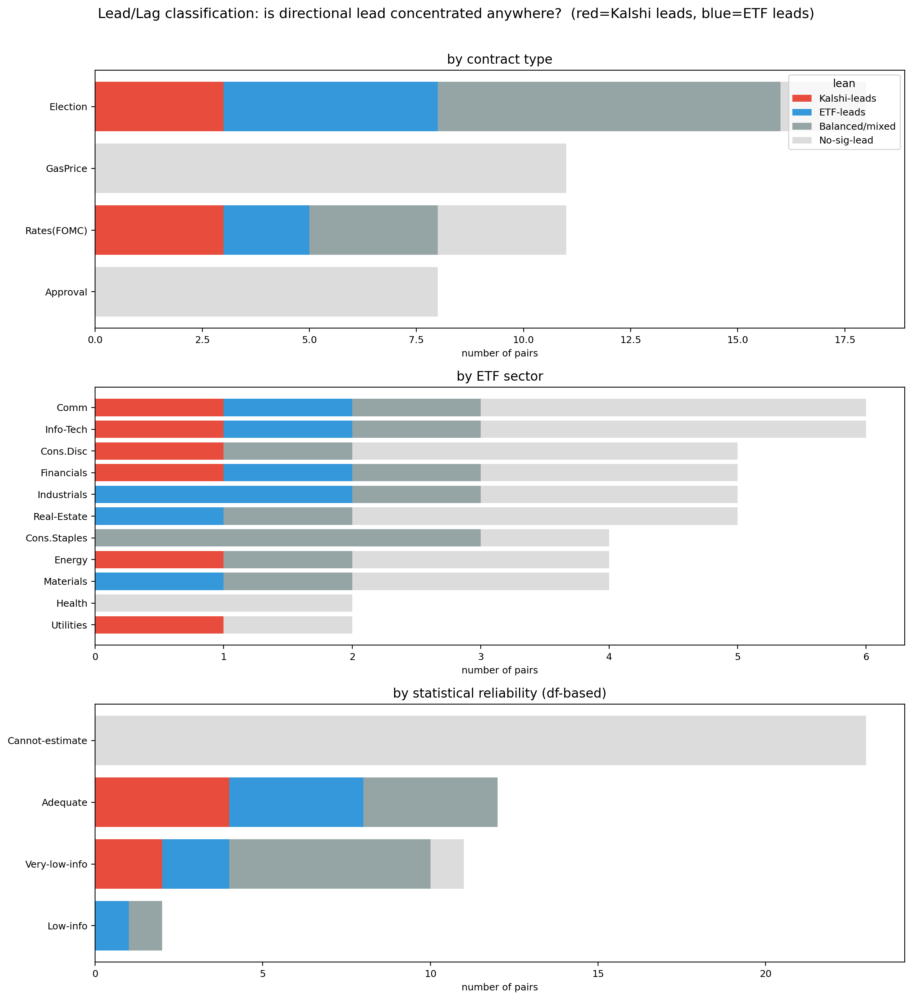

---

## Rank 1/48 — KXFEDDECISION-24DEC-C25 × VFH  (n_sig=9, best_p=2.7e-01, n_trades=2260)

```text
PAIR ANALYSIS    —    Rank 1 / 48
================================================================================================
KXFEDDECISION-24DEC-C25   x   VFH
Contract : "Will the Federal Reserve Cut rates by 25bps at their December 2024 meeting?"
Sector relevance : VFH_VNQ_VPU (Rate-sensitive: Financials / Real Estate / Utilities)
Window : 2024-10-31 to 2024-12-18     Kalshi trades : 2260     primary bar : 5min     daily-screen R^2 : 0.27

>>> RELIABILITY:  Adequate   <<<   (see section 5; unreliable pairs still get figures, but read their problems in section 8)

DEFINITIONS
   xₜ₋ₖ = Kalshi yes-probability change, k bars before t   (1 bar = 5min)
   yₜ   = ETF log return over bar t
   calendar = full market-hours grid: x=0 in bars with no Kalshi trade (not dropped).
   k>0 => Kalshi leads ETF ;  k<0 => ETF leads Kalshi ;  k=0 => contemporaneous

1. CALENDAR-TIME REGRESSION (clock-time lags, full RTH grid)
   Full model:  yₜ = α + Σ(k=-8..8) βₖ·xₜ₋ₖ + φ₁·yₜ₋₁ + Σ(d=1..32) γ_d·Day_d
      where  ADL ETF self-lags p=1 (BIC-chosen): φ₁·yₜ₋₁;  day-FE: 32 day dummies over 33 trading days (first day = baseline).
      controls counted (so you can see the total at a glance):  17 lead/lag x-terms + 1 ETF self-lag(s) + 32 day-FE dummies + 1 intercept = 51 RHS regressors  (model n_params=51).
   Significant terms (raw p<0.15) expanded:  yₜ = α + β₋₇·xₜ₊₇ + β₋₂·xₜ₊₂ + β₋₁·xₜ₊₁ + β₊₁·xₜ₋₁ + β₊₆·xₜ₋₆ + β₊₇·xₜ₋₇
   where:
      β₋₇ = +3.514e-05   (t/z=+2.30, p=2.2e-02, p_fdr=2.7e-01)    [ETF leads]
      β₋₂ = -2.330e-05   (t/z=-1.53, p=1.3e-01, p_fdr=3.5e-01)    [ETF leads]
      β₋₁ = -1.778e-05   (t/z=-1.58, p=1.1e-01, p_fdr=3.5e-01)    [ETF leads]
      β₊₁ = +2.472e-05   (t/z=+1.93, p=5.4e-02, p_fdr=2.7e-01)    [Kalshi leads]
      β₊₆ = -1.298e-05   (t/z=-1.86, p=6.3e-02, p_fdr=2.7e-01)    [Kalshi leads]
      β₊₇ = -1.992e-05   (t/z=-1.87, p=6.1e-02, p_fdr=2.7e-01)    [Kalshi leads]
   Lean by count of significant lags: balanced/no clear side  (k>0:3, k<0:3).

2. EVENT-TIME REGRESSION (event-count lags)
   Full model:  yₜ = α + Σ(k=-8..8) βₖ·xₜ₋ₖ + Σ(d=1..22) γ_d·Day_d
      where  ADL ETF self-lags p=0 (BIC chose none -> no ETF self-lag term);  day-FE: 22 day dummies over 23 trading days (first day = baseline).
      controls counted (so you can see the total at a glance):  17 lead/lag x-terms + 0 ETF self-lag(s) + 22 day-FE dummies + 1 intercept = 40 RHS regressors  (model n_params=40).
   Significant terms (raw p<0.15) expanded:  yₜ = α + β₊₁·xₜ₋₁ + β₊₅·xₜ₋₅ + β₊₈·xₜ₋₈
   where:
      β₊₁ = +1.366e-04   (t/z=+2.40, p=1.7e-02, p_fdr=2.8e-01)    [Kalshi leads]
      β₊₅ = -6.918e-05   (t/z=-1.55, p=1.2e-01, p_fdr=6.4e-01)    [Kalshi leads]
      β₊₈ = -6.115e-05   (t/z=-1.44, p=1.5e-01, p_fdr=6.4e-01)    [Kalshi leads]
   Lean by count of significant lags: Kalshi-leads  (k>0:3, k<0:0).

3. FULL COEFFICIENT TABLE  (calendar primary bar  vs  event)
      k |       calendar b (FDR) |          event b (FDR)
   ------------------------------------------------------
     -8 |          +9.23e-06     |          -4.60e-05    
     -7 |          +3.51e-05     |          +8.86e-05    
     -6 |          +8.93e-06     |          +8.79e-05    
     -5 |          +1.40e-05     |          +6.95e-05    
     -4 |          -7.29e-06     |          +2.92e-05    
     -3 |          +1.45e-05     |          -8.39e-05    
     -2 |          -2.33e-05     |          -9.29e-05    
     -1 |          -1.78e-05     |          -1.02e-04    
     +0 |          +9.44e-06     |          +7.26e-05    
     +1 |          +2.47e-05     |          +1.37e-04    
     +2 |          -3.08e-06     |          +6.27e-07    
     +3 |          +9.36e-08     |          +3.92e-05    
     +4 |          +3.79e-06     |          -2.86e-05    
     +5 |          +5.27e-06     |          -6.92e-05    
     +6 |          -1.30e-05     |          -3.46e-05    
     +7 |          -1.99e-05     |          +2.38e-05    
     +8 |          -1.35e-06     |          -6.12e-05    
   (stars = BH-FDR corrected:  *** p_fdr<.01  ** <.05  * <.10)

4. DIRECTIONAL TEST (probit, ETF up/down)
   Model: P(ETFₜ up) = Φ(α + βₖ·xₜ₋ₖ),  one probit per lag k
   calendar: β₋₁₀=+1.08e-01, β₊₀=+4.17e-02
   event: β₋₁₀=+6.88e-02, β₋₆=+8.12e-02, β₋₄=-7.18e-02, β₋₃=+9.38e-02, β₋₂=-8.53e-02, β₊₅=-1.21e-01***

5. DATA RELIABILITY (statistical, not a trade-count cutoff)
   Tier: Adequate
   (criterion = n_active: bars with an actual Kalshi move (x!=0) = the real sample that identifies the lead-lag. Full RTH grid makes n_obs large, so n_active is the honest size.)
   calendar(full RTH grid): n_active=362  n_obs=1879  n_days=33  K=8  params=51  df=1828  median_SE=1.19e-05  sig(FDR)=0
   event: n_active=195  n_obs=326  n_days=23  K=8  params=40  df=286  median_SE=7.86e-05  sig(FDR)=0

6. COARSE-FREQUENCY ROBUSTNESS (re-run calendar at 30min / 60min)
    30min: n_obs=288 df=240 K=8  sig=0 (Kalshi-leads 0 / ETF-leads 0) -> No-sig
    60min: n_obs=159 df=115 K=6  sig=0 (Kalshi-leads 0 / ETF-leads 0) -> No-sig

7. VERDICT
   Calendar leans balanced but Event leans Kalshi-leads -- NOT robust across time-axis; no clean lead.

8. FIGURE CAVEATS — figures are still drawn, but know their problems
   - Adequate info: figures and regression are mutually readable; note that flat Kalshi segments still mean 'no trade', not 'no change'.
   - Mixed coefficient signs across lags -- relationship not monotone.
   - Kalshi updates only on trades (flat line = no trade, NOT 'no change'); ETF mid refreshes continuously.

------------------------------------------------------------------------------------------------
Conventions: ET | 09:30-16:00 (forward windows capped to 16:00) | ETF in log return | median causal bars | full RTH grid | day-grouped lags (no overnight) | ADL self-control | significance = BH-FDR corrected.
Figures for this pair follow on the next page.
```

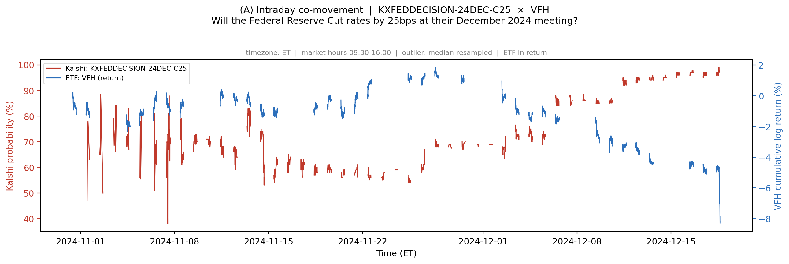
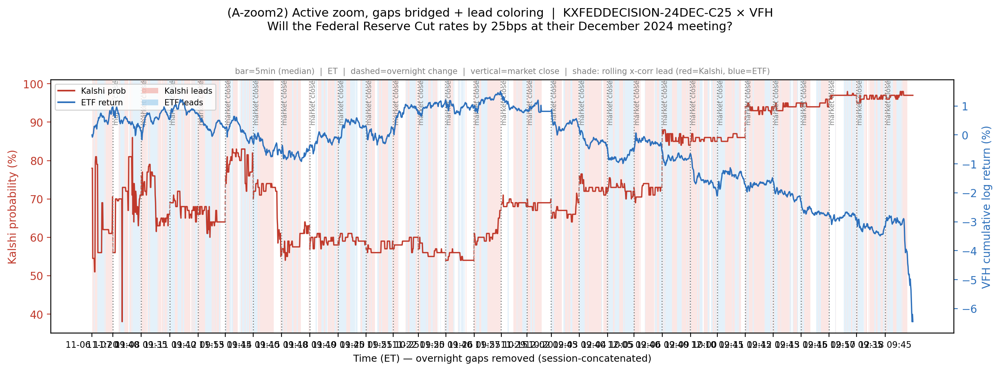
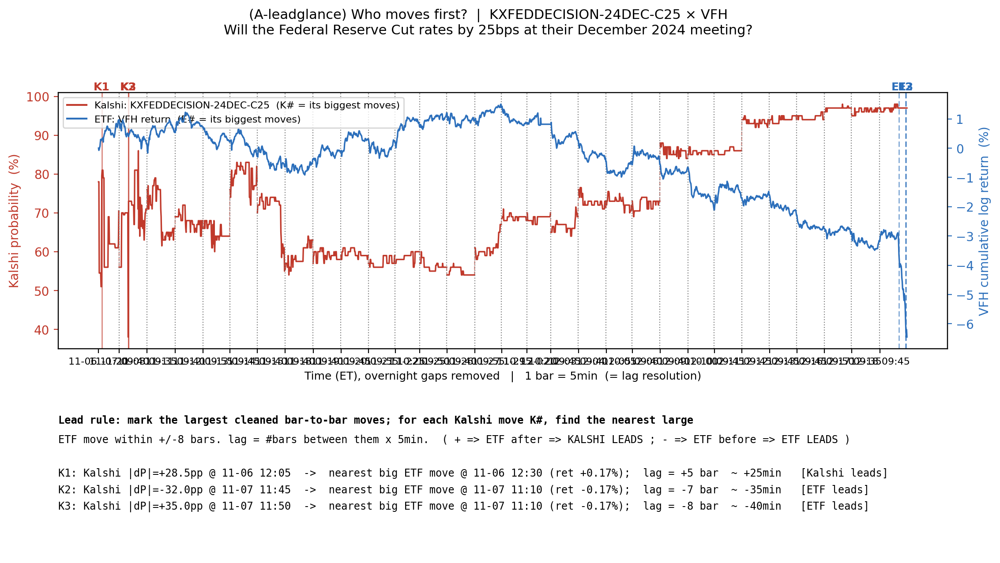
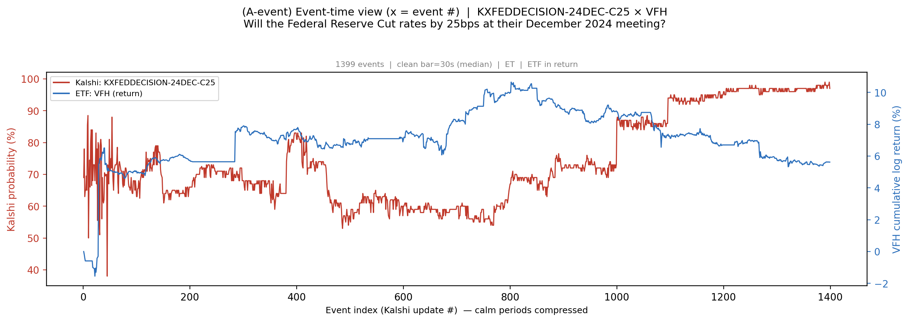
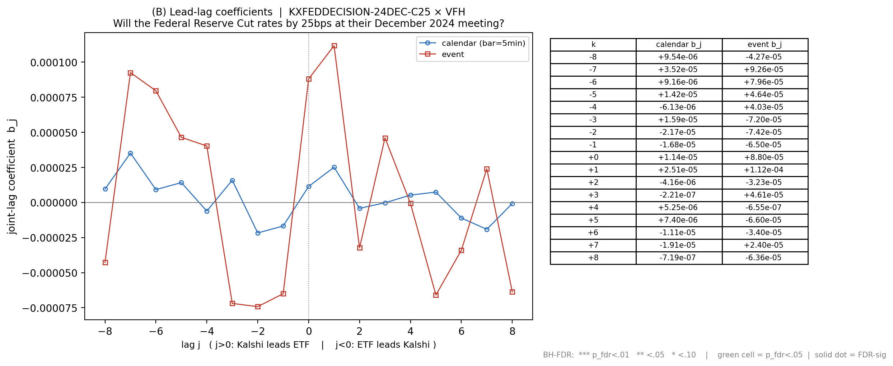

---

## Rank 2/48 — KXFEDDECISION-24DEC-C25 × VIS  (n_sig=6, best_p=1.3e-01, n_trades=2260)

```text
PAIR ANALYSIS    —    Rank 2 / 48
================================================================================================
KXFEDDECISION-24DEC-C25   x   VIS
Contract : "Will the Federal Reserve Cut rates by 25bps at their December 2024 meeting?"
Sector relevance : VFH_VNQ_VPU (Rate-sensitive: Financials / Real Estate / Utilities)
Window : 2024-10-31 to 2024-12-18     Kalshi trades : 2260     primary bar : 5min     daily-screen R^2 : 0.15

>>> RELIABILITY:  Adequate   <<<   (see section 5; unreliable pairs still get figures, but read their problems in section 8)

DEFINITIONS
   xₜ₋ₖ = Kalshi yes-probability change, k bars before t   (1 bar = 5min)
   yₜ   = ETF log return over bar t
   calendar = full market-hours grid: x=0 in bars with no Kalshi trade (not dropped).
   k>0 => Kalshi leads ETF ;  k<0 => ETF leads Kalshi ;  k=0 => contemporaneous

1. CALENDAR-TIME REGRESSION (clock-time lags, full RTH grid)
   Full model:  yₜ = α + Σ(k=-8..8) βₖ·xₜ₋ₖ + φ₁·yₜ₋₁ + Σ(d=1..32) γ_d·Day_d
      where  ADL ETF self-lags p=1 (BIC-chosen): φ₁·yₜ₋₁;  day-FE: 32 day dummies over 33 trading days (first day = baseline).
      controls counted (so you can see the total at a glance):  17 lead/lag x-terms + 1 ETF self-lag(s) + 32 day-FE dummies + 1 intercept = 51 RHS regressors  (model n_params=51).
   Significant terms (raw p<0.15) expanded:  yₜ = α + β₋₇·xₜ₊₇ + β₋₃·xₜ₊₃ + β₋₁·xₜ₊₁ + β₊₁·xₜ₋₁ + β₊₂·xₜ₋₂
   where:
      β₋₇ = +2.207e-05   (t/z=+1.63, p=1.0e-01, p_fdr=3.5e-01)    [ETF leads]
      β₋₃ = +1.797e-05   (t/z=+1.83, p=6.7e-02, p_fdr=3.5e-01)    [ETF leads]
      β₋₁ = -2.409e-05   (t/z=-2.43, p=1.5e-02, p_fdr=1.3e-01)    [ETF leads]
      β₊₁ = +1.333e-05   (t/z=+2.53, p=1.2e-02, p_fdr=1.3e-01)    [Kalshi leads]
      β₊₂ = +1.490e-05   (t/z=+1.68, p=9.3e-02, p_fdr=3.5e-01)    [Kalshi leads]
   Lean by count of significant lags: ETF-leads  (k>0:2, k<0:3).

2. EVENT-TIME REGRESSION (event-count lags)
   Full model:  yₜ = α + Σ(k=-8..8) βₖ·xₜ₋ₖ + Σ(d=1..22) γ_d·Day_d
      where  ADL ETF self-lags p=0 (BIC chose none -> no ETF self-lag term);  day-FE: 22 day dummies over 23 trading days (first day = baseline).
      controls counted (so you can see the total at a glance):  17 lead/lag x-terms + 0 ETF self-lag(s) + 22 day-FE dummies + 1 intercept = 40 RHS regressors  (model n_params=40).
   Significant terms (raw p<0.15) expanded:  yₜ = α + β₊₇·xₜ₋₇
   where:
      β₊₇ = +4.455e-05   (t/z=+1.49, p=1.4e-01, p_fdr=7.3e-01)    [Kalshi leads]
   Lean by count of significant lags: Kalshi-leads  (k>0:1, k<0:0).

3. FULL COEFFICIENT TABLE  (calendar primary bar  vs  event)
      k |       calendar b (FDR) |          event b (FDR)
   ------------------------------------------------------
     -8 |          -8.18e-06     |          -6.13e-05    
     -7 |          +2.21e-05     |          +1.64e-05    
     -6 |          +2.25e-06     |          +8.20e-05    
     -5 |          +1.40e-05     |          -2.91e-05    
     -4 |          +7.63e-06     |          -4.89e-05    
     -3 |          +1.80e-05     |          -1.20e-04    
     -2 |          -1.74e-06     |          -5.42e-05    
     -1 |          -2.41e-05     |          -4.99e-05    
     +0 |          +2.69e-06     |          +5.74e-05    
     +1 |          +1.33e-05     |          +5.70e-05    
     +2 |          +1.49e-05     |          +9.85e-06    
     +3 |          -1.63e-06     |          -1.41e-06    
     +4 |          +1.14e-06     |          -6.38e-05    
     +5 |          -6.16e-06     |          -4.68e-05    
     +6 |          -2.55e-07     |          -1.36e-05    
     +7 |          -5.19e-06     |          +4.45e-05    
     +8 |          +7.75e-06     |          -2.71e-05    
   (stars = BH-FDR corrected:  *** p_fdr<.01  ** <.05  * <.10)

4. DIRECTIONAL TEST (probit, ETF up/down)
   Model: P(ETFₜ up) = Φ(α + βₖ·xₜ₋ₖ),  one probit per lag k
   calendar: β₊₆=+5.90e-02
   event: β₋₉=+4.36e-02, β₊₂=-6.57e-02, β₊₇=+6.54e-02, β₊₁₀=+6.84e-02

5. DATA RELIABILITY (statistical, not a trade-count cutoff)
   Tier: Adequate
   (criterion = n_active: bars with an actual Kalshi move (x!=0) = the real sample that identifies the lead-lag. Full RTH grid makes n_obs large, so n_active is the honest size.)
   calendar(full RTH grid): n_active=362  n_obs=1879  n_days=33  K=8  params=51  df=1828  median_SE=9.30e-06  sig(FDR)=0
   event: n_active=195  n_obs=326  n_days=23  K=8  params=40  df=286  median_SE=6.69e-05  sig(FDR)=0

6. COARSE-FREQUENCY ROBUSTNESS (re-run calendar at 30min / 60min)
    30min: n_obs=288 df=240 K=8  sig=0 (Kalshi-leads 0 / ETF-leads 0) -> No-sig
    60min: n_obs=159 df=115 K=6  sig=1 (Kalshi-leads 1 / ETF-leads 0) -> Kalshi-leads

7. VERDICT
   Calendar leans ETF-leads but Event leans Kalshi-leads -- NOT robust across time-axis; no clean lead.

8. FIGURE CAVEATS — figures are still drawn, but know their problems
   - Adequate info: figures and regression are mutually readable; note that flat Kalshi segments still mean 'no trade', not 'no change'.
   - Mixed coefficient signs across lags -- relationship not monotone.
   - Kalshi updates only on trades (flat line = no trade, NOT 'no change'); ETF mid refreshes continuously.

------------------------------------------------------------------------------------------------
Conventions: ET | 09:30-16:00 (forward windows capped to 16:00) | ETF in log return | median causal bars | full RTH grid | day-grouped lags (no overnight) | ADL self-control | significance = BH-FDR corrected.
Figures for this pair follow on the next page.
```

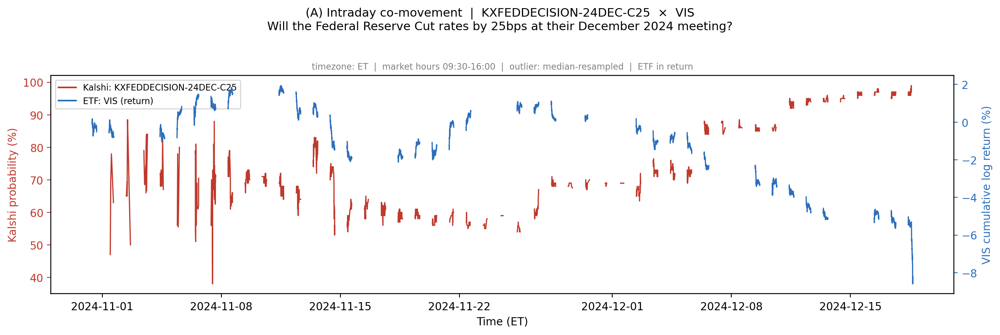
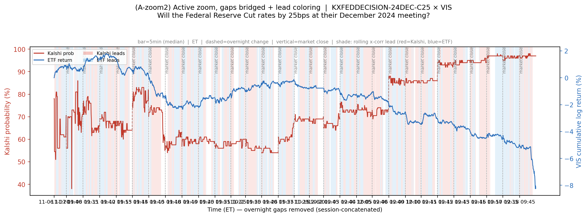
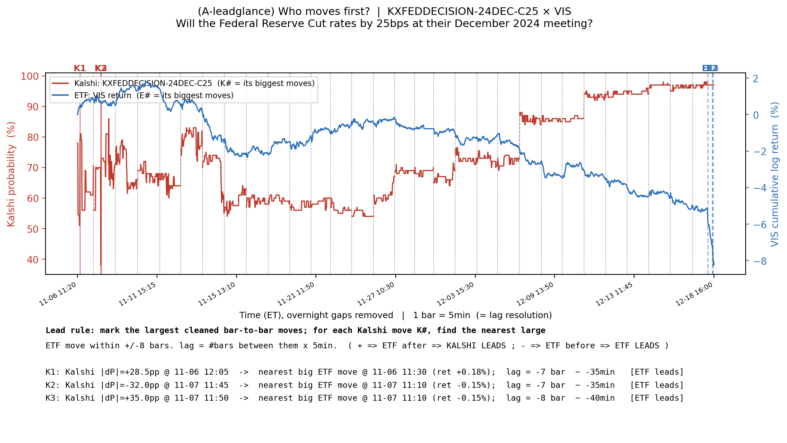
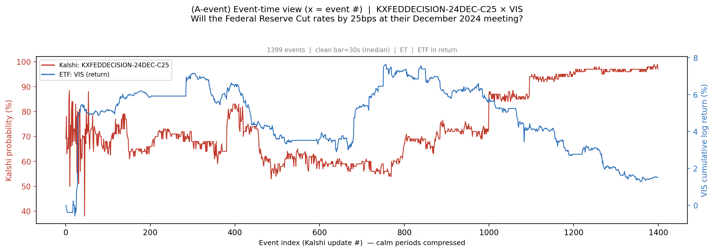
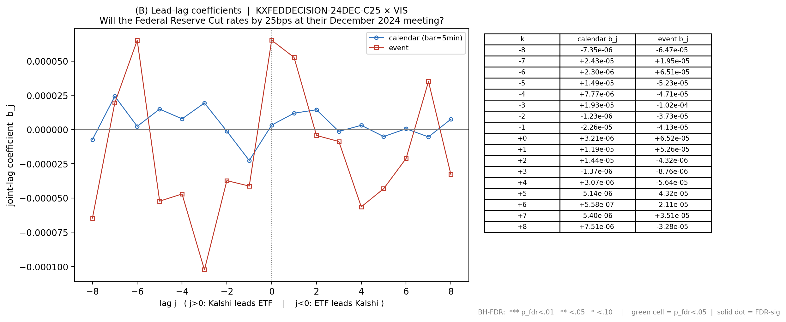

---

## Rank 3/48 — KXFEDDECISION-24DEC-H0 × VGT  (n_sig=8, best_p=2.4e-02, n_trades=1326)

```text
PAIR ANALYSIS    —    Rank 3 / 48
================================================================================================
KXFEDDECISION-24DEC-H0   x   VGT
Contract : "Will the Federal Reserve Hike rates by 0bps at their December 2024 meeting?"
Sector relevance : VFH_VNQ_VPU (Rate-sensitive: Financials / Real Estate / Utilities)
Window : 2024-10-31 to 2024-12-18     Kalshi trades : 1326     primary bar : 10min     daily-screen R^2 : 0.12

>>> RELIABILITY:  Adequate   <<<   (see section 5; unreliable pairs still get figures, but read their problems in section 8)

DEFINITIONS
   xₜ₋ₖ = Kalshi yes-probability change, k bars before t   (1 bar = 10min)
   yₜ   = ETF log return over bar t
   calendar = full market-hours grid: x=0 in bars with no Kalshi trade (not dropped).
   k>0 => Kalshi leads ETF ;  k<0 => ETF leads Kalshi ;  k=0 => contemporaneous

1. CALENDAR-TIME REGRESSION (clock-time lags, full RTH grid)
   Full model:  yₜ = α + Σ(k=-8..8) βₖ·xₜ₋ₖ + Σ(d=1..30) γ_d·Day_d
      where  ADL ETF self-lags p=0 (BIC chose none -> no ETF self-lag term);  day-FE: 30 day dummies over 31 trading days (first day = baseline).
      controls counted (so you can see the total at a glance):  17 lead/lag x-terms + 0 ETF self-lag(s) + 30 day-FE dummies + 1 intercept = 48 RHS regressors  (model n_params=48).
   Significant terms (raw p<0.15) expanded:  yₜ = α + β₊₅·xₜ₋₅
   where:
      β₊₅ = +3.663e-05   (t/z=+2.01, p=4.4e-02, p_fdr=7.5e-01)    [Kalshi leads]
   Lean by count of significant lags: Kalshi-leads  (k>0:1, k<0:0).

2. EVENT-TIME REGRESSION (event-count lags)
   Full model:  yₜ = α + Σ(k=-8..8) βₖ·xₜ₋ₖ + φ₁·yₜ₋₁ + φ₂·yₜ₋₂ + φ₃·yₜ₋₃ + Σ(d=1..8) γ_d·Day_d
      where  ADL ETF self-lags p=3 (BIC-chosen): φ₁·yₜ₋₁ + φ₂·yₜ₋₂ + φ₃·yₜ₋₃;  day-FE: 8 day dummies over 9 trading days (first day = baseline).
      controls counted (so you can see the total at a glance):  17 lead/lag x-terms + 3 ETF self-lag(s) + 8 day-FE dummies + 1 intercept = 29 RHS regressors  (model n_params=29).
   Significant terms (raw p<0.15) expanded:  yₜ = α + β₋₈·xₜ₊₈ + β₋₇·xₜ₊₇ + β₋₆·xₜ₊₆ + β₋₄·xₜ₊₄ + β₋₃·xₜ₊₃ + β₋₂·xₜ₊₂ + β₊₈·xₜ₋₈
   where:
      β₋₈ = -1.152e-03   (t/z=-2.72, p=6.5e-03, p_fdr=3.7e-02) **   [ETF leads]
      β₋₇ = -1.199e-03   (t/z=-3.03, p=2.4e-03, p_fdr=2.4e-02) **   [ETF leads]
      β₋₆ = -2.168e-03   (t/z=-2.99, p=2.8e-03, p_fdr=2.4e-02) **   [ETF leads]
      β₋₄ = -1.633e-03   (t/z=-2.54, p=1.1e-02, p_fdr=4.7e-02) **   [ETF leads]
      β₋₃ = -1.175e-03   (t/z=-1.66, p=9.7e-02, p_fdr=2.7e-01)    [ETF leads]
      β₋₂ = -8.088e-04   (t/z=-1.49, p=1.4e-01, p_fdr=3.2e-01)    [ETF leads]
      β₊₈ = -7.510e-04   (t/z=-1.76, p=7.9e-02, p_fdr=2.7e-01)    [Kalshi leads]
   Lean by count of significant lags: ETF-leads  (k>0:1, k<0:6).

3. FULL COEFFICIENT TABLE  (calendar primary bar  vs  event)
      k |       calendar b (FDR) |          event b (FDR)
   ------------------------------------------------------
     -8 |          +2.08e-05     |          -1.15e-03 ** 
     -7 |          +1.21e-05     |          -1.20e-03 ** 
     -6 |          +3.07e-05     |          -2.17e-03 ** 
     -5 |          +2.79e-05     |          -1.09e-03    
     -4 |          +6.13e-06     |          -1.63e-03 ** 
     -3 |          -1.12e-05     |          -1.17e-03    
     -2 |          +1.62e-06     |          -8.09e-04    
     -1 |          -1.28e-05     |          -1.14e-03    
     +0 |          +2.48e-05     |          -3.71e-04    
     +1 |          +2.48e-05     |          -9.15e-04    
     +2 |          +3.06e-05     |          -2.06e-04    
     +3 |          -3.38e-05     |          -5.61e-04    
     +4 |          +2.63e-05     |          -8.59e-05    
     +5 |          +3.66e-05     |          -7.00e-04    
     +6 |          -3.86e-06     |          -2.81e-04    
     +7 |          +1.16e-05     |          -2.42e-04    
     +8 |          +3.04e-05     |          -7.51e-04    
   (stars = BH-FDR corrected:  *** p_fdr<.01  ** <.05  * <.10)

4. DIRECTIONAL TEST (probit, ETF up/down)
   Model: P(ETFₜ up) = Φ(α + βₖ·xₜ₋ₖ),  one probit per lag k
   calendar: β₋₆=+1.49e-01, β₊₀=-9.52e-02, β₊₄=+6.68e-02, β₊₆=+1.13e-01
   event: β₊₆=+1.06e-01

5. DATA RELIABILITY (statistical, not a trade-count cutoff)
   Tier: Adequate
   (criterion = n_active: bars with an actual Kalshi move (x!=0) = the real sample that identifies the lead-lag. Full RTH grid makes n_obs large, so n_active is the honest size.)
   calendar(full RTH grid): n_active=126  n_obs=586  n_days=31  K=8  params=48  df=538  median_SE=3.19e-05  sig(FDR)=0
   event: n_active=26  n_obs=45  n_days=9  K=8  params=29  df=16  median_SE=6.42e-04  sig(FDR)=4

6. COARSE-FREQUENCY ROBUSTNESS (re-run calendar at 30min / 60min)
    30min: n_obs=210 df=164 K=8  sig=0 (Kalshi-leads 0 / ETF-leads 0) -> No-sig
    60min: n_obs=131 df=88 K=6  sig=1 (Kalshi-leads 1 / ETF-leads 0) -> Kalshi-leads

7. VERDICT
   Calendar leans Kalshi-leads but Event leans ETF-leads -- NOT robust across time-axis; no clean lead.

8. FIGURE CAVEATS — figures are still drawn, but know their problems
   - Adequate info: figures and regression are mutually readable; note that flat Kalshi segments still mean 'no trade', not 'no change'.
   - Mixed coefficient signs across lags -- relationship not monotone.
   - Kalshi updates only on trades (flat line = no trade, NOT 'no change'); ETF mid refreshes continuously.

------------------------------------------------------------------------------------------------
Conventions: ET | 09:30-16:00 (forward windows capped to 16:00) | ETF in log return | median causal bars | full RTH grid | day-grouped lags (no overnight) | ADL self-control | significance = BH-FDR corrected.
Figures for this pair follow on the next page.
```

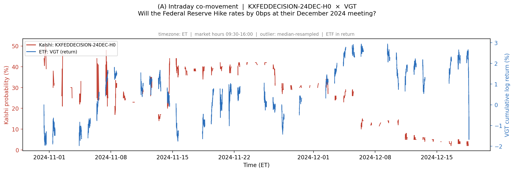
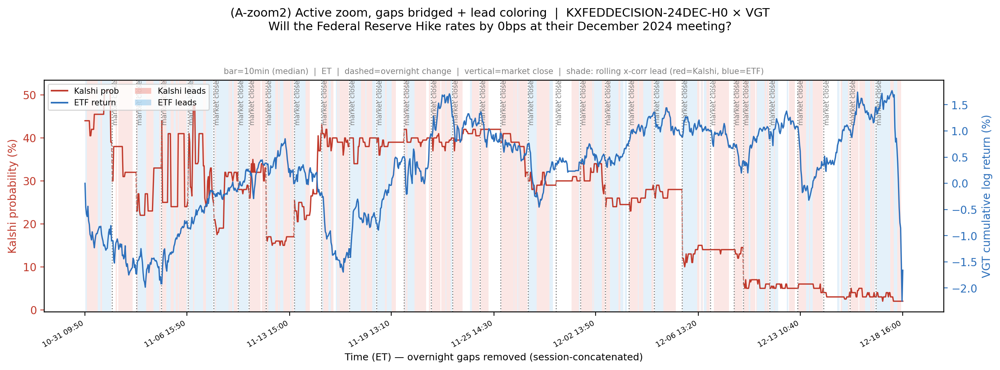
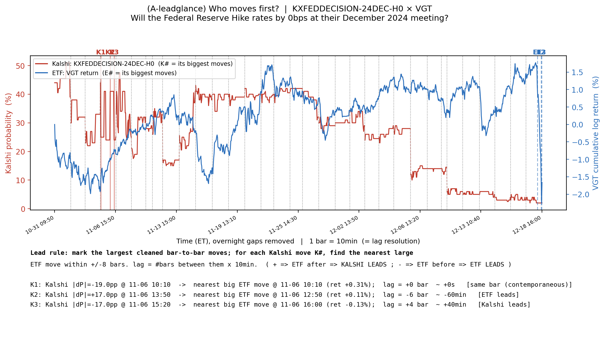
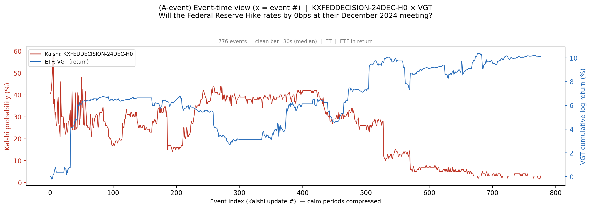
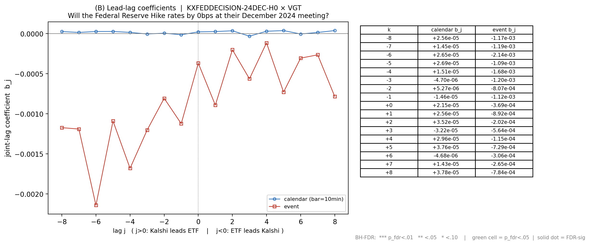

---

## Rank 4/48 — FEDDECISION-24SEP-C25 × VPU  (n_sig=7, best_p=3.4e-01, n_trades=1110)

```text
PAIR ANALYSIS    —    Rank 4 / 48
================================================================================================
FEDDECISION-24SEP-C25   x   VPU
Contract : "Will the Federal Reserve Cut rates by 25bps at their September 2024 meeting?"
Sector relevance : VFH_VNQ_VPU (Rate-sensitive: Financials / Real Estate / Utilities)
Window : 2024-09-04 to 2024-09-18     Kalshi trades : 1110     primary bar : 2min     daily-screen R^2 : 0.42

>>> RELIABILITY:  Adequate   <<<   (see section 5; unreliable pairs still get figures, but read their problems in section 8)

DEFINITIONS
   xₜ₋ₖ = Kalshi yes-probability change, k bars before t   (1 bar = 2min)
   yₜ   = ETF log return over bar t
   calendar = full market-hours grid: x=0 in bars with no Kalshi trade (not dropped).
   k>0 => Kalshi leads ETF ;  k<0 => ETF leads Kalshi ;  k=0 => contemporaneous

1. CALENDAR-TIME REGRESSION (clock-time lags, full RTH grid)
   Full model:  yₜ = α + Σ(k=-8..8) βₖ·xₜ₋ₖ + φ₁·yₜ₋₁ + φ₂·yₜ₋₂ + φ₃·yₜ₋₃ + φ₄·yₜ₋₄ + φ₅·yₜ₋₅ + φ₆·yₜ₋₆ + Σ(d=1..10) γ_d·Day_d
      where  ADL ETF self-lags p=6 (BIC-chosen): φ₁·yₜ₋₁ + φ₂·yₜ₋₂ + φ₃·yₜ₋₃ + φ₄·yₜ₋₄ + φ₅·yₜ₋₅ + φ₆·yₜ₋₆;  day-FE: 10 day dummies over 11 trading days (first day = baseline).
      controls counted (so you can see the total at a glance):  17 lead/lag x-terms + 6 ETF self-lag(s) + 10 day-FE dummies + 1 intercept = 34 RHS regressors  (model n_params=34).
   Significant terms (raw p<0.15) expanded:  yₜ = α + β₋₄·xₜ₊₄ + β₊₃·xₜ₋₃ + β₊₄·xₜ₋₄ + β₊₆·xₜ₋₆ + β₊₇·xₜ₋₇
   where:
      β₋₄ = +1.819e-05   (t/z=+1.46, p=1.5e-01, p_fdr=4.9e-01)    [ETF leads]
      β₊₃ = +3.805e-05   (t/z=+1.88, p=6.1e-02, p_fdr=4.9e-01)    [Kalshi leads]
      β₊₄ = -2.455e-05   (t/z=-1.52, p=1.3e-01, p_fdr=4.9e-01)    [Kalshi leads]
      β₊₆ = +1.633e-05   (t/z=+2.33, p=2.0e-02, p_fdr=3.4e-01)    [Kalshi leads]
      β₊₇ = +8.991e-06   (t/z=+1.71, p=8.7e-02, p_fdr=4.9e-01)    [Kalshi leads]
   Lean by count of significant lags: Kalshi-leads  (k>0:4, k<0:1).

2. EVENT-TIME REGRESSION (event-count lags)
   Full model:  yₜ = α + Σ(k=-8..8) βₖ·xₜ₋ₖ + φ₁·yₜ₋₁ + φ₂·yₜ₋₂ + Σ(d=1..7) γ_d·Day_d
      where  ADL ETF self-lags p=2 (BIC-chosen): φ₁·yₜ₋₁ + φ₂·yₜ₋₂;  day-FE: 7 day dummies over 8 trading days (first day = baseline).
      controls counted (so you can see the total at a glance):  17 lead/lag x-terms + 2 ETF self-lag(s) + 7 day-FE dummies + 1 intercept = 27 RHS regressors  (model n_params=27).
   Significant terms (raw p<0.15) expanded:  yₜ = α + β₋₃·xₜ₊₃ + β₋₂·xₜ₊₂
   where:
      β₋₃ = +1.400e-04   (t/z=+1.99, p=4.7e-02, p_fdr=5.7e-01)    [ETF leads]
      β₋₂ = +1.145e-04   (t/z=+1.83, p=6.7e-02, p_fdr=5.7e-01)    [ETF leads]
   Lean by count of significant lags: ETF-leads  (k>0:0, k<0:2).

3. FULL COEFFICIENT TABLE  (calendar primary bar  vs  event)
      k |       calendar b (FDR) |          event b (FDR)
   ------------------------------------------------------
     -8 |          +6.28e-06     |          +3.31e-05    
     -7 |          -2.03e-05     |          -2.62e-05    
     -6 |          -4.73e-06     |          +5.58e-05    
     -5 |          +1.20e-05     |          -1.04e-05    
     -4 |          +1.82e-05     |          +5.15e-05    
     -3 |          +1.52e-05     |          +1.40e-04    
     -2 |          -7.65e-07     |          +1.15e-04    
     -1 |          -1.72e-05     |          -7.57e-06    
     +0 |          +8.43e-07     |          -5.86e-06    
     +1 |          -2.66e-06     |          -4.28e-05    
     +2 |          -4.72e-06     |          -1.44e-06    
     +3 |          +3.80e-05     |          -3.64e-06    
     +4 |          -2.45e-05     |          -6.97e-06    
     +5 |          -1.83e-05     |          -6.65e-06    
     +6 |          +1.63e-05     |          +2.81e-05    
     +7 |          +8.99e-06     |          -2.35e-05    
     +8 |          +2.67e-06     |          +2.22e-06    
   (stars = BH-FDR corrected:  *** p_fdr<.01  ** <.05  * <.10)

4. DIRECTIONAL TEST (probit, ETF up/down)
   Model: P(ETFₜ up) = Φ(α + βₖ·xₜ₋ₖ),  one probit per lag k
   calendar: β₋₈=-1.03e-01, β₋₅=+8.93e-02, β₋₃=+7.38e-02***, β₋₁=-1.31e-01, β₊₁=-6.94e-02, β₊₃=+8.75e-02, β₊₆=+1.31e-01
   event: β₋₈=-6.96e-02**, β₋₅=+7.51e-02, β₋₁=-1.63e-01, β₊₁=-8.32e-02, β₊₅=-1.07e-01

5. DATA RELIABILITY (statistical, not a trade-count cutoff)
   Tier: Adequate
   (criterion = n_active: bars with an actual Kalshi move (x!=0) = the real sample that identifies the lead-lag. Full RTH grid makes n_obs large, so n_active is the honest size.)
   calendar(full RTH grid): n_active=270  n_obs=1829  n_days=11  K=8  params=34  df=1795  median_SE=1.25e-05  sig(FDR)=0
   event: n_active=205  n_obs=316  n_days=8  K=8  params=27  df=289  median_SE=3.66e-05  sig(FDR)=0

6. COARSE-FREQUENCY ROBUSTNESS (re-run calendar at 30min / 60min)
    30min: n_obs=90 df=66 K=6  sig=1 (Kalshi-leads 1 / ETF-leads 0) -> Kalshi-leads
    60min: n_obs=47 df=26 K=5  sig=0 (Kalshi-leads 0 / ETF-leads 0) -> No-sig

7. VERDICT
   Calendar leans Kalshi-leads but Event leans ETF-leads -- NOT robust across time-axis; no clean lead.

8. FIGURE CAVEATS — figures are still drawn, but know their problems
   - Adequate info: figures and regression are mutually readable; note that flat Kalshi segments still mean 'no trade', not 'no change'.
   - Mixed coefficient signs across lags -- relationship not monotone.
   - Kalshi updates only on trades (flat line = no trade, NOT 'no change'); ETF mid refreshes continuously.

9. REAL-WORLD CONTEXT (WebSearch-verified; see URLs)
   - Sept 2024 FOMC decided Wed Sep 18, 2024 (statement 2:00 PM ET, Powell press conf 2:30 PM ET).
   - Outcome: 50bps cut to 4.75-5.00% -- a surprise vs the 25bps many expected (first cut in 4+ years).
   - This contract asked specifically about a 25bps cut; the 50bps outcome resolved it NO.
   - Sources: federalreserve.gov/monetarypolicy/files/fomcminutes20240918.pdf ; jpmorgan.com/insights/outlook/economic-outlook/fed-meeting-september-2024

------------------------------------------------------------------------------------------------
Conventions: ET | 09:30-16:00 (forward windows capped to 16:00) | ETF in log return | median causal bars | full RTH grid | day-grouped lags (no overnight) | ADL self-control | significance = BH-FDR corrected.
Figures for this pair follow on the next page.
```

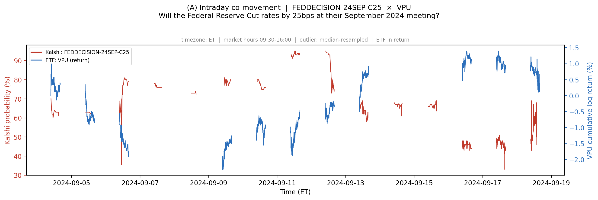
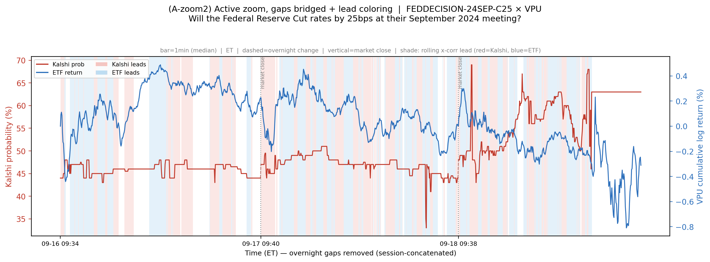
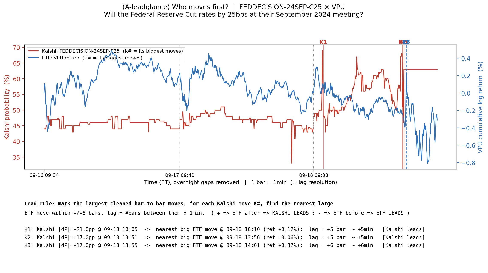
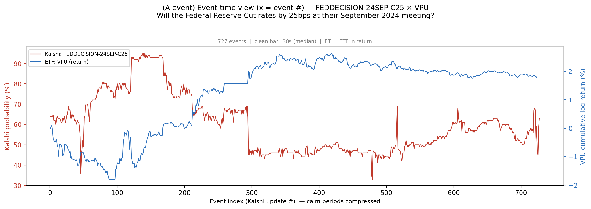
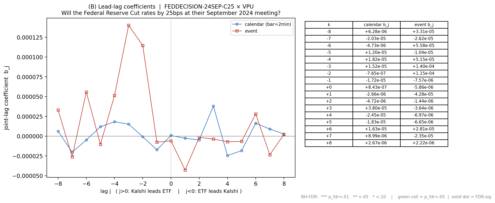

---

## Rank 5/48 — FEDDECISION-24SEP-C25 × VOX  (n_sig=6, best_p=3.7e-02, n_trades=1110)

```text
PAIR ANALYSIS    —    Rank 5 / 48
================================================================================================
FEDDECISION-24SEP-C25   x   VOX
Contract : "Will the Federal Reserve Cut rates by 25bps at their September 2024 meeting?"
Sector relevance : VFH_VNQ_VPU (Rate-sensitive: Financials / Real Estate / Utilities)
Window : 2024-09-04 to 2024-09-18     Kalshi trades : 1110     primary bar : 2min     daily-screen R^2 : 0.43

>>> RELIABILITY:  Adequate   <<<   (see section 5; unreliable pairs still get figures, but read their problems in section 8)

DEFINITIONS
   xₜ₋ₖ = Kalshi yes-probability change, k bars before t   (1 bar = 2min)
   yₜ   = ETF log return over bar t
   calendar = full market-hours grid: x=0 in bars with no Kalshi trade (not dropped).
   k>0 => Kalshi leads ETF ;  k<0 => ETF leads Kalshi ;  k=0 => contemporaneous

1. CALENDAR-TIME REGRESSION (clock-time lags, full RTH grid)
   Full model:  yₜ = α + Σ(k=-8..8) βₖ·xₜ₋ₖ + φ₁·yₜ₋₁ + Σ(d=1..10) γ_d·Day_d
      where  ADL ETF self-lags p=1 (BIC-chosen): φ₁·yₜ₋₁;  day-FE: 10 day dummies over 11 trading days (first day = baseline).
      controls counted (so you can see the total at a glance):  17 lead/lag x-terms + 1 ETF self-lag(s) + 10 day-FE dummies + 1 intercept = 29 RHS regressors  (model n_params=29).
   Significant terms (raw p<0.15) expanded:  yₜ = α + β₊₃·xₜ₋₃ + β₊₄·xₜ₋₄ + β₊₅·xₜ₋₅ + β₊₆·xₜ₋₆
   where:
      β₊₃ = +3.535e-05   (t/z=+1.98, p=4.8e-02, p_fdr=2.0e-01)    [Kalshi leads]
      β₊₄ = -3.707e-05   (t/z=-3.06, p=2.2e-03, p_fdr=3.7e-02) **   [Kalshi leads]
      β₊₅ = -6.318e-05   (t/z=-2.50, p=1.2e-02, p_fdr=1.0e-01)    [Kalshi leads]
      β₊₆ = +2.795e-05   (t/z=+2.04, p=4.2e-02, p_fdr=2.0e-01)    [Kalshi leads]
   Lean by count of significant lags: Kalshi-leads  (k>0:4, k<0:0).

2. EVENT-TIME REGRESSION (event-count lags)
   Full model:  yₜ = α + Σ(k=-8..8) βₖ·xₜ₋ₖ + Σ(d=1..7) γ_d·Day_d
      where  ADL ETF self-lags p=0 (BIC chose none -> no ETF self-lag term);  day-FE: 7 day dummies over 8 trading days (first day = baseline).
      controls counted (so you can see the total at a glance):  17 lead/lag x-terms + 0 ETF self-lag(s) + 7 day-FE dummies + 1 intercept = 25 RHS regressors  (model n_params=25).
   Significant terms (raw p<0.15) expanded:  yₜ = α + β₋₂·xₜ₊₂ + β₊₃·xₜ₋₃
   where:
      β₋₂ = +1.225e-04   (t/z=+1.78, p=7.5e-02, p_fdr=6.4e-01)    [ETF leads]
      β₊₃ = -2.912e-05   (t/z=-1.80, p=7.2e-02, p_fdr=6.4e-01)    [Kalshi leads]
   Lean by count of significant lags: balanced/no clear side  (k>0:1, k<0:1).

3. FULL COEFFICIENT TABLE  (calendar primary bar  vs  event)
      k |       calendar b (FDR) |          event b (FDR)
   ------------------------------------------------------
     -8 |          -9.98e-06     |          +2.43e-05    
     -7 |          -1.95e-05     |          +3.30e-06    
     -6 |          +5.18e-07     |          +1.92e-05    
     -5 |          +2.18e-05     |          -5.85e-06    
     -4 |          +3.61e-06     |          +5.50e-05    
     -3 |          +1.53e-05     |          +1.31e-04    
     -2 |          -6.64e-06     |          +1.23e-04    
     -1 |          -9.52e-06     |          -5.54e-05    
     +0 |          +2.00e-06     |          -3.34e-05    
     +1 |          +6.49e-06     |          +4.19e-05    
     +2 |          -1.33e-05     |          +7.04e-06    
     +3 |          +3.53e-05     |          -2.91e-05    
     +4 |          -3.71e-05 **  |          -1.14e-05    
     +5 |          -6.32e-05     |          +9.83e-06    
     +6 |          +2.80e-05     |          -1.77e-05    
     +7 |          +7.66e-06     |          -9.08e-06    
     +8 |          +4.81e-06     |          -1.94e-06    
   (stars = BH-FDR corrected:  *** p_fdr<.01  ** <.05  * <.10)

4. DIRECTIONAL TEST (probit, ETF up/down)
   Model: P(ETFₜ up) = Φ(α + βₖ·xₜ₋ₖ),  one probit per lag k
   calendar: β₋₃=-8.64e-02, β₊₂=-8.94e-02
   event: β₋₃=-8.07e-02, β₋₁=-6.56e-02, β₊₂=-9.91e-02, β₊₇=-1.37e-01

5. DATA RELIABILITY (statistical, not a trade-count cutoff)
   Tier: Adequate
   (criterion = n_active: bars with an actual Kalshi move (x!=0) = the real sample that identifies the lead-lag. Full RTH grid makes n_obs large, so n_active is the honest size.)
   calendar(full RTH grid): n_active=270  n_obs=1829  n_days=11  K=8  params=29  df=1800  median_SE=1.52e-05  sig(FDR)=1
   event: n_active=205  n_obs=316  n_days=8  K=8  params=25  df=291  median_SE=4.91e-05  sig(FDR)=0

6. COARSE-FREQUENCY ROBUSTNESS (re-run calendar at 30min / 60min)
    30min: n_obs=90 df=66 K=6  sig=0 (Kalshi-leads 0 / ETF-leads 0) -> No-sig
    60min: n_obs=47 df=26 K=5  sig=2 (Kalshi-leads 1 / ETF-leads 1) -> Balanced/mixed

7. VERDICT
   Calendar leans Kalshi-leads but Event leans balanced -- NOT robust across time-axis; no clean lead.

8. FIGURE CAVEATS — figures are still drawn, but know their problems
   - Adequate info: figures and regression are mutually readable; note that flat Kalshi segments still mean 'no trade', not 'no change'.
   - Mixed coefficient signs across lags -- relationship not monotone.
   - Kalshi updates only on trades (flat line = no trade, NOT 'no change'); ETF mid refreshes continuously.

9. REAL-WORLD CONTEXT (WebSearch-verified; see URLs)
   - Sept 2024 FOMC decided Wed Sep 18, 2024 (statement 2:00 PM ET, Powell press conf 2:30 PM ET).
   - Outcome: 50bps cut to 4.75-5.00% -- a surprise vs the 25bps many expected (first cut in 4+ years).
   - This contract asked specifically about a 25bps cut; the 50bps outcome resolved it NO.
   - Sources: federalreserve.gov/monetarypolicy/files/fomcminutes20240918.pdf ; jpmorgan.com/insights/outlook/economic-outlook/fed-meeting-september-2024

------------------------------------------------------------------------------------------------
Conventions: ET | 09:30-16:00 (forward windows capped to 16:00) | ETF in log return | median causal bars | full RTH grid | day-grouped lags (no overnight) | ADL self-control | significance = BH-FDR corrected.
Figures for this pair follow on the next page.
```

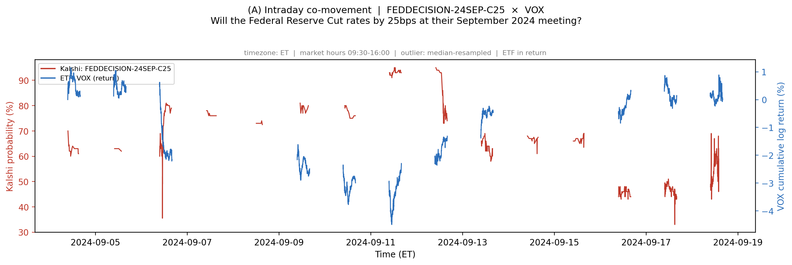
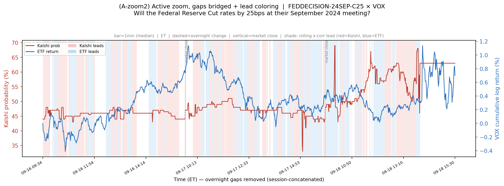
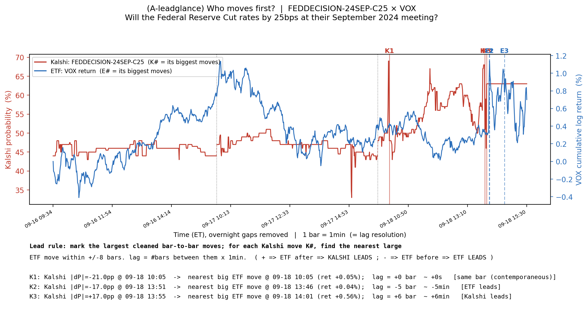
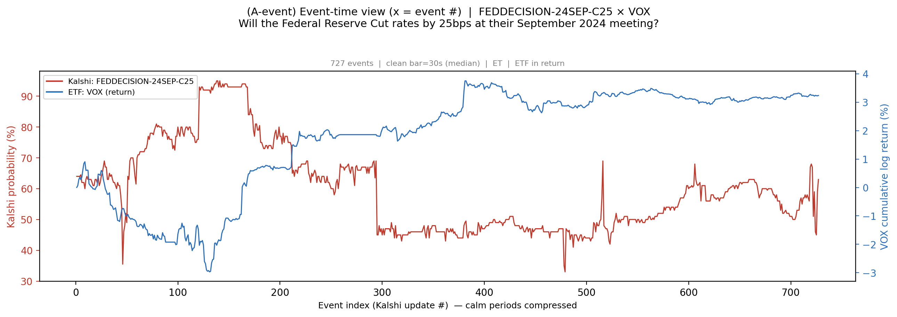
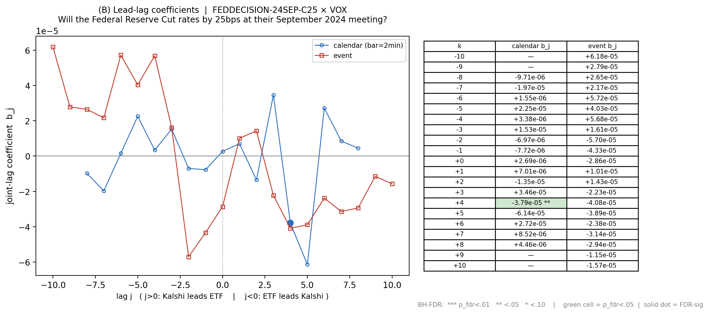

---

## Rank 6/48 — FEDDECISION-24SEP-C25 × VDC  (n_sig=4, best_p=5.1e-01, n_trades=1110)

```text
PAIR ANALYSIS    —    Rank 6 / 48
================================================================================================
FEDDECISION-24SEP-C25   x   VDC
Contract : "Will the Federal Reserve Cut rates by 25bps at their September 2024 meeting?"
Sector relevance : VFH_VNQ_VPU (Rate-sensitive: Financials / Real Estate / Utilities)
Window : 2024-09-04 to 2024-09-18     Kalshi trades : 1110     primary bar : 2min     daily-screen R^2 : 0.63

>>> RELIABILITY:  Adequate   <<<   (see section 5; unreliable pairs still get figures, but read their problems in section 8)

DEFINITIONS
   xₜ₋ₖ = Kalshi yes-probability change, k bars before t   (1 bar = 2min)
   yₜ   = ETF log return over bar t
   calendar = full market-hours grid: x=0 in bars with no Kalshi trade (not dropped).
   k>0 => Kalshi leads ETF ;  k<0 => ETF leads Kalshi ;  k=0 => contemporaneous

1. CALENDAR-TIME REGRESSION (clock-time lags, full RTH grid)
   Full model:  yₜ = α + Σ(k=-8..8) βₖ·xₜ₋ₖ + φ₁·yₜ₋₁ + Σ(d=1..10) γ_d·Day_d
      where  ADL ETF self-lags p=1 (BIC-chosen): φ₁·yₜ₋₁;  day-FE: 10 day dummies over 11 trading days (first day = baseline).
      controls counted (so you can see the total at a glance):  17 lead/lag x-terms + 1 ETF self-lag(s) + 10 day-FE dummies + 1 intercept = 29 RHS regressors  (model n_params=29).
   Significant terms (raw p<0.15) expanded:  yₜ = α + β₋₆·xₜ₊₆ + β₊₃·xₜ₋₃
   where:
      β₋₆ = -1.604e-05   (t/z=-2.07, p=3.8e-02, p_fdr=6.5e-01)    [ETF leads]
      β₊₃ = +2.156e-05   (t/z=+1.48, p=1.4e-01, p_fdr=6.9e-01)    [Kalshi leads]
   Lean by count of significant lags: balanced/no clear side  (k>0:1, k<0:1).

2. EVENT-TIME REGRESSION (event-count lags)
   Full model:  yₜ = α + Σ(k=-8..8) βₖ·xₜ₋ₖ + Σ(d=1..7) γ_d·Day_d
      where  ADL ETF self-lags p=0 (BIC chose none -> no ETF self-lag term);  day-FE: 7 day dummies over 8 trading days (first day = baseline).
      controls counted (so you can see the total at a glance):  17 lead/lag x-terms + 0 ETF self-lag(s) + 7 day-FE dummies + 1 intercept = 25 RHS regressors  (model n_params=25).
   Significant terms (raw p<0.15) expanded:  yₜ = α + β₋₂·xₜ₊₂ + β₊₃·xₜ₋₃
   where:
      β₋₂ = +1.165e-04   (t/z=+2.17, p=3.0e-02, p_fdr=5.1e-01)    [ETF leads]
      β₊₃ = -2.316e-05   (t/z=-1.63, p=1.0e-01, p_fdr=6.1e-01)    [Kalshi leads]
   Lean by count of significant lags: balanced/no clear side  (k>0:1, k<0:1).

3. FULL COEFFICIENT TABLE  (calendar primary bar  vs  event)
      k |       calendar b (FDR) |          event b (FDR)
   ------------------------------------------------------
     -8 |          -7.98e-06     |          +4.30e-05    
     -7 |          -8.12e-06     |          -9.92e-06    
     -6 |          -1.60e-05     |          +3.70e-05    
     -5 |          +1.08e-05     |          -1.89e-05    
     -4 |          +1.08e-06     |          +3.83e-05    
     -3 |          +1.35e-05     |          +9.00e-05    
     -2 |          -3.19e-06     |          +1.17e-04    
     -1 |          -7.06e-06     |          -4.80e-05    
     +0 |          -5.97e-06     |          -1.57e-05    
     +1 |          +7.68e-06     |          +1.51e-05    
     +2 |          -1.18e-05     |          -7.94e-06    
     +3 |          +2.16e-05     |          -2.32e-05    
     +4 |          -9.83e-06     |          +7.77e-06    
     +5 |          -1.49e-05     |          +3.60e-05    
     +6 |          +7.53e-06     |          +1.39e-05    
     +7 |          +1.34e-05     |          -2.59e-05    
     +8 |          -1.63e-06     |          +6.67e-06    
   (stars = BH-FDR corrected:  *** p_fdr<.01  ** <.05  * <.10)

4. DIRECTIONAL TEST (probit, ETF up/down)
   Model: P(ETFₜ up) = Φ(α + βₖ·xₜ₋ₖ),  one probit per lag k
   calendar: β₋₇=-4.60e-02, β₋₅=-6.79e-02, β₋₄=+8.68e-02, β₋₃=-5.79e-02, β₋₁=-5.41e-02, β₊₅=+2.24e-01**
   event: β₋₅=-9.29e-02***, β₋₄=+8.70e-02, β₋₁=-8.15e-02, β₊₂=-6.92e-02, β₊₅=+2.01e-01*, β₊₈=-9.82e-02

5. DATA RELIABILITY (statistical, not a trade-count cutoff)
   Tier: Adequate
   (criterion = n_active: bars with an actual Kalshi move (x!=0) = the real sample that identifies the lead-lag. Full RTH grid makes n_obs large, so n_active is the honest size.)
   calendar(full RTH grid): n_active=270  n_obs=1829  n_days=11  K=8  params=29  df=1800  median_SE=1.00e-05  sig(FDR)=0
   event: n_active=205  n_obs=316  n_days=8  K=8  params=25  df=291  median_SE=2.90e-05  sig(FDR)=0

6. COARSE-FREQUENCY ROBUSTNESS (re-run calendar at 30min / 60min)
    30min: n_obs=90 df=66 K=6  sig=0 (Kalshi-leads 0 / ETF-leads 0) -> No-sig
    60min: n_obs=47 df=26 K=5  sig=1 (Kalshi-leads 0 / ETF-leads 1) -> ETF-leads

7. VERDICT
   Both time-axes balanced -- no clean directional lead.

8. FIGURE CAVEATS — figures are still drawn, but know their problems
   - Adequate info: figures and regression are mutually readable; note that flat Kalshi segments still mean 'no trade', not 'no change'.
   - Mixed coefficient signs across lags -- relationship not monotone.
   - Kalshi updates only on trades (flat line = no trade, NOT 'no change'); ETF mid refreshes continuously.

9. REAL-WORLD CONTEXT (WebSearch-verified; see URLs)
   - Sept 2024 FOMC decided Wed Sep 18, 2024 (statement 2:00 PM ET, Powell press conf 2:30 PM ET).
   - Outcome: 50bps cut to 4.75-5.00% -- a surprise vs the 25bps many expected (first cut in 4+ years).
   - This contract asked specifically about a 25bps cut; the 50bps outcome resolved it NO.
   - Sources: federalreserve.gov/monetarypolicy/files/fomcminutes20240918.pdf ; jpmorgan.com/insights/outlook/economic-outlook/fed-meeting-september-2024

------------------------------------------------------------------------------------------------
Conventions: ET | 09:30-16:00 (forward windows capped to 16:00) | ETF in log return | median causal bars | full RTH grid | day-grouped lags (no overnight) | ADL self-control | significance = BH-FDR corrected.
Figures for this pair follow on the next page.
```

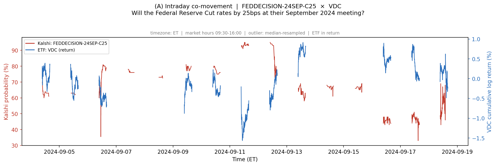
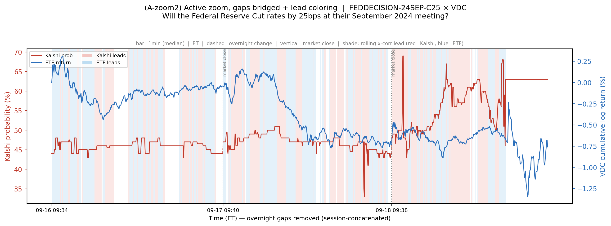
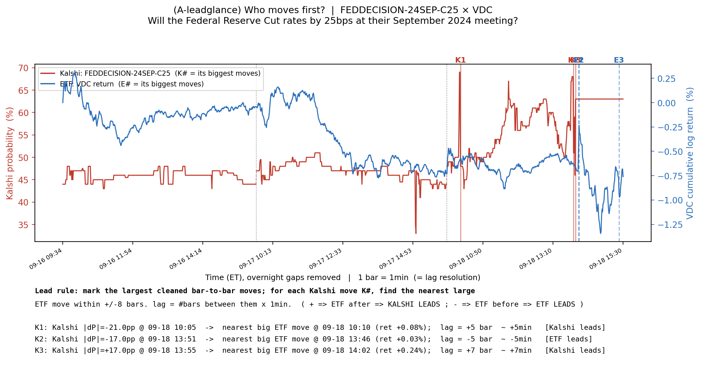
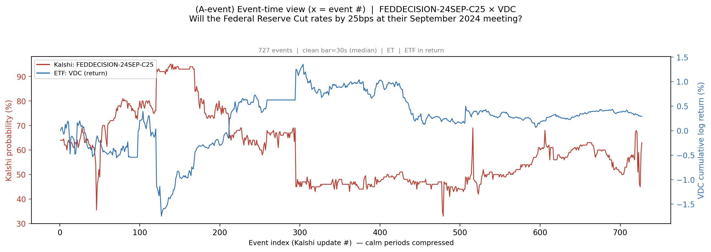
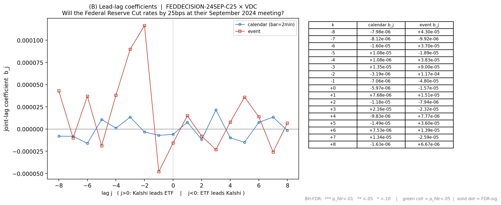

---

## Rank 7/48 — FEDDECISION-24NOV-H0 × VNQ  (n_sig=2, best_p=5.4e-01, n_trades=401)

```text
PAIR ANALYSIS    —    Rank 7 / 48
================================================================================================
FEDDECISION-24NOV-H0   x   VNQ
Contract : "Will the Federal Reserve Hike rates by 0bps at their November 2024 meeting?"
Sector relevance : VFH_VNQ_VPU (Rate-sensitive: Financials / Real Estate / Utilities)
Window : 2024-09-18 to 2024-11-07     Kalshi trades : 401     primary bar : 10min     daily-screen R^2 : 0.17

>>> RELIABILITY:  Adequate   <<<   (see section 5; unreliable pairs still get figures, but read their problems in section 8)

DEFINITIONS
   xₜ₋ₖ = Kalshi yes-probability change, k bars before t   (1 bar = 10min)
   yₜ   = ETF log return over bar t
   calendar = full market-hours grid: x=0 in bars with no Kalshi trade (not dropped).
   k>0 => Kalshi leads ETF ;  k<0 => ETF leads Kalshi ;  k=0 => contemporaneous

1. CALENDAR-TIME REGRESSION (clock-time lags, full RTH grid)
   Full model:  yₜ = α + Σ(k=-6..6) βₖ·xₜ₋ₖ + Σ(d=1..30) γ_d·Day_d
      where  ADL ETF self-lags p=0 (BIC chose none -> no ETF self-lag term);  day-FE: 30 day dummies over 31 trading days (first day = baseline).
      controls counted (so you can see the total at a glance):  13 lead/lag x-terms + 0 ETF self-lag(s) + 30 day-FE dummies + 1 intercept = 44 RHS regressors  (model n_params=44).
   Significant terms (raw p<0.15) expanded:  yₜ = α + β₋₁·xₜ₊₁ + β₊₄·xₜ₋₄
   where:
      β₋₁ = -8.394e-05   (t/z=-1.94, p=5.2e-02, p_fdr=5.4e-01)    [ETF leads]
      β₊₄ = +5.081e-05   (t/z=+1.73, p=8.3e-02, p_fdr=5.4e-01)    [Kalshi leads]
   Lean by count of significant lags: balanced/no clear side  (k>0:1, k<0:1).

2. EVENT-TIME REGRESSION (event-count lags)
   Full model:  yₜ = α + Σ(k) βₖ·xₜ₋ₖ + (ADL self-lags) + (day fixed effects)
   -> no regression result (insufficient data).

3. FULL COEFFICIENT TABLE  (calendar primary bar  vs  event)
      k |       calendar b (FDR) |          event b (FDR)
   ------------------------------------------------------
     -6 |          +3.85e-06     |                     --
     -5 |          +5.83e-07     |                     --
     -4 |          +1.41e-05     |                     --
     -3 |          +1.89e-05     |                     --
     -2 |          +2.37e-06     |                     --
     -1 |          -8.39e-05     |                     --
     +0 |          -3.15e-05     |                     --
     +1 |          +2.51e-06     |                     --
     +2 |          +3.00e-05     |                     --
     +3 |          +2.07e-05     |                     --
     +4 |          +5.08e-05     |                     --
     +5 |          +3.06e-05     |                     --
     +6 |          -2.48e-05     |                     --
   (stars = BH-FDR corrected:  *** p_fdr<.01  ** <.05  * <.10)

4. DIRECTIONAL TEST (probit, ETF up/down)
   Model: P(ETFₜ up) = Φ(α + βₖ·xₜ₋ₖ),  one probit per lag k
   calendar: β₋₄=+2.25e-01, β₊₆=-2.29e-01
   event: β₋₃=-1.27e-01

5. DATA RELIABILITY (statistical, not a trade-count cutoff)
   Tier: Adequate
   (criterion = n_active: bars with an actual Kalshi move (x!=0) = the real sample that identifies the lead-lag. Full RTH grid makes n_obs large, so n_active is the honest size.)
   calendar(full RTH grid): n_active=55  n_obs=488  n_days=31  K=6  params=44  df=444  median_SE=2.71e-05  sig(FDR)=0
   event: not estimable (insufficient data)

6. COARSE-FREQUENCY ROBUSTNESS (re-run calendar at 30min / 60min)
    30min: n_obs=99 df=57 K=6  sig=0 (Kalshi-leads 0 / ETF-leads 0) -> No-sig
    60min: n_obs=67 df=32 K=5  sig=0 (Kalshi-leads 0 / ETF-leads 0) -> No-sig

7. VERDICT
   Only one time-axis significant (balanced) -- weak / single-mode evidence.

8. FIGURE CAVEATS — figures are still drawn, but know their problems
   - Adequate info: figures and regression are mutually readable; note that flat Kalshi segments still mean 'no trade', not 'no change'.
   - Mixed coefficient signs across lags -- relationship not monotone.
   - Kalshi updates only on trades (flat line = no trade, NOT 'no change'); ETF mid refreshes continuously.

------------------------------------------------------------------------------------------------
Conventions: ET | 09:30-16:00 (forward windows capped to 16:00) | ETF in log return | median causal bars | full RTH grid | day-grouped lags (no overnight) | ADL self-control | significance = BH-FDR corrected.
Figures for this pair follow on the next page.
```

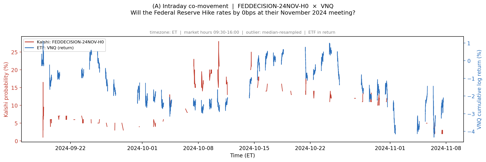
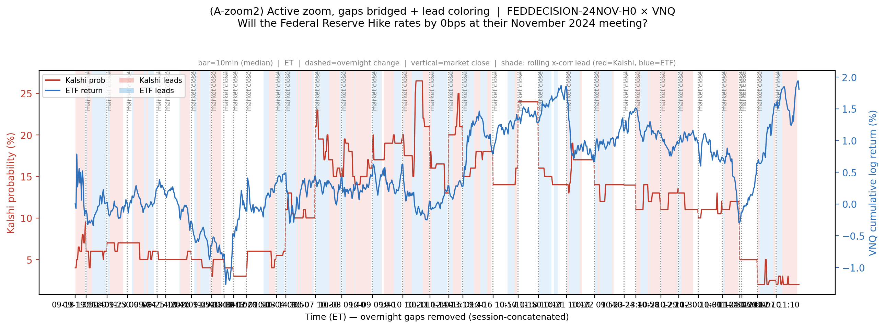
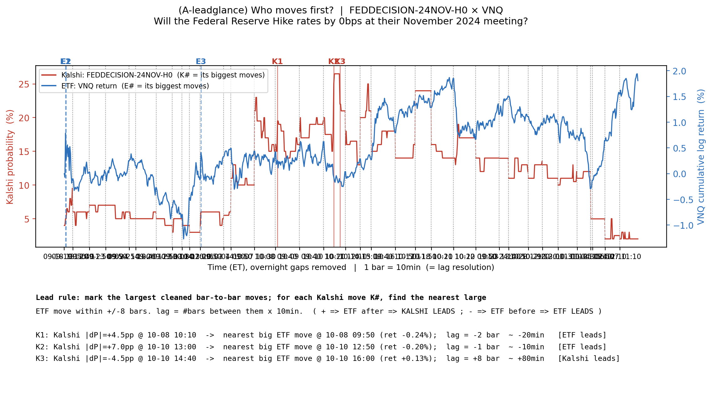
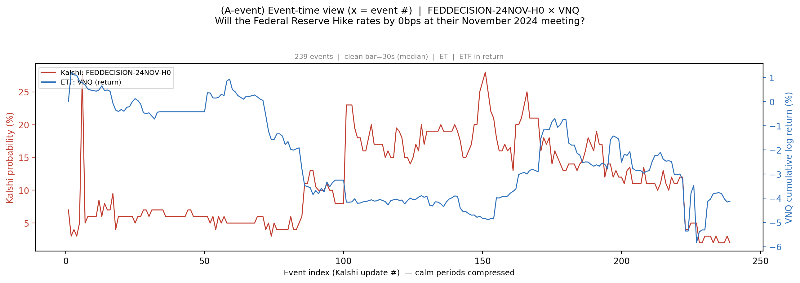
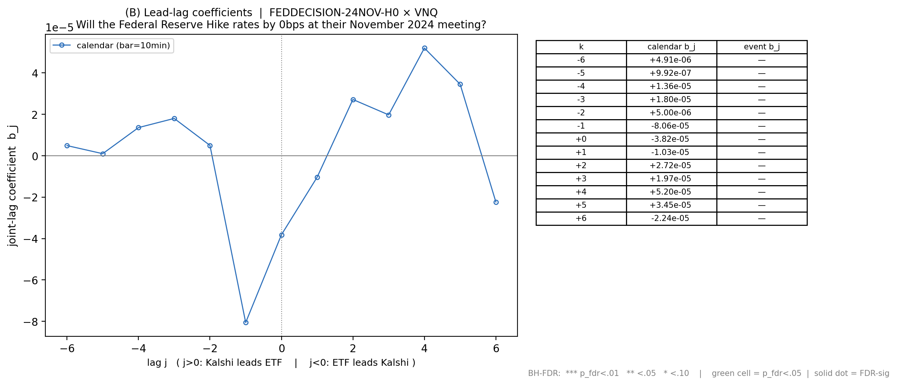

---

## Rank 8/48 — FEDDECISION-24NOV-H0 × VDE  (n_sig=2, best_p=6.6e-01, n_trades=401)

```text
PAIR ANALYSIS    —    Rank 8 / 48
================================================================================================
FEDDECISION-24NOV-H0   x   VDE
Contract : "Will the Federal Reserve Hike rates by 0bps at their November 2024 meeting?"
Sector relevance : VFH_VNQ_VPU (Rate-sensitive: Financials / Real Estate / Utilities)
Window : 2024-09-18 to 2024-11-07     Kalshi trades : 401     primary bar : 10min     daily-screen R^2 : 0.19

>>> RELIABILITY:  Adequate   <<<   (see section 5; unreliable pairs still get figures, but read their problems in section 8)

DEFINITIONS
   xₜ₋ₖ = Kalshi yes-probability change, k bars before t   (1 bar = 10min)
   yₜ   = ETF log return over bar t
   calendar = full market-hours grid: x=0 in bars with no Kalshi trade (not dropped).
   k>0 => Kalshi leads ETF ;  k<0 => ETF leads Kalshi ;  k=0 => contemporaneous

1. CALENDAR-TIME REGRESSION (clock-time lags, full RTH grid)
   Full model:  yₜ = α + Σ(k=-6..6) βₖ·xₜ₋ₖ + φ₁·yₜ₋₁ + Σ(d=1..30) γ_d·Day_d
      where  ADL ETF self-lags p=1 (BIC-chosen): φ₁·yₜ₋₁;  day-FE: 30 day dummies over 31 trading days (first day = baseline).
      controls counted (so you can see the total at a glance):  13 lead/lag x-terms + 1 ETF self-lag(s) + 30 day-FE dummies + 1 intercept = 45 RHS regressors  (model n_params=45).
   Significant terms (raw p<0.15) expanded:  yₜ = α + β₋₅·xₜ₊₅ + β₊₁·xₜ₋₁
   where:
      β₋₅ = +6.779e-05   (t/z=+1.93, p=5.4e-02, p_fdr=6.6e-01)    [ETF leads]
      β₊₁ = -7.736e-05   (t/z=-1.64, p=1.0e-01, p_fdr=6.6e-01)    [Kalshi leads]
   Lean by count of significant lags: balanced/no clear side  (k>0:1, k<0:1).

2. EVENT-TIME REGRESSION (event-count lags)
   Full model:  yₜ = α + Σ(k) βₖ·xₜ₋ₖ + (ADL self-lags) + (day fixed effects)
   -> no regression result (insufficient data).

3. FULL COEFFICIENT TABLE  (calendar primary bar  vs  event)
      k |       calendar b (FDR) |          event b (FDR)
   ------------------------------------------------------
     -6 |          +9.01e-05     |                     --
     -5 |          +6.78e-05     |                     --
     -4 |          +8.00e-06     |                     --
     -3 |          +3.79e-05     |                     --
     -2 |          -2.55e-05     |                     --
     -1 |          +1.07e-05     |                     --
     +0 |          +2.26e-05     |                     --
     +1 |          -7.74e-05     |                     --
     +2 |          +3.80e-05     |                     --
     +3 |          -1.59e-05     |                     --
     +4 |          +5.41e-05     |                     --
     +5 |          -3.60e-05     |                     --
     +6 |          -1.10e-05     |                     --
   (stars = BH-FDR corrected:  *** p_fdr<.01  ** <.05  * <.10)

4. DIRECTIONAL TEST (probit, ETF up/down)
   Model: P(ETFₜ up) = Φ(α + βₖ·xₜ₋ₖ),  one probit per lag k
   calendar: β₋₆=-2.08e-01*, β₋₁=-2.31e-01*, β₊₁=-1.46e-01
   event: β₋₆=-1.73e-01, β₊₆=+1.57e-01

5. DATA RELIABILITY (statistical, not a trade-count cutoff)
   Tier: Adequate
   (criterion = n_active: bars with an actual Kalshi move (x!=0) = the real sample that identifies the lead-lag. Full RTH grid makes n_obs large, so n_active is the honest size.)
   calendar(full RTH grid): n_active=55  n_obs=488  n_days=31  K=6  params=45  df=443  median_SE=4.73e-05  sig(FDR)=0
   event: not estimable (insufficient data)

6. COARSE-FREQUENCY ROBUSTNESS (re-run calendar at 30min / 60min)
    30min: n_obs=99 df=57 K=6  sig=0 (Kalshi-leads 0 / ETF-leads 0) -> No-sig
    60min: n_obs=67 df=32 K=5  sig=0 (Kalshi-leads 0 / ETF-leads 0) -> No-sig

7. VERDICT
   Only one time-axis significant (balanced) -- weak / single-mode evidence.

8. FIGURE CAVEATS — figures are still drawn, but know their problems
   - Adequate info: figures and regression are mutually readable; note that flat Kalshi segments still mean 'no trade', not 'no change'.
   - Mixed coefficient signs across lags -- relationship not monotone.
   - Kalshi updates only on trades (flat line = no trade, NOT 'no change'); ETF mid refreshes continuously.

------------------------------------------------------------------------------------------------
Conventions: ET | 09:30-16:00 (forward windows capped to 16:00) | ETF in log return | median causal bars | full RTH grid | day-grouped lags (no overnight) | ADL self-control | significance = BH-FDR corrected.
Figures for this pair follow on the next page.
```

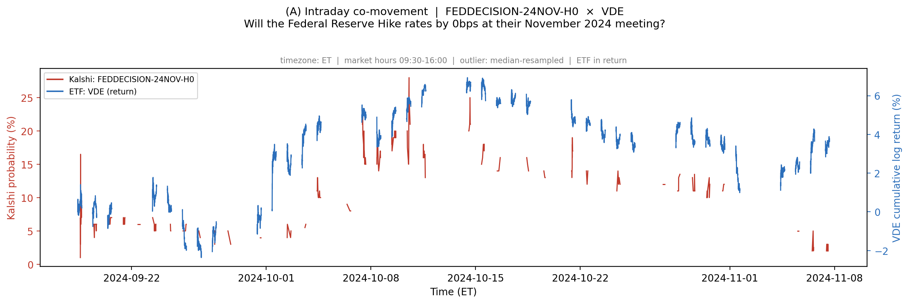
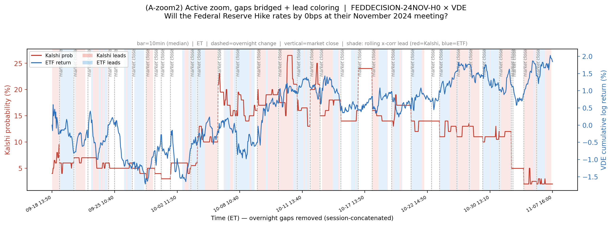
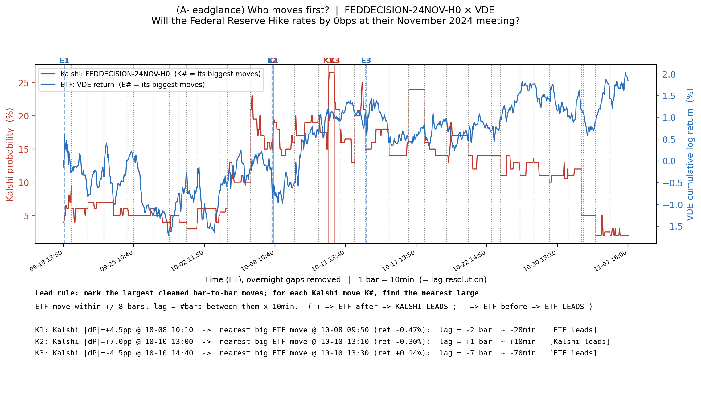
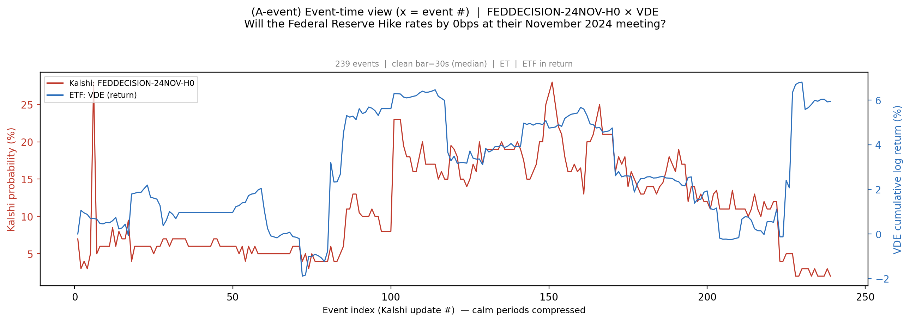
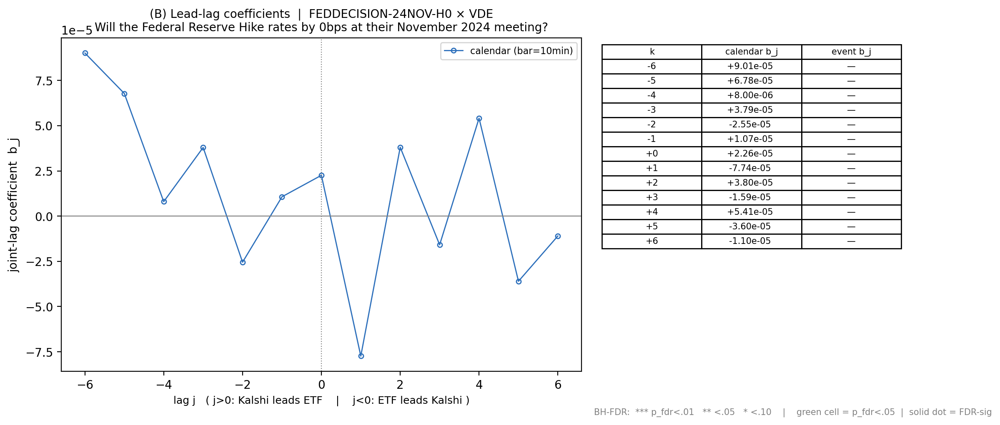

---

## Rank 9/48 — KXECDJT281 × VNQ  (n_sig=8, best_p=2.2e-11, n_trades=294)

```text
PAIR ANALYSIS    —    Rank 9 / 48
================================================================================================
KXECDJT281   x   VNQ
Contract : "Will Trump win 281-257 - AZ, GA, NC, PA?"
Sector relevance : Election outcome (all sectors)
Window : 2024-11-04 to 2024-11-25     Kalshi trades : 294     primary bar : 5min     daily-screen R^2 : 0.43

>>> RELIABILITY:  Adequate   <<<   (see section 5; unreliable pairs still get figures, but read their problems in section 8)

DEFINITIONS
   xₜ₋ₖ = Kalshi yes-probability change, k bars before t   (1 bar = 5min)
   yₜ   = ETF log return over bar t
   calendar = full market-hours grid: x=0 in bars with no Kalshi trade (not dropped).
   k>0 => Kalshi leads ETF ;  k<0 => ETF leads Kalshi ;  k=0 => contemporaneous

1. CALENDAR-TIME REGRESSION (clock-time lags, full RTH grid)
   Full model:  yₜ = α + Σ(k=-5..5) βₖ·xₜ₋ₖ + φ₁·yₜ₋₁ + φ₂·yₜ₋₂ + Σ(d=1..7) γ_d·Day_d
      where  ADL ETF self-lags p=2 (BIC-chosen): φ₁·yₜ₋₁ + φ₂·yₜ₋₂;  day-FE: 7 day dummies over 8 trading days (first day = baseline).
      controls counted (so you can see the total at a glance):  11 lead/lag x-terms + 2 ETF self-lag(s) + 7 day-FE dummies + 1 intercept = 21 RHS regressors  (model n_params=21).
   Significant terms (raw p<0.15) expanded:  yₜ = α + β₋₃·xₜ₊₃ + β₋₂·xₜ₊₂ + β₋₁·xₜ₊₁ + β₊₁·xₜ₋₁
   where:
      β₋₃ = -3.383e-05   (t/z=-2.81, p=5.0e-03, p_fdr=1.8e-02) **   [ETF leads]
      β₋₂ = +9.779e-05   (t/z=+7.03, p=2.0e-12, p_fdr=2.2e-11) ***   [ETF leads]
      β₋₁ = +1.274e-04   (t/z=+2.24, p=2.5e-02, p_fdr=7.0e-02) *   [ETF leads]
      β₊₁ = +8.129e-05   (t/z=+4.65, p=3.4e-06, p_fdr=1.8e-05) ***   [Kalshi leads]
   Lean by count of significant lags: ETF-leads  (k>0:1, k<0:3).

2. EVENT-TIME REGRESSION (event-count lags)
   Full model:  yₜ = α + Σ(k=-5..5) βₖ·xₜ₋ₖ + Σ(d=1..1) γ_d·Day_d
      where  ADL ETF self-lags p=0 (BIC chose none -> no ETF self-lag term);  day-FE: 1 day dummies over 2 trading days (first day = baseline).
      controls counted (so you can see the total at a glance):  11 lead/lag x-terms + 0 ETF self-lag(s) + 1 day-FE dummies + 1 intercept = 13 RHS regressors  (model n_params=13).
   Significant terms (raw p<0.15) expanded:  yₜ = α + β₋₄·xₜ₊₄ + β₋₃·xₜ₊₃ + β₊₂·xₜ₋₂ + β₊₄·xₜ₋₄
   where:
      β₋₄ = -1.091e-04   (t/z=-1.85, p=6.5e-02, p_fdr=2.1e-01)    [ETF leads]
      β₋₃ = -1.160e-04   (t/z=-3.15, p=1.6e-03, p_fdr=1.8e-02) **   [ETF leads]
      β₊₂ = +3.729e-04   (t/z=+1.77, p=7.7e-02, p_fdr=2.1e-01)    [Kalshi leads]
      β₊₄ = +7.545e-05   (t/z=+2.14, p=3.3e-02, p_fdr=1.8e-01)    [Kalshi leads]
   Lean by count of significant lags: balanced/no clear side  (k>0:2, k<0:2).

3. FULL COEFFICIENT TABLE  (calendar primary bar  vs  event)
      k |       calendar b (FDR) |          event b (FDR)
   ------------------------------------------------------
     -5 |          +1.35e-06     |          -7.73e-05    
     -4 |          -1.75e-05     |          -1.09e-04    
     -3 |          -3.38e-05 **  |          -1.16e-04 ** 
     -2 |          +9.78e-05 *** |          -2.13e-04    
     -1 |          +1.27e-04 *   |          +1.68e-04    
     +0 |          -1.88e-05     |          +3.70e-05    
     +1 |          +8.13e-05 *** |          +2.38e-04    
     +2 |          +1.86e-05     |          +3.73e-04    
     +3 |          +2.86e-05     |          +1.99e-04    
     +4 |          +8.12e-06     |          +7.55e-05    
     +5 |          +1.45e-05     |          +8.95e-05    
   (stars = BH-FDR corrected:  *** p_fdr<.01  ** <.05  * <.10)

4. DIRECTIONAL TEST (probit, ETF up/down)
   Model: P(ETFₜ up) = Φ(α + βₖ·xₜ₋ₖ),  one probit per lag k
   calendar: β₋₆=-2.19e-01, β₋₅=+1.71e-01, β₋₃=+7.80e-02, β₋₂=+1.76e-01, β₊₀=-3.76e-01, β₊₂=-1.89e-01, β₊₅=-1.59e-01
   event: β₋₃=+1.59e-01, β₋₁=+8.44e-02, β₊₀=-8.95e-02, β₊₆=-5.64e-02

5. DATA RELIABILITY (statistical, not a trade-count cutoff)
   Tier: Adequate
   (criterion = n_active: bars with an actual Kalshi move (x!=0) = the real sample that identifies the lead-lag. Full RTH grid makes n_obs large, so n_active is the honest size.)
   calendar(full RTH grid): n_active=51  n_obs=385  n_days=8  K=5  params=21  df=364  median_SE=2.28e-05  sig(FDR)=3
   event: n_active=35  n_obs=58  n_days=2  K=5  params=13  df=45  median_SE=1.62e-04  sig(FDR)=1

6. COARSE-FREQUENCY ROBUSTNESS (re-run calendar at 30min / 60min)
    30min: n_obs=31 df=15 K=5  sig=4 (Kalshi-leads 3 / ETF-leads 1) -> Kalshi-leads
    60min: n_obs=18 df=4 K=4  sig=1 (Kalshi-leads 0 / ETF-leads 1) -> ETF-leads

7. VERDICT
   Calendar leans ETF-leads but Event leans balanced -- NOT robust across time-axis; no clean lead.

8. FIGURE CAVEATS — figures are still drawn, but know their problems
   - Adequate info: figures and regression are mutually readable; note that flat Kalshi segments still mean 'no trade', not 'no change'.
   - Mixed coefficient signs across lags -- relationship not monotone.
   - Kalshi updates only on trades (flat line = no trade, NOT 'no change'); ETF mid refreshes continuously.

9. REAL-WORLD CONTEXT (WebSearch-verified; see URLs)
   - 2024 US presidential election held Tue Nov 5, 2024; ballots counted overnight Nov 5-6.
   - AP called the race for Trump ~5:34-5:37 AM ET on Wed Nov 6, 2024 (Wisconsin pushed him past 270) -- this is PRE-MARKET, so the regular-hours equity reaction shows up at the Nov 6 open.
   - Final electoral result: Trump 312, Harris 226.
   - Sources: en.wikipedia.org/wiki/2024_United_States_presidential_election ; spectrumlocalnews.com/us/snplus/news/2024/11/06/trump-wins-ap-projection-2024-election

------------------------------------------------------------------------------------------------
Conventions: ET | 09:30-16:00 (forward windows capped to 16:00) | ETF in log return | median causal bars | full RTH grid | day-grouped lags (no overnight) | ADL self-control | significance = BH-FDR corrected.
Figures for this pair follow on the next page.
```

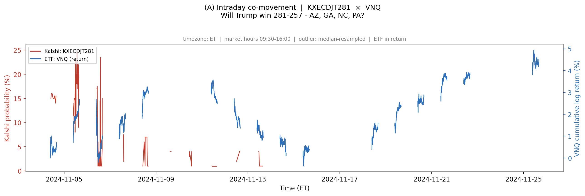
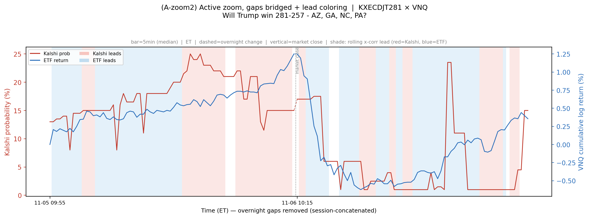
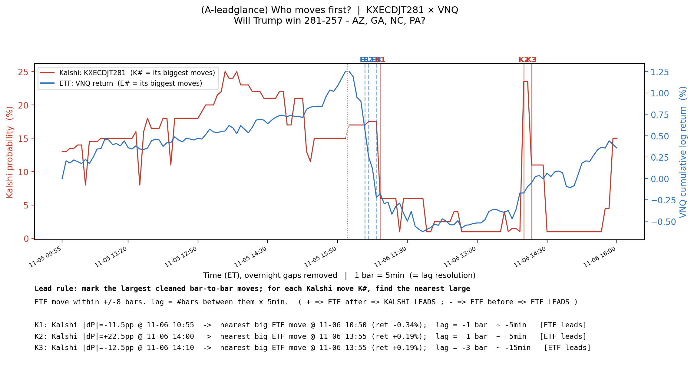
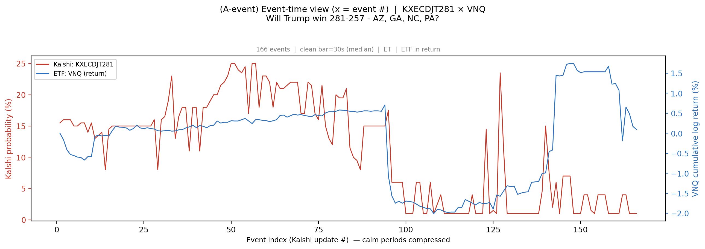
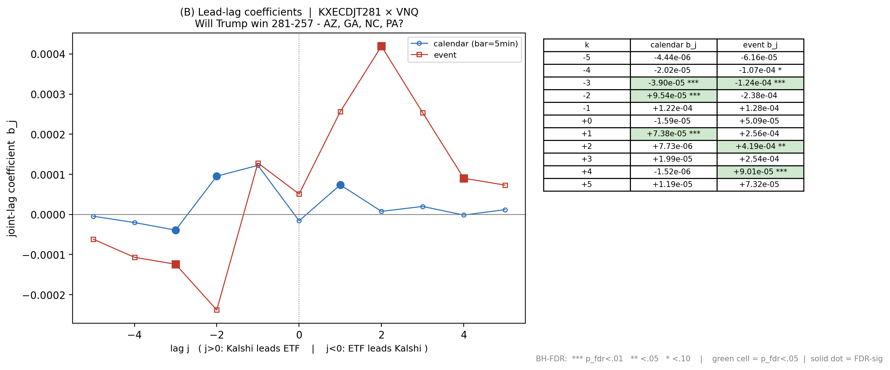

---

## Rank 10/48 — KXECDJT281 × VOX  (n_sig=5, best_p=2.6e-08, n_trades=294)

```text
PAIR ANALYSIS    —    Rank 10 / 48
================================================================================================
KXECDJT281   x   VOX
Contract : "Will Trump win 281-257 - AZ, GA, NC, PA?"
Sector relevance : Election outcome (all sectors)
Window : 2024-11-04 to 2024-11-25     Kalshi trades : 294     primary bar : 5min     daily-screen R^2 : 0.33

>>> RELIABILITY:  Adequate   <<<   (see section 5; unreliable pairs still get figures, but read their problems in section 8)

DEFINITIONS
   xₜ₋ₖ = Kalshi yes-probability change, k bars before t   (1 bar = 5min)
   yₜ   = ETF log return over bar t
   calendar = full market-hours grid: x=0 in bars with no Kalshi trade (not dropped).
   k>0 => Kalshi leads ETF ;  k<0 => ETF leads Kalshi ;  k=0 => contemporaneous

1. CALENDAR-TIME REGRESSION (clock-time lags, full RTH grid)
   Full model:  yₜ = α + Σ(k=-5..5) βₖ·xₜ₋ₖ + φ₁·yₜ₋₁ + Σ(d=1..7) γ_d·Day_d
      where  ADL ETF self-lags p=1 (BIC-chosen): φ₁·yₜ₋₁;  day-FE: 7 day dummies over 8 trading days (first day = baseline).
      controls counted (so you can see the total at a glance):  11 lead/lag x-terms + 1 ETF self-lag(s) + 7 day-FE dummies + 1 intercept = 20 RHS regressors  (model n_params=20).
   Significant terms (raw p<0.15) expanded:  yₜ = α + β₋₃·xₜ₊₃ + β₋₂·xₜ₊₂ + β₊₃·xₜ₋₃
   where:
      β₋₃ = +3.585e-05   (t/z=+3.20, p=1.4e-03, p_fdr=5.0e-03) ***   [ETF leads]
      β₋₂ = +5.988e-05   (t/z=+3.64, p=2.7e-04, p_fdr=1.5e-03) ***   [ETF leads]
      β₊₃ = +4.583e-05   (t/z=+5.97, p=2.3e-09, p_fdr=2.6e-08) ***   [Kalshi leads]
   Lean by count of significant lags: ETF-leads  (k>0:1, k<0:2).

2. EVENT-TIME REGRESSION (event-count lags)
   Full model:  yₜ = α + Σ(k=-5..5) βₖ·xₜ₋ₖ + Σ(d=1..1) γ_d·Day_d
      where  ADL ETF self-lags p=0 (BIC chose none -> no ETF self-lag term);  day-FE: 1 day dummies over 2 trading days (first day = baseline).
      controls counted (so you can see the total at a glance):  11 lead/lag x-terms + 0 ETF self-lag(s) + 1 day-FE dummies + 1 intercept = 13 RHS regressors  (model n_params=13).
   Significant terms (raw p<0.15) expanded:  yₜ = α + β₋₁·xₜ₊₁ + β₊₂·xₜ₋₂
   where:
      β₋₁ = +1.915e-04   (t/z=+1.88, p=6.0e-02, p_fdr=3.3e-01)    [ETF leads]
      β₊₂ = +2.744e-04   (t/z=+2.74, p=6.1e-03, p_fdr=6.7e-02) *   [Kalshi leads]
   Lean by count of significant lags: balanced/no clear side  (k>0:1, k<0:1).

3. FULL COEFFICIENT TABLE  (calendar primary bar  vs  event)
      k |       calendar b (FDR) |          event b (FDR)
   ------------------------------------------------------
     -5 |          +1.73e-05     |          -9.03e-07    
     -4 |          +1.06e-05     |          -3.04e-05    
     -3 |          +3.58e-05 *** |          -1.35e-05    
     -2 |          +5.99e-05 *** |          -1.95e-05    
     -1 |          +1.38e-05     |          +1.92e-04    
     +0 |          +2.79e-05     |          +1.64e-05    
     +1 |          -1.01e-06     |          +5.31e-05    
     +2 |          +2.86e-05     |          +2.74e-04 *  
     +3 |          +4.58e-05 *** |          +2.70e-05    
     +4 |          -1.40e-06     |          +7.22e-05    
     +5 |          -3.12e-05     |          +1.25e-04    
   (stars = BH-FDR corrected:  *** p_fdr<.01  ** <.05  * <.10)

4. DIRECTIONAL TEST (probit, ETF up/down)
   Model: P(ETFₜ up) = Φ(α + βₖ·xₜ₋ₖ),  one probit per lag k
   calendar: β₋₁=+2.82e-01***
   event: β₋₄=+1.30e-01, β₋₁=+1.20e-01**, β₊₀=+1.13e-01

5. DATA RELIABILITY (statistical, not a trade-count cutoff)
   Tier: Adequate
   (criterion = n_active: bars with an actual Kalshi move (x!=0) = the real sample that identifies the lead-lag. Full RTH grid makes n_obs large, so n_active is the honest size.)
   calendar(full RTH grid): n_active=51  n_obs=385  n_days=8  K=5  params=20  df=365  median_SE=1.64e-05  sig(FDR)=3
   event: n_active=35  n_obs=58  n_days=2  K=5  params=13  df=45  median_SE=1.02e-04  sig(FDR)=0

6. COARSE-FREQUENCY ROBUSTNESS (re-run calendar at 30min / 60min)
    30min: n_obs=31 df=15 K=5  sig=5 (Kalshi-leads 2 / ETF-leads 3) -> ETF-leads
    60min: n_obs=18 df=4 K=4  sig=2 (Kalshi-leads 2 / ETF-leads 0) -> Kalshi-leads

7. VERDICT
   Calendar leans ETF-leads but Event leans balanced -- NOT robust across time-axis; no clean lead.

8. FIGURE CAVEATS — figures are still drawn, but know their problems
   - Adequate info: figures and regression are mutually readable; note that flat Kalshi segments still mean 'no trade', not 'no change'.
   - Kalshi updates only on trades (flat line = no trade, NOT 'no change'); ETF mid refreshes continuously.

9. REAL-WORLD CONTEXT (WebSearch-verified; see URLs)
   - 2024 US presidential election held Tue Nov 5, 2024; ballots counted overnight Nov 5-6.
   - AP called the race for Trump ~5:34-5:37 AM ET on Wed Nov 6, 2024 (Wisconsin pushed him past 270) -- this is PRE-MARKET, so the regular-hours equity reaction shows up at the Nov 6 open.
   - Final electoral result: Trump 312, Harris 226.
   - Sources: en.wikipedia.org/wiki/2024_United_States_presidential_election ; spectrumlocalnews.com/us/snplus/news/2024/11/06/trump-wins-ap-projection-2024-election

------------------------------------------------------------------------------------------------
Conventions: ET | 09:30-16:00 (forward windows capped to 16:00) | ETF in log return | median causal bars | full RTH grid | day-grouped lags (no overnight) | ADL self-control | significance = BH-FDR corrected.
Figures for this pair follow on the next page.
```

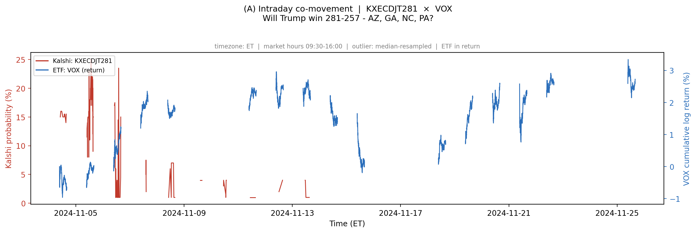
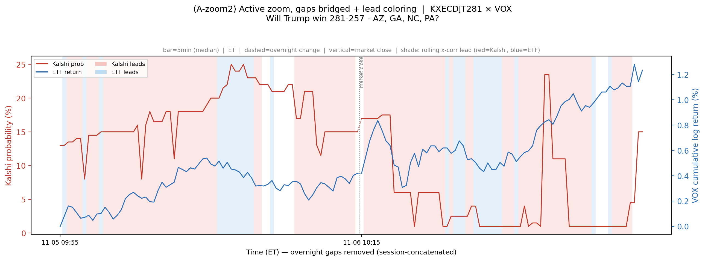
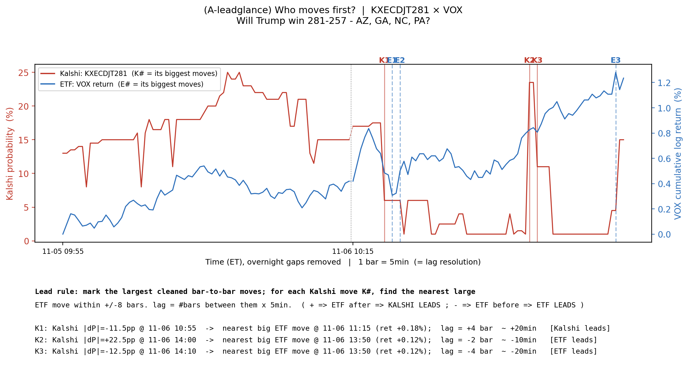
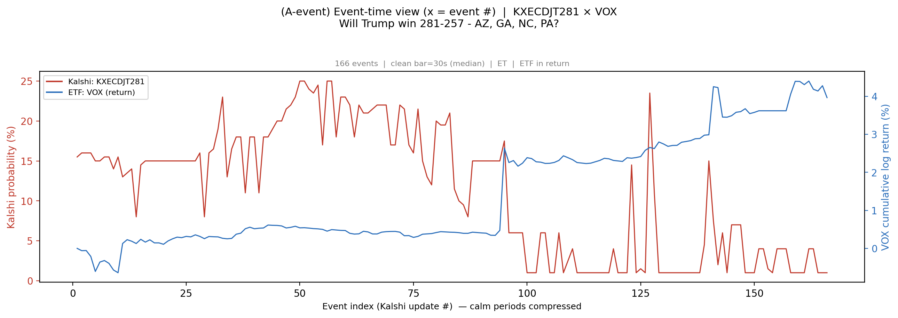
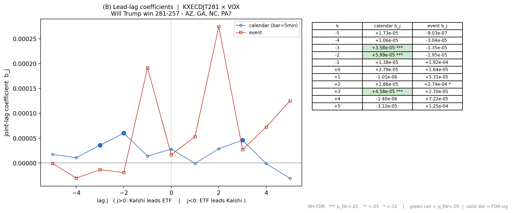

---

## Rank 11/48 — KXECDJT281 × VGT  (n_sig=5, best_p=2.9e-04, n_trades=294)

```text
PAIR ANALYSIS    —    Rank 11 / 48
================================================================================================
KXECDJT281   x   VGT
Contract : "Will Trump win 281-257 - AZ, GA, NC, PA?"
Sector relevance : Election outcome (all sectors)
Window : 2024-11-04 to 2024-11-25     Kalshi trades : 294     primary bar : 5min     daily-screen R^2 : 0.32

>>> RELIABILITY:  Adequate   <<<   (see section 5; unreliable pairs still get figures, but read their problems in section 8)

DEFINITIONS
   xₜ₋ₖ = Kalshi yes-probability change, k bars before t   (1 bar = 5min)
   yₜ   = ETF log return over bar t
   calendar = full market-hours grid: x=0 in bars with no Kalshi trade (not dropped).
   k>0 => Kalshi leads ETF ;  k<0 => ETF leads Kalshi ;  k=0 => contemporaneous

1. CALENDAR-TIME REGRESSION (clock-time lags, full RTH grid)
   Full model:  yₜ = α + Σ(k=-5..5) βₖ·xₜ₋ₖ + φ₁·yₜ₋₁ + Σ(d=1..7) γ_d·Day_d
      where  ADL ETF self-lags p=1 (BIC-chosen): φ₁·yₜ₋₁;  day-FE: 7 day dummies over 8 trading days (first day = baseline).
      controls counted (so you can see the total at a glance):  11 lead/lag x-terms + 1 ETF self-lag(s) + 7 day-FE dummies + 1 intercept = 20 RHS regressors  (model n_params=20).
   Significant terms (raw p<0.15) expanded:  yₜ = α + β₋₁·xₜ₊₁ + β₊₃·xₜ₋₃
   where:
      β₋₁ = -3.137e-05   (t/z=-3.09, p=2.0e-03, p_fdr=2.2e-02) **   [ETF leads]
      β₊₃ = -1.916e-05   (t/z=-2.55, p=1.1e-02, p_fdr=5.8e-02) *   [Kalshi leads]
   Lean by count of significant lags: balanced/no clear side  (k>0:1, k<0:1).

2. EVENT-TIME REGRESSION (event-count lags)
   Full model:  yₜ = α + Σ(k=-5..5) βₖ·xₜ₋ₖ + Σ(d=1..1) γ_d·Day_d
      where  ADL ETF self-lags p=0 (BIC chose none -> no ETF self-lag term);  day-FE: 1 day dummies over 2 trading days (first day = baseline).
      controls counted (so you can see the total at a glance):  11 lead/lag x-terms + 0 ETF self-lag(s) + 1 day-FE dummies + 1 intercept = 13 RHS regressors  (model n_params=13).
   Significant terms (raw p<0.15) expanded:  yₜ = α + β₋₁·xₜ₊₁ + β₊₀·xₜ + β₊₅·xₜ₋₅
   where:
      β₋₁ = -7.252e-05   (t/z=-2.38, p=1.8e-02, p_fdr=6.4e-02) *   [ETF leads]
      β₊₀ = -2.397e-04   (t/z=-4.20, p=2.7e-05, p_fdr=2.9e-04) ***   [contemporaneous]
      β₊₅ = +1.775e-04   (t/z=+3.51, p=4.5e-04, p_fdr=2.5e-03) ***   [Kalshi leads]
   Lean by count of significant lags: balanced/no clear side  (k>0:1, k<0:1).

3. FULL COEFFICIENT TABLE  (calendar primary bar  vs  event)
      k |       calendar b (FDR) |          event b (FDR)
   ------------------------------------------------------
     -5 |          -1.77e-05     |          -6.46e-05    
     -4 |          +1.84e-05     |          +3.11e-05    
     -3 |          -3.68e-06     |          -3.83e-06    
     -2 |          +2.40e-05     |          -3.19e-05    
     -1 |          -3.14e-05 **  |          -7.25e-05 *  
     +0 |          -2.38e-05     |          -2.40e-04 ***
     +1 |          -1.24e-05     |          -1.11e-04    
     +2 |          +1.38e-05     |          +4.91e-05    
     +3 |          -1.92e-05 *   |          +1.26e-05    
     +4 |          -1.02e-05     |          +5.54e-05    
     +5 |          -5.11e-05     |          +1.78e-04 ***
   (stars = BH-FDR corrected:  *** p_fdr<.01  ** <.05  * <.10)

4. DIRECTIONAL TEST (probit, ETF up/down)
   Model: P(ETFₜ up) = Φ(α + βₖ·xₜ₋ₖ),  one probit per lag k
   calendar: β₋₆=-1.62e-01, β₊₁=-1.20e-01
   event: β₋₆=-1.11e-01

5. DATA RELIABILITY (statistical, not a trade-count cutoff)
   Tier: Adequate
   (criterion = n_active: bars with an actual Kalshi move (x!=0) = the real sample that identifies the lead-lag. Full RTH grid makes n_obs large, so n_active is the honest size.)
   calendar(full RTH grid): n_active=51  n_obs=385  n_days=8  K=5  params=20  df=365  median_SE=2.48e-05  sig(FDR)=1
   event: n_active=35  n_obs=58  n_days=2  K=5  params=13  df=45  median_SE=6.81e-05  sig(FDR)=2

6. COARSE-FREQUENCY ROBUSTNESS (re-run calendar at 30min / 60min)
    30min: n_obs=31 df=15 K=5  sig=6 (Kalshi-leads 3 / ETF-leads 2) -> Kalshi-leads
    60min: n_obs=18 df=4 K=4  sig=1 (Kalshi-leads 0 / ETF-leads 1) -> ETF-leads

7. VERDICT
   Both time-axes balanced -- no clean directional lead.

8. FIGURE CAVEATS — figures are still drawn, but know their problems
   - Adequate info: figures and regression are mutually readable; note that flat Kalshi segments still mean 'no trade', not 'no change'.
   - Mixed coefficient signs across lags -- relationship not monotone.
   - Kalshi updates only on trades (flat line = no trade, NOT 'no change'); ETF mid refreshes continuously.

9. REAL-WORLD CONTEXT (WebSearch-verified; see URLs)
   - 2024 US presidential election held Tue Nov 5, 2024; ballots counted overnight Nov 5-6.
   - AP called the race for Trump ~5:34-5:37 AM ET on Wed Nov 6, 2024 (Wisconsin pushed him past 270) -- this is PRE-MARKET, so the regular-hours equity reaction shows up at the Nov 6 open.
   - Final electoral result: Trump 312, Harris 226.
   - Sources: en.wikipedia.org/wiki/2024_United_States_presidential_election ; spectrumlocalnews.com/us/snplus/news/2024/11/06/trump-wins-ap-projection-2024-election

------------------------------------------------------------------------------------------------
Conventions: ET | 09:30-16:00 (forward windows capped to 16:00) | ETF in log return | median causal bars | full RTH grid | day-grouped lags (no overnight) | ADL self-control | significance = BH-FDR corrected.
Figures for this pair follow on the next page.
```

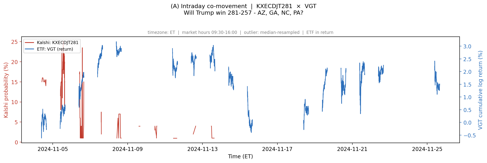
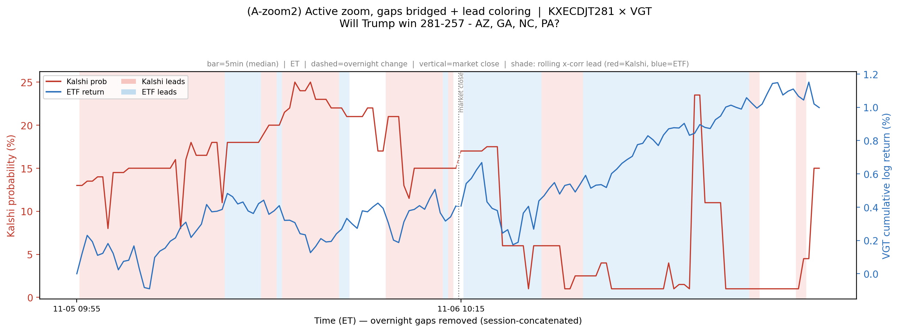
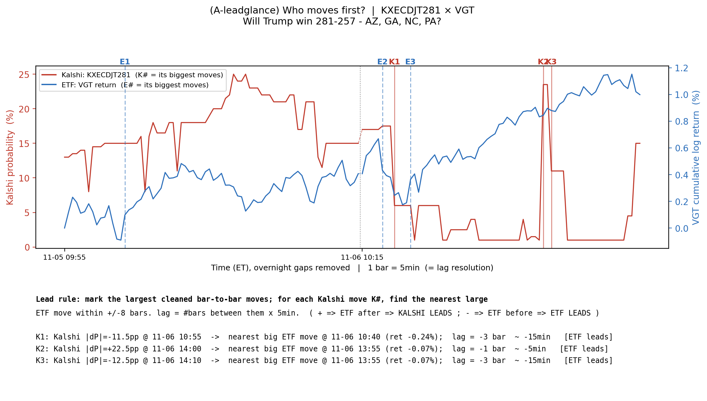

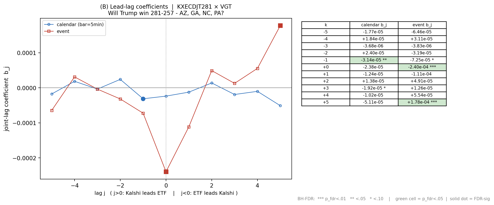

---

## Rank 12/48 — KXECDJT281 × VCR  (n_sig=3, best_p=4.4e-04, n_trades=294)

```text
PAIR ANALYSIS    —    Rank 12 / 48
================================================================================================
KXECDJT281   x   VCR
Contract : "Will Trump win 281-257 - AZ, GA, NC, PA?"
Sector relevance : Election outcome (all sectors)
Window : 2024-11-04 to 2024-11-25     Kalshi trades : 294     primary bar : 5min     daily-screen R^2 : 0.28

>>> RELIABILITY:  Adequate   <<<   (see section 5; unreliable pairs still get figures, but read their problems in section 8)

DEFINITIONS
   xₜ₋ₖ = Kalshi yes-probability change, k bars before t   (1 bar = 5min)
   yₜ   = ETF log return over bar t
   calendar = full market-hours grid: x=0 in bars with no Kalshi trade (not dropped).
   k>0 => Kalshi leads ETF ;  k<0 => ETF leads Kalshi ;  k=0 => contemporaneous

1. CALENDAR-TIME REGRESSION (clock-time lags, full RTH grid)
   Full model:  yₜ = α + Σ(k=-5..5) βₖ·xₜ₋ₖ + φ₁·yₜ₋₁ + Σ(d=1..7) γ_d·Day_d
      where  ADL ETF self-lags p=1 (BIC-chosen): φ₁·yₜ₋₁;  day-FE: 7 day dummies over 8 trading days (first day = baseline).
      controls counted (so you can see the total at a glance):  11 lead/lag x-terms + 1 ETF self-lag(s) + 7 day-FE dummies + 1 intercept = 20 RHS regressors  (model n_params=20).
   Significant terms (raw p<0.15) expanded:  yₜ = α + β₋₂·xₜ₊₂
   where:
      β₋₂ = +3.263e-05   (t/z=+2.23, p=2.6e-02, p_fdr=2.9e-01)    [ETF leads]
   Lean by count of significant lags: ETF-leads  (k>0:0, k<0:1).

2. EVENT-TIME REGRESSION (event-count lags)
   Full model:  yₜ = α + Σ(k=-5..5) βₖ·xₜ₋ₖ + Σ(d=1..1) γ_d·Day_d
      where  ADL ETF self-lags p=0 (BIC chose none -> no ETF self-lag term);  day-FE: 1 day dummies over 2 trading days (first day = baseline).
      controls counted (so you can see the total at a glance):  11 lead/lag x-terms + 0 ETF self-lag(s) + 1 day-FE dummies + 1 intercept = 13 RHS regressors  (model n_params=13).
   Significant terms (raw p<0.15) expanded:  yₜ = α + β₋₅·xₜ₊₅ + β₊₁·xₜ₋₁
   where:
      β₋₅ = -1.116e-04   (t/z=-2.29, p=2.2e-02, p_fdr=1.2e-01)    [ETF leads]
      β₊₁ = -7.434e-05   (t/z=-4.11, p=4.0e-05, p_fdr=4.4e-04) ***   [Kalshi leads]
   Lean by count of significant lags: balanced/no clear side  (k>0:1, k<0:1).

3. FULL COEFFICIENT TABLE  (calendar primary bar  vs  event)
      k |       calendar b (FDR) |          event b (FDR)
   ------------------------------------------------------
     -5 |          -1.32e-05     |          -1.12e-04    
     -4 |          +1.02e-05     |          +1.30e-05    
     -3 |          +3.84e-05     |          -3.38e-05    
     -2 |          +3.26e-05     |          +2.21e-05    
     -1 |          +5.73e-06     |          +1.09e-04    
     +0 |          -8.70e-06     |          -7.26e-05    
     +1 |          -6.63e-06     |          -7.43e-05 ***
     +2 |          -1.21e-06     |          +4.15e-05    
     +3 |          +1.87e-05     |          -1.95e-04    
     +4 |          +3.03e-05     |          -5.81e-05    
     +5 |          -2.25e-06     |          +1.19e-04    
   (stars = BH-FDR corrected:  *** p_fdr<.01  ** <.05  * <.10)

4. DIRECTIONAL TEST (probit, ETF up/down)
   Model: P(ETFₜ up) = Φ(α + βₖ·xₜ₋ₖ),  one probit per lag k
   calendar: β₊₁=-7.74e-02
   event: β₊₁=-1.12e-01, β₊₃=-8.98e-02

5. DATA RELIABILITY (statistical, not a trade-count cutoff)
   Tier: Adequate
   (criterion = n_active: bars with an actual Kalshi move (x!=0) = the real sample that identifies the lead-lag. Full RTH grid makes n_obs large, so n_active is the honest size.)
   calendar(full RTH grid): n_active=51  n_obs=385  n_days=8  K=5  params=20  df=365  median_SE=2.77e-05  sig(FDR)=0
   event: n_active=35  n_obs=58  n_days=2  K=5  params=13  df=45  median_SE=1.19e-04  sig(FDR)=1

6. COARSE-FREQUENCY ROBUSTNESS (re-run calendar at 30min / 60min)
    30min: n_obs=31 df=15 K=5  sig=7 (Kalshi-leads 4 / ETF-leads 2) -> Kalshi-leads
    60min: n_obs=18 df=4 K=4  sig=0 (Kalshi-leads 0 / ETF-leads 0) -> No-sig

7. VERDICT
   Calendar leans ETF-leads but Event leans balanced -- NOT robust across time-axis; no clean lead.

8. FIGURE CAVEATS — figures are still drawn, but know their problems
   - Adequate info: figures and regression are mutually readable; note that flat Kalshi segments still mean 'no trade', not 'no change'.
   - Mixed coefficient signs across lags -- relationship not monotone.
   - Kalshi updates only on trades (flat line = no trade, NOT 'no change'); ETF mid refreshes continuously.

9. REAL-WORLD CONTEXT (WebSearch-verified; see URLs)
   - 2024 US presidential election held Tue Nov 5, 2024; ballots counted overnight Nov 5-6.
   - AP called the race for Trump ~5:34-5:37 AM ET on Wed Nov 6, 2024 (Wisconsin pushed him past 270) -- this is PRE-MARKET, so the regular-hours equity reaction shows up at the Nov 6 open.
   - Final electoral result: Trump 312, Harris 226.
   - Sources: en.wikipedia.org/wiki/2024_United_States_presidential_election ; spectrumlocalnews.com/us/snplus/news/2024/11/06/trump-wins-ap-projection-2024-election

------------------------------------------------------------------------------------------------
Conventions: ET | 09:30-16:00 (forward windows capped to 16:00) | ETF in log return | median causal bars | full RTH grid | day-grouped lags (no overnight) | ADL self-control | significance = BH-FDR corrected.
Figures for this pair follow on the next page.
```

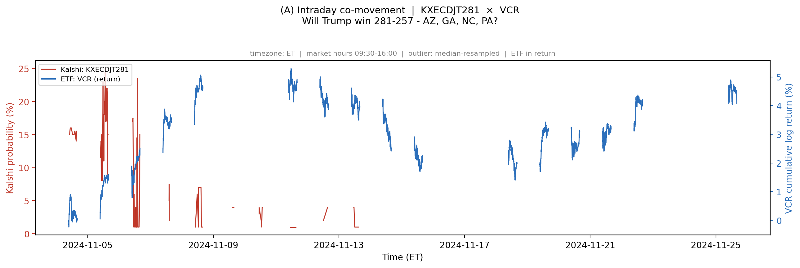
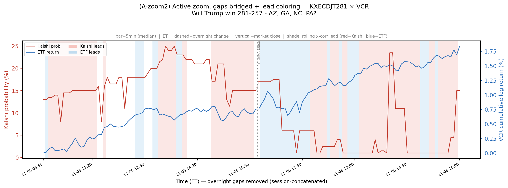
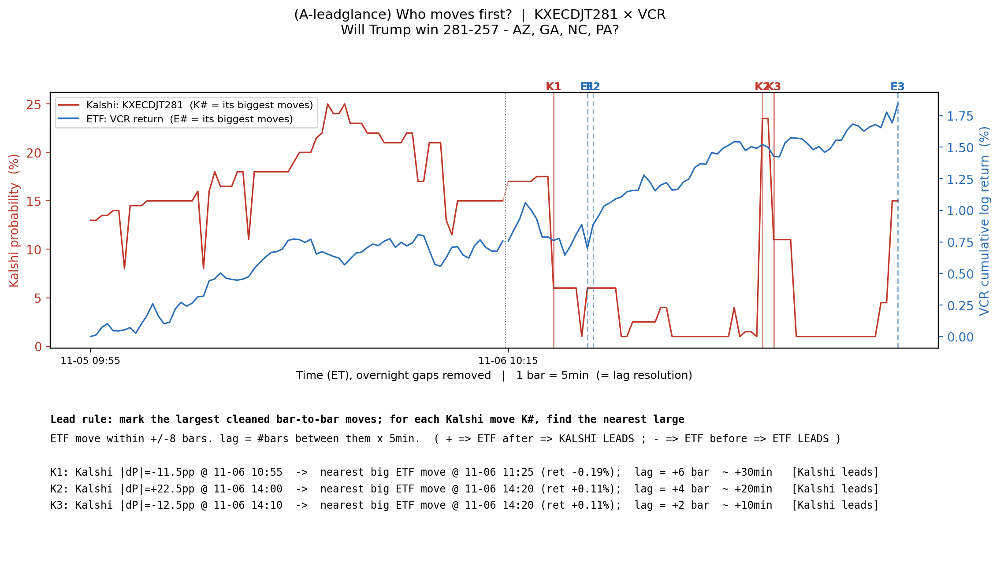
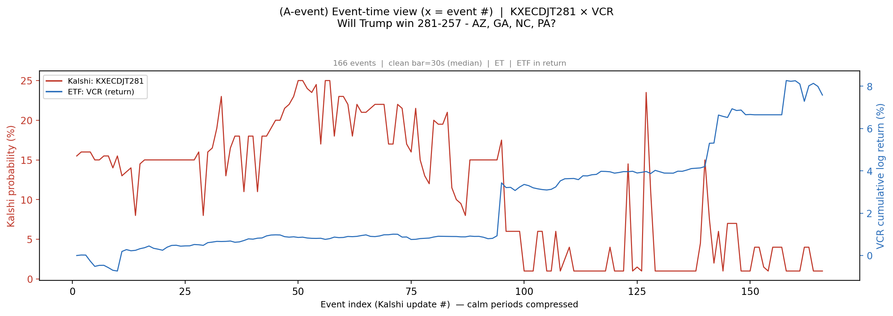
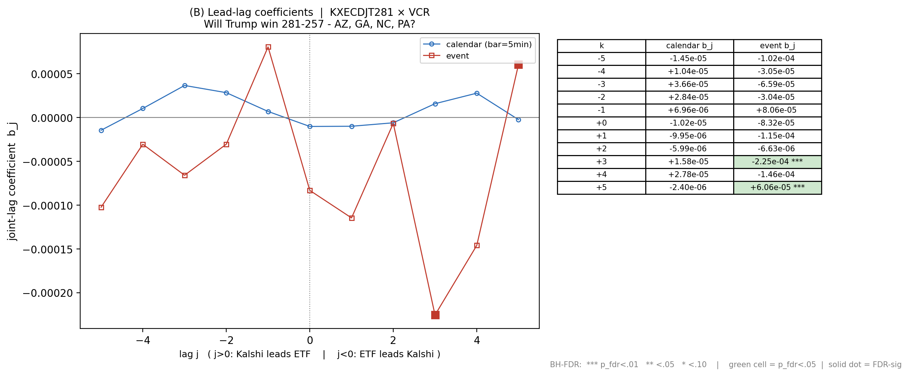

---

## Rank 13/48 — KXECDJT312 × VAW  (n_sig=4, best_p=6.9e-02, n_trades=204)

```text
PAIR ANALYSIS    —    Rank 13 / 48
================================================================================================
KXECDJT312   x   VAW
Contract : "Will Trump win 312-226 - swing state sweep?"
Sector relevance : Election outcome (all sectors)
Window : 2024-11-04 to 2024-12-12     Kalshi trades : 204     primary bar : 10min     daily-screen R^2 : 0.31

>>> RELIABILITY:  Low-info   <<<   (see section 5; unreliable pairs still get figures, but read their problems in section 8)

DEFINITIONS
   xₜ₋ₖ = Kalshi yes-probability change, k bars before t   (1 bar = 10min)
   yₜ   = ETF log return over bar t
   calendar = full market-hours grid: x=0 in bars with no Kalshi trade (not dropped).
   k>0 => Kalshi leads ETF ;  k<0 => ETF leads Kalshi ;  k=0 => contemporaneous

1. CALENDAR-TIME REGRESSION (clock-time lags, full RTH grid)
   Full model:  yₜ = α + Σ(k=-5..5) βₖ·xₜ₋ₖ + φ₁·yₜ₋₁ + Σ(d=1..9) γ_d·Day_d
      where  ADL ETF self-lags p=1 (BIC-chosen): φ₁·yₜ₋₁;  day-FE: 9 day dummies over 10 trading days (first day = baseline).
      controls counted (so you can see the total at a glance):  11 lead/lag x-terms + 1 ETF self-lag(s) + 9 day-FE dummies + 1 intercept = 22 RHS regressors  (model n_params=22).
   Significant terms (raw p<0.15) expanded:  yₜ = α + β₋₅·xₜ₊₅ + β₋₄·xₜ₊₄ + β₋₂·xₜ₊₂ + β₊₅·xₜ₋₅
   where:
      β₋₅ = +9.268e-05   (t/z=+2.64, p=8.2e-03, p_fdr=6.9e-02) *   [ETF leads]
      β₋₄ = +7.277e-05   (t/z=+2.35, p=1.9e-02, p_fdr=6.9e-02) *   [ETF leads]
      β₋₂ = -6.824e-05   (t/z=-2.42, p=1.5e-02, p_fdr=6.9e-02) *   [ETF leads]
      β₊₅ = -7.215e-05   (t/z=-1.54, p=1.2e-01, p_fdr=3.4e-01)    [Kalshi leads]
   Lean by count of significant lags: ETF-leads  (k>0:1, k<0:3).

2. EVENT-TIME REGRESSION (event-count lags)
   Full model:  yₜ = α + Σ(k=-5..5) βₖ·xₜ₋ₖ + Σ(d=1..2) γ_d·Day_d
      where  ADL ETF self-lags p=0 (BIC chose none -> no ETF self-lag term);  day-FE: 2 day dummies over 3 trading days (first day = baseline).
      controls counted (so you can see the total at a glance):  11 lead/lag x-terms + 0 ETF self-lag(s) + 2 day-FE dummies + 1 intercept = 14 RHS regressors  (model n_params=14).
   -> 11 coefficients tested, NONE significant at raw p<0.15.

3. FULL COEFFICIENT TABLE  (calendar primary bar  vs  event)
      k |       calendar b (FDR) |          event b (FDR)
   ------------------------------------------------------
     -5 |          +9.27e-05 *   |          +1.89e-05    
     -4 |          +7.28e-05 *   |          -5.90e-05    
     -3 |          -4.87e-05     |          +4.41e-05    
     -2 |          -6.82e-05 *   |          -5.87e-04    
     -1 |          +1.39e-05     |          -5.76e-04    
     +0 |          +6.88e-07     |          -7.10e-04    
     +1 |          -3.35e-05     |          -1.08e-03    
     +2 |          +2.45e-06     |          -6.97e-04    
     +3 |          +7.16e-06     |          -1.30e-03    
     +4 |          -3.53e-05     |          -1.61e-03    
     +5 |          -7.21e-05     |          -4.77e-04    
   (stars = BH-FDR corrected:  *** p_fdr<.01  ** <.05  * <.10)

4. DIRECTIONAL TEST (probit, ETF up/down)
   Model: P(ETFₜ up) = Φ(α + βₖ·xₜ₋ₖ),  one probit per lag k
   calendar: β₋₄=-1.65e-01*, β₋₁=+1.43e-01, β₊₄=-2.78e-01
   event: β₋₅=+5.47e-02, β₋₄=-3.16e-01*, β₋₁=+2.99e-01*, β₊₄=-3.95e-01*

5. DATA RELIABILITY (statistical, not a trade-count cutoff)
   Tier: Low-info
   (criterion = n_active: bars with an actual Kalshi move (x!=0) = the real sample that identifies the lead-lag. Full RTH grid makes n_obs large, so n_active is the honest size.)
   calendar(full RTH grid): n_active=38  n_obs=169  n_days=10  K=5  params=22  df=147  median_SE=3.50e-05  sig(FDR)=0
   event: n_active=20  n_obs=26  n_days=3  K=5  params=14  df=12  median_SE=1.67e-03  sig(FDR)=0

6. COARSE-FREQUENCY ROBUSTNESS (re-run calendar at 30min / 60min)
    30min: n_obs=34 df=17 K=5  sig=1 (Kalshi-leads 0 / ETF-leads 1) -> ETF-leads
    60min: n_obs=20 df=5 K=4  sig=5 (Kalshi-leads 1 / ETF-leads 4) -> ETF-leads

7. VERDICT
   Only one time-axis significant (ETF-leads) -- weak / single-mode evidence.

8. FIGURE CAVEATS — figures are still drawn, but know their problems
   - Low info (15<= active bars <40): direction is indicative but imprecise; do not over-interpret any single coefficient.
   - Mixed coefficient signs across lags -- relationship not monotone.
   - Kalshi updates only on trades (flat line = no trade, NOT 'no change'); ETF mid refreshes continuously.

9. REAL-WORLD CONTEXT (WebSearch-verified; see URLs)
   - 2024 US presidential election held Tue Nov 5, 2024; ballots counted overnight Nov 5-6.
   - AP called the race for Trump ~5:34-5:37 AM ET on Wed Nov 6, 2024 (Wisconsin pushed him past 270) -- this is PRE-MARKET, so the regular-hours equity reaction shows up at the Nov 6 open.
   - Final electoral result: Trump 312, Harris 226.
   - Sources: en.wikipedia.org/wiki/2024_United_States_presidential_election ; spectrumlocalnews.com/us/snplus/news/2024/11/06/trump-wins-ap-projection-2024-election

------------------------------------------------------------------------------------------------
Conventions: ET | 09:30-16:00 (forward windows capped to 16:00) | ETF in log return | median causal bars | full RTH grid | day-grouped lags (no overnight) | ADL self-control | significance = BH-FDR corrected.
Figures for this pair follow on the next page.
```

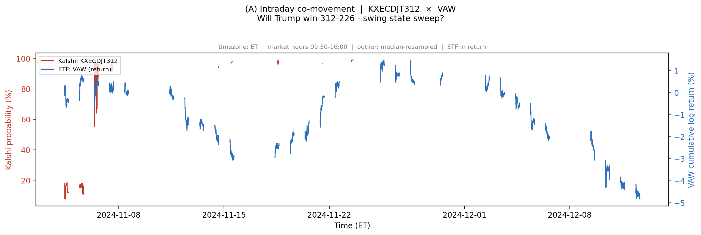
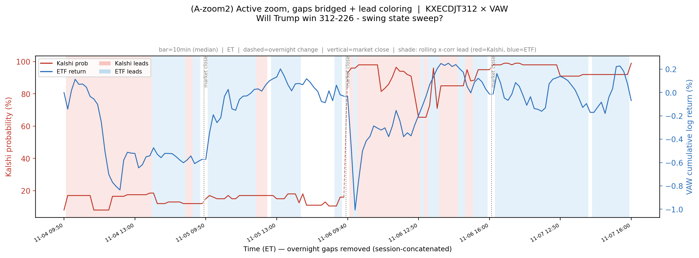
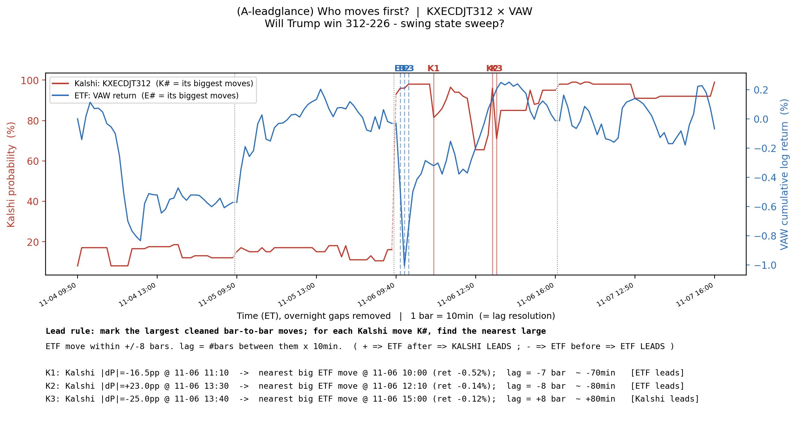
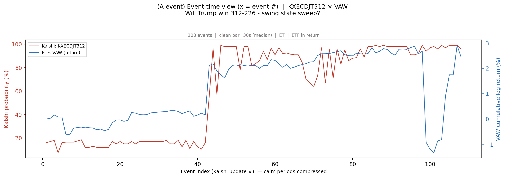
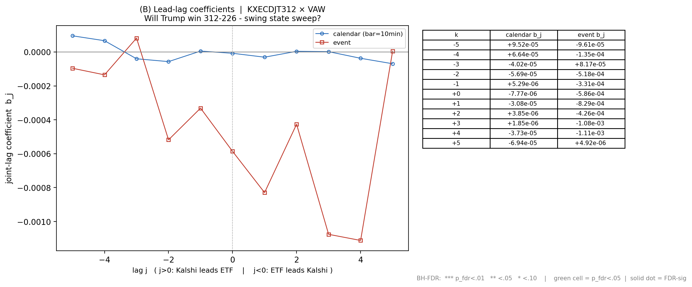

---

## Rank 14/48 — KXECDJT306 × VDC  (n_sig=6, best_p=2.2e-164, n_trades=108)

```text
PAIR ANALYSIS    —    Rank 14 / 48
================================================================================================
KXECDJT306   x   VDC
Contract : "Will Trump win 306-232 - AZ, GA, MI, PA, WI, NC?"
Sector relevance : Election outcome (all sectors)
Window : 2024-11-04 to 2024-12-16     Kalshi trades : 108     primary bar : 10min     daily-screen R^2 : 0.32

>>> RELIABILITY:  Low-info   <<<   (see section 5; unreliable pairs still get figures, but read their problems in section 8)

DEFINITIONS
   xₜ₋ₖ = Kalshi yes-probability change, k bars before t   (1 bar = 10min)
   yₜ   = ETF log return over bar t
   calendar = full market-hours grid: x=0 in bars with no Kalshi trade (not dropped).
   k>0 => Kalshi leads ETF ;  k<0 => ETF leads Kalshi ;  k=0 => contemporaneous

1. CALENDAR-TIME REGRESSION (clock-time lags, full RTH grid)
   Full model:  yₜ = α + Σ(k=-4..4) βₖ·xₜ₋ₖ + φ₁·yₜ₋₁ + Σ(d=1..10) γ_d·Day_d
      where  ADL ETF self-lags p=1 (BIC-chosen): φ₁·yₜ₋₁;  day-FE: 10 day dummies over 11 trading days (first day = baseline).
      controls counted (so you can see the total at a glance):  9 lead/lag x-terms + 1 ETF self-lag(s) + 10 day-FE dummies + 1 intercept = 21 RHS regressors  (model n_params=21).
   Significant terms (raw p<0.15) expanded:  yₜ = α + β₋₄·xₜ₊₄ + β₋₂·xₜ₊₂ + β₊₀·xₜ + β₊₂·xₜ₋₂ + β₊₃·xₜ₋₃ + β₊₄·xₜ₋₄
   where:
      β₋₄ = -5.111e-05   (t/z=-6.71, p=2.0e-11, p_fdr=6.0e-11) ***   [ETF leads]
      β₋₂ = +4.614e-05   (t/z=+27.40, p=2.4e-165, p_fdr=2.2e-164) ***   [ETF leads]
      β₊₀ = -5.134e-05   (t/z=-2.74, p=6.2e-03, p_fdr=1.4e-02) **   [contemporaneous]
      β₊₂ = -2.431e-05   (t/z=-8.51, p=1.8e-17, p_fdr=8.1e-17) ***   [Kalshi leads]
      β₊₃ = +6.257e-05   (t/z=+2.53, p=1.1e-02, p_fdr=2.0e-02) **   [Kalshi leads]
      β₊₄ = -7.315e-05   (t/z=-2.32, p=2.0e-02, p_fdr=3.1e-02) **   [Kalshi leads]
   Lean by count of significant lags: Kalshi-leads  (k>0:3, k<0:2).

2. EVENT-TIME REGRESSION (event-count lags)
   Full model:  yₜ = α + Σ(k) βₖ·xₜ₋ₖ + (ADL self-lags) + (day fixed effects)
   -> no regression result (insufficient data).

3. FULL COEFFICIENT TABLE  (calendar primary bar  vs  event)
      k |       calendar b (FDR) |          event b (FDR)
   ------------------------------------------------------
     -4 |          -5.11e-05 *** |                     --
     -3 |          -1.73e-05     |                     --
     -2 |          +4.61e-05 *** |                     --
     -1 |          -8.62e-06     |                     --
     +0 |          -5.13e-05 **  |                     --
     +1 |          -4.77e-07     |                     --
     +2 |          -2.43e-05 *** |                     --
     +3 |          +6.26e-05 **  |                     --
     +4 |          -7.32e-05 **  |                     --
   (stars = BH-FDR corrected:  *** p_fdr<.01  ** <.05  * <.10)

4. DIRECTIONAL TEST (probit, ETF up/down)
   Model: P(ETFₜ up) = Φ(α + βₖ·xₜ₋ₖ),  one probit per lag k
   calendar: β₋₁=+5.70e-01***
   event: β₋₁=+5.10e-01***, β₊₀=-1.74e-01***, β₊₃=-1.84e-01

5. DATA RELIABILITY (statistical, not a trade-count cutoff)
   Tier: Low-info
   (criterion = n_active: bars with an actual Kalshi move (x!=0) = the real sample that identifies the lead-lag. Full RTH grid makes n_obs large, so n_active is the honest size.)
   calendar(full RTH grid): n_active=20  n_obs=216  n_days=11  K=4  params=21  df=195  median_SE=1.88e-05  sig(FDR)=6
   event: not estimable (insufficient data)

6. COARSE-FREQUENCY ROBUSTNESS (re-run calendar at 30min / 60min)
    30min: n_obs=13 df=1 K=4  sig=2 (Kalshi-leads 0 / ETF-leads 2) -> ETF-leads
    60min: not estimable (n_obs=13 < minimum) -- coarser bars have even fewer observations

7. VERDICT
   Only one time-axis significant (Kalshi-leads) -- weak / single-mode evidence.

8. FIGURE CAVEATS — figures are still drawn, but know their problems
   - Low info (15<= active bars <40): direction is indicative but imprecise; do not over-interpret any single coefficient.
   - Mixed coefficient signs across lags -- relationship not monotone.
   - Kalshi updates only on trades (flat line = no trade, NOT 'no change'); ETF mid refreshes continuously.

9. REAL-WORLD CONTEXT (WebSearch-verified; see URLs)
   - 2024 US presidential election held Tue Nov 5, 2024; ballots counted overnight Nov 5-6.
   - AP called the race for Trump ~5:34-5:37 AM ET on Wed Nov 6, 2024 (Wisconsin pushed him past 270) -- this is PRE-MARKET, so the regular-hours equity reaction shows up at the Nov 6 open.
   - Final electoral result: Trump 312, Harris 226.
   - Sources: en.wikipedia.org/wiki/2024_United_States_presidential_election ; spectrumlocalnews.com/us/snplus/news/2024/11/06/trump-wins-ap-projection-2024-election

------------------------------------------------------------------------------------------------
Conventions: ET | 09:30-16:00 (forward windows capped to 16:00) | ETF in log return | median causal bars | full RTH grid | day-grouped lags (no overnight) | ADL self-control | significance = BH-FDR corrected.
Figures for this pair follow on the next page.
```

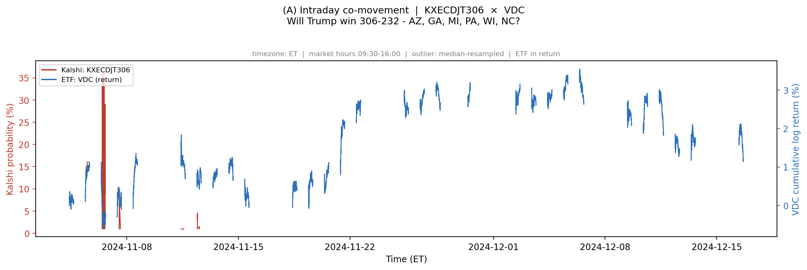
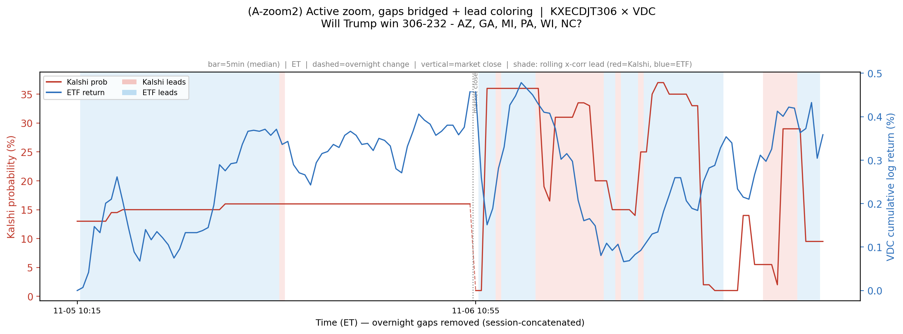
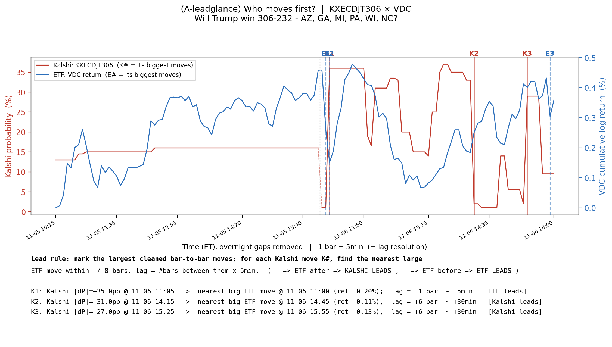
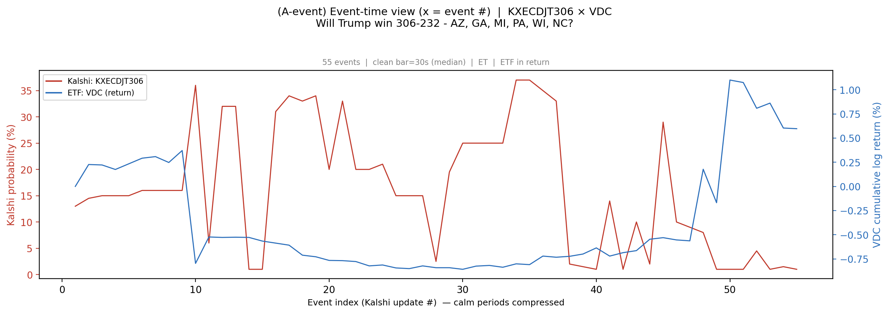
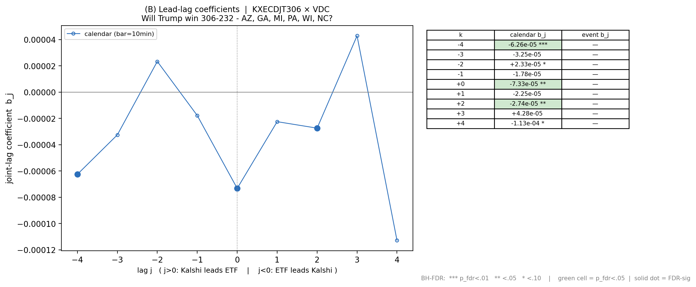

---

## Rank 15/48 — KXECDJT316 × VIS  (n_sig=4, best_p=1.1e-04, n_trades=51)

```text
PAIR ANALYSIS    —    Rank 15 / 48
================================================================================================
KXECDJT316   x   VIS
Contract : "Will Trump win 316-222 - AZ, GA, MI, MN, NC, PA, WI?"
Sector relevance : Election outcome (all sectors)
Window : 2024-11-04 to 2024-12-12     Kalshi trades : 51     primary bar : 10min     daily-screen R^2 : 0.50

>>> RELIABILITY:  Very-low-info   <<<   (see section 5; unreliable pairs still get figures, but read their problems in section 8)

DEFINITIONS
   xₜ₋ₖ = Kalshi yes-probability change, k bars before t   (1 bar = 10min)
   yₜ   = ETF log return over bar t
   calendar = full market-hours grid: x=0 in bars with no Kalshi trade (not dropped).
   k>0 => Kalshi leads ETF ;  k<0 => ETF leads Kalshi ;  k=0 => contemporaneous

1. CALENDAR-TIME REGRESSION (clock-time lags, full RTH grid)
   Full model:  yₜ = α + Σ(k=-3..3) βₖ·xₜ₋ₖ + φ₁·yₜ₋₁ + Σ(d=1..5) γ_d·Day_d
      where  ADL ETF self-lags p=1 (BIC-chosen): φ₁·yₜ₋₁;  day-FE: 5 day dummies over 6 trading days (first day = baseline).
      controls counted (so you can see the total at a glance):  7 lead/lag x-terms + 1 ETF self-lag(s) + 5 day-FE dummies + 1 intercept = 14 RHS regressors  (model n_params=14).
   Significant terms (raw p<0.15) expanded:  yₜ = α + β₋₃·xₜ₊₃ + β₋₁·xₜ₊₁ + β₊₁·xₜ₋₁ + β₊₂·xₜ₋₂
   where:
      β₋₃ = +1.521e-05   (t/z=+1.81, p=7.1e-02, p_fdr=1.2e-01)    [ETF leads]
      β₋₁ = +1.181e-04   (t/z=+2.08, p=3.8e-02, p_fdr=8.8e-02) *   [ETF leads]
      β₊₁ = -2.131e-05   (t/z=-3.15, p=1.6e-03, p_fdr=5.7e-03) ***   [Kalshi leads]
      β₊₂ = +8.540e-05   (t/z=+4.31, p=1.6e-05, p_fdr=1.1e-04) ***   [Kalshi leads]
   Lean by count of significant lags: balanced/no clear side  (k>0:2, k<0:2).

2. EVENT-TIME REGRESSION (event-count lags)
   Full model:  yₜ = α + Σ(k) βₖ·xₜ₋ₖ + (ADL self-lags) + (day fixed effects)
   -> no regression result (insufficient data).

3. FULL COEFFICIENT TABLE  (calendar primary bar  vs  event)
      k |       calendar b (FDR) |          event b (FDR)
   ------------------------------------------------------
     -3 |          +1.52e-05     |                     --
     -2 |          +5.65e-05     |                     --
     -1 |          +1.18e-04 *   |                     --
     +0 |          -2.81e-05     |                     --
     +1 |          -2.13e-05 *** |                     --
     +2 |          +8.54e-05 *** |                     --
     +3 |          +1.07e-05     |                     --
   (stars = BH-FDR corrected:  *** p_fdr<.01  ** <.05  * <.10)

4. DIRECTIONAL TEST (probit, ETF up/down)
   Model: P(ETFₜ up) = Φ(α + βₖ·xₜ₋ₖ),  one probit per lag k
   calendar: n/a
   event: n/a
   -> no significant directional predictability either mode (raw p<0.15).

5. DATA RELIABILITY (statistical, not a trade-count cutoff)
   Tier: Very-low-info
   (criterion = n_active: bars with an actual Kalshi move (x!=0) = the real sample that identifies the lead-lag. Full RTH grid makes n_obs large, so n_active is the honest size.)
   calendar(full RTH grid): n_active=12  n_obs=126  n_days=6  K=3  params=14  df=112  median_SE=4.03e-05  sig(FDR)=2
   event: not estimable (insufficient data)
   => Very low info: even 'significant' coefficients are untrustworthy (huge SE, possibly spurious significance).

6. COARSE-FREQUENCY ROBUSTNESS (re-run calendar at 30min / 60min)
    30min: not estimable (n_obs=15 < minimum) -- coarser bars have even fewer observations
    60min: not estimable (n_obs=11 < minimum) -- coarser bars have even fewer observations

7. VERDICT
   Only one time-axis significant (balanced) -- weak / single-mode evidence.
   (Note: this pair lacks the data to support reliable inference; the verdict above is descriptive only -- do not put it in the conclusions.)

8. FIGURE CAVEATS — figures are still drawn, but know their problems
   - Very low info (only 12 bars with an actual Kalshi move, < 15): even 'significant' coefficients are untrustworthy (huge SE, possibly spurious significance).
   - Most of the chart is flat no-trade lines; only a handful of bars carry real variation, so the lead calls in leadglance/segments are not robust.
   - Mixed coefficient signs across lags -- relationship not monotone.
   - Kalshi updates only on trades (flat line = no trade, NOT 'no change'); ETF mid refreshes continuously.

9. REAL-WORLD CONTEXT (WebSearch-verified; see URLs)
   - 2024 US presidential election held Tue Nov 5, 2024; ballots counted overnight Nov 5-6.
   - AP called the race for Trump ~5:34-5:37 AM ET on Wed Nov 6, 2024 (Wisconsin pushed him past 270) -- this is PRE-MARKET, so the regular-hours equity reaction shows up at the Nov 6 open.
   - Final electoral result: Trump 312, Harris 226.
   - Sources: en.wikipedia.org/wiki/2024_United_States_presidential_election ; spectrumlocalnews.com/us/snplus/news/2024/11/06/trump-wins-ap-projection-2024-election

------------------------------------------------------------------------------------------------
Conventions: ET | 09:30-16:00 (forward windows capped to 16:00) | ETF in log return | median causal bars | full RTH grid | day-grouped lags (no overnight) | ADL self-control | significance = BH-FDR corrected.
Figures for this pair follow on the next page.
```

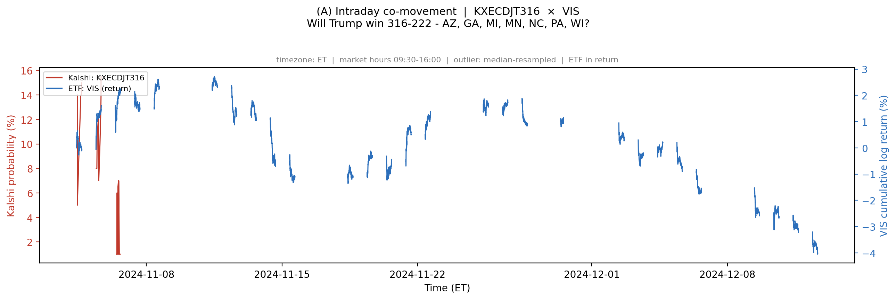
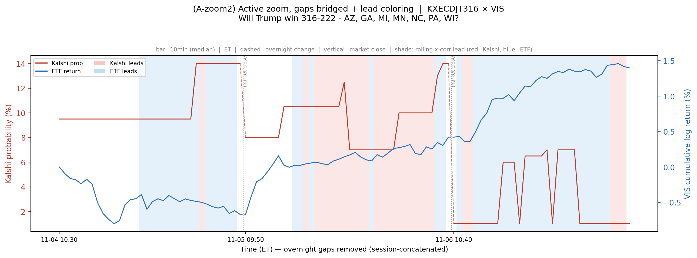
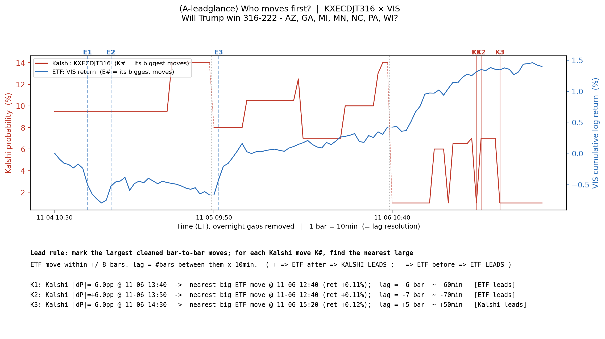
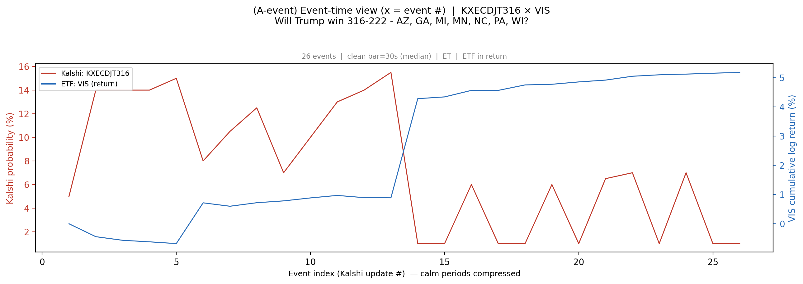
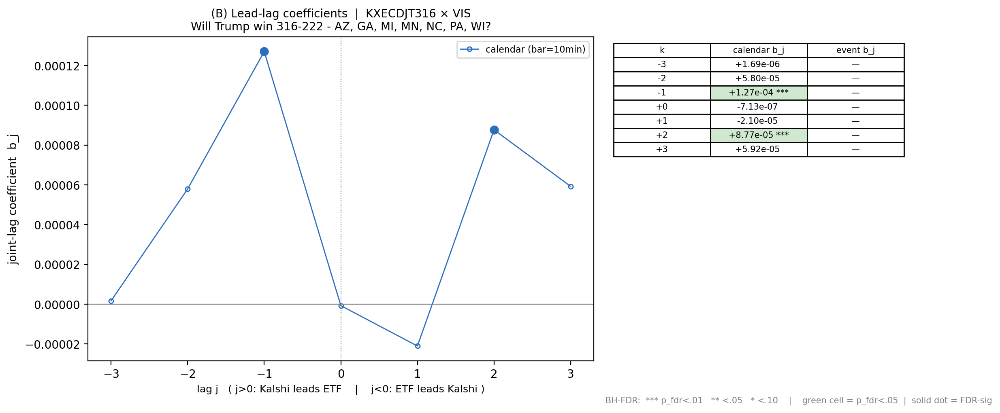

---

## Rank 16/48 — KXECDJT316 × VFH  (n_sig=4, best_p=1.5e-03, n_trades=51)

```text
PAIR ANALYSIS    —    Rank 16 / 48
================================================================================================
KXECDJT316   x   VFH
Contract : "Will Trump win 316-222 - AZ, GA, MI, MN, NC, PA, WI?"
Sector relevance : Election outcome (all sectors)
Window : 2024-11-04 to 2024-12-12     Kalshi trades : 51     primary bar : 10min     daily-screen R^2 : 0.79

>>> RELIABILITY:  Very-low-info   <<<   (see section 5; unreliable pairs still get figures, but read their problems in section 8)

DEFINITIONS
   xₜ₋ₖ = Kalshi yes-probability change, k bars before t   (1 bar = 10min)
   yₜ   = ETF log return over bar t
   calendar = full market-hours grid: x=0 in bars with no Kalshi trade (not dropped).
   k>0 => Kalshi leads ETF ;  k<0 => ETF leads Kalshi ;  k=0 => contemporaneous

1. CALENDAR-TIME REGRESSION (clock-time lags, full RTH grid)
   Full model:  yₜ = α + Σ(k=-3..3) βₖ·xₜ₋ₖ + φ₁·yₜ₋₁ + Σ(d=1..5) γ_d·Day_d
      where  ADL ETF self-lags p=1 (BIC-chosen): φ₁·yₜ₋₁;  day-FE: 5 day dummies over 6 trading days (first day = baseline).
      controls counted (so you can see the total at a glance):  7 lead/lag x-terms + 1 ETF self-lag(s) + 5 day-FE dummies + 1 intercept = 14 RHS regressors  (model n_params=14).
   Significant terms (raw p<0.15) expanded:  yₜ = α + β₋₃·xₜ₊₃ + β₋₂·xₜ₊₂ + β₋₁·xₜ₊₁ + β₊₂·xₜ₋₂
   where:
      β₋₃ = +1.024e-04   (t/z=+3.70, p=2.1e-04, p_fdr=1.5e-03) ***   [ETF leads]
      β₋₂ = +7.604e-05   (t/z=+2.25, p=2.5e-02, p_fdr=8.7e-02) *   [ETF leads]
      β₋₁ = +1.166e-04   (t/z=+1.48, p=1.4e-01, p_fdr=2.4e-01)    [ETF leads]
      β₊₂ = +3.830e-05   (t/z=+1.83, p=6.7e-02, p_fdr=1.6e-01)    [Kalshi leads]
   Lean by count of significant lags: ETF-leads  (k>0:1, k<0:3).

2. EVENT-TIME REGRESSION (event-count lags)
   Full model:  yₜ = α + Σ(k) βₖ·xₜ₋ₖ + (ADL self-lags) + (day fixed effects)
   -> no regression result (insufficient data).

3. FULL COEFFICIENT TABLE  (calendar primary bar  vs  event)
      k |       calendar b (FDR) |          event b (FDR)
   ------------------------------------------------------
     -3 |          +1.02e-04 *** |                     --
     -2 |          +7.60e-05 *   |                     --
     -1 |          +1.17e-04     |                     --
     +0 |          -5.22e-05     |                     --
     +1 |          +1.52e-05     |                     --
     +2 |          +3.83e-05     |                     --
     +3 |          +8.54e-05     |                     --
   (stars = BH-FDR corrected:  *** p_fdr<.01  ** <.05  * <.10)

4. DIRECTIONAL TEST (probit, ETF up/down)
   Model: P(ETFₜ up) = Φ(α + βₖ·xₜ₋ₖ),  one probit per lag k
   calendar: n/a
   event: n/a
   -> no significant directional predictability either mode (raw p<0.15).

5. DATA RELIABILITY (statistical, not a trade-count cutoff)
   Tier: Very-low-info
   (criterion = n_active: bars with an actual Kalshi move (x!=0) = the real sample that identifies the lead-lag. Full RTH grid makes n_obs large, so n_active is the honest size.)
   calendar(full RTH grid): n_active=12  n_obs=126  n_days=6  K=3  params=14  df=112  median_SE=6.46e-05  sig(FDR)=1
   event: not estimable (insufficient data)
   => Very low info: even 'significant' coefficients are untrustworthy (huge SE, possibly spurious significance).

6. COARSE-FREQUENCY ROBUSTNESS (re-run calendar at 30min / 60min)
    30min: not estimable (n_obs=15 < minimum) -- coarser bars have even fewer observations
    60min: not estimable (n_obs=11 < minimum) -- coarser bars have even fewer observations

7. VERDICT
   Only one time-axis significant (ETF-leads) -- weak / single-mode evidence.
   (Note: this pair lacks the data to support reliable inference; the verdict above is descriptive only -- do not put it in the conclusions.)

8. FIGURE CAVEATS — figures are still drawn, but know their problems
   - Very low info (only 12 bars with an actual Kalshi move, < 15): even 'significant' coefficients are untrustworthy (huge SE, possibly spurious significance).
   - Most of the chart is flat no-trade lines; only a handful of bars carry real variation, so the lead calls in leadglance/segments are not robust.
   - Kalshi updates only on trades (flat line = no trade, NOT 'no change'); ETF mid refreshes continuously.

9. REAL-WORLD CONTEXT (WebSearch-verified; see URLs)
   - 2024 US presidential election held Tue Nov 5, 2024; ballots counted overnight Nov 5-6.
   - AP called the race for Trump ~5:34-5:37 AM ET on Wed Nov 6, 2024 (Wisconsin pushed him past 270) -- this is PRE-MARKET, so the regular-hours equity reaction shows up at the Nov 6 open.
   - Final electoral result: Trump 312, Harris 226.
   - Sources: en.wikipedia.org/wiki/2024_United_States_presidential_election ; spectrumlocalnews.com/us/snplus/news/2024/11/06/trump-wins-ap-projection-2024-election

------------------------------------------------------------------------------------------------
Conventions: ET | 09:30-16:00 (forward windows capped to 16:00) | ETF in log return | median causal bars | full RTH grid | day-grouped lags (no overnight) | ADL self-control | significance = BH-FDR corrected.
Figures for this pair follow on the next page.
```

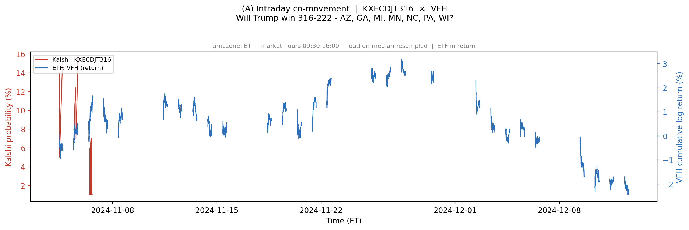
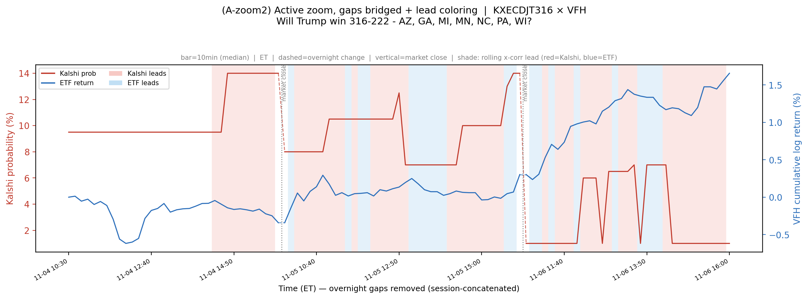
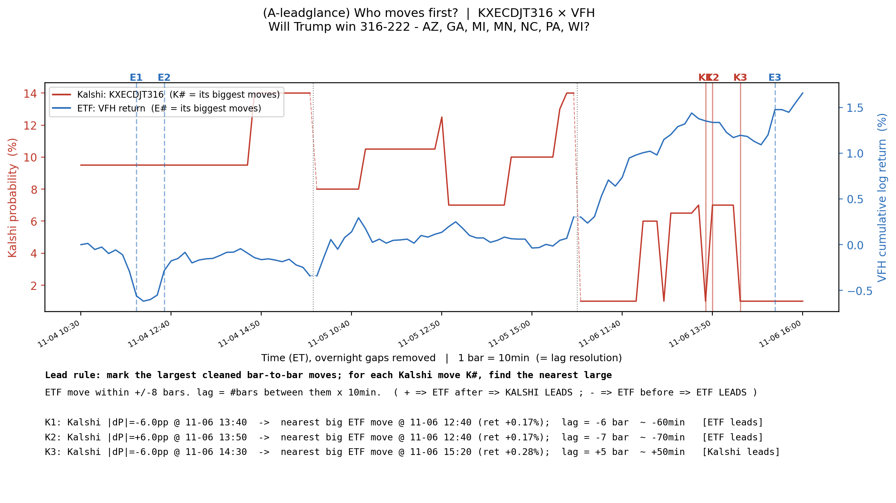
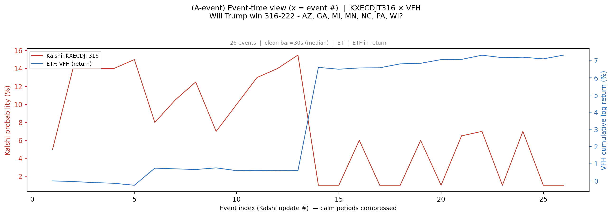
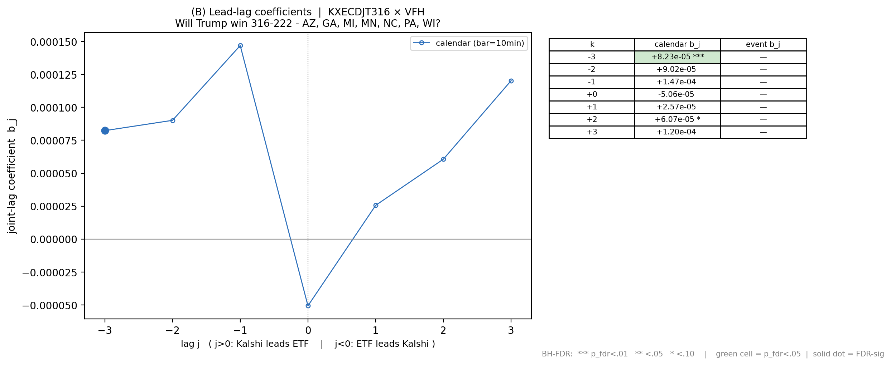

---

## Rank 17/48 — KXECDJT316 × VDE  (n_sig=1, best_p=4.1e-01, n_trades=51)

```text
PAIR ANALYSIS    —    Rank 17 / 48
================================================================================================
KXECDJT316   x   VDE
Contract : "Will Trump win 316-222 - AZ, GA, MI, MN, NC, PA, WI?"
Sector relevance : Election outcome (all sectors)
Window : 2024-11-04 to 2024-12-12     Kalshi trades : 51     primary bar : 10min     daily-screen R^2 : 0.49

>>> RELIABILITY:  Very-low-info   <<<   (see section 5; unreliable pairs still get figures, but read their problems in section 8)

DEFINITIONS
   xₜ₋ₖ = Kalshi yes-probability change, k bars before t   (1 bar = 10min)
   yₜ   = ETF log return over bar t
   calendar = full market-hours grid: x=0 in bars with no Kalshi trade (not dropped).
   k>0 => Kalshi leads ETF ;  k<0 => ETF leads Kalshi ;  k=0 => contemporaneous

1. CALENDAR-TIME REGRESSION (clock-time lags, full RTH grid)
   Full model:  yₜ = α + Σ(k=-3..3) βₖ·xₜ₋ₖ + φ₁·yₜ₋₁ + Σ(d=1..5) γ_d·Day_d
      where  ADL ETF self-lags p=1 (BIC-chosen): φ₁·yₜ₋₁;  day-FE: 5 day dummies over 6 trading days (first day = baseline).
      controls counted (so you can see the total at a glance):  7 lead/lag x-terms + 1 ETF self-lag(s) + 5 day-FE dummies + 1 intercept = 14 RHS regressors  (model n_params=14).
   Significant terms (raw p<0.15) expanded:  yₜ = α + β₊₀·xₜ
   where:
      β₊₀ = +5.521e-05   (t/z=+1.79, p=7.3e-02, p_fdr=4.1e-01)    [contemporaneous]
   Lean by count of significant lags: balanced/no clear side  (k>0:0, k<0:0).

2. EVENT-TIME REGRESSION (event-count lags)
   Full model:  yₜ = α + Σ(k) βₖ·xₜ₋ₖ + (ADL self-lags) + (day fixed effects)
   -> no regression result (insufficient data).

3. FULL COEFFICIENT TABLE  (calendar primary bar  vs  event)
      k |       calendar b (FDR) |          event b (FDR)
   ------------------------------------------------------
     -3 |          +3.57e-05     |                     --
     -2 |          +7.24e-05     |                     --
     -1 |          +1.95e-05     |                     --
     +0 |          +5.52e-05     |                     --
     +1 |          +2.54e-05     |                     --
     +2 |          -5.04e-05     |                     --
     +3 |          -1.70e-05     |                     --
   (stars = BH-FDR corrected:  *** p_fdr<.01  ** <.05  * <.10)

4. DIRECTIONAL TEST (probit, ETF up/down)
   Model: P(ETFₜ up) = Φ(α + βₖ·xₜ₋ₖ),  one probit per lag k
   calendar: n/a
   event: n/a
   -> no significant directional predictability either mode (raw p<0.15).

5. DATA RELIABILITY (statistical, not a trade-count cutoff)
   Tier: Very-low-info
   (criterion = n_active: bars with an actual Kalshi move (x!=0) = the real sample that identifies the lead-lag. Full RTH grid makes n_obs large, so n_active is the honest size.)
   calendar(full RTH grid): n_active=12  n_obs=126  n_days=6  K=3  params=14  df=112  median_SE=6.49e-05  sig(FDR)=0
   event: not estimable (insufficient data)
   => Very low info: even 'significant' coefficients are untrustworthy (huge SE, possibly spurious significance).

6. COARSE-FREQUENCY ROBUSTNESS (re-run calendar at 30min / 60min)
    30min: not estimable (n_obs=15 < minimum) -- coarser bars have even fewer observations
    60min: not estimable (n_obs=11 < minimum) -- coarser bars have even fewer observations

7. VERDICT
   Only one time-axis significant (balanced) -- weak / single-mode evidence.
   (Note: this pair lacks the data to support reliable inference; the verdict above is descriptive only -- do not put it in the conclusions.)

8. FIGURE CAVEATS — figures are still drawn, but know their problems
   - Very low info (only 12 bars with an actual Kalshi move, < 15): even 'significant' coefficients are untrustworthy (huge SE, possibly spurious significance).
   - Most of the chart is flat no-trade lines; only a handful of bars carry real variation, so the lead calls in leadglance/segments are not robust.
   - Kalshi updates only on trades (flat line = no trade, NOT 'no change'); ETF mid refreshes continuously.

9. REAL-WORLD CONTEXT (WebSearch-verified; see URLs)
   - 2024 US presidential election held Tue Nov 5, 2024; ballots counted overnight Nov 5-6.
   - AP called the race for Trump ~5:34-5:37 AM ET on Wed Nov 6, 2024 (Wisconsin pushed him past 270) -- this is PRE-MARKET, so the regular-hours equity reaction shows up at the Nov 6 open.
   - Final electoral result: Trump 312, Harris 226.
   - Sources: en.wikipedia.org/wiki/2024_United_States_presidential_election ; spectrumlocalnews.com/us/snplus/news/2024/11/06/trump-wins-ap-projection-2024-election

------------------------------------------------------------------------------------------------
Conventions: ET | 09:30-16:00 (forward windows capped to 16:00) | ETF in log return | median causal bars | full RTH grid | day-grouped lags (no overnight) | ADL self-control | significance = BH-FDR corrected.
Figures for this pair follow on the next page.
```

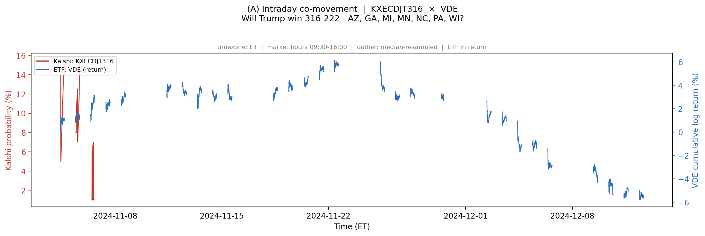
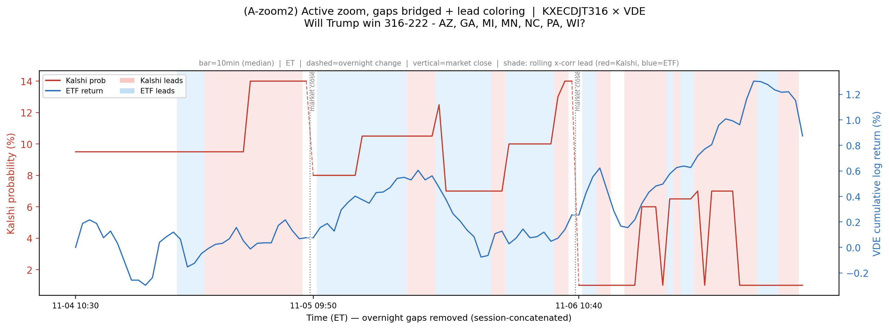
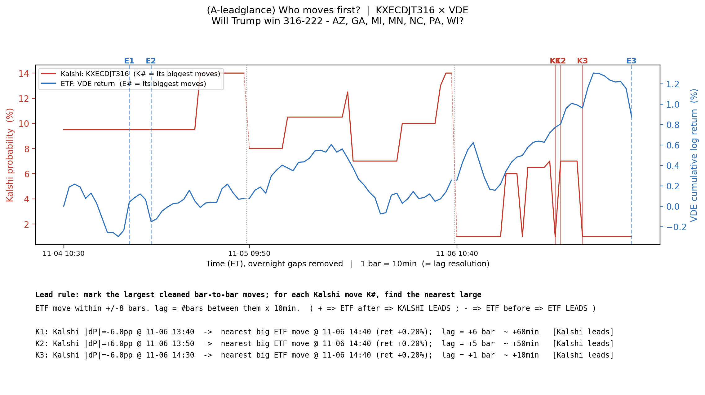
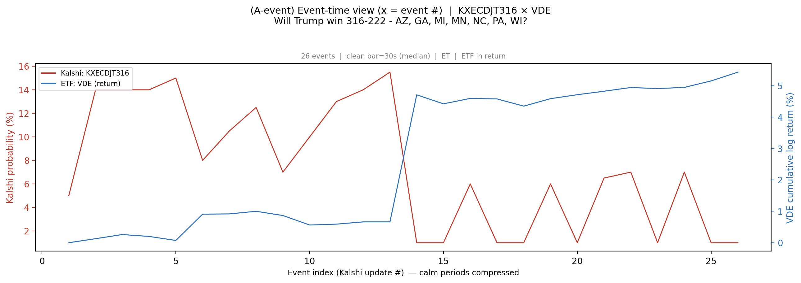
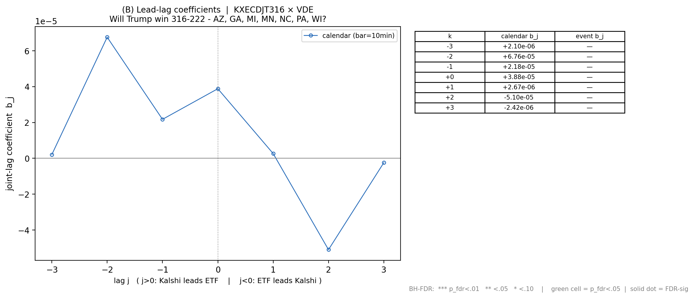

---

## Rank 18/48 — KXECKH276 × VOX  (n_sig=11, best_p=1.2e-11, n_trades=37)

```text
PAIR ANALYSIS    —    Rank 18 / 48
================================================================================================
KXECKH276   x   VOX
Contract : "Will Harris win 276-262 - PA, NV, MI, WI?"
Sector relevance : Election outcome (all sectors)
Window : 2024-11-04 to 2024-11-26     Kalshi trades : 37     primary bar : 10min     daily-screen R^2 : 0.59

>>> RELIABILITY:  Very-low-info   <<<   (see section 5; unreliable pairs still get figures, but read their problems in section 8)

DEFINITIONS
   xₜ₋ₖ = Kalshi yes-probability change, k bars before t   (1 bar = 10min)
   yₜ   = ETF log return over bar t
   calendar = full market-hours grid: x=0 in bars with no Kalshi trade (not dropped).
   k>0 => Kalshi leads ETF ;  k<0 => ETF leads Kalshi ;  k=0 => contemporaneous

1. CALENDAR-TIME REGRESSION (clock-time lags, full RTH grid)
   Full model:  yₜ = α + Σ(k=-3..3) βₖ·xₜ₋ₖ + φ₁·yₜ₋₁ + Σ(d=1..2) γ_d·Day_d
      where  ADL ETF self-lags p=1 (BIC-chosen): φ₁·yₜ₋₁;  day-FE: 2 day dummies over 3 trading days (first day = baseline).
      controls counted (so you can see the total at a glance):  7 lead/lag x-terms + 1 ETF self-lag(s) + 2 day-FE dummies + 1 intercept = 11 RHS regressors  (model n_params=11).
   Significant terms (raw p<0.15) expanded:  yₜ = α + β₋₃·xₜ₊₃ + β₋₂·xₜ₊₂ + β₋₁·xₜ₊₁ + β₊₂·xₜ₋₂ + β₊₃·xₜ₋₃
   where:
      β₋₃ = +1.134e-04   (t/z=+7.06, p=1.7e-12, p_fdr=1.2e-11) ***   [ETF leads]
      β₋₂ = -6.332e-05   (t/z=-4.37, p=1.2e-05, p_fdr=4.3e-05) ***   [ETF leads]
      β₋₁ = +5.085e-05   (t/z=+2.44, p=1.5e-02, p_fdr=2.6e-02) **   [ETF leads]
      β₊₂ = -6.967e-05   (t/z=-2.12, p=3.4e-02, p_fdr=4.8e-02) **   [Kalshi leads]
      β₊₃ = +1.643e-04   (t/z=+3.38, p=7.3e-04, p_fdr=1.7e-03) ***   [Kalshi leads]
   Lean by count of significant lags: ETF-leads  (k>0:2, k<0:3).

2. EVENT-TIME REGRESSION (event-count lags)
   Full model:  yₜ = α + Σ(k=-3..3) βₖ·xₜ₋ₖ + φ₁·yₜ₋₁ + φ₂·yₜ₋₂ + φ₃·yₜ₋₃
      where  ADL ETF self-lags p=3 (BIC-chosen): φ₁·yₜ₋₁ + φ₂·yₜ₋₂ + φ₃·yₜ₋₃;  day-FE: none (single trading day -> clustered SE degrades to HC3).
      controls counted (so you can see the total at a glance):  7 lead/lag x-terms + 3 ETF self-lag(s) + 0 day-FE dummies + 1 intercept = 11 RHS regressors  (model n_params=11).
   Significant terms (raw p<0.15) expanded:  yₜ = α + β₋₃·xₜ₊₃ + β₋₂·xₜ₊₂ + β₋₁·xₜ₊₁ + β₊₀·xₜ + β₊₁·xₜ₋₁ + β₊₂·xₜ₋₂
   where:
      β₋₃ = -5.791e-03   (t/z=-2.36, p=1.8e-02, p_fdr=7.7e-02) *   [ETF leads]
      β₋₂ = -7.145e-03   (t/z=-2.28, p=2.3e-02, p_fdr=7.7e-02) *   [ETF leads]
      β₋₁ = -6.871e-03   (t/z=-2.02, p=4.4e-02, p_fdr=7.7e-02) *   [ETF leads]
      β₊₀ = -7.890e-03   (t/z=-2.07, p=3.9e-02, p_fdr=7.7e-02) *   [contemporaneous]
      β₊₁ = -5.256e-03   (t/z=-1.82, p=6.9e-02, p_fdr=9.7e-02) *   [Kalshi leads]
      β₊₂ = -2.614e-03   (t/z=-1.51, p=1.3e-01, p_fdr=1.5e-01)    [Kalshi leads]
   Lean by count of significant lags: ETF-leads  (k>0:2, k<0:3).

3. FULL COEFFICIENT TABLE  (calendar primary bar  vs  event)
      k |       calendar b (FDR) |          event b (FDR)
   ------------------------------------------------------
     -3 |          +1.13e-04 *** |          -5.79e-03 *  
     -2 |          -6.33e-05 *** |          -7.14e-03 *  
     -1 |          +5.08e-05 **  |          -6.87e-03 *  
     +0 |          -5.39e-05     |          -7.89e-03 *  
     +1 |          +4.98e-05     |          -5.26e-03 *  
     +2 |          -6.97e-05 **  |          -2.61e-03    
     +3 |          +1.64e-04 *** |          -2.21e-04    
   (stars = BH-FDR corrected:  *** p_fdr<.01  ** <.05  * <.10)

4. DIRECTIONAL TEST (probit, ETF up/down)
   Model: P(ETFₜ up) = Φ(α + βₖ·xₜ₋ₖ),  one probit per lag k
   calendar: n/a
   event: n/a
   -> no significant directional predictability either mode (raw p<0.15).

5. DATA RELIABILITY (statistical, not a trade-count cutoff)
   Tier: Very-low-info
   (criterion = n_active: bars with an actual Kalshi move (x!=0) = the real sample that identifies the lead-lag. Full RTH grid makes n_obs large, so n_active is the honest size.)
   calendar(full RTH grid): n_active=8  n_obs=59  n_days=3  K=3  params=11  df=48  median_SE=3.29e-05  sig(FDR)=5
   event: n_active=7  n_obs=12  n_days=1  K=3  params=11  df=1  median_SE=2.89e-03  sig(FDR)=0
   => Very low info: even 'significant' coefficients are untrustworthy (huge SE, possibly spurious significance).

6. COARSE-FREQUENCY ROBUSTNESS (re-run calendar at 30min / 60min)
    30min: not estimable (n_obs=11 < minimum) -- coarser bars have even fewer observations
    60min: not estimable (n_obs=6 < minimum) -- coarser bars have even fewer observations

7. VERDICT
   Both time-axes lean ETF-leads (relatively robust; see strongest single term).
   (Note: this pair lacks the data to support reliable inference; the verdict above is descriptive only -- do not put it in the conclusions.)

8. FIGURE CAVEATS — figures are still drawn, but know their problems
   - Very low info (only 8 bars with an actual Kalshi move, < 15): even 'significant' coefficients are untrustworthy (huge SE, possibly spurious significance).
   - Most of the chart is flat no-trade lines; only a handful of bars carry real variation, so the lead calls in leadglance/segments are not robust.
   - Mixed coefficient signs across lags -- relationship not monotone.
   - Kalshi updates only on trades (flat line = no trade, NOT 'no change'); ETF mid refreshes continuously.

9. REAL-WORLD CONTEXT (WebSearch-verified; see URLs)
   - 2024 US presidential election held Tue Nov 5, 2024; ballots counted overnight Nov 5-6.
   - AP called the race for Trump ~5:34-5:37 AM ET on Wed Nov 6, 2024 (Wisconsin pushed him past 270) -- this is PRE-MARKET, so the regular-hours equity reaction shows up at the Nov 6 open.
   - Final electoral result: Trump 312, Harris 226.
   - Sources: en.wikipedia.org/wiki/2024_United_States_presidential_election ; spectrumlocalnews.com/us/snplus/news/2024/11/06/trump-wins-ap-projection-2024-election

------------------------------------------------------------------------------------------------
Conventions: ET | 09:30-16:00 (forward windows capped to 16:00) | ETF in log return | median causal bars | full RTH grid | day-grouped lags (no overnight) | ADL self-control | significance = BH-FDR corrected.
Figures for this pair follow on the next page.
```

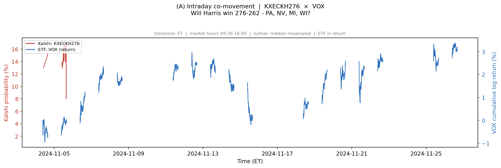
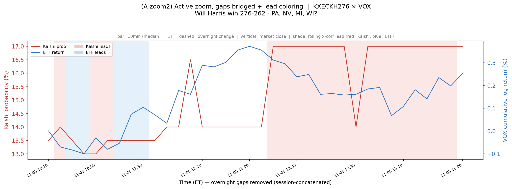
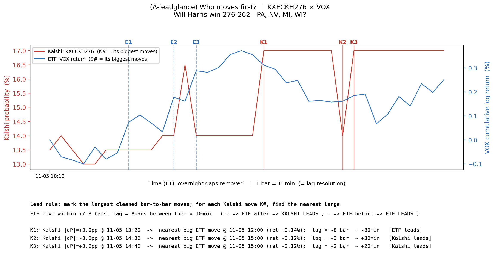
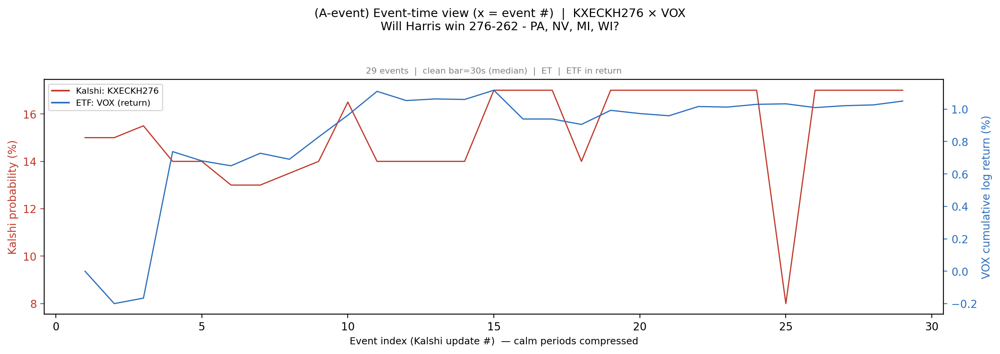
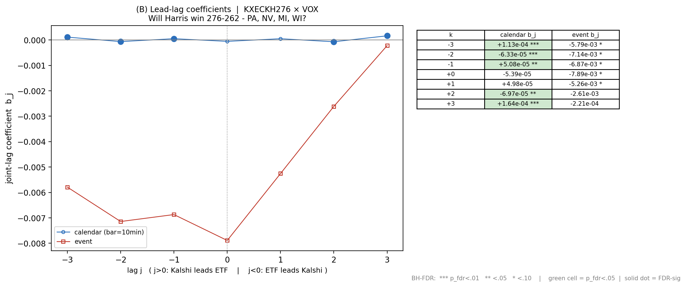

---

## Rank 19/48 — KXECKH276 × VFH  (n_sig=7, best_p=0.0e+00, n_trades=37)

```text
PAIR ANALYSIS    —    Rank 19 / 48
================================================================================================
KXECKH276   x   VFH
Contract : "Will Harris win 276-262 - PA, NV, MI, WI?"
Sector relevance : Election outcome (all sectors)
Window : 2024-11-04 to 2024-11-26     Kalshi trades : 37     primary bar : 10min     daily-screen R^2 : 0.88

>>> RELIABILITY:  Very-low-info   <<<   (see section 5; unreliable pairs still get figures, but read their problems in section 8)

DEFINITIONS
   xₜ₋ₖ = Kalshi yes-probability change, k bars before t   (1 bar = 10min)
   yₜ   = ETF log return over bar t
   calendar = full market-hours grid: x=0 in bars with no Kalshi trade (not dropped).
   k>0 => Kalshi leads ETF ;  k<0 => ETF leads Kalshi ;  k=0 => contemporaneous

1. CALENDAR-TIME REGRESSION (clock-time lags, full RTH grid)
   Full model:  yₜ = α + Σ(k=-3..3) βₖ·xₜ₋ₖ + Σ(d=1..2) γ_d·Day_d
      where  ADL ETF self-lags p=0 (BIC chose none -> no ETF self-lag term);  day-FE: 2 day dummies over 3 trading days (first day = baseline).
      controls counted (so you can see the total at a glance):  7 lead/lag x-terms + 0 ETF self-lag(s) + 2 day-FE dummies + 1 intercept = 10 RHS regressors  (model n_params=10).
   Significant terms (raw p<0.15) expanded:  yₜ = α + β₋₃·xₜ₊₃ + β₋₂·xₜ₊₂ + β₋₁·xₜ₊₁ + β₊₀·xₜ + β₊₁·xₜ₋₁ + β₊₂·xₜ₋₂ + β₊₃·xₜ₋₃
   where:
      β₋₃ = +1.371e-04   (t/z=+10.65, p=1.8e-26, p_fdr=4.1e-26) ***   [ETF leads]
      β₋₂ = +1.001e-04   (t/z=+3.19, p=1.4e-03, p_fdr=1.7e-03) ***   [ETF leads]
      β₋₁ = +3.705e-05   (t/z=+3.20, p=1.4e-03, p_fdr=1.7e-03) ***   [ETF leads]
      β₊₀ = -1.065e-04   (t/z=-2.70, p=6.9e-03, p_fdr=6.9e-03) ***   [contemporaneous]
      β₊₁ = -9.702e-05   (t/z=-5.96, p=2.5e-09, p_fdr=4.4e-09) ***   [Kalshi leads]
      β₊₂ = -9.721e-05   (t/z=-18.70, p=4.9e-78, p_fdr=1.7e-77) ***   [Kalshi leads]
      β₊₃ = +1.091e-04   (t/z=+100.14, p=0.0e+00, p_fdr=0.0e+00) ***   [Kalshi leads]
   Lean by count of significant lags: balanced/no clear side  (k>0:3, k<0:3).

2. EVENT-TIME REGRESSION (event-count lags)
   Full model:  yₜ = α + Σ(k=-3..3) βₖ·xₜ₋ₖ + φ₁·yₜ₋₁ + φ₂·yₜ₋₂ + φ₃·yₜ₋₃
      where  ADL ETF self-lags p=3 (BIC-chosen): φ₁·yₜ₋₁ + φ₂·yₜ₋₂ + φ₃·yₜ₋₃;  day-FE: none (single trading day -> clustered SE degrades to HC3).
      controls counted (so you can see the total at a glance):  7 lead/lag x-terms + 3 ETF self-lag(s) + 0 day-FE dummies + 1 intercept = 11 RHS regressors  (model n_params=11).
   -> 7 coefficients tested, NONE significant at raw p<0.15.

3. FULL COEFFICIENT TABLE  (calendar primary bar  vs  event)
      k |       calendar b (FDR) |          event b (FDR)
   ------------------------------------------------------
     -3 |          +1.37e-04 *** |          -1.00e-03    
     -2 |          +1.00e-04 *** |          +2.28e-04    
     -1 |          +3.71e-05 *** |          +2.17e-03    
     +0 |          -1.07e-04 *** |          +4.18e-04    
     +1 |          -9.70e-05 *** |          +1.69e-03    
     +2 |          -9.72e-05 *** |          +1.38e-03    
     +3 |          +1.09e-04 *** |          -8.58e-04    
   (stars = BH-FDR corrected:  *** p_fdr<.01  ** <.05  * <.10)

4. DIRECTIONAL TEST (probit, ETF up/down)
   Model: P(ETFₜ up) = Φ(α + βₖ·xₜ₋ₖ),  one probit per lag k
   calendar: n/a
   event: n/a
   -> no significant directional predictability either mode (raw p<0.15).

5. DATA RELIABILITY (statistical, not a trade-count cutoff)
   Tier: Very-low-info
   (criterion = n_active: bars with an actual Kalshi move (x!=0) = the real sample that identifies the lead-lag. Full RTH grid makes n_obs large, so n_active is the honest size.)
   calendar(full RTH grid): n_active=8  n_obs=59  n_days=3  K=3  params=10  df=49  median_SE=1.29e-05  sig(FDR)=7
   event: n_active=7  n_obs=12  n_days=1  K=3  params=11  df=1  median_SE=3.09e-03  sig(FDR)=0
   => Very low info: even 'significant' coefficients are untrustworthy (huge SE, possibly spurious significance).

6. COARSE-FREQUENCY ROBUSTNESS (re-run calendar at 30min / 60min)
    30min: not estimable (n_obs=11 < minimum) -- coarser bars have even fewer observations
    60min: not estimable (n_obs=6 < minimum) -- coarser bars have even fewer observations

7. VERDICT
   Only one time-axis significant (balanced) -- weak / single-mode evidence.
   (Note: this pair lacks the data to support reliable inference; the verdict above is descriptive only -- do not put it in the conclusions.)

8. FIGURE CAVEATS — figures are still drawn, but know their problems
   - Very low info (only 8 bars with an actual Kalshi move, < 15): even 'significant' coefficients are untrustworthy (huge SE, possibly spurious significance).
   - Most of the chart is flat no-trade lines; only a handful of bars carry real variation, so the lead calls in leadglance/segments are not robust.
   - Mixed coefficient signs across lags -- relationship not monotone.
   - Kalshi updates only on trades (flat line = no trade, NOT 'no change'); ETF mid refreshes continuously.

9. REAL-WORLD CONTEXT (WebSearch-verified; see URLs)
   - 2024 US presidential election held Tue Nov 5, 2024; ballots counted overnight Nov 5-6.
   - AP called the race for Trump ~5:34-5:37 AM ET on Wed Nov 6, 2024 (Wisconsin pushed him past 270) -- this is PRE-MARKET, so the regular-hours equity reaction shows up at the Nov 6 open.
   - Final electoral result: Trump 312, Harris 226.
   - Sources: en.wikipedia.org/wiki/2024_United_States_presidential_election ; spectrumlocalnews.com/us/snplus/news/2024/11/06/trump-wins-ap-projection-2024-election

------------------------------------------------------------------------------------------------
Conventions: ET | 09:30-16:00 (forward windows capped to 16:00) | ETF in log return | median causal bars | full RTH grid | day-grouped lags (no overnight) | ADL self-control | significance = BH-FDR corrected.
Figures for this pair follow on the next page.
```

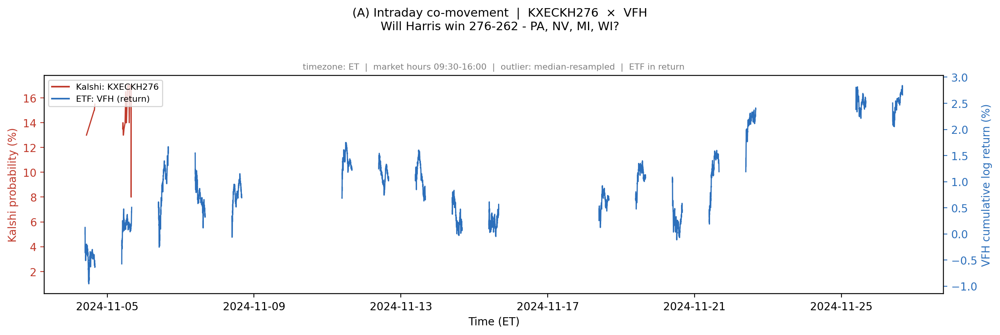
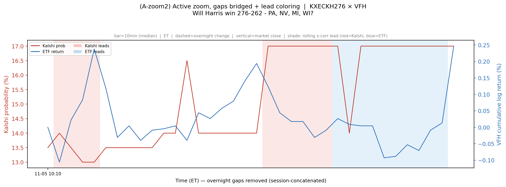
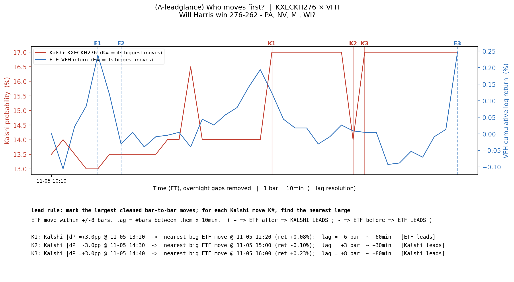
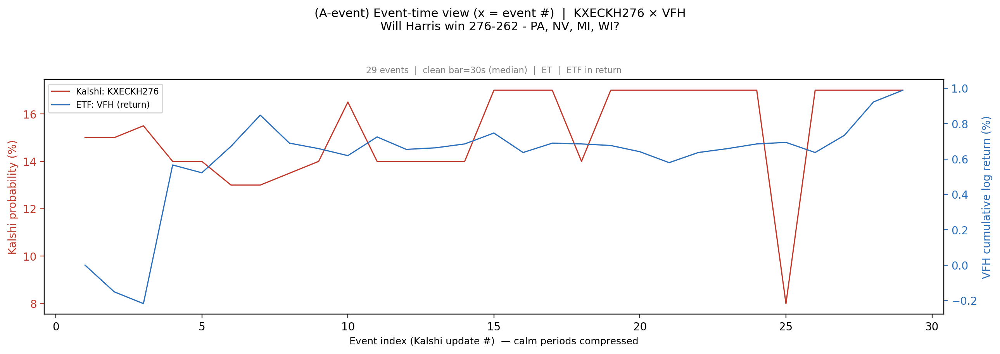
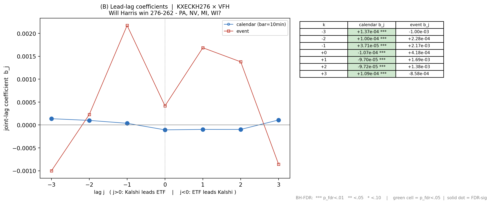

---

## Rank 20/48 — KXECKH276 × VGT  (n_sig=7, best_p=0.0e+00, n_trades=37)

```text
PAIR ANALYSIS    —    Rank 20 / 48
================================================================================================
KXECKH276   x   VGT
Contract : "Will Harris win 276-262 - PA, NV, MI, WI?"
Sector relevance : Election outcome (all sectors)
Window : 2024-11-04 to 2024-11-26     Kalshi trades : 37     primary bar : 10min     daily-screen R^2 : 0.59

>>> RELIABILITY:  Very-low-info   <<<   (see section 5; unreliable pairs still get figures, but read their problems in section 8)

DEFINITIONS
   xₜ₋ₖ = Kalshi yes-probability change, k bars before t   (1 bar = 10min)
   yₜ   = ETF log return over bar t
   calendar = full market-hours grid: x=0 in bars with no Kalshi trade (not dropped).
   k>0 => Kalshi leads ETF ;  k<0 => ETF leads Kalshi ;  k=0 => contemporaneous

1. CALENDAR-TIME REGRESSION (clock-time lags, full RTH grid)
   Full model:  yₜ = α + Σ(k=-3..3) βₖ·xₜ₋ₖ + Σ(d=1..2) γ_d·Day_d
      where  ADL ETF self-lags p=0 (BIC chose none -> no ETF self-lag term);  day-FE: 2 day dummies over 3 trading days (first day = baseline).
      controls counted (so you can see the total at a glance):  7 lead/lag x-terms + 0 ETF self-lag(s) + 2 day-FE dummies + 1 intercept = 10 RHS regressors  (model n_params=10).
   Significant terms (raw p<0.15) expanded:  yₜ = α + β₋₃·xₜ₊₃ + β₋₂·xₜ₊₂ + β₋₁·xₜ₊₁ + β₊₀·xₜ + β₊₁·xₜ₋₁ + β₊₂·xₜ₋₂ + β₊₃·xₜ₋₃
   where:
      β₋₃ = +8.208e-05   (t/z=+2.07, p=3.8e-02, p_fdr=3.8e-02) **   [ETF leads]
      β₋₂ = -1.209e-04   (t/z=-2.81, p=5.0e-03, p_fdr=5.8e-03) ***   [ETF leads]
      β₋₁ = -1.033e-04   (t/z=-7.37, p=1.7e-13, p_fdr=2.9e-13) ***   [ETF leads]
      β₊₀ = -1.310e-04   (t/z=-3.73, p=1.9e-04, p_fdr=2.7e-04) ***   [contemporaneous]
      β₊₁ = -1.712e-04   (t/z=-14.16, p=1.6e-45, p_fdr=5.5e-45) ***   [Kalshi leads]
      β₊₂ = -1.805e-04   (t/z=-341.57, p=0.0e+00, p_fdr=0.0e+00) ***   [Kalshi leads]
      β₊₃ = +5.212e-05   (t/z=+8.39, p=5.0e-17, p_fdr=1.2e-16) ***   [Kalshi leads]
   Lean by count of significant lags: balanced/no clear side  (k>0:3, k<0:3).

2. EVENT-TIME REGRESSION (event-count lags)
   Full model:  yₜ = α + Σ(k=-3..3) βₖ·xₜ₋ₖ + φ₁·yₜ₋₁ + φ₂·yₜ₋₂ + φ₃·yₜ₋₃
      where  ADL ETF self-lags p=3 (BIC-chosen): φ₁·yₜ₋₁ + φ₂·yₜ₋₂ + φ₃·yₜ₋₃;  day-FE: none (single trading day -> clustered SE degrades to HC3).
      controls counted (so you can see the total at a glance):  7 lead/lag x-terms + 3 ETF self-lag(s) + 0 day-FE dummies + 1 intercept = 11 RHS regressors  (model n_params=11).
   -> 7 coefficients tested, NONE significant at raw p<0.15.

3. FULL COEFFICIENT TABLE  (calendar primary bar  vs  event)
      k |       calendar b (FDR) |          event b (FDR)
   ------------------------------------------------------
     -3 |          +8.21e-05 **  |          +6.07e-03    
     -2 |          -1.21e-04 *** |          +7.00e-03    
     -1 |          -1.03e-04 *** |          +7.69e-03    
     +0 |          -1.31e-04 *** |          +4.04e-03    
     +1 |          -1.71e-04 *** |          +1.92e-03    
     +2 |          -1.81e-04 *** |          +9.23e-04    
     +3 |          +5.21e-05 *** |          -4.64e-03    
   (stars = BH-FDR corrected:  *** p_fdr<.01  ** <.05  * <.10)

4. DIRECTIONAL TEST (probit, ETF up/down)
   Model: P(ETFₜ up) = Φ(α + βₖ·xₜ₋ₖ),  one probit per lag k
   calendar: n/a
   event: n/a
   -> no significant directional predictability either mode (raw p<0.15).

5. DATA RELIABILITY (statistical, not a trade-count cutoff)
   Tier: Very-low-info
   (criterion = n_active: bars with an actual Kalshi move (x!=0) = the real sample that identifies the lead-lag. Full RTH grid makes n_obs large, so n_active is the honest size.)
   calendar(full RTH grid): n_active=8  n_obs=59  n_days=3  K=3  params=10  df=49  median_SE=1.40e-05  sig(FDR)=7
   event: n_active=7  n_obs=12  n_days=1  K=3  params=11  df=1  median_SE=3.43e-02  sig(FDR)=0
   => Very low info: even 'significant' coefficients are untrustworthy (huge SE, possibly spurious significance).

6. COARSE-FREQUENCY ROBUSTNESS (re-run calendar at 30min / 60min)
    30min: not estimable (n_obs=11 < minimum) -- coarser bars have even fewer observations
    60min: not estimable (n_obs=6 < minimum) -- coarser bars have even fewer observations

7. VERDICT
   Only one time-axis significant (balanced) -- weak / single-mode evidence.
   (Note: this pair lacks the data to support reliable inference; the verdict above is descriptive only -- do not put it in the conclusions.)

8. FIGURE CAVEATS — figures are still drawn, but know their problems
   - Very low info (only 8 bars with an actual Kalshi move, < 15): even 'significant' coefficients are untrustworthy (huge SE, possibly spurious significance).
   - Most of the chart is flat no-trade lines; only a handful of bars carry real variation, so the lead calls in leadglance/segments are not robust.
   - Mixed coefficient signs across lags -- relationship not monotone.
   - Kalshi updates only on trades (flat line = no trade, NOT 'no change'); ETF mid refreshes continuously.

9. REAL-WORLD CONTEXT (WebSearch-verified; see URLs)
   - 2024 US presidential election held Tue Nov 5, 2024; ballots counted overnight Nov 5-6.
   - AP called the race for Trump ~5:34-5:37 AM ET on Wed Nov 6, 2024 (Wisconsin pushed him past 270) -- this is PRE-MARKET, so the regular-hours equity reaction shows up at the Nov 6 open.
   - Final electoral result: Trump 312, Harris 226.
   - Sources: en.wikipedia.org/wiki/2024_United_States_presidential_election ; spectrumlocalnews.com/us/snplus/news/2024/11/06/trump-wins-ap-projection-2024-election

------------------------------------------------------------------------------------------------
Conventions: ET | 09:30-16:00 (forward windows capped to 16:00) | ETF in log return | median causal bars | full RTH grid | day-grouped lags (no overnight) | ADL self-control | significance = BH-FDR corrected.
Figures for this pair follow on the next page.
```

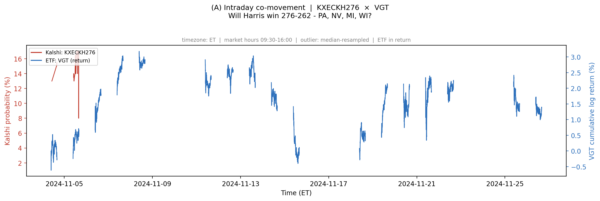
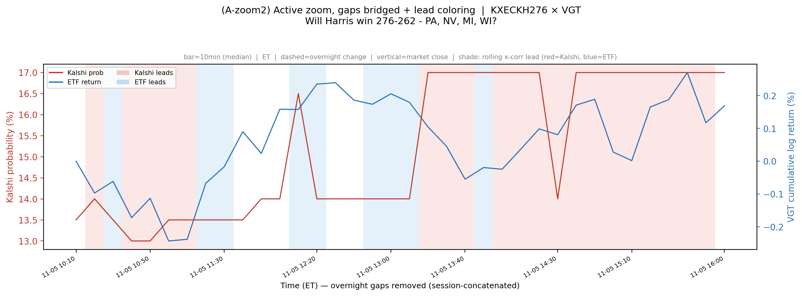
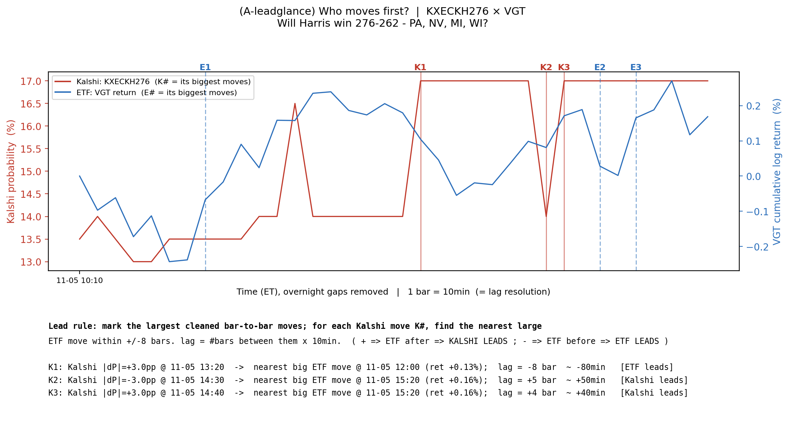
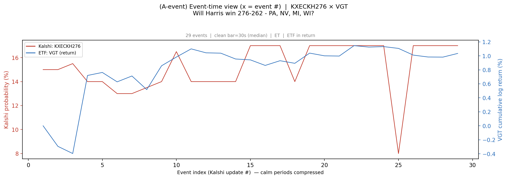
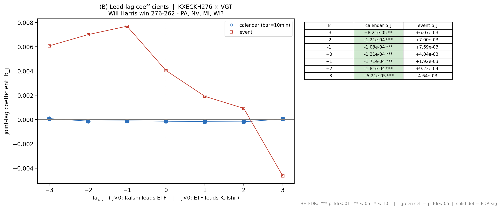

---

## Rank 21/48 — KXECKH276 × VDC  (n_sig=7, best_p=0.0e+00, n_trades=37)

```text
PAIR ANALYSIS    —    Rank 21 / 48
================================================================================================
KXECKH276   x   VDC
Contract : "Will Harris win 276-262 - PA, NV, MI, WI?"
Sector relevance : Election outcome (all sectors)
Window : 2024-11-04 to 2024-11-26     Kalshi trades : 37     primary bar : 10min     daily-screen R^2 : 0.53

>>> RELIABILITY:  Very-low-info   <<<   (see section 5; unreliable pairs still get figures, but read their problems in section 8)

DEFINITIONS
   xₜ₋ₖ = Kalshi yes-probability change, k bars before t   (1 bar = 10min)
   yₜ   = ETF log return over bar t
   calendar = full market-hours grid: x=0 in bars with no Kalshi trade (not dropped).
   k>0 => Kalshi leads ETF ;  k<0 => ETF leads Kalshi ;  k=0 => contemporaneous

1. CALENDAR-TIME REGRESSION (clock-time lags, full RTH grid)
   Full model:  yₜ = α + Σ(k=-3..3) βₖ·xₜ₋ₖ + Σ(d=1..2) γ_d·Day_d
      where  ADL ETF self-lags p=0 (BIC chose none -> no ETF self-lag term);  day-FE: 2 day dummies over 3 trading days (first day = baseline).
      controls counted (so you can see the total at a glance):  7 lead/lag x-terms + 0 ETF self-lag(s) + 2 day-FE dummies + 1 intercept = 10 RHS regressors  (model n_params=10).
   Significant terms (raw p<0.15) expanded:  yₜ = α + β₋₃·xₜ₊₃ + β₋₂·xₜ₊₂ + β₋₁·xₜ₊₁ + β₊₀·xₜ + β₊₁·xₜ₋₁ + β₊₂·xₜ₋₂ + β₊₃·xₜ₋₃
   where:
      β₋₃ = -2.984e-05   (t/z=-4.12, p=3.8e-05, p_fdr=4.4e-05) ***   [ETF leads]
      β₋₂ = -6.707e-05   (t/z=-2.68, p=7.3e-03, p_fdr=7.3e-03) ***   [ETF leads]
      β₋₁ = -1.092e-04   (t/z=-10.24, p=1.3e-24, p_fdr=2.3e-24) ***   [ETF leads]
      β₊₀ = -1.199e-04   (t/z=-4.67, p=3.0e-06, p_fdr=4.3e-06) ***   [contemporaneous]
      β₊₁ = -1.178e-04   (t/z=-11.37, p=6.0e-30, p_fdr=1.4e-29) ***   [Kalshi leads]
      β₊₂ = -6.792e-05   (t/z=-21.59, p=2.1e-103, p_fdr=7.4e-103) ***   [Kalshi leads]
      β₊₃ = +7.161e-05   (t/z=+89.03, p=0.0e+00, p_fdr=0.0e+00) ***   [Kalshi leads]
   Lean by count of significant lags: balanced/no clear side  (k>0:3, k<0:3).

2. EVENT-TIME REGRESSION (event-count lags)
   Full model:  yₜ = α + Σ(k=-3..3) βₖ·xₜ₋ₖ + φ₁·yₜ₋₁ + φ₂·yₜ₋₂ + φ₃·yₜ₋₃
      where  ADL ETF self-lags p=3 (BIC-chosen): φ₁·yₜ₋₁ + φ₂·yₜ₋₂ + φ₃·yₜ₋₃;  day-FE: none (single trading day -> clustered SE degrades to HC3).
      controls counted (so you can see the total at a glance):  7 lead/lag x-terms + 3 ETF self-lag(s) + 0 day-FE dummies + 1 intercept = 11 RHS regressors  (model n_params=11).
   -> 7 coefficients tested, NONE significant at raw p<0.15.

3. FULL COEFFICIENT TABLE  (calendar primary bar  vs  event)
      k |       calendar b (FDR) |          event b (FDR)
   ------------------------------------------------------
     -3 |          -2.98e-05 *** |          +4.03e-04    
     -2 |          -6.71e-05 *** |          +9.02e-04    
     -1 |          -1.09e-04 *** |          +1.23e-03    
     +0 |          -1.20e-04 *** |          +8.58e-04    
     +1 |          -1.18e-04 *** |          +1.07e-03    
     +2 |          -6.79e-05 *** |          +5.34e-04    
     +3 |          +7.16e-05 *** |          -2.61e-04    
   (stars = BH-FDR corrected:  *** p_fdr<.01  ** <.05  * <.10)

4. DIRECTIONAL TEST (probit, ETF up/down)
   Model: P(ETFₜ up) = Φ(α + βₖ·xₜ₋ₖ),  one probit per lag k
   calendar: n/a
   event: n/a
   -> no significant directional predictability either mode (raw p<0.15).

5. DATA RELIABILITY (statistical, not a trade-count cutoff)
   Tier: Very-low-info
   (criterion = n_active: bars with an actual Kalshi move (x!=0) = the real sample that identifies the lead-lag. Full RTH grid makes n_obs large, so n_active is the honest size.)
   calendar(full RTH grid): n_active=8  n_obs=59  n_days=3  K=3  params=10  df=49  median_SE=1.04e-05  sig(FDR)=7
   event: n_active=7  n_obs=12  n_days=1  K=3  params=11  df=1  median_SE=7.35e-03  sig(FDR)=0
   => Very low info: even 'significant' coefficients are untrustworthy (huge SE, possibly spurious significance).

6. COARSE-FREQUENCY ROBUSTNESS (re-run calendar at 30min / 60min)
    30min: not estimable (n_obs=11 < minimum) -- coarser bars have even fewer observations
    60min: not estimable (n_obs=6 < minimum) -- coarser bars have even fewer observations

7. VERDICT
   Only one time-axis significant (balanced) -- weak / single-mode evidence.
   (Note: this pair lacks the data to support reliable inference; the verdict above is descriptive only -- do not put it in the conclusions.)

8. FIGURE CAVEATS — figures are still drawn, but know their problems
   - Very low info (only 8 bars with an actual Kalshi move, < 15): even 'significant' coefficients are untrustworthy (huge SE, possibly spurious significance).
   - Most of the chart is flat no-trade lines; only a handful of bars carry real variation, so the lead calls in leadglance/segments are not robust.
   - Mixed coefficient signs across lags -- relationship not monotone.
   - Kalshi updates only on trades (flat line = no trade, NOT 'no change'); ETF mid refreshes continuously.

9. REAL-WORLD CONTEXT (WebSearch-verified; see URLs)
   - 2024 US presidential election held Tue Nov 5, 2024; ballots counted overnight Nov 5-6.
   - AP called the race for Trump ~5:34-5:37 AM ET on Wed Nov 6, 2024 (Wisconsin pushed him past 270) -- this is PRE-MARKET, so the regular-hours equity reaction shows up at the Nov 6 open.
   - Final electoral result: Trump 312, Harris 226.
   - Sources: en.wikipedia.org/wiki/2024_United_States_presidential_election ; spectrumlocalnews.com/us/snplus/news/2024/11/06/trump-wins-ap-projection-2024-election

------------------------------------------------------------------------------------------------
Conventions: ET | 09:30-16:00 (forward windows capped to 16:00) | ETF in log return | median causal bars | full RTH grid | day-grouped lags (no overnight) | ADL self-control | significance = BH-FDR corrected.
Figures for this pair follow on the next page.
```

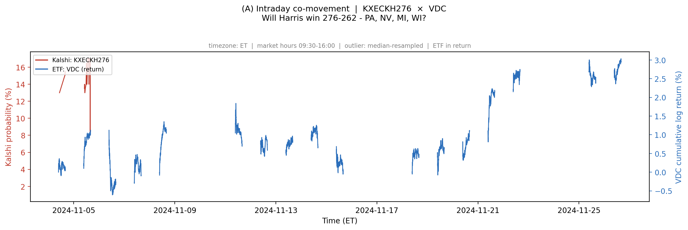
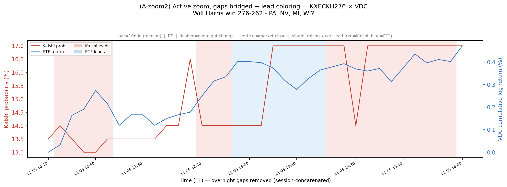
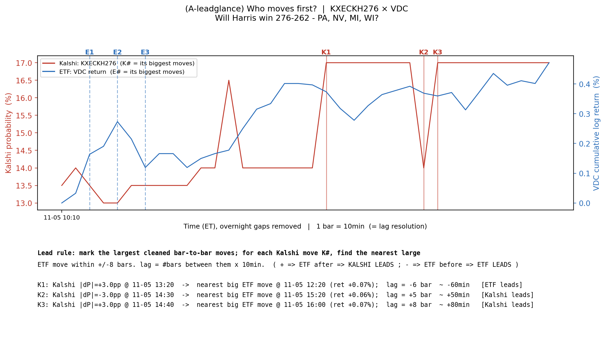
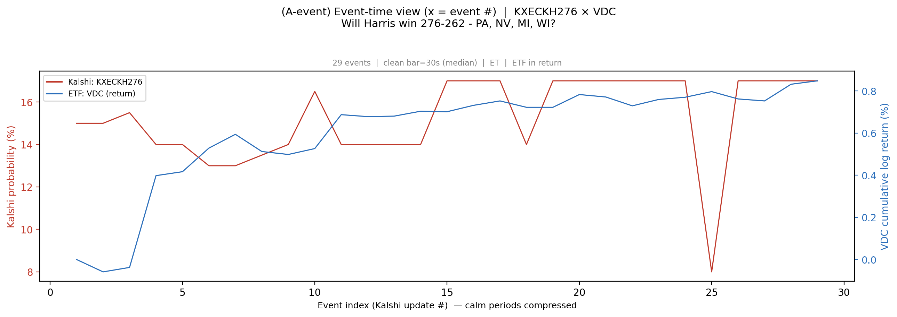
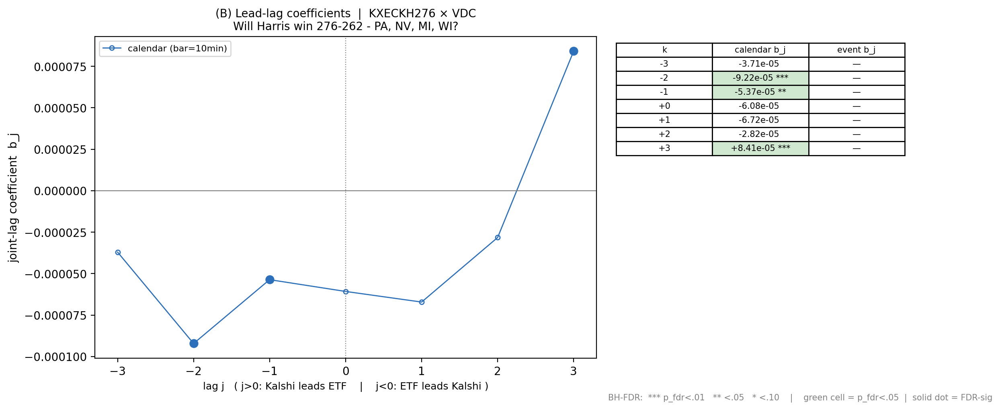

---

## Rank 22/48 — KXECKH276 × VIS  (n_sig=6, best_p=0.0e+00, n_trades=37)

```text
PAIR ANALYSIS    —    Rank 22 / 48
================================================================================================
KXECKH276   x   VIS
Contract : "Will Harris win 276-262 - PA, NV, MI, WI?"
Sector relevance : Election outcome (all sectors)
Window : 2024-11-04 to 2024-11-26     Kalshi trades : 37     primary bar : 10min     daily-screen R^2 : 0.76

>>> RELIABILITY:  Very-low-info   <<<   (see section 5; unreliable pairs still get figures, but read their problems in section 8)

DEFINITIONS
   xₜ₋ₖ = Kalshi yes-probability change, k bars before t   (1 bar = 10min)
   yₜ   = ETF log return over bar t
   calendar = full market-hours grid: x=0 in bars with no Kalshi trade (not dropped).
   k>0 => Kalshi leads ETF ;  k<0 => ETF leads Kalshi ;  k=0 => contemporaneous

1. CALENDAR-TIME REGRESSION (clock-time lags, full RTH grid)
   Full model:  yₜ = α + Σ(k=-3..3) βₖ·xₜ₋ₖ + Σ(d=1..2) γ_d·Day_d
      where  ADL ETF self-lags p=0 (BIC chose none -> no ETF self-lag term);  day-FE: 2 day dummies over 3 trading days (first day = baseline).
      controls counted (so you can see the total at a glance):  7 lead/lag x-terms + 0 ETF self-lag(s) + 2 day-FE dummies + 1 intercept = 10 RHS regressors  (model n_params=10).
   Significant terms (raw p<0.15) expanded:  yₜ = α + β₋₃·xₜ₊₃ + β₋₁·xₜ₊₁ + β₊₀·xₜ + β₊₁·xₜ₋₁ + β₊₂·xₜ₋₂ + β₊₃·xₜ₋₃
   where:
      β₋₃ = +1.090e-04   (t/z=+3.90, p=9.7e-05, p_fdr=1.7e-04) ***   [ETF leads]
      β₋₁ = -1.220e-05   (t/z=-1.81, p=7.0e-02, p_fdr=8.4e-02) *   [ETF leads]
      β₊₀ = -9.181e-05   (t/z=-1.80, p=7.2e-02, p_fdr=8.4e-02) *   [contemporaneous]
      β₊₁ = -1.504e-04   (t/z=-7.07, p=1.6e-12, p_fdr=3.6e-12) ***   [Kalshi leads]
      β₊₂ = -1.047e-04   (t/z=-14.58, p=3.8e-48, p_fdr=1.3e-47) ***   [Kalshi leads]
      β₊₃ = +1.257e-04   (t/z=+269.48, p=0.0e+00, p_fdr=0.0e+00) ***   [Kalshi leads]
   Lean by count of significant lags: Kalshi-leads  (k>0:3, k<0:2).

2. EVENT-TIME REGRESSION (event-count lags)
   Full model:  yₜ = α + Σ(k=-3..3) βₖ·xₜ₋ₖ
      where  ADL ETF self-lags p=0 (BIC chose none -> no ETF self-lag term);  day-FE: none (single trading day -> clustered SE degrades to HC3).
      controls counted (so you can see the total at a glance):  7 lead/lag x-terms + 0 ETF self-lag(s) + 0 day-FE dummies + 1 intercept = 8 RHS regressors  (model n_params=8).
   -> 7 coefficients tested, NONE significant at raw p<0.15.

3. FULL COEFFICIENT TABLE  (calendar primary bar  vs  event)
      k |       calendar b (FDR) |          event b (FDR)
   ------------------------------------------------------
     -3 |          +1.09e-04 *** |          +1.59e-04    
     -2 |          +3.95e-05     |          +2.56e-04    
     -1 |          -1.22e-05 *   |          +5.19e-04    
     +0 |          -9.18e-05 *   |          +5.94e-04    
     +1 |          -1.50e-04 *** |          +4.55e-04    
     +2 |          -1.05e-04 *** |          +5.62e-04    
     +3 |          +1.26e-04 *** |          +2.02e-04    
   (stars = BH-FDR corrected:  *** p_fdr<.01  ** <.05  * <.10)

4. DIRECTIONAL TEST (probit, ETF up/down)
   Model: P(ETFₜ up) = Φ(α + βₖ·xₜ₋ₖ),  one probit per lag k
   calendar: n/a
   event: n/a
   -> no significant directional predictability either mode (raw p<0.15).

5. DATA RELIABILITY (statistical, not a trade-count cutoff)
   Tier: Very-low-info
   (criterion = n_active: bars with an actual Kalshi move (x!=0) = the real sample that identifies the lead-lag. Full RTH grid makes n_obs large, so n_active is the honest size.)
   calendar(full RTH grid): n_active=8  n_obs=59  n_days=3  K=3  params=10  df=49  median_SE=2.13e-05  sig(FDR)=4
   event: n_active=7  n_obs=12  n_days=1  K=3  params=8  df=4  median_SE=5.43e-04  sig(FDR)=0
   => Very low info: even 'significant' coefficients are untrustworthy (huge SE, possibly spurious significance).

6. COARSE-FREQUENCY ROBUSTNESS (re-run calendar at 30min / 60min)
    30min: not estimable (n_obs=11 < minimum) -- coarser bars have even fewer observations
    60min: not estimable (n_obs=6 < minimum) -- coarser bars have even fewer observations

7. VERDICT
   Only one time-axis significant (Kalshi-leads) -- weak / single-mode evidence.
   (Note: this pair lacks the data to support reliable inference; the verdict above is descriptive only -- do not put it in the conclusions.)

8. FIGURE CAVEATS — figures are still drawn, but know their problems
   - Very low info (only 8 bars with an actual Kalshi move, < 15): even 'significant' coefficients are untrustworthy (huge SE, possibly spurious significance).
   - Most of the chart is flat no-trade lines; only a handful of bars carry real variation, so the lead calls in leadglance/segments are not robust.
   - Mixed coefficient signs across lags -- relationship not monotone.
   - Kalshi updates only on trades (flat line = no trade, NOT 'no change'); ETF mid refreshes continuously.

9. REAL-WORLD CONTEXT (WebSearch-verified; see URLs)
   - 2024 US presidential election held Tue Nov 5, 2024; ballots counted overnight Nov 5-6.
   - AP called the race for Trump ~5:34-5:37 AM ET on Wed Nov 6, 2024 (Wisconsin pushed him past 270) -- this is PRE-MARKET, so the regular-hours equity reaction shows up at the Nov 6 open.
   - Final electoral result: Trump 312, Harris 226.
   - Sources: en.wikipedia.org/wiki/2024_United_States_presidential_election ; spectrumlocalnews.com/us/snplus/news/2024/11/06/trump-wins-ap-projection-2024-election

------------------------------------------------------------------------------------------------
Conventions: ET | 09:30-16:00 (forward windows capped to 16:00) | ETF in log return | median causal bars | full RTH grid | day-grouped lags (no overnight) | ADL self-control | significance = BH-FDR corrected.
Figures for this pair follow on the next page.
```

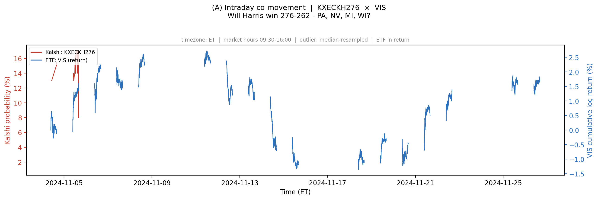
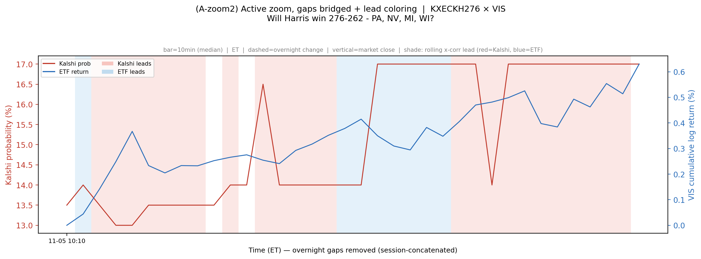
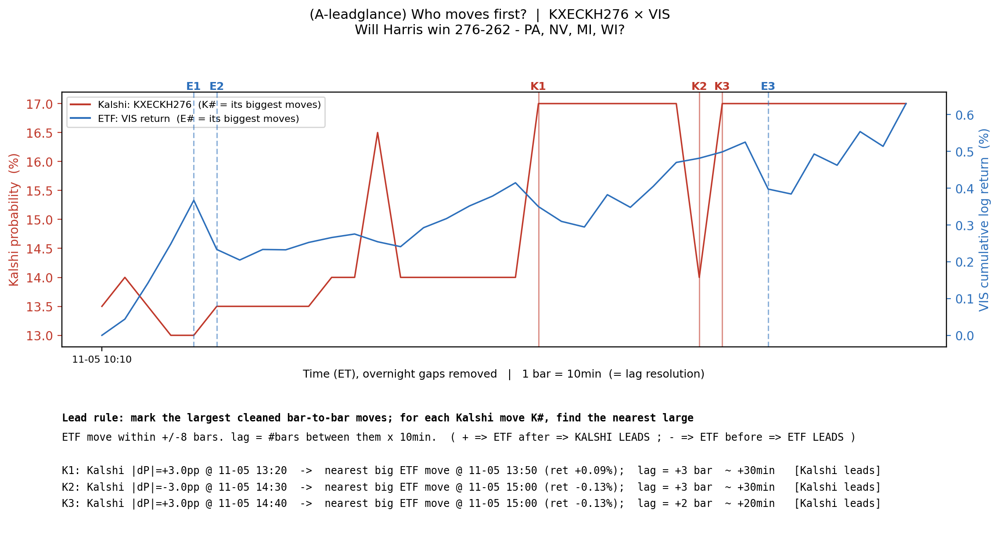
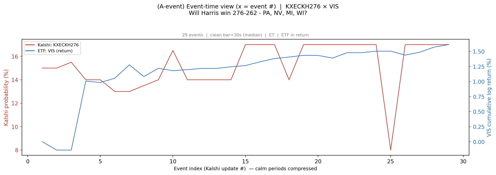
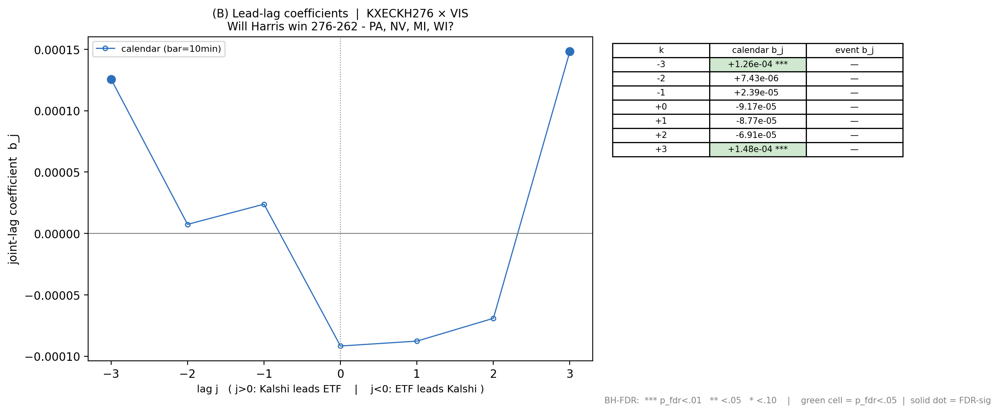

---

## Rank 23/48 — KXECKH276 × VCR  (n_sig=6, best_p=8.6e-13, n_trades=37)

```text
PAIR ANALYSIS    —    Rank 23 / 48
================================================================================================
KXECKH276   x   VCR
Contract : "Will Harris win 276-262 - PA, NV, MI, WI?"
Sector relevance : Election outcome (all sectors)
Window : 2024-11-04 to 2024-11-26     Kalshi trades : 37     primary bar : 10min     daily-screen R^2 : 0.65

>>> RELIABILITY:  Very-low-info   <<<   (see section 5; unreliable pairs still get figures, but read their problems in section 8)

DEFINITIONS
   xₜ₋ₖ = Kalshi yes-probability change, k bars before t   (1 bar = 10min)
   yₜ   = ETF log return over bar t
   calendar = full market-hours grid: x=0 in bars with no Kalshi trade (not dropped).
   k>0 => Kalshi leads ETF ;  k<0 => ETF leads Kalshi ;  k=0 => contemporaneous

1. CALENDAR-TIME REGRESSION (clock-time lags, full RTH grid)
   Full model:  yₜ = α + Σ(k=-3..3) βₖ·xₜ₋ₖ + Σ(d=1..2) γ_d·Day_d
      where  ADL ETF self-lags p=0 (BIC chose none -> no ETF self-lag term);  day-FE: 2 day dummies over 3 trading days (first day = baseline).
      controls counted (so you can see the total at a glance):  7 lead/lag x-terms + 0 ETF self-lag(s) + 2 day-FE dummies + 1 intercept = 10 RHS regressors  (model n_params=10).
   Significant terms (raw p<0.15) expanded:  yₜ = α + β₋₃·xₜ₊₃ + β₋₂·xₜ₊₂ + β₋₁·xₜ₊₁ + β₊₁·xₜ₋₁ + β₊₂·xₜ₋₂ + β₊₃·xₜ₋₃
   where:
      β₋₃ = +7.066e-05   (t/z=+3.28, p=1.0e-03, p_fdr=2.4e-03) ***   [ETF leads]
      β₋₂ = +1.622e-05   (t/z=+1.93, p=5.4e-02, p_fdr=6.3e-02) *   [ETF leads]
      β₋₁ = -1.135e-04   (t/z=-4.18, p=3.0e-05, p_fdr=1.0e-04) ***   [ETF leads]
      β₊₁ = -1.581e-04   (t/z=-2.84, p=4.5e-03, p_fdr=8.0e-03) ***   [Kalshi leads]
      β₊₂ = -2.147e-04   (t/z=-7.41, p=1.2e-13, p_fdr=8.6e-13) ***   [Kalshi leads]
      β₊₃ = +4.916e-05   (t/z=+2.37, p=1.8e-02, p_fdr=2.5e-02) **   [Kalshi leads]
   Lean by count of significant lags: balanced/no clear side  (k>0:3, k<0:3).

2. EVENT-TIME REGRESSION (event-count lags)
   Full model:  yₜ = α + Σ(k=-3..3) βₖ·xₜ₋ₖ + φ₁·yₜ₋₁ + φ₂·yₜ₋₂ + φ₃·yₜ₋₃
      where  ADL ETF self-lags p=3 (BIC-chosen): φ₁·yₜ₋₁ + φ₂·yₜ₋₂ + φ₃·yₜ₋₃;  day-FE: none (single trading day -> clustered SE degrades to HC3).
      controls counted (so you can see the total at a glance):  7 lead/lag x-terms + 3 ETF self-lag(s) + 0 day-FE dummies + 1 intercept = 11 RHS regressors  (model n_params=11).
   -> 7 coefficients tested, NONE significant at raw p<0.15.

3. FULL COEFFICIENT TABLE  (calendar primary bar  vs  event)
      k |       calendar b (FDR) |          event b (FDR)
   ------------------------------------------------------
     -3 |          +7.07e-05 *** |          +2.95e-03    
     -2 |          +1.62e-05 *   |          +2.43e-03    
     -1 |          -1.13e-04 *** |          +3.37e-03    
     +0 |          -1.54e-04     |          +2.85e-04    
     +1 |          -1.58e-04 *** |          +2.30e-04    
     +2 |          -2.15e-04 *** |          +8.44e-04    
     +3 |          +4.92e-05 **  |          -3.66e-03    
   (stars = BH-FDR corrected:  *** p_fdr<.01  ** <.05  * <.10)

4. DIRECTIONAL TEST (probit, ETF up/down)
   Model: P(ETFₜ up) = Φ(α + βₖ·xₜ₋ₖ),  one probit per lag k
   calendar: n/a
   event: n/a
   -> no significant directional predictability either mode (raw p<0.15).

5. DATA RELIABILITY (statistical, not a trade-count cutoff)
   Tier: Very-low-info
   (criterion = n_active: bars with an actual Kalshi move (x!=0) = the real sample that identifies the lead-lag. Full RTH grid makes n_obs large, so n_active is the honest size.)
   calendar(full RTH grid): n_active=8  n_obs=59  n_days=3  K=3  params=10  df=49  median_SE=2.72e-05  sig(FDR)=5
   event: n_active=7  n_obs=12  n_days=1  K=3  params=11  df=1  median_SE=1.16e-02  sig(FDR)=0
   => Very low info: even 'significant' coefficients are untrustworthy (huge SE, possibly spurious significance).

6. COARSE-FREQUENCY ROBUSTNESS (re-run calendar at 30min / 60min)
    30min: not estimable (n_obs=11 < minimum) -- coarser bars have even fewer observations
    60min: not estimable (n_obs=6 < minimum) -- coarser bars have even fewer observations

7. VERDICT
   Only one time-axis significant (balanced) -- weak / single-mode evidence.
   (Note: this pair lacks the data to support reliable inference; the verdict above is descriptive only -- do not put it in the conclusions.)

8. FIGURE CAVEATS — figures are still drawn, but know their problems
   - Very low info (only 8 bars with an actual Kalshi move, < 15): even 'significant' coefficients are untrustworthy (huge SE, possibly spurious significance).
   - Most of the chart is flat no-trade lines; only a handful of bars carry real variation, so the lead calls in leadglance/segments are not robust.
   - Mixed coefficient signs across lags -- relationship not monotone.
   - Kalshi updates only on trades (flat line = no trade, NOT 'no change'); ETF mid refreshes continuously.

9. REAL-WORLD CONTEXT (WebSearch-verified; see URLs)
   - 2024 US presidential election held Tue Nov 5, 2024; ballots counted overnight Nov 5-6.
   - AP called the race for Trump ~5:34-5:37 AM ET on Wed Nov 6, 2024 (Wisconsin pushed him past 270) -- this is PRE-MARKET, so the regular-hours equity reaction shows up at the Nov 6 open.
   - Final electoral result: Trump 312, Harris 226.
   - Sources: en.wikipedia.org/wiki/2024_United_States_presidential_election ; spectrumlocalnews.com/us/snplus/news/2024/11/06/trump-wins-ap-projection-2024-election

------------------------------------------------------------------------------------------------
Conventions: ET | 09:30-16:00 (forward windows capped to 16:00) | ETF in log return | median causal bars | full RTH grid | day-grouped lags (no overnight) | ADL self-control | significance = BH-FDR corrected.
Figures for this pair follow on the next page.
```

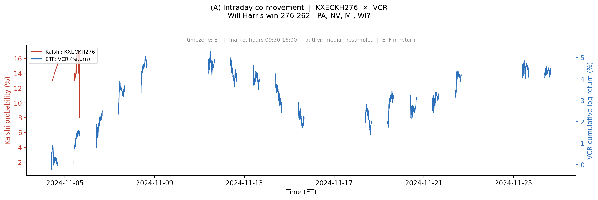
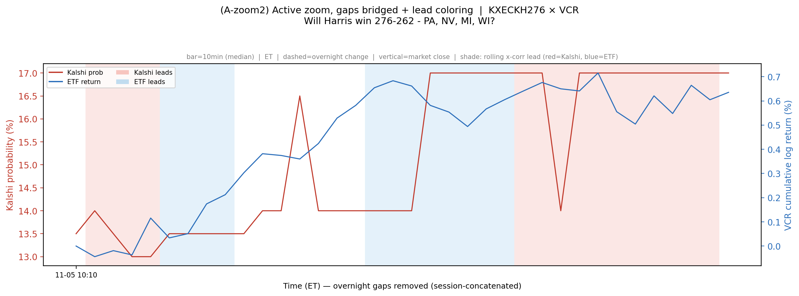
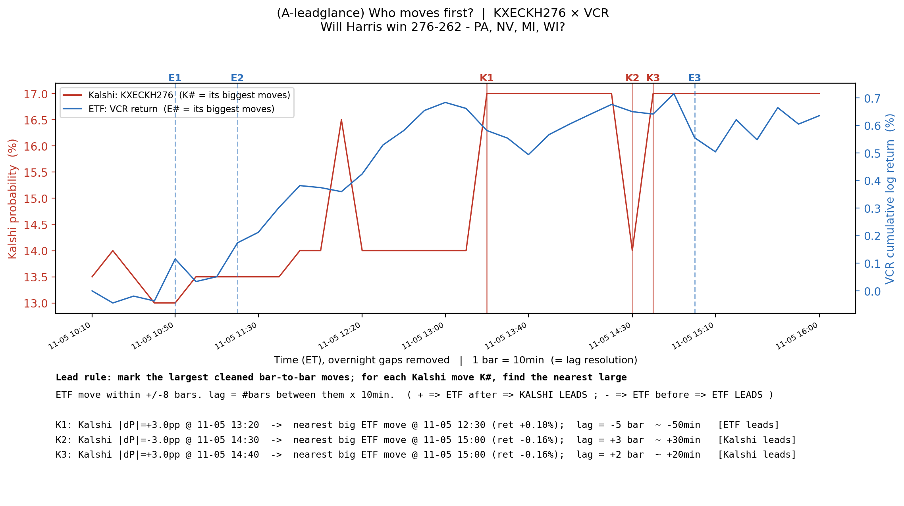
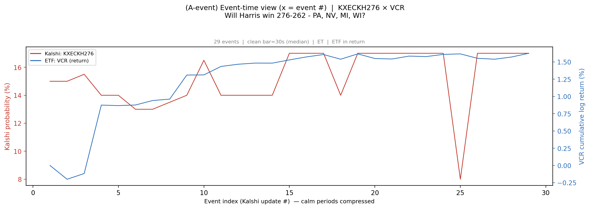
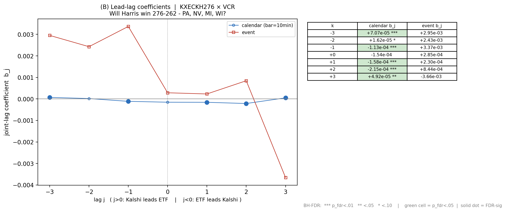

---

## Rank 24/48 — KXECKH276 × VAW  (n_sig=3, best_p=0.0e+00, n_trades=37)

```text
PAIR ANALYSIS    —    Rank 24 / 48
================================================================================================
KXECKH276   x   VAW
Contract : "Will Harris win 276-262 - PA, NV, MI, WI?"
Sector relevance : Election outcome (all sectors)
Window : 2024-11-04 to 2024-11-26     Kalshi trades : 37     primary bar : 10min     daily-screen R^2 : 0.44

>>> RELIABILITY:  Very-low-info   <<<   (see section 5; unreliable pairs still get figures, but read their problems in section 8)

DEFINITIONS
   xₜ₋ₖ = Kalshi yes-probability change, k bars before t   (1 bar = 10min)
   yₜ   = ETF log return over bar t
   calendar = full market-hours grid: x=0 in bars with no Kalshi trade (not dropped).
   k>0 => Kalshi leads ETF ;  k<0 => ETF leads Kalshi ;  k=0 => contemporaneous

1. CALENDAR-TIME REGRESSION (clock-time lags, full RTH grid)
   Full model:  yₜ = α + Σ(k=-3..3) βₖ·xₜ₋ₖ + φ₁·yₜ₋₁ + Σ(d=1..2) γ_d·Day_d
      where  ADL ETF self-lags p=1 (BIC-chosen): φ₁·yₜ₋₁;  day-FE: 2 day dummies over 3 trading days (first day = baseline).
      controls counted (so you can see the total at a glance):  7 lead/lag x-terms + 1 ETF self-lag(s) + 2 day-FE dummies + 1 intercept = 11 RHS regressors  (model n_params=11).
   Significant terms (raw p<0.15) expanded:  yₜ = α + β₋₃·xₜ₊₃ + β₋₂·xₜ₊₂ + β₊₃·xₜ₋₃
   where:
      β₋₃ = +6.261e-05   (t/z=+245.83, p=0.0e+00, p_fdr=0.0e+00) ***   [ETF leads]
      β₋₂ = +7.636e-05   (t/z=+15.08, p=2.1e-51, p_fdr=7.4e-51) ***   [ETF leads]
      β₊₃ = +1.616e-04   (t/z=+5.47, p=4.6e-08, p_fdr=1.1e-07) ***   [Kalshi leads]
   Lean by count of significant lags: ETF-leads  (k>0:1, k<0:2).

2. EVENT-TIME REGRESSION (event-count lags)
   Full model:  yₜ = α + Σ(k=-3..3) βₖ·xₜ₋ₖ + φ₁·yₜ₋₁ + φ₂·yₜ₋₂ + φ₃·yₜ₋₃
      where  ADL ETF self-lags p=3 (BIC-chosen): φ₁·yₜ₋₁ + φ₂·yₜ₋₂ + φ₃·yₜ₋₃;  day-FE: none (single trading day -> clustered SE degrades to HC3).
      controls counted (so you can see the total at a glance):  7 lead/lag x-terms + 3 ETF self-lag(s) + 0 day-FE dummies + 1 intercept = 11 RHS regressors  (model n_params=11).
   -> 7 coefficients tested, NONE significant at raw p<0.15.

3. FULL COEFFICIENT TABLE  (calendar primary bar  vs  event)
      k |       calendar b (FDR) |          event b (FDR)
   ------------------------------------------------------
     -3 |          +6.26e-05 *** |          -2.63e-04    
     -2 |          +7.64e-05 *** |          +7.74e-06    
     -1 |          +3.30e-05     |          +1.23e-04    
     +0 |          -3.19e-05     |          +2.20e-04    
     +1 |          -5.24e-05     |          +1.92e-04    
     +2 |          +4.33e-05     |          +1.91e-04    
     +3 |          +1.62e-04 *** |          +2.49e-04    
   (stars = BH-FDR corrected:  *** p_fdr<.01  ** <.05  * <.10)

4. DIRECTIONAL TEST (probit, ETF up/down)
   Model: P(ETFₜ up) = Φ(α + βₖ·xₜ₋ₖ),  one probit per lag k
   calendar: n/a
   event: n/a
   -> no significant directional predictability either mode (raw p<0.15).

5. DATA RELIABILITY (statistical, not a trade-count cutoff)
   Tier: Very-low-info
   (criterion = n_active: bars with an actual Kalshi move (x!=0) = the real sample that identifies the lead-lag. Full RTH grid makes n_obs large, so n_active is the honest size.)
   calendar(full RTH grid): n_active=8  n_obs=59  n_days=3  K=3  params=11  df=48  median_SE=4.73e-05  sig(FDR)=3
   event: n_active=7  n_obs=12  n_days=1  K=3  params=11  df=1  median_SE=3.46e-02  sig(FDR)=0
   => Very low info: even 'significant' coefficients are untrustworthy (huge SE, possibly spurious significance).

6. COARSE-FREQUENCY ROBUSTNESS (re-run calendar at 30min / 60min)
    30min: not estimable (n_obs=11 < minimum) -- coarser bars have even fewer observations
    60min: not estimable (n_obs=6 < minimum) -- coarser bars have even fewer observations

7. VERDICT
   Only one time-axis significant (ETF-leads) -- weak / single-mode evidence.
   (Note: this pair lacks the data to support reliable inference; the verdict above is descriptive only -- do not put it in the conclusions.)

8. FIGURE CAVEATS — figures are still drawn, but know their problems
   - Very low info (only 8 bars with an actual Kalshi move, < 15): even 'significant' coefficients are untrustworthy (huge SE, possibly spurious significance).
   - Most of the chart is flat no-trade lines; only a handful of bars carry real variation, so the lead calls in leadglance/segments are not robust.
   - Kalshi updates only on trades (flat line = no trade, NOT 'no change'); ETF mid refreshes continuously.

9. REAL-WORLD CONTEXT (WebSearch-verified; see URLs)
   - 2024 US presidential election held Tue Nov 5, 2024; ballots counted overnight Nov 5-6.
   - AP called the race for Trump ~5:34-5:37 AM ET on Wed Nov 6, 2024 (Wisconsin pushed him past 270) -- this is PRE-MARKET, so the regular-hours equity reaction shows up at the Nov 6 open.
   - Final electoral result: Trump 312, Harris 226.
   - Sources: en.wikipedia.org/wiki/2024_United_States_presidential_election ; spectrumlocalnews.com/us/snplus/news/2024/11/06/trump-wins-ap-projection-2024-election

------------------------------------------------------------------------------------------------
Conventions: ET | 09:30-16:00 (forward windows capped to 16:00) | ETF in log return | median causal bars | full RTH grid | day-grouped lags (no overnight) | ADL self-control | significance = BH-FDR corrected.
Figures for this pair follow on the next page.
```

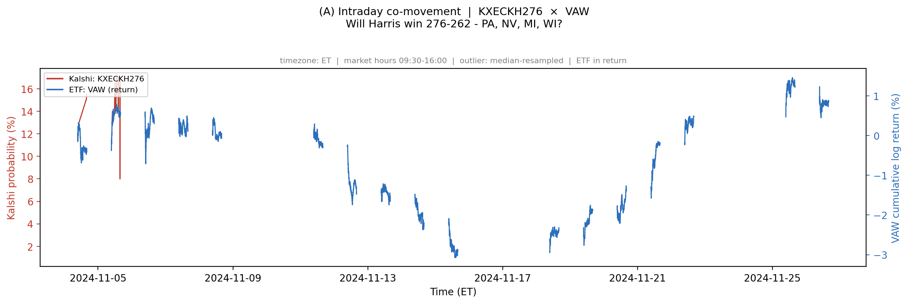
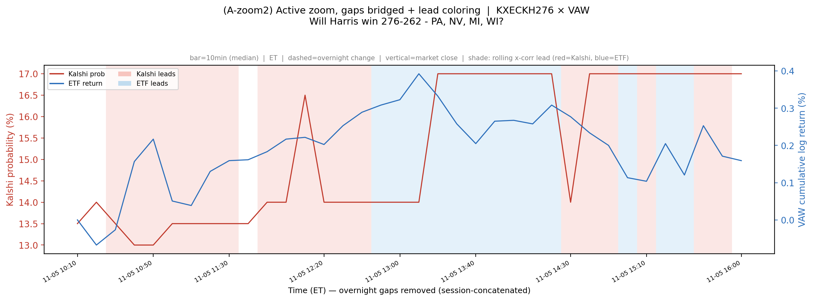
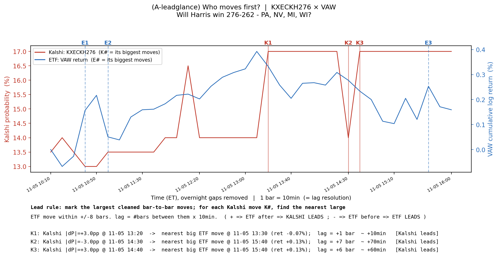
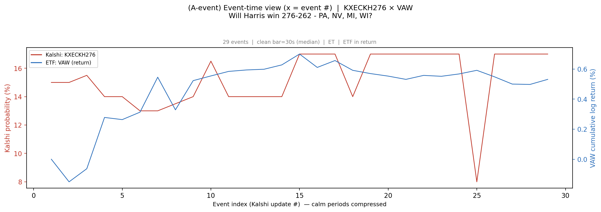
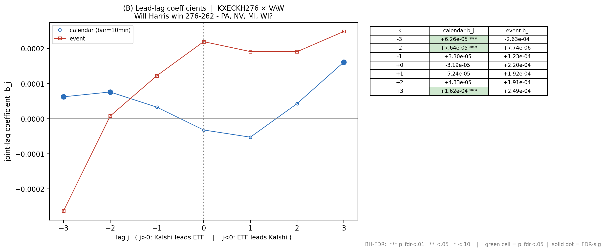

---

## Rank 25/48 — KXECKH276 × VDE  (n_sig=1, best_p=4.8e-03, n_trades=37)

```text
PAIR ANALYSIS    —    Rank 25 / 48
================================================================================================
KXECKH276   x   VDE
Contract : "Will Harris win 276-262 - PA, NV, MI, WI?"
Sector relevance : Election outcome (all sectors)
Window : 2024-11-04 to 2024-11-26     Kalshi trades : 37     primary bar : 10min     daily-screen R^2 : 0.63

>>> RELIABILITY:  Very-low-info   <<<   (see section 5; unreliable pairs still get figures, but read their problems in section 8)

DEFINITIONS
   xₜ₋ₖ = Kalshi yes-probability change, k bars before t   (1 bar = 10min)
   yₜ   = ETF log return over bar t
   calendar = full market-hours grid: x=0 in bars with no Kalshi trade (not dropped).
   k>0 => Kalshi leads ETF ;  k<0 => ETF leads Kalshi ;  k=0 => contemporaneous

1. CALENDAR-TIME REGRESSION (clock-time lags, full RTH grid)
   Full model:  yₜ = α + Σ(k=-3..3) βₖ·xₜ₋ₖ + Σ(d=1..2) γ_d·Day_d
      where  ADL ETF self-lags p=0 (BIC chose none -> no ETF self-lag term);  day-FE: 2 day dummies over 3 trading days (first day = baseline).
      controls counted (so you can see the total at a glance):  7 lead/lag x-terms + 0 ETF self-lag(s) + 2 day-FE dummies + 1 intercept = 10 RHS regressors  (model n_params=10).
   Significant terms (raw p<0.15) expanded:  yₜ = α + β₊₂·xₜ₋₂
   where:
      β₊₂ = -2.152e-04   (t/z=-3.40, p=6.9e-04, p_fdr=4.8e-03) ***   [Kalshi leads]
   Lean by count of significant lags: Kalshi-leads  (k>0:1, k<0:0).

2. EVENT-TIME REGRESSION (event-count lags)
   Full model:  yₜ = α + Σ(k=-3..3) βₖ·xₜ₋ₖ + φ₁·yₜ₋₁ + φ₂·yₜ₋₂ + φ₃·yₜ₋₃
      where  ADL ETF self-lags p=3 (BIC-chosen): φ₁·yₜ₋₁ + φ₂·yₜ₋₂ + φ₃·yₜ₋₃;  day-FE: none (single trading day -> clustered SE degrades to HC3).
      controls counted (so you can see the total at a glance):  7 lead/lag x-terms + 3 ETF self-lag(s) + 0 day-FE dummies + 1 intercept = 11 RHS regressors  (model n_params=11).
   -> 7 coefficients tested, NONE significant at raw p<0.15.

3. FULL COEFFICIENT TABLE  (calendar primary bar  vs  event)
      k |       calendar b (FDR) |          event b (FDR)
   ------------------------------------------------------
     -3 |          -2.86e-05     |          -5.00e-03    
     -2 |          -1.74e-04     |          -6.66e-03    
     -1 |          -1.37e-04     |          -9.14e-03    
     +0 |          -2.99e-05     |          -9.41e-03    
     +1 |          -4.62e-05     |          -7.12e-03    
     +2 |          -2.15e-04 *** |          -5.12e-03    
     +3 |          -5.20e-05     |          +1.47e-03    
   (stars = BH-FDR corrected:  *** p_fdr<.01  ** <.05  * <.10)

4. DIRECTIONAL TEST (probit, ETF up/down)
   Model: P(ETFₜ up) = Φ(α + βₖ·xₜ₋ₖ),  one probit per lag k
   calendar: n/a
   event: n/a
   -> no significant directional predictability either mode (raw p<0.15).

5. DATA RELIABILITY (statistical, not a trade-count cutoff)
   Tier: Very-low-info
   (criterion = n_active: bars with an actual Kalshi move (x!=0) = the real sample that identifies the lead-lag. Full RTH grid makes n_obs large, so n_active is the honest size.)
   calendar(full RTH grid): n_active=8  n_obs=59  n_days=3  K=3  params=10  df=49  median_SE=8.95e-05  sig(FDR)=1
   event: n_active=7  n_obs=12  n_days=1  K=3  params=11  df=1  median_SE=1.78e-02  sig(FDR)=0
   => Very low info: even 'significant' coefficients are untrustworthy (huge SE, possibly spurious significance).

6. COARSE-FREQUENCY ROBUSTNESS (re-run calendar at 30min / 60min)
    30min: not estimable (n_obs=11 < minimum) -- coarser bars have even fewer observations
    60min: not estimable (n_obs=6 < minimum) -- coarser bars have even fewer observations

7. VERDICT
   Only one time-axis significant (Kalshi-leads) -- weak / single-mode evidence.
   (Note: this pair lacks the data to support reliable inference; the verdict above is descriptive only -- do not put it in the conclusions.)

8. FIGURE CAVEATS — figures are still drawn, but know their problems
   - Very low info (only 8 bars with an actual Kalshi move, < 15): even 'significant' coefficients are untrustworthy (huge SE, possibly spurious significance).
   - Most of the chart is flat no-trade lines; only a handful of bars carry real variation, so the lead calls in leadglance/segments are not robust.
   - Kalshi updates only on trades (flat line = no trade, NOT 'no change'); ETF mid refreshes continuously.

9. REAL-WORLD CONTEXT (WebSearch-verified; see URLs)
   - 2024 US presidential election held Tue Nov 5, 2024; ballots counted overnight Nov 5-6.
   - AP called the race for Trump ~5:34-5:37 AM ET on Wed Nov 6, 2024 (Wisconsin pushed him past 270) -- this is PRE-MARKET, so the regular-hours equity reaction shows up at the Nov 6 open.
   - Final electoral result: Trump 312, Harris 226.
   - Sources: en.wikipedia.org/wiki/2024_United_States_presidential_election ; spectrumlocalnews.com/us/snplus/news/2024/11/06/trump-wins-ap-projection-2024-election

------------------------------------------------------------------------------------------------
Conventions: ET | 09:30-16:00 (forward windows capped to 16:00) | ETF in log return | median causal bars | full RTH grid | day-grouped lags (no overnight) | ADL self-control | significance = BH-FDR corrected.
Figures for this pair follow on the next page.
```

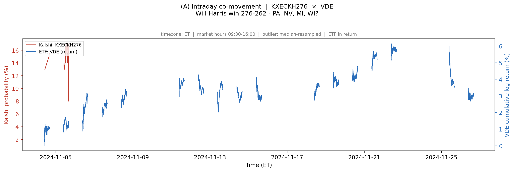
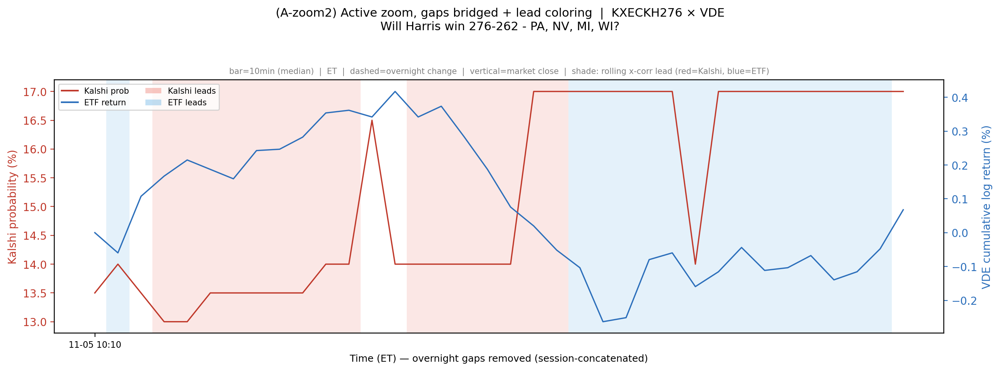
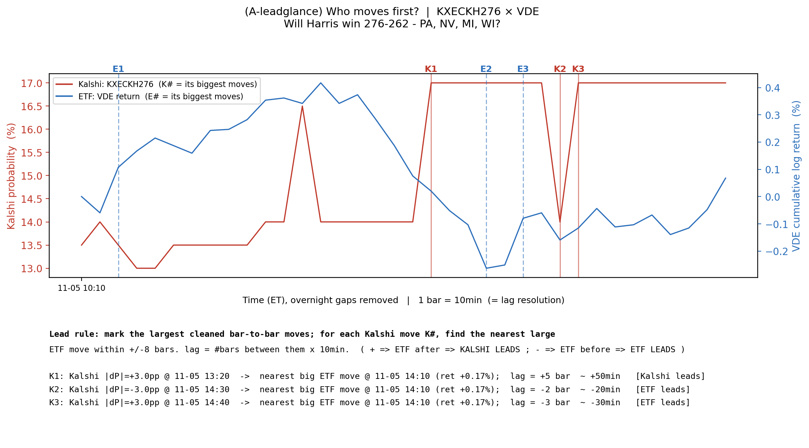
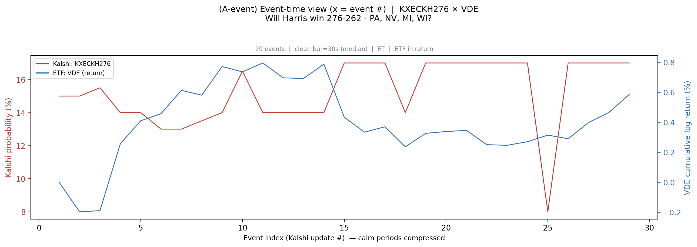
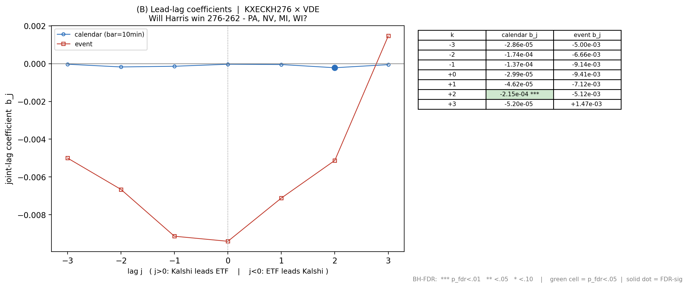

---

## Rank 26/48 — KX538APPROVEMIN-24NOV30-T37 × VFH  (n_sig=0, best_p=n/a, n_trades=49)  (no regression result)

```text
PAIR ANALYSIS    —    Rank 26 / 48
================================================================================================
KX538APPROVEMIN-24NOV30-T37   x   VFH
Contract : "Will the President's approval rating ever get below 37% by Nov 30, 2024?"
Sector relevance : Election outcome (all sectors)
Window : 2024-11-04 to 2024-11-29     Kalshi trades : 49     primary bar : n/a     daily-screen R^2 : 0.40

>>> RELIABILITY:  Cannot-estimate   <<<   (see section 5; unreliable pairs still get figures, but read their problems in section 8)

DEFINITIONS
   xₜ₋ₖ = Kalshi yes-probability change, k bars before t   (1 bar = n/a)
   yₜ   = ETF log return over bar t
   calendar = full market-hours grid: x=0 in bars with no Kalshi trade (not dropped).
   k>0 => Kalshi leads ETF ;  k<0 => ETF leads Kalshi ;  k=0 => contemporaneous

1. CALENDAR-TIME REGRESSION (clock-time lags, full RTH grid)
   Full model:  yₜ = α + Σ(k) βₖ·xₜ₋ₖ + (ADL self-lags) + (day fixed effects)
   -> no regression result (insufficient data).

2. EVENT-TIME REGRESSION (event-count lags)
   Full model:  yₜ = α + Σ(k) βₖ·xₜ₋ₖ + (ADL self-lags) + (day fixed effects)
   -> no regression result (insufficient data).

3. FULL COEFFICIENT TABLE  (calendar primary bar  vs  event)
   (no coefficients in either mode)

4. DIRECTIONAL TEST (probit, ETF up/down)
   Model: P(ETFₜ up) = Φ(α + βₖ·xₜ₋ₖ),  one probit per lag k
   calendar: n/a
   event: n/a
   -> no significant directional predictability either mode (raw p<0.15).

5. DATA RELIABILITY (statistical, not a trade-count cutoff)
   Tier: Cannot-estimate
   (criterion = n_active: bars with an actual Kalshi move (x!=0) = the real sample that identifies the lead-lag. Full RTH grid makes n_obs large, so n_active is the honest size.)
   calendar(full RTH grid): not estimable (insufficient data)
   event: not estimable (insufficient data)
   => Neither axis is estimable: this pair has descriptive figures only, no reliable regression result.

6. COARSE-FREQUENCY ROBUSTNESS (re-run calendar at 30min / 60min)
    30min: not estimable (n_obs=10 < minimum) -- coarser bars have even fewer observations
    60min: not estimable (n_obs=8 < minimum) -- coarser bars have even fewer observations

7. VERDICT
   No lead-lag detected -- too sparse / no significant structure.
   (Note: this pair lacks the data to support reliable inference; the verdict above is descriptive only -- do not put it in the conclusions.)

8. FIGURE CAVEATS — figures are still drawn, but know their problems
   - Regression cannot be estimated: the lag-coefficient plot (B) shows 'no regression result'; only the time-series / zoom plots are descriptive.
   - Long flat Kalshi segments = NO TRADE in that span (not 'probability unchanged'); do not read lead direction from them.
   - Too few active bars: the red/blue lead shading in zoom2/segments and the K#/E# pairing in leadglance are illustrative only, with no statistical meaning.
   - Kalshi updates only on trades (flat line = no trade, NOT 'no change'); ETF mid refreshes continuously.

------------------------------------------------------------------------------------------------
Conventions: ET | 09:30-16:00 (forward windows capped to 16:00) | ETF in log return | median causal bars | full RTH grid | day-grouped lags (no overnight) | ADL self-control | significance = BH-FDR corrected.
Figures for this pair follow on the next page.
```

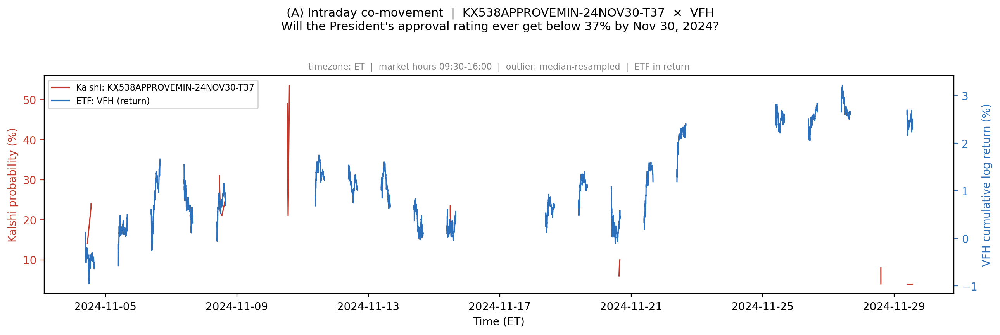
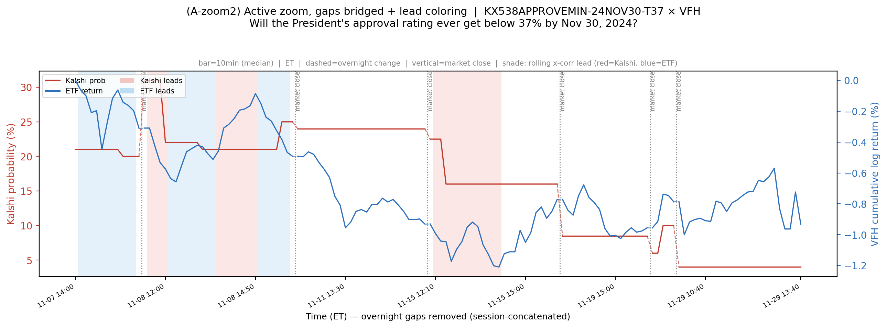
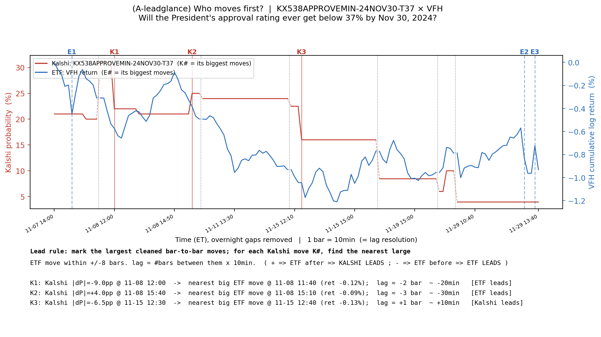
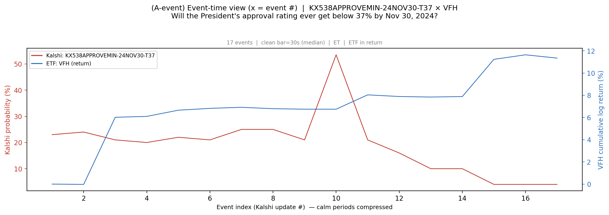


---

## Rank 27/48 — KX538APPROVEMIN-24NOV30-T37 × VNQ  (n_sig=0, best_p=n/a, n_trades=49)  (no regression result)

```text
PAIR ANALYSIS    —    Rank 27 / 48
================================================================================================
KX538APPROVEMIN-24NOV30-T37   x   VNQ
Contract : "Will the President's approval rating ever get below 37% by Nov 30, 2024?"
Sector relevance : Election outcome (all sectors)
Window : 2024-11-04 to 2024-11-29     Kalshi trades : 49     primary bar : n/a     daily-screen R^2 : 0.32

>>> RELIABILITY:  Cannot-estimate   <<<   (see section 5; unreliable pairs still get figures, but read their problems in section 8)

DEFINITIONS
   xₜ₋ₖ = Kalshi yes-probability change, k bars before t   (1 bar = n/a)
   yₜ   = ETF log return over bar t
   calendar = full market-hours grid: x=0 in bars with no Kalshi trade (not dropped).
   k>0 => Kalshi leads ETF ;  k<0 => ETF leads Kalshi ;  k=0 => contemporaneous

1. CALENDAR-TIME REGRESSION (clock-time lags, full RTH grid)
   Full model:  yₜ = α + Σ(k) βₖ·xₜ₋ₖ + (ADL self-lags) + (day fixed effects)
   -> no regression result (insufficient data).

2. EVENT-TIME REGRESSION (event-count lags)
   Full model:  yₜ = α + Σ(k) βₖ·xₜ₋ₖ + (ADL self-lags) + (day fixed effects)
   -> no regression result (insufficient data).

3. FULL COEFFICIENT TABLE  (calendar primary bar  vs  event)
   (no coefficients in either mode)

4. DIRECTIONAL TEST (probit, ETF up/down)
   Model: P(ETFₜ up) = Φ(α + βₖ·xₜ₋ₖ),  one probit per lag k
   calendar: n/a
   event: n/a
   -> no significant directional predictability either mode (raw p<0.15).

5. DATA RELIABILITY (statistical, not a trade-count cutoff)
   Tier: Cannot-estimate
   (criterion = n_active: bars with an actual Kalshi move (x!=0) = the real sample that identifies the lead-lag. Full RTH grid makes n_obs large, so n_active is the honest size.)
   calendar(full RTH grid): not estimable (insufficient data)
   event: not estimable (insufficient data)
   => Neither axis is estimable: this pair has descriptive figures only, no reliable regression result.

6. COARSE-FREQUENCY ROBUSTNESS (re-run calendar at 30min / 60min)
    30min: not estimable (n_obs=10 < minimum) -- coarser bars have even fewer observations
    60min: not estimable (n_obs=8 < minimum) -- coarser bars have even fewer observations

7. VERDICT
   No lead-lag detected -- too sparse / no significant structure.
   (Note: this pair lacks the data to support reliable inference; the verdict above is descriptive only -- do not put it in the conclusions.)

8. FIGURE CAVEATS — figures are still drawn, but know their problems
   - Regression cannot be estimated: the lag-coefficient plot (B) shows 'no regression result'; only the time-series / zoom plots are descriptive.
   - Long flat Kalshi segments = NO TRADE in that span (not 'probability unchanged'); do not read lead direction from them.
   - Too few active bars: the red/blue lead shading in zoom2/segments and the K#/E# pairing in leadglance are illustrative only, with no statistical meaning.
   - Kalshi updates only on trades (flat line = no trade, NOT 'no change'); ETF mid refreshes continuously.

------------------------------------------------------------------------------------------------
Conventions: ET | 09:30-16:00 (forward windows capped to 16:00) | ETF in log return | median causal bars | full RTH grid | day-grouped lags (no overnight) | ADL self-control | significance = BH-FDR corrected.
Figures for this pair follow on the next page.
```

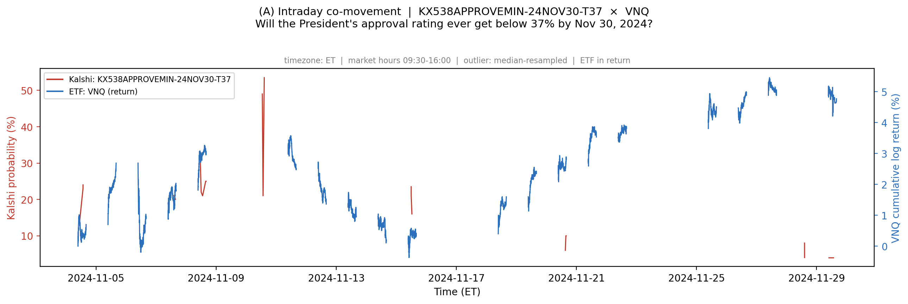
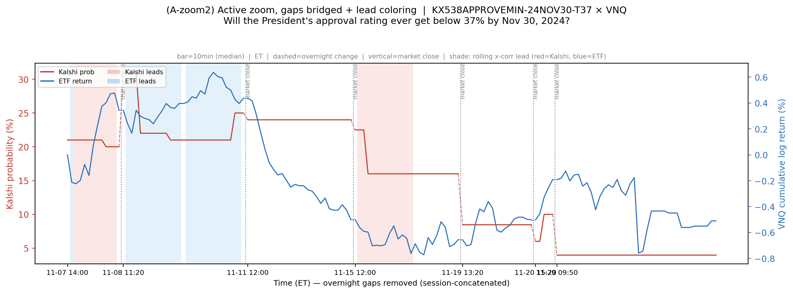
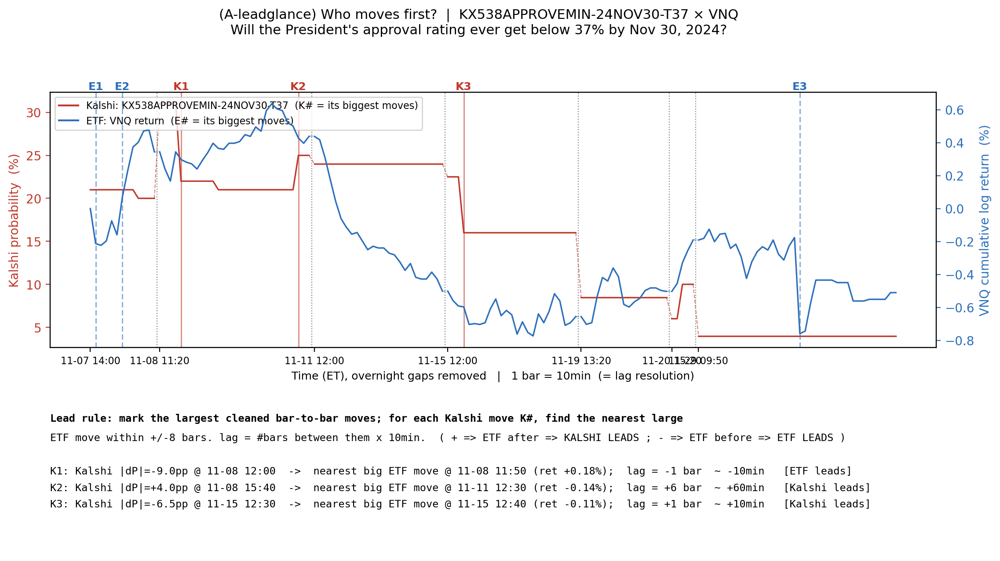
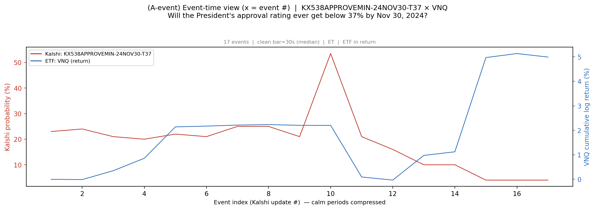
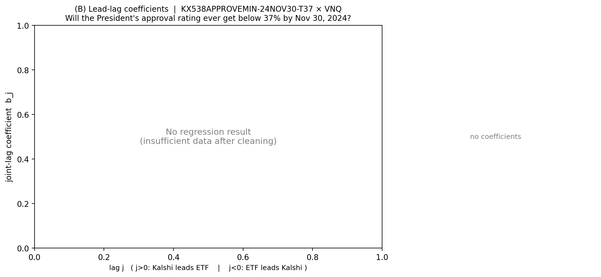

---

## Rank 28/48 — RATECUT-24SEP18 × VCR  (n_sig=0, best_p=n/a, n_trades=40)  (no regression result)

```text
PAIR ANALYSIS    —    Rank 28 / 48
================================================================================================
RATECUT-24SEP18   x   VCR
Contract : "Will the Federal Reserve cut rates before September 19, 2024?"
Sector relevance : VFH_VNQ_VPU (Rate-sensitive: Financials / Real Estate / Utilities)
Window : 2024-09-04 to 2024-09-18     Kalshi trades : 40     primary bar : n/a     daily-screen R^2 : 0.68

>>> RELIABILITY:  Cannot-estimate   <<<   (see section 5; unreliable pairs still get figures, but read their problems in section 8)

DEFINITIONS
   xₜ₋ₖ = Kalshi yes-probability change, k bars before t   (1 bar = n/a)
   yₜ   = ETF log return over bar t
   calendar = full market-hours grid: x=0 in bars with no Kalshi trade (not dropped).
   k>0 => Kalshi leads ETF ;  k<0 => ETF leads Kalshi ;  k=0 => contemporaneous

1. CALENDAR-TIME REGRESSION (clock-time lags, full RTH grid)
   Full model:  yₜ = α + Σ(k) βₖ·xₜ₋ₖ + (ADL self-lags) + (day fixed effects)
   -> no regression result (insufficient data).

2. EVENT-TIME REGRESSION (event-count lags)
   Full model:  yₜ = α + Σ(k) βₖ·xₜ₋ₖ + (ADL self-lags) + (day fixed effects)
   -> no regression result (insufficient data).

3. FULL COEFFICIENT TABLE  (calendar primary bar  vs  event)
   (no coefficients in either mode)

4. DIRECTIONAL TEST (probit, ETF up/down)
   Model: P(ETFₜ up) = Φ(α + βₖ·xₜ₋ₖ),  one probit per lag k
   calendar: n/a
   event: n/a
   -> no significant directional predictability either mode (raw p<0.15).

5. DATA RELIABILITY (statistical, not a trade-count cutoff)
   Tier: Cannot-estimate
   (criterion = n_active: bars with an actual Kalshi move (x!=0) = the real sample that identifies the lead-lag. Full RTH grid makes n_obs large, so n_active is the honest size.)
   calendar(full RTH grid): not estimable (insufficient data)
   event: not estimable (insufficient data)
   => Neither axis is estimable: this pair has descriptive figures only, no reliable regression result.

6. COARSE-FREQUENCY ROBUSTNESS (re-run calendar at 30min / 60min)
    30min: not estimable (n_obs=12 < minimum) -- coarser bars have even fewer observations
    60min: not estimable (n_obs=10 < minimum) -- coarser bars have even fewer observations

7. VERDICT
   No lead-lag detected -- too sparse / no significant structure.
   (Note: this pair lacks the data to support reliable inference; the verdict above is descriptive only -- do not put it in the conclusions.)

8. FIGURE CAVEATS — figures are still drawn, but know their problems
   - Regression cannot be estimated: the lag-coefficient plot (B) shows 'no regression result'; only the time-series / zoom plots are descriptive.
   - Long flat Kalshi segments = NO TRADE in that span (not 'probability unchanged'); do not read lead direction from them.
   - Too few active bars: the red/blue lead shading in zoom2/segments and the K#/E# pairing in leadglance are illustrative only, with no statistical meaning.
   - Kalshi updates only on trades (flat line = no trade, NOT 'no change'); ETF mid refreshes continuously.

------------------------------------------------------------------------------------------------
Conventions: ET | 09:30-16:00 (forward windows capped to 16:00) | ETF in log return | median causal bars | full RTH grid | day-grouped lags (no overnight) | ADL self-control | significance = BH-FDR corrected.
Figures for this pair follow on the next page.
```

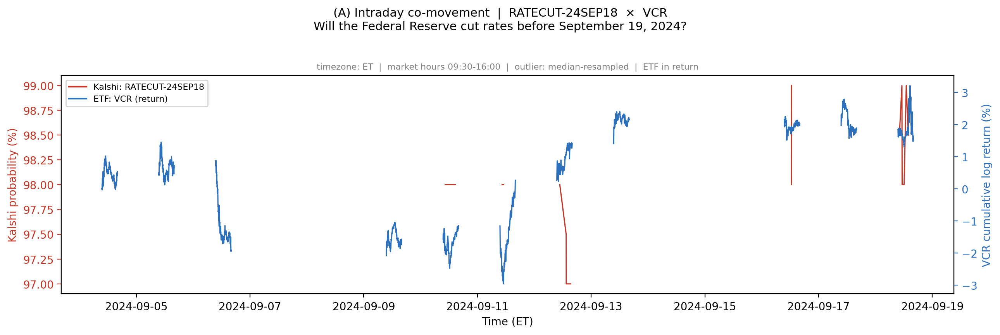
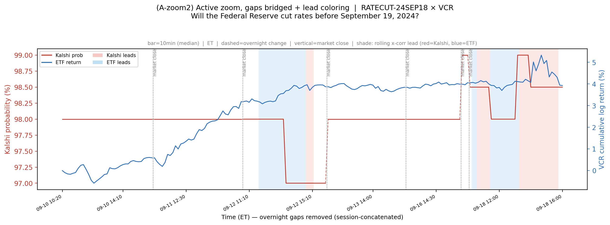
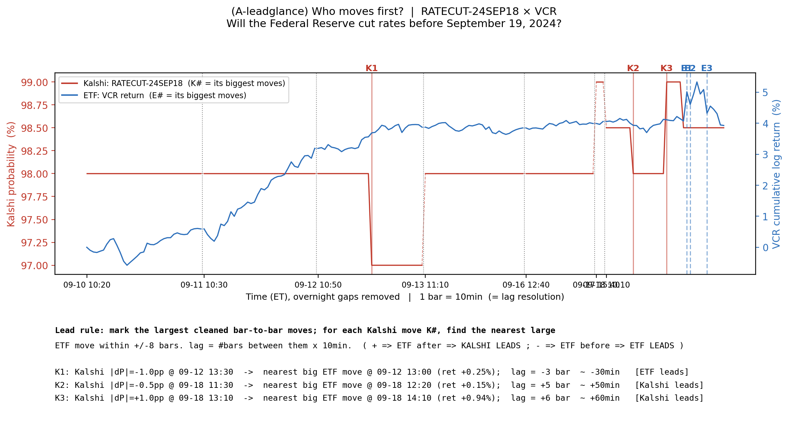
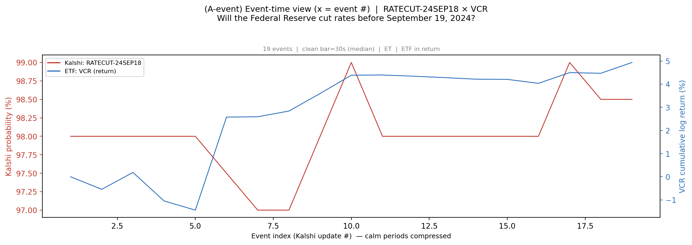
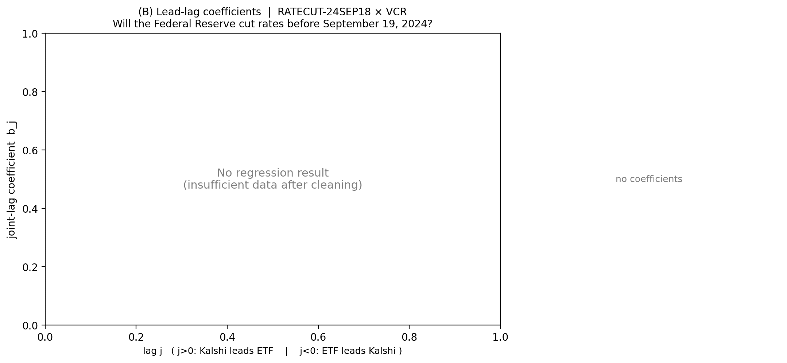

---

## Rank 29/48 — RATECUT-24SEP18 × VOX  (n_sig=0, best_p=n/a, n_trades=40)  (no regression result)

```text
PAIR ANALYSIS    —    Rank 29 / 48
================================================================================================
RATECUT-24SEP18   x   VOX
Contract : "Will the Federal Reserve cut rates before September 19, 2024?"
Sector relevance : VFH_VNQ_VPU (Rate-sensitive: Financials / Real Estate / Utilities)
Window : 2024-09-04 to 2024-09-18     Kalshi trades : 40     primary bar : n/a     daily-screen R^2 : 0.46

>>> RELIABILITY:  Cannot-estimate   <<<   (see section 5; unreliable pairs still get figures, but read their problems in section 8)

DEFINITIONS
   xₜ₋ₖ = Kalshi yes-probability change, k bars before t   (1 bar = n/a)
   yₜ   = ETF log return over bar t
   calendar = full market-hours grid: x=0 in bars with no Kalshi trade (not dropped).
   k>0 => Kalshi leads ETF ;  k<0 => ETF leads Kalshi ;  k=0 => contemporaneous

1. CALENDAR-TIME REGRESSION (clock-time lags, full RTH grid)
   Full model:  yₜ = α + Σ(k) βₖ·xₜ₋ₖ + (ADL self-lags) + (day fixed effects)
   -> no regression result (insufficient data).

2. EVENT-TIME REGRESSION (event-count lags)
   Full model:  yₜ = α + Σ(k) βₖ·xₜ₋ₖ + (ADL self-lags) + (day fixed effects)
   -> no regression result (insufficient data).

3. FULL COEFFICIENT TABLE  (calendar primary bar  vs  event)
   (no coefficients in either mode)

4. DIRECTIONAL TEST (probit, ETF up/down)
   Model: P(ETFₜ up) = Φ(α + βₖ·xₜ₋ₖ),  one probit per lag k
   calendar: n/a
   event: n/a
   -> no significant directional predictability either mode (raw p<0.15).

5. DATA RELIABILITY (statistical, not a trade-count cutoff)
   Tier: Cannot-estimate
   (criterion = n_active: bars with an actual Kalshi move (x!=0) = the real sample that identifies the lead-lag. Full RTH grid makes n_obs large, so n_active is the honest size.)
   calendar(full RTH grid): not estimable (insufficient data)
   event: not estimable (insufficient data)
   => Neither axis is estimable: this pair has descriptive figures only, no reliable regression result.

6. COARSE-FREQUENCY ROBUSTNESS (re-run calendar at 30min / 60min)
    30min: not estimable (n_obs=12 < minimum) -- coarser bars have even fewer observations
    60min: not estimable (n_obs=10 < minimum) -- coarser bars have even fewer observations

7. VERDICT
   No lead-lag detected -- too sparse / no significant structure.
   (Note: this pair lacks the data to support reliable inference; the verdict above is descriptive only -- do not put it in the conclusions.)

8. FIGURE CAVEATS — figures are still drawn, but know their problems
   - Regression cannot be estimated: the lag-coefficient plot (B) shows 'no regression result'; only the time-series / zoom plots are descriptive.
   - Long flat Kalshi segments = NO TRADE in that span (not 'probability unchanged'); do not read lead direction from them.
   - Too few active bars: the red/blue lead shading in zoom2/segments and the K#/E# pairing in leadglance are illustrative only, with no statistical meaning.
   - Kalshi updates only on trades (flat line = no trade, NOT 'no change'); ETF mid refreshes continuously.

------------------------------------------------------------------------------------------------
Conventions: ET | 09:30-16:00 (forward windows capped to 16:00) | ETF in log return | median causal bars | full RTH grid | day-grouped lags (no overnight) | ADL self-control | significance = BH-FDR corrected.
Figures for this pair follow on the next page.
```

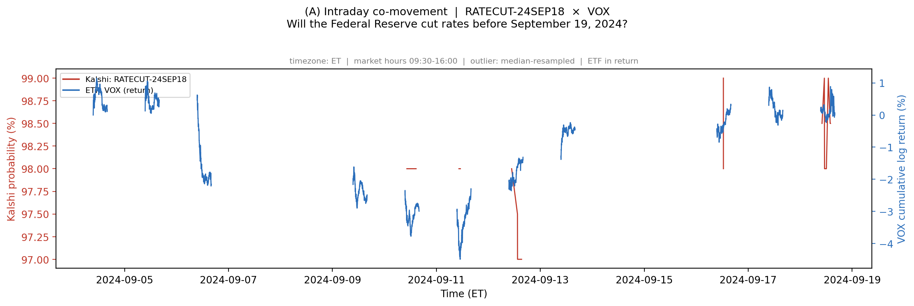
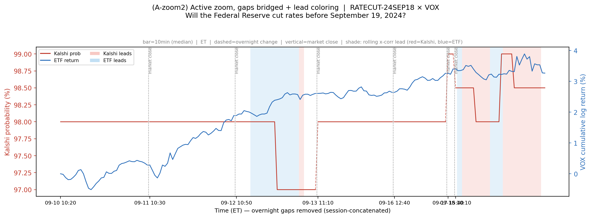
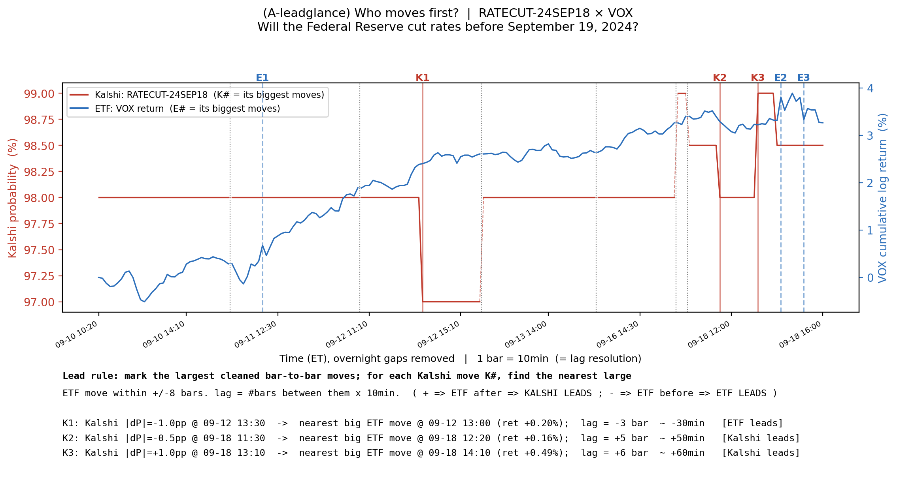
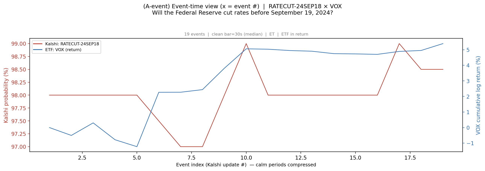


---

## Rank 30/48 — RATECUT-24SEP18 × VGT  (n_sig=0, best_p=n/a, n_trades=40)  (no regression result)

```text
PAIR ANALYSIS    —    Rank 30 / 48
================================================================================================
RATECUT-24SEP18   x   VGT
Contract : "Will the Federal Reserve cut rates before September 19, 2024?"
Sector relevance : VFH_VNQ_VPU (Rate-sensitive: Financials / Real Estate / Utilities)
Window : 2024-09-04 to 2024-09-18     Kalshi trades : 40     primary bar : n/a     daily-screen R^2 : 0.42

>>> RELIABILITY:  Cannot-estimate   <<<   (see section 5; unreliable pairs still get figures, but read their problems in section 8)

DEFINITIONS
   xₜ₋ₖ = Kalshi yes-probability change, k bars before t   (1 bar = n/a)
   yₜ   = ETF log return over bar t
   calendar = full market-hours grid: x=0 in bars with no Kalshi trade (not dropped).
   k>0 => Kalshi leads ETF ;  k<0 => ETF leads Kalshi ;  k=0 => contemporaneous

1. CALENDAR-TIME REGRESSION (clock-time lags, full RTH grid)
   Full model:  yₜ = α + Σ(k) βₖ·xₜ₋ₖ + (ADL self-lags) + (day fixed effects)
   -> no regression result (insufficient data).

2. EVENT-TIME REGRESSION (event-count lags)
   Full model:  yₜ = α + Σ(k) βₖ·xₜ₋ₖ + (ADL self-lags) + (day fixed effects)
   -> no regression result (insufficient data).

3. FULL COEFFICIENT TABLE  (calendar primary bar  vs  event)
   (no coefficients in either mode)

4. DIRECTIONAL TEST (probit, ETF up/down)
   Model: P(ETFₜ up) = Φ(α + βₖ·xₜ₋ₖ),  one probit per lag k
   calendar: n/a
   event: n/a
   -> no significant directional predictability either mode (raw p<0.15).

5. DATA RELIABILITY (statistical, not a trade-count cutoff)
   Tier: Cannot-estimate
   (criterion = n_active: bars with an actual Kalshi move (x!=0) = the real sample that identifies the lead-lag. Full RTH grid makes n_obs large, so n_active is the honest size.)
   calendar(full RTH grid): not estimable (insufficient data)
   event: not estimable (insufficient data)
   => Neither axis is estimable: this pair has descriptive figures only, no reliable regression result.

6. COARSE-FREQUENCY ROBUSTNESS (re-run calendar at 30min / 60min)
    30min: not estimable (n_obs=12 < minimum) -- coarser bars have even fewer observations
    60min: not estimable (n_obs=10 < minimum) -- coarser bars have even fewer observations

7. VERDICT
   No lead-lag detected -- too sparse / no significant structure.
   (Note: this pair lacks the data to support reliable inference; the verdict above is descriptive only -- do not put it in the conclusions.)

8. FIGURE CAVEATS — figures are still drawn, but know their problems
   - Regression cannot be estimated: the lag-coefficient plot (B) shows 'no regression result'; only the time-series / zoom plots are descriptive.
   - Long flat Kalshi segments = NO TRADE in that span (not 'probability unchanged'); do not read lead direction from them.
   - Too few active bars: the red/blue lead shading in zoom2/segments and the K#/E# pairing in leadglance are illustrative only, with no statistical meaning.
   - Kalshi updates only on trades (flat line = no trade, NOT 'no change'); ETF mid refreshes continuously.

------------------------------------------------------------------------------------------------
Conventions: ET | 09:30-16:00 (forward windows capped to 16:00) | ETF in log return | median causal bars | full RTH grid | day-grouped lags (no overnight) | ADL self-control | significance = BH-FDR corrected.
Figures for this pair follow on the next page.
```

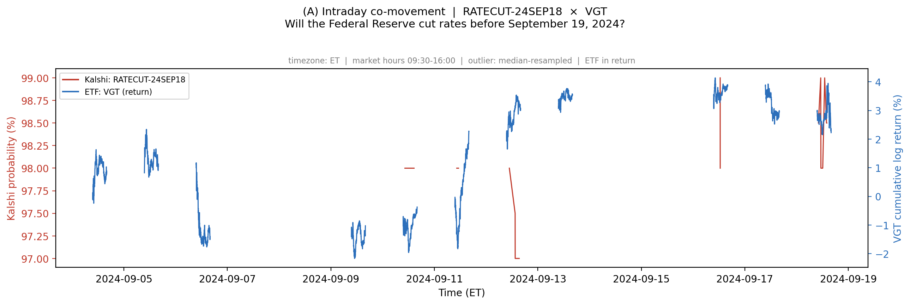
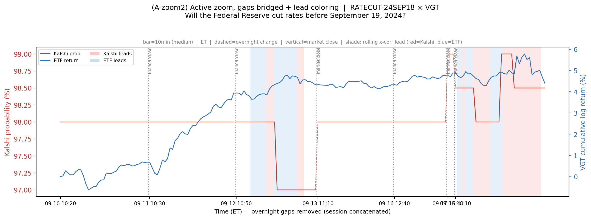
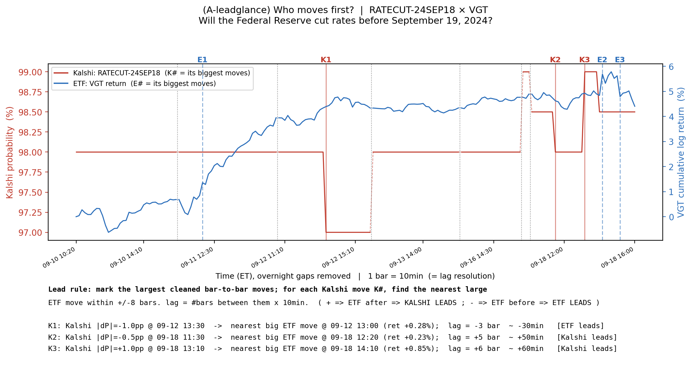
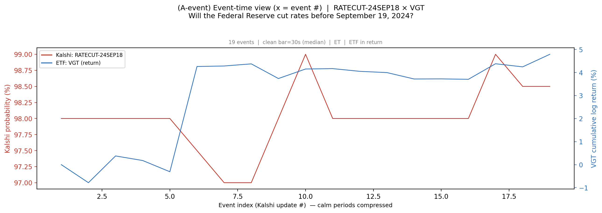


---

## Rank 31/48 — AAAGASM-24OCT31-US-3.15 × VPU  (n_sig=0, best_p=n/a, n_trades=37)  (no regression result)

```text
PAIR ANALYSIS    —    Rank 31 / 48
================================================================================================
AAAGASM-24OCT31-US-3.15   x   VPU
Contract : "Will average **gas prices** be above $3.15?"
Sector relevance : VDE (Energy)
Window : 2024-10-02 to 2024-10-31     Kalshi trades : 37     primary bar : n/a     daily-screen R^2 : 0.20

>>> RELIABILITY:  Cannot-estimate   <<<   (see section 5; unreliable pairs still get figures, but read their problems in section 8)

DEFINITIONS
   xₜ₋ₖ = Kalshi yes-probability change, k bars before t   (1 bar = n/a)
   yₜ   = ETF log return over bar t
   calendar = full market-hours grid: x=0 in bars with no Kalshi trade (not dropped).
   k>0 => Kalshi leads ETF ;  k<0 => ETF leads Kalshi ;  k=0 => contemporaneous

1. CALENDAR-TIME REGRESSION (clock-time lags, full RTH grid)
   Full model:  yₜ = α + Σ(k) βₖ·xₜ₋ₖ + (ADL self-lags) + (day fixed effects)
   -> no regression result (insufficient data).

2. EVENT-TIME REGRESSION (event-count lags)
   Full model:  yₜ = α + Σ(k) βₖ·xₜ₋ₖ + (ADL self-lags) + (day fixed effects)
   -> no regression result (insufficient data).

3. FULL COEFFICIENT TABLE  (calendar primary bar  vs  event)
   (no coefficients in either mode)

4. DIRECTIONAL TEST (probit, ETF up/down)
   Model: P(ETFₜ up) = Φ(α + βₖ·xₜ₋ₖ),  one probit per lag k
   calendar: n/a
   event: n/a
   -> no significant directional predictability either mode (raw p<0.15).

5. DATA RELIABILITY (statistical, not a trade-count cutoff)
   Tier: Cannot-estimate
   (criterion = n_active: bars with an actual Kalshi move (x!=0) = the real sample that identifies the lead-lag. Full RTH grid makes n_obs large, so n_active is the honest size.)
   calendar(full RTH grid): not estimable (insufficient data)
   event: not estimable (insufficient data)
   => Neither axis is estimable: this pair has descriptive figures only, no reliable regression result.

6. COARSE-FREQUENCY ROBUSTNESS (re-run calendar at 30min / 60min)
    30min: not estimable (n_obs=8 < minimum) -- coarser bars have even fewer observations
    60min: not estimable (n_obs=8 < minimum) -- coarser bars have even fewer observations

7. VERDICT
   No lead-lag detected -- too sparse / no significant structure.
   (Note: this pair lacks the data to support reliable inference; the verdict above is descriptive only -- do not put it in the conclusions.)

8. FIGURE CAVEATS — figures are still drawn, but know their problems
   - Regression cannot be estimated: the lag-coefficient plot (B) shows 'no regression result'; only the time-series / zoom plots are descriptive.
   - Long flat Kalshi segments = NO TRADE in that span (not 'probability unchanged'); do not read lead direction from them.
   - Too few active bars: the red/blue lead shading in zoom2/segments and the K#/E# pairing in leadglance are illustrative only, with no statistical meaning.
   - Kalshi updates only on trades (flat line = no trade, NOT 'no change'); ETF mid refreshes continuously.

------------------------------------------------------------------------------------------------
Conventions: ET | 09:30-16:00 (forward windows capped to 16:00) | ETF in log return | median causal bars | full RTH grid | day-grouped lags (no overnight) | ADL self-control | significance = BH-FDR corrected.
Figures for this pair follow on the next page.
```

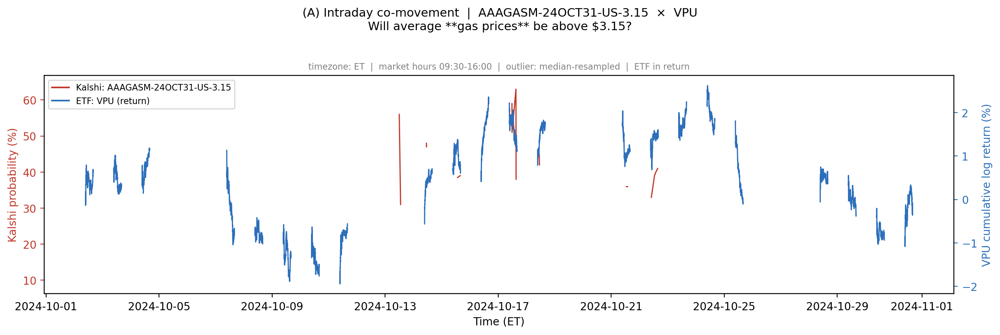
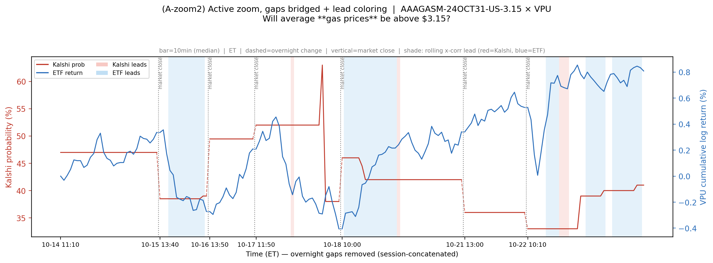
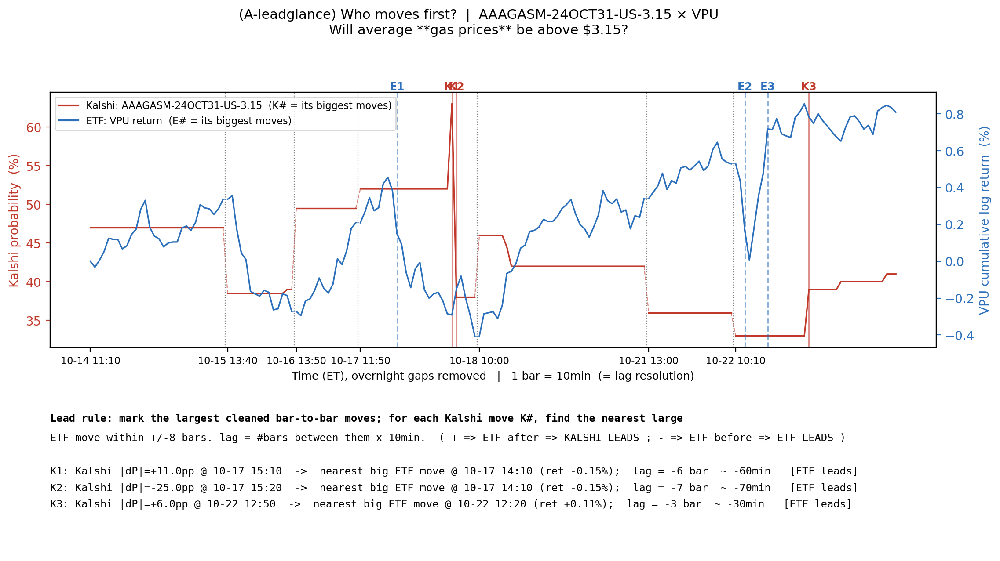
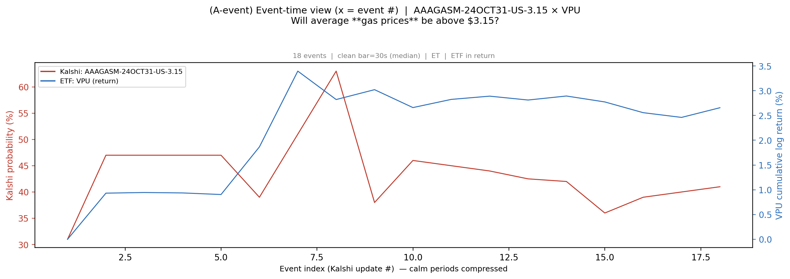
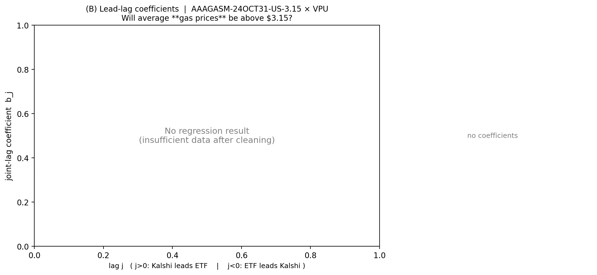

---

## Rank 32/48 — KXECKH287 × VNQ  (n_sig=0, best_p=n/a, n_trades=33)  (no regression result)

```text
PAIR ANALYSIS    —    Rank 32 / 48
================================================================================================
KXECKH287   x   VNQ
Contract : "Will Harris win 287-251 - PA, NV, MI, WI, AZ?"
Sector relevance : Election outcome (all sectors)
Window : 2024-11-04 to 2024-11-21     Kalshi trades : 33     primary bar : n/a     daily-screen R^2 : 0.68

>>> RELIABILITY:  Cannot-estimate   <<<   (see section 5; unreliable pairs still get figures, but read their problems in section 8)

DEFINITIONS
   xₜ₋ₖ = Kalshi yes-probability change, k bars before t   (1 bar = n/a)
   yₜ   = ETF log return over bar t
   calendar = full market-hours grid: x=0 in bars with no Kalshi trade (not dropped).
   k>0 => Kalshi leads ETF ;  k<0 => ETF leads Kalshi ;  k=0 => contemporaneous

1. CALENDAR-TIME REGRESSION (clock-time lags, full RTH grid)
   Full model:  yₜ = α + Σ(k) βₖ·xₜ₋ₖ + (ADL self-lags) + (day fixed effects)
   -> no regression result (insufficient data).

2. EVENT-TIME REGRESSION (event-count lags)
   Full model:  yₜ = α + Σ(k) βₖ·xₜ₋ₖ + (ADL self-lags) + (day fixed effects)
   -> no regression result (insufficient data).

3. FULL COEFFICIENT TABLE  (calendar primary bar  vs  event)
   (no coefficients in either mode)

4. DIRECTIONAL TEST (probit, ETF up/down)
   Model: P(ETFₜ up) = Φ(α + βₖ·xₜ₋ₖ),  one probit per lag k
   calendar: n/a
   event: n/a
   -> no significant directional predictability either mode (raw p<0.15).

5. DATA RELIABILITY (statistical, not a trade-count cutoff)
   Tier: Cannot-estimate
   (criterion = n_active: bars with an actual Kalshi move (x!=0) = the real sample that identifies the lead-lag. Full RTH grid makes n_obs large, so n_active is the honest size.)
   calendar(full RTH grid): not estimable (insufficient data)
   event: not estimable (insufficient data)
   => Neither axis is estimable: this pair has descriptive figures only, no reliable regression result.

6. COARSE-FREQUENCY ROBUSTNESS (re-run calendar at 30min / 60min)
    30min: not estimable (n_obs=11 < minimum) -- coarser bars have even fewer observations
    60min: not estimable (n_obs=6 < minimum) -- coarser bars have even fewer observations

7. VERDICT
   No lead-lag detected -- too sparse / no significant structure.
   (Note: this pair lacks the data to support reliable inference; the verdict above is descriptive only -- do not put it in the conclusions.)

8. FIGURE CAVEATS — figures are still drawn, but know their problems
   - Regression cannot be estimated: the lag-coefficient plot (B) shows 'no regression result'; only the time-series / zoom plots are descriptive.
   - Long flat Kalshi segments = NO TRADE in that span (not 'probability unchanged'); do not read lead direction from them.
   - Too few active bars: the red/blue lead shading in zoom2/segments and the K#/E# pairing in leadglance are illustrative only, with no statistical meaning.
   - Kalshi updates only on trades (flat line = no trade, NOT 'no change'); ETF mid refreshes continuously.

9. REAL-WORLD CONTEXT (WebSearch-verified; see URLs)
   - 2024 US presidential election held Tue Nov 5, 2024; ballots counted overnight Nov 5-6.
   - AP called the race for Trump ~5:34-5:37 AM ET on Wed Nov 6, 2024 (Wisconsin pushed him past 270) -- this is PRE-MARKET, so the regular-hours equity reaction shows up at the Nov 6 open.
   - Final electoral result: Trump 312, Harris 226.
   - Sources: en.wikipedia.org/wiki/2024_United_States_presidential_election ; spectrumlocalnews.com/us/snplus/news/2024/11/06/trump-wins-ap-projection-2024-election

------------------------------------------------------------------------------------------------
Conventions: ET | 09:30-16:00 (forward windows capped to 16:00) | ETF in log return | median causal bars | full RTH grid | day-grouped lags (no overnight) | ADL self-control | significance = BH-FDR corrected.
Figures for this pair follow on the next page.
```

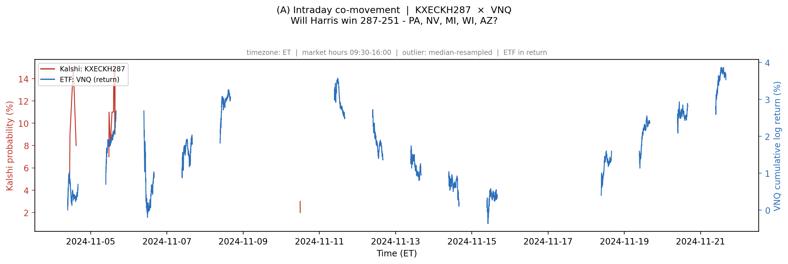
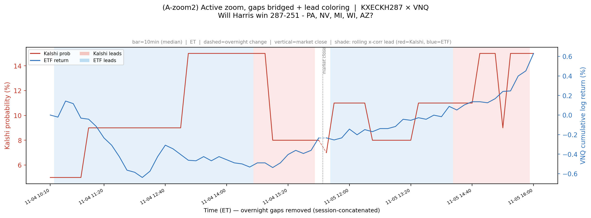
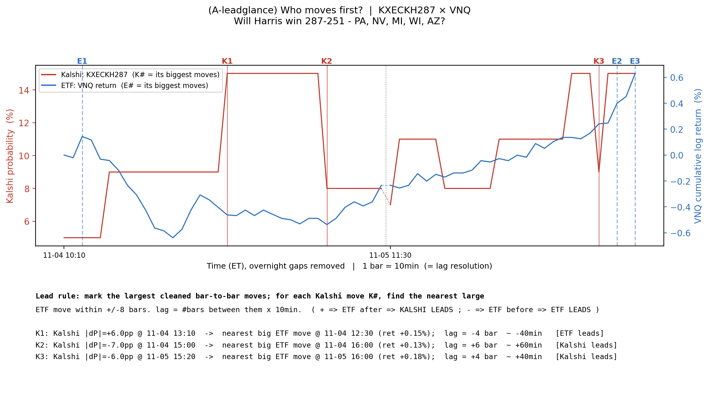
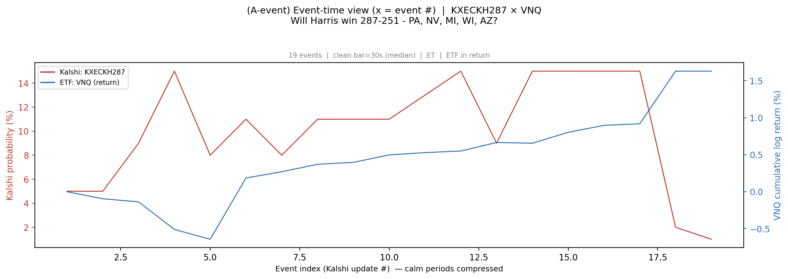
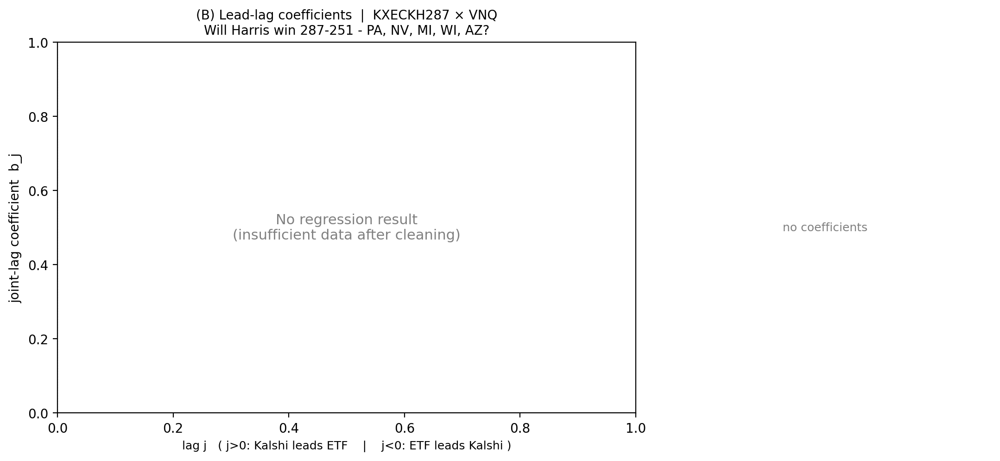

---

## Rank 33/48 — AAAGASM-24OCT31-US-3.20 × VHT  (n_sig=0, best_p=n/a, n_trades=30)  (no regression result)

```text
PAIR ANALYSIS    —    Rank 33 / 48
================================================================================================
AAAGASM-24OCT31-US-3.20   x   VHT
Contract : "Will average **gas prices** be above $3.20?"
Sector relevance : VDE (Energy)
Window : 2024-10-02 to 2024-10-30     Kalshi trades : 30     primary bar : n/a     daily-screen R^2 : 0.52

>>> RELIABILITY:  Cannot-estimate   <<<   (see section 5; unreliable pairs still get figures, but read their problems in section 8)

DEFINITIONS
   xₜ₋ₖ = Kalshi yes-probability change, k bars before t   (1 bar = n/a)
   yₜ   = ETF log return over bar t
   calendar = full market-hours grid: x=0 in bars with no Kalshi trade (not dropped).
   k>0 => Kalshi leads ETF ;  k<0 => ETF leads Kalshi ;  k=0 => contemporaneous

1. CALENDAR-TIME REGRESSION (clock-time lags, full RTH grid)
   Full model:  yₜ = α + Σ(k) βₖ·xₜ₋ₖ + (ADL self-lags) + (day fixed effects)
   -> no regression result (insufficient data).

2. EVENT-TIME REGRESSION (event-count lags)
   Full model:  yₜ = α + Σ(k) βₖ·xₜ₋ₖ + (ADL self-lags) + (day fixed effects)
   -> no regression result (insufficient data).

3. FULL COEFFICIENT TABLE  (calendar primary bar  vs  event)
   (no coefficients in either mode)

4. DIRECTIONAL TEST (probit, ETF up/down)
   Model: P(ETFₜ up) = Φ(α + βₖ·xₜ₋ₖ),  one probit per lag k
   calendar: n/a
   event: n/a
   -> no significant directional predictability either mode (raw p<0.15).

5. DATA RELIABILITY (statistical, not a trade-count cutoff)
   Tier: Cannot-estimate
   (criterion = n_active: bars with an actual Kalshi move (x!=0) = the real sample that identifies the lead-lag. Full RTH grid makes n_obs large, so n_active is the honest size.)
   calendar(full RTH grid): not estimable (insufficient data)
   event: not estimable (insufficient data)
   => Neither axis is estimable: this pair has descriptive figures only, no reliable regression result.

6. COARSE-FREQUENCY ROBUSTNESS (re-run calendar at 30min / 60min)
    30min: not estimable (n_obs=1 < minimum) -- coarser bars have even fewer observations
    60min: not estimable (n_obs=1 < minimum) -- coarser bars have even fewer observations

7. VERDICT
   No lead-lag detected -- too sparse / no significant structure.
   (Note: this pair lacks the data to support reliable inference; the verdict above is descriptive only -- do not put it in the conclusions.)

8. FIGURE CAVEATS — figures are still drawn, but know their problems
   - Regression cannot be estimated: the lag-coefficient plot (B) shows 'no regression result'; only the time-series / zoom plots are descriptive.
   - Long flat Kalshi segments = NO TRADE in that span (not 'probability unchanged'); do not read lead direction from them.
   - Too few active bars: the red/blue lead shading in zoom2/segments and the K#/E# pairing in leadglance are illustrative only, with no statistical meaning.
   - Kalshi updates only on trades (flat line = no trade, NOT 'no change'); ETF mid refreshes continuously.

------------------------------------------------------------------------------------------------
Conventions: ET | 09:30-16:00 (forward windows capped to 16:00) | ETF in log return | median causal bars | full RTH grid | day-grouped lags (no overnight) | ADL self-control | significance = BH-FDR corrected.
Figures for this pair follow on the next page.
```

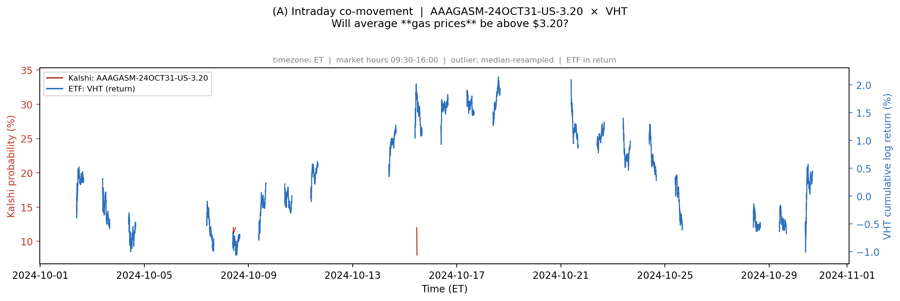
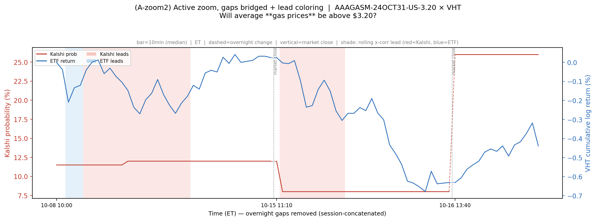
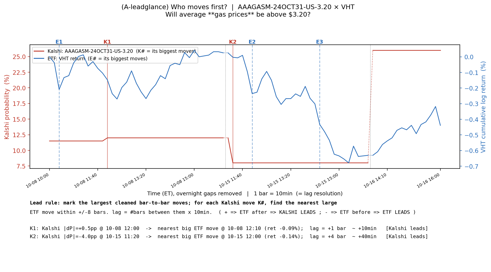
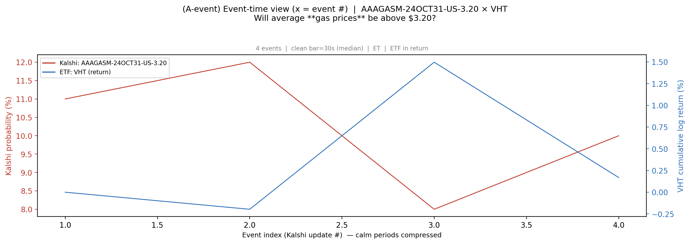
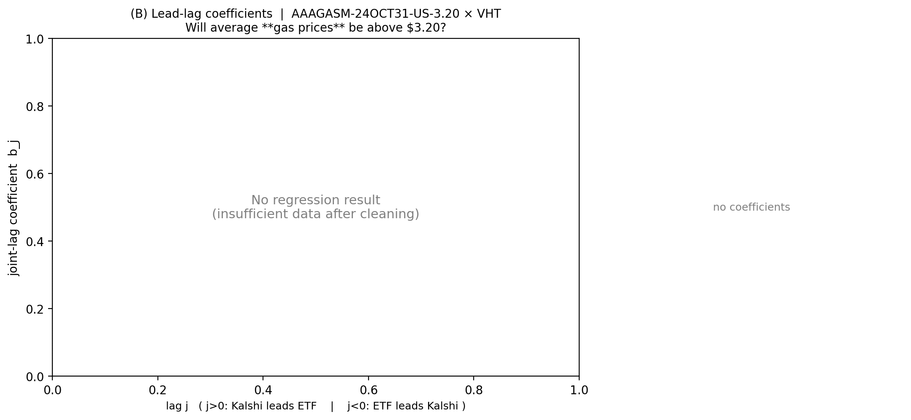

---

## Rank 34/48 — AAAGASM-24SEP30-US-3.15 × VIS  (n_sig=0, best_p=n/a, n_trades=18)  (no regression result)

```text
PAIR ANALYSIS    —    Rank 34 / 48
================================================================================================
AAAGASM-24SEP30-US-3.15   x   VIS
Contract : "Will average **gas prices** be above $3.15?"
Sector relevance : VDE (Energy)
Window : 2024-09-06 to 2024-09-26     Kalshi trades : 18     primary bar : n/a     daily-screen R^2 : 0.63

>>> RELIABILITY:  Cannot-estimate   <<<   (see section 5; unreliable pairs still get figures, but read their problems in section 8)

DEFINITIONS
   xₜ₋ₖ = Kalshi yes-probability change, k bars before t   (1 bar = n/a)
   yₜ   = ETF log return over bar t
   calendar = full market-hours grid: x=0 in bars with no Kalshi trade (not dropped).
   k>0 => Kalshi leads ETF ;  k<0 => ETF leads Kalshi ;  k=0 => contemporaneous

1. CALENDAR-TIME REGRESSION (clock-time lags, full RTH grid)
   Full model:  yₜ = α + Σ(k) βₖ·xₜ₋ₖ + (ADL self-lags) + (day fixed effects)
   -> no regression result (insufficient data).

2. EVENT-TIME REGRESSION (event-count lags)
   Full model:  yₜ = α + Σ(k) βₖ·xₜ₋ₖ + (ADL self-lags) + (day fixed effects)
   -> no regression result (insufficient data).

3. FULL COEFFICIENT TABLE  (calendar primary bar  vs  event)
   (no coefficients in either mode)

4. DIRECTIONAL TEST (probit, ETF up/down)
   Model: P(ETFₜ up) = Φ(α + βₖ·xₜ₋ₖ),  one probit per lag k
   calendar: n/a
   event: n/a
   -> no significant directional predictability either mode (raw p<0.15).

5. DATA RELIABILITY (statistical, not a trade-count cutoff)
   Tier: Cannot-estimate
   (criterion = n_active: bars with an actual Kalshi move (x!=0) = the real sample that identifies the lead-lag. Full RTH grid makes n_obs large, so n_active is the honest size.)
   calendar(full RTH grid): not estimable (insufficient data)
   event: not estimable (insufficient data)
   => Neither axis is estimable: this pair has descriptive figures only, no reliable regression result.

6. COARSE-FREQUENCY ROBUSTNESS (re-run calendar at 30min / 60min)
    30min: not estimable (n_obs=5 < minimum) -- coarser bars have even fewer observations
    60min: not estimable (n_obs=4 < minimum) -- coarser bars have even fewer observations

7. VERDICT
   No lead-lag detected -- too sparse / no significant structure.
   (Note: this pair lacks the data to support reliable inference; the verdict above is descriptive only -- do not put it in the conclusions.)

8. FIGURE CAVEATS — figures are still drawn, but know their problems
   - Regression cannot be estimated: the lag-coefficient plot (B) shows 'no regression result'; only the time-series / zoom plots are descriptive.
   - Long flat Kalshi segments = NO TRADE in that span (not 'probability unchanged'); do not read lead direction from them.
   - Too few active bars: the red/blue lead shading in zoom2/segments and the K#/E# pairing in leadglance are illustrative only, with no statistical meaning.
   - Kalshi updates only on trades (flat line = no trade, NOT 'no change'); ETF mid refreshes continuously.

------------------------------------------------------------------------------------------------
Conventions: ET | 09:30-16:00 (forward windows capped to 16:00) | ETF in log return | median causal bars | full RTH grid | day-grouped lags (no overnight) | ADL self-control | significance = BH-FDR corrected.
Figures for this pair follow on the next page.
```

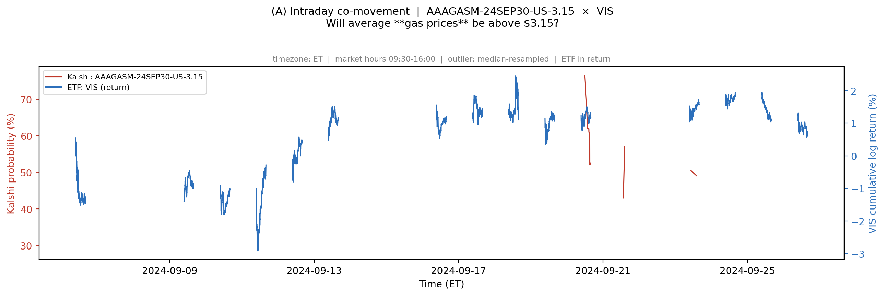
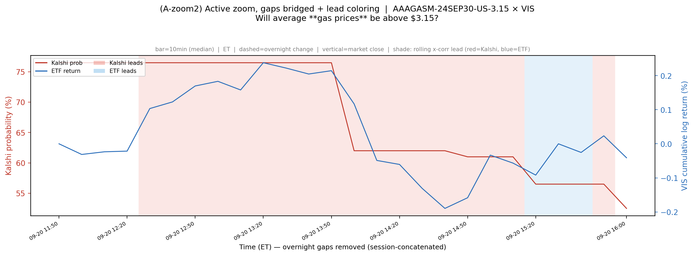
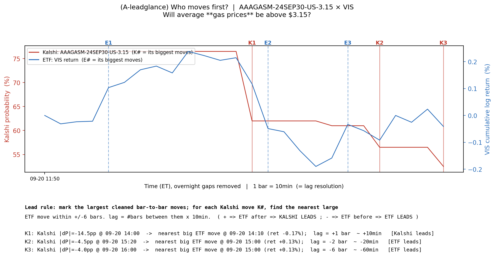
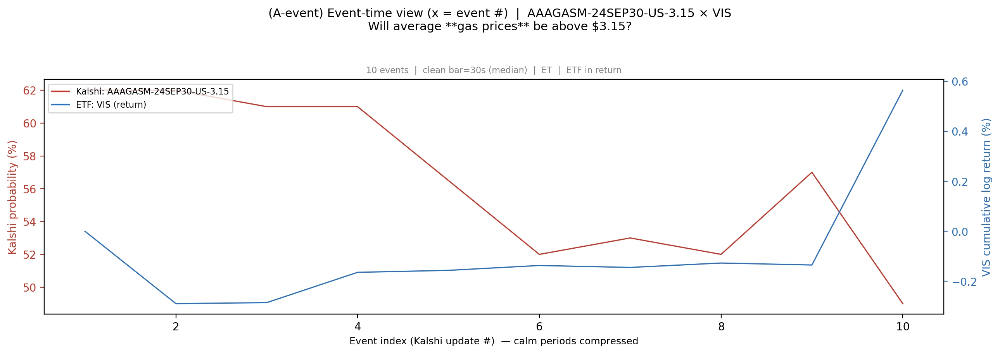
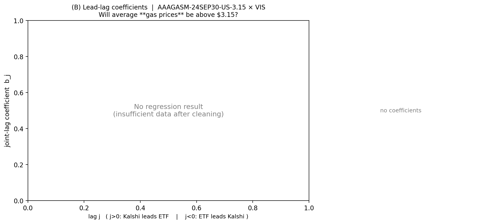

---

## Rank 35/48 — AAAGASM-24SEP30-US-3.15 × VGT  (n_sig=0, best_p=n/a, n_trades=18)  (no regression result)

```text
PAIR ANALYSIS    —    Rank 35 / 48
================================================================================================
AAAGASM-24SEP30-US-3.15   x   VGT
Contract : "Will average **gas prices** be above $3.15?"
Sector relevance : VDE (Energy)
Window : 2024-09-06 to 2024-09-26     Kalshi trades : 18     primary bar : n/a     daily-screen R^2 : 0.63

>>> RELIABILITY:  Cannot-estimate   <<<   (see section 5; unreliable pairs still get figures, but read their problems in section 8)

DEFINITIONS
   xₜ₋ₖ = Kalshi yes-probability change, k bars before t   (1 bar = n/a)
   yₜ   = ETF log return over bar t
   calendar = full market-hours grid: x=0 in bars with no Kalshi trade (not dropped).
   k>0 => Kalshi leads ETF ;  k<0 => ETF leads Kalshi ;  k=0 => contemporaneous

1. CALENDAR-TIME REGRESSION (clock-time lags, full RTH grid)
   Full model:  yₜ = α + Σ(k) βₖ·xₜ₋ₖ + (ADL self-lags) + (day fixed effects)
   -> no regression result (insufficient data).

2. EVENT-TIME REGRESSION (event-count lags)
   Full model:  yₜ = α + Σ(k) βₖ·xₜ₋ₖ + (ADL self-lags) + (day fixed effects)
   -> no regression result (insufficient data).

3. FULL COEFFICIENT TABLE  (calendar primary bar  vs  event)
   (no coefficients in either mode)

4. DIRECTIONAL TEST (probit, ETF up/down)
   Model: P(ETFₜ up) = Φ(α + βₖ·xₜ₋ₖ),  one probit per lag k
   calendar: n/a
   event: n/a
   -> no significant directional predictability either mode (raw p<0.15).

5. DATA RELIABILITY (statistical, not a trade-count cutoff)
   Tier: Cannot-estimate
   (criterion = n_active: bars with an actual Kalshi move (x!=0) = the real sample that identifies the lead-lag. Full RTH grid makes n_obs large, so n_active is the honest size.)
   calendar(full RTH grid): not estimable (insufficient data)
   event: not estimable (insufficient data)
   => Neither axis is estimable: this pair has descriptive figures only, no reliable regression result.

6. COARSE-FREQUENCY ROBUSTNESS (re-run calendar at 30min / 60min)
    30min: not estimable (n_obs=5 < minimum) -- coarser bars have even fewer observations
    60min: not estimable (n_obs=4 < minimum) -- coarser bars have even fewer observations

7. VERDICT
   No lead-lag detected -- too sparse / no significant structure.
   (Note: this pair lacks the data to support reliable inference; the verdict above is descriptive only -- do not put it in the conclusions.)

8. FIGURE CAVEATS — figures are still drawn, but know their problems
   - Regression cannot be estimated: the lag-coefficient plot (B) shows 'no regression result'; only the time-series / zoom plots are descriptive.
   - Long flat Kalshi segments = NO TRADE in that span (not 'probability unchanged'); do not read lead direction from them.
   - Too few active bars: the red/blue lead shading in zoom2/segments and the K#/E# pairing in leadglance are illustrative only, with no statistical meaning.
   - Kalshi updates only on trades (flat line = no trade, NOT 'no change'); ETF mid refreshes continuously.

------------------------------------------------------------------------------------------------
Conventions: ET | 09:30-16:00 (forward windows capped to 16:00) | ETF in log return | median causal bars | full RTH grid | day-grouped lags (no overnight) | ADL self-control | significance = BH-FDR corrected.
Figures for this pair follow on the next page.
```

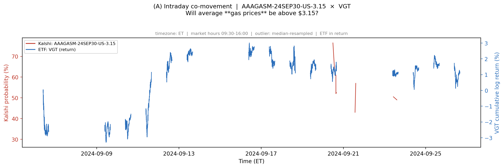
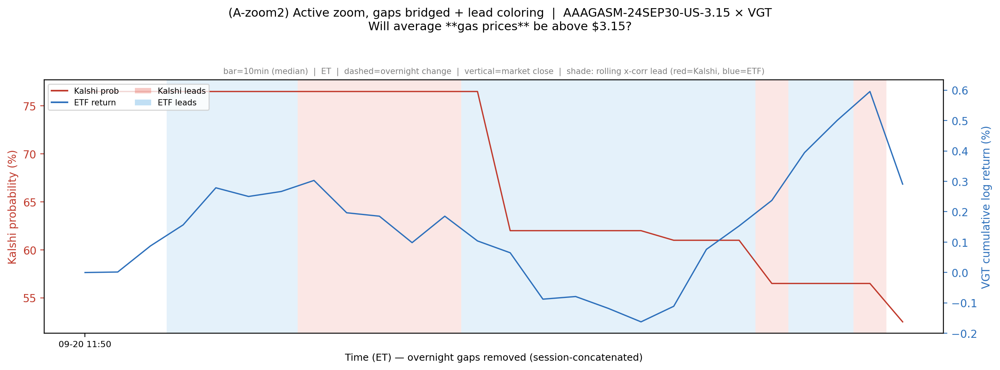
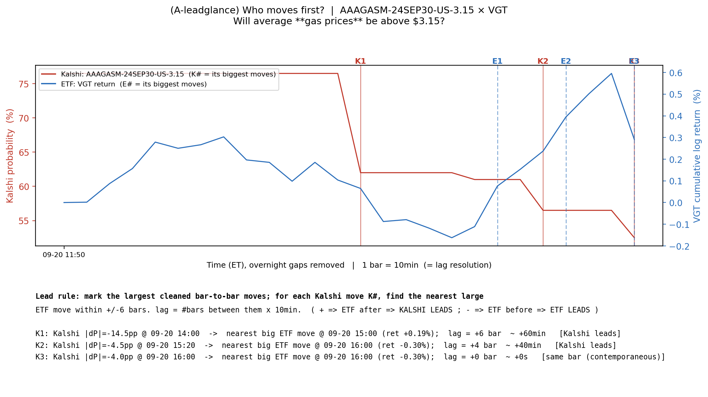
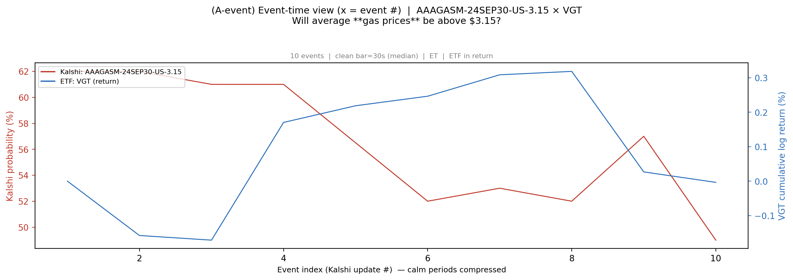


---

## Rank 36/48 — AAAGASM-24SEP30-US-3.15 × VAW  (n_sig=0, best_p=n/a, n_trades=18)  (no regression result)

```text
PAIR ANALYSIS    —    Rank 36 / 48
================================================================================================
AAAGASM-24SEP30-US-3.15   x   VAW
Contract : "Will average **gas prices** be above $3.15?"
Sector relevance : VDE (Energy)
Window : 2024-09-06 to 2024-09-26     Kalshi trades : 18     primary bar : n/a     daily-screen R^2 : 0.57

>>> RELIABILITY:  Cannot-estimate   <<<   (see section 5; unreliable pairs still get figures, but read their problems in section 8)

DEFINITIONS
   xₜ₋ₖ = Kalshi yes-probability change, k bars before t   (1 bar = n/a)
   yₜ   = ETF log return over bar t
   calendar = full market-hours grid: x=0 in bars with no Kalshi trade (not dropped).
   k>0 => Kalshi leads ETF ;  k<0 => ETF leads Kalshi ;  k=0 => contemporaneous

1. CALENDAR-TIME REGRESSION (clock-time lags, full RTH grid)
   Full model:  yₜ = α + Σ(k) βₖ·xₜ₋ₖ + (ADL self-lags) + (day fixed effects)
   -> no regression result (insufficient data).

2. EVENT-TIME REGRESSION (event-count lags)
   Full model:  yₜ = α + Σ(k) βₖ·xₜ₋ₖ + (ADL self-lags) + (day fixed effects)
   -> no regression result (insufficient data).

3. FULL COEFFICIENT TABLE  (calendar primary bar  vs  event)
   (no coefficients in either mode)

4. DIRECTIONAL TEST (probit, ETF up/down)
   Model: P(ETFₜ up) = Φ(α + βₖ·xₜ₋ₖ),  one probit per lag k
   calendar: n/a
   event: n/a
   -> no significant directional predictability either mode (raw p<0.15).

5. DATA RELIABILITY (statistical, not a trade-count cutoff)
   Tier: Cannot-estimate
   (criterion = n_active: bars with an actual Kalshi move (x!=0) = the real sample that identifies the lead-lag. Full RTH grid makes n_obs large, so n_active is the honest size.)
   calendar(full RTH grid): not estimable (insufficient data)
   event: not estimable (insufficient data)
   => Neither axis is estimable: this pair has descriptive figures only, no reliable regression result.

6. COARSE-FREQUENCY ROBUSTNESS (re-run calendar at 30min / 60min)
    30min: not estimable (n_obs=5 < minimum) -- coarser bars have even fewer observations
    60min: not estimable (n_obs=4 < minimum) -- coarser bars have even fewer observations

7. VERDICT
   No lead-lag detected -- too sparse / no significant structure.
   (Note: this pair lacks the data to support reliable inference; the verdict above is descriptive only -- do not put it in the conclusions.)

8. FIGURE CAVEATS — figures are still drawn, but know their problems
   - Regression cannot be estimated: the lag-coefficient plot (B) shows 'no regression result'; only the time-series / zoom plots are descriptive.
   - Long flat Kalshi segments = NO TRADE in that span (not 'probability unchanged'); do not read lead direction from them.
   - Too few active bars: the red/blue lead shading in zoom2/segments and the K#/E# pairing in leadglance are illustrative only, with no statistical meaning.
   - Kalshi updates only on trades (flat line = no trade, NOT 'no change'); ETF mid refreshes continuously.

------------------------------------------------------------------------------------------------
Conventions: ET | 09:30-16:00 (forward windows capped to 16:00) | ETF in log return | median causal bars | full RTH grid | day-grouped lags (no overnight) | ADL self-control | significance = BH-FDR corrected.
Figures for this pair follow on the next page.
```

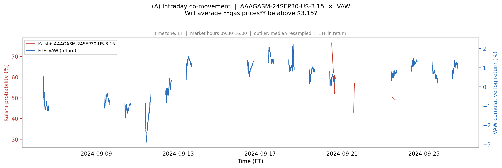
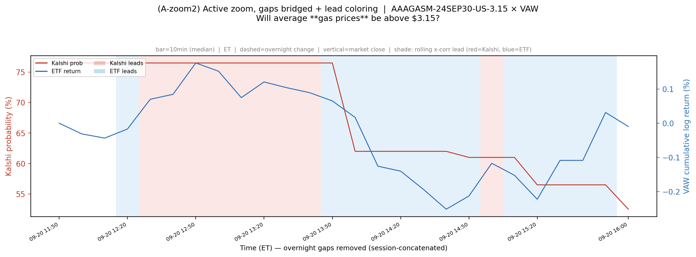
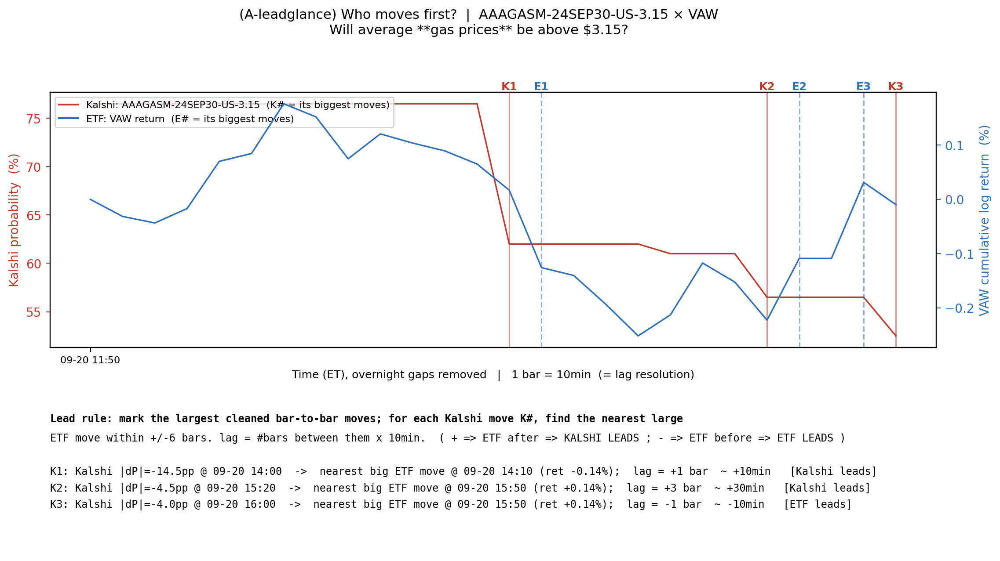
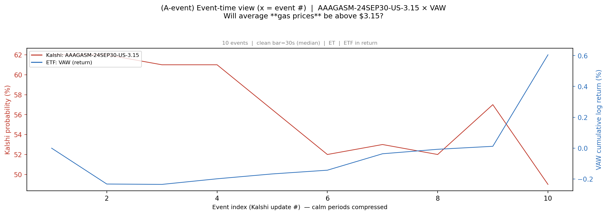
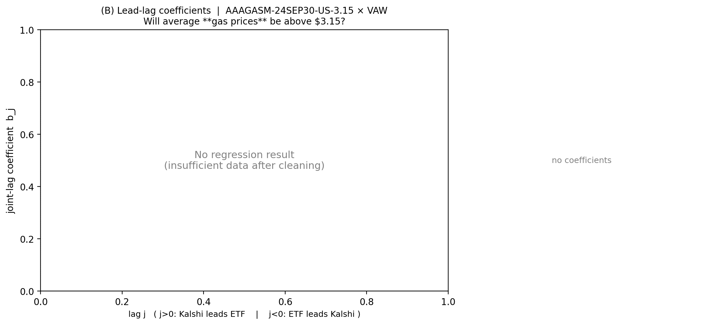

---

## Rank 37/48 — AAAGASM-24SEP30-US-3.15 × VCR  (n_sig=0, best_p=n/a, n_trades=18)  (no regression result)

```text
PAIR ANALYSIS    —    Rank 37 / 48
================================================================================================
AAAGASM-24SEP30-US-3.15   x   VCR
Contract : "Will average **gas prices** be above $3.15?"
Sector relevance : VDE (Energy)
Window : 2024-09-06 to 2024-09-26     Kalshi trades : 18     primary bar : n/a     daily-screen R^2 : 0.46

>>> RELIABILITY:  Cannot-estimate   <<<   (see section 5; unreliable pairs still get figures, but read their problems in section 8)

DEFINITIONS
   xₜ₋ₖ = Kalshi yes-probability change, k bars before t   (1 bar = n/a)
   yₜ   = ETF log return over bar t
   calendar = full market-hours grid: x=0 in bars with no Kalshi trade (not dropped).
   k>0 => Kalshi leads ETF ;  k<0 => ETF leads Kalshi ;  k=0 => contemporaneous

1. CALENDAR-TIME REGRESSION (clock-time lags, full RTH grid)
   Full model:  yₜ = α + Σ(k) βₖ·xₜ₋ₖ + (ADL self-lags) + (day fixed effects)
   -> no regression result (insufficient data).

2. EVENT-TIME REGRESSION (event-count lags)
   Full model:  yₜ = α + Σ(k) βₖ·xₜ₋ₖ + (ADL self-lags) + (day fixed effects)
   -> no regression result (insufficient data).

3. FULL COEFFICIENT TABLE  (calendar primary bar  vs  event)
   (no coefficients in either mode)

4. DIRECTIONAL TEST (probit, ETF up/down)
   Model: P(ETFₜ up) = Φ(α + βₖ·xₜ₋ₖ),  one probit per lag k
   calendar: n/a
   event: n/a
   -> no significant directional predictability either mode (raw p<0.15).

5. DATA RELIABILITY (statistical, not a trade-count cutoff)
   Tier: Cannot-estimate
   (criterion = n_active: bars with an actual Kalshi move (x!=0) = the real sample that identifies the lead-lag. Full RTH grid makes n_obs large, so n_active is the honest size.)
   calendar(full RTH grid): not estimable (insufficient data)
   event: not estimable (insufficient data)
   => Neither axis is estimable: this pair has descriptive figures only, no reliable regression result.

6. COARSE-FREQUENCY ROBUSTNESS (re-run calendar at 30min / 60min)
    30min: not estimable (n_obs=5 < minimum) -- coarser bars have even fewer observations
    60min: not estimable (n_obs=4 < minimum) -- coarser bars have even fewer observations

7. VERDICT
   No lead-lag detected -- too sparse / no significant structure.
   (Note: this pair lacks the data to support reliable inference; the verdict above is descriptive only -- do not put it in the conclusions.)

8. FIGURE CAVEATS — figures are still drawn, but know their problems
   - Regression cannot be estimated: the lag-coefficient plot (B) shows 'no regression result'; only the time-series / zoom plots are descriptive.
   - Long flat Kalshi segments = NO TRADE in that span (not 'probability unchanged'); do not read lead direction from them.
   - Too few active bars: the red/blue lead shading in zoom2/segments and the K#/E# pairing in leadglance are illustrative only, with no statistical meaning.
   - Kalshi updates only on trades (flat line = no trade, NOT 'no change'); ETF mid refreshes continuously.

------------------------------------------------------------------------------------------------
Conventions: ET | 09:30-16:00 (forward windows capped to 16:00) | ETF in log return | median causal bars | full RTH grid | day-grouped lags (no overnight) | ADL self-control | significance = BH-FDR corrected.
Figures for this pair follow on the next page.
```

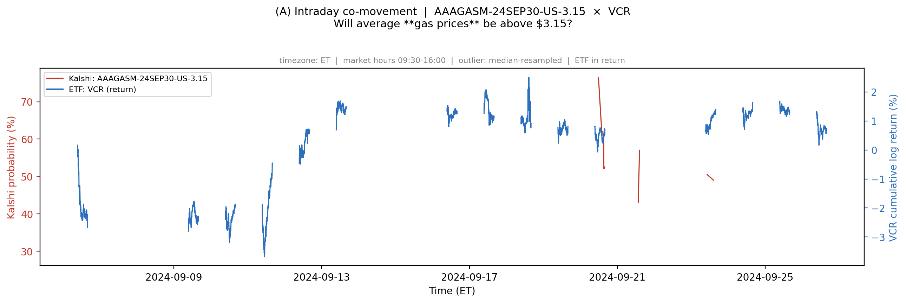
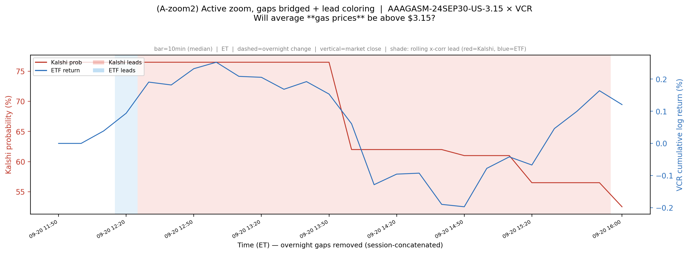
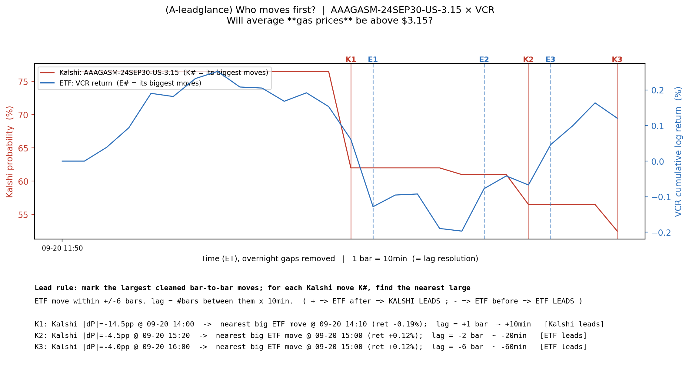
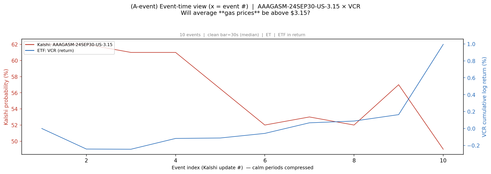


---

## Rank 38/48 — AAAGASM-24SEP30-US-3.15 × VOX  (n_sig=0, best_p=n/a, n_trades=18)  (no regression result)

```text
PAIR ANALYSIS    —    Rank 38 / 48
================================================================================================
AAAGASM-24SEP30-US-3.15   x   VOX
Contract : "Will average **gas prices** be above $3.15?"
Sector relevance : VDE (Energy)
Window : 2024-09-06 to 2024-09-26     Kalshi trades : 18     primary bar : n/a     daily-screen R^2 : 0.44

>>> RELIABILITY:  Cannot-estimate   <<<   (see section 5; unreliable pairs still get figures, but read their problems in section 8)

DEFINITIONS
   xₜ₋ₖ = Kalshi yes-probability change, k bars before t   (1 bar = n/a)
   yₜ   = ETF log return over bar t
   calendar = full market-hours grid: x=0 in bars with no Kalshi trade (not dropped).
   k>0 => Kalshi leads ETF ;  k<0 => ETF leads Kalshi ;  k=0 => contemporaneous

1. CALENDAR-TIME REGRESSION (clock-time lags, full RTH grid)
   Full model:  yₜ = α + Σ(k) βₖ·xₜ₋ₖ + (ADL self-lags) + (day fixed effects)
   -> no regression result (insufficient data).

2. EVENT-TIME REGRESSION (event-count lags)
   Full model:  yₜ = α + Σ(k) βₖ·xₜ₋ₖ + (ADL self-lags) + (day fixed effects)
   -> no regression result (insufficient data).

3. FULL COEFFICIENT TABLE  (calendar primary bar  vs  event)
   (no coefficients in either mode)

4. DIRECTIONAL TEST (probit, ETF up/down)
   Model: P(ETFₜ up) = Φ(α + βₖ·xₜ₋ₖ),  one probit per lag k
   calendar: n/a
   event: n/a
   -> no significant directional predictability either mode (raw p<0.15).

5. DATA RELIABILITY (statistical, not a trade-count cutoff)
   Tier: Cannot-estimate
   (criterion = n_active: bars with an actual Kalshi move (x!=0) = the real sample that identifies the lead-lag. Full RTH grid makes n_obs large, so n_active is the honest size.)
   calendar(full RTH grid): not estimable (insufficient data)
   event: not estimable (insufficient data)
   => Neither axis is estimable: this pair has descriptive figures only, no reliable regression result.

6. COARSE-FREQUENCY ROBUSTNESS (re-run calendar at 30min / 60min)
    30min: not estimable (n_obs=5 < minimum) -- coarser bars have even fewer observations
    60min: not estimable (n_obs=4 < minimum) -- coarser bars have even fewer observations

7. VERDICT
   No lead-lag detected -- too sparse / no significant structure.
   (Note: this pair lacks the data to support reliable inference; the verdict above is descriptive only -- do not put it in the conclusions.)

8. FIGURE CAVEATS — figures are still drawn, but know their problems
   - Regression cannot be estimated: the lag-coefficient plot (B) shows 'no regression result'; only the time-series / zoom plots are descriptive.
   - Long flat Kalshi segments = NO TRADE in that span (not 'probability unchanged'); do not read lead direction from them.
   - Too few active bars: the red/blue lead shading in zoom2/segments and the K#/E# pairing in leadglance are illustrative only, with no statistical meaning.
   - Kalshi updates only on trades (flat line = no trade, NOT 'no change'); ETF mid refreshes continuously.

------------------------------------------------------------------------------------------------
Conventions: ET | 09:30-16:00 (forward windows capped to 16:00) | ETF in log return | median causal bars | full RTH grid | day-grouped lags (no overnight) | ADL self-control | significance = BH-FDR corrected.
Figures for this pair follow on the next page.
```

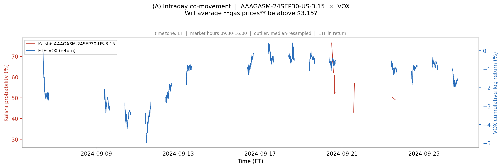
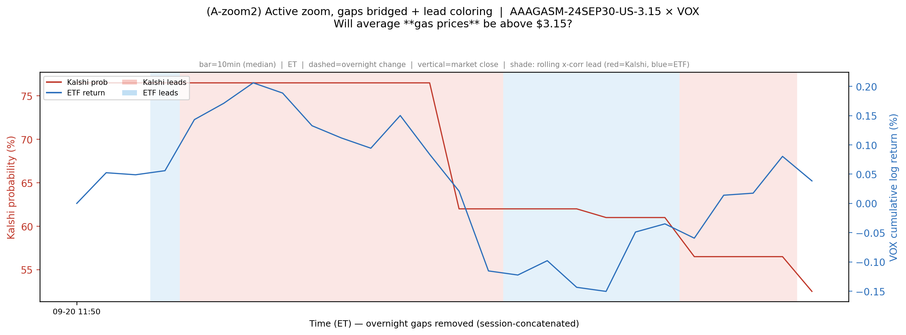
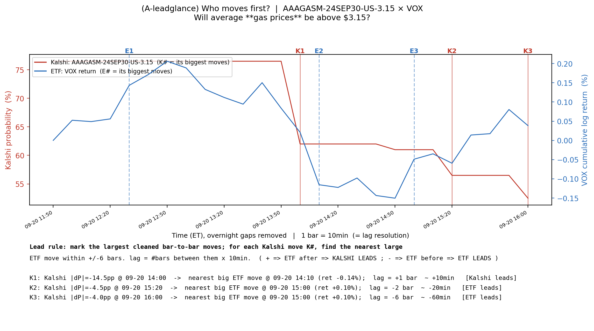
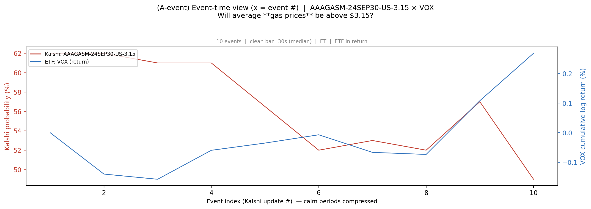


---

## Rank 39/48 — 538APPROVEMAX-24SEP30-T43 × VAW  (n_sig=0, best_p=n/a, n_trades=17)  (no regression result)

```text
PAIR ANALYSIS    —    Rank 39 / 48
================================================================================================
538APPROVEMAX-24SEP30-T43   x   VAW
Contract : "Will the President's approval rating ever get above 43% by Sep 30, 2024?"
Sector relevance : Election outcome (all sectors)
Window : 2024-09-04 to 2024-09-30     Kalshi trades : 17     primary bar : n/a     daily-screen R^2 : 0.44

>>> RELIABILITY:  Cannot-estimate   <<<   (see section 5; unreliable pairs still get figures, but read their problems in section 8)

DEFINITIONS
   xₜ₋ₖ = Kalshi yes-probability change, k bars before t   (1 bar = n/a)
   yₜ   = ETF log return over bar t
   calendar = full market-hours grid: x=0 in bars with no Kalshi trade (not dropped).
   k>0 => Kalshi leads ETF ;  k<0 => ETF leads Kalshi ;  k=0 => contemporaneous

1. CALENDAR-TIME REGRESSION (clock-time lags, full RTH grid)
   Full model:  yₜ = α + Σ(k) βₖ·xₜ₋ₖ + (ADL self-lags) + (day fixed effects)
   -> no regression result (insufficient data).

2. EVENT-TIME REGRESSION (event-count lags)
   Full model:  yₜ = α + Σ(k) βₖ·xₜ₋ₖ + (ADL self-lags) + (day fixed effects)
   -> no regression result (insufficient data).

3. FULL COEFFICIENT TABLE  (calendar primary bar  vs  event)
   (no coefficients in either mode)

4. DIRECTIONAL TEST (probit, ETF up/down)
   Model: P(ETFₜ up) = Φ(α + βₖ·xₜ₋ₖ),  one probit per lag k
   calendar: n/a
   event: n/a
   -> no significant directional predictability either mode (raw p<0.15).

5. DATA RELIABILITY (statistical, not a trade-count cutoff)
   Tier: Cannot-estimate
   (criterion = n_active: bars with an actual Kalshi move (x!=0) = the real sample that identifies the lead-lag. Full RTH grid makes n_obs large, so n_active is the honest size.)
   calendar(full RTH grid): not estimable (insufficient data)
   event: not estimable (insufficient data)
   => Neither axis is estimable: this pair has descriptive figures only, no reliable regression result.

6. COARSE-FREQUENCY ROBUSTNESS (re-run calendar at 30min / 60min)
    30min: not estimable (n_obs=1 < minimum) -- coarser bars have even fewer observations
    60min: not estimable (n_obs=1 < minimum) -- coarser bars have even fewer observations

7. VERDICT
   No lead-lag detected -- too sparse / no significant structure.
   (Note: this pair lacks the data to support reliable inference; the verdict above is descriptive only -- do not put it in the conclusions.)

8. FIGURE CAVEATS — figures are still drawn, but know their problems
   - Regression cannot be estimated: the lag-coefficient plot (B) shows 'no regression result'; only the time-series / zoom plots are descriptive.
   - Long flat Kalshi segments = NO TRADE in that span (not 'probability unchanged'); do not read lead direction from them.
   - Too few active bars: the red/blue lead shading in zoom2/segments and the K#/E# pairing in leadglance are illustrative only, with no statistical meaning.
   - Kalshi updates only on trades (flat line = no trade, NOT 'no change'); ETF mid refreshes continuously.

------------------------------------------------------------------------------------------------
Conventions: ET | 09:30-16:00 (forward windows capped to 16:00) | ETF in log return | median causal bars | full RTH grid | day-grouped lags (no overnight) | ADL self-control | significance = BH-FDR corrected.
Figures for this pair follow on the next page.
```

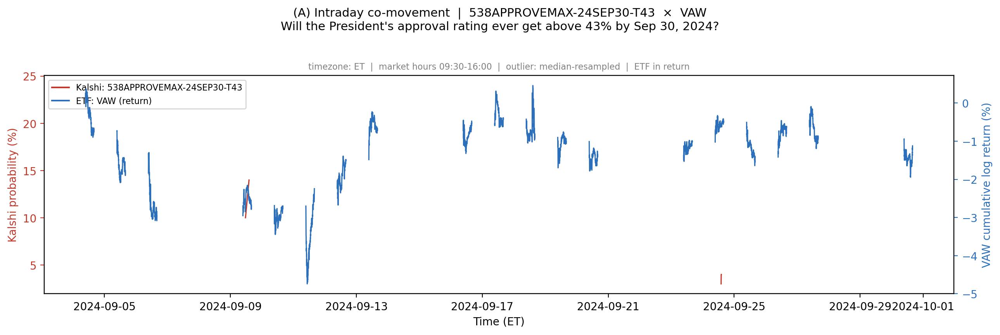
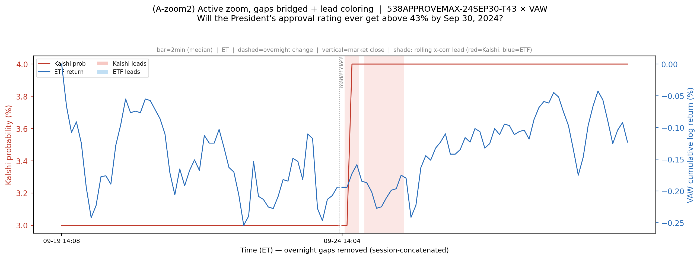
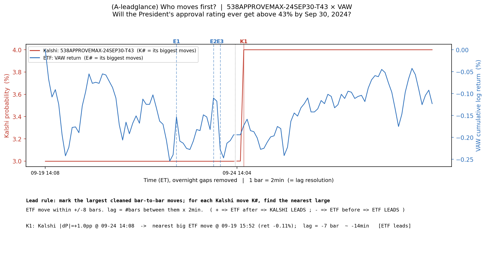
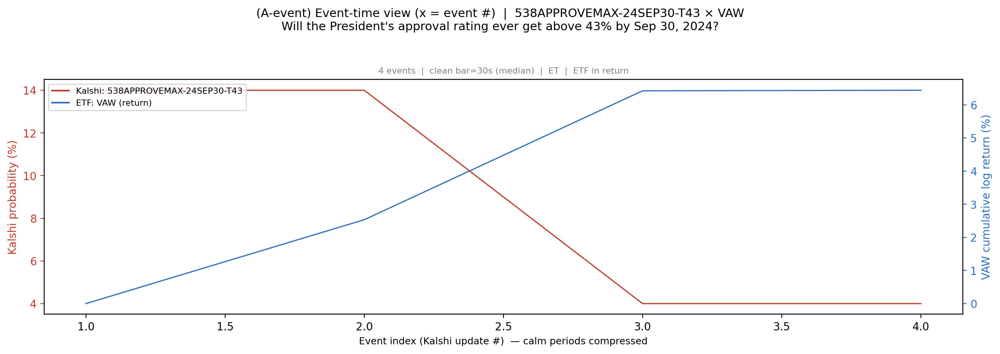


---

## Rank 40/48 — 538APPROVEMAX-24SEP30-T43 × VIS  (n_sig=0, best_p=n/a, n_trades=17)  (no regression result)

```text
PAIR ANALYSIS    —    Rank 40 / 48
================================================================================================
538APPROVEMAX-24SEP30-T43   x   VIS
Contract : "Will the President's approval rating ever get above 43% by Sep 30, 2024?"
Sector relevance : Election outcome (all sectors)
Window : 2024-09-04 to 2024-09-30     Kalshi trades : 17     primary bar : n/a     daily-screen R^2 : 0.38

>>> RELIABILITY:  Cannot-estimate   <<<   (see section 5; unreliable pairs still get figures, but read their problems in section 8)

DEFINITIONS
   xₜ₋ₖ = Kalshi yes-probability change, k bars before t   (1 bar = n/a)
   yₜ   = ETF log return over bar t
   calendar = full market-hours grid: x=0 in bars with no Kalshi trade (not dropped).
   k>0 => Kalshi leads ETF ;  k<0 => ETF leads Kalshi ;  k=0 => contemporaneous

1. CALENDAR-TIME REGRESSION (clock-time lags, full RTH grid)
   Full model:  yₜ = α + Σ(k) βₖ·xₜ₋ₖ + (ADL self-lags) + (day fixed effects)
   -> no regression result (insufficient data).

2. EVENT-TIME REGRESSION (event-count lags)
   Full model:  yₜ = α + Σ(k) βₖ·xₜ₋ₖ + (ADL self-lags) + (day fixed effects)
   -> no regression result (insufficient data).

3. FULL COEFFICIENT TABLE  (calendar primary bar  vs  event)
   (no coefficients in either mode)

4. DIRECTIONAL TEST (probit, ETF up/down)
   Model: P(ETFₜ up) = Φ(α + βₖ·xₜ₋ₖ),  one probit per lag k
   calendar: n/a
   event: n/a
   -> no significant directional predictability either mode (raw p<0.15).

5. DATA RELIABILITY (statistical, not a trade-count cutoff)
   Tier: Cannot-estimate
   (criterion = n_active: bars with an actual Kalshi move (x!=0) = the real sample that identifies the lead-lag. Full RTH grid makes n_obs large, so n_active is the honest size.)
   calendar(full RTH grid): not estimable (insufficient data)
   event: not estimable (insufficient data)
   => Neither axis is estimable: this pair has descriptive figures only, no reliable regression result.

6. COARSE-FREQUENCY ROBUSTNESS (re-run calendar at 30min / 60min)
    30min: not estimable (n_obs=1 < minimum) -- coarser bars have even fewer observations
    60min: not estimable (n_obs=1 < minimum) -- coarser bars have even fewer observations

7. VERDICT
   No lead-lag detected -- too sparse / no significant structure.
   (Note: this pair lacks the data to support reliable inference; the verdict above is descriptive only -- do not put it in the conclusions.)

8. FIGURE CAVEATS — figures are still drawn, but know their problems
   - Regression cannot be estimated: the lag-coefficient plot (B) shows 'no regression result'; only the time-series / zoom plots are descriptive.
   - Long flat Kalshi segments = NO TRADE in that span (not 'probability unchanged'); do not read lead direction from them.
   - Too few active bars: the red/blue lead shading in zoom2/segments and the K#/E# pairing in leadglance are illustrative only, with no statistical meaning.
   - Kalshi updates only on trades (flat line = no trade, NOT 'no change'); ETF mid refreshes continuously.

------------------------------------------------------------------------------------------------
Conventions: ET | 09:30-16:00 (forward windows capped to 16:00) | ETF in log return | median causal bars | full RTH grid | day-grouped lags (no overnight) | ADL self-control | significance = BH-FDR corrected.
Figures for this pair follow on the next page.
```

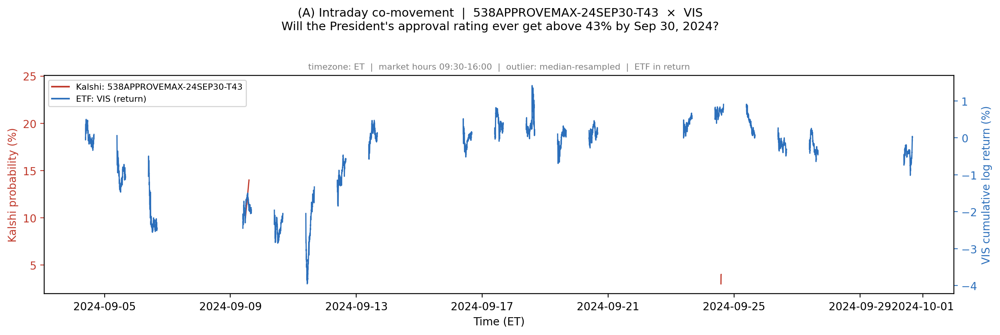
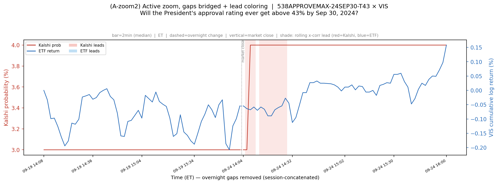
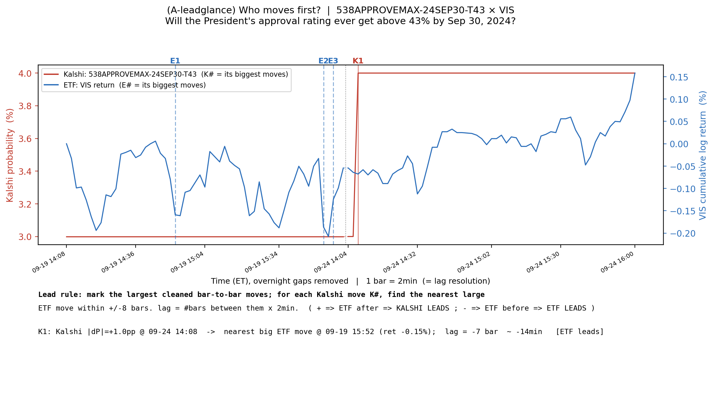


---

## Rank 41/48 — 538APPROVEMAX-24SEP30-T43 × VCR  (n_sig=0, best_p=n/a, n_trades=17)  (no regression result)

```text
PAIR ANALYSIS    —    Rank 41 / 48
================================================================================================
538APPROVEMAX-24SEP30-T43   x   VCR
Contract : "Will the President's approval rating ever get above 43% by Sep 30, 2024?"
Sector relevance : Election outcome (all sectors)
Window : 2024-09-04 to 2024-09-30     Kalshi trades : 17     primary bar : n/a     daily-screen R^2 : 0.27

>>> RELIABILITY:  Cannot-estimate   <<<   (see section 5; unreliable pairs still get figures, but read their problems in section 8)

DEFINITIONS
   xₜ₋ₖ = Kalshi yes-probability change, k bars before t   (1 bar = n/a)
   yₜ   = ETF log return over bar t
   calendar = full market-hours grid: x=0 in bars with no Kalshi trade (not dropped).
   k>0 => Kalshi leads ETF ;  k<0 => ETF leads Kalshi ;  k=0 => contemporaneous

1. CALENDAR-TIME REGRESSION (clock-time lags, full RTH grid)
   Full model:  yₜ = α + Σ(k) βₖ·xₜ₋ₖ + (ADL self-lags) + (day fixed effects)
   -> no regression result (insufficient data).

2. EVENT-TIME REGRESSION (event-count lags)
   Full model:  yₜ = α + Σ(k) βₖ·xₜ₋ₖ + (ADL self-lags) + (day fixed effects)
   -> no regression result (insufficient data).

3. FULL COEFFICIENT TABLE  (calendar primary bar  vs  event)
   (no coefficients in either mode)

4. DIRECTIONAL TEST (probit, ETF up/down)
   Model: P(ETFₜ up) = Φ(α + βₖ·xₜ₋ₖ),  one probit per lag k
   calendar: n/a
   event: n/a
   -> no significant directional predictability either mode (raw p<0.15).

5. DATA RELIABILITY (statistical, not a trade-count cutoff)
   Tier: Cannot-estimate
   (criterion = n_active: bars with an actual Kalshi move (x!=0) = the real sample that identifies the lead-lag. Full RTH grid makes n_obs large, so n_active is the honest size.)
   calendar(full RTH grid): not estimable (insufficient data)
   event: not estimable (insufficient data)
   => Neither axis is estimable: this pair has descriptive figures only, no reliable regression result.

6. COARSE-FREQUENCY ROBUSTNESS (re-run calendar at 30min / 60min)
    30min: not estimable (n_obs=1 < minimum) -- coarser bars have even fewer observations
    60min: not estimable (n_obs=1 < minimum) -- coarser bars have even fewer observations

7. VERDICT
   No lead-lag detected -- too sparse / no significant structure.
   (Note: this pair lacks the data to support reliable inference; the verdict above is descriptive only -- do not put it in the conclusions.)

8. FIGURE CAVEATS — figures are still drawn, but know their problems
   - Regression cannot be estimated: the lag-coefficient plot (B) shows 'no regression result'; only the time-series / zoom plots are descriptive.
   - Long flat Kalshi segments = NO TRADE in that span (not 'probability unchanged'); do not read lead direction from them.
   - Too few active bars: the red/blue lead shading in zoom2/segments and the K#/E# pairing in leadglance are illustrative only, with no statistical meaning.
   - Kalshi updates only on trades (flat line = no trade, NOT 'no change'); ETF mid refreshes continuously.

------------------------------------------------------------------------------------------------
Conventions: ET | 09:30-16:00 (forward windows capped to 16:00) | ETF in log return | median causal bars | full RTH grid | day-grouped lags (no overnight) | ADL self-control | significance = BH-FDR corrected.
Figures for this pair follow on the next page.
```

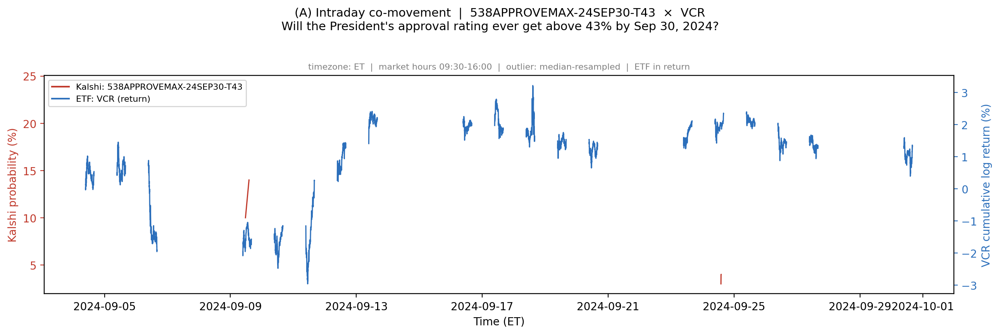
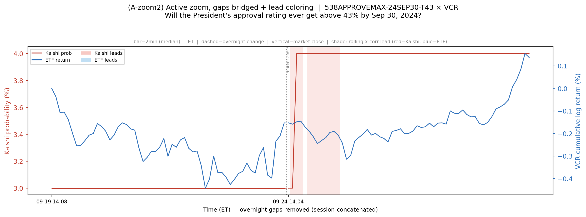
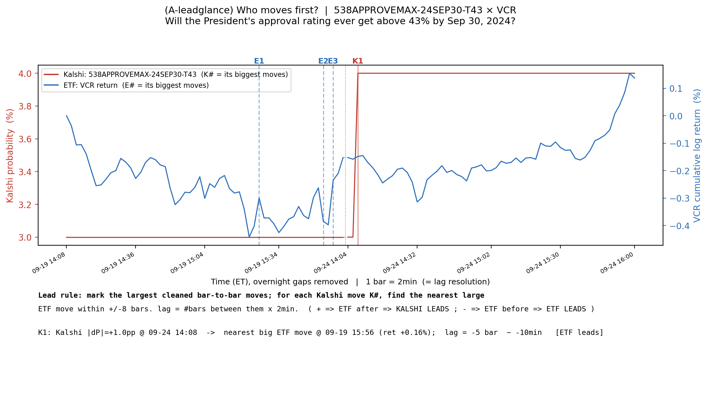
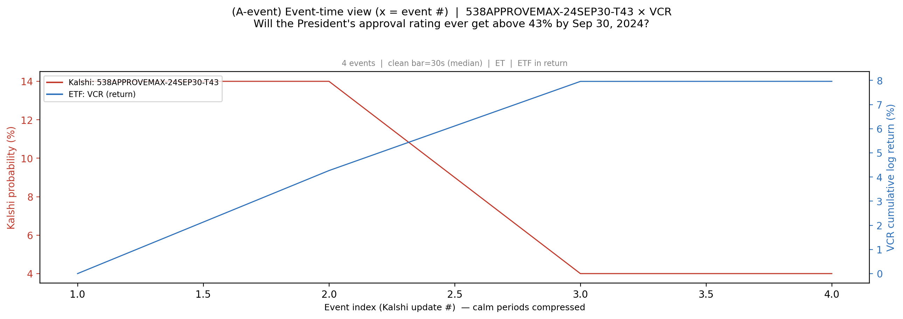


---

## Rank 42/48 — KX538APPROVEMAX-24NOV30-T41 × VGT  (n_sig=0, best_p=n/a, n_trades=13)  (no regression result)

```text
PAIR ANALYSIS    —    Rank 42 / 48
================================================================================================
KX538APPROVEMAX-24NOV30-T41   x   VGT
Contract : "Will the President's approval rating ever get above 41% by Nov 30, 2024?"
Sector relevance : Election outcome (all sectors)
Window : 2024-11-11 to 2024-11-25     Kalshi trades : 13     primary bar : n/a     daily-screen R^2 : 0.46

>>> RELIABILITY:  Cannot-estimate   <<<   (see section 5; unreliable pairs still get figures, but read their problems in section 8)

DEFINITIONS
   xₜ₋ₖ = Kalshi yes-probability change, k bars before t   (1 bar = n/a)
   yₜ   = ETF log return over bar t
   calendar = full market-hours grid: x=0 in bars with no Kalshi trade (not dropped).
   k>0 => Kalshi leads ETF ;  k<0 => ETF leads Kalshi ;  k=0 => contemporaneous

1. CALENDAR-TIME REGRESSION (clock-time lags, full RTH grid)
   Full model:  yₜ = α + Σ(k) βₖ·xₜ₋ₖ + (ADL self-lags) + (day fixed effects)
   -> no regression result (insufficient data).

2. EVENT-TIME REGRESSION (event-count lags)
   Full model:  yₜ = α + Σ(k) βₖ·xₜ₋ₖ + (ADL self-lags) + (day fixed effects)
   -> no regression result (insufficient data).

3. FULL COEFFICIENT TABLE  (calendar primary bar  vs  event)
   (no coefficients in either mode)

4. DIRECTIONAL TEST (probit, ETF up/down)
   Model: P(ETFₜ up) = Φ(α + βₖ·xₜ₋ₖ),  one probit per lag k
   calendar: n/a
   event: n/a
   -> no significant directional predictability either mode (raw p<0.15).

5. DATA RELIABILITY (statistical, not a trade-count cutoff)
   Tier: Cannot-estimate
   (criterion = n_active: bars with an actual Kalshi move (x!=0) = the real sample that identifies the lead-lag. Full RTH grid makes n_obs large, so n_active is the honest size.)
   calendar(full RTH grid): not estimable (insufficient data)
   event: not estimable (insufficient data)
   => Neither axis is estimable: this pair has descriptive figures only, no reliable regression result.

6. COARSE-FREQUENCY ROBUSTNESS (re-run calendar at 30min / 60min)
    30min: not estimable (n_obs=0 < minimum) -- coarser bars have even fewer observations
    60min: not estimable (n_obs=0 < minimum) -- coarser bars have even fewer observations

7. VERDICT
   No lead-lag detected -- too sparse / no significant structure.
   (Note: this pair lacks the data to support reliable inference; the verdict above is descriptive only -- do not put it in the conclusions.)

8. FIGURE CAVEATS — figures are still drawn, but know their problems
   - Regression cannot be estimated: the lag-coefficient plot (B) shows 'no regression result'; only the time-series / zoom plots are descriptive.
   - Long flat Kalshi segments = NO TRADE in that span (not 'probability unchanged'); do not read lead direction from them.
   - Too few active bars: the red/blue lead shading in zoom2/segments and the K#/E# pairing in leadglance are illustrative only, with no statistical meaning.
   - Kalshi updates only on trades (flat line = no trade, NOT 'no change'); ETF mid refreshes continuously.

------------------------------------------------------------------------------------------------
Conventions: ET | 09:30-16:00 (forward windows capped to 16:00) | ETF in log return | median causal bars | full RTH grid | day-grouped lags (no overnight) | ADL self-control | significance = BH-FDR corrected.
Figures for this pair follow on the next page.
```

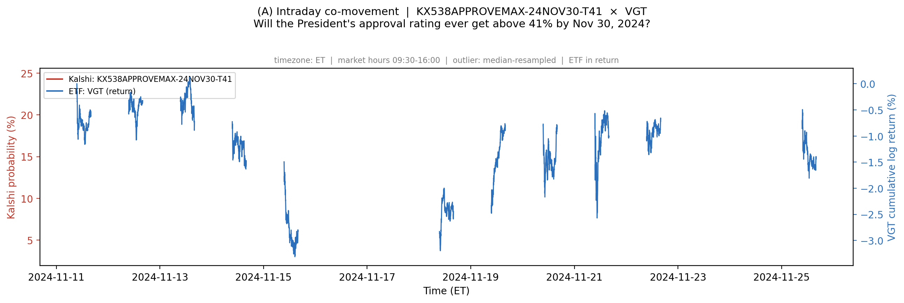
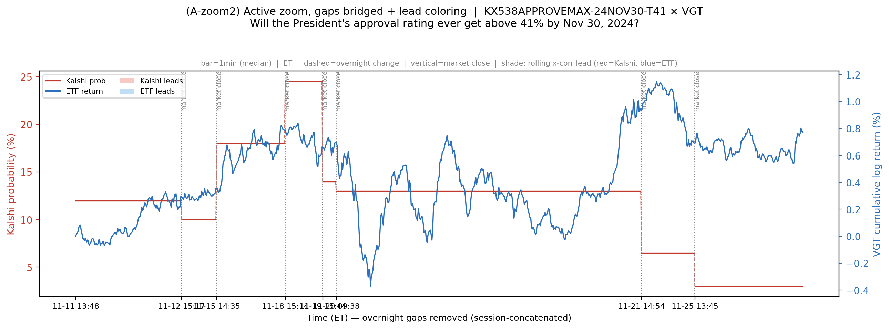
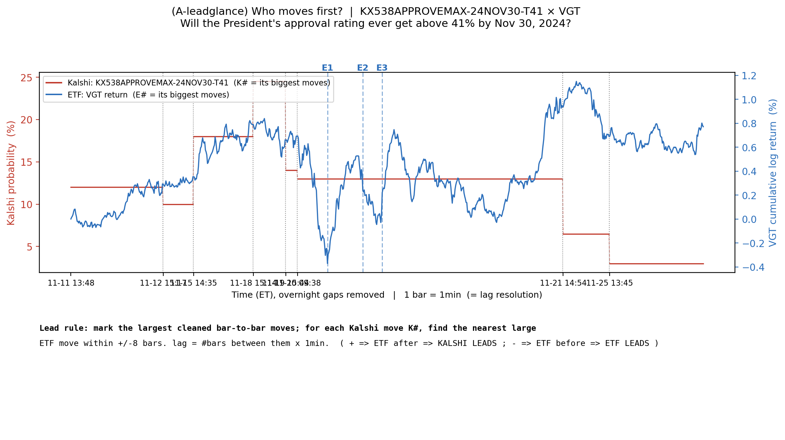


---

## Rank 43/48 — KX538APPROVEMAX-24NOV30-T41 × VHT  (n_sig=0, best_p=n/a, n_trades=13)  (no regression result)

```text
PAIR ANALYSIS    —    Rank 43 / 48
================================================================================================
KX538APPROVEMAX-24NOV30-T41   x   VHT
Contract : "Will the President's approval rating ever get above 41% by Nov 30, 2024?"
Sector relevance : Election outcome (all sectors)
Window : 2024-11-11 to 2024-11-25     Kalshi trades : 13     primary bar : n/a     daily-screen R^2 : 0.38

>>> RELIABILITY:  Cannot-estimate   <<<   (see section 5; unreliable pairs still get figures, but read their problems in section 8)

DEFINITIONS
   xₜ₋ₖ = Kalshi yes-probability change, k bars before t   (1 bar = n/a)
   yₜ   = ETF log return over bar t
   calendar = full market-hours grid: x=0 in bars with no Kalshi trade (not dropped).
   k>0 => Kalshi leads ETF ;  k<0 => ETF leads Kalshi ;  k=0 => contemporaneous

1. CALENDAR-TIME REGRESSION (clock-time lags, full RTH grid)
   Full model:  yₜ = α + Σ(k) βₖ·xₜ₋ₖ + (ADL self-lags) + (day fixed effects)
   -> no regression result (insufficient data).

2. EVENT-TIME REGRESSION (event-count lags)
   Full model:  yₜ = α + Σ(k) βₖ·xₜ₋ₖ + (ADL self-lags) + (day fixed effects)
   -> no regression result (insufficient data).

3. FULL COEFFICIENT TABLE  (calendar primary bar  vs  event)
   (no coefficients in either mode)

4. DIRECTIONAL TEST (probit, ETF up/down)
   Model: P(ETFₜ up) = Φ(α + βₖ·xₜ₋ₖ),  one probit per lag k
   calendar: n/a
   event: n/a
   -> no significant directional predictability either mode (raw p<0.15).

5. DATA RELIABILITY (statistical, not a trade-count cutoff)
   Tier: Cannot-estimate
   (criterion = n_active: bars with an actual Kalshi move (x!=0) = the real sample that identifies the lead-lag. Full RTH grid makes n_obs large, so n_active is the honest size.)
   calendar(full RTH grid): not estimable (insufficient data)
   event: not estimable (insufficient data)
   => Neither axis is estimable: this pair has descriptive figures only, no reliable regression result.

6. COARSE-FREQUENCY ROBUSTNESS (re-run calendar at 30min / 60min)
    30min: not estimable (n_obs=0 < minimum) -- coarser bars have even fewer observations
    60min: not estimable (n_obs=0 < minimum) -- coarser bars have even fewer observations

7. VERDICT
   No lead-lag detected -- too sparse / no significant structure.
   (Note: this pair lacks the data to support reliable inference; the verdict above is descriptive only -- do not put it in the conclusions.)

8. FIGURE CAVEATS — figures are still drawn, but know their problems
   - Regression cannot be estimated: the lag-coefficient plot (B) shows 'no regression result'; only the time-series / zoom plots are descriptive.
   - Long flat Kalshi segments = NO TRADE in that span (not 'probability unchanged'); do not read lead direction from them.
   - Too few active bars: the red/blue lead shading in zoom2/segments and the K#/E# pairing in leadglance are illustrative only, with no statistical meaning.
   - Kalshi updates only on trades (flat line = no trade, NOT 'no change'); ETF mid refreshes continuously.

------------------------------------------------------------------------------------------------
Conventions: ET | 09:30-16:00 (forward windows capped to 16:00) | ETF in log return | median causal bars | full RTH grid | day-grouped lags (no overnight) | ADL self-control | significance = BH-FDR corrected.
Figures for this pair follow on the next page.
```

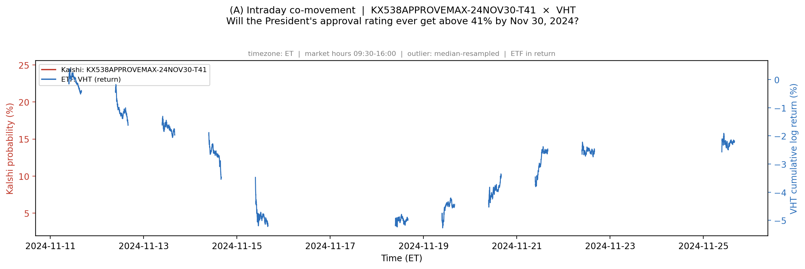
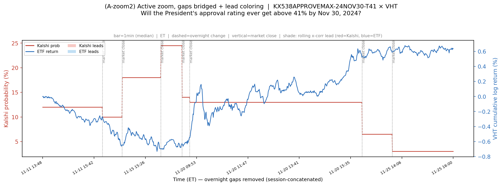
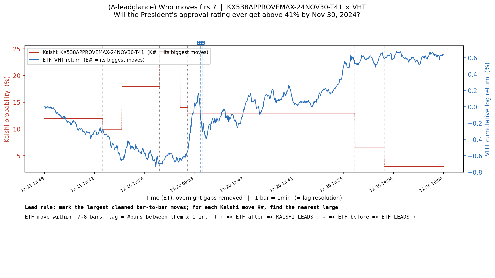


---

## Rank 44/48 — KXAAAGASM-24NOV30-US-3.30 × VFH  (n_sig=0, best_p=n/a, n_trades=7)  (no regression result)

```text
PAIR ANALYSIS    —    Rank 44 / 48
================================================================================================
KXAAAGASM-24NOV30-US-3.30   x   VFH
Contract : "Will average **gas prices** be above $3.30?"
Sector relevance : VDE (Energy)
Window : 2024-10-31 to 2024-11-20     Kalshi trades : 7     primary bar : n/a     daily-screen R^2 : 0.70

>>> RELIABILITY:  Cannot-estimate   <<<   (see section 5; unreliable pairs still get figures, but read their problems in section 8)

DEFINITIONS
   xₜ₋ₖ = Kalshi yes-probability change, k bars before t   (1 bar = n/a)
   yₜ   = ETF log return over bar t
   calendar = full market-hours grid: x=0 in bars with no Kalshi trade (not dropped).
   k>0 => Kalshi leads ETF ;  k<0 => ETF leads Kalshi ;  k=0 => contemporaneous

1. CALENDAR-TIME REGRESSION (clock-time lags, full RTH grid)
   Full model:  yₜ = α + Σ(k) βₖ·xₜ₋ₖ + (ADL self-lags) + (day fixed effects)
   -> no regression result (insufficient data).

2. EVENT-TIME REGRESSION (event-count lags)
   Full model:  yₜ = α + Σ(k) βₖ·xₜ₋ₖ + (ADL self-lags) + (day fixed effects)
   -> no regression result (insufficient data).

3. FULL COEFFICIENT TABLE  (calendar primary bar  vs  event)
   (no coefficients in either mode)

4. DIRECTIONAL TEST (probit, ETF up/down)
   Model: P(ETFₜ up) = Φ(α + βₖ·xₜ₋ₖ),  one probit per lag k
   calendar: n/a
   event: n/a
   -> no significant directional predictability either mode (raw p<0.15).

5. DATA RELIABILITY (statistical, not a trade-count cutoff)
   Tier: Cannot-estimate
   (criterion = n_active: bars with an actual Kalshi move (x!=0) = the real sample that identifies the lead-lag. Full RTH grid makes n_obs large, so n_active is the honest size.)
   calendar(full RTH grid): not estimable (insufficient data)
   event: not estimable (insufficient data)
   => Neither axis is estimable: this pair has descriptive figures only, no reliable regression result.

6. COARSE-FREQUENCY ROBUSTNESS (re-run calendar at 30min / 60min)
    30min: not estimable (n_obs=1 < minimum) -- coarser bars have even fewer observations
    60min: not estimable (n_obs=1 < minimum) -- coarser bars have even fewer observations

7. VERDICT
   No lead-lag detected -- too sparse / no significant structure.
   (Note: this pair lacks the data to support reliable inference; the verdict above is descriptive only -- do not put it in the conclusions.)

8. FIGURE CAVEATS — figures are still drawn, but know their problems
   - Regression cannot be estimated: the lag-coefficient plot (B) shows 'no regression result'; only the time-series / zoom plots are descriptive.
   - Long flat Kalshi segments = NO TRADE in that span (not 'probability unchanged'); do not read lead direction from them.
   - Too few active bars: the red/blue lead shading in zoom2/segments and the K#/E# pairing in leadglance are illustrative only, with no statistical meaning.
   - Kalshi updates only on trades (flat line = no trade, NOT 'no change'); ETF mid refreshes continuously.

------------------------------------------------------------------------------------------------
Conventions: ET | 09:30-16:00 (forward windows capped to 16:00) | ETF in log return | median causal bars | full RTH grid | day-grouped lags (no overnight) | ADL self-control | significance = BH-FDR corrected.
Figures for this pair follow on the next page.
```

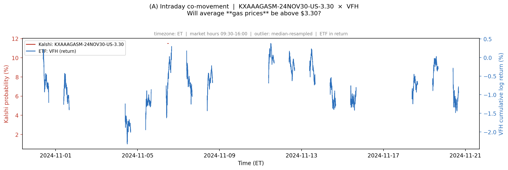
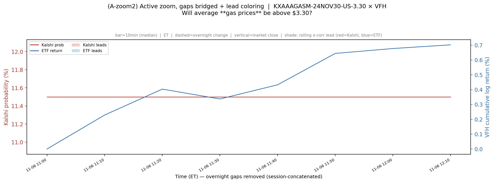
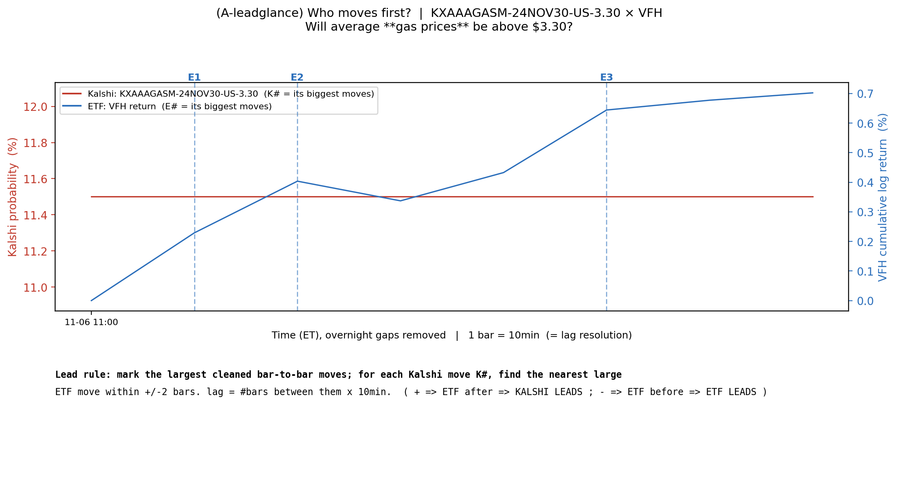


---

## Rank 45/48 — KXAAAGASM-24NOV30-US-3.30 × VDE  (n_sig=0, best_p=n/a, n_trades=7)  (no regression result)

```text
PAIR ANALYSIS    —    Rank 45 / 48
================================================================================================
KXAAAGASM-24NOV30-US-3.30   x   VDE
Contract : "Will average **gas prices** be above $3.30?"
Sector relevance : VDE (Energy)
Window : 2024-10-31 to 2024-11-20     Kalshi trades : 7     primary bar : n/a     daily-screen R^2 : 0.60

>>> RELIABILITY:  Cannot-estimate   <<<   (see section 5; unreliable pairs still get figures, but read their problems in section 8)

DEFINITIONS
   xₜ₋ₖ = Kalshi yes-probability change, k bars before t   (1 bar = n/a)
   yₜ   = ETF log return over bar t
   calendar = full market-hours grid: x=0 in bars with no Kalshi trade (not dropped).
   k>0 => Kalshi leads ETF ;  k<0 => ETF leads Kalshi ;  k=0 => contemporaneous

1. CALENDAR-TIME REGRESSION (clock-time lags, full RTH grid)
   Full model:  yₜ = α + Σ(k) βₖ·xₜ₋ₖ + (ADL self-lags) + (day fixed effects)
   -> no regression result (insufficient data).

2. EVENT-TIME REGRESSION (event-count lags)
   Full model:  yₜ = α + Σ(k) βₖ·xₜ₋ₖ + (ADL self-lags) + (day fixed effects)
   -> no regression result (insufficient data).

3. FULL COEFFICIENT TABLE  (calendar primary bar  vs  event)
   (no coefficients in either mode)

4. DIRECTIONAL TEST (probit, ETF up/down)
   Model: P(ETFₜ up) = Φ(α + βₖ·xₜ₋ₖ),  one probit per lag k
   calendar: n/a
   event: n/a
   -> no significant directional predictability either mode (raw p<0.15).

5. DATA RELIABILITY (statistical, not a trade-count cutoff)
   Tier: Cannot-estimate
   (criterion = n_active: bars with an actual Kalshi move (x!=0) = the real sample that identifies the lead-lag. Full RTH grid makes n_obs large, so n_active is the honest size.)
   calendar(full RTH grid): not estimable (insufficient data)
   event: not estimable (insufficient data)
   => Neither axis is estimable: this pair has descriptive figures only, no reliable regression result.

6. COARSE-FREQUENCY ROBUSTNESS (re-run calendar at 30min / 60min)
    30min: not estimable (n_obs=1 < minimum) -- coarser bars have even fewer observations
    60min: not estimable (n_obs=1 < minimum) -- coarser bars have even fewer observations

7. VERDICT
   No lead-lag detected -- too sparse / no significant structure.
   (Note: this pair lacks the data to support reliable inference; the verdict above is descriptive only -- do not put it in the conclusions.)

8. FIGURE CAVEATS — figures are still drawn, but know their problems
   - Regression cannot be estimated: the lag-coefficient plot (B) shows 'no regression result'; only the time-series / zoom plots are descriptive.
   - Long flat Kalshi segments = NO TRADE in that span (not 'probability unchanged'); do not read lead direction from them.
   - Too few active bars: the red/blue lead shading in zoom2/segments and the K#/E# pairing in leadglance are illustrative only, with no statistical meaning.
   - Kalshi updates only on trades (flat line = no trade, NOT 'no change'); ETF mid refreshes continuously.

------------------------------------------------------------------------------------------------
Conventions: ET | 09:30-16:00 (forward windows capped to 16:00) | ETF in log return | median causal bars | full RTH grid | day-grouped lags (no overnight) | ADL self-control | significance = BH-FDR corrected.
Figures for this pair follow on the next page.
```

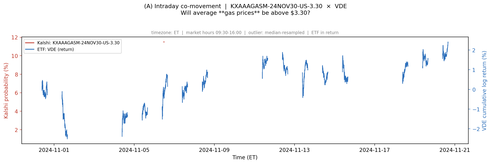
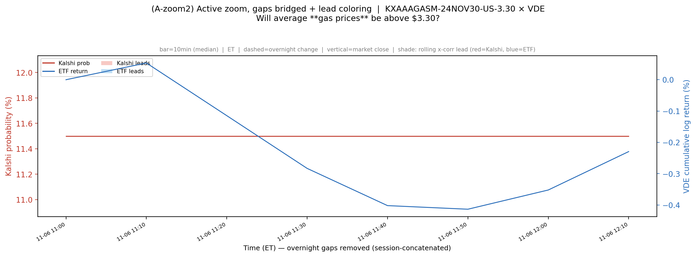
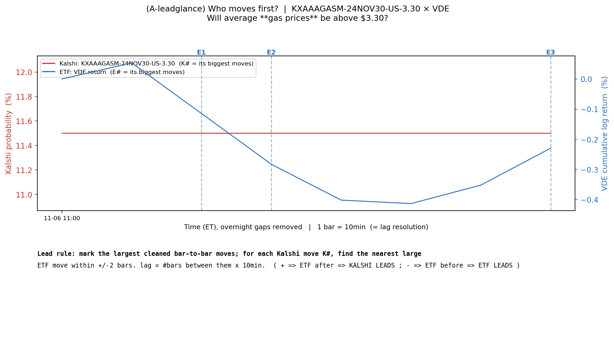
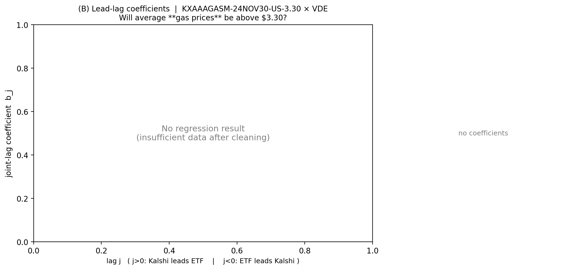

---

## Rank 46/48 — KXAAAGASM-24NOV30-US-3.30 × VDC  (n_sig=0, best_p=n/a, n_trades=7)  (no regression result)

```text
PAIR ANALYSIS    —    Rank 46 / 48
================================================================================================
KXAAAGASM-24NOV30-US-3.30   x   VDC
Contract : "Will average **gas prices** be above $3.30?"
Sector relevance : VDE (Energy)
Window : 2024-10-31 to 2024-11-20     Kalshi trades : 7     primary bar : n/a     daily-screen R^2 : 0.59

>>> RELIABILITY:  Cannot-estimate   <<<   (see section 5; unreliable pairs still get figures, but read their problems in section 8)

DEFINITIONS
   xₜ₋ₖ = Kalshi yes-probability change, k bars before t   (1 bar = n/a)
   yₜ   = ETF log return over bar t
   calendar = full market-hours grid: x=0 in bars with no Kalshi trade (not dropped).
   k>0 => Kalshi leads ETF ;  k<0 => ETF leads Kalshi ;  k=0 => contemporaneous

1. CALENDAR-TIME REGRESSION (clock-time lags, full RTH grid)
   Full model:  yₜ = α + Σ(k) βₖ·xₜ₋ₖ + (ADL self-lags) + (day fixed effects)
   -> no regression result (insufficient data).

2. EVENT-TIME REGRESSION (event-count lags)
   Full model:  yₜ = α + Σ(k) βₖ·xₜ₋ₖ + (ADL self-lags) + (day fixed effects)
   -> no regression result (insufficient data).

3. FULL COEFFICIENT TABLE  (calendar primary bar  vs  event)
   (no coefficients in either mode)

4. DIRECTIONAL TEST (probit, ETF up/down)
   Model: P(ETFₜ up) = Φ(α + βₖ·xₜ₋ₖ),  one probit per lag k
   calendar: n/a
   event: n/a
   -> no significant directional predictability either mode (raw p<0.15).

5. DATA RELIABILITY (statistical, not a trade-count cutoff)
   Tier: Cannot-estimate
   (criterion = n_active: bars with an actual Kalshi move (x!=0) = the real sample that identifies the lead-lag. Full RTH grid makes n_obs large, so n_active is the honest size.)
   calendar(full RTH grid): not estimable (insufficient data)
   event: not estimable (insufficient data)
   => Neither axis is estimable: this pair has descriptive figures only, no reliable regression result.

6. COARSE-FREQUENCY ROBUSTNESS (re-run calendar at 30min / 60min)
    30min: not estimable (n_obs=1 < minimum) -- coarser bars have even fewer observations
    60min: not estimable (n_obs=1 < minimum) -- coarser bars have even fewer observations

7. VERDICT
   No lead-lag detected -- too sparse / no significant structure.
   (Note: this pair lacks the data to support reliable inference; the verdict above is descriptive only -- do not put it in the conclusions.)

8. FIGURE CAVEATS — figures are still drawn, but know their problems
   - Regression cannot be estimated: the lag-coefficient plot (B) shows 'no regression result'; only the time-series / zoom plots are descriptive.
   - Long flat Kalshi segments = NO TRADE in that span (not 'probability unchanged'); do not read lead direction from them.
   - Too few active bars: the red/blue lead shading in zoom2/segments and the K#/E# pairing in leadglance are illustrative only, with no statistical meaning.
   - Kalshi updates only on trades (flat line = no trade, NOT 'no change'); ETF mid refreshes continuously.

------------------------------------------------------------------------------------------------
Conventions: ET | 09:30-16:00 (forward windows capped to 16:00) | ETF in log return | median causal bars | full RTH grid | day-grouped lags (no overnight) | ADL self-control | significance = BH-FDR corrected.
Figures for this pair follow on the next page.
```

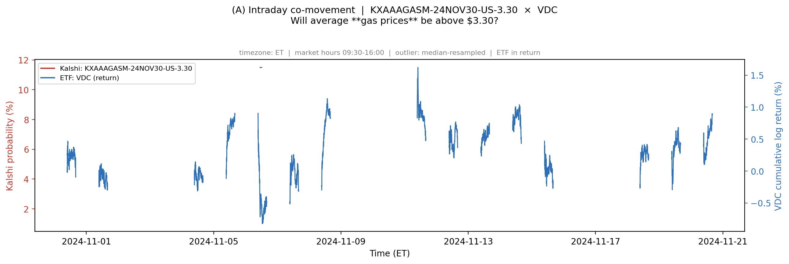
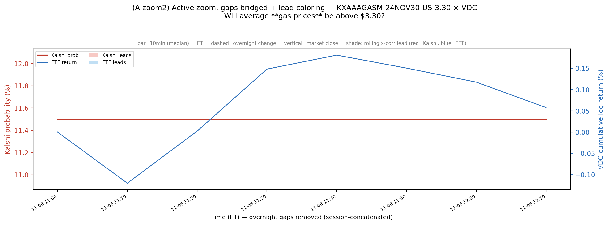
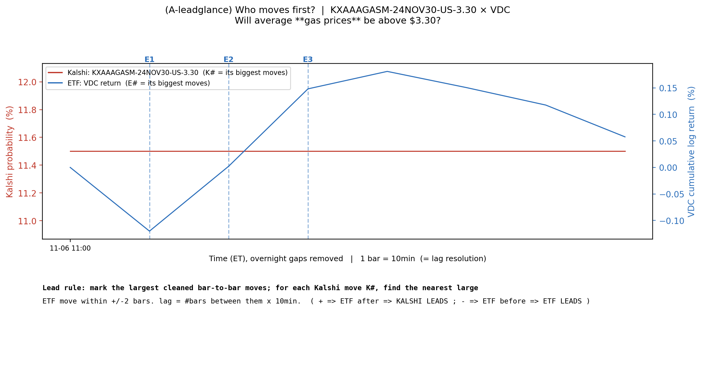


---

## Rank 47/48 — KXAAAGASM-24NOV30-US-3.30 × VNQ  (n_sig=0, best_p=n/a, n_trades=7)  (no regression result)

```text
PAIR ANALYSIS    —    Rank 47 / 48
================================================================================================
KXAAAGASM-24NOV30-US-3.30   x   VNQ
Contract : "Will average **gas prices** be above $3.30?"
Sector relevance : VDE (Energy)
Window : 2024-10-31 to 2024-11-20     Kalshi trades : 7     primary bar : n/a     daily-screen R^2 : 0.47

>>> RELIABILITY:  Cannot-estimate   <<<   (see section 5; unreliable pairs still get figures, but read their problems in section 8)

DEFINITIONS
   xₜ₋ₖ = Kalshi yes-probability change, k bars before t   (1 bar = n/a)
   yₜ   = ETF log return over bar t
   calendar = full market-hours grid: x=0 in bars with no Kalshi trade (not dropped).
   k>0 => Kalshi leads ETF ;  k<0 => ETF leads Kalshi ;  k=0 => contemporaneous

1. CALENDAR-TIME REGRESSION (clock-time lags, full RTH grid)
   Full model:  yₜ = α + Σ(k) βₖ·xₜ₋ₖ + (ADL self-lags) + (day fixed effects)
   -> no regression result (insufficient data).

2. EVENT-TIME REGRESSION (event-count lags)
   Full model:  yₜ = α + Σ(k) βₖ·xₜ₋ₖ + (ADL self-lags) + (day fixed effects)
   -> no regression result (insufficient data).

3. FULL COEFFICIENT TABLE  (calendar primary bar  vs  event)
   (no coefficients in either mode)

4. DIRECTIONAL TEST (probit, ETF up/down)
   Model: P(ETFₜ up) = Φ(α + βₖ·xₜ₋ₖ),  one probit per lag k
   calendar: n/a
   event: n/a
   -> no significant directional predictability either mode (raw p<0.15).

5. DATA RELIABILITY (statistical, not a trade-count cutoff)
   Tier: Cannot-estimate
   (criterion = n_active: bars with an actual Kalshi move (x!=0) = the real sample that identifies the lead-lag. Full RTH grid makes n_obs large, so n_active is the honest size.)
   calendar(full RTH grid): not estimable (insufficient data)
   event: not estimable (insufficient data)
   => Neither axis is estimable: this pair has descriptive figures only, no reliable regression result.

6. COARSE-FREQUENCY ROBUSTNESS (re-run calendar at 30min / 60min)
    30min: not estimable (n_obs=1 < minimum) -- coarser bars have even fewer observations
    60min: not estimable (n_obs=1 < minimum) -- coarser bars have even fewer observations

7. VERDICT
   No lead-lag detected -- too sparse / no significant structure.
   (Note: this pair lacks the data to support reliable inference; the verdict above is descriptive only -- do not put it in the conclusions.)

8. FIGURE CAVEATS — figures are still drawn, but know their problems
   - Regression cannot be estimated: the lag-coefficient plot (B) shows 'no regression result'; only the time-series / zoom plots are descriptive.
   - Long flat Kalshi segments = NO TRADE in that span (not 'probability unchanged'); do not read lead direction from them.
   - Too few active bars: the red/blue lead shading in zoom2/segments and the K#/E# pairing in leadglance are illustrative only, with no statistical meaning.
   - Kalshi updates only on trades (flat line = no trade, NOT 'no change'); ETF mid refreshes continuously.

------------------------------------------------------------------------------------------------
Conventions: ET | 09:30-16:00 (forward windows capped to 16:00) | ETF in log return | median causal bars | full RTH grid | day-grouped lags (no overnight) | ADL self-control | significance = BH-FDR corrected.
Figures for this pair follow on the next page.
```

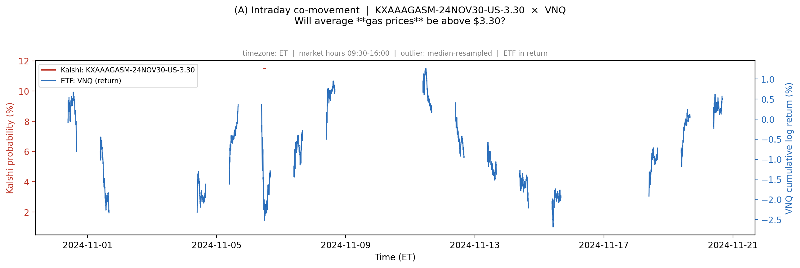
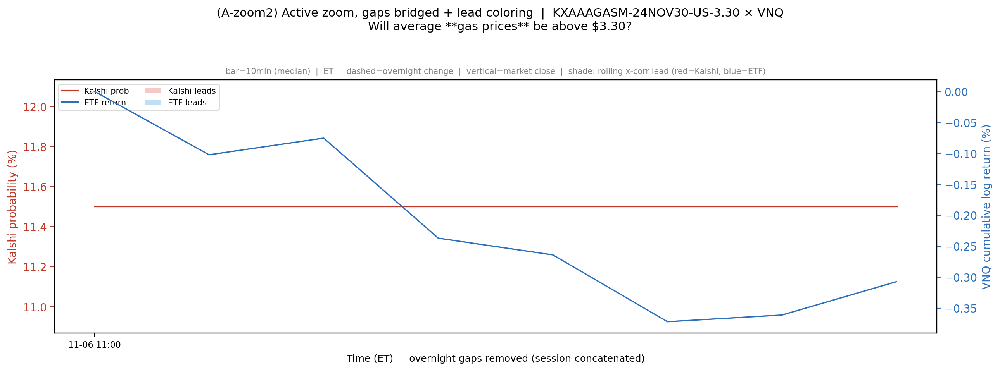
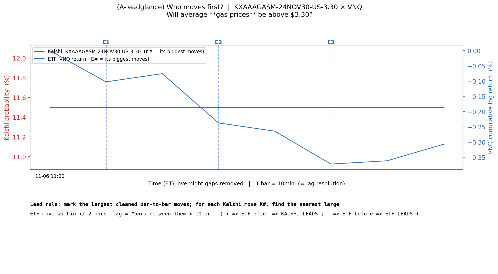


---

## Rank 48/48 — 538APPROVEMAX-24OCT31-T43 × VOX  (n_sig=0, best_p=n/a, n_trades=4)  (no regression result)

```text
PAIR ANALYSIS    —    Rank 48 / 48
================================================================================================
538APPROVEMAX-24OCT31-T43   x   VOX
Contract : "Will the President's approval rating ever get above 43% by Oct 31, 2024?"
Sector relevance : Election outcome (all sectors)
Window : 2024-10-07 to 2024-10-31     Kalshi trades : 4     primary bar : n/a     daily-screen R^2 : 0.70

>>> RELIABILITY:  Cannot-estimate   <<<   (see section 5; unreliable pairs still get figures, but read their problems in section 8)

DEFINITIONS
   xₜ₋ₖ = Kalshi yes-probability change, k bars before t   (1 bar = n/a)
   yₜ   = ETF log return over bar t
   calendar = full market-hours grid: x=0 in bars with no Kalshi trade (not dropped).
   k>0 => Kalshi leads ETF ;  k<0 => ETF leads Kalshi ;  k=0 => contemporaneous

1. CALENDAR-TIME REGRESSION (clock-time lags, full RTH grid)
   Full model:  yₜ = α + Σ(k) βₖ·xₜ₋ₖ + (ADL self-lags) + (day fixed effects)
   -> no regression result (insufficient data).

2. EVENT-TIME REGRESSION (event-count lags)
   Full model:  yₜ = α + Σ(k) βₖ·xₜ₋ₖ + (ADL self-lags) + (day fixed effects)
   -> no regression result (insufficient data).

3. FULL COEFFICIENT TABLE  (calendar primary bar  vs  event)
   (no coefficients in either mode)

4. DIRECTIONAL TEST (probit, ETF up/down)
   Model: P(ETFₜ up) = Φ(α + βₖ·xₜ₋ₖ),  one probit per lag k
   calendar: n/a
   event: n/a
   -> no significant directional predictability either mode (raw p<0.15).

5. DATA RELIABILITY (statistical, not a trade-count cutoff)
   Tier: Cannot-estimate
   (criterion = n_active: bars with an actual Kalshi move (x!=0) = the real sample that identifies the lead-lag. Full RTH grid makes n_obs large, so n_active is the honest size.)
   calendar(full RTH grid): not estimable (insufficient data)
   event: not estimable (insufficient data)
   => Neither axis is estimable: this pair has descriptive figures only, no reliable regression result.

6. COARSE-FREQUENCY ROBUSTNESS (re-run calendar at 30min / 60min)
    30min: not estimable (n_obs=1 < minimum) -- coarser bars have even fewer observations
    60min: not estimable (n_obs=0 < minimum) -- coarser bars have even fewer observations

7. VERDICT
   No lead-lag detected -- too sparse / no significant structure.
   (Note: this pair lacks the data to support reliable inference; the verdict above is descriptive only -- do not put it in the conclusions.)

8. FIGURE CAVEATS — figures are still drawn, but know their problems
   - Regression cannot be estimated: the lag-coefficient plot (B) shows 'no regression result'; only the time-series / zoom plots are descriptive.
   - Long flat Kalshi segments = NO TRADE in that span (not 'probability unchanged'); do not read lead direction from them.
   - Too few active bars: the red/blue lead shading in zoom2/segments and the K#/E# pairing in leadglance are illustrative only, with no statistical meaning.
   - Kalshi updates only on trades (flat line = no trade, NOT 'no change'); ETF mid refreshes continuously.

------------------------------------------------------------------------------------------------
Conventions: ET | 09:30-16:00 (forward windows capped to 16:00) | ETF in log return | median causal bars | full RTH grid | day-grouped lags (no overnight) | ADL self-control | significance = BH-FDR corrected.
Figures for this pair follow on the next page.
```

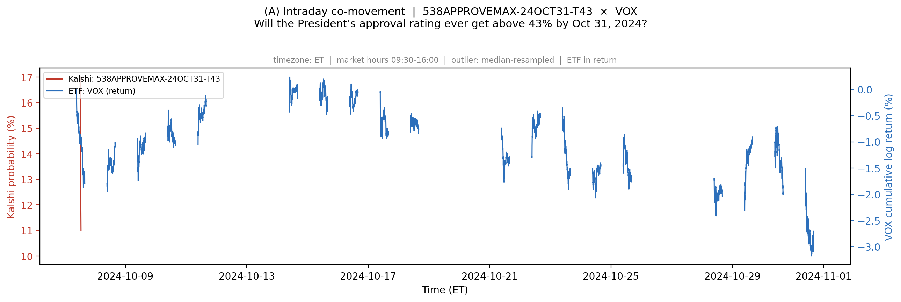
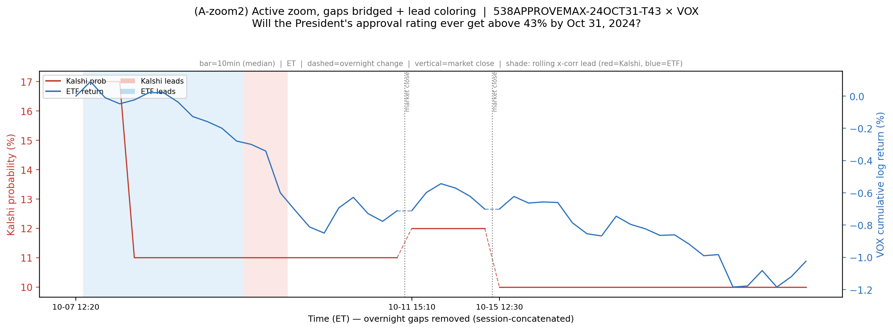
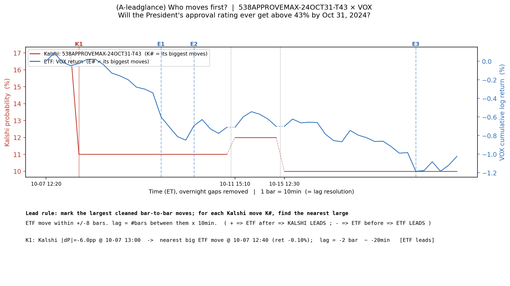
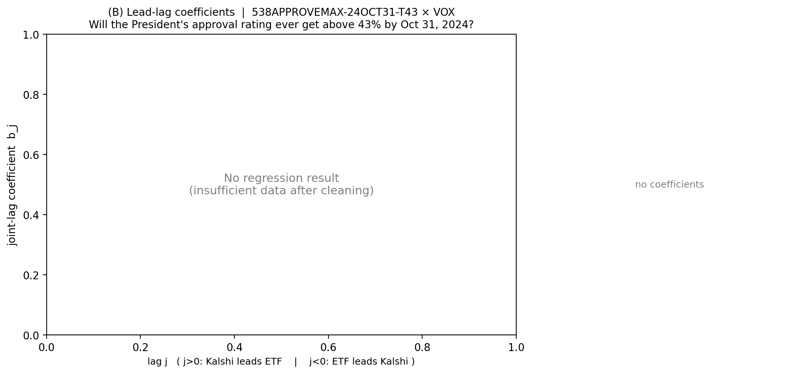

---

## MERGE — super-signals (pooled, sign-aligned Δprob; ADL self-lags by BIC)

### MERGE — ELECTION_trump_fav

```text
MERGE super-signal:  ELECTION_trump_fav

Members pooled (sign-aligned Δprob, never concatenated price levels):
  +  KXECDJT281, KXECDJT306, KXECDJT312, KXECDJT316
  -  KXECKH276, KXECKH287   (reverse contracts: Δprob flipped so +Δ = same direction)
Relevant-ETF union (9): VAW, VCR, VDC, VDE, VFH, VGT, VIS, VNQ, VOX

Pooling engine: per-member lag/ADL shift, member fixed effects, day-clustered SE;
ADL self-lag order chosen per pooled regression by BIC (column n_ylags).
Direction counts below use RAW p (same graded-threshold convention as the single-pair report).

== CALENDAR (primary bar) ==
ETF      K  ADL   n_obs   Kalshi-leads(k>0) / ETF-leads(k<0)
VAW      6    1     631   p<0.05: K1/E1  p<0.10: K1/E1  p<0.15: K2/E1
VCR      6    3     631   p<0.05: K0/E2  p<0.10: K0/E3  p<0.15: K0/E4
VDC      6    1     631   p<0.05: K2/E4  p<0.10: K2/E4  p<0.15: K3/E4
VDE      6    1     631   p<0.05: K4/E3  p<0.10: K4/E3  p<0.15: K4/E3
VFH      6    1     631   p<0.05: K0/E0  p<0.10: K1/E1  p<0.15: K1/E2
VGT      6    4     631   p<0.05: K2/E1  p<0.10: K2/E1  p<0.15: K2/E1
VIS      6    6     631   p<0.05: K3/E2  p<0.10: K3/E2  p<0.15: K4/E2
VNQ      6    3     631   p<0.05: K4/E3  p<0.10: K4/E3  p<0.15: K4/E3
VOX      6    1     631   p<0.05: K1/E3  p<0.10: K1/E4  p<0.15: K1/E5

== EVENT (active-event subsequence) ==
ETF      K  ADL   n_obs   Kalshi-leads(k>0) / ETF-leads(k<0)
VAW      8    0      62   p<0.05: K1/E1  p<0.10: K3/E3  p<0.15: K3/E4
VCR      8    0      62   p<0.05: K3/E5  p<0.10: K4/E5  p<0.15: K6/E5
VDC      8    1      62   p<0.05: K3/E2  p<0.10: K4/E2  p<0.15: K4/E3
VDE      8    0      62   p<0.05: K5/E6  p<0.10: K6/E6  p<0.15: K6/E6
VFH      8    1      62   p<0.05: K4/E4  p<0.10: K5/E5  p<0.15: K6/E5
VGT      8    0      62   p<0.05: K3/E3  p<0.10: K4/E4  p<0.15: K4/E4
VIS      8    2      62   p<0.05: K7/E1  p<0.10: K7/E1  p<0.15: K7/E1
VNQ      8    0      62   p<0.05: K3/E3  p<0.10: K3/E3  p<0.15: K3/E3
VOX      8    0      62   p<0.05: K1/E1  p<0.10: K3/E2  p<0.15: K3/E2

== PROBIT (direction test Pr(ETF up)) ==
ETF      K  ADL   n_obs   Kalshi-leads(k>0) / ETF-leads(k<0)
VAW      8    -      97   p<0.05: K7/E7  p<0.10: K7/E8  p<0.15: K7/E8
VCR      8    -      97   p<0.05: K7/E8  p<0.10: K7/E8  p<0.15: K8/E8
VDC      8    -      95   p<0.05: K7/E7  p<0.10: K10/E8  p<0.15: K12/E8
VDE      8    -      96   p<0.05: K5/E6  p<0.10: K6/E8  p<0.15: K6/E9
VFH      8    -      91   p<0.05: K4/E3  p<0.10: K8/E5  p<0.15: K9/E6
VGT      8    -      98   p<0.05: K7/E6  p<0.10: K9/E9  p<0.15: K9/E10
VIS      8    -      97   p<0.05: K7/E4  p<0.10: K7/E7  p<0.15: K8/E7
VNQ      8    -      95   p<0.05: K3/E7  p<0.10: K7/E9  p<0.15: K8/E9
VOX      8    -      94   p<0.05: K8/E9  p<0.10: K8/E9  p<0.15: K10/E10

== Conclusion (calendar+event pooled across the group's ETFs) ==
  p<0.05: Kalshi-leads (K189/E187) | p<0.10: Kalshi-leads (K214/E210) | p<0.15: Kalshi-leads (K234/E229)
  Read alongside the single-pair tally; pooling buys df but the lead is in the sign, not magnitude.
```

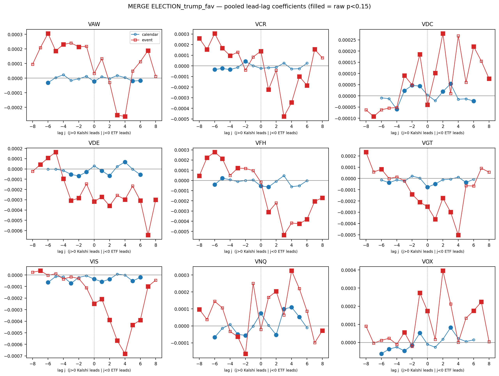

### MERGE — FOMC_easing

```text
MERGE super-signal:  FOMC_easing

Members pooled (sign-aligned Δprob, never concatenated price levels):
  +  FEDDECISION-24SEP-C25, RATECUT-24SEP18, KXFEDDECISION-24DEC-C25
  -  FEDDECISION-24NOV-H0, KXFEDDECISION-24DEC-H0   (reverse contracts: Δprob flipped so +Δ = same direction)
Relevant-ETF union (9): VCR, VDC, VDE, VFH, VGT, VIS, VNQ, VOX, VPU

Pooling engine: per-member lag/ADL shift, member fixed effects, day-clustered SE;
ADL self-lag order chosen per pooled regression by BIC (column n_ylags).
Direction counts below use RAW p (same graded-threshold convention as the single-pair report).

== CALENDAR (primary bar) ==
ETF      K  ADL   n_obs   Kalshi-leads(k>0) / ETF-leads(k<0)
VCR     10    1    1513   p<0.05: K0/E0  p<0.10: K1/E1  p<0.15: K1/E2
VDC     10    1    1513   p<0.05: K2/E2  p<0.10: K3/E3  p<0.15: K4/E4
VDE     10    0    1513   p<0.05: K2/E2  p<0.10: K3/E2  p<0.15: K4/E3
VFH     10    1    1513   p<0.05: K1/E1  p<0.10: K1/E1  p<0.15: K1/E1
VGT     10    2    1517   p<0.05: K1/E1  p<0.10: K1/E1  p<0.15: K2/E2
VIS     10    0    1513   p<0.05: K1/E2  p<0.10: K1/E2  p<0.15: K2/E2
VNQ     10    1    1517   p<0.05: K3/E1  p<0.10: K3/E1  p<0.15: K3/E2
VOX     10    1    1513   p<0.05: K2/E0  p<0.10: K2/E1  p<0.15: K3/E1
VPU     10    1    1513   p<0.05: K1/E3  p<0.10: K2/E3  p<0.15: K2/E4

== EVENT (active-event subsequence) ==
ETF      K  ADL   n_obs   Kalshi-leads(k>0) / ETF-leads(k<0)
VCR     10    1     547   p<0.05: K0/E1  p<0.10: K0/E1  p<0.15: K0/E1
VDC     10    1     547   p<0.05: K1/E0  p<0.10: K2/E1  p<0.15: K3/E1
VDE     10    0     547   p<0.05: K0/E1  p<0.10: K0/E1  p<0.15: K2/E4
VFH     10    1     547   p<0.05: K0/E0  p<0.10: K1/E0  p<0.15: K1/E0
VGT     10    1     547   p<0.05: K0/E1  p<0.10: K1/E1  p<0.15: K2/E1
VIS     10    1     547   p<0.05: K0/E0  p<0.10: K0/E1  p<0.15: K1/E1
VNQ     10    1     547   p<0.05: K1/E1  p<0.10: K2/E1  p<0.15: K2/E1
VOX     10    1     547   p<0.05: K1/E1  p<0.10: K3/E1  p<0.15: K3/E3
VPU     10    0     547   p<0.05: K0/E1  p<0.10: K1/E2  p<0.15: K3/E3

== PROBIT (direction test Pr(ETF up)) ==
ETF      K  ADL   n_obs   Kalshi-leads(k>0) / ETF-leads(k<0)
VCR     10    -     528   p<0.05: K3/E0  p<0.10: K4/E2  p<0.15: K5/E3
VDC     10    -     524   p<0.05: K1/E2  p<0.10: K3/E2  p<0.15: K3/E3
VDE     10    -     518   p<0.05: K0/E2  p<0.10: K3/E4  p<0.15: K4/E5
VFH     10    -     504   p<0.05: K4/E2  p<0.10: K6/E2  p<0.15: K8/E4
VGT     10    -     530   p<0.05: K2/E2  p<0.10: K4/E3  p<0.15: K4/E3
VIS     10    -     522   p<0.05: K1/E3  p<0.10: K3/E5  p<0.15: K5/E6
VNQ     10    -     507   p<0.05: K5/E3  p<0.10: K6/E4  p<0.15: K7/E5
VOX     10    -     511   p<0.05: K0/E0  p<0.10: K3/E1  p<0.15: K3/E3
VPU     10    -     519   p<0.05: K4/E2  p<0.10: K5/E3  p<0.15: K5/E5

== Conclusion (calendar+event pooled across the group's ETFs) ==
  p<0.05: ETF-leads (K54/E55) | p<0.10: Kalshi-leads (K85/E80) | p<0.15: ETF-leads (K105/E114)
  Read alongside the single-pair tally; pooling buys df but the lead is in the sign, not magnitude.
```

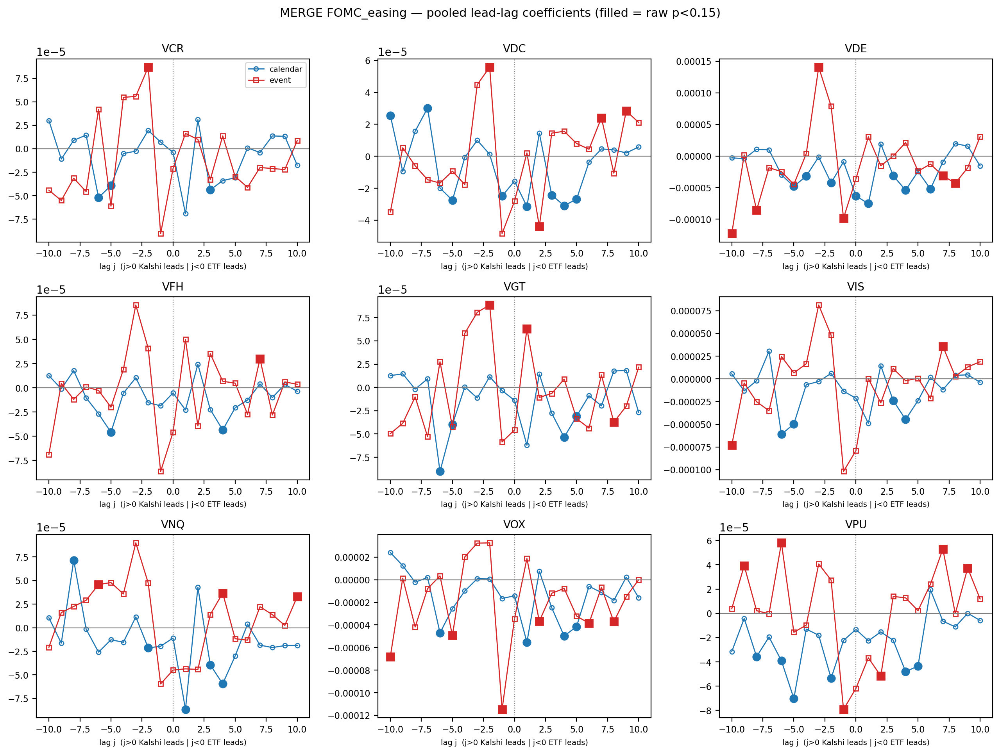

### MERGE — GAS_above

```text
MERGE super-signal:  GAS_above

Members pooled (sign-aligned Δprob, never concatenated price levels):
  +  AAAGASM-24OCT31-US-3.15, AAAGASM-24OCT31-US-3.20, AAAGASM-24SEP30-US-3.15, KXAAAGASM-24NOV30-US-3.30
  -  (none)
Relevant-ETF union (11): VAW, VCR, VDC, VDE, VFH, VGT, VHT, VIS, VNQ, VOX, VPU

Pooling engine: per-member lag/ADL shift, member fixed effects, day-clustered SE;
ADL self-lag order chosen per pooled regression by BIC (column n_ylags).
Direction counts below use RAW p (same graded-threshold convention as the single-pair report).

== CALENDAR (primary bar) ==
ETF      K  ADL   n_obs   Kalshi-leads(k>0) / ETF-leads(k<0)
VAW      4    1     334   p<0.05: K1/E0  p<0.10: K1/E0  p<0.15: K2/E1
VCR      4    3     334   p<0.05: K2/E1  p<0.10: K4/E1  p<0.15: K4/E1
VDC      4    2     334   p<0.05: K3/E2  p<0.10: K4/E2  p<0.15: K4/E2
VDE      4    1     334   p<0.05: K1/E0  p<0.10: K1/E0  p<0.15: K1/E0
VFH      4    1     334   p<0.05: K0/E1  p<0.10: K1/E1  p<0.15: K1/E1
VGT      4    1     334   p<0.05: K3/E3  p<0.10: K4/E3  p<0.15: K4/E3
VHT      4    1     334   p<0.05: K4/E1  p<0.10: K4/E1  p<0.15: K4/E1
VIS      4    1     334   p<0.05: K2/E2  p<0.10: K2/E3  p<0.15: K2/E3
VNQ      4    0     334   p<0.05: K1/E1  p<0.10: K1/E1  p<0.15: K1/E1
VOX      4    1     334   p<0.05: K2/E2  p<0.10: K3/E3  p<0.15: K4/E3
VPU      4    1     334   p<0.05: K2/E2  p<0.10: K3/E2  p<0.15: K3/E2

== EVENT (active-event subsequence) ==
ETF      K  ADL   n_obs   Kalshi-leads(k>0) / ETF-leads(k<0)
VAW      -    -        -   (no result)
VCR      -    -        -   (no result)
VDC      -    -        -   (no result)
VDE      -    -        -   (no result)
VFH      -    -        -   (no result)
VGT      -    -        -   (no result)
VHT      -    -        -   (no result)
VIS      -    -        -   (no result)
VNQ      -    -        -   (no result)
VOX      -    -        -   (no result)
VPU      -    -        -   (no result)

== PROBIT (direction test Pr(ETF up)) ==
ETF      K  ADL   n_obs   Kalshi-leads(k>0) / ETF-leads(k<0)
VAW      -    -        -   (no result)
VCR      -    -        -   (no result)
VDC      -    -        -   (no result)
VDE      -    -        -   (no result)
VFH      -    -        -   (no result)
VGT      -    -        -   (no result)
VHT      -    -        -   (no result)
VIS      -    -        -   (no result)
VNQ      -    -        -   (no result)
VOX      -    -        -   (no result)
VPU      -    -        -   (no result)

== Conclusion (calendar+event pooled across the group's ETFs) ==
  p<0.05: Kalshi-leads (K75/E69) | p<0.10: Kalshi-leads (K92/E78) | p<0.15: Kalshi-leads (K102/E89)
  Read alongside the single-pair tally; pooling buys df but the lead is in the sign, not magnitude.
```

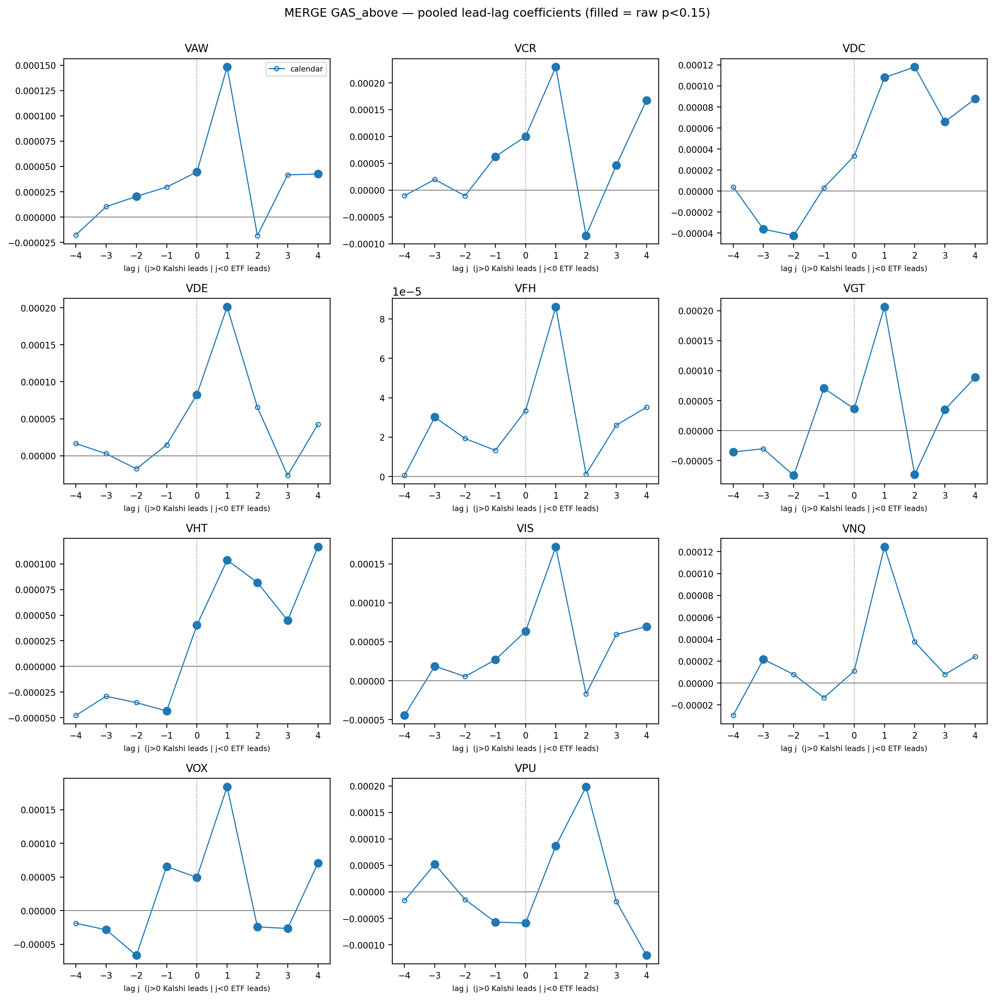

### MERGE — APPROVAL_strength

```text
MERGE super-signal:  APPROVAL_strength

Members pooled (sign-aligned Δprob, never concatenated price levels):
  +  538APPROVEMAX-24OCT31-T43, 538APPROVEMAX-24SEP30-T43, KX538APPROVEMAX-24NOV30-T41
  -  KX538APPROVEMIN-24NOV30-T37   (reverse contracts: Δprob flipped so +Δ = same direction)
Relevant-ETF union (8): VAW, VCR, VFH, VGT, VHT, VIS, VNQ, VOX

Pooling engine: per-member lag/ADL shift, member fixed effects, day-clustered SE;
ADL self-lag order chosen per pooled regression by BIC (column n_ylags).
Direction counts below use RAW p (same graded-threshold convention as the single-pair report).

== CALENDAR (primary bar) ==
ETF      K  ADL   n_obs   Kalshi-leads(k>0) / ETF-leads(k<0)
VAW      3    1    7058   p<0.05: K8/E0  p<0.10: K8/E1  p<0.15: K8/E2
VCR      3    1    7058   p<0.05: K0/E0  p<0.10: K2/E0  p<0.15: K2/E0
VFH      3    1    7059   p<0.05: K0/E2  p<0.10: K0/E2  p<0.15: K0/E2
VGT      3    1    7345   p<0.05: K5/E2  p<0.10: K5/E2  p<0.15: K7/E2
VHT      3    1    7188   p<0.05: K1/E1  p<0.10: K1/E1  p<0.15: K1/E1
VIS      3    1    7058   p<0.05: K2/E1  p<0.10: K2/E1  p<0.15: K4/E1
VNQ      3    1    7342   p<0.05: K1/E4  p<0.10: K2/E6  p<0.15: K2/E6
VOX      3    1    7091   p<0.05: K2/E1  p<0.10: K3/E1  p<0.15: K4/E2

== EVENT (active-event subsequence) ==
ETF      K  ADL   n_obs   Kalshi-leads(k>0) / ETF-leads(k<0)
VAW      -    -        -   (no result)
VCR      -    -        -   (no result)
VFH      -    -        -   (no result)
VGT      -    -        -   (no result)
VHT      -    -        -   (no result)
VIS      -    -        -   (no result)
VNQ      -    -        -   (no result)
VOX      -    -        -   (no result)

== PROBIT (direction test Pr(ETF up)) ==
ETF      K  ADL   n_obs   Kalshi-leads(k>0) / ETF-leads(k<0)
VAW      -    -        -   (no result)
VCR      -    -        -   (no result)
VFH      -    -        -   (no result)
VGT      -    -        -   (no result)
VHT      -    -        -   (no result)
VIS      -    -        -   (no result)
VNQ      -    -        -   (no result)
VOX      -    -        -   (no result)

== Conclusion (calendar+event pooled across the group's ETFs) ==
  p<0.05: Kalshi-leads (K19/E11) | p<0.10: Kalshi-leads (K23/E14) | p<0.15: Kalshi-leads (K28/E16)
  Read alongside the single-pair tally; pooling buys df but the lead is in the sign, not magnitude.
```

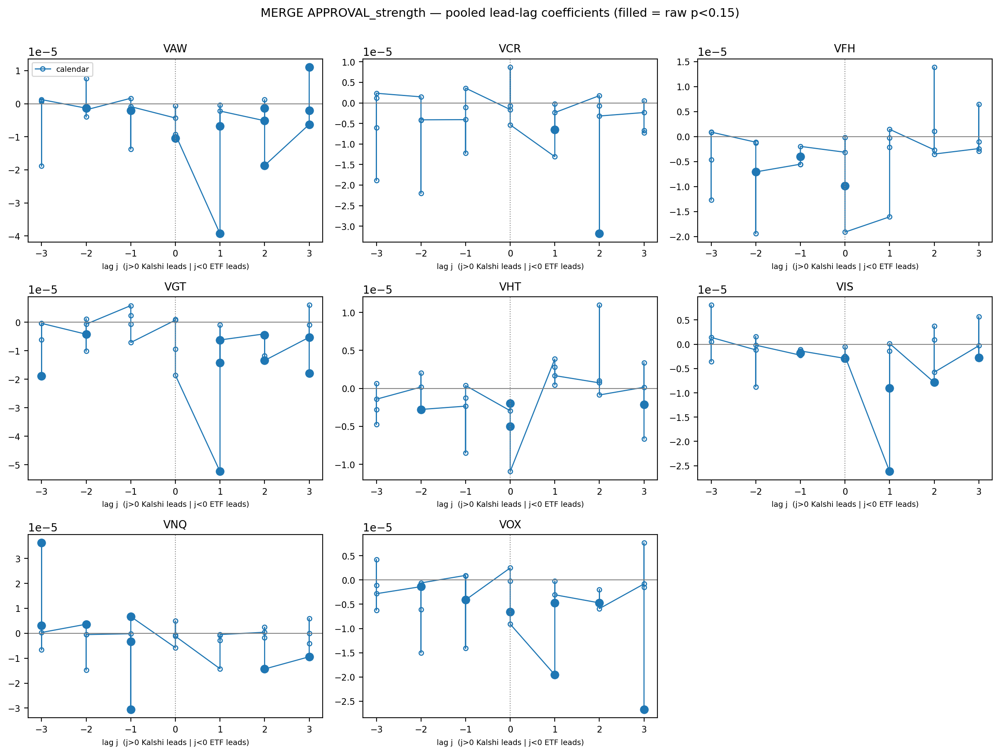
