# Lead-Lag Report — Kalshi prediction markets × Vanguard sector ETFs

_This Markdown mirrors `leadlag_pairs_report.pdf` in the same order: overview, then 48 ranked single pairs (each: text analysis + figures). Merged super-signals live in their own report (`leadlag_merge_report.md`). Figures are the very PNGs the PDF embeds; text blocks are the same `.md` sources._

**Ranking order:** has_result → n_trades → n_sig (raw p<0.15) → best_p.  **Per-pair significance:** raw p<0.15.  **ADL ETF self-lags:** chosen per pair by BIC.

---

## OVERVIEW — conclusions (graded thresholds p<0.05 / 0.10 / 0.15)

````text
# Lead/Lag classification summary

Scope: all 48 pairs (Kalshi contract x ETF). Lean rule: across calendar+event, count
significant lags at p<0.05 / 0.10 / 0.15 (raw p; nested, p<0.05 ⊆ p<0.10 ⊆ p<0.15) per
direction (k>0 Kalshi-leads, k<0 ETF-leads). **A lean conclusion is produced at EACH tier**, not
a single chosen threshold, so the Overall and every cross-tab below appear three times (one per tier).
Reliability rule: tiered by residual df (= effective obs - #parameters), NOT a trade-count cutoff.

## Overall — lean counts at each threshold

```
        Kalshi-leads  ETF-leads  Balanced/mixed  No-sig-lead
p<0.05             3         13              10           22
p<0.1              4         13               9           22
p<0.15             5         11              10           22
```

## By contract type

**lean at p<0.05:**

```
lean_05        Kalshi-leads  ETF-leads  Balanced/mixed  No-sig-lead  Total
contract_type                                                             
Election                  2          8               8            0     18
GasPrice                  0          0               1           10     11
Rates(FOMC)               1          5               1            4     11
Approval                  0          0               0            8      8
```

**lean at p<0.1:**

```
lean_10        Kalshi-leads  ETF-leads  Balanced/mixed  No-sig-lead  Total
contract_type                                                             
Election                  2          8               8            0     18
GasPrice                  0          0               1           10     11
Rates(FOMC)               2          5               0            4     11
Approval                  0          0               0            8      8
```

**lean at p<0.15:**

```
lean_15        Kalshi-leads  ETF-leads  Balanced/mixed  No-sig-lead  Total
contract_type                                                             
Election                  3          7               8            0     18
GasPrice                  0          1               0           10     11
Rates(FOMC)               2          3               2            4     11
Approval                  0          0               0            8      8
```

## By event kind (sharp one-shot vs continuous)

**lean at p<0.05:**

```
lean_05          Kalshi-leads  ETF-leads  Balanced/mixed  No-sig-lead  Total
event_kind                                                                  
Sharp(one-shot)             3         13               9            4     29
Continuous                  0          0               1           18     19
```

**lean at p<0.1:**

```
lean_10          Kalshi-leads  ETF-leads  Balanced/mixed  No-sig-lead  Total
event_kind                                                                  
Sharp(one-shot)             4         13               8            4     29
Continuous                  0          0               1           18     19
```

**lean at p<0.15:**

```
lean_15          Kalshi-leads  ETF-leads  Balanced/mixed  No-sig-lead  Total
event_kind                                                                  
Sharp(one-shot)             5         10              10            4     29
Continuous                  0          1               0           18     19
```

## By ETF sector

**lean at p<0.05:**

```
lean_05       Kalshi-leads  ETF-leads  Balanced/mixed  No-sig-lead  Total
sector                                                                   
Comm                     1          2               0            3      6
Info-Tech                0          2               1            3      6
Cons.Disc                0          1               1            3      5
Financials               0          1               2            2      5
Industrials              0          2               1            2      5
Real-Estate              1          2               0            2      5
Cons.Staples             0          1               2            1      4
Energy                   1          0               1            2      4
Materials                0          1               1            2      4
Health                   0          0               0            2      2
Utilities                0          1               1            0      2
```

**lean at p<0.1:**

```
lean_10       Kalshi-leads  ETF-leads  Balanced/mixed  No-sig-lead  Total
sector                                                                   
Comm                     1          2               0            3      6
Info-Tech                0          2               1            3      6
Cons.Disc                0          1               1            3      5
Financials               0          2               1            2      5
Industrials              0          2               1            2      5
Real-Estate              2          1               0            2      5
Cons.Staples             0          1               2            1      4
Energy                   1          0               1            2      4
Materials                0          1               1            2      4
Health                   0          0               0            2      2
Utilities                0          1               1            0      2
```

**lean at p<0.15:**

```
lean_15       Kalshi-leads  ETF-leads  Balanced/mixed  No-sig-lead  Total
sector                                                                   
Comm                     1          2               0            3      6
Info-Tech                0          2               1            3      6
Cons.Disc                0          0               2            3      5
Financials               0          2               1            2      5
Industrials              0          2               1            2      5
Real-Estate              2          1               0            2      5
Cons.Staples             1          0               2            1      4
Energy                   1          0               1            2      4
Materials                0          1               1            2      4
Health                   0          0               0            2      2
Utilities                0          1               1            0      2
```

## By statistical reliability (df-based)

**lean at p<0.05:**

```
lean_05          Kalshi-leads  ETF-leads  Balanced/mixed  No-sig-lead  Total
reliability                                                                 
Cannot-estimate             0          0               0           21     21
Adequate                    1         10               1            1     13
Very-low-info               2          3               8            0     13
Low-info                    0          0               1            0      1
```

**lean at p<0.1:**

```
lean_10          Kalshi-leads  ETF-leads  Balanced/mixed  No-sig-lead  Total
reliability                                                                 
Cannot-estimate             0          0               0           21     21
Adequate                    2         10               0            1     13
Very-low-info               2          3               8            0     13
Low-info                    0          0               1            0      1
```

**lean at p<0.15:**

```
lean_15          Kalshi-leads  ETF-leads  Balanced/mixed  No-sig-lead  Total
reliability                                                                 
Cannot-estimate             0          0               0           21     21
Adequate                    2          7               3            1     13
Very-low-info               2          4               7            0     13
Low-info                    1          0               0            0      1
```

## Direction by graded significance (no single cutoff)

Report direction at p<0.05 / 0.10 / 0.15 rather than one threshold, to show robustness.

**calendar (primary bar)**  (coefficient = pair × lag, raw p)

```
 thresh |  sig | Kalshi(k>0) | ETF(k<0) | contemp
 p<0.05 |   91 |          34 |       46 |      11
 p<0.1  |  108 |          42 |       55 |      11
 p<0.15 |  118 |          48 |       58 |      12
```

**event (backward-diff, comparable to calendar)**  (coefficient = pair × lag, raw p)

```
 thresh |  sig | Kalshi(k>0) | ETF(k<0) | contemp
 p<0.05 |   23 |           8 |       13 |       2
 p<0.1  |   35 |          13 |       20 |       2
 p<0.15 |   49 |          21 |       26 |       2
```

**probit (direction-only; Kalshi-leads requires beta>0)**  (coefficient = pair × lag, raw p)

```
 thresh |  sig | Kalshi(k>0) | ETF(k<0) | contemp
 p<0.05 |   49 |           7 |       26 |       2
 p<0.1  |   80 |          11 |       45 |       5
 p<0.15 |  112 |          15 |       56 |       8
```

## Conclusion

- **Pairs without data expose themselves**: 21 **cannot be estimated** (params >= obs) and 13 have **very low df** (huge SE, 'significant' is untrustworthy) -- high-frequency lead-lag is only meaningful on the 13 pairs with adequate df.
- **Even the reliable group is not one-sided**: of 13 adequate-df pairs, lean by tier — p<0.05 K1/E10/B1/N1; p<0.1 K2/E10/B0/N1; p<0.15 K2/E7/B3/N1 — no side dominates at any threshold.
- **Direction is threshold-robust but method-split** (see graded table above): across p<0.05/0.10/0.15 the linear regressions (calendar, event) split ~1:1 with no net lead at any threshold, while the direction-only probit consistently favors ETF-leads (~5:1). Any lead lives in the *sign* of ETF moves, not their magnitude.
- **Construction note**: event uses the same causal backward-diff as calendar (differing only in active-event vs clock timepoints). An earlier forward-return event construction had spuriously inflated ETF-leads by overlapping each event's forward window with the next event; that artifact is removed, after which event splits ~1:1.
- **By type**: election / FOMC (one-shot event) contracts contribute almost all of the estimable, significant structure; gas-price / approval (continuous) contracts mostly fall in 'cannot estimate'.
- **Conclusion**: directional lead is **NOT concentrated in any single clean category**; the strongest signal comes from adequate-df one-shot-event contracts (election, FOMC), but within them Kalshi-leads and ETF-leads coexist -- supporting the main finding of 'no clean single-direction lead'.

## Pairs in each category (which pairs fall under each classification)

For each of the four dimensions, every category lists its pairs with their lean at each tier [05|10|15], abbreviated K=Kalshi-leads, E=ETF-leads, B=Balanced/mixed, N=No-sig-lead (so each count above can be traced to the actual pairs).

### By contract type

- **Approval** (8): 538APPROVEMAX-24OCT31-T43×VOX [N|N|N], 538APPROVEMAX-24SEP30-T43×VAW [N|N|N], 538APPROVEMAX-24SEP30-T43×VCR [N|N|N], 538APPROVEMAX-24SEP30-T43×VIS [N|N|N], KX538APPROVEMAX-24NOV30-T41×VGT [N|N|N], KX538APPROVEMAX-24NOV30-T41×VHT [N|N|N], KX538APPROVEMIN-24NOV30-T37×VFH [N|N|N], KX538APPROVEMIN-24NOV30-T37×VNQ [N|N|N]
- **Election** (18): KXECDJT281×VCR [E|E|B], KXECKH276×VAW [B|B|B], KXECKH276×VCR [B|B|B], KXECKH276×VDC [B|B|B], KXECKH276×VDE [B|B|B], KXECKH276×VFH [B|B|B], KXECKH276×VGT [B|B|B], KXECKH276×VIS [B|B|B], KXECDJT281×VGT [E|E|E], KXECDJT281×VNQ [E|E|E], KXECDJT281×VOX [E|E|E], KXECDJT312×VAW [E|E|E], KXECDJT316×VFH [E|E|E], KXECDJT316×VIS [E|E|E], KXECKH276×VOX [E|E|E], KXECDJT306×VDC [B|B|K], KXECDJT316×VDE [K|K|K], KXECKH287×VNQ [K|K|K]
- **GasPrice** (11): AAAGASM-24OCT31-US-3.15×VPU [B|B|E], AAAGASM-24OCT31-US-3.20×VHT [N|N|N], AAAGASM-24SEP30-US-3.15×VAW [N|N|N], AAAGASM-24SEP30-US-3.15×VCR [N|N|N], AAAGASM-24SEP30-US-3.15×VGT [N|N|N], AAAGASM-24SEP30-US-3.15×VIS [N|N|N], AAAGASM-24SEP30-US-3.15×VOX [N|N|N], KXAAAGASM-24NOV30-US-3.30×VDC [N|N|N], KXAAAGASM-24NOV30-US-3.30×VDE [N|N|N], KXAAAGASM-24NOV30-US-3.30×VFH [N|N|N], KXAAAGASM-24NOV30-US-3.30×VNQ [N|N|N]
- **Rates(FOMC)** (11): FEDDECISION-24SEP-C25×VDC [E|E|B], FEDDECISION-24SEP-C25×VPU [E|E|B], KXFEDDECISION-24DEC-C25×VFH [B|E|E], KXFEDDECISION-24DEC-C25×VIS [E|E|E], KXFEDDECISION-24DEC-H0×VGT [E|E|E], FEDDECISION-24NOV-H0×VNQ [E|K|K], FEDDECISION-24SEP-C25×VOX [K|K|K], FEDDECISION-24NOV-H0×VDE [N|N|N], RATECUT-24SEP18×VCR [N|N|N], RATECUT-24SEP18×VGT [N|N|N], RATECUT-24SEP18×VOX [N|N|N]

### By event kind (sharp vs continuous)

- **Continuous** (19): AAAGASM-24OCT31-US-3.15×VPU [B|B|E], 538APPROVEMAX-24OCT31-T43×VOX [N|N|N], 538APPROVEMAX-24SEP30-T43×VAW [N|N|N], 538APPROVEMAX-24SEP30-T43×VCR [N|N|N], 538APPROVEMAX-24SEP30-T43×VIS [N|N|N], AAAGASM-24OCT31-US-3.20×VHT [N|N|N], AAAGASM-24SEP30-US-3.15×VAW [N|N|N], AAAGASM-24SEP30-US-3.15×VCR [N|N|N], AAAGASM-24SEP30-US-3.15×VGT [N|N|N], AAAGASM-24SEP30-US-3.15×VIS [N|N|N], AAAGASM-24SEP30-US-3.15×VOX [N|N|N], KX538APPROVEMAX-24NOV30-T41×VGT [N|N|N], KX538APPROVEMAX-24NOV30-T41×VHT [N|N|N], KX538APPROVEMIN-24NOV30-T37×VFH [N|N|N], KX538APPROVEMIN-24NOV30-T37×VNQ [N|N|N], KXAAAGASM-24NOV30-US-3.30×VDC [N|N|N], KXAAAGASM-24NOV30-US-3.30×VDE [N|N|N], KXAAAGASM-24NOV30-US-3.30×VFH [N|N|N], KXAAAGASM-24NOV30-US-3.30×VNQ [N|N|N]
- **Sharp(one-shot)** (29): FEDDECISION-24SEP-C25×VDC [E|E|B], FEDDECISION-24SEP-C25×VPU [E|E|B], KXECDJT281×VCR [E|E|B], KXECKH276×VAW [B|B|B], KXECKH276×VCR [B|B|B], KXECKH276×VDC [B|B|B], KXECKH276×VDE [B|B|B], KXECKH276×VFH [B|B|B], KXECKH276×VGT [B|B|B], KXECKH276×VIS [B|B|B], KXECDJT281×VGT [E|E|E], KXECDJT281×VNQ [E|E|E], KXECDJT281×VOX [E|E|E], KXECDJT312×VAW [E|E|E], KXECDJT316×VFH [E|E|E], KXECDJT316×VIS [E|E|E], KXECKH276×VOX [E|E|E], KXFEDDECISION-24DEC-C25×VFH [B|E|E], KXFEDDECISION-24DEC-C25×VIS [E|E|E], KXFEDDECISION-24DEC-H0×VGT [E|E|E], FEDDECISION-24NOV-H0×VNQ [E|K|K], FEDDECISION-24SEP-C25×VOX [K|K|K], KXECDJT306×VDC [B|B|K], KXECDJT316×VDE [K|K|K], KXECKH287×VNQ [K|K|K], FEDDECISION-24NOV-H0×VDE [N|N|N], RATECUT-24SEP18×VCR [N|N|N], RATECUT-24SEP18×VGT [N|N|N], RATECUT-24SEP18×VOX [N|N|N]

### By ETF sector

- **Comm** (6): KXECDJT281×VOX [E|E|E], KXECKH276×VOX [E|E|E], FEDDECISION-24SEP-C25×VOX [K|K|K], 538APPROVEMAX-24OCT31-T43×VOX [N|N|N], AAAGASM-24SEP30-US-3.15×VOX [N|N|N], RATECUT-24SEP18×VOX [N|N|N]
- **Cons.Disc** (5): KXECDJT281×VCR [E|E|B], KXECKH276×VCR [B|B|B], 538APPROVEMAX-24SEP30-T43×VCR [N|N|N], AAAGASM-24SEP30-US-3.15×VCR [N|N|N], RATECUT-24SEP18×VCR [N|N|N]
- **Cons.Staples** (4): FEDDECISION-24SEP-C25×VDC [E|E|B], KXECKH276×VDC [B|B|B], KXECDJT306×VDC [B|B|K], KXAAAGASM-24NOV30-US-3.30×VDC [N|N|N]
- **Energy** (4): KXECKH276×VDE [B|B|B], KXECDJT316×VDE [K|K|K], FEDDECISION-24NOV-H0×VDE [N|N|N], KXAAAGASM-24NOV30-US-3.30×VDE [N|N|N]
- **Financials** (5): KXECKH276×VFH [B|B|B], KXECDJT316×VFH [E|E|E], KXFEDDECISION-24DEC-C25×VFH [B|E|E], KX538APPROVEMIN-24NOV30-T37×VFH [N|N|N], KXAAAGASM-24NOV30-US-3.30×VFH [N|N|N]
- **Health** (2): AAAGASM-24OCT31-US-3.20×VHT [N|N|N], KX538APPROVEMAX-24NOV30-T41×VHT [N|N|N]
- **Industrials** (5): KXECKH276×VIS [B|B|B], KXECDJT316×VIS [E|E|E], KXFEDDECISION-24DEC-C25×VIS [E|E|E], 538APPROVEMAX-24SEP30-T43×VIS [N|N|N], AAAGASM-24SEP30-US-3.15×VIS [N|N|N]
- **Info-Tech** (6): KXECKH276×VGT [B|B|B], KXECDJT281×VGT [E|E|E], KXFEDDECISION-24DEC-H0×VGT [E|E|E], AAAGASM-24SEP30-US-3.15×VGT [N|N|N], KX538APPROVEMAX-24NOV30-T41×VGT [N|N|N], RATECUT-24SEP18×VGT [N|N|N]
- **Materials** (4): KXECKH276×VAW [B|B|B], KXECDJT312×VAW [E|E|E], 538APPROVEMAX-24SEP30-T43×VAW [N|N|N], AAAGASM-24SEP30-US-3.15×VAW [N|N|N]
- **Real-Estate** (5): KXECDJT281×VNQ [E|E|E], FEDDECISION-24NOV-H0×VNQ [E|K|K], KXECKH287×VNQ [K|K|K], KX538APPROVEMIN-24NOV30-T37×VNQ [N|N|N], KXAAAGASM-24NOV30-US-3.30×VNQ [N|N|N]
- **Utilities** (2): FEDDECISION-24SEP-C25×VPU [E|E|B], AAAGASM-24OCT31-US-3.15×VPU [B|B|E]

### By reliability tier (df-based)

- **Adequate** (13): FEDDECISION-24SEP-C25×VDC [E|E|B], FEDDECISION-24SEP-C25×VPU [E|E|B], KXECDJT281×VCR [E|E|B], KXECDJT281×VGT [E|E|E], KXECDJT281×VNQ [E|E|E], KXECDJT281×VOX [E|E|E], KXECDJT312×VAW [E|E|E], KXFEDDECISION-24DEC-C25×VFH [B|E|E], KXFEDDECISION-24DEC-C25×VIS [E|E|E], KXFEDDECISION-24DEC-H0×VGT [E|E|E], FEDDECISION-24NOV-H0×VNQ [E|K|K], FEDDECISION-24SEP-C25×VOX [K|K|K], FEDDECISION-24NOV-H0×VDE [N|N|N]
- **Cannot-estimate** (21): 538APPROVEMAX-24OCT31-T43×VOX [N|N|N], 538APPROVEMAX-24SEP30-T43×VAW [N|N|N], 538APPROVEMAX-24SEP30-T43×VCR [N|N|N], 538APPROVEMAX-24SEP30-T43×VIS [N|N|N], AAAGASM-24OCT31-US-3.20×VHT [N|N|N], AAAGASM-24SEP30-US-3.15×VAW [N|N|N], AAAGASM-24SEP30-US-3.15×VCR [N|N|N], AAAGASM-24SEP30-US-3.15×VGT [N|N|N], AAAGASM-24SEP30-US-3.15×VIS [N|N|N], AAAGASM-24SEP30-US-3.15×VOX [N|N|N], KX538APPROVEMAX-24NOV30-T41×VGT [N|N|N], KX538APPROVEMAX-24NOV30-T41×VHT [N|N|N], KX538APPROVEMIN-24NOV30-T37×VFH [N|N|N], KX538APPROVEMIN-24NOV30-T37×VNQ [N|N|N], KXAAAGASM-24NOV30-US-3.30×VDC [N|N|N], KXAAAGASM-24NOV30-US-3.30×VDE [N|N|N], KXAAAGASM-24NOV30-US-3.30×VFH [N|N|N], KXAAAGASM-24NOV30-US-3.30×VNQ [N|N|N], RATECUT-24SEP18×VCR [N|N|N], RATECUT-24SEP18×VGT [N|N|N], RATECUT-24SEP18×VOX [N|N|N]
- **Low-info** (1): KXECDJT306×VDC [B|B|K]
- **Very-low-info** (13): KXECKH276×VAW [B|B|B], KXECKH276×VCR [B|B|B], KXECKH276×VDC [B|B|B], KXECKH276×VDE [B|B|B], KXECKH276×VFH [B|B|B], KXECKH276×VGT [B|B|B], KXECKH276×VIS [B|B|B], AAAGASM-24OCT31-US-3.15×VPU [B|B|E], KXECDJT316×VFH [E|E|E], KXECDJT316×VIS [E|E|E], KXECKH276×VOX [E|E|E], KXECDJT316×VDE [K|K|K], KXECKH287×VNQ [K|K|K]

> Note: auto-generated from the tables above; edit this file then merge into the report. Figure: plots/classification_summary.png.
````

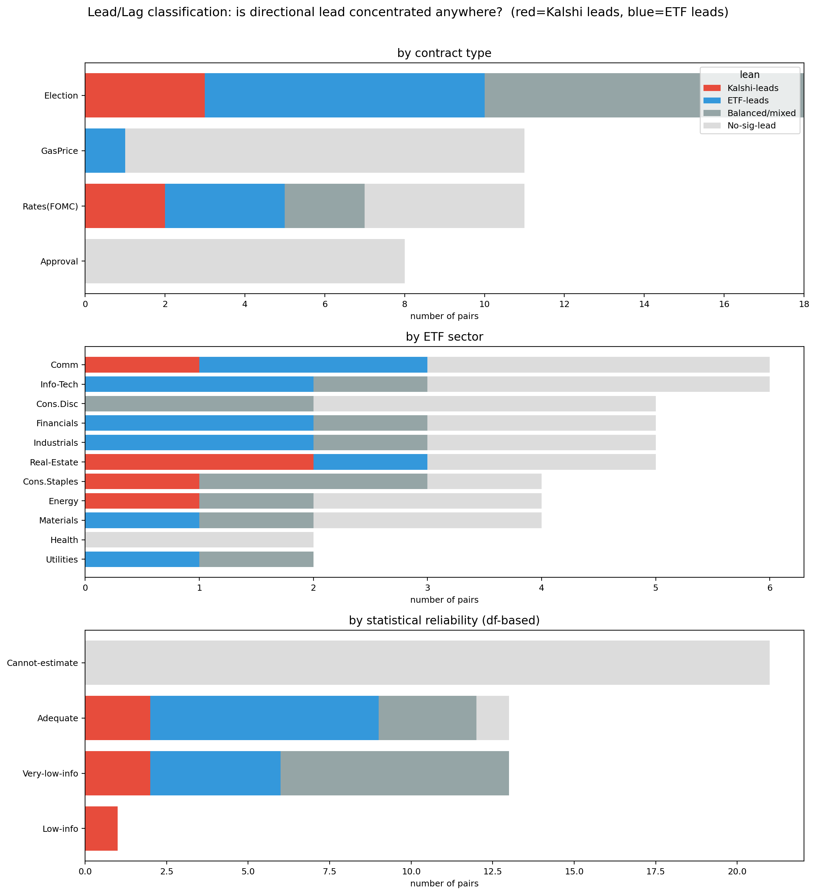

---

## Rank 1/48 — KXFEDDECISION-24DEC-C25 × VIS  (n_sig=14, best_p=3.7e-02, n_trades=2308)

```text
PAIR ANALYSIS    —    Rank 1 / 48
================================================================================================
KXFEDDECISION-24DEC-C25   x   VIS
Contract : "Will the Federal Reserve Cut rates by 25bps at their December 2024 meeting?"
Sector relevance : VFH_VNQ_VPU (Rate-sensitive: Financials / Real Estate / Utilities)
Window : 2024-10-31 to 2024-12-18     Kalshi trades : 2308     primary bar : 5min     daily-screen R^2 : 0.15

>>> RELIABILITY:  Adequate   <<<   (see section 5; unreliable pairs still get figures, but read their problems in section 8)

DEFINITIONS
   xₜ₋ₖ = Kalshi yes-probability change, k bars before t   (1 bar = 5min)
   yₜ   = ETF log return over bar t
   calendar = full market-hours grid: x=0 in bars with no Kalshi trade (not dropped).
   k>0 => Kalshi leads ETF ;  k<0 => ETF leads Kalshi ;  k=0 => contemporaneous

1. CALENDAR-TIME REGRESSION (clock-time lags, full RTH grid)
   Full model:  yₜ = α + Σ(k=-10..10) βₖ·xₜ₋ₖ + φ₁·yₜ₋₁ + Σ(d=1..32) γ_d·Day_d
      where  ADL ETF self-lags p=1 (BIC-chosen): φ₁·yₜ₋₁;  day-FE: 32 day dummies over 33 trading days (first day = baseline).
      controls counted (so you can see the total at a glance):  21 lead/lag x-terms + 1 ETF self-lag(s) + 32 day-FE dummies + 1 intercept = 55 RHS regressors  (model n_params=55).
   Significant terms (raw p<0.15) expanded:  yₜ = α + β₋₁₀·xₜ₊₁₀ + β₋₉·xₜ₊₉ + β₋₇·xₜ₊₇ + β₋₅·xₜ₊₅ + β₋₁·xₜ₊₁ + β₊₁·xₜ₋₁ + β₊₉·xₜ₋₉
   where:
      β₋₁₀ = +3.089e-05   (t/z=+3.12, p=1.8e-03, p_fdr=3.7e-02) **   [ETF leads]
      β₋₉ = +2.488e-05   (t/z=+2.27, p=2.3e-02, p_fdr=9.8e-02) *   [ETF leads]
      β₋₇ = +3.570e-05   (t/z=+2.78, p=5.5e-03, p_fdr=3.8e-02) **   [ETF leads]
      β₋₅ = +2.434e-05   (t/z=+2.68, p=7.4e-03, p_fdr=3.9e-02) **   [ETF leads]
      β₋₁ = -2.509e-05   (t/z=-2.02, p=4.3e-02, p_fdr=1.5e-01)    [ETF leads]
      β₊₁ = +2.149e-05   (t/z=+2.85, p=4.4e-03, p_fdr=3.8e-02) **   [Kalshi leads]
      β₊₉ = -1.533e-05   (t/z=-1.53, p=1.3e-01, p_fdr=3.8e-01)    [Kalshi leads]
   Lean by count of significant lags: ETF-leads  (k>0:2, k<0:5).

2. EVENT-TIME REGRESSION (event-count lags)
   Full model:  yₜ = α + Σ(k=-10..10) βₖ·xₜ₋ₖ + Σ(d=1..18) γ_d·Day_d
      where  ADL ETF self-lags p=0 (BIC chose none -> no ETF self-lag term);  day-FE: 18 day dummies over 19 trading days (first day = baseline).
      controls counted (so you can see the total at a glance):  21 lead/lag x-terms + 0 ETF self-lag(s) + 18 day-FE dummies + 1 intercept = 40 RHS regressors  (model n_params=40).
   Significant terms (raw p<0.15) expanded:  yₜ = α + β₋₁₀·xₜ₊₁₀ + β₋₉·xₜ₊₉ + β₋₆·xₜ₊₆ + β₋₃·xₜ₊₃ + β₋₁·xₜ₊₁ + β₊₅·xₜ₋₅ + β₊₇·xₜ₋₇
   where:
      β₋₁₀ = -9.809e-05   (t/z=-1.48, p=1.4e-01, p_fdr=4.2e-01)    [ETF leads]
      β₋₉ = -7.580e-05   (t/z=-1.83, p=6.8e-02, p_fdr=4.2e-01)    [ETF leads]
      β₋₆ = +1.247e-04   (t/z=+1.70, p=8.9e-02, p_fdr=4.2e-01)    [ETF leads]
      β₋₃ = -2.267e-04   (t/z=-1.62, p=1.0e-01, p_fdr=4.2e-01)    [ETF leads]
      β₋₁ = -1.050e-04   (t/z=-1.74, p=8.2e-02, p_fdr=4.2e-01)    [ETF leads]
      β₊₅ = -1.163e-04   (t/z=-3.12, p=1.8e-03, p_fdr=3.8e-02) **   [Kalshi leads]
      β₊₇ = +6.567e-05   (t/z=+1.51, p=1.3e-01, p_fdr=4.2e-01)    [Kalshi leads]
   Lean by count of significant lags: ETF-leads  (k>0:2, k<0:5).

3. FULL COEFFICIENT TABLE  (calendar primary bar  vs  event)
      k |       calendar b (FDR) |          event b (FDR)
   ------------------------------------------------------
    -10 |          +3.09e-05 **  |          -9.81e-05    
     -9 |          +2.49e-05 *   |          -7.58e-05    
     -8 |          -8.91e-06     |          -8.81e-05    
     -7 |          +3.57e-05 **  |          +1.10e-04    
     -6 |          +4.89e-06     |          +1.25e-04    
     -5 |          +2.43e-05 **  |          +9.28e-08    
     -4 |          +1.57e-05     |          -8.55e-05    
     -3 |          +1.46e-05     |          -2.27e-04    
     -2 |          -7.53e-06     |          -7.10e-05    
     -1 |          -2.51e-05     |          -1.05e-04    
     +0 |          -1.13e-08     |          -1.60e-06    
     +1 |          +2.15e-05 **  |          +9.09e-05    
     +2 |          +6.32e-06     |          +8.54e-05    
     +3 |          +9.31e-07     |          +1.05e-04    
     +4 |          +3.77e-06     |          -7.36e-06    
     +5 |          -3.08e-06     |          -1.16e-04 ** 
     +6 |          +1.30e-06     |          -5.56e-05    
     +7 |          -3.96e-06     |          +6.57e-05    
     +8 |          +6.20e-07     |          -1.92e-06    
     +9 |          -1.53e-05     |          +1.30e-05    
    +10 |          -7.06e-06     |          +9.79e-06    
   (stars = BH-FDR corrected:  *** p_fdr<.01  ** <.05  * <.10)

4. DIRECTIONAL TEST (probit, ETF up/down)
   Model: P(ETFₜ up) = Φ(α + βₖ·xₜ₋ₖ),  one probit per lag k
   calendar: β₋₇=-8.06e-02, β₊₄=+5.76e-02, β₊₈=-5.54e-02, β₊₁₀=-5.04e-02
   event: β₋₈=-9.36e-02*, β₋₃=+6.89e-02, β₋₂=-5.58e-02, β₊₇=+1.00e-01*, β₊₈=-6.27e-02, β₊₁₀=-6.01e-02

5. DATA RELIABILITY (statistical, not a trade-count cutoff)
   Tier: Adequate
   (criterion = n_active: bars with an actual Kalshi move (x!=0) = the real sample that identifies the lead-lag. Full RTH grid makes n_obs large, so n_active is the honest size.)
   calendar(full RTH grid): n_active=344  n_obs=1807  n_days=33  K=10  params=55  df=1752  median_SE=1.00e-05  sig(FDR)=4
   event: n_active=148  n_obs=253  n_days=19  K=10  params=40  df=213  median_SE=8.12e-05  sig(FDR)=1

6. COARSE-FREQUENCY ROBUSTNESS (re-run calendar at 30min / 60min)
    30min: n_obs=293 df=245 K=8  sig=0 (Kalshi-leads 0 / ETF-leads 0) -> No-sig
    60min: n_obs=164 df=120 K=6  sig=0 (Kalshi-leads 0 / ETF-leads 0) -> No-sig

7. VERDICT
   Both time-axes lean ETF-leads (relatively robust; see strongest single term).

8. FIGURE CAVEATS — figures are still drawn, but know their problems
   - Adequate info: figures and regression are mutually readable; note that flat Kalshi segments still mean 'no trade', not 'no change'.
   - Mixed coefficient signs across lags -- relationship not monotone.
   - Kalshi updates only on trades (flat line = no trade, NOT 'no change'); ETF mid refreshes continuously.

------------------------------------------------------------------------------------------------
Conventions: ET | 09:30-16:00 (forward windows capped to 16:00) | ETF in log return | median causal bars | full RTH grid | day-grouped lags (no overnight) | ADL self-control | significance = BH-FDR corrected.
Figures for this pair follow on the next page.
```

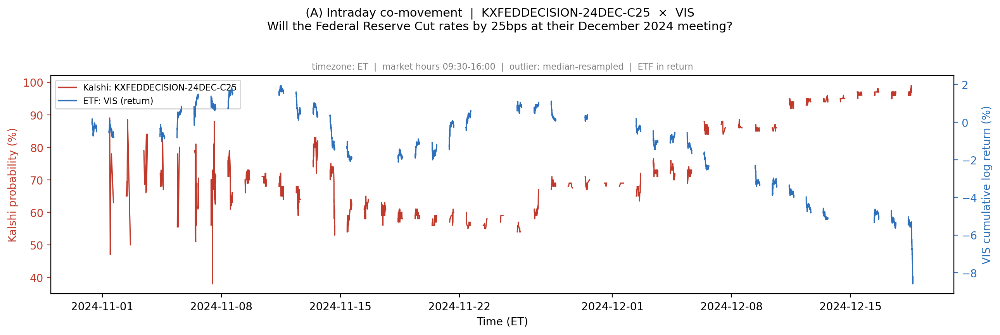
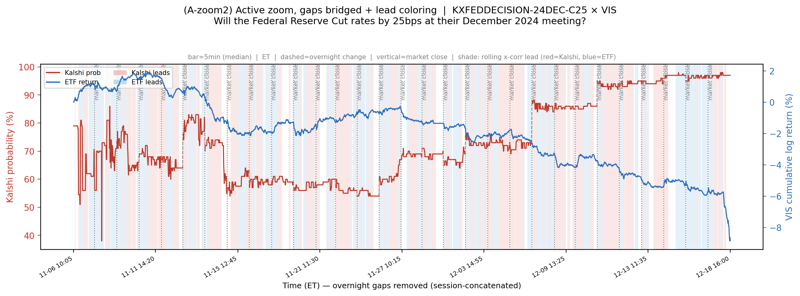
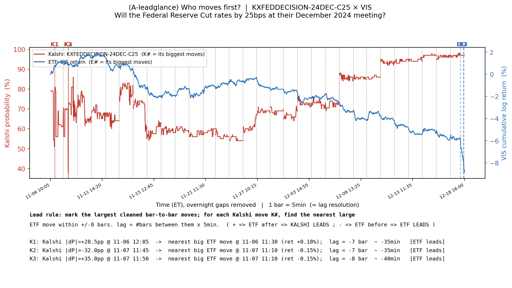
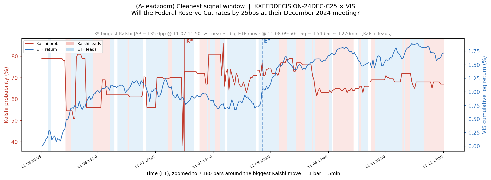
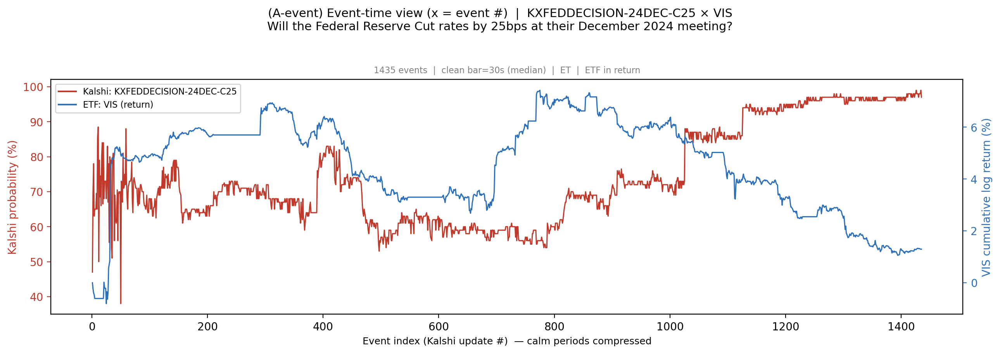
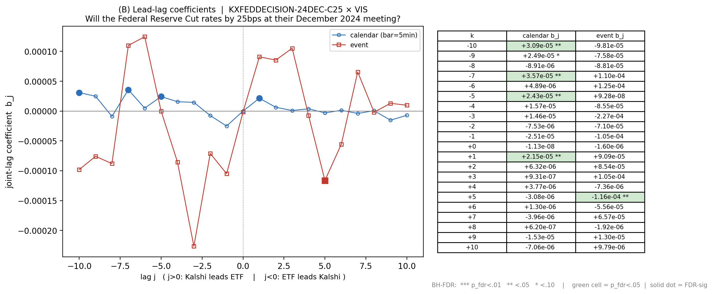

---

## Rank 2/48 — KXFEDDECISION-24DEC-C25 × VFH  (n_sig=9, best_p=4.9e-02, n_trades=2308)

```text
PAIR ANALYSIS    —    Rank 2 / 48
================================================================================================
KXFEDDECISION-24DEC-C25   x   VFH
Contract : "Will the Federal Reserve Cut rates by 25bps at their December 2024 meeting?"
Sector relevance : VFH_VNQ_VPU (Rate-sensitive: Financials / Real Estate / Utilities)
Window : 2024-10-31 to 2024-12-18     Kalshi trades : 2308     primary bar : 5min     daily-screen R^2 : 0.27

>>> RELIABILITY:  Adequate   <<<   (see section 5; unreliable pairs still get figures, but read their problems in section 8)

DEFINITIONS
   xₜ₋ₖ = Kalshi yes-probability change, k bars before t   (1 bar = 5min)
   yₜ   = ETF log return over bar t
   calendar = full market-hours grid: x=0 in bars with no Kalshi trade (not dropped).
   k>0 => Kalshi leads ETF ;  k<0 => ETF leads Kalshi ;  k=0 => contemporaneous

1. CALENDAR-TIME REGRESSION (clock-time lags, full RTH grid)
   Full model:  yₜ = α + Σ(k=-10..10) βₖ·xₜ₋ₖ + φ₁·yₜ₋₁ + Σ(d=1..32) γ_d·Day_d
      where  ADL ETF self-lags p=1 (BIC-chosen): φ₁·yₜ₋₁;  day-FE: 32 day dummies over 33 trading days (first day = baseline).
      controls counted (so you can see the total at a glance):  21 lead/lag x-terms + 1 ETF self-lag(s) + 32 day-FE dummies + 1 intercept = 55 RHS regressors  (model n_params=55).
   Significant terms (raw p<0.15) expanded:  yₜ = α + β₋₇·xₜ₊₇ + β₋₂·xₜ₊₂ + β₋₁·xₜ₊₁ + β₊₁·xₜ₋₁
   where:
      β₋₇ = +3.363e-05   (t/z=+2.33, p=2.0e-02, p_fdr=4.2e-01)    [ETF leads]
      β₋₂ = -2.566e-05   (t/z=-1.90, p=5.8e-02, p_fdr=5.5e-01)    [ETF leads]
      β₋₁ = -1.555e-05   (t/z=-1.69, p=9.1e-02, p_fdr=5.5e-01)    [ETF leads]
      β₊₁ = +2.374e-05   (t/z=+1.63, p=1.0e-01, p_fdr=5.5e-01)    [Kalshi leads]
   Lean by count of significant lags: ETF-leads  (k>0:1, k<0:3).

2. EVENT-TIME REGRESSION (event-count lags)
   Full model:  yₜ = α + Σ(k=-10..10) βₖ·xₜ₋ₖ + Σ(d=1..18) γ_d·Day_d
      where  ADL ETF self-lags p=0 (BIC chose none -> no ETF self-lag term);  day-FE: 18 day dummies over 19 trading days (first day = baseline).
      controls counted (so you can see the total at a glance):  21 lead/lag x-terms + 0 ETF self-lag(s) + 18 day-FE dummies + 1 intercept = 40 RHS regressors  (model n_params=40).
   Significant terms (raw p<0.15) expanded:  yₜ = α + β₋₇·xₜ₊₇ + β₋₆·xₜ₊₆ + β₋₁·xₜ₊₁ + β₊₁·xₜ₋₁ + β₊₅·xₜ₋₅
   where:
      β₋₇ = +1.758e-04   (t/z=+1.46, p=1.4e-01, p_fdr=6.1e-01)    [ETF leads]
      β₋₆ = +1.388e-04   (t/z=+1.62, p=1.0e-01, p_fdr=6.1e-01)    [ETF leads]
      β₋₁ = -1.134e-04   (t/z=-1.46, p=1.4e-01, p_fdr=6.1e-01)    [ETF leads]
      β₊₁ = +1.979e-04   (t/z=+3.04, p=2.3e-03, p_fdr=4.9e-02) **   [Kalshi leads]
      β₊₅ = -5.949e-05   (t/z=-1.78, p=7.5e-02, p_fdr=6.1e-01)    [Kalshi leads]
   Lean by count of significant lags: ETF-leads  (k>0:2, k<0:3).

3. FULL COEFFICIENT TABLE  (calendar primary bar  vs  event)
      k |       calendar b (FDR) |          event b (FDR)
   ------------------------------------------------------
    -10 |          +1.51e-06     |          +4.65e-05    
     -9 |          +1.52e-06     |          +1.10e-05    
     -8 |          -1.06e-05     |          -3.74e-05    
     -7 |          +3.36e-05     |          +1.76e-04    
     -6 |          +1.18e-06     |          +1.39e-04    
     -5 |          +1.26e-05     |          +9.93e-05    
     -4 |          -3.28e-06     |          +2.76e-05    
     -3 |          +1.20e-05     |          -8.45e-05    
     -2 |          -2.57e-05     |          -5.92e-05    
     -1 |          -1.56e-05     |          -1.13e-04    
     +0 |          +9.74e-06     |          +6.98e-05    
     +1 |          +2.37e-05     |          +1.98e-04 ** 
     +2 |          -1.23e-05     |          +7.52e-05    
     +3 |          -2.94e-06     |          +9.16e-05    
     +4 |          -1.44e-06     |          +1.71e-06    
     +5 |          +7.93e-06     |          -5.95e-05    
     +6 |          -6.51e-06     |          -6.02e-06    
     +7 |          -1.22e-05     |          +4.19e-05    
     +8 |          -8.37e-09     |          -6.23e-05    
     +9 |          -1.89e-06     |          -3.91e-06    
    +10 |          -1.21e-05     |          +1.92e-05    
   (stars = BH-FDR corrected:  *** p_fdr<.01  ** <.05  * <.10)

4. DIRECTIONAL TEST (probit, ETF up/down)
   Model: P(ETFₜ up) = Φ(α + βₖ·xₜ₋ₖ),  one probit per lag k
   calendar: β₋₆=+7.34e-02**, β₊₄=+8.58e-02, β₊₅=-1.08e-01**, β₊₆=+5.86e-02**
   event: β₋₅=-1.08e-01*, β₋₃=+1.43e-01***, β₋₂=-1.05e-01*, β₊₀=+6.82e-02, β₊₂=-1.24e-01*, β₊₃=+1.13e-01, β₊₅=-1.02e-01***, β₊₆=-4.01e-02*, β₊₇=+7.45e-02***

5. DATA RELIABILITY (statistical, not a trade-count cutoff)
   Tier: Adequate
   (criterion = n_active: bars with an actual Kalshi move (x!=0) = the real sample that identifies the lead-lag. Full RTH grid makes n_obs large, so n_active is the honest size.)
   calendar(full RTH grid): n_active=344  n_obs=1807  n_days=33  K=10  params=55  df=1752  median_SE=1.31e-05  sig(FDR)=0
   event: n_active=148  n_obs=253  n_days=19  K=10  params=40  df=213  median_SE=8.36e-05  sig(FDR)=1

6. COARSE-FREQUENCY ROBUSTNESS (re-run calendar at 30min / 60min)
    30min: n_obs=293 df=245 K=8  sig=0 (Kalshi-leads 0 / ETF-leads 0) -> No-sig
    60min: n_obs=164 df=120 K=6  sig=0 (Kalshi-leads 0 / ETF-leads 0) -> No-sig

7. VERDICT
   Both time-axes lean ETF-leads (relatively robust; see strongest single term).

8. FIGURE CAVEATS — figures are still drawn, but know their problems
   - Adequate info: figures and regression are mutually readable; note that flat Kalshi segments still mean 'no trade', not 'no change'.
   - Mixed coefficient signs across lags -- relationship not monotone.
   - Kalshi updates only on trades (flat line = no trade, NOT 'no change'); ETF mid refreshes continuously.

------------------------------------------------------------------------------------------------
Conventions: ET | 09:30-16:00 (forward windows capped to 16:00) | ETF in log return | median causal bars | full RTH grid | day-grouped lags (no overnight) | ADL self-control | significance = BH-FDR corrected.
Figures for this pair follow on the next page.
```

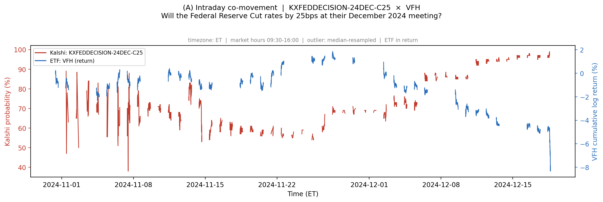
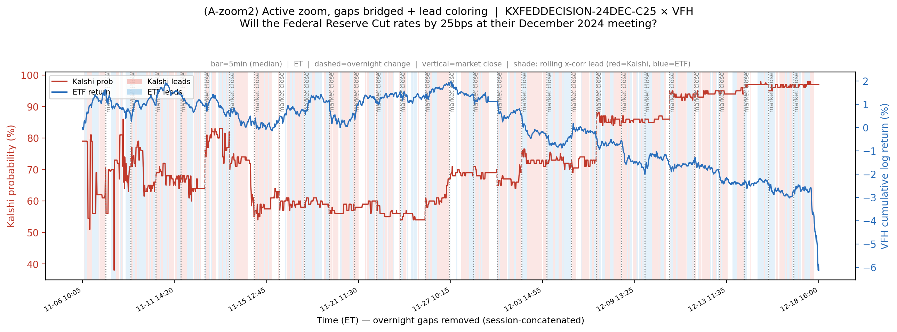
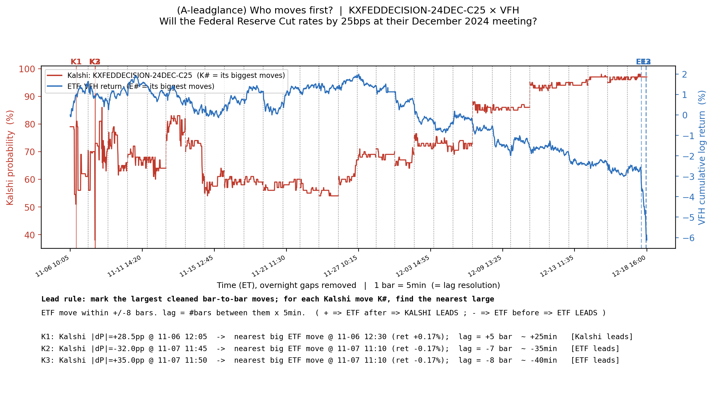
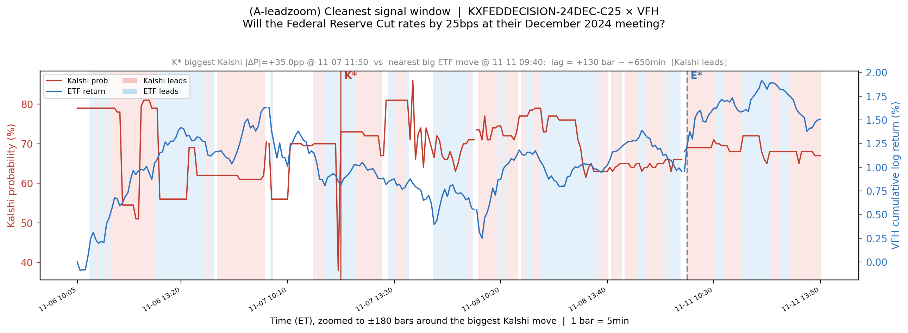
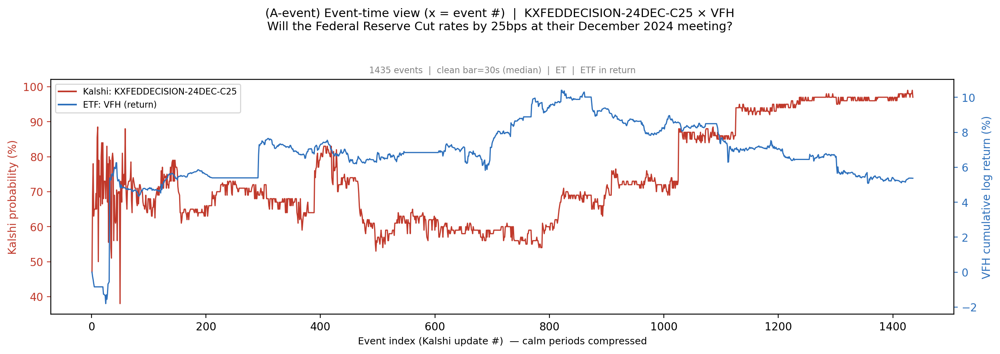
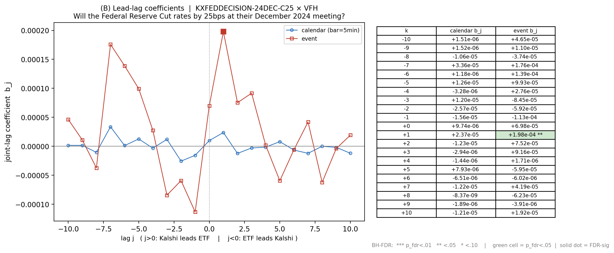

---

## Rank 3/48 — KXFEDDECISION-24DEC-H0 × VGT  (n_sig=12, best_p=7.4e-02, n_trades=1375)

```text
PAIR ANALYSIS    —    Rank 3 / 48
================================================================================================
KXFEDDECISION-24DEC-H0   x   VGT
Contract : "Will the Federal Reserve Hike rates by 0bps at their December 2024 meeting?"
Sector relevance : VFH_VNQ_VPU (Rate-sensitive: Financials / Real Estate / Utilities)
Window : 2024-10-31 to 2024-12-18     Kalshi trades : 1375     primary bar : 10min     daily-screen R^2 : 0.12

>>> RELIABILITY:  Adequate   <<<   (see section 5; unreliable pairs still get figures, but read their problems in section 8)

DEFINITIONS
   xₜ₋ₖ = Kalshi yes-probability change, k bars before t   (1 bar = 10min)
   yₜ   = ETF log return over bar t
   calendar = full market-hours grid: x=0 in bars with no Kalshi trade (not dropped).
   k>0 => Kalshi leads ETF ;  k<0 => ETF leads Kalshi ;  k=0 => contemporaneous

1. CALENDAR-TIME REGRESSION (clock-time lags, full RTH grid)
   Full model:  yₜ = α + Σ(k=-8..8) βₖ·xₜ₋ₖ + Σ(d=1..32) γ_d·Day_d
      where  ADL ETF self-lags p=0 (BIC chose none -> no ETF self-lag term);  day-FE: 32 day dummies over 33 trading days (first day = baseline).
      controls counted (so you can see the total at a glance):  17 lead/lag x-terms + 0 ETF self-lag(s) + 32 day-FE dummies + 1 intercept = 50 RHS regressors  (model n_params=50).
   Significant terms (raw p<0.15) expanded:  yₜ = α + β₊₀·xₜ + β₊₅·xₜ₋₅
   where:
      β₊₀ = +3.995e-05   (t/z=+1.50, p=1.3e-01, p_fdr=6.7e-01)    [contemporaneous]
      β₊₅ = +2.608e-05   (t/z=+1.67, p=9.6e-02, p_fdr=6.7e-01)    [Kalshi leads]
   Lean by count of significant lags: Kalshi-leads  (k>0:1, k<0:0).

2. EVENT-TIME REGRESSION (event-count lags)
   Full model:  yₜ = α + Σ(k=-8..8) βₖ·xₜ₋ₖ + φ₁·yₜ₋₁ + Σ(d=1..8) γ_d·Day_d
      where  ADL ETF self-lags p=1 (BIC-chosen): φ₁·yₜ₋₁;  day-FE: 8 day dummies over 9 trading days (first day = baseline).
      controls counted (so you can see the total at a glance):  17 lead/lag x-terms + 1 ETF self-lag(s) + 8 day-FE dummies + 1 intercept = 27 RHS regressors  (model n_params=27).
   Significant terms (raw p<0.15) expanded:  yₜ = α + β₋₈·xₜ₊₈ + β₋₇·xₜ₊₇ + β₋₆·xₜ₊₆ + β₋₃·xₜ₊₃ + β₋₂·xₜ₊₂ + β₋₁·xₜ₊₁ + β₊₁·xₜ₋₁ + β₊₂·xₜ₋₂ + β₊₃·xₜ₋₃ + β₊₄·xₜ₋₄
   where:
      β₋₈ = -7.682e-04   (t/z=-2.70, p=6.8e-03, p_fdr=7.4e-02) *   [ETF leads]
      β₋₇ = -7.839e-04   (t/z=-2.48, p=1.3e-02, p_fdr=7.4e-02) *   [ETF leads]
      β₋₆ = -1.090e-03   (t/z=-1.82, p=6.9e-02, p_fdr=1.8e-01)    [ETF leads]
      β₋₃ = -6.043e-04   (t/z=-1.64, p=1.0e-01, p_fdr=1.9e-01)    [ETF leads]
      β₋₂ = -7.290e-04   (t/z=-1.79, p=7.4e-02, p_fdr=1.8e-01)    [ETF leads]
      β₋₁ = -1.034e-03   (t/z=-2.51, p=1.2e-02, p_fdr=7.4e-02) *   [ETF leads]
      β₊₁ = -7.639e-04   (t/z=-1.67, p=9.5e-02, p_fdr=1.9e-01)    [Kalshi leads]
      β₊₂ = -3.685e-04   (t/z=-1.55, p=1.2e-01, p_fdr=2.1e-01)    [Kalshi leads]
      β₊₃ = -6.243e-04   (t/z=-1.83, p=6.7e-02, p_fdr=1.8e-01)    [Kalshi leads]
      β₊₄ = -2.431e-04   (t/z=-1.83, p=6.7e-02, p_fdr=1.8e-01)    [Kalshi leads]
   Lean by count of significant lags: ETF-leads  (k>0:4, k<0:6).

3. FULL COEFFICIENT TABLE  (calendar primary bar  vs  event)
      k |       calendar b (FDR) |          event b (FDR)
   ------------------------------------------------------
     -8 |          +2.15e-05     |          -7.68e-04 *  
     -7 |          +1.39e-05     |          -7.84e-04 *  
     -6 |          +5.27e-05     |          -1.09e-03    
     -5 |          +2.61e-05     |          -4.80e-04    
     -4 |          +3.66e-06     |          -4.78e-04    
     -3 |          -2.09e-07     |          -6.04e-04    
     -2 |          +1.07e-05     |          -7.29e-04    
     -1 |          -5.85e-07     |          -1.03e-03 *  
     +0 |          +4.00e-05     |          -2.36e-04    
     +1 |          +2.80e-05     |          -7.64e-04    
     +2 |          +3.08e-05     |          -3.68e-04    
     +3 |          -3.24e-06     |          -6.24e-04    
     +4 |          +5.11e-05     |          -2.43e-04    
     +5 |          +2.61e-05     |          -2.57e-04    
     +6 |          -4.95e-06     |          -2.86e-05    
     +7 |          +2.02e-05     |          +1.40e-04    
     +8 |          +4.08e-05     |          -2.43e-04    
   (stars = BH-FDR corrected:  *** p_fdr<.01  ** <.05  * <.10)

4. DIRECTIONAL TEST (probit, ETF up/down)
   Model: P(ETFₜ up) = Φ(α + βₖ·xₜ₋ₖ),  one probit per lag k
   calendar: β₋₆=+1.57e-01, β₊₀=-9.61e-02
   event: β₋₈=-6.48e-02, β₋₆=+1.23e-01, β₋₄=-8.91e-02, β₊₀=-7.62e-02, β₊₂=+9.10e-02

5. DATA RELIABILITY (statistical, not a trade-count cutoff)
   Tier: Adequate
   (criterion = n_active: bars with an actual Kalshi move (x!=0) = the real sample that identifies the lead-lag. Full RTH grid makes n_obs large, so n_active is the honest size.)
   calendar(full RTH grid): n_active=130  n_obs=621  n_days=33  K=8  params=50  df=571  median_SE=2.90e-05  sig(FDR)=0
   event: n_active=27  n_obs=48  n_days=9  K=8  params=27  df=21  median_SE=3.62e-04  sig(FDR)=0

6. COARSE-FREQUENCY ROBUSTNESS (re-run calendar at 30min / 60min)
    30min: n_obs=219 df=172 K=8  sig=0 (Kalshi-leads 0 / ETF-leads 0) -> No-sig
    60min: n_obs=138 df=94 K=6  sig=0 (Kalshi-leads 0 / ETF-leads 0) -> No-sig

7. VERDICT
   Calendar leans Kalshi-leads but Event leans ETF-leads -- NOT robust across time-axis; no clean lead.

8. FIGURE CAVEATS — figures are still drawn, but know their problems
   - Adequate info: figures and regression are mutually readable; note that flat Kalshi segments still mean 'no trade', not 'no change'.
   - Mixed coefficient signs across lags -- relationship not monotone.
   - Kalshi updates only on trades (flat line = no trade, NOT 'no change'); ETF mid refreshes continuously.

------------------------------------------------------------------------------------------------
Conventions: ET | 09:30-16:00 (forward windows capped to 16:00) | ETF in log return | median causal bars | full RTH grid | day-grouped lags (no overnight) | ADL self-control | significance = BH-FDR corrected.
Figures for this pair follow on the next page.
```

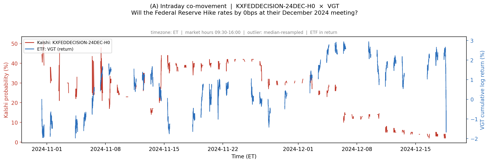
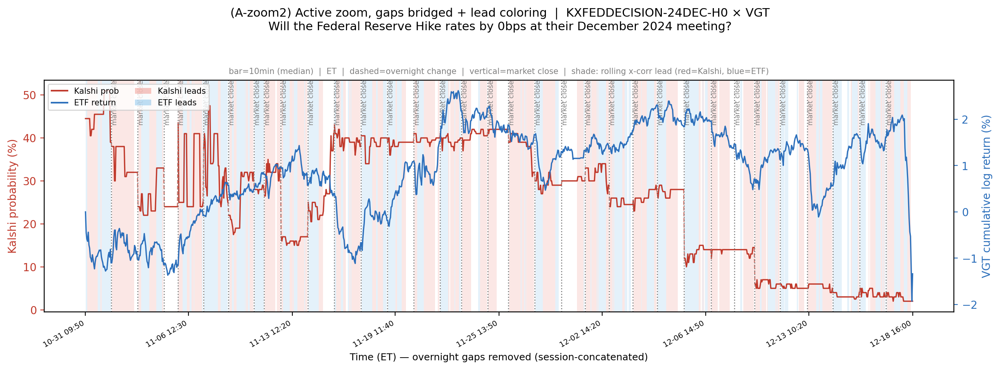
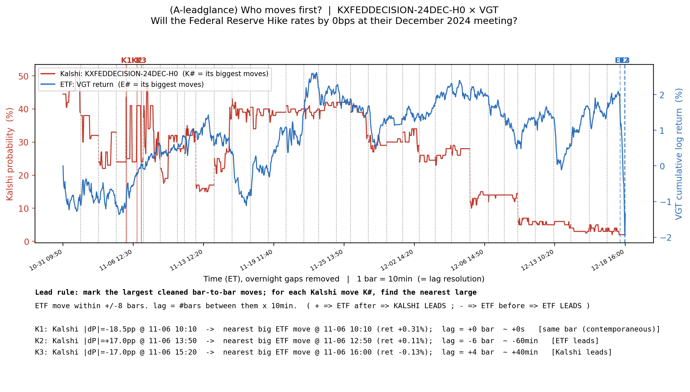
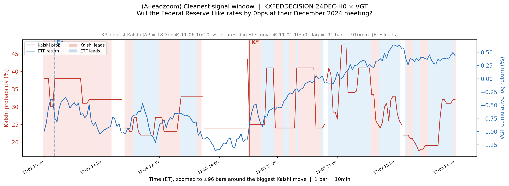
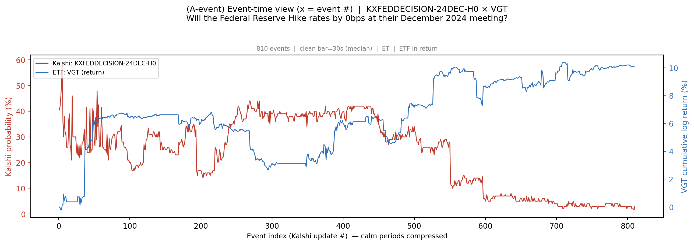
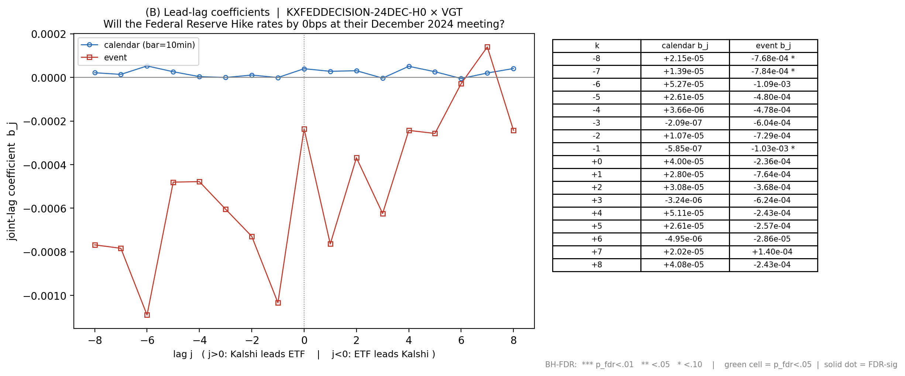

---

## Rank 4/48 — FEDDECISION-24SEP-C25 × VOX  (n_sig=7, best_p=6.8e-03, n_trades=1125)

```text
PAIR ANALYSIS    —    Rank 4 / 48
================================================================================================
FEDDECISION-24SEP-C25   x   VOX
Contract : "Will the Federal Reserve Cut rates by 25bps at their September 2024 meeting?"
Sector relevance : VFH_VNQ_VPU (Rate-sensitive: Financials / Real Estate / Utilities)
Window : 2024-09-04 to 2024-09-18     Kalshi trades : 1125     primary bar : 2min     daily-screen R^2 : 0.43

>>> RELIABILITY:  Adequate   <<<   (see section 5; unreliable pairs still get figures, but read their problems in section 8)

DEFINITIONS
   xₜ₋ₖ = Kalshi yes-probability change, k bars before t   (1 bar = 2min)
   yₜ   = ETF log return over bar t
   calendar = full market-hours grid: x=0 in bars with no Kalshi trade (not dropped).
   k>0 => Kalshi leads ETF ;  k<0 => ETF leads Kalshi ;  k=0 => contemporaneous

1. CALENDAR-TIME REGRESSION (clock-time lags, full RTH grid)
   Full model:  yₜ = α + Σ(k=-8..8) βₖ·xₜ₋ₖ + φ₁·yₜ₋₁ + Σ(d=1..10) γ_d·Day_d
      where  ADL ETF self-lags p=1 (BIC-chosen): φ₁·yₜ₋₁;  day-FE: 10 day dummies over 11 trading days (first day = baseline).
      controls counted (so you can see the total at a glance):  17 lead/lag x-terms + 1 ETF self-lag(s) + 10 day-FE dummies + 1 intercept = 29 RHS regressors  (model n_params=29).
   Significant terms (raw p<0.15) expanded:  yₜ = α + β₋₂·xₜ₊₂ + β₊₃·xₜ₋₃ + β₊₄·xₜ₋₄ + β₊₅·xₜ₋₅ + β₊₆·xₜ₋₆
   where:
      β₋₂ = -8.760e-06   (t/z=-1.72, p=8.5e-02, p_fdr=2.9e-01)    [ETF leads]
      β₊₃ = +3.271e-05   (t/z=+1.79, p=7.4e-02, p_fdr=2.9e-01)    [Kalshi leads]
      β₊₄ = -3.972e-05   (t/z=-3.54, p=4.0e-04, p_fdr=6.8e-03) ***   [Kalshi leads]
      β₊₅ = -6.317e-05   (t/z=-2.49, p=1.3e-02, p_fdr=1.1e-01)    [Kalshi leads]
      β₊₆ = +2.263e-05   (t/z=+1.96, p=5.0e-02, p_fdr=2.8e-01)    [Kalshi leads]
   Lean by count of significant lags: Kalshi-leads  (k>0:4, k<0:1).

2. EVENT-TIME REGRESSION (event-count lags)
   Full model:  yₜ = α + Σ(k=-8..8) βₖ·xₜ₋ₖ + Σ(d=1..7) γ_d·Day_d
      where  ADL ETF self-lags p=0 (BIC chose none -> no ETF self-lag term);  day-FE: 7 day dummies over 8 trading days (first day = baseline).
      controls counted (so you can see the total at a glance):  17 lead/lag x-terms + 0 ETF self-lag(s) + 7 day-FE dummies + 1 intercept = 25 RHS regressors  (model n_params=25).
   Significant terms (raw p<0.15) expanded:  yₜ = α + β₋₂·xₜ₊₂ + β₊₃·xₜ₋₃
   where:
      β₋₂ = +1.231e-04   (t/z=+1.76, p=7.8e-02, p_fdr=6.7e-01)    [ETF leads]
      β₊₃ = -3.671e-05   (t/z=-2.01, p=4.5e-02, p_fdr=6.7e-01)    [Kalshi leads]
   Lean by count of significant lags: balanced/no clear side  (k>0:1, k<0:1).

3. FULL COEFFICIENT TABLE  (calendar primary bar  vs  event)
      k |       calendar b (FDR) |          event b (FDR)
   ------------------------------------------------------
     -8 |          -7.08e-06     |          +2.11e-05    
     -7 |          -2.16e-05     |          -3.19e-06    
     -6 |          +7.34e-06     |          +2.33e-05    
     -5 |          +2.00e-05     |          -1.84e-05    
     -4 |          +6.29e-06     |          +6.43e-05    
     -3 |          +1.37e-05     |          +1.19e-04    
     -2 |          -8.76e-06     |          +1.23e-04    
     -1 |          -1.17e-05     |          -5.66e-05    
     +0 |          +5.14e-07     |          -3.90e-05    
     +1 |          +3.15e-06     |          +3.87e-05    
     +2 |          -1.40e-05     |          -8.83e-06    
     +3 |          +3.27e-05     |          -3.67e-05    
     +4 |          -3.97e-05 *** |          -1.22e-05    
     +5 |          -6.32e-05     |          +4.22e-06    
     +6 |          +2.26e-05     |          -1.76e-05    
     +7 |          +7.28e-06     |          -1.73e-05    
     +8 |          +2.34e-06     |          +8.76e-06    
   (stars = BH-FDR corrected:  *** p_fdr<.01  ** <.05  * <.10)

4. DIRECTIONAL TEST (probit, ETF up/down)
   Model: P(ETFₜ up) = Φ(α + βₖ·xₜ₋ₖ),  one probit per lag k
   calendar: β₋₆=+9.99e-02, β₋₃=-1.01e-01, β₋₁=-8.18e-02, β₊₂=-8.94e-02
   event: β₋₁=-8.58e-02, β₊₂=-9.42e-02, β₊₇=-1.56e-01

5. DATA RELIABILITY (statistical, not a trade-count cutoff)
   Tier: Adequate
   (criterion = n_active: bars with an actual Kalshi move (x!=0) = the real sample that identifies the lead-lag. Full RTH grid makes n_obs large, so n_active is the honest size.)
   calendar(full RTH grid): n_active=282  n_obs=1906  n_days=11  K=8  params=29  df=1877  median_SE=1.58e-05  sig(FDR)=1
   event: n_active=207  n_obs=322  n_days=8  K=8  params=25  df=297  median_SE=4.67e-05  sig(FDR)=0

6. COARSE-FREQUENCY ROBUSTNESS (re-run calendar at 30min / 60min)
    30min: n_obs=93 df=69 K=6  sig=0 (Kalshi-leads 0 / ETF-leads 0) -> No-sig
    60min: n_obs=50 df=29 K=5  sig=2 (Kalshi-leads 1 / ETF-leads 1) -> Balanced/mixed

7. VERDICT
   Calendar leans Kalshi-leads but Event leans balanced -- NOT robust across time-axis; no clean lead.

8. FIGURE CAVEATS — figures are still drawn, but know their problems
   - Adequate info: figures and regression are mutually readable; note that flat Kalshi segments still mean 'no trade', not 'no change'.
   - Mixed coefficient signs across lags -- relationship not monotone.
   - Kalshi updates only on trades (flat line = no trade, NOT 'no change'); ETF mid refreshes continuously.

9. REAL-WORLD CONTEXT (WebSearch-verified; see URLs)
   - Sept 2024 FOMC decided Wed Sep 18, 2024 (statement 2:00 PM ET, Powell press conf 2:30 PM ET).
   - Outcome: 50bps cut to 4.75-5.00% -- a surprise vs the 25bps many expected (first cut in 4+ years).
   - This contract asked specifically about a 25bps cut; the 50bps outcome resolved it NO.
   - Sources: federalreserve.gov/monetarypolicy/files/fomcminutes20240918.pdf ; jpmorgan.com/insights/outlook/economic-outlook/fed-meeting-september-2024

------------------------------------------------------------------------------------------------
Conventions: ET | 09:30-16:00 (forward windows capped to 16:00) | ETF in log return | median causal bars | full RTH grid | day-grouped lags (no overnight) | ADL self-control | significance = BH-FDR corrected.
Figures for this pair follow on the next page.
```

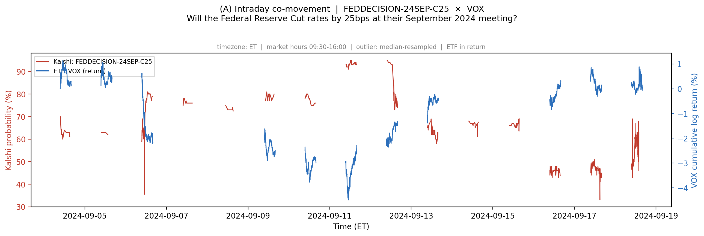
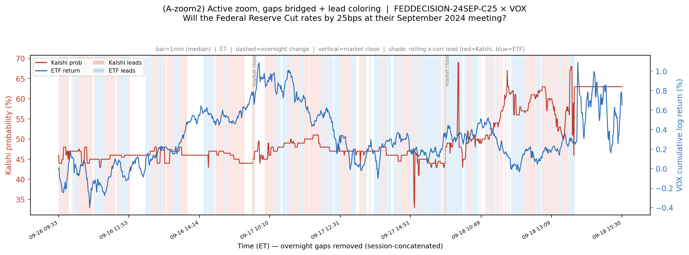
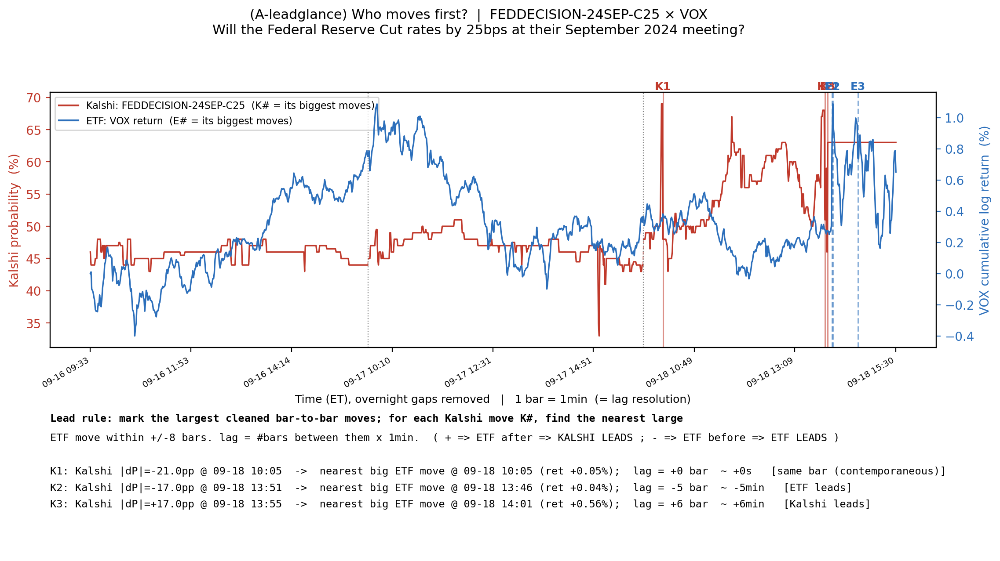
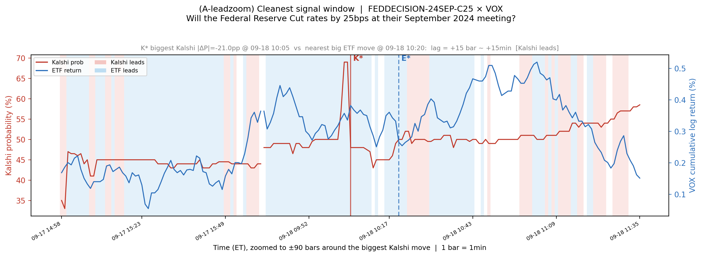
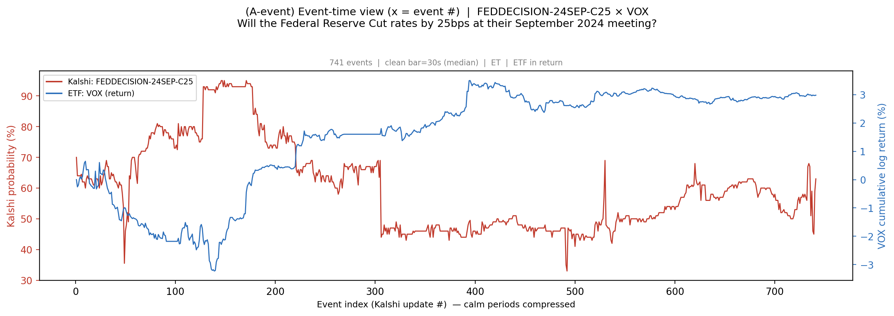
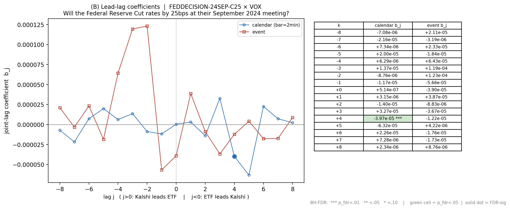

---

## Rank 5/48 — FEDDECISION-24SEP-C25 × VPU  (n_sig=6, best_p=4.3e-01, n_trades=1125)

```text
PAIR ANALYSIS    —    Rank 5 / 48
================================================================================================
FEDDECISION-24SEP-C25   x   VPU
Contract : "Will the Federal Reserve Cut rates by 25bps at their September 2024 meeting?"
Sector relevance : VFH_VNQ_VPU (Rate-sensitive: Financials / Real Estate / Utilities)
Window : 2024-09-04 to 2024-09-18     Kalshi trades : 1125     primary bar : 2min     daily-screen R^2 : 0.42

>>> RELIABILITY:  Adequate   <<<   (see section 5; unreliable pairs still get figures, but read their problems in section 8)

DEFINITIONS
   xₜ₋ₖ = Kalshi yes-probability change, k bars before t   (1 bar = 2min)
   yₜ   = ETF log return over bar t
   calendar = full market-hours grid: x=0 in bars with no Kalshi trade (not dropped).
   k>0 => Kalshi leads ETF ;  k<0 => ETF leads Kalshi ;  k=0 => contemporaneous

1. CALENDAR-TIME REGRESSION (clock-time lags, full RTH grid)
   Full model:  yₜ = α + Σ(k=-8..8) βₖ·xₜ₋ₖ + φ₁·yₜ₋₁ + φ₂·yₜ₋₂ + φ₃·yₜ₋₃ + φ₄·yₜ₋₄ + φ₅·yₜ₋₅ + φ₆·yₜ₋₆ + Σ(d=1..10) γ_d·Day_d
      where  ADL ETF self-lags p=6 (BIC-chosen): φ₁·yₜ₋₁ + φ₂·yₜ₋₂ + φ₃·yₜ₋₃ + φ₄·yₜ₋₄ + φ₅·yₜ₋₅ + φ₆·yₜ₋₆;  day-FE: 10 day dummies over 11 trading days (first day = baseline).
      controls counted (so you can see the total at a glance):  17 lead/lag x-terms + 6 ETF self-lag(s) + 10 day-FE dummies + 1 intercept = 34 RHS regressors  (model n_params=34).
   Significant terms (raw p<0.15) expanded:  yₜ = α + β₋₄·xₜ₊₄ + β₊₃·xₜ₋₃ + β₊₄·xₜ₋₄ + β₊₆·xₜ₋₆
   where:
      β₋₄ = +2.026e-05   (t/z=+1.65, p=9.9e-02, p_fdr=4.3e-01)    [ETF leads]
      β₊₃ = +3.630e-05   (t/z=+1.77, p=7.7e-02, p_fdr=4.3e-01)    [Kalshi leads]
      β₊₄ = -2.709e-05   (t/z=-1.81, p=7.0e-02, p_fdr=4.3e-01)    [Kalshi leads]
      β₊₆ = +1.291e-05   (t/z=+1.64, p=1.0e-01, p_fdr=4.3e-01)    [Kalshi leads]
   Lean by count of significant lags: Kalshi-leads  (k>0:3, k<0:1).

2. EVENT-TIME REGRESSION (event-count lags)
   Full model:  yₜ = α + Σ(k=-8..8) βₖ·xₜ₋ₖ + Σ(d=1..7) γ_d·Day_d
      where  ADL ETF self-lags p=0 (BIC chose none -> no ETF self-lag term);  day-FE: 7 day dummies over 8 trading days (first day = baseline).
      controls counted (so you can see the total at a glance):  17 lead/lag x-terms + 0 ETF self-lag(s) + 7 day-FE dummies + 1 intercept = 25 RHS regressors  (model n_params=25).
   Significant terms (raw p<0.15) expanded:  yₜ = α + β₋₃·xₜ₊₃ + β₋₂·xₜ₊₂
   where:
      β₋₃ = +1.271e-04   (t/z=+2.10, p=3.5e-02, p_fdr=6.0e-01)    [ETF leads]
      β₋₂ = +9.975e-05   (t/z=+1.78, p=7.6e-02, p_fdr=6.4e-01)    [ETF leads]
   Lean by count of significant lags: ETF-leads  (k>0:0, k<0:2).

3. FULL COEFFICIENT TABLE  (calendar primary bar  vs  event)
      k |       calendar b (FDR) |          event b (FDR)
   ------------------------------------------------------
     -8 |          +8.15e-06     |          +3.50e-05    
     -7 |          -1.31e-05     |          -3.62e-05    
     -6 |          -5.56e-06     |          +4.73e-05    
     -5 |          +1.78e-05     |          -2.10e-05    
     -4 |          +2.03e-05     |          +3.48e-05    
     -3 |          +1.60e-05     |          +1.27e-04    
     -2 |          -3.74e-07     |          +9.98e-05    
     -1 |          -1.80e-05     |          -4.63e-05    
     +0 |          -1.59e-06     |          -3.17e-05    
     +1 |          -3.87e-06     |          -3.99e-05    
     +2 |          -7.87e-06     |          -6.94e-06    
     +3 |          +3.63e-05     |          +3.06e-06    
     +4 |          -2.71e-05     |          -7.22e-06    
     +5 |          -1.90e-05     |          -7.04e-06    
     +6 |          +1.29e-05     |          +2.40e-05    
     +7 |          +7.90e-06     |          -2.11e-05    
     +8 |          +1.33e-06     |          -3.67e-06    
   (stars = BH-FDR corrected:  *** p_fdr<.01  ** <.05  * <.10)

4. DIRECTIONAL TEST (probit, ETF up/down)
   Model: P(ETFₜ up) = Φ(α + βₖ·xₜ₋ₖ),  one probit per lag k
   calendar: β₋₈=-6.84e-02, β₋₅=+8.77e-02, β₋₃=+1.13e-01**, β₋₁=-1.10e-01, β₊₁=-6.61e-02, β₊₃=+1.29e-01, β₊₆=+1.22e-01, β₊₈=-8.50e-02
   event: β₋₈=-4.73e-02, β₋₆=+4.22e-02, β₋₅=+8.17e-02, β₋₁=-1.84e-01*, β₊₁=-9.01e-02, β₊₄=+4.63e-02, β₊₅=-1.20e-01*

5. DATA RELIABILITY (statistical, not a trade-count cutoff)
   Tier: Adequate
   (criterion = n_active: bars with an actual Kalshi move (x!=0) = the real sample that identifies the lead-lag. Full RTH grid makes n_obs large, so n_active is the honest size.)
   calendar(full RTH grid): n_active=282  n_obs=1906  n_days=11  K=8  params=34  df=1872  median_SE=1.34e-05  sig(FDR)=0
   event: n_active=207  n_obs=322  n_days=8  K=8  params=25  df=297  median_SE=3.71e-05  sig(FDR)=0

6. COARSE-FREQUENCY ROBUSTNESS (re-run calendar at 30min / 60min)
    30min: n_obs=93 df=69 K=6  sig=1 (Kalshi-leads 1 / ETF-leads 0) -> Kalshi-leads
    60min: n_obs=50 df=29 K=5  sig=0 (Kalshi-leads 0 / ETF-leads 0) -> No-sig

7. VERDICT
   Calendar leans Kalshi-leads but Event leans ETF-leads -- NOT robust across time-axis; no clean lead.

8. FIGURE CAVEATS — figures are still drawn, but know their problems
   - Adequate info: figures and regression are mutually readable; note that flat Kalshi segments still mean 'no trade', not 'no change'.
   - Mixed coefficient signs across lags -- relationship not monotone.
   - Kalshi updates only on trades (flat line = no trade, NOT 'no change'); ETF mid refreshes continuously.

9. REAL-WORLD CONTEXT (WebSearch-verified; see URLs)
   - Sept 2024 FOMC decided Wed Sep 18, 2024 (statement 2:00 PM ET, Powell press conf 2:30 PM ET).
   - Outcome: 50bps cut to 4.75-5.00% -- a surprise vs the 25bps many expected (first cut in 4+ years).
   - This contract asked specifically about a 25bps cut; the 50bps outcome resolved it NO.
   - Sources: federalreserve.gov/monetarypolicy/files/fomcminutes20240918.pdf ; jpmorgan.com/insights/outlook/economic-outlook/fed-meeting-september-2024

------------------------------------------------------------------------------------------------
Conventions: ET | 09:30-16:00 (forward windows capped to 16:00) | ETF in log return | median causal bars | full RTH grid | day-grouped lags (no overnight) | ADL self-control | significance = BH-FDR corrected.
Figures for this pair follow on the next page.
```

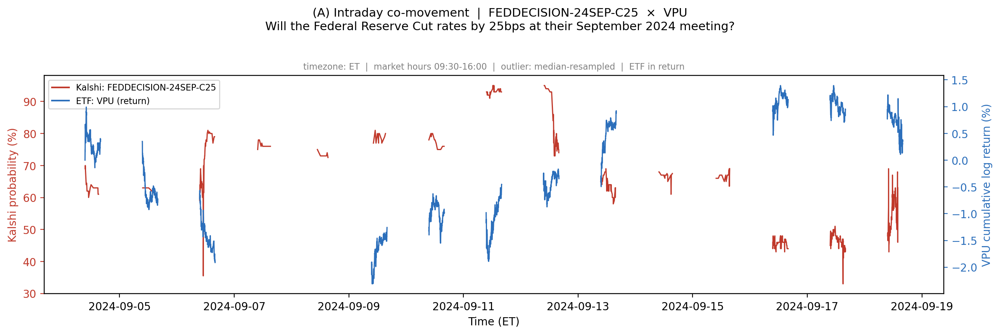
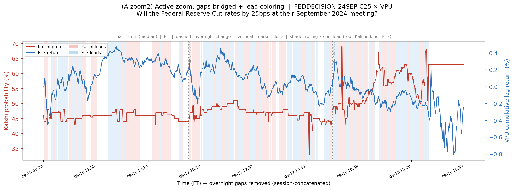
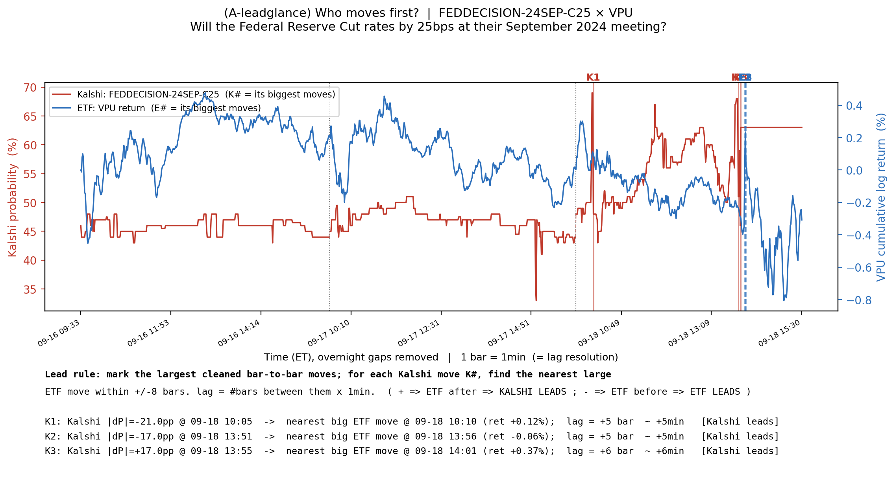
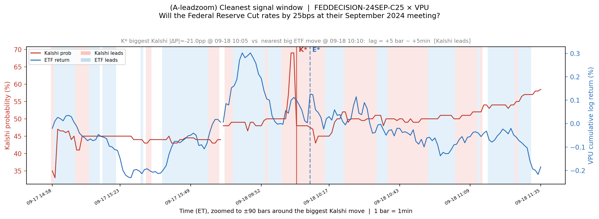
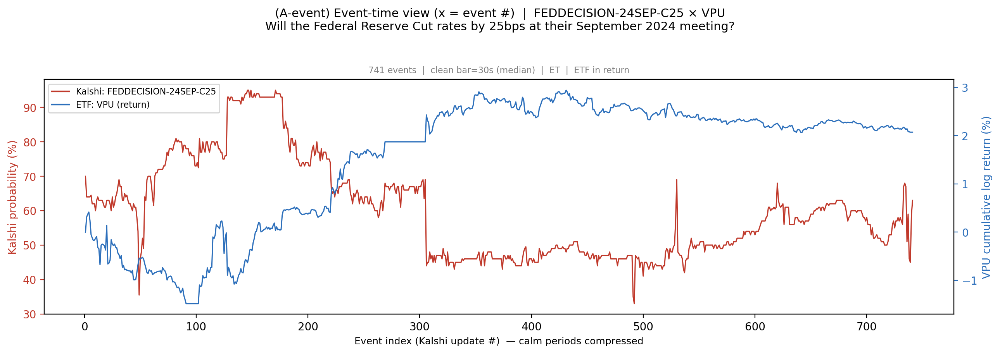
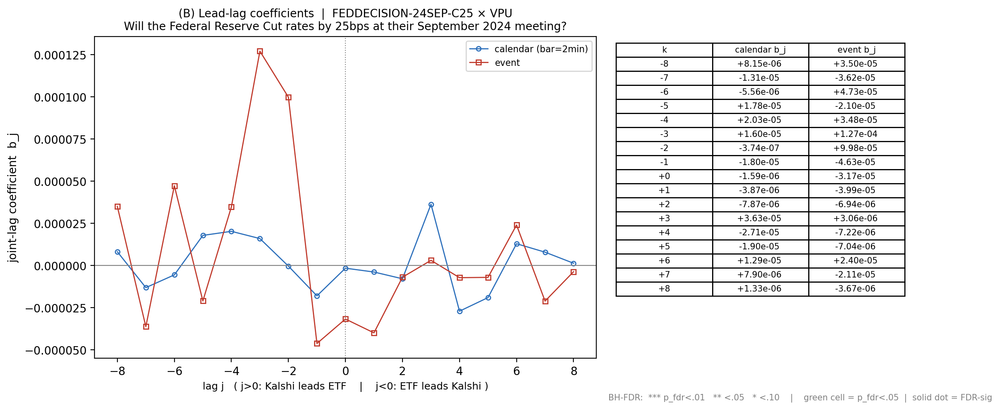

---

## Rank 6/48 — FEDDECISION-24SEP-C25 × VDC  (n_sig=4, best_p=6.2e-01, n_trades=1125)

```text
PAIR ANALYSIS    —    Rank 6 / 48
================================================================================================
FEDDECISION-24SEP-C25   x   VDC
Contract : "Will the Federal Reserve Cut rates by 25bps at their September 2024 meeting?"
Sector relevance : VFH_VNQ_VPU (Rate-sensitive: Financials / Real Estate / Utilities)
Window : 2024-09-04 to 2024-09-18     Kalshi trades : 1125     primary bar : 2min     daily-screen R^2 : 0.63

>>> RELIABILITY:  Adequate   <<<   (see section 5; unreliable pairs still get figures, but read their problems in section 8)

DEFINITIONS
   xₜ₋ₖ = Kalshi yes-probability change, k bars before t   (1 bar = 2min)
   yₜ   = ETF log return over bar t
   calendar = full market-hours grid: x=0 in bars with no Kalshi trade (not dropped).
   k>0 => Kalshi leads ETF ;  k<0 => ETF leads Kalshi ;  k=0 => contemporaneous

1. CALENDAR-TIME REGRESSION (clock-time lags, full RTH grid)
   Full model:  yₜ = α + Σ(k=-8..8) βₖ·xₜ₋ₖ + φ₁·yₜ₋₁ + Σ(d=1..10) γ_d·Day_d
      where  ADL ETF self-lags p=1 (BIC-chosen): φ₁·yₜ₋₁;  day-FE: 10 day dummies over 11 trading days (first day = baseline).
      controls counted (so you can see the total at a glance):  17 lead/lag x-terms + 1 ETF self-lag(s) + 10 day-FE dummies + 1 intercept = 29 RHS regressors  (model n_params=29).
   Significant terms (raw p<0.15) expanded:  yₜ = α + β₋₆·xₜ₊₆ + β₊₃·xₜ₋₃
   where:
      β₋₆ = -1.465e-05   (t/z=-1.87, p=6.2e-02, p_fdr=7.0e-01)    [ETF leads]
      β₊₃ = +2.104e-05   (t/z=+1.48, p=1.4e-01, p_fdr=7.0e-01)    [Kalshi leads]
   Lean by count of significant lags: balanced/no clear side  (k>0:1, k<0:1).

2. EVENT-TIME REGRESSION (event-count lags)
   Full model:  yₜ = α + Σ(k=-8..8) βₖ·xₜ₋ₖ + Σ(d=1..7) γ_d·Day_d
      where  ADL ETF self-lags p=0 (BIC chose none -> no ETF self-lag term);  day-FE: 7 day dummies over 8 trading days (first day = baseline).
      controls counted (so you can see the total at a glance):  17 lead/lag x-terms + 0 ETF self-lag(s) + 7 day-FE dummies + 1 intercept = 25 RHS regressors  (model n_params=25).
   Significant terms (raw p<0.15) expanded:  yₜ = α + β₋₂·xₜ₊₂ + β₊₃·xₜ₋₃
   where:
      β₋₂ = +1.097e-04   (t/z=+2.09, p=3.7e-02, p_fdr=6.2e-01)    [ETF leads]
      β₊₃ = -2.256e-05   (t/z=-1.58, p=1.1e-01, p_fdr=6.6e-01)    [Kalshi leads]
   Lean by count of significant lags: balanced/no clear side  (k>0:1, k<0:1).

3. FULL COEFFICIENT TABLE  (calendar primary bar  vs  event)
      k |       calendar b (FDR) |          event b (FDR)
   ------------------------------------------------------
     -8 |          -5.85e-06     |          +4.38e-05    
     -7 |          -6.45e-06     |          -1.29e-05    
     -6 |          -1.46e-05     |          +3.37e-05    
     -5 |          +1.19e-05     |          -2.67e-05    
     -4 |          +8.79e-07     |          +3.32e-05    
     -3 |          +1.34e-05     |          +7.96e-05    
     -2 |          -1.77e-06     |          +1.10e-04    
     -1 |          -8.27e-06     |          -5.75e-05    
     +0 |          -6.06e-06     |          -1.80e-05    
     +1 |          +6.48e-06     |          +9.45e-06    
     +2 |          -1.21e-05     |          -1.36e-05    
     +3 |          +2.10e-05     |          -2.26e-05    
     +4 |          -9.76e-06     |          +8.05e-06    
     +5 |          -1.50e-05     |          +3.83e-05    
     +6 |          +6.50e-06     |          +9.82e-06    
     +7 |          +1.28e-05     |          -1.98e-05    
     +8 |          -1.81e-06     |          +7.38e-06    
   (stars = BH-FDR corrected:  *** p_fdr<.01  ** <.05  * <.10)

4. DIRECTIONAL TEST (probit, ETF up/down)
   Model: P(ETFₜ up) = Φ(α + βₖ·xₜ₋ₖ),  one probit per lag k
   calendar: β₋₇=-9.96e-02*, β₋₅=-6.33e-02, β₊₅=+2.26e-01**
   event: β₋₇=-8.94e-02**, β₋₅=-7.57e-02***, β₋₁=-9.50e-02, β₊₂=-5.83e-02, β₊₃=-7.78e-02, β₊₅=+1.92e-01*, β₊₈=-7.20e-02

5. DATA RELIABILITY (statistical, not a trade-count cutoff)
   Tier: Adequate
   (criterion = n_active: bars with an actual Kalshi move (x!=0) = the real sample that identifies the lead-lag. Full RTH grid makes n_obs large, so n_active is the honest size.)
   calendar(full RTH grid): n_active=282  n_obs=1906  n_days=11  K=8  params=29  df=1877  median_SE=1.01e-05  sig(FDR)=0
   event: n_active=207  n_obs=322  n_days=8  K=8  params=25  df=297  median_SE=3.09e-05  sig(FDR)=0

6. COARSE-FREQUENCY ROBUSTNESS (re-run calendar at 30min / 60min)
    30min: n_obs=93 df=69 K=6  sig=0 (Kalshi-leads 0 / ETF-leads 0) -> No-sig
    60min: n_obs=50 df=29 K=5  sig=0 (Kalshi-leads 0 / ETF-leads 0) -> No-sig

7. VERDICT
   Both time-axes balanced -- no clean directional lead.

8. FIGURE CAVEATS — figures are still drawn, but know their problems
   - Adequate info: figures and regression are mutually readable; note that flat Kalshi segments still mean 'no trade', not 'no change'.
   - Mixed coefficient signs across lags -- relationship not monotone.
   - Kalshi updates only on trades (flat line = no trade, NOT 'no change'); ETF mid refreshes continuously.

9. REAL-WORLD CONTEXT (WebSearch-verified; see URLs)
   - Sept 2024 FOMC decided Wed Sep 18, 2024 (statement 2:00 PM ET, Powell press conf 2:30 PM ET).
   - Outcome: 50bps cut to 4.75-5.00% -- a surprise vs the 25bps many expected (first cut in 4+ years).
   - This contract asked specifically about a 25bps cut; the 50bps outcome resolved it NO.
   - Sources: federalreserve.gov/monetarypolicy/files/fomcminutes20240918.pdf ; jpmorgan.com/insights/outlook/economic-outlook/fed-meeting-september-2024

------------------------------------------------------------------------------------------------
Conventions: ET | 09:30-16:00 (forward windows capped to 16:00) | ETF in log return | median causal bars | full RTH grid | day-grouped lags (no overnight) | ADL self-control | significance = BH-FDR corrected.
Figures for this pair follow on the next page.
```

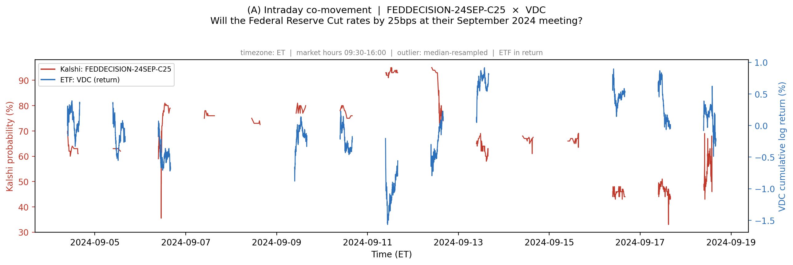
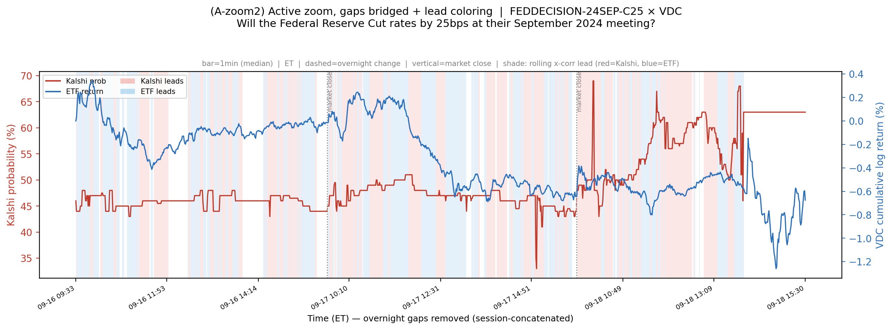
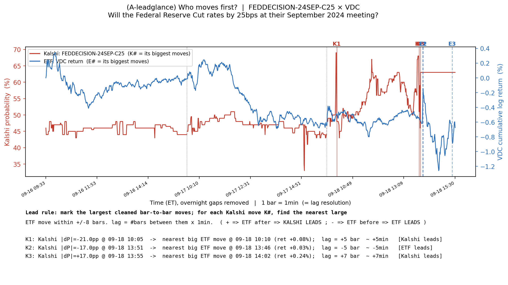
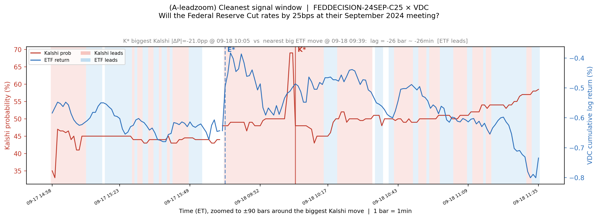
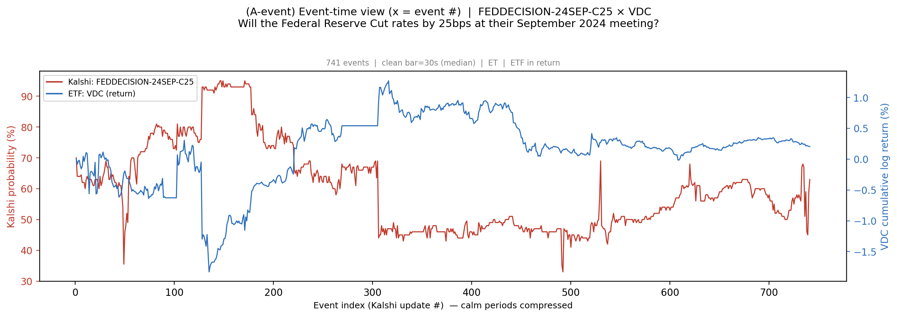
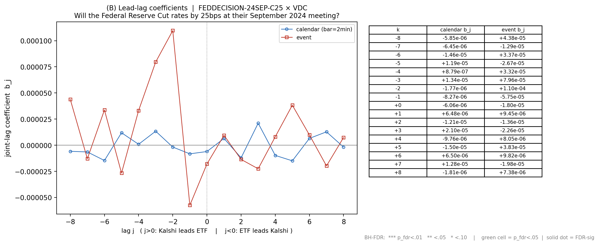

---

## Rank 7/48 — FEDDECISION-24NOV-H0 × VNQ  (n_sig=3, best_p=3.3e-01, n_trades=452)

```text
PAIR ANALYSIS    —    Rank 7 / 48
================================================================================================
FEDDECISION-24NOV-H0   x   VNQ
Contract : "Will the Federal Reserve Hike rates by 0bps at their November 2024 meeting?"
Sector relevance : VFH_VNQ_VPU (Rate-sensitive: Financials / Real Estate / Utilities)
Window : 2024-09-18 to 2024-11-07     Kalshi trades : 452     primary bar : 10min     daily-screen R^2 : 0.17

>>> RELIABILITY:  Adequate   <<<   (see section 5; unreliable pairs still get figures, but read their problems in section 8)

DEFINITIONS
   xₜ₋ₖ = Kalshi yes-probability change, k bars before t   (1 bar = 10min)
   yₜ   = ETF log return over bar t
   calendar = full market-hours grid: x=0 in bars with no Kalshi trade (not dropped).
   k>0 => Kalshi leads ETF ;  k<0 => ETF leads Kalshi ;  k=0 => contemporaneous

1. CALENDAR-TIME REGRESSION (clock-time lags, full RTH grid)
   Full model:  yₜ = α + Σ(k=-6..6) βₖ·xₜ₋ₖ + φ₁·yₜ₋₁ + Σ(d=1..35) γ_d·Day_d
      where  ADL ETF self-lags p=1 (BIC-chosen): φ₁·yₜ₋₁;  day-FE: 35 day dummies over 36 trading days (first day = baseline).
      controls counted (so you can see the total at a glance):  13 lead/lag x-terms + 1 ETF self-lag(s) + 35 day-FE dummies + 1 intercept = 50 RHS regressors  (model n_params=50).
   Significant terms (raw p<0.15) expanded:  yₜ = α + β₋₁·xₜ₊₁ + β₊₄·xₜ₋₄ + β₊₅·xₜ₋₅
   where:
      β₋₁ = -1.035e-04   (t/z=-2.23, p=2.5e-02, p_fdr=3.3e-01)    [ETF leads]
      β₊₄ = +3.620e-05   (t/z=+1.88, p=5.9e-02, p_fdr=3.8e-01)    [Kalshi leads]
      β₊₅ = +3.914e-05   (t/z=+1.71, p=8.8e-02, p_fdr=3.8e-01)    [Kalshi leads]
   Lean by count of significant lags: Kalshi-leads  (k>0:2, k<0:1).

2. EVENT-TIME REGRESSION (event-count lags)
   Full model:  yₜ = α + Σ(k) βₖ·xₜ₋ₖ + (ADL self-lags) + (day fixed effects)
   -> no regression result (insufficient data).

3. FULL COEFFICIENT TABLE  (calendar primary bar  vs  event)
      k |       calendar b (FDR) |          event b (FDR)
   ------------------------------------------------------
     -6 |          -2.42e-05     |                     --
     -5 |          -7.56e-06     |                     --
     -4 |          -4.94e-06     |                     --
     -3 |          +2.40e-06     |                     --
     -2 |          +5.00e-05     |                     --
     -1 |          -1.04e-04     |                     --
     +0 |          -1.10e-05     |                     --
     +1 |          +5.39e-06     |                     --
     +2 |          +8.11e-06     |                     --
     +3 |          +2.10e-05     |                     --
     +4 |          +3.62e-05     |                     --
     +5 |          +3.91e-05     |                     --
     +6 |          +2.75e-06     |                     --
   (stars = BH-FDR corrected:  *** p_fdr<.01  ** <.05  * <.10)

4. DIRECTIONAL TEST (probit, ETF up/down)
   Model: P(ETFₜ up) = Φ(α + βₖ·xₜ₋ₖ),  one probit per lag k
   calendar: β₋₆=+1.68e-01
   event: β₋₆=+2.76e-01, β₋₃=-1.38e-01, β₊₃=+1.21e-01

5. DATA RELIABILITY (statistical, not a trade-count cutoff)
   Tier: Adequate
   (criterion = n_active: bars with an actual Kalshi move (x!=0) = the real sample that identifies the lead-lag. Full RTH grid makes n_obs large, so n_active is the honest size.)
   calendar(full RTH grid): n_active=74  n_obs=685  n_days=36  K=6  params=50  df=635  median_SE=2.89e-05  sig(FDR)=0
   event: not estimable (insufficient data)

6. COARSE-FREQUENCY ROBUSTNESS (re-run calendar at 30min / 60min)
    30min: n_obs=121 df=76 K=6  sig=3 (Kalshi-leads 2 / ETF-leads 1) -> Kalshi-leads
    60min: n_obs=87 df=45 K=5  sig=1 (Kalshi-leads 0 / ETF-leads 1) -> ETF-leads

7. VERDICT
   Only one time-axis significant (Kalshi-leads) -- weak / single-mode evidence.

8. FIGURE CAVEATS — figures are still drawn, but know their problems
   - Adequate info: figures and regression are mutually readable; note that flat Kalshi segments still mean 'no trade', not 'no change'.
   - Mixed coefficient signs across lags -- relationship not monotone.
   - Kalshi updates only on trades (flat line = no trade, NOT 'no change'); ETF mid refreshes continuously.

------------------------------------------------------------------------------------------------
Conventions: ET | 09:30-16:00 (forward windows capped to 16:00) | ETF in log return | median causal bars | full RTH grid | day-grouped lags (no overnight) | ADL self-control | significance = BH-FDR corrected.
Figures for this pair follow on the next page.
```

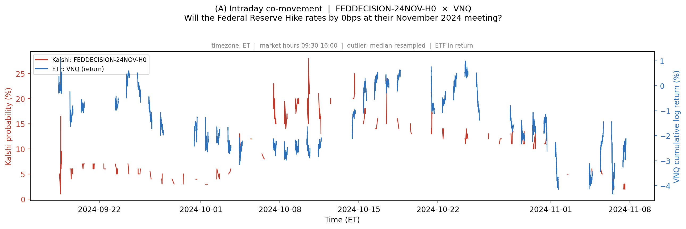
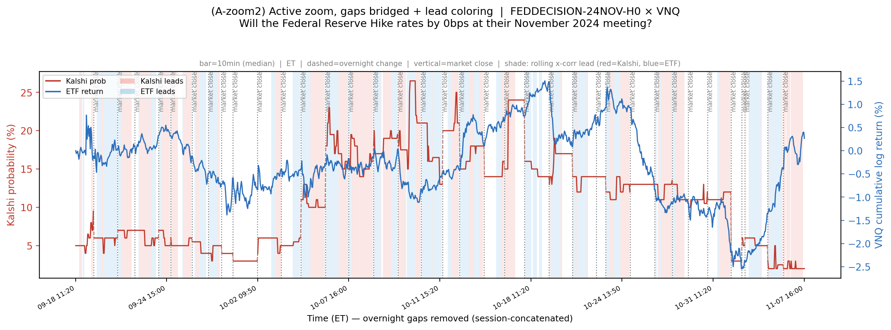
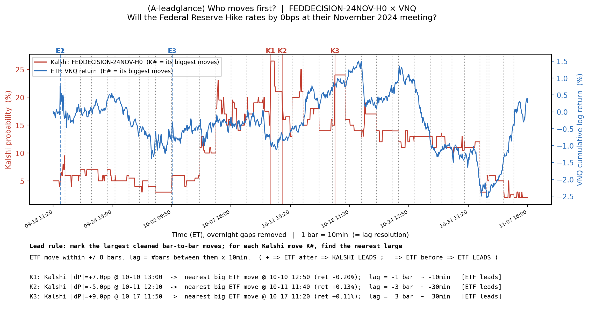
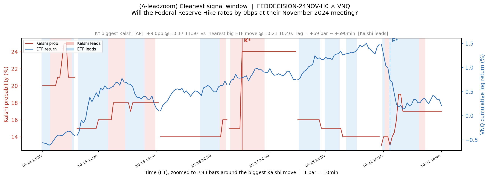
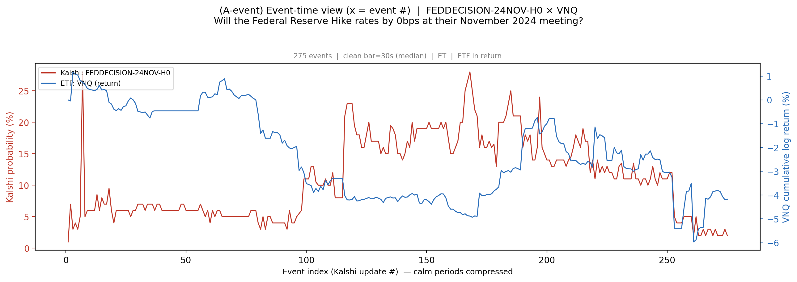
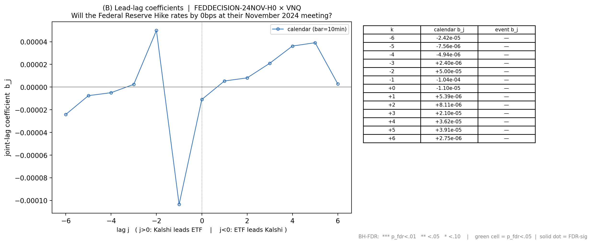

---

## Rank 8/48 — FEDDECISION-24NOV-H0 × VDE  (n_sig=0, best_p=8.0e-01, n_trades=452)

```text
PAIR ANALYSIS    —    Rank 8 / 48
================================================================================================
FEDDECISION-24NOV-H0   x   VDE
Contract : "Will the Federal Reserve Hike rates by 0bps at their November 2024 meeting?"
Sector relevance : VFH_VNQ_VPU (Rate-sensitive: Financials / Real Estate / Utilities)
Window : 2024-09-18 to 2024-11-07     Kalshi trades : 452     primary bar : 10min     daily-screen R^2 : 0.19

>>> RELIABILITY:  Adequate   <<<   (see section 5; unreliable pairs still get figures, but read their problems in section 8)

DEFINITIONS
   xₜ₋ₖ = Kalshi yes-probability change, k bars before t   (1 bar = 10min)
   yₜ   = ETF log return over bar t
   calendar = full market-hours grid: x=0 in bars with no Kalshi trade (not dropped).
   k>0 => Kalshi leads ETF ;  k<0 => ETF leads Kalshi ;  k=0 => contemporaneous

1. CALENDAR-TIME REGRESSION (clock-time lags, full RTH grid)
   Full model:  yₜ = α + Σ(k=-6..6) βₖ·xₜ₋ₖ + Σ(d=1..35) γ_d·Day_d
      where  ADL ETF self-lags p=0 (BIC chose none -> no ETF self-lag term);  day-FE: 35 day dummies over 36 trading days (first day = baseline).
      controls counted (so you can see the total at a glance):  13 lead/lag x-terms + 0 ETF self-lag(s) + 35 day-FE dummies + 1 intercept = 49 RHS regressors  (model n_params=49).
   -> 13 coefficients tested, NONE significant at raw p<0.15.

2. EVENT-TIME REGRESSION (event-count lags)
   Full model:  yₜ = α + Σ(k) βₖ·xₜ₋ₖ + (ADL self-lags) + (day fixed effects)
   -> no regression result (insufficient data).

3. FULL COEFFICIENT TABLE  (calendar primary bar  vs  event)
      k |       calendar b (FDR) |          event b (FDR)
   ------------------------------------------------------
     -6 |          +5.04e-05     |                     --
     -5 |          +4.92e-05     |                     --
     -4 |          +1.53e-06     |                     --
     -3 |          +1.62e-05     |                     --
     -2 |          -2.36e-06     |                     --
     -1 |          -2.55e-05     |                     --
     +0 |          +2.90e-05     |                     --
     +1 |          -3.79e-05     |                     --
     +2 |          -3.28e-05     |                     --
     +3 |          +2.08e-05     |                     --
     +4 |          +3.56e-05     |                     --
     +5 |          -2.89e-05     |                     --
     +6 |          +6.41e-06     |                     --
   (stars = BH-FDR corrected:  *** p_fdr<.01  ** <.05  * <.10)

4. DIRECTIONAL TEST (probit, ETF up/down)
   Model: P(ETFₜ up) = Φ(α + βₖ·xₜ₋ₖ),  one probit per lag k
   calendar: β₋₁=-1.65e-01, β₊₀=+1.45e-01, β₊₁=-1.99e-01, β₊₆=-1.44e-01
   event: β₋₁=-1.09e-01, β₊₁=-2.24e-01

5. DATA RELIABILITY (statistical, not a trade-count cutoff)
   Tier: Adequate
   (criterion = n_active: bars with an actual Kalshi move (x!=0) = the real sample that identifies the lead-lag. Full RTH grid makes n_obs large, so n_active is the honest size.)
   calendar(full RTH grid): n_active=74  n_obs=685  n_days=36  K=6  params=49  df=636  median_SE=3.56e-05  sig(FDR)=0
   event: not estimable (insufficient data)

6. COARSE-FREQUENCY ROBUSTNESS (re-run calendar at 30min / 60min)
    30min: n_obs=121 df=76 K=6  sig=0 (Kalshi-leads 0 / ETF-leads 0) -> No-sig
    60min: n_obs=87 df=45 K=5  sig=0 (Kalshi-leads 0 / ETF-leads 0) -> No-sig

7. VERDICT
   No lead-lag detected -- too sparse / no significant structure.

8. FIGURE CAVEATS — figures are still drawn, but know their problems
   - Adequate info: figures and regression are mutually readable; note that flat Kalshi segments still mean 'no trade', not 'no change'.
   - Kalshi updates only on trades (flat line = no trade, NOT 'no change'); ETF mid refreshes continuously.

------------------------------------------------------------------------------------------------
Conventions: ET | 09:30-16:00 (forward windows capped to 16:00) | ETF in log return | median causal bars | full RTH grid | day-grouped lags (no overnight) | ADL self-control | significance = BH-FDR corrected.
Figures for this pair follow on the next page.
```

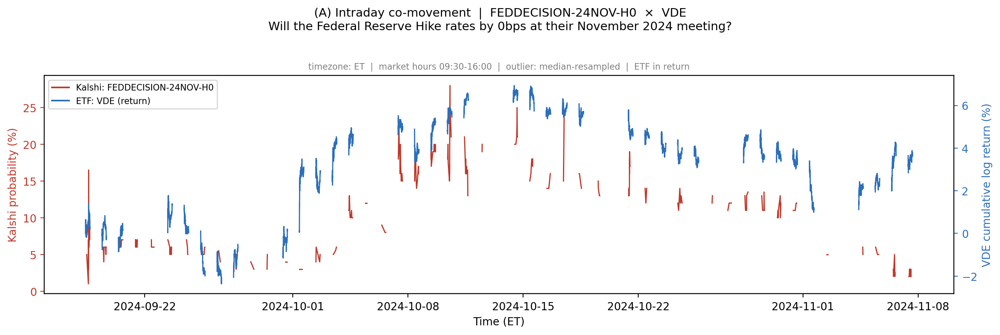
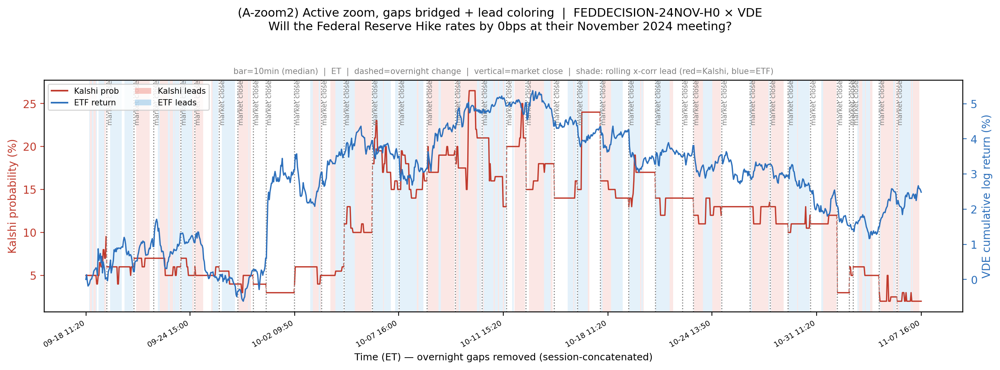
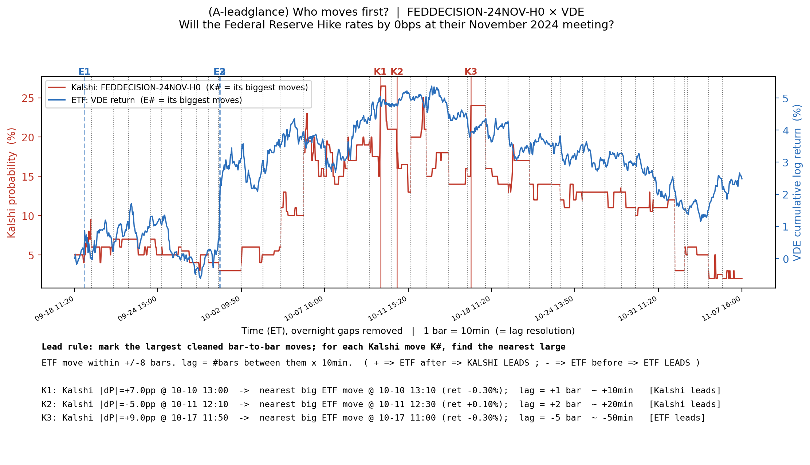
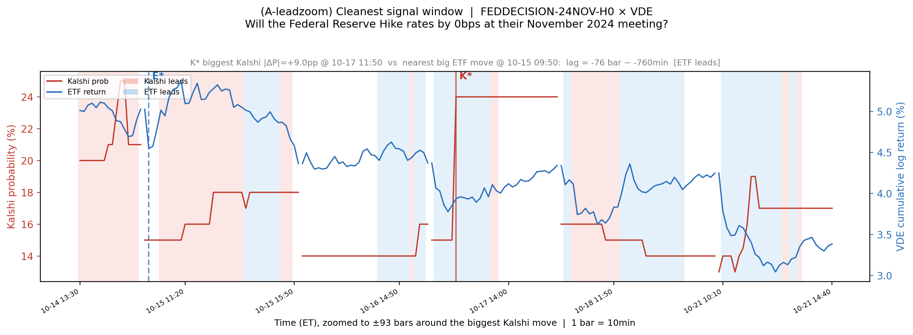
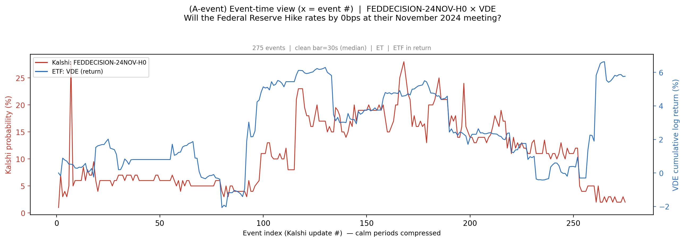
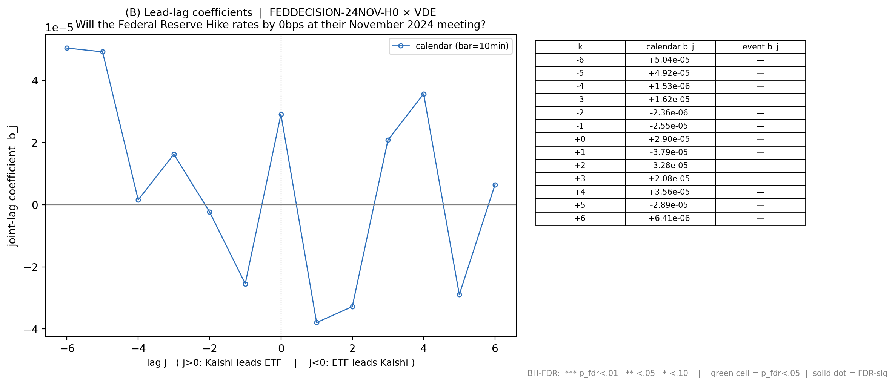

---

## Rank 9/48 — KXECDJT281 × VNQ  (n_sig=9, best_p=4.3e-06, n_trades=308)

```text
PAIR ANALYSIS    —    Rank 9 / 48
================================================================================================
KXECDJT281   x   VNQ
Contract : "Will Trump win 281-257 - AZ, GA, NC, PA?"
Sector relevance : Election outcome (all sectors)
Window : 2024-11-04 to 2024-11-25     Kalshi trades : 308     primary bar : 5min     daily-screen R^2 : 0.43

>>> RELIABILITY:  Adequate   <<<   (see section 5; unreliable pairs still get figures, but read their problems in section 8)

DEFINITIONS
   xₜ₋ₖ = Kalshi yes-probability change, k bars before t   (1 bar = 5min)
   yₜ   = ETF log return over bar t
   calendar = full market-hours grid: x=0 in bars with no Kalshi trade (not dropped).
   k>0 => Kalshi leads ETF ;  k<0 => ETF leads Kalshi ;  k=0 => contemporaneous

1. CALENDAR-TIME REGRESSION (clock-time lags, full RTH grid)
   Full model:  yₜ = α + Σ(k=-5..5) βₖ·xₜ₋ₖ + φ₁·yₜ₋₁ + Σ(d=1..10) γ_d·Day_d
      where  ADL ETF self-lags p=1 (BIC-chosen): φ₁·yₜ₋₁;  day-FE: 10 day dummies over 11 trading days (first day = baseline).
      controls counted (so you can see the total at a glance):  11 lead/lag x-terms + 1 ETF self-lag(s) + 10 day-FE dummies + 1 intercept = 23 RHS regressors  (model n_params=23).
   Significant terms (raw p<0.15) expanded:  yₜ = α + β₋₃·xₜ₊₃ + β₋₂·xₜ₊₂ + β₋₁·xₜ₊₁ + β₊₁·xₜ₋₁
   where:
      β₋₃ = -2.984e-05   (t/z=-2.60, p=9.4e-03, p_fdr=3.5e-02) **   [ETF leads]
      β₋₂ = +8.799e-05   (t/z=+5.07, p=4.0e-07, p_fdr=4.3e-06) ***   [ETF leads]
      β₋₁ = +1.114e-04   (t/z=+2.25, p=2.5e-02, p_fdr=6.8e-02) *   [ETF leads]
      β₊₁ = +8.854e-05   (t/z=+3.65, p=2.6e-04, p_fdr=1.4e-03) ***   [Kalshi leads]
   Lean by count of significant lags: ETF-leads  (k>0:1, k<0:3).

2. EVENT-TIME REGRESSION (event-count lags)
   Full model:  yₜ = α + Σ(k=-5..5) βₖ·xₜ₋ₖ + Σ(d=1..2) γ_d·Day_d
      where  ADL ETF self-lags p=0 (BIC chose none -> no ETF self-lag term);  day-FE: 2 day dummies over 3 trading days (first day = baseline).
      controls counted (so you can see the total at a glance):  11 lead/lag x-terms + 0 ETF self-lag(s) + 2 day-FE dummies + 1 intercept = 14 RHS regressors  (model n_params=14).
   Significant terms (raw p<0.15) expanded:  yₜ = α + β₋₄·xₜ₊₄ + β₋₃·xₜ₊₃ + β₊₁·xₜ₋₁ + β₊₂·xₜ₋₂ + β₊₄·xₜ₋₄
   where:
      β₋₄ = -1.020e-04   (t/z=-2.30, p=2.1e-02, p_fdr=5.8e-02) *   [ETF leads]
      β₋₃ = -1.100e-04   (t/z=-3.88, p=1.0e-04, p_fdr=1.2e-03) ***   [ETF leads]
      β₊₁ = +2.788e-04   (t/z=+3.31, p=9.2e-04, p_fdr=3.4e-03) ***   [Kalshi leads]
      β₊₂ = +3.501e-04   (t/z=+1.64, p=1.0e-01, p_fdr=2.2e-01)    [Kalshi leads]
      β₊₄ = +8.416e-05   (t/z=+3.68, p=2.3e-04, p_fdr=1.3e-03) ***   [Kalshi leads]
   Lean by count of significant lags: Kalshi-leads  (k>0:3, k<0:2).

3. FULL COEFFICIENT TABLE  (calendar primary bar  vs  event)
      k |       calendar b (FDR) |          event b (FDR)
   ------------------------------------------------------
     -5 |          -2.56e-06     |          -8.13e-05    
     -4 |          -1.21e-05     |          -1.02e-04 *  
     -3 |          -2.98e-05 **  |          -1.10e-04 ***
     -2 |          +8.80e-05 *** |          -1.96e-04    
     -1 |          +1.11e-04 *   |          +1.84e-04    
     +0 |          -1.06e-05     |          +5.84e-05    
     +1 |          +8.85e-05 *** |          +2.79e-04 ***
     +2 |          +1.14e-05     |          +3.50e-04    
     +3 |          +3.53e-05     |          +2.06e-04    
     +4 |          +5.40e-06     |          +8.42e-05 ***
     +5 |          +1.62e-05     |          +1.11e-04    
   (stars = BH-FDR corrected:  *** p_fdr<.01  ** <.05  * <.10)

4. DIRECTIONAL TEST (probit, ETF up/down)
   Model: P(ETFₜ up) = Φ(α + βₖ·xₜ₋ₖ),  one probit per lag k
   calendar: β₋₅=+1.07e-01, β₋₂=+1.82e-01, β₊₀=-3.53e-01, β₊₂=-2.10e-01, β₊₅=-1.68e-01
   event: β₋₃=+1.43e-01, β₋₁=+8.75e-02, β₊₀=-7.71e-02

5. DATA RELIABILITY (statistical, not a trade-count cutoff)
   Tier: Adequate
   (criterion = n_active: bars with an actual Kalshi move (x!=0) = the real sample that identifies the lead-lag. Full RTH grid makes n_obs large, so n_active is the honest size.)
   calendar(full RTH grid): n_active=53  n_obs=492  n_days=11  K=5  params=23  df=469  median_SE=2.10e-05  sig(FDR)=3
   event: n_active=37  n_obs=60  n_days=3  K=5  params=14  df=46  median_SE=8.41e-05  sig(FDR)=3

6. COARSE-FREQUENCY ROBUSTNESS (re-run calendar at 30min / 60min)
    30min: n_obs=32 df=16 K=5  sig=3 (Kalshi-leads 1 / ETF-leads 1) -> Balanced/mixed
    60min: n_obs=18 df=4 K=4  sig=1 (Kalshi-leads 0 / ETF-leads 1) -> ETF-leads

7. VERDICT
   Calendar leans ETF-leads but Event leans Kalshi-leads -- NOT robust across time-axis; no clean lead.

8. FIGURE CAVEATS — figures are still drawn, but know their problems
   - Adequate info: figures and regression are mutually readable; note that flat Kalshi segments still mean 'no trade', not 'no change'.
   - Mixed coefficient signs across lags -- relationship not monotone.
   - Kalshi updates only on trades (flat line = no trade, NOT 'no change'); ETF mid refreshes continuously.

9. REAL-WORLD CONTEXT (WebSearch-verified; see URLs)
   - 2024 US presidential election held Tue Nov 5, 2024; ballots counted overnight Nov 5-6.
   - AP called the race for Trump ~5:34-5:37 AM ET on Wed Nov 6, 2024 (Wisconsin pushed him past 270) -- this is PRE-MARKET, so the regular-hours equity reaction shows up at the Nov 6 open.
   - Final electoral result: Trump 312, Harris 226.
   - Sources: en.wikipedia.org/wiki/2024_United_States_presidential_election ; spectrumlocalnews.com/us/snplus/news/2024/11/06/trump-wins-ap-projection-2024-election

------------------------------------------------------------------------------------------------
Conventions: ET | 09:30-16:00 (forward windows capped to 16:00) | ETF in log return | median causal bars | full RTH grid | day-grouped lags (no overnight) | ADL self-control | significance = BH-FDR corrected.
Figures for this pair follow on the next page.
```

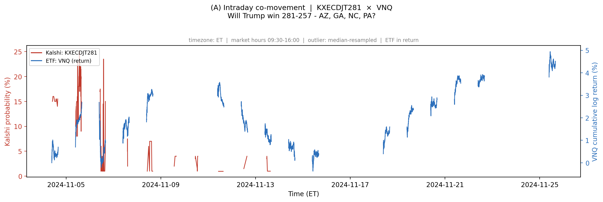
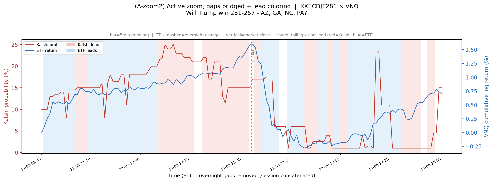
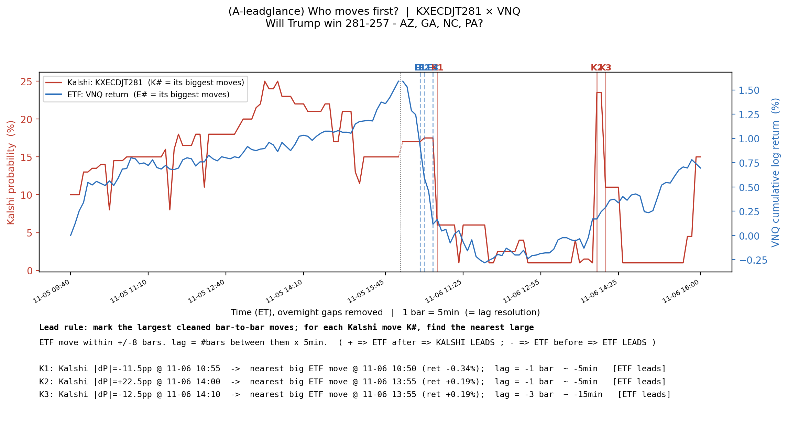
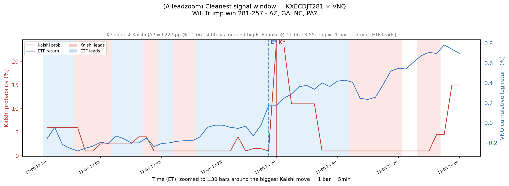
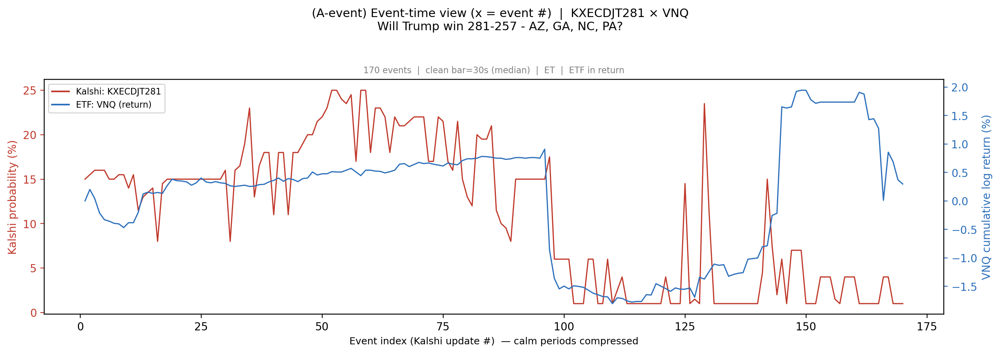
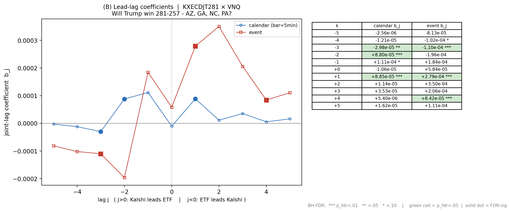

---

## Rank 10/48 — KXECDJT281 × VOX  (n_sig=6, best_p=1.6e-05, n_trades=308)

```text
PAIR ANALYSIS    —    Rank 10 / 48
================================================================================================
KXECDJT281   x   VOX
Contract : "Will Trump win 281-257 - AZ, GA, NC, PA?"
Sector relevance : Election outcome (all sectors)
Window : 2024-11-04 to 2024-11-25     Kalshi trades : 308     primary bar : 5min     daily-screen R^2 : 0.33

>>> RELIABILITY:  Adequate   <<<   (see section 5; unreliable pairs still get figures, but read their problems in section 8)

DEFINITIONS
   xₜ₋ₖ = Kalshi yes-probability change, k bars before t   (1 bar = 5min)
   yₜ   = ETF log return over bar t
   calendar = full market-hours grid: x=0 in bars with no Kalshi trade (not dropped).
   k>0 => Kalshi leads ETF ;  k<0 => ETF leads Kalshi ;  k=0 => contemporaneous

1. CALENDAR-TIME REGRESSION (clock-time lags, full RTH grid)
   Full model:  yₜ = α + Σ(k=-5..5) βₖ·xₜ₋ₖ + φ₁·yₜ₋₁ + Σ(d=1..10) γ_d·Day_d
      where  ADL ETF self-lags p=1 (BIC-chosen): φ₁·yₜ₋₁;  day-FE: 10 day dummies over 11 trading days (first day = baseline).
      controls counted (so you can see the total at a glance):  11 lead/lag x-terms + 1 ETF self-lag(s) + 10 day-FE dummies + 1 intercept = 23 RHS regressors  (model n_params=23).
   Significant terms (raw p<0.15) expanded:  yₜ = α + β₋₃·xₜ₊₃ + β₋₂·xₜ₊₂ + β₋₁·xₜ₊₁ + β₊₃·xₜ₋₃
   where:
      β₋₃ = +2.976e-05   (t/z=+2.71, p=6.7e-03, p_fdr=2.5e-02) **   [ETF leads]
      β₋₂ = +5.158e-05   (t/z=+3.38, p=7.3e-04, p_fdr=4.0e-03) ***   [ETF leads]
      β₋₁ = +1.609e-05   (t/z=+1.63, p=1.0e-01, p_fdr=2.8e-01)    [ETF leads]
      β₊₃ = +3.848e-05   (t/z=+4.81, p=1.5e-06, p_fdr=1.6e-05) ***   [Kalshi leads]
   Lean by count of significant lags: ETF-leads  (k>0:1, k<0:3).

2. EVENT-TIME REGRESSION (event-count lags)
   Full model:  yₜ = α + Σ(k=-5..5) βₖ·xₜ₋ₖ + Σ(d=1..2) γ_d·Day_d
      where  ADL ETF self-lags p=0 (BIC chose none -> no ETF self-lag term);  day-FE: 2 day dummies over 3 trading days (first day = baseline).
      controls counted (so you can see the total at a glance):  11 lead/lag x-terms + 0 ETF self-lag(s) + 2 day-FE dummies + 1 intercept = 14 RHS regressors  (model n_params=14).
   Significant terms (raw p<0.15) expanded:  yₜ = α + β₋₁·xₜ₊₁ + β₊₂·xₜ₋₂
   where:
      β₋₁ = +1.916e-04   (t/z=+2.31, p=2.1e-02, p_fdr=1.2e-01)    [ETF leads]
      β₊₂ = +2.670e-04   (t/z=+2.89, p=3.8e-03, p_fdr=4.2e-02) **   [Kalshi leads]
   Lean by count of significant lags: balanced/no clear side  (k>0:1, k<0:1).

3. FULL COEFFICIENT TABLE  (calendar primary bar  vs  event)
      k |       calendar b (FDR) |          event b (FDR)
   ------------------------------------------------------
     -5 |          +1.42e-05     |          -1.80e-06    
     -4 |          +6.85e-06     |          -2.90e-05    
     -3 |          +2.98e-05 **  |          -1.26e-05    
     -2 |          +5.16e-05 *** |          -1.69e-05    
     -1 |          +1.61e-05     |          +1.92e-04    
     +0 |          +2.51e-05     |          +1.99e-05    
     +1 |          -6.10e-07     |          +5.99e-05    
     +2 |          +2.38e-05     |          +2.67e-04 ** 
     +3 |          +3.85e-05 *** |          +2.84e-05    
     +4 |          -3.12e-06     |          +7.27e-05    
     +5 |          -2.99e-05     |          +1.27e-04    
   (stars = BH-FDR corrected:  *** p_fdr<.01  ** <.05  * <.10)

4. DIRECTIONAL TEST (probit, ETF up/down)
   Model: P(ETFₜ up) = Φ(α + βₖ·xₜ₋ₖ),  one probit per lag k
   calendar: β₋₁=+2.70e-01***, β₊₅=+6.16e-02, β₊₆=+1.18e-01
   event: β₋₄=+1.80e-01*, β₋₁=+1.13e-01*, β₊₀=+1.24e-01, β₊₃=-1.86e-01

5. DATA RELIABILITY (statistical, not a trade-count cutoff)
   Tier: Adequate
   (criterion = n_active: bars with an actual Kalshi move (x!=0) = the real sample that identifies the lead-lag. Full RTH grid makes n_obs large, so n_active is the honest size.)
   calendar(full RTH grid): n_active=53  n_obs=492  n_days=11  K=5  params=23  df=469  median_SE=1.44e-05  sig(FDR)=3
   event: n_active=37  n_obs=60  n_days=3  K=5  params=14  df=46  median_SE=8.88e-05  sig(FDR)=1

6. COARSE-FREQUENCY ROBUSTNESS (re-run calendar at 30min / 60min)
    30min: n_obs=32 df=16 K=5  sig=4 (Kalshi-leads 2 / ETF-leads 2) -> Balanced/mixed
    60min: n_obs=18 df=4 K=4  sig=2 (Kalshi-leads 2 / ETF-leads 0) -> Kalshi-leads

7. VERDICT
   Calendar leans ETF-leads but Event leans balanced -- NOT robust across time-axis; no clean lead.

8. FIGURE CAVEATS — figures are still drawn, but know their problems
   - Adequate info: figures and regression are mutually readable; note that flat Kalshi segments still mean 'no trade', not 'no change'.
   - Kalshi updates only on trades (flat line = no trade, NOT 'no change'); ETF mid refreshes continuously.

9. REAL-WORLD CONTEXT (WebSearch-verified; see URLs)
   - 2024 US presidential election held Tue Nov 5, 2024; ballots counted overnight Nov 5-6.
   - AP called the race for Trump ~5:34-5:37 AM ET on Wed Nov 6, 2024 (Wisconsin pushed him past 270) -- this is PRE-MARKET, so the regular-hours equity reaction shows up at the Nov 6 open.
   - Final electoral result: Trump 312, Harris 226.
   - Sources: en.wikipedia.org/wiki/2024_United_States_presidential_election ; spectrumlocalnews.com/us/snplus/news/2024/11/06/trump-wins-ap-projection-2024-election

------------------------------------------------------------------------------------------------
Conventions: ET | 09:30-16:00 (forward windows capped to 16:00) | ETF in log return | median causal bars | full RTH grid | day-grouped lags (no overnight) | ADL self-control | significance = BH-FDR corrected.
Figures for this pair follow on the next page.
```

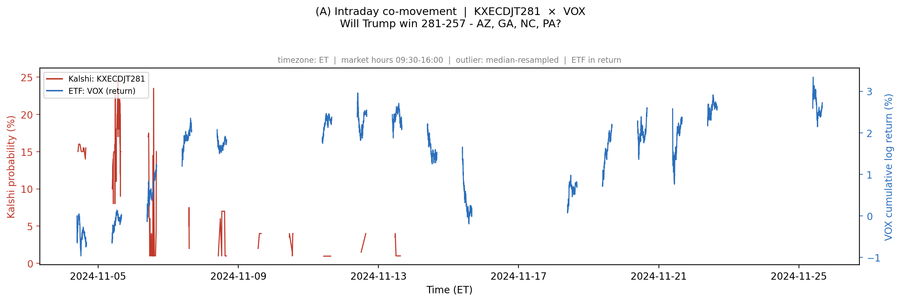
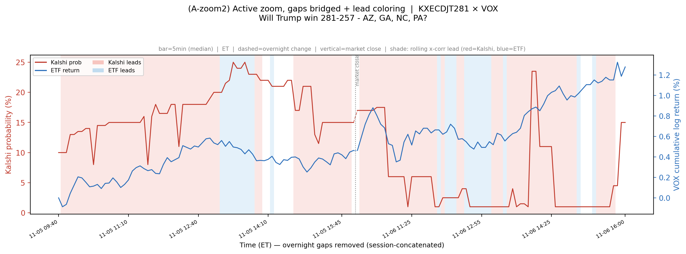
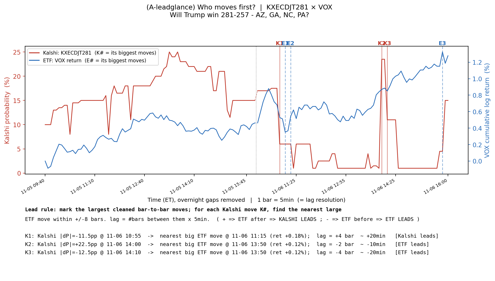
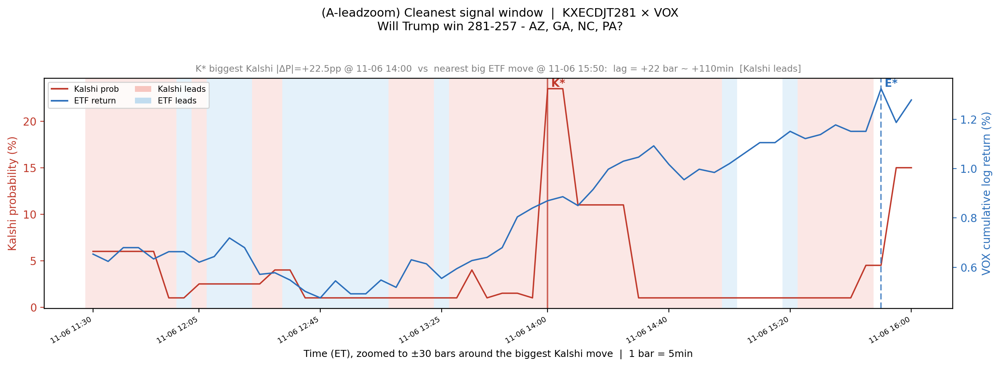
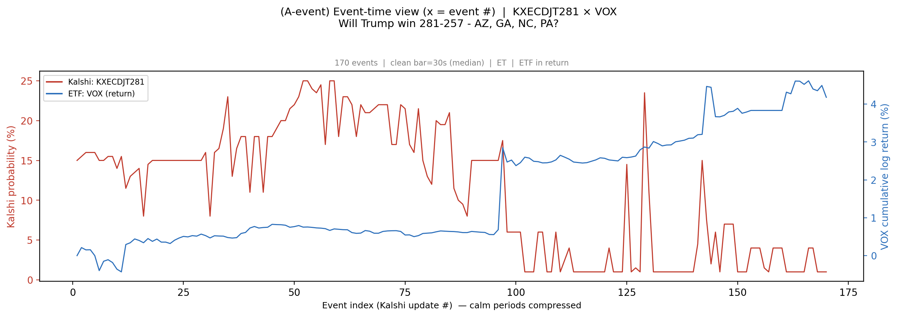
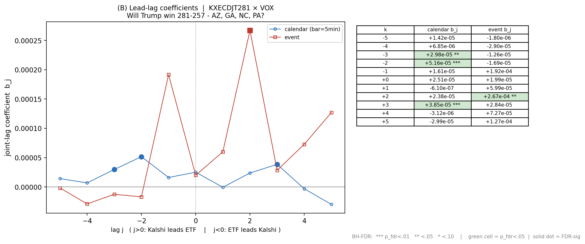

---

## Rank 11/48 — KXECDJT281 × VGT  (n_sig=4, best_p=3.8e-05, n_trades=308)

```text
PAIR ANALYSIS    —    Rank 11 / 48
================================================================================================
KXECDJT281   x   VGT
Contract : "Will Trump win 281-257 - AZ, GA, NC, PA?"
Sector relevance : Election outcome (all sectors)
Window : 2024-11-04 to 2024-11-25     Kalshi trades : 308     primary bar : 5min     daily-screen R^2 : 0.32

>>> RELIABILITY:  Adequate   <<<   (see section 5; unreliable pairs still get figures, but read their problems in section 8)

DEFINITIONS
   xₜ₋ₖ = Kalshi yes-probability change, k bars before t   (1 bar = 5min)
   yₜ   = ETF log return over bar t
   calendar = full market-hours grid: x=0 in bars with no Kalshi trade (not dropped).
   k>0 => Kalshi leads ETF ;  k<0 => ETF leads Kalshi ;  k=0 => contemporaneous

1. CALENDAR-TIME REGRESSION (clock-time lags, full RTH grid)
   Full model:  yₜ = α + Σ(k=-5..5) βₖ·xₜ₋ₖ + φ₁·yₜ₋₁ + φ₂·yₜ₋₂ + Σ(d=1..10) γ_d·Day_d
      where  ADL ETF self-lags p=2 (BIC-chosen): φ₁·yₜ₋₁ + φ₂·yₜ₋₂;  day-FE: 10 day dummies over 11 trading days (first day = baseline).
      controls counted (so you can see the total at a glance):  11 lead/lag x-terms + 2 ETF self-lag(s) + 10 day-FE dummies + 1 intercept = 24 RHS regressors  (model n_params=24).
   Significant terms (raw p<0.15) expanded:  yₜ = α + β₋₁·xₜ₊₁
   where:
      β₋₁ = -2.456e-05   (t/z=-2.75, p=5.9e-03, p_fdr=6.5e-02) *   [ETF leads]
   Lean by count of significant lags: ETF-leads  (k>0:0, k<0:1).

2. EVENT-TIME REGRESSION (event-count lags)
   Full model:  yₜ = α + Σ(k=-5..5) βₖ·xₜ₋ₖ + Σ(d=1..2) γ_d·Day_d
      where  ADL ETF self-lags p=0 (BIC chose none -> no ETF self-lag term);  day-FE: 2 day dummies over 3 trading days (first day = baseline).
      controls counted (so you can see the total at a glance):  11 lead/lag x-terms + 0 ETF self-lag(s) + 2 day-FE dummies + 1 intercept = 14 RHS regressors  (model n_params=14).
   Significant terms (raw p<0.15) expanded:  yₜ = α + β₋₁·xₜ₊₁ + β₊₀·xₜ + β₊₅·xₜ₋₅
   where:
      β₋₁ = -7.498e-05   (t/z=-3.08, p=2.0e-03, p_fdr=7.5e-03) ***   [ETF leads]
      β₊₀ = -2.400e-04   (t/z=-4.64, p=3.5e-06, p_fdr=3.8e-05) ***   [contemporaneous]
      β₊₅ = +1.702e-04   (t/z=+4.30, p=1.7e-05, p_fdr=9.3e-05) ***   [Kalshi leads]
   Lean by count of significant lags: balanced/no clear side  (k>0:1, k<0:1).

3. FULL COEFFICIENT TABLE  (calendar primary bar  vs  event)
      k |       calendar b (FDR) |          event b (FDR)
   ------------------------------------------------------
     -5 |          -1.53e-05     |          -6.25e-05    
     -4 |          +1.67e-05     |          +2.96e-05    
     -3 |          -4.60e-06     |          -4.55e-06    
     -2 |          +2.89e-05     |          -3.39e-05    
     -1 |          -2.46e-05 *   |          -7.50e-05 ***
     +0 |          -1.64e-05     |          -2.40e-04 ***
     +1 |          -1.29e-05     |          -1.18e-04    
     +2 |          +8.52e-06     |          +5.15e-05    
     +3 |          -2.08e-05     |          +1.03e-05    
     +4 |          -9.49e-06     |          +5.25e-05    
     +5 |          -4.61e-05     |          +1.70e-04 ***
   (stars = BH-FDR corrected:  *** p_fdr<.01  ** <.05  * <.10)

4. DIRECTIONAL TEST (probit, ETF up/down)
   Model: P(ETFₜ up) = Φ(α + βₖ·xₜ₋ₖ),  one probit per lag k
   calendar: β₋₄=+1.44e-01, β₊₁=-1.09e-01
   event: β₋₆=-6.38e-02, β₋₄=+1.52e-01

5. DATA RELIABILITY (statistical, not a trade-count cutoff)
   Tier: Adequate
   (criterion = n_active: bars with an actual Kalshi move (x!=0) = the real sample that identifies the lead-lag. Full RTH grid makes n_obs large, so n_active is the honest size.)
   calendar(full RTH grid): n_active=53  n_obs=492  n_days=11  K=5  params=24  df=468  median_SE=2.06e-05  sig(FDR)=0
   event: n_active=37  n_obs=60  n_days=3  K=5  params=14  df=46  median_SE=5.94e-05  sig(FDR)=3

6. COARSE-FREQUENCY ROBUSTNESS (re-run calendar at 30min / 60min)
    30min: n_obs=32 df=16 K=5  sig=4 (Kalshi-leads 2 / ETF-leads 2) -> Balanced/mixed
    60min: n_obs=18 df=4 K=4  sig=0 (Kalshi-leads 0 / ETF-leads 0) -> No-sig

7. VERDICT
   Calendar leans ETF-leads but Event leans balanced -- NOT robust across time-axis; no clean lead.

8. FIGURE CAVEATS — figures are still drawn, but know their problems
   - Adequate info: figures and regression are mutually readable; note that flat Kalshi segments still mean 'no trade', not 'no change'.
   - Mixed coefficient signs across lags -- relationship not monotone.
   - Kalshi updates only on trades (flat line = no trade, NOT 'no change'); ETF mid refreshes continuously.

9. REAL-WORLD CONTEXT (WebSearch-verified; see URLs)
   - 2024 US presidential election held Tue Nov 5, 2024; ballots counted overnight Nov 5-6.
   - AP called the race for Trump ~5:34-5:37 AM ET on Wed Nov 6, 2024 (Wisconsin pushed him past 270) -- this is PRE-MARKET, so the regular-hours equity reaction shows up at the Nov 6 open.
   - Final electoral result: Trump 312, Harris 226.
   - Sources: en.wikipedia.org/wiki/2024_United_States_presidential_election ; spectrumlocalnews.com/us/snplus/news/2024/11/06/trump-wins-ap-projection-2024-election

------------------------------------------------------------------------------------------------
Conventions: ET | 09:30-16:00 (forward windows capped to 16:00) | ETF in log return | median causal bars | full RTH grid | day-grouped lags (no overnight) | ADL self-control | significance = BH-FDR corrected.
Figures for this pair follow on the next page.
```

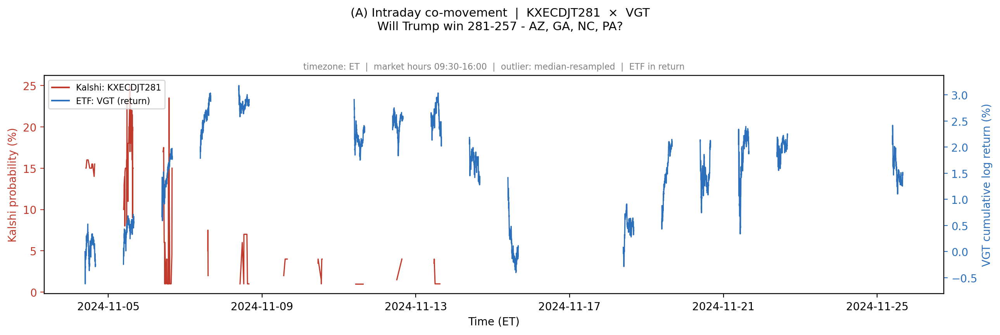
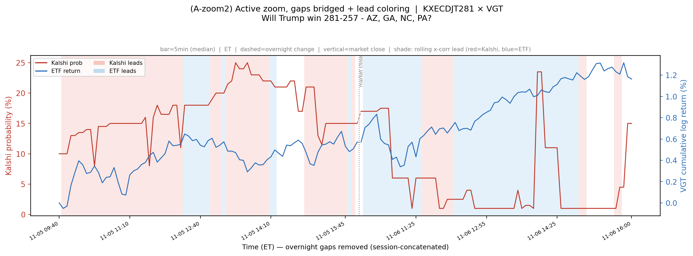
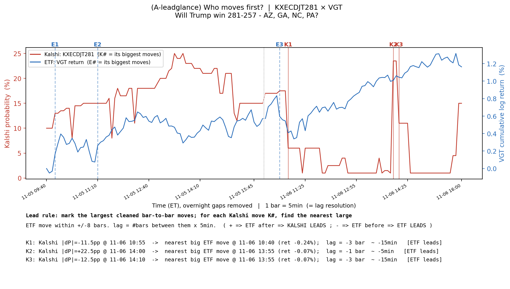
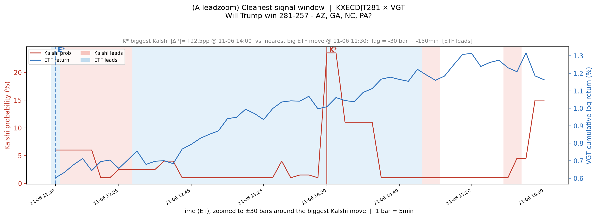

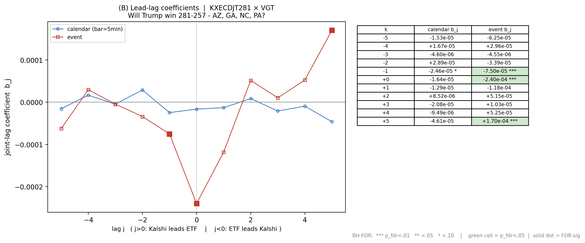

---

## Rank 12/48 — KXECDJT281 × VCR  (n_sig=4, best_p=1.1e-02, n_trades=308)

```text
PAIR ANALYSIS    —    Rank 12 / 48
================================================================================================
KXECDJT281   x   VCR
Contract : "Will Trump win 281-257 - AZ, GA, NC, PA?"
Sector relevance : Election outcome (all sectors)
Window : 2024-11-04 to 2024-11-25     Kalshi trades : 308     primary bar : 5min     daily-screen R^2 : 0.28

>>> RELIABILITY:  Adequate   <<<   (see section 5; unreliable pairs still get figures, but read their problems in section 8)

DEFINITIONS
   xₜ₋ₖ = Kalshi yes-probability change, k bars before t   (1 bar = 5min)
   yₜ   = ETF log return over bar t
   calendar = full market-hours grid: x=0 in bars with no Kalshi trade (not dropped).
   k>0 => Kalshi leads ETF ;  k<0 => ETF leads Kalshi ;  k=0 => contemporaneous

1. CALENDAR-TIME REGRESSION (clock-time lags, full RTH grid)
   Full model:  yₜ = α + Σ(k=-5..5) βₖ·xₜ₋ₖ + φ₁·yₜ₋₁ + Σ(d=1..10) γ_d·Day_d
      where  ADL ETF self-lags p=1 (BIC-chosen): φ₁·yₜ₋₁;  day-FE: 10 day dummies over 11 trading days (first day = baseline).
      controls counted (so you can see the total at a glance):  11 lead/lag x-terms + 1 ETF self-lag(s) + 10 day-FE dummies + 1 intercept = 23 RHS regressors  (model n_params=23).
   Significant terms (raw p<0.15) expanded:  yₜ = α + β₋₂·xₜ₊₂
   where:
      β₋₂ = +3.205e-05   (t/z=+2.11, p=3.5e-02, p_fdr=3.8e-01)    [ETF leads]
   Lean by count of significant lags: ETF-leads  (k>0:0, k<0:1).

2. EVENT-TIME REGRESSION (event-count lags)
   Full model:  yₜ = α + Σ(k=-5..5) βₖ·xₜ₋ₖ + Σ(d=1..2) γ_d·Day_d
      where  ADL ETF self-lags p=0 (BIC chose none -> no ETF self-lag term);  day-FE: 2 day dummies over 3 trading days (first day = baseline).
      controls counted (so you can see the total at a glance):  11 lead/lag x-terms + 0 ETF self-lag(s) + 2 day-FE dummies + 1 intercept = 14 RHS regressors  (model n_params=14).
   Significant terms (raw p<0.15) expanded:  yₜ = α + β₋₅·xₜ₊₅ + β₊₃·xₜ₋₃ + β₊₅·xₜ₋₅
   where:
      β₋₅ = -1.127e-04   (t/z=-3.28, p=1.0e-03, p_fdr=1.1e-02) **   [ETF leads]
      β₊₃ = -1.859e-04   (t/z=-1.47, p=1.4e-01, p_fdr=4.4e-01)    [Kalshi leads]
      β₊₅ = +1.298e-04   (t/z=+1.52, p=1.3e-01, p_fdr=4.4e-01)    [Kalshi leads]
   Lean by count of significant lags: Kalshi-leads  (k>0:2, k<0:1).

3. FULL COEFFICIENT TABLE  (calendar primary bar  vs  event)
      k |       calendar b (FDR) |          event b (FDR)
   ------------------------------------------------------
     -5 |          -1.38e-05     |          -1.13e-04 ** 
     -4 |          +9.43e-06     |          +1.57e-05    
     -3 |          +2.66e-05     |          -3.10e-05    
     -2 |          +3.20e-05     |          +2.90e-05    
     -1 |          +4.69e-06     |          +1.18e-04    
     +0 |          -6.89e-06     |          -5.92e-05    
     +1 |          -6.01e-06     |          -4.81e-05    
     +2 |          -7.80e-07     |          +3.16e-05    
     +3 |          +1.48e-05     |          -1.86e-04    
     +4 |          +2.47e-05     |          -5.16e-05    
     +5 |          -2.82e-06     |          +1.30e-04    
   (stars = BH-FDR corrected:  *** p_fdr<.01  ** <.05  * <.10)

4. DIRECTIONAL TEST (probit, ETF up/down)
   Model: P(ETFₜ up) = Φ(α + βₖ·xₜ₋ₖ),  one probit per lag k
   calendar: β₋₄=+3.60e-01, β₋₃=-9.30e-02, β₊₁=-6.42e-02, β₊₆=-7.91e-02
   event: β₊₁=-9.90e-02, β₊₃=-1.40e-01***, β₊₆=-5.98e-02*

5. DATA RELIABILITY (statistical, not a trade-count cutoff)
   Tier: Adequate
   (criterion = n_active: bars with an actual Kalshi move (x!=0) = the real sample that identifies the lead-lag. Full RTH grid makes n_obs large, so n_active is the honest size.)
   calendar(full RTH grid): n_active=53  n_obs=492  n_days=11  K=5  params=23  df=469  median_SE=2.52e-05  sig(FDR)=0
   event: n_active=37  n_obs=60  n_days=3  K=5  params=14  df=46  median_SE=8.56e-05  sig(FDR)=1

6. COARSE-FREQUENCY ROBUSTNESS (re-run calendar at 30min / 60min)
    30min: n_obs=32 df=16 K=5  sig=7 (Kalshi-leads 4 / ETF-leads 2) -> Kalshi-leads
    60min: n_obs=18 df=4 K=4  sig=0 (Kalshi-leads 0 / ETF-leads 0) -> No-sig

7. VERDICT
   Calendar leans ETF-leads but Event leans Kalshi-leads -- NOT robust across time-axis; no clean lead.

8. FIGURE CAVEATS — figures are still drawn, but know their problems
   - Adequate info: figures and regression are mutually readable; note that flat Kalshi segments still mean 'no trade', not 'no change'.
   - Mixed coefficient signs across lags -- relationship not monotone.
   - Kalshi updates only on trades (flat line = no trade, NOT 'no change'); ETF mid refreshes continuously.

9. REAL-WORLD CONTEXT (WebSearch-verified; see URLs)
   - 2024 US presidential election held Tue Nov 5, 2024; ballots counted overnight Nov 5-6.
   - AP called the race for Trump ~5:34-5:37 AM ET on Wed Nov 6, 2024 (Wisconsin pushed him past 270) -- this is PRE-MARKET, so the regular-hours equity reaction shows up at the Nov 6 open.
   - Final electoral result: Trump 312, Harris 226.
   - Sources: en.wikipedia.org/wiki/2024_United_States_presidential_election ; spectrumlocalnews.com/us/snplus/news/2024/11/06/trump-wins-ap-projection-2024-election

------------------------------------------------------------------------------------------------
Conventions: ET | 09:30-16:00 (forward windows capped to 16:00) | ETF in log return | median causal bars | full RTH grid | day-grouped lags (no overnight) | ADL self-control | significance = BH-FDR corrected.
Figures for this pair follow on the next page.
```

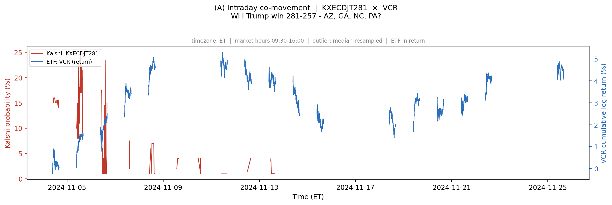
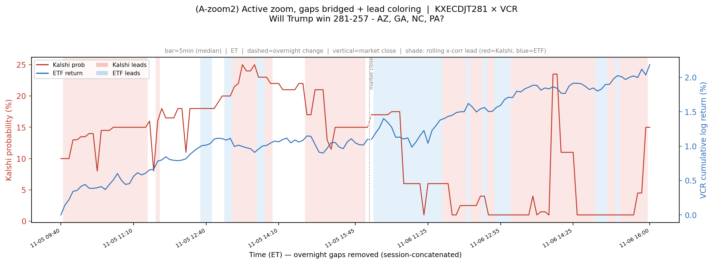
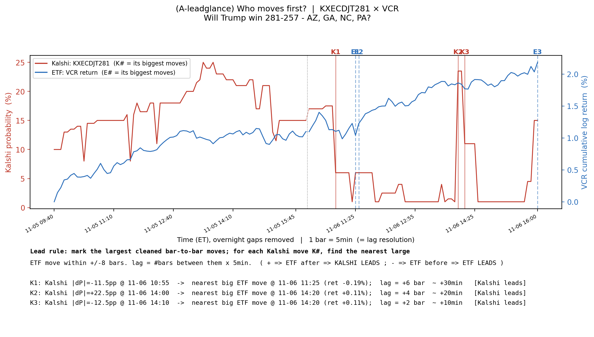
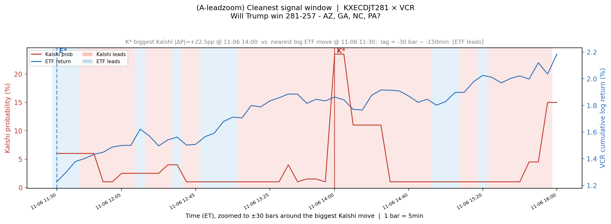
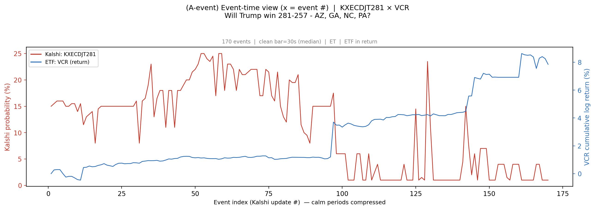
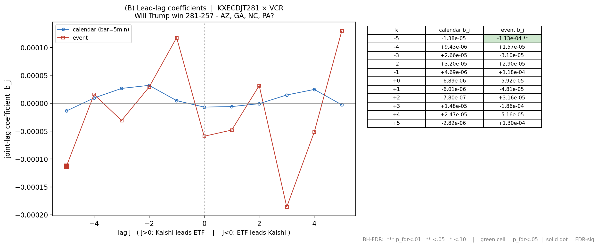

---

## Rank 13/48 — KXECDJT312 × VAW  (n_sig=7, best_p=7.6e-03, n_trades=232)

```text
PAIR ANALYSIS    —    Rank 13 / 48
================================================================================================
KXECDJT312   x   VAW
Contract : "Will Trump win 312-226 - swing state sweep?"
Sector relevance : Election outcome (all sectors)
Window : 2024-11-04 to 2024-12-12     Kalshi trades : 232     primary bar : 10min     daily-screen R^2 : 0.31

>>> RELIABILITY:  Adequate   <<<   (see section 5; unreliable pairs still get figures, but read their problems in section 8)

DEFINITIONS
   xₜ₋ₖ = Kalshi yes-probability change, k bars before t   (1 bar = 10min)
   yₜ   = ETF log return over bar t
   calendar = full market-hours grid: x=0 in bars with no Kalshi trade (not dropped).
   k>0 => Kalshi leads ETF ;  k<0 => ETF leads Kalshi ;  k=0 => contemporaneous

1. CALENDAR-TIME REGRESSION (clock-time lags, full RTH grid)
   Full model:  yₜ = α + Σ(k=-5..5) βₖ·xₜ₋ₖ + φ₁·yₜ₋₁ + Σ(d=1..16) γ_d·Day_d
      where  ADL ETF self-lags p=1 (BIC-chosen): φ₁·yₜ₋₁;  day-FE: 16 day dummies over 17 trading days (first day = baseline).
      controls counted (so you can see the total at a glance):  11 lead/lag x-terms + 1 ETF self-lag(s) + 16 day-FE dummies + 1 intercept = 29 RHS regressors  (model n_params=29).
   Significant terms (raw p<0.15) expanded:  yₜ = α + β₋₅·xₜ₊₅ + β₋₄·xₜ₊₄ + β₋₂·xₜ₊₂ + β₋₁·xₜ₊₁ + β₊₅·xₜ₋₅
   where:
      β₋₅ = +7.038e-05   (t/z=+3.30, p=9.8e-04, p_fdr=7.6e-03) ***   [ETF leads]
      β₋₄ = +6.325e-05   (t/z=+3.20, p=1.4e-03, p_fdr=7.6e-03) ***   [ETF leads]
      β₋₂ = -5.317e-05   (t/z=-2.48, p=1.3e-02, p_fdr=4.8e-02) **   [ETF leads]
      β₋₁ = +1.731e-05   (t/z=+1.56, p=1.2e-01, p_fdr=3.3e-01)    [ETF leads]
      β₊₅ = -5.190e-05   (t/z=-1.45, p=1.5e-01, p_fdr=3.3e-01)    [Kalshi leads]
   Lean by count of significant lags: ETF-leads  (k>0:1, k<0:4).

2. EVENT-TIME REGRESSION (event-count lags)
   Full model:  yₜ = α + Σ(k=-5..5) βₖ·xₜ₋ₖ + Σ(d=1..3) γ_d·Day_d
      where  ADL ETF self-lags p=0 (BIC chose none -> no ETF self-lag term);  day-FE: 3 day dummies over 4 trading days (first day = baseline).
      controls counted (so you can see the total at a glance):  11 lead/lag x-terms + 0 ETF self-lag(s) + 3 day-FE dummies + 1 intercept = 15 RHS regressors  (model n_params=15).
   Significant terms (raw p<0.15) expanded:  yₜ = α + β₊₁·xₜ₋₁ + β₊₄·xₜ₋₄
   where:
      β₊₁ = -1.337e-03   (t/z=-1.48, p=1.4e-01, p_fdr=5.2e-01)    [Kalshi leads]
      β₊₄ = -1.916e-03   (t/z=-2.17, p=3.0e-02, p_fdr=3.3e-01)    [Kalshi leads]
   Lean by count of significant lags: Kalshi-leads  (k>0:2, k<0:0).

3. FULL COEFFICIENT TABLE  (calendar primary bar  vs  event)
      k |       calendar b (FDR) |          event b (FDR)
   ------------------------------------------------------
     -5 |          +7.04e-05 *** |          +2.04e-05    
     -4 |          +6.33e-05 *** |          -1.17e-04    
     -3 |          -3.44e-05     |          -1.16e-04    
     -2 |          -5.32e-05 **  |          -8.20e-04    
     -1 |          +1.73e-05     |          -8.72e-04    
     +0 |          +8.22e-06     |          -9.70e-04    
     +1 |          -2.25e-05     |          -1.34e-03    
     +2 |          +7.00e-07     |          -9.33e-04    
     +3 |          +5.61e-06     |          -1.59e-03    
     +4 |          -1.83e-05     |          -1.92e-03    
     +5 |          -5.19e-05     |          -6.04e-04    
   (stars = BH-FDR corrected:  *** p_fdr<.01  ** <.05  * <.10)

4. DIRECTIONAL TEST (probit, ETF up/down)
   Model: P(ETFₜ up) = Φ(α + βₖ·xₜ₋ₖ),  one probit per lag k
   calendar: β₋₄=-1.63e-01**, β₋₁=+1.38e-01, β₊₄=-2.38e-01
   event: β₋₄=-2.86e-01**, β₋₁=+2.92e-01**, β₊₄=-3.08e-01**

5. DATA RELIABILITY (statistical, not a trade-count cutoff)
   Tier: Adequate
   (criterion = n_active: bars with an actual Kalshi move (x!=0) = the real sample that identifies the lead-lag. Full RTH grid makes n_obs large, so n_active is the honest size.)
   calendar(full RTH grid): n_active=40  n_obs=301  n_days=17  K=5  params=29  df=272  median_SE=2.86e-05  sig(FDR)=3
   event: n_active=22  n_obs=28  n_days=4  K=5  params=15  df=13  median_SE=9.05e-04  sig(FDR)=0

6. COARSE-FREQUENCY ROBUSTNESS (re-run calendar at 30min / 60min)
    30min: n_obs=37 df=20 K=5  sig=0 (Kalshi-leads 0 / ETF-leads 0) -> No-sig
    60min: n_obs=22 df=7 K=4  sig=3 (Kalshi-leads 0 / ETF-leads 3) -> ETF-leads

7. VERDICT
   Calendar leans ETF-leads but Event leans Kalshi-leads -- NOT robust across time-axis; no clean lead.

8. FIGURE CAVEATS — figures are still drawn, but know their problems
   - Adequate info: figures and regression are mutually readable; note that flat Kalshi segments still mean 'no trade', not 'no change'.
   - Mixed coefficient signs across lags -- relationship not monotone.
   - Kalshi updates only on trades (flat line = no trade, NOT 'no change'); ETF mid refreshes continuously.

9. REAL-WORLD CONTEXT (WebSearch-verified; see URLs)
   - 2024 US presidential election held Tue Nov 5, 2024; ballots counted overnight Nov 5-6.
   - AP called the race for Trump ~5:34-5:37 AM ET on Wed Nov 6, 2024 (Wisconsin pushed him past 270) -- this is PRE-MARKET, so the regular-hours equity reaction shows up at the Nov 6 open.
   - Final electoral result: Trump 312, Harris 226.
   - Sources: en.wikipedia.org/wiki/2024_United_States_presidential_election ; spectrumlocalnews.com/us/snplus/news/2024/11/06/trump-wins-ap-projection-2024-election

------------------------------------------------------------------------------------------------
Conventions: ET | 09:30-16:00 (forward windows capped to 16:00) | ETF in log return | median causal bars | full RTH grid | day-grouped lags (no overnight) | ADL self-control | significance = BH-FDR corrected.
Figures for this pair follow on the next page.
```

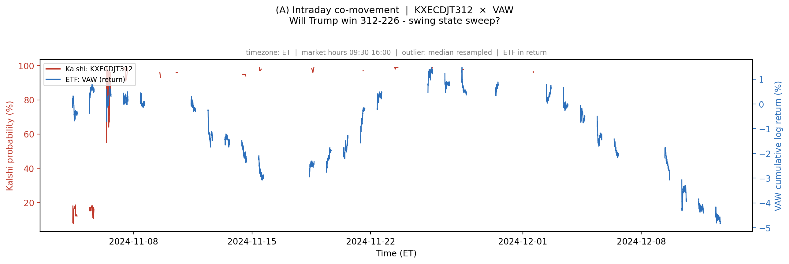
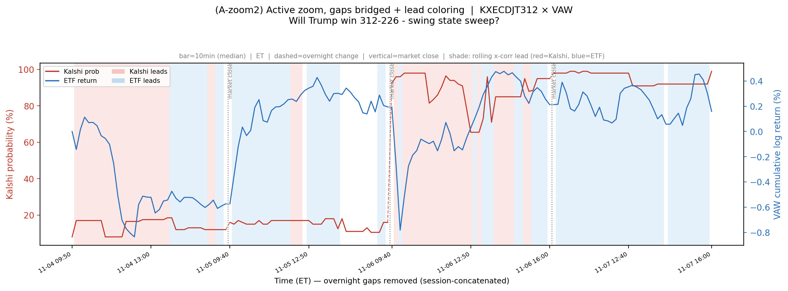
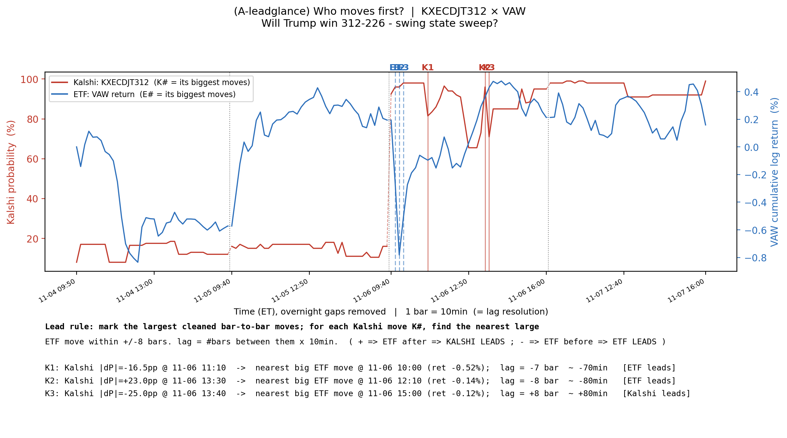
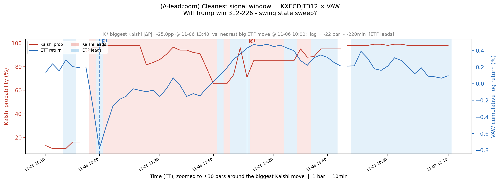
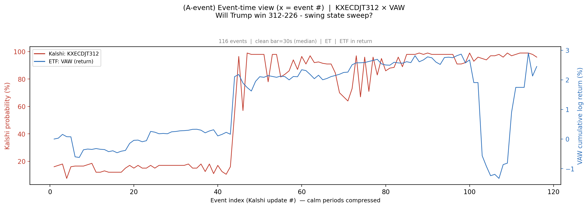
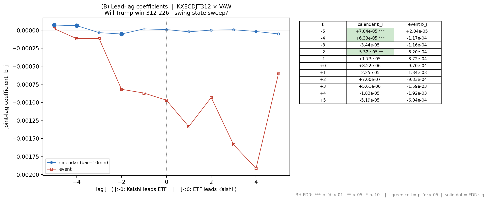

---

## Rank 14/48 — KXECDJT306 × VDC  (n_sig=8, best_p=2.4e-19, n_trades=123)

```text
PAIR ANALYSIS    —    Rank 14 / 48
================================================================================================
KXECDJT306   x   VDC
Contract : "Will Trump win 306-232 - AZ, GA, MI, PA, WI, NC?"
Sector relevance : Election outcome (all sectors)
Window : 2024-11-04 to 2024-12-16     Kalshi trades : 123     primary bar : 10min     daily-screen R^2 : 0.32

>>> RELIABILITY:  Low-info   <<<   (see section 5; unreliable pairs still get figures, but read their problems in section 8)

DEFINITIONS
   xₜ₋ₖ = Kalshi yes-probability change, k bars before t   (1 bar = 10min)
   yₜ   = ETF log return over bar t
   calendar = full market-hours grid: x=0 in bars with no Kalshi trade (not dropped).
   k>0 => Kalshi leads ETF ;  k<0 => ETF leads Kalshi ;  k=0 => contemporaneous

1. CALENDAR-TIME REGRESSION (clock-time lags, full RTH grid)
   Full model:  yₜ = α + Σ(k=-4..4) βₖ·xₜ₋ₖ + φ₁·yₜ₋₁ + φ₂·yₜ₋₂ + φ₃·yₜ₋₃ + Σ(d=1..12) γ_d·Day_d
      where  ADL ETF self-lags p=3 (BIC-chosen): φ₁·yₜ₋₁ + φ₂·yₜ₋₂ + φ₃·yₜ₋₃;  day-FE: 12 day dummies over 13 trading days (first day = baseline).
      controls counted (so you can see the total at a glance):  9 lead/lag x-terms + 3 ETF self-lag(s) + 12 day-FE dummies + 1 intercept = 25 RHS regressors  (model n_params=25).
   Significant terms (raw p<0.15) expanded:  yₜ = α + β₋₄·xₜ₊₄ + β₋₃·xₜ₊₃ + β₋₂·xₜ₊₂ + β₊₀·xₜ + β₊₁·xₜ₋₁ + β₊₂·xₜ₋₂ + β₊₃·xₜ₋₃ + β₊₄·xₜ₋₄
   where:
      β₋₄ = -3.617e-05   (t/z=-6.49, p=8.5e-11, p_fdr=3.8e-10) ***   [ETF leads]
      β₋₃ = -2.254e-05   (t/z=-2.57, p=1.0e-02, p_fdr=1.3e-02) **   [ETF leads]
      β₋₂ = +4.835e-05   (t/z=+9.23, p=2.6e-20, p_fdr=2.4e-19) ***   [ETF leads]
      β₊₀ = -5.342e-05   (t/z=-5.24, p=1.6e-07, p_fdr=4.8e-07) ***   [contemporaneous]
      β₊₁ = +3.960e-05   (t/z=+3.27, p=1.1e-03, p_fdr=1.9e-03) ***   [Kalshi leads]
      β₊₂ = +1.648e-05   (t/z=+2.91, p=3.6e-03, p_fdr=5.5e-03) ***   [Kalshi leads]
      β₊₃ = +4.123e-05   (t/z=+3.74, p=1.8e-04, p_fdr=4.1e-04) ***   [Kalshi leads]
      β₊₄ = -4.758e-05   (t/z=-1.59, p=1.1e-01, p_fdr=1.3e-01)    [Kalshi leads]
   Lean by count of significant lags: Kalshi-leads  (k>0:4, k<0:3).

2. EVENT-TIME REGRESSION (event-count lags)
   Full model:  yₜ = α + Σ(k=-4..4) βₖ·xₜ₋ₖ + φ₁·yₜ₋₁ + φ₂·yₜ₋₂ + φ₃·yₜ₋₃ + Σ(d=1..1) γ_d·Day_d
      where  ADL ETF self-lags p=3 (BIC-chosen): φ₁·yₜ₋₁ + φ₂·yₜ₋₂ + φ₃·yₜ₋₃;  day-FE: 1 day dummies over 2 trading days (first day = baseline).
      controls counted (so you can see the total at a glance):  9 lead/lag x-terms + 3 ETF self-lag(s) + 1 day-FE dummies + 1 intercept = 14 RHS regressors  (model n_params=14).
   -> 9 coefficients tested, NONE significant at raw p<0.15.

3. FULL COEFFICIENT TABLE  (calendar primary bar  vs  event)
      k |       calendar b (FDR) |          event b (FDR)
   ------------------------------------------------------
     -4 |          -3.62e-05 *** |          -1.64e-04    
     -3 |          -2.25e-05 **  |          -3.96e-04    
     -2 |          +4.84e-05 *** |          -3.35e-04    
     -1 |          +4.56e-06     |          -3.50e-04    
     +0 |          -5.34e-05 *** |          -4.26e-04    
     +1 |          +3.96e-05 *** |          -4.83e-04    
     +2 |          +1.65e-05 *** |          +1.21e-04    
     +3 |          +4.12e-05 *** |          -7.22e-04    
     +4 |          -4.76e-05     |          +7.84e-06    
   (stars = BH-FDR corrected:  *** p_fdr<.01  ** <.05  * <.10)

4. DIRECTIONAL TEST (probit, ETF up/down)
   Model: P(ETFₜ up) = Φ(α + βₖ·xₜ₋ₖ),  one probit per lag k
   calendar: β₋₃=-9.65e-01***, β₋₂=+2.07e-01*, β₋₁=+2.07e-01***
   event: β₋₃=-1.18e+00***, β₋₂=+2.17e-01*, β₋₁=+1.86e-01***, β₊₀=-1.64e-01***, β₊₃=-3.28e-01***

5. DATA RELIABILITY (statistical, not a trade-count cutoff)
   Tier: Low-info
   (criterion = n_active: bars with an actual Kalshi move (x!=0) = the real sample that identifies the lead-lag. Full RTH grid makes n_obs large, so n_active is the honest size.)
   calendar(full RTH grid): n_active=21  n_obs=265  n_days=13  K=4  params=25  df=240  median_SE=1.02e-05  sig(FDR)=7
   event: n_active=12  n_obs=13  n_days=2  K=4  params=14  df=-1  median_SE=nan  sig(FDR)=0

6. COARSE-FREQUENCY ROBUSTNESS (re-run calendar at 30min / 60min)
    30min: n_obs=15 df=3 K=4  sig=6 (Kalshi-leads 3 / ETF-leads 2) -> Kalshi-leads
    60min: not estimable (n_obs=14 < minimum) -- coarser bars have even fewer observations

7. VERDICT
   Only one time-axis significant (Kalshi-leads) -- weak / single-mode evidence.

8. FIGURE CAVEATS — figures are still drawn, but know their problems
   - Low info (15<= active bars <40): direction is indicative but imprecise; do not over-interpret any single coefficient.
   - Mixed coefficient signs across lags -- relationship not monotone.
   - Kalshi updates only on trades (flat line = no trade, NOT 'no change'); ETF mid refreshes continuously.

9. REAL-WORLD CONTEXT (WebSearch-verified; see URLs)
   - 2024 US presidential election held Tue Nov 5, 2024; ballots counted overnight Nov 5-6.
   - AP called the race for Trump ~5:34-5:37 AM ET on Wed Nov 6, 2024 (Wisconsin pushed him past 270) -- this is PRE-MARKET, so the regular-hours equity reaction shows up at the Nov 6 open.
   - Final electoral result: Trump 312, Harris 226.
   - Sources: en.wikipedia.org/wiki/2024_United_States_presidential_election ; spectrumlocalnews.com/us/snplus/news/2024/11/06/trump-wins-ap-projection-2024-election

------------------------------------------------------------------------------------------------
Conventions: ET | 09:30-16:00 (forward windows capped to 16:00) | ETF in log return | median causal bars | full RTH grid | day-grouped lags (no overnight) | ADL self-control | significance = BH-FDR corrected.
Figures for this pair follow on the next page.
```

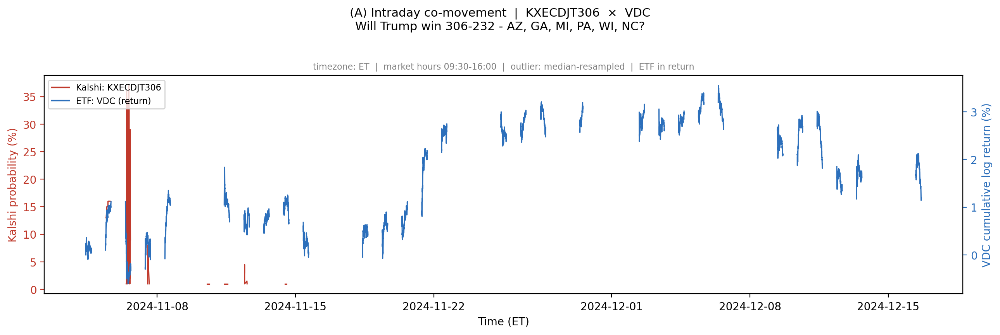
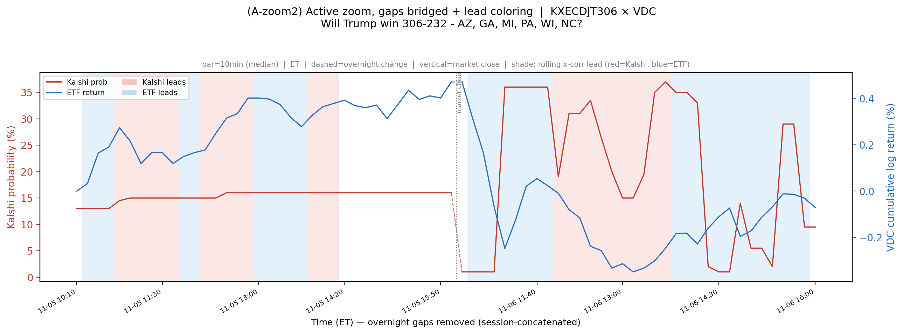
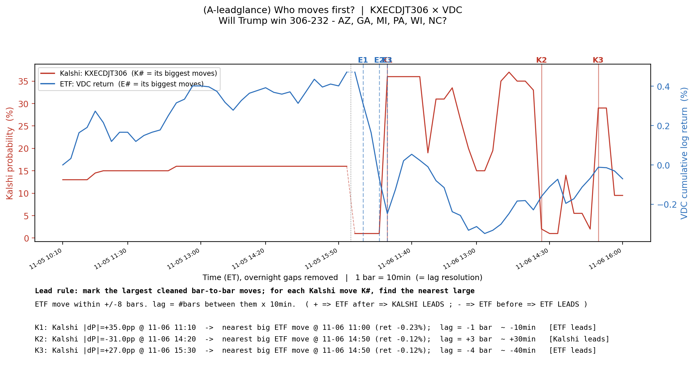
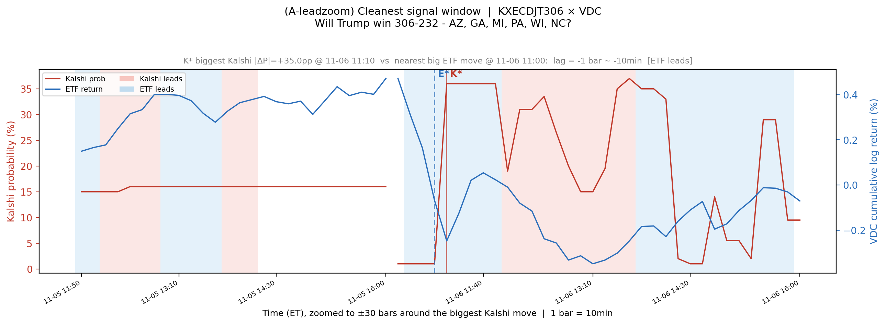
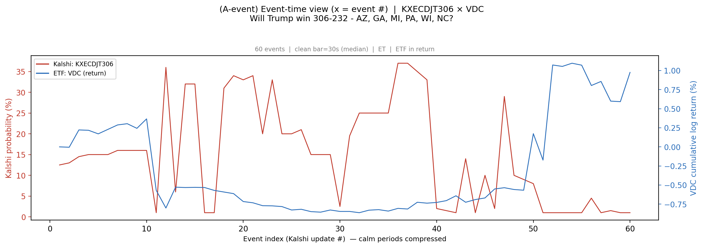
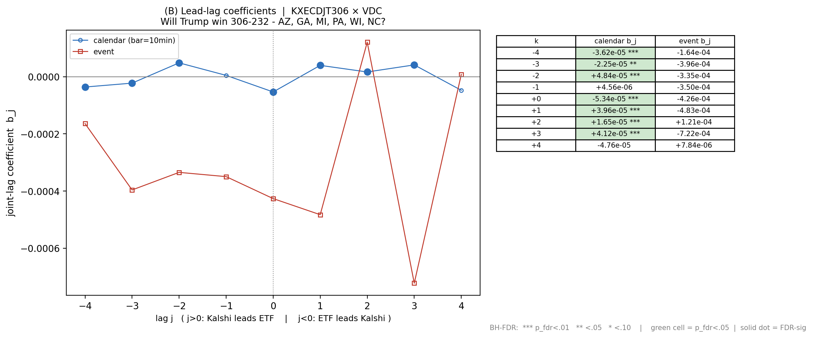

---

## Rank 15/48 — KXECDJT316 × VFH  (n_sig=3, best_p=2.0e-03, n_trades=59)

```text
PAIR ANALYSIS    —    Rank 15 / 48
================================================================================================
KXECDJT316   x   VFH
Contract : "Will Trump win 316-222 - AZ, GA, MI, MN, NC, PA, WI?"
Sector relevance : Election outcome (all sectors)
Window : 2024-11-04 to 2024-12-12     Kalshi trades : 59     primary bar : 10min     daily-screen R^2 : 0.79

>>> RELIABILITY:  Very-low-info   <<<   (see section 5; unreliable pairs still get figures, but read their problems in section 8)

DEFINITIONS
   xₜ₋ₖ = Kalshi yes-probability change, k bars before t   (1 bar = 10min)
   yₜ   = ETF log return over bar t
   calendar = full market-hours grid: x=0 in bars with no Kalshi trade (not dropped).
   k>0 => Kalshi leads ETF ;  k<0 => ETF leads Kalshi ;  k=0 => contemporaneous

1. CALENDAR-TIME REGRESSION (clock-time lags, full RTH grid)
   Full model:  yₜ = α + Σ(k=-4..4) βₖ·xₜ₋ₖ + φ₁·yₜ₋₁ + Σ(d=1..6) γ_d·Day_d
      where  ADL ETF self-lags p=1 (BIC-chosen): φ₁·yₜ₋₁;  day-FE: 6 day dummies over 7 trading days (first day = baseline).
      controls counted (so you can see the total at a glance):  9 lead/lag x-terms + 1 ETF self-lag(s) + 6 day-FE dummies + 1 intercept = 17 RHS regressors  (model n_params=17).
   Significant terms (raw p<0.15) expanded:  yₜ = α + β₋₃·xₜ₊₃ + β₋₂·xₜ₊₂ + β₋₁·xₜ₊₁
   where:
      β₋₃ = +8.227e-05   (t/z=+3.70, p=2.2e-04, p_fdr=2.0e-03) ***   [ETF leads]
      β₋₂ = +7.464e-05   (t/z=+1.78, p=7.5e-02, p_fdr=2.3e-01)    [ETF leads]
      β₋₁ = +1.146e-04   (t/z=+1.88, p=6.1e-02, p_fdr=2.3e-01)    [ETF leads]
   Lean by count of significant lags: ETF-leads  (k>0:0, k<0:3).

2. EVENT-TIME REGRESSION (event-count lags)
   Full model:  yₜ = α + Σ(k) βₖ·xₜ₋ₖ + (ADL self-lags) + (day fixed effects)
   -> no regression result (insufficient data).

3. FULL COEFFICIENT TABLE  (calendar primary bar  vs  event)
      k |       calendar b (FDR) |          event b (FDR)
   ------------------------------------------------------
     -4 |          -3.58e-05     |                     --
     -3 |          +8.23e-05 *** |                     --
     -2 |          +7.46e-05     |                     --
     -1 |          +1.15e-04     |                     --
     +0 |          -6.05e-05     |                     --
     +1 |          +3.95e-06     |                     --
     +2 |          +3.99e-05     |                     --
     +3 |          +4.42e-05     |                     --
     +4 |          -4.36e-05     |                     --
   (stars = BH-FDR corrected:  *** p_fdr<.01  ** <.05  * <.10)

4. DIRECTIONAL TEST (probit, ETF up/down)
   Model: P(ETFₜ up) = Φ(α + βₖ·xₜ₋ₖ),  one probit per lag k
   calendar: n/a
   event: n/a
   -> no significant directional predictability either mode (raw p<0.15).

5. DATA RELIABILITY (statistical, not a trade-count cutoff)
   Tier: Very-low-info
   (criterion = n_active: bars with an actual Kalshi move (x!=0) = the real sample that identifies the lead-lag. Full RTH grid makes n_obs large, so n_active is the honest size.)
   calendar(full RTH grid): n_active=13  n_obs=149  n_days=7  K=4  params=17  df=132  median_SE=4.49e-05  sig(FDR)=1
   event: not estimable (insufficient data)
   => Very low info: even 'significant' coefficients are untrustworthy (huge SE, possibly spurious significance).

6. COARSE-FREQUENCY ROBUSTNESS (re-run calendar at 30min / 60min)
    30min: not estimable (n_obs=19 < minimum) -- coarser bars have even fewer observations
    60min: not estimable (n_obs=15 < minimum) -- coarser bars have even fewer observations

7. VERDICT
   Only one time-axis significant (ETF-leads) -- weak / single-mode evidence.
   (Note: this pair lacks the data to support reliable inference; the verdict above is descriptive only -- do not put it in the conclusions.)

8. FIGURE CAVEATS — figures are still drawn, but know their problems
   - Very low info (only 13 bars with an actual Kalshi move, < 15): even 'significant' coefficients are untrustworthy (huge SE, possibly spurious significance).
   - Most of the chart is flat no-trade lines; only a handful of bars carry real variation, so the lead calls in leadglance/segments are not robust.
   - Kalshi updates only on trades (flat line = no trade, NOT 'no change'); ETF mid refreshes continuously.

9. REAL-WORLD CONTEXT (WebSearch-verified; see URLs)
   - 2024 US presidential election held Tue Nov 5, 2024; ballots counted overnight Nov 5-6.
   - AP called the race for Trump ~5:34-5:37 AM ET on Wed Nov 6, 2024 (Wisconsin pushed him past 270) -- this is PRE-MARKET, so the regular-hours equity reaction shows up at the Nov 6 open.
   - Final electoral result: Trump 312, Harris 226.
   - Sources: en.wikipedia.org/wiki/2024_United_States_presidential_election ; spectrumlocalnews.com/us/snplus/news/2024/11/06/trump-wins-ap-projection-2024-election

------------------------------------------------------------------------------------------------
Conventions: ET | 09:30-16:00 (forward windows capped to 16:00) | ETF in log return | median causal bars | full RTH grid | day-grouped lags (no overnight) | ADL self-control | significance = BH-FDR corrected.
Figures for this pair follow on the next page.
```

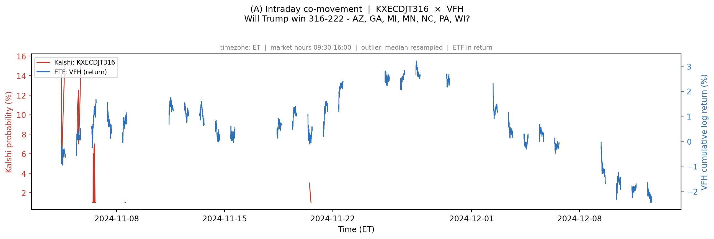
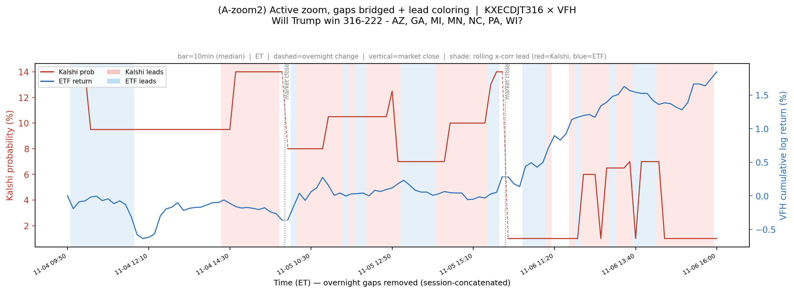
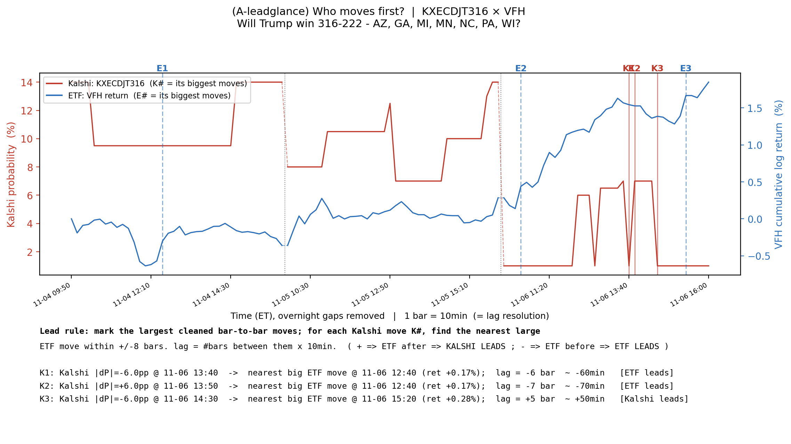
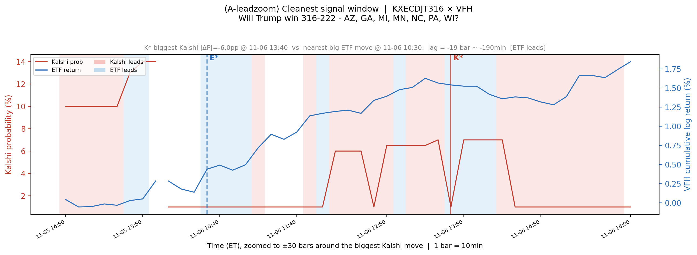
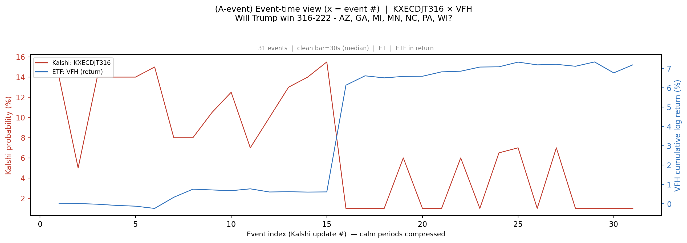
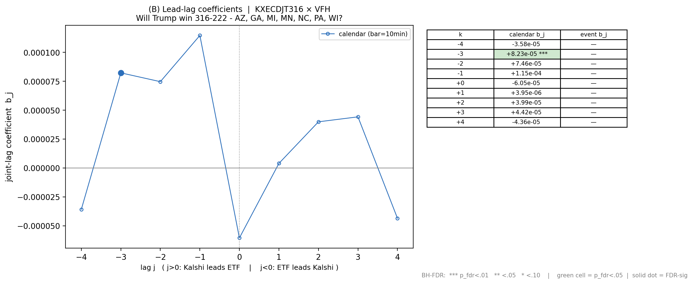

---

## Rank 16/48 — KXECDJT316 × VIS  (n_sig=3, best_p=7.7e-03, n_trades=59)

```text
PAIR ANALYSIS    —    Rank 16 / 48
================================================================================================
KXECDJT316   x   VIS
Contract : "Will Trump win 316-222 - AZ, GA, MI, MN, NC, PA, WI?"
Sector relevance : Election outcome (all sectors)
Window : 2024-11-04 to 2024-12-12     Kalshi trades : 59     primary bar : 10min     daily-screen R^2 : 0.50

>>> RELIABILITY:  Very-low-info   <<<   (see section 5; unreliable pairs still get figures, but read their problems in section 8)

DEFINITIONS
   xₜ₋ₖ = Kalshi yes-probability change, k bars before t   (1 bar = 10min)
   yₜ   = ETF log return over bar t
   calendar = full market-hours grid: x=0 in bars with no Kalshi trade (not dropped).
   k>0 => Kalshi leads ETF ;  k<0 => ETF leads Kalshi ;  k=0 => contemporaneous

1. CALENDAR-TIME REGRESSION (clock-time lags, full RTH grid)
   Full model:  yₜ = α + Σ(k=-4..4) βₖ·xₜ₋ₖ + φ₁·yₜ₋₁ + Σ(d=1..6) γ_d·Day_d
      where  ADL ETF self-lags p=1 (BIC-chosen): φ₁·yₜ₋₁;  day-FE: 6 day dummies over 7 trading days (first day = baseline).
      controls counted (so you can see the total at a glance):  9 lead/lag x-terms + 1 ETF self-lag(s) + 6 day-FE dummies + 1 intercept = 17 RHS regressors  (model n_params=17).
   Significant terms (raw p<0.15) expanded:  yₜ = α + β₋₂·xₜ₊₂ + β₋₁·xₜ₊₁ + β₊₂·xₜ₋₂
   where:
      β₋₂ = +8.556e-05   (t/z=+2.71, p=6.7e-03, p_fdr=2.6e-02) **   [ETF leads]
      β₋₁ = +1.484e-04   (t/z=+3.33, p=8.6e-04, p_fdr=7.7e-03) ***   [ETF leads]
      β₊₂ = +6.776e-05   (t/z=+2.62, p=8.7e-03, p_fdr=2.6e-02) **   [Kalshi leads]
   Lean by count of significant lags: ETF-leads  (k>0:1, k<0:2).

2. EVENT-TIME REGRESSION (event-count lags)
   Full model:  yₜ = α + Σ(k) βₖ·xₜ₋ₖ + (ADL self-lags) + (day fixed effects)
   -> no regression result (insufficient data).

3. FULL COEFFICIENT TABLE  (calendar primary bar  vs  event)
      k |       calendar b (FDR) |          event b (FDR)
   ------------------------------------------------------
     -4 |          +6.89e-05     |                     --
     -3 |          +5.11e-05     |                     --
     -2 |          +8.56e-05 **  |                     --
     -1 |          +1.48e-04 *** |                     --
     +0 |          +4.61e-06     |                     --
     +1 |          +5.95e-06     |                     --
     +2 |          +6.78e-05 **  |                     --
     +3 |          -5.85e-06     |                     --
     +4 |          -7.87e-06     |                     --
   (stars = BH-FDR corrected:  *** p_fdr<.01  ** <.05  * <.10)

4. DIRECTIONAL TEST (probit, ETF up/down)
   Model: P(ETFₜ up) = Φ(α + βₖ·xₜ₋ₖ),  one probit per lag k
   calendar: n/a
   event: n/a
   -> no significant directional predictability either mode (raw p<0.15).

5. DATA RELIABILITY (statistical, not a trade-count cutoff)
   Tier: Very-low-info
   (criterion = n_active: bars with an actual Kalshi move (x!=0) = the real sample that identifies the lead-lag. Full RTH grid makes n_obs large, so n_active is the honest size.)
   calendar(full RTH grid): n_active=13  n_obs=149  n_days=7  K=4  params=17  df=132  median_SE=4.39e-05  sig(FDR)=3
   event: not estimable (insufficient data)
   => Very low info: even 'significant' coefficients are untrustworthy (huge SE, possibly spurious significance).

6. COARSE-FREQUENCY ROBUSTNESS (re-run calendar at 30min / 60min)
    30min: not estimable (n_obs=19 < minimum) -- coarser bars have even fewer observations
    60min: not estimable (n_obs=15 < minimum) -- coarser bars have even fewer observations

7. VERDICT
   Only one time-axis significant (ETF-leads) -- weak / single-mode evidence.
   (Note: this pair lacks the data to support reliable inference; the verdict above is descriptive only -- do not put it in the conclusions.)

8. FIGURE CAVEATS — figures are still drawn, but know their problems
   - Very low info (only 13 bars with an actual Kalshi move, < 15): even 'significant' coefficients are untrustworthy (huge SE, possibly spurious significance).
   - Most of the chart is flat no-trade lines; only a handful of bars carry real variation, so the lead calls in leadglance/segments are not robust.
   - Kalshi updates only on trades (flat line = no trade, NOT 'no change'); ETF mid refreshes continuously.

9. REAL-WORLD CONTEXT (WebSearch-verified; see URLs)
   - 2024 US presidential election held Tue Nov 5, 2024; ballots counted overnight Nov 5-6.
   - AP called the race for Trump ~5:34-5:37 AM ET on Wed Nov 6, 2024 (Wisconsin pushed him past 270) -- this is PRE-MARKET, so the regular-hours equity reaction shows up at the Nov 6 open.
   - Final electoral result: Trump 312, Harris 226.
   - Sources: en.wikipedia.org/wiki/2024_United_States_presidential_election ; spectrumlocalnews.com/us/snplus/news/2024/11/06/trump-wins-ap-projection-2024-election

------------------------------------------------------------------------------------------------
Conventions: ET | 09:30-16:00 (forward windows capped to 16:00) | ETF in log return | median causal bars | full RTH grid | day-grouped lags (no overnight) | ADL self-control | significance = BH-FDR corrected.
Figures for this pair follow on the next page.
```

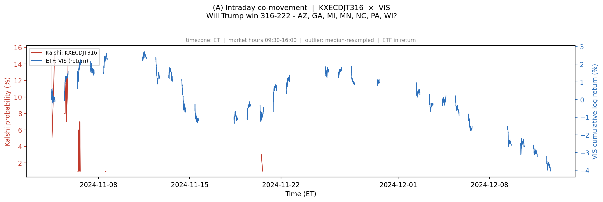
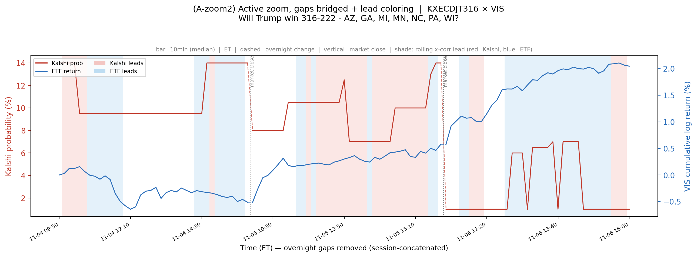
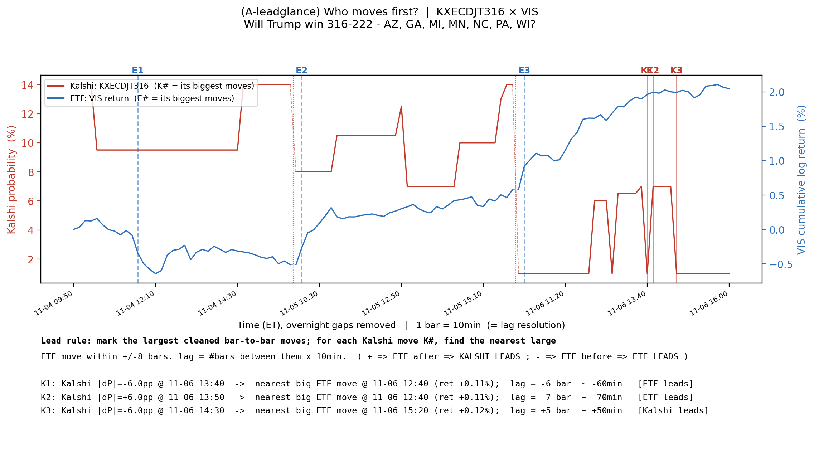
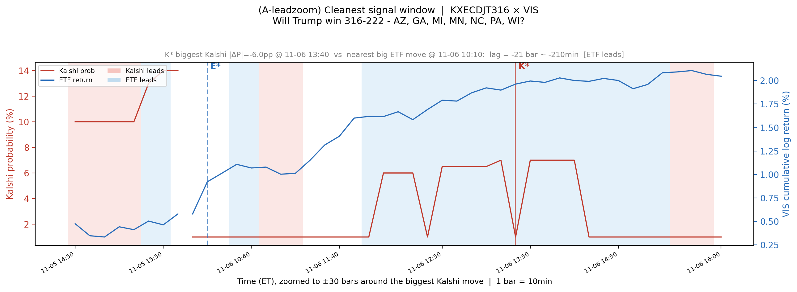
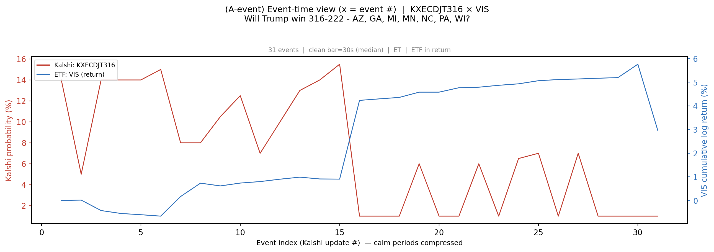
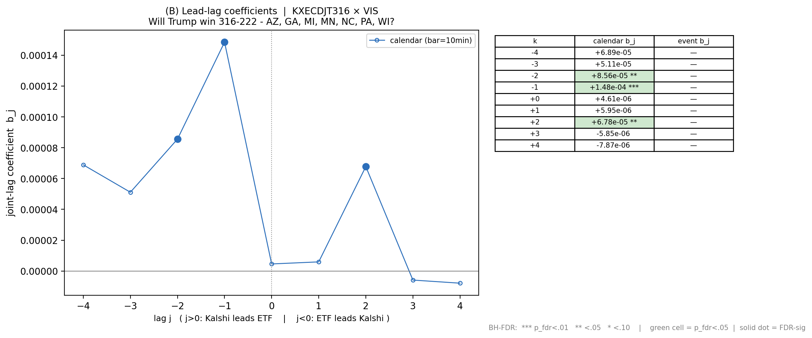

---

## Rank 17/48 — KXECDJT316 × VDE  (n_sig=3, best_p=8.5e-02, n_trades=59)

```text
PAIR ANALYSIS    —    Rank 17 / 48
================================================================================================
KXECDJT316   x   VDE
Contract : "Will Trump win 316-222 - AZ, GA, MI, MN, NC, PA, WI?"
Sector relevance : Election outcome (all sectors)
Window : 2024-11-04 to 2024-12-12     Kalshi trades : 59     primary bar : 10min     daily-screen R^2 : 0.49

>>> RELIABILITY:  Very-low-info   <<<   (see section 5; unreliable pairs still get figures, but read their problems in section 8)

DEFINITIONS
   xₜ₋ₖ = Kalshi yes-probability change, k bars before t   (1 bar = 10min)
   yₜ   = ETF log return over bar t
   calendar = full market-hours grid: x=0 in bars with no Kalshi trade (not dropped).
   k>0 => Kalshi leads ETF ;  k<0 => ETF leads Kalshi ;  k=0 => contemporaneous

1. CALENDAR-TIME REGRESSION (clock-time lags, full RTH grid)
   Full model:  yₜ = α + Σ(k=-4..4) βₖ·xₜ₋ₖ + φ₁·yₜ₋₁ + Σ(d=1..6) γ_d·Day_d
      where  ADL ETF self-lags p=1 (BIC-chosen): φ₁·yₜ₋₁;  day-FE: 6 day dummies over 7 trading days (first day = baseline).
      controls counted (so you can see the total at a glance):  9 lead/lag x-terms + 1 ETF self-lag(s) + 6 day-FE dummies + 1 intercept = 17 RHS regressors  (model n_params=17).
   Significant terms (raw p<0.15) expanded:  yₜ = α + β₋₄·xₜ₊₄ + β₊₃·xₜ₋₃ + β₊₄·xₜ₋₄
   where:
      β₋₄ = -8.660e-05   (t/z=-1.78, p=7.6e-02, p_fdr=2.9e-01)    [ETF leads]
      β₊₃ = +3.200e-05   (t/z=+1.65, p=9.8e-02, p_fdr=2.9e-01)    [Kalshi leads]
      β₊₄ = +1.253e-04   (t/z=+2.59, p=9.5e-03, p_fdr=8.5e-02) *   [Kalshi leads]
   Lean by count of significant lags: Kalshi-leads  (k>0:2, k<0:1).

2. EVENT-TIME REGRESSION (event-count lags)
   Full model:  yₜ = α + Σ(k) βₖ·xₜ₋ₖ + (ADL self-lags) + (day fixed effects)
   -> no regression result (insufficient data).

3. FULL COEFFICIENT TABLE  (calendar primary bar  vs  event)
      k |       calendar b (FDR) |          event b (FDR)
   ------------------------------------------------------
     -4 |          -8.66e-05     |                     --
     -3 |          -2.73e-05     |                     --
     -2 |          +1.92e-05     |                     --
     -1 |          +1.59e-05     |                     --
     +0 |          +3.96e-05     |                     --
     +1 |          -1.43e-05     |                     --
     +2 |          -2.01e-05     |                     --
     +3 |          +3.20e-05     |                     --
     +4 |          +1.25e-04 *   |                     --
   (stars = BH-FDR corrected:  *** p_fdr<.01  ** <.05  * <.10)

4. DIRECTIONAL TEST (probit, ETF up/down)
   Model: P(ETFₜ up) = Φ(α + βₖ·xₜ₋ₖ),  one probit per lag k
   calendar: n/a
   event: n/a
   -> no significant directional predictability either mode (raw p<0.15).

5. DATA RELIABILITY (statistical, not a trade-count cutoff)
   Tier: Very-low-info
   (criterion = n_active: bars with an actual Kalshi move (x!=0) = the real sample that identifies the lead-lag. Full RTH grid makes n_obs large, so n_active is the honest size.)
   calendar(full RTH grid): n_active=13  n_obs=149  n_days=7  K=4  params=17  df=132  median_SE=6.36e-05  sig(FDR)=0
   event: not estimable (insufficient data)
   => Very low info: even 'significant' coefficients are untrustworthy (huge SE, possibly spurious significance).

6. COARSE-FREQUENCY ROBUSTNESS (re-run calendar at 30min / 60min)
    30min: not estimable (n_obs=19 < minimum) -- coarser bars have even fewer observations
    60min: not estimable (n_obs=15 < minimum) -- coarser bars have even fewer observations

7. VERDICT
   Only one time-axis significant (Kalshi-leads) -- weak / single-mode evidence.
   (Note: this pair lacks the data to support reliable inference; the verdict above is descriptive only -- do not put it in the conclusions.)

8. FIGURE CAVEATS — figures are still drawn, but know their problems
   - Very low info (only 13 bars with an actual Kalshi move, < 15): even 'significant' coefficients are untrustworthy (huge SE, possibly spurious significance).
   - Most of the chart is flat no-trade lines; only a handful of bars carry real variation, so the lead calls in leadglance/segments are not robust.
   - Mixed coefficient signs across lags -- relationship not monotone.
   - Kalshi updates only on trades (flat line = no trade, NOT 'no change'); ETF mid refreshes continuously.

9. REAL-WORLD CONTEXT (WebSearch-verified; see URLs)
   - 2024 US presidential election held Tue Nov 5, 2024; ballots counted overnight Nov 5-6.
   - AP called the race for Trump ~5:34-5:37 AM ET on Wed Nov 6, 2024 (Wisconsin pushed him past 270) -- this is PRE-MARKET, so the regular-hours equity reaction shows up at the Nov 6 open.
   - Final electoral result: Trump 312, Harris 226.
   - Sources: en.wikipedia.org/wiki/2024_United_States_presidential_election ; spectrumlocalnews.com/us/snplus/news/2024/11/06/trump-wins-ap-projection-2024-election

------------------------------------------------------------------------------------------------
Conventions: ET | 09:30-16:00 (forward windows capped to 16:00) | ETF in log return | median causal bars | full RTH grid | day-grouped lags (no overnight) | ADL self-control | significance = BH-FDR corrected.
Figures for this pair follow on the next page.
```

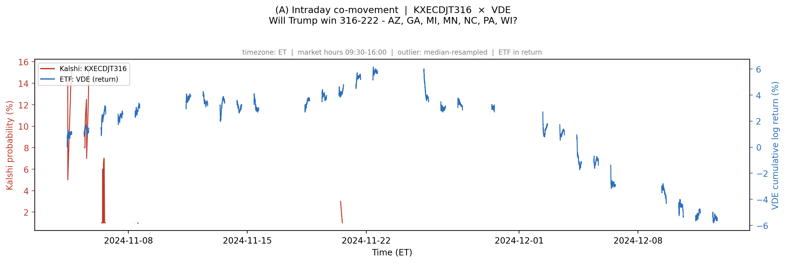
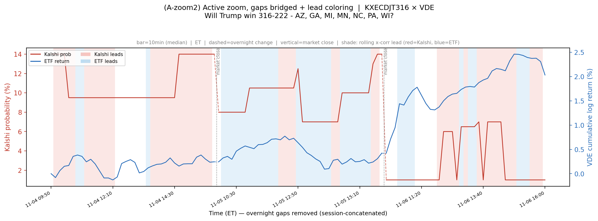
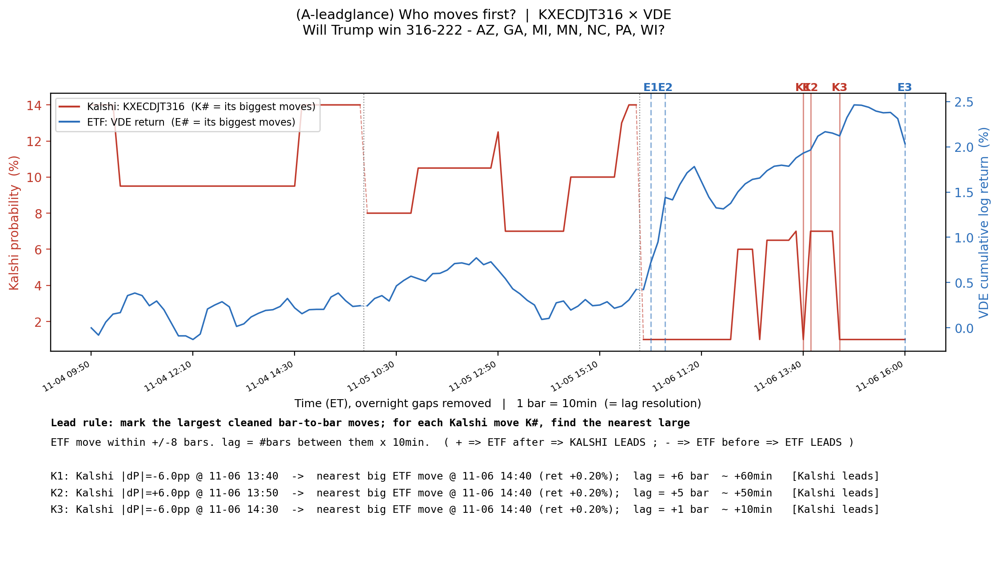
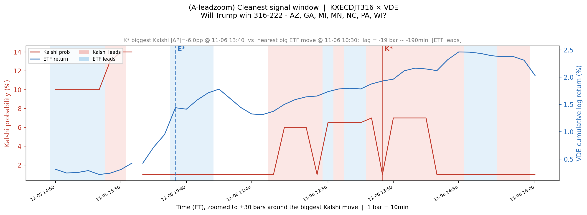
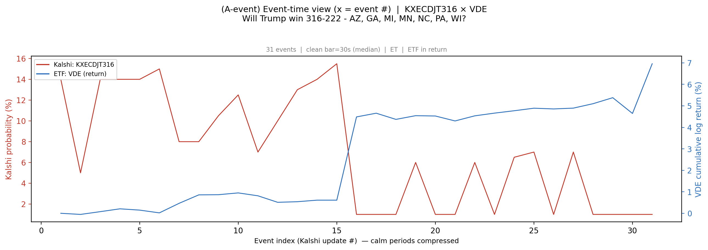
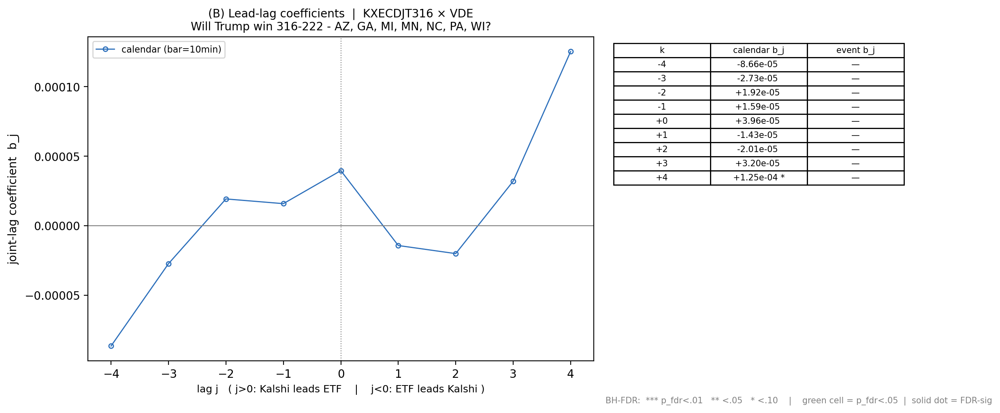

---

## Rank 18/48 — AAAGASM-24OCT31-US-3.15 × VPU  (n_sig=4, best_p=3.4e-17, n_trades=58)

```text
PAIR ANALYSIS    —    Rank 18 / 48
================================================================================================
AAAGASM-24OCT31-US-3.15   x   VPU
Contract : "Will average **gas prices** be above $3.15?"
Sector relevance : VDE (Energy)
Window : 2024-10-02 to 2024-10-31     Kalshi trades : 58     primary bar : 10min     daily-screen R^2 : 0.20

>>> RELIABILITY:  Very-low-info   <<<   (see section 5; unreliable pairs still get figures, but read their problems in section 8)

DEFINITIONS
   xₜ₋ₖ = Kalshi yes-probability change, k bars before t   (1 bar = 10min)
   yₜ   = ETF log return over bar t
   calendar = full market-hours grid: x=0 in bars with no Kalshi trade (not dropped).
   k>0 => Kalshi leads ETF ;  k<0 => ETF leads Kalshi ;  k=0 => contemporaneous

1. CALENDAR-TIME REGRESSION (clock-time lags, full RTH grid)
   Full model:  yₜ = α + Σ(k=-3..3) βₖ·xₜ₋ₖ + φ₁·yₜ₋₁ + Σ(d=1..11) γ_d·Day_d
      where  ADL ETF self-lags p=1 (BIC-chosen): φ₁·yₜ₋₁;  day-FE: 11 day dummies over 12 trading days (first day = baseline).
      controls counted (so you can see the total at a glance):  7 lead/lag x-terms + 1 ETF self-lag(s) + 11 day-FE dummies + 1 intercept = 20 RHS regressors  (model n_params=20).
   Significant terms (raw p<0.15) expanded:  yₜ = α + β₋₃·xₜ₊₃ + β₋₁·xₜ₊₁ + β₊₀·xₜ + β₊₁·xₜ₋₁
   where:
      β₋₃ = +2.240e-05   (t/z=+1.50, p=1.3e-01, p_fdr=2.3e-01)    [ETF leads]
      β₋₁ = -1.077e-04   (t/z=-4.15, p=3.4e-05, p_fdr=1.2e-04) ***   [ETF leads]
      β₊₀ = -1.557e-04   (t/z=-8.66, p=4.8e-18, p_fdr=3.4e-17) ***   [contemporaneous]
      β₊₁ = -8.570e-05   (t/z=-2.21, p=2.7e-02, p_fdr=6.3e-02) *   [Kalshi leads]
   Lean by count of significant lags: ETF-leads  (k>0:1, k<0:2).

2. EVENT-TIME REGRESSION (event-count lags)
   Full model:  yₜ = α + Σ(k) βₖ·xₜ₋ₖ + (ADL self-lags) + (day fixed effects)
   -> no regression result (insufficient data).

3. FULL COEFFICIENT TABLE  (calendar primary bar  vs  event)
      k |       calendar b (FDR) |          event b (FDR)
   ------------------------------------------------------
     -3 |          +2.24e-05     |                     --
     -2 |          -1.53e-05     |                     --
     -1 |          -1.08e-04 *** |                     --
     +0 |          -1.56e-04 *** |                     --
     +1 |          -8.57e-05 *   |                     --
     +2 |          -5.85e-05     |                     --
     +3 |          -5.57e-06     |                     --
   (stars = BH-FDR corrected:  *** p_fdr<.01  ** <.05  * <.10)

4. DIRECTIONAL TEST (probit, ETF up/down)
   Model: P(ETFₜ up) = Φ(α + βₖ·xₜ₋ₖ),  one probit per lag k
   calendar: n/a
   event: n/a
   -> no significant directional predictability either mode (raw p<0.15).

5. DATA RELIABILITY (statistical, not a trade-count cutoff)
   Tier: Very-low-info
   (criterion = n_active: bars with an actual Kalshi move (x!=0) = the real sample that identifies the lead-lag. Full RTH grid makes n_obs large, so n_active is the honest size.)
   calendar(full RTH grid): n_active=10  n_obs=271  n_days=12  K=3  params=20  df=251  median_SE=2.60e-05  sig(FDR)=2
   event: not estimable (insufficient data)
   => Very low info: even 'significant' coefficients are untrustworthy (huge SE, possibly spurious significance).

6. COARSE-FREQUENCY ROBUSTNESS (re-run calendar at 30min / 60min)
    30min: not estimable (n_obs=14 < minimum) -- coarser bars have even fewer observations
    60min: not estimable (n_obs=13 < minimum) -- coarser bars have even fewer observations

7. VERDICT
   Only one time-axis significant (ETF-leads) -- weak / single-mode evidence.
   (Note: this pair lacks the data to support reliable inference; the verdict above is descriptive only -- do not put it in the conclusions.)

8. FIGURE CAVEATS — figures are still drawn, but know their problems
   - Very low info (only 10 bars with an actual Kalshi move, < 15): even 'significant' coefficients are untrustworthy (huge SE, possibly spurious significance).
   - Most of the chart is flat no-trade lines; only a handful of bars carry real variation, so the lead calls in leadglance/segments are not robust.
   - Mixed coefficient signs across lags -- relationship not monotone.
   - Kalshi updates only on trades (flat line = no trade, NOT 'no change'); ETF mid refreshes continuously.

------------------------------------------------------------------------------------------------
Conventions: ET | 09:30-16:00 (forward windows capped to 16:00) | ETF in log return | median causal bars | full RTH grid | day-grouped lags (no overnight) | ADL self-control | significance = BH-FDR corrected.
Figures for this pair follow on the next page.
```

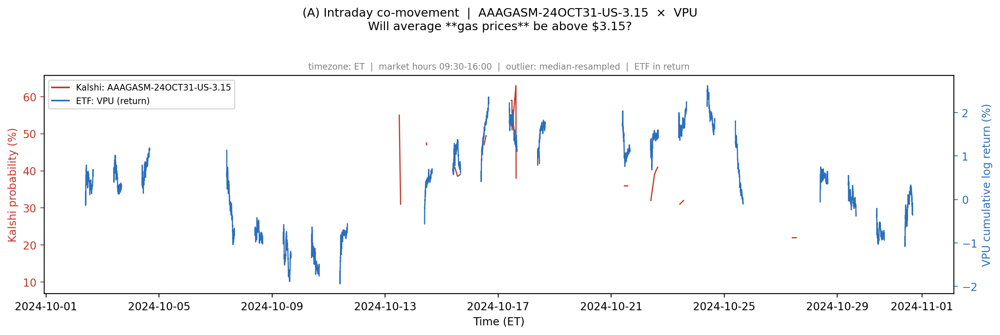
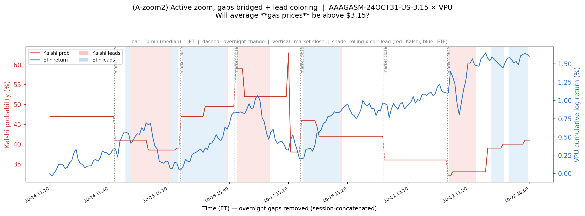
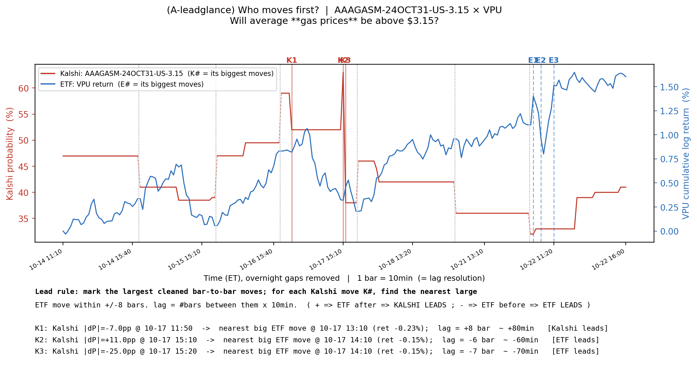
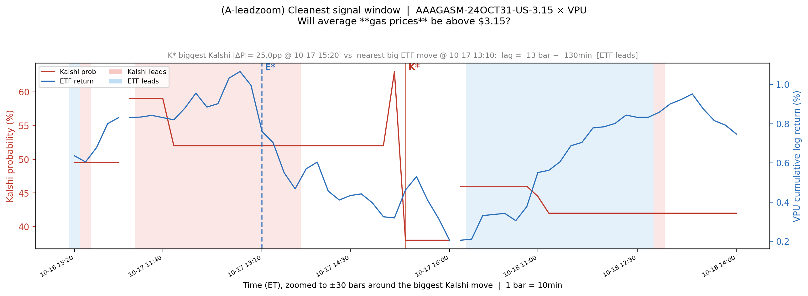
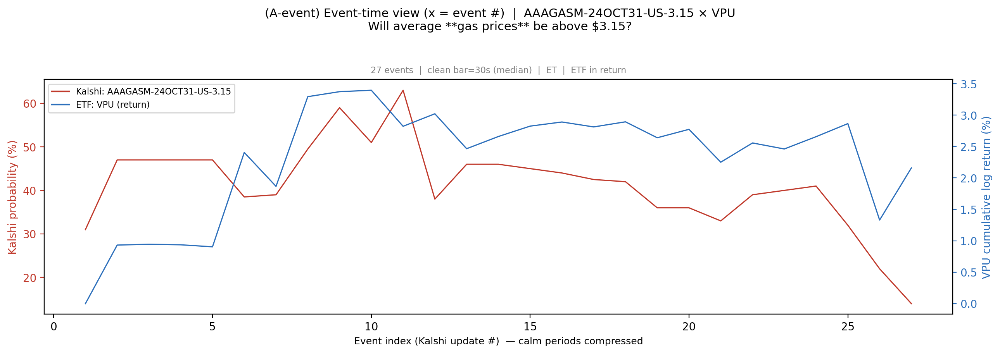
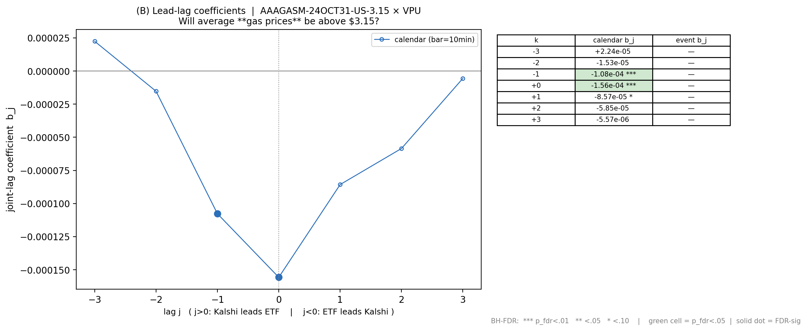

---

## Rank 19/48 — KXECKH276 × VOX  (n_sig=12, best_p=1.5e-35, n_trades=43)

```text
PAIR ANALYSIS    —    Rank 19 / 48
================================================================================================
KXECKH276   x   VOX
Contract : "Will Harris win 276-262 - PA, NV, MI, WI?"
Sector relevance : Election outcome (all sectors)
Window : 2024-11-04 to 2024-11-26     Kalshi trades : 43     primary bar : 10min     daily-screen R^2 : 0.59

>>> RELIABILITY:  Very-low-info   <<<   (see section 5; unreliable pairs still get figures, but read their problems in section 8)

DEFINITIONS
   xₜ₋ₖ = Kalshi yes-probability change, k bars before t   (1 bar = 10min)
   yₜ   = ETF log return over bar t
   calendar = full market-hours grid: x=0 in bars with no Kalshi trade (not dropped).
   k>0 => Kalshi leads ETF ;  k<0 => ETF leads Kalshi ;  k=0 => contemporaneous

1. CALENDAR-TIME REGRESSION (clock-time lags, full RTH grid)
   Full model:  yₜ = α + Σ(k=-3..3) βₖ·xₜ₋ₖ + φ₁·yₜ₋₁ + Σ(d=1..5) γ_d·Day_d
      where  ADL ETF self-lags p=1 (BIC-chosen): φ₁·yₜ₋₁;  day-FE: 5 day dummies over 6 trading days (first day = baseline).
      controls counted (so you can see the total at a glance):  7 lead/lag x-terms + 1 ETF self-lag(s) + 5 day-FE dummies + 1 intercept = 14 RHS regressors  (model n_params=14).
   Significant terms (raw p<0.15) expanded:  yₜ = α + β₋₃·xₜ₊₃ + β₋₂·xₜ₊₂ + β₋₁·xₜ₊₁ + β₊₀·xₜ + β₊₂·xₜ₋₂ + β₊₃·xₜ₋₃
   where:
      β₋₃ = +8.094e-05   (t/z=+5.24, p=1.6e-07, p_fdr=2.8e-07) ***   [ETF leads]
      β₋₂ = -4.478e-05   (t/z=-12.60, p=2.1e-36, p_fdr=1.5e-35) ***   [ETF leads]
      β₋₁ = +2.737e-05   (t/z=+1.89, p=5.8e-02, p_fdr=6.8e-02) *   [ETF leads]
      β₊₀ = -6.839e-05   (t/z=-12.25, p=1.6e-34, p_fdr=5.8e-34) ***   [contemporaneous]
      β₊₂ = -5.727e-05   (t/z=-5.53, p=3.1e-08, p_fdr=7.3e-08) ***   [Kalshi leads]
      β₊₃ = +1.010e-04   (t/z=+4.31, p=1.6e-05, p_fdr=2.3e-05) ***   [Kalshi leads]
   Lean by count of significant lags: ETF-leads  (k>0:2, k<0:3).

2. EVENT-TIME REGRESSION (event-count lags)
   Full model:  yₜ = α + Σ(k=-3..3) βₖ·xₜ₋ₖ + φ₁·yₜ₋₁ + φ₂·yₜ₋₂ + φ₃·yₜ₋₃
      where  ADL ETF self-lags p=3 (BIC-chosen): φ₁·yₜ₋₁ + φ₂·yₜ₋₂ + φ₃·yₜ₋₃;  day-FE: none (single trading day -> clustered SE degrades to HC3).
      controls counted (so you can see the total at a glance):  7 lead/lag x-terms + 3 ETF self-lag(s) + 0 day-FE dummies + 1 intercept = 11 RHS regressors  (model n_params=11).
   Significant terms (raw p<0.15) expanded:  yₜ = α + β₋₃·xₜ₊₃ + β₋₂·xₜ₊₂ + β₋₁·xₜ₊₁ + β₊₀·xₜ + β₊₁·xₜ₋₁ + β₊₂·xₜ₋₂
   where:
      β₋₃ = -5.784e-03   (t/z=-2.28, p=2.2e-02, p_fdr=8.5e-02) *   [ETF leads]
      β₋₂ = -7.093e-03   (t/z=-2.23, p=2.6e-02, p_fdr=8.5e-02) *   [ETF leads]
      β₋₁ = -6.808e-03   (t/z=-1.97, p=4.8e-02, p_fdr=8.5e-02) *   [ETF leads]
      β₊₀ = -7.829e-03   (t/z=-2.00, p=4.6e-02, p_fdr=8.5e-02) *   [contemporaneous]
      β₊₁ = -5.192e-03   (t/z=-1.77, p=7.6e-02, p_fdr=1.1e-01)    [Kalshi leads]
      β₊₂ = -2.572e-03   (t/z=-1.47, p=1.4e-01, p_fdr=1.6e-01)    [Kalshi leads]
   Lean by count of significant lags: ETF-leads  (k>0:2, k<0:3).

3. FULL COEFFICIENT TABLE  (calendar primary bar  vs  event)
      k |       calendar b (FDR) |          event b (FDR)
   ------------------------------------------------------
     -3 |          +8.09e-05 *** |          -5.78e-03 *  
     -2 |          -4.48e-05 *** |          -7.09e-03 *  
     -1 |          +2.74e-05 *   |          -6.81e-03 *  
     +0 |          -6.84e-05 *** |          -7.83e-03 *  
     +1 |          +1.03e-05     |          -5.19e-03    
     +2 |          -5.73e-05 *** |          -2.57e-03    
     +3 |          +1.01e-04 *** |          -2.02e-04    
   (stars = BH-FDR corrected:  *** p_fdr<.01  ** <.05  * <.10)

4. DIRECTIONAL TEST (probit, ETF up/down)
   Model: P(ETFₜ up) = Φ(α + βₖ·xₜ₋ₖ),  one probit per lag k
   calendar: n/a
   event: n/a
   -> no significant directional predictability either mode (raw p<0.15).

5. DATA RELIABILITY (statistical, not a trade-count cutoff)
   Tier: Very-low-info
   (criterion = n_active: bars with an actual Kalshi move (x!=0) = the real sample that identifies the lead-lag. Full RTH grid makes n_obs large, so n_active is the honest size.)
   calendar(full RTH grid): n_active=7  n_obs=110  n_days=6  K=3  params=14  df=96  median_SE=1.45e-05  sig(FDR)=5
   event: n_active=7  n_obs=12  n_days=1  K=3  params=11  df=1  median_SE=2.93e-03  sig(FDR)=0
   => Very low info: even 'significant' coefficients are untrustworthy (huge SE, possibly spurious significance).

6. COARSE-FREQUENCY ROBUSTNESS (re-run calendar at 30min / 60min)
    30min: not estimable (n_obs=12 < minimum) -- coarser bars have even fewer observations
    60min: not estimable (n_obs=7 < minimum) -- coarser bars have even fewer observations

7. VERDICT
   Both time-axes lean ETF-leads (relatively robust; see strongest single term).
   (Note: this pair lacks the data to support reliable inference; the verdict above is descriptive only -- do not put it in the conclusions.)

8. FIGURE CAVEATS — figures are still drawn, but know their problems
   - Very low info (only 7 bars with an actual Kalshi move, < 15): even 'significant' coefficients are untrustworthy (huge SE, possibly spurious significance).
   - Most of the chart is flat no-trade lines; only a handful of bars carry real variation, so the lead calls in leadglance/segments are not robust.
   - Mixed coefficient signs across lags -- relationship not monotone.
   - Kalshi updates only on trades (flat line = no trade, NOT 'no change'); ETF mid refreshes continuously.

9. REAL-WORLD CONTEXT (WebSearch-verified; see URLs)
   - 2024 US presidential election held Tue Nov 5, 2024; ballots counted overnight Nov 5-6.
   - AP called the race for Trump ~5:34-5:37 AM ET on Wed Nov 6, 2024 (Wisconsin pushed him past 270) -- this is PRE-MARKET, so the regular-hours equity reaction shows up at the Nov 6 open.
   - Final electoral result: Trump 312, Harris 226.
   - Sources: en.wikipedia.org/wiki/2024_United_States_presidential_election ; spectrumlocalnews.com/us/snplus/news/2024/11/06/trump-wins-ap-projection-2024-election

------------------------------------------------------------------------------------------------
Conventions: ET | 09:30-16:00 (forward windows capped to 16:00) | ETF in log return | median causal bars | full RTH grid | day-grouped lags (no overnight) | ADL self-control | significance = BH-FDR corrected.
Figures for this pair follow on the next page.
```

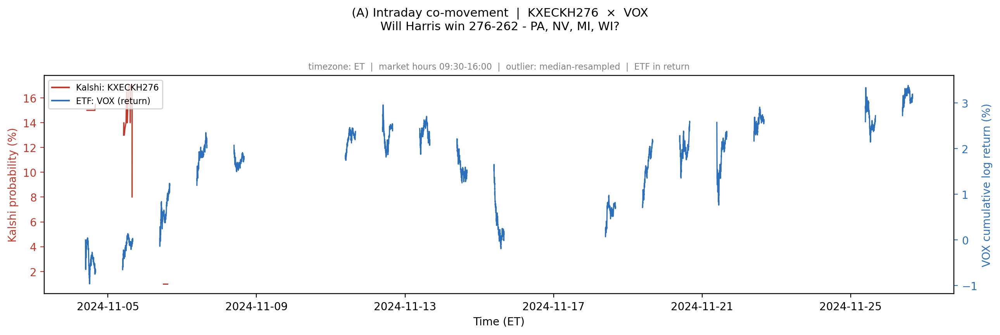
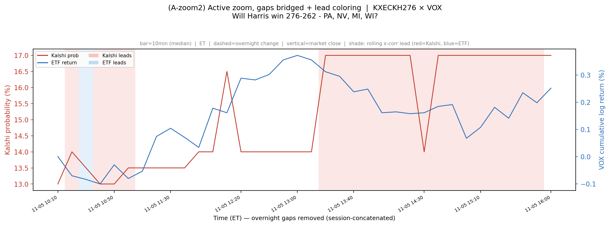
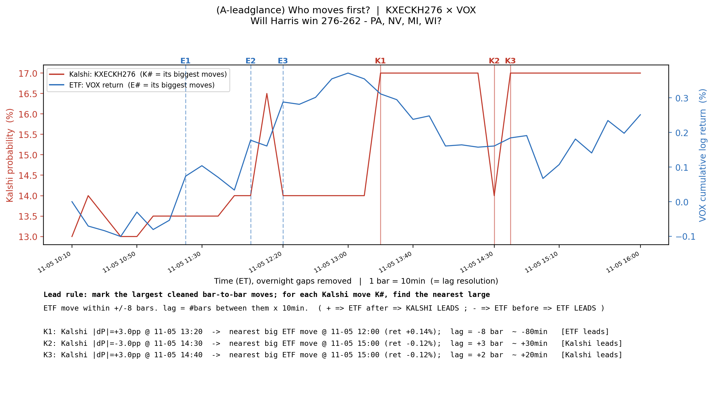
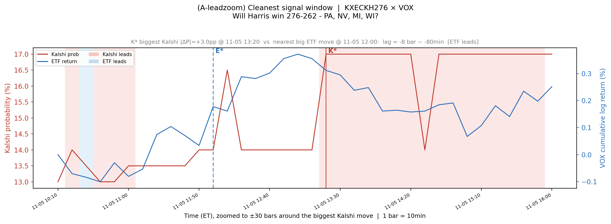
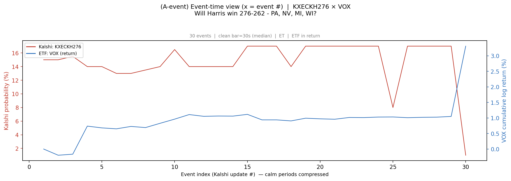
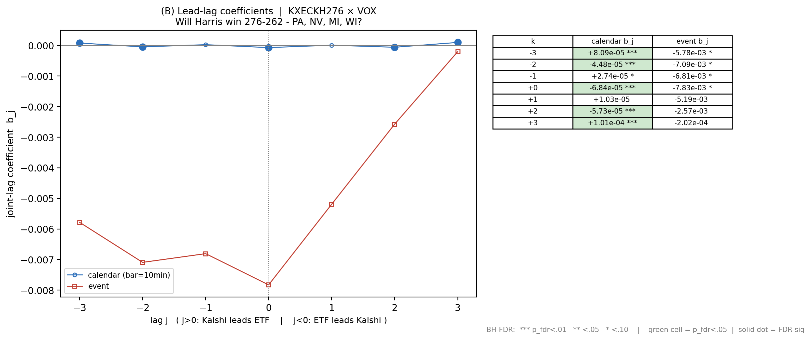

---

## Rank 20/48 — KXECKH276 × VFH  (n_sig=7, best_p=0.0e+00, n_trades=43)

```text
PAIR ANALYSIS    —    Rank 20 / 48
================================================================================================
KXECKH276   x   VFH
Contract : "Will Harris win 276-262 - PA, NV, MI, WI?"
Sector relevance : Election outcome (all sectors)
Window : 2024-11-04 to 2024-11-26     Kalshi trades : 43     primary bar : 10min     daily-screen R^2 : 0.88

>>> RELIABILITY:  Very-low-info   <<<   (see section 5; unreliable pairs still get figures, but read their problems in section 8)

DEFINITIONS
   xₜ₋ₖ = Kalshi yes-probability change, k bars before t   (1 bar = 10min)
   yₜ   = ETF log return over bar t
   calendar = full market-hours grid: x=0 in bars with no Kalshi trade (not dropped).
   k>0 => Kalshi leads ETF ;  k<0 => ETF leads Kalshi ;  k=0 => contemporaneous

1. CALENDAR-TIME REGRESSION (clock-time lags, full RTH grid)
   Full model:  yₜ = α + Σ(k=-3..3) βₖ·xₜ₋ₖ + Σ(d=1..5) γ_d·Day_d
      where  ADL ETF self-lags p=0 (BIC chose none -> no ETF self-lag term);  day-FE: 5 day dummies over 6 trading days (first day = baseline).
      controls counted (so you can see the total at a glance):  7 lead/lag x-terms + 0 ETF self-lag(s) + 5 day-FE dummies + 1 intercept = 13 RHS regressors  (model n_params=13).
   Significant terms (raw p<0.15) expanded:  yₜ = α + β₋₃·xₜ₊₃ + β₋₂·xₜ₊₂ + β₋₁·xₜ₊₁ + β₊₀·xₜ + β₊₁·xₜ₋₁ + β₊₂·xₜ₋₂ + β₊₃·xₜ₋₃
   where:
      β₋₃ = +1.083e-04   (t/z=+27.26, p=1.3e-163, p_fdr=1.3e-163) ***   [ETF leads]
      β₋₂ = +8.797e-05   (t/z=+42.15, p=0.0e+00, p_fdr=0.0e+00) ***   [ETF leads]
      β₋₁ = +3.443e-05   (t/z=+29.10, p=3.4e-186, p_fdr=3.9e-186) ***   [ETF leads]
      β₊₀ = -8.556e-05   (t/z=-86.58, p=0.0e+00, p_fdr=0.0e+00) ***   [contemporaneous]
      β₊₁ = -6.822e-05   (t/z=-81.87, p=0.0e+00, p_fdr=0.0e+00) ***   [Kalshi leads]
      β₊₂ = -6.114e-05   (t/z=-71.68, p=0.0e+00, p_fdr=0.0e+00) ***   [Kalshi leads]
      β₊₃ = +9.048e-05   (t/z=+77.44, p=0.0e+00, p_fdr=0.0e+00) ***   [Kalshi leads]
   Lean by count of significant lags: balanced/no clear side  (k>0:3, k<0:3).

2. EVENT-TIME REGRESSION (event-count lags)
   Full model:  yₜ = α + Σ(k=-3..3) βₖ·xₜ₋ₖ + φ₁·yₜ₋₁ + φ₂·yₜ₋₂ + φ₃·yₜ₋₃
      where  ADL ETF self-lags p=3 (BIC-chosen): φ₁·yₜ₋₁ + φ₂·yₜ₋₂ + φ₃·yₜ₋₃;  day-FE: none (single trading day -> clustered SE degrades to HC3).
      controls counted (so you can see the total at a glance):  7 lead/lag x-terms + 3 ETF self-lag(s) + 0 day-FE dummies + 1 intercept = 11 RHS regressors  (model n_params=11).
   -> 7 coefficients tested, NONE significant at raw p<0.15.

3. FULL COEFFICIENT TABLE  (calendar primary bar  vs  event)
      k |       calendar b (FDR) |          event b (FDR)
   ------------------------------------------------------
     -3 |          +1.08e-04 *** |          -1.12e-03    
     -2 |          +8.80e-05 *** |          +1.50e-04    
     -1 |          +3.44e-05 *** |          +2.13e-03    
     +0 |          -8.56e-05 *** |          +3.19e-04    
     +1 |          -6.82e-05 *** |          +1.70e-03    
     +2 |          -6.11e-05 *** |          +1.39e-03    
     +3 |          +9.05e-05 *** |          -8.64e-04    
   (stars = BH-FDR corrected:  *** p_fdr<.01  ** <.05  * <.10)

4. DIRECTIONAL TEST (probit, ETF up/down)
   Model: P(ETFₜ up) = Φ(α + βₖ·xₜ₋ₖ),  one probit per lag k
   calendar: n/a
   event: n/a
   -> no significant directional predictability either mode (raw p<0.15).

5. DATA RELIABILITY (statistical, not a trade-count cutoff)
   Tier: Very-low-info
   (criterion = n_active: bars with an actual Kalshi move (x!=0) = the real sample that identifies the lead-lag. Full RTH grid makes n_obs large, so n_active is the honest size.)
   calendar(full RTH grid): n_active=7  n_obs=110  n_days=6  K=3  params=13  df=97  median_SE=1.17e-06  sig(FDR)=7
   event: n_active=7  n_obs=12  n_days=1  K=3  params=11  df=1  median_SE=4.89e-03  sig(FDR)=0
   => Very low info: even 'significant' coefficients are untrustworthy (huge SE, possibly spurious significance).

6. COARSE-FREQUENCY ROBUSTNESS (re-run calendar at 30min / 60min)
    30min: not estimable (n_obs=12 < minimum) -- coarser bars have even fewer observations
    60min: not estimable (n_obs=7 < minimum) -- coarser bars have even fewer observations

7. VERDICT
   Only one time-axis significant (balanced) -- weak / single-mode evidence.
   (Note: this pair lacks the data to support reliable inference; the verdict above is descriptive only -- do not put it in the conclusions.)

8. FIGURE CAVEATS — figures are still drawn, but know their problems
   - Very low info (only 7 bars with an actual Kalshi move, < 15): even 'significant' coefficients are untrustworthy (huge SE, possibly spurious significance).
   - Most of the chart is flat no-trade lines; only a handful of bars carry real variation, so the lead calls in leadglance/segments are not robust.
   - Mixed coefficient signs across lags -- relationship not monotone.
   - Kalshi updates only on trades (flat line = no trade, NOT 'no change'); ETF mid refreshes continuously.

9. REAL-WORLD CONTEXT (WebSearch-verified; see URLs)
   - 2024 US presidential election held Tue Nov 5, 2024; ballots counted overnight Nov 5-6.
   - AP called the race for Trump ~5:34-5:37 AM ET on Wed Nov 6, 2024 (Wisconsin pushed him past 270) -- this is PRE-MARKET, so the regular-hours equity reaction shows up at the Nov 6 open.
   - Final electoral result: Trump 312, Harris 226.
   - Sources: en.wikipedia.org/wiki/2024_United_States_presidential_election ; spectrumlocalnews.com/us/snplus/news/2024/11/06/trump-wins-ap-projection-2024-election

------------------------------------------------------------------------------------------------
Conventions: ET | 09:30-16:00 (forward windows capped to 16:00) | ETF in log return | median causal bars | full RTH grid | day-grouped lags (no overnight) | ADL self-control | significance = BH-FDR corrected.
Figures for this pair follow on the next page.
```

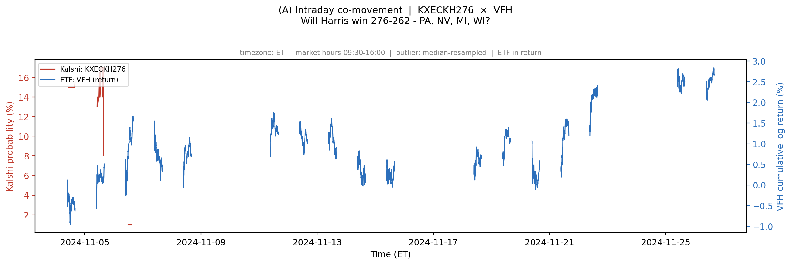
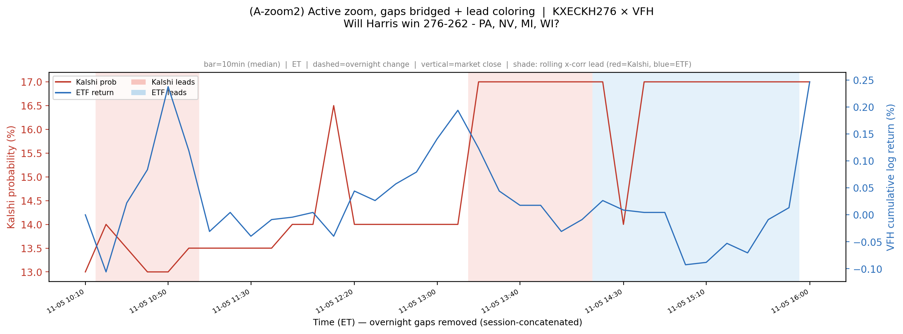
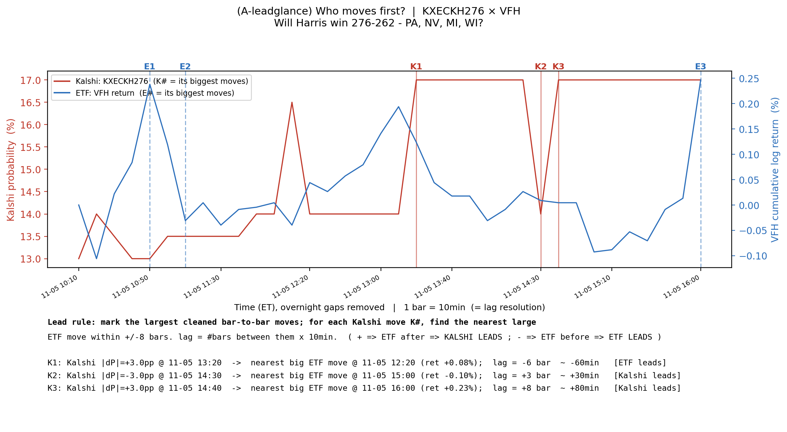
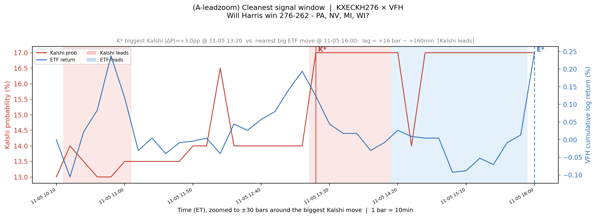
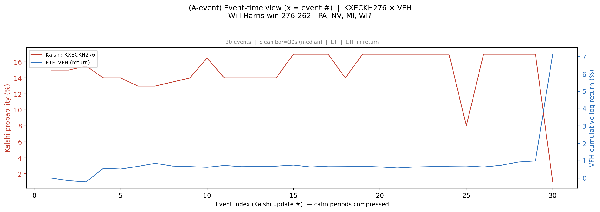
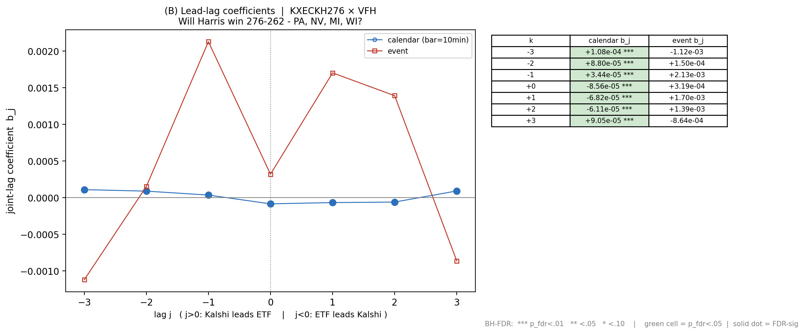

---

## Rank 21/48 — KXECKH276 × VIS  (n_sig=7, best_p=0.0e+00, n_trades=43)

```text
PAIR ANALYSIS    —    Rank 21 / 48
================================================================================================
KXECKH276   x   VIS
Contract : "Will Harris win 276-262 - PA, NV, MI, WI?"
Sector relevance : Election outcome (all sectors)
Window : 2024-11-04 to 2024-11-26     Kalshi trades : 43     primary bar : 10min     daily-screen R^2 : 0.76

>>> RELIABILITY:  Very-low-info   <<<   (see section 5; unreliable pairs still get figures, but read their problems in section 8)

DEFINITIONS
   xₜ₋ₖ = Kalshi yes-probability change, k bars before t   (1 bar = 10min)
   yₜ   = ETF log return over bar t
   calendar = full market-hours grid: x=0 in bars with no Kalshi trade (not dropped).
   k>0 => Kalshi leads ETF ;  k<0 => ETF leads Kalshi ;  k=0 => contemporaneous

1. CALENDAR-TIME REGRESSION (clock-time lags, full RTH grid)
   Full model:  yₜ = α + Σ(k=-3..3) βₖ·xₜ₋ₖ + Σ(d=1..5) γ_d·Day_d
      where  ADL ETF self-lags p=0 (BIC chose none -> no ETF self-lag term);  day-FE: 5 day dummies over 6 trading days (first day = baseline).
      controls counted (so you can see the total at a glance):  7 lead/lag x-terms + 0 ETF self-lag(s) + 5 day-FE dummies + 1 intercept = 13 RHS regressors  (model n_params=13).
   Significant terms (raw p<0.15) expanded:  yₜ = α + β₋₃·xₜ₊₃ + β₋₂·xₜ₊₂ + β₋₁·xₜ₊₁ + β₊₀·xₜ + β₊₁·xₜ₋₁ + β₊₂·xₜ₋₂ + β₊₃·xₜ₋₃
   where:
      β₋₃ = +9.383e-05   (t/z=+17.18, p=3.5e-66, p_fdr=4.9e-66) ***   [ETF leads]
      β₋₂ = +4.397e-05   (t/z=+15.33, p=5.0e-53, p_fdr=5.9e-53) ***   [ETF leads]
      β₋₁ = -8.887e-06   (t/z=-5.47, p=4.6e-08, p_fdr=4.6e-08) ***   [ETF leads]
      β₊₀ = -8.160e-05   (t/z=-60.07, p=0.0e+00, p_fdr=0.0e+00) ***   [contemporaneous]
      β₊₁ = -1.092e-04   (t/z=-95.33, p=0.0e+00, p_fdr=0.0e+00) ***   [Kalshi leads]
      β₊₂ = -6.985e-05   (t/z=-59.58, p=0.0e+00, p_fdr=0.0e+00) ***   [Kalshi leads]
      β₊₃ = +9.744e-05   (t/z=+60.67, p=0.0e+00, p_fdr=0.0e+00) ***   [Kalshi leads]
   Lean by count of significant lags: balanced/no clear side  (k>0:3, k<0:3).

2. EVENT-TIME REGRESSION (event-count lags)
   Full model:  yₜ = α + Σ(k=-3..3) βₖ·xₜ₋ₖ
      where  ADL ETF self-lags p=0 (BIC chose none -> no ETF self-lag term);  day-FE: none (single trading day -> clustered SE degrades to HC3).
      controls counted (so you can see the total at a glance):  7 lead/lag x-terms + 0 ETF self-lag(s) + 0 day-FE dummies + 1 intercept = 8 RHS regressors  (model n_params=8).
   -> 7 coefficients tested, NONE significant at raw p<0.15.

3. FULL COEFFICIENT TABLE  (calendar primary bar  vs  event)
      k |       calendar b (FDR) |          event b (FDR)
   ------------------------------------------------------
     -3 |          +9.38e-05 *** |          +1.70e-04    
     -2 |          +4.40e-05 *** |          +2.42e-04    
     -1 |          -8.89e-06 *** |          +4.94e-04    
     +0 |          -8.16e-05 *** |          +5.33e-04    
     +1 |          -1.09e-04 *** |          +4.01e-04    
     +2 |          -6.99e-05 *** |          +5.20e-04    
     +3 |          +9.74e-05 *** |          +1.36e-04    
   (stars = BH-FDR corrected:  *** p_fdr<.01  ** <.05  * <.10)

4. DIRECTIONAL TEST (probit, ETF up/down)
   Model: P(ETFₜ up) = Φ(α + βₖ·xₜ₋ₖ),  one probit per lag k
   calendar: n/a
   event: n/a
   -> no significant directional predictability either mode (raw p<0.15).

5. DATA RELIABILITY (statistical, not a trade-count cutoff)
   Tier: Very-low-info
   (criterion = n_active: bars with an actual Kalshi move (x!=0) = the real sample that identifies the lead-lag. Full RTH grid makes n_obs large, so n_active is the honest size.)
   calendar(full RTH grid): n_active=7  n_obs=110  n_days=6  K=3  params=13  df=97  median_SE=1.61e-06  sig(FDR)=7
   event: n_active=7  n_obs=12  n_days=1  K=3  params=8  df=4  median_SE=5.58e-04  sig(FDR)=0
   => Very low info: even 'significant' coefficients are untrustworthy (huge SE, possibly spurious significance).

6. COARSE-FREQUENCY ROBUSTNESS (re-run calendar at 30min / 60min)
    30min: not estimable (n_obs=12 < minimum) -- coarser bars have even fewer observations
    60min: not estimable (n_obs=7 < minimum) -- coarser bars have even fewer observations

7. VERDICT
   Only one time-axis significant (balanced) -- weak / single-mode evidence.
   (Note: this pair lacks the data to support reliable inference; the verdict above is descriptive only -- do not put it in the conclusions.)

8. FIGURE CAVEATS — figures are still drawn, but know their problems
   - Very low info (only 7 bars with an actual Kalshi move, < 15): even 'significant' coefficients are untrustworthy (huge SE, possibly spurious significance).
   - Most of the chart is flat no-trade lines; only a handful of bars carry real variation, so the lead calls in leadglance/segments are not robust.
   - Mixed coefficient signs across lags -- relationship not monotone.
   - Kalshi updates only on trades (flat line = no trade, NOT 'no change'); ETF mid refreshes continuously.

9. REAL-WORLD CONTEXT (WebSearch-verified; see URLs)
   - 2024 US presidential election held Tue Nov 5, 2024; ballots counted overnight Nov 5-6.
   - AP called the race for Trump ~5:34-5:37 AM ET on Wed Nov 6, 2024 (Wisconsin pushed him past 270) -- this is PRE-MARKET, so the regular-hours equity reaction shows up at the Nov 6 open.
   - Final electoral result: Trump 312, Harris 226.
   - Sources: en.wikipedia.org/wiki/2024_United_States_presidential_election ; spectrumlocalnews.com/us/snplus/news/2024/11/06/trump-wins-ap-projection-2024-election

------------------------------------------------------------------------------------------------
Conventions: ET | 09:30-16:00 (forward windows capped to 16:00) | ETF in log return | median causal bars | full RTH grid | day-grouped lags (no overnight) | ADL self-control | significance = BH-FDR corrected.
Figures for this pair follow on the next page.
```

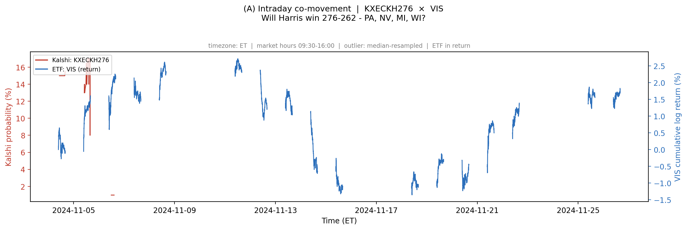
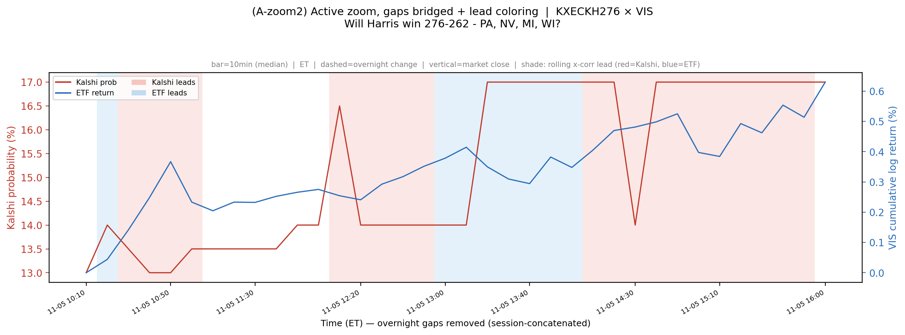
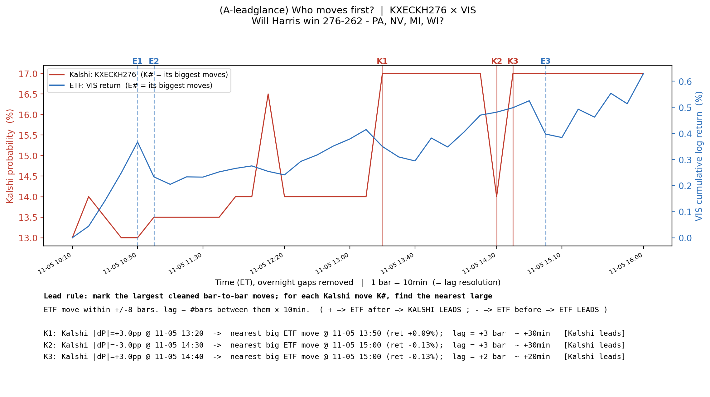
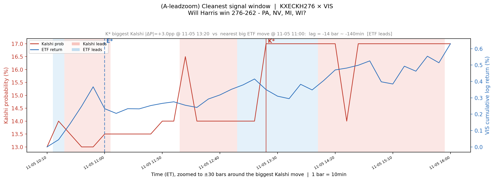
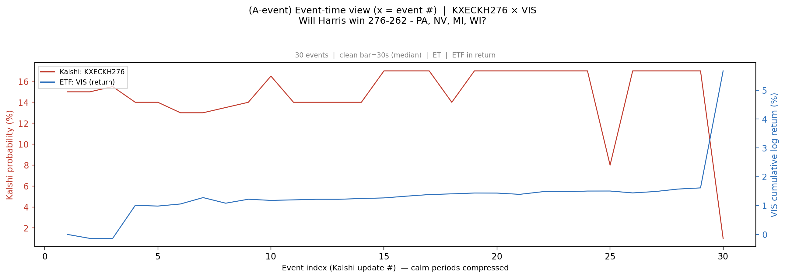
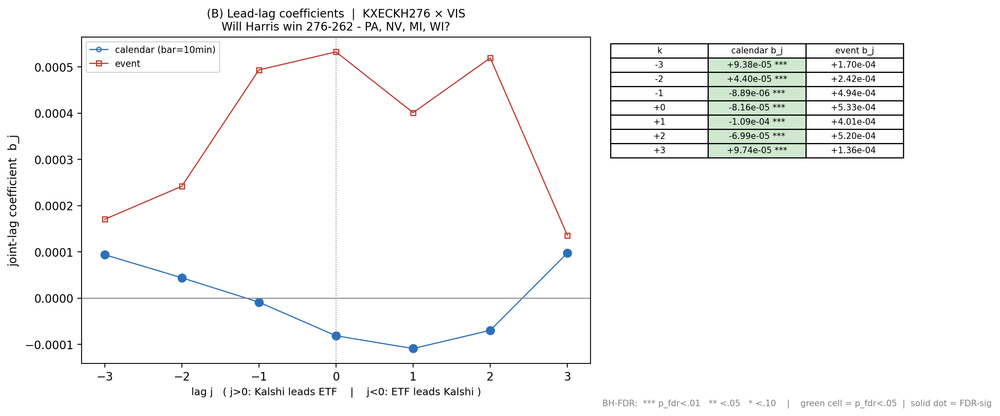

---

## Rank 22/48 — KXECKH276 × VCR  (n_sig=7, best_p=0.0e+00, n_trades=43)

```text
PAIR ANALYSIS    —    Rank 22 / 48
================================================================================================
KXECKH276   x   VCR
Contract : "Will Harris win 276-262 - PA, NV, MI, WI?"
Sector relevance : Election outcome (all sectors)
Window : 2024-11-04 to 2024-11-26     Kalshi trades : 43     primary bar : 10min     daily-screen R^2 : 0.65

>>> RELIABILITY:  Very-low-info   <<<   (see section 5; unreliable pairs still get figures, but read their problems in section 8)

DEFINITIONS
   xₜ₋ₖ = Kalshi yes-probability change, k bars before t   (1 bar = 10min)
   yₜ   = ETF log return over bar t
   calendar = full market-hours grid: x=0 in bars with no Kalshi trade (not dropped).
   k>0 => Kalshi leads ETF ;  k<0 => ETF leads Kalshi ;  k=0 => contemporaneous

1. CALENDAR-TIME REGRESSION (clock-time lags, full RTH grid)
   Full model:  yₜ = α + Σ(k=-3..3) βₖ·xₜ₋ₖ + Σ(d=1..5) γ_d·Day_d
      where  ADL ETF self-lags p=0 (BIC chose none -> no ETF self-lag term);  day-FE: 5 day dummies over 6 trading days (first day = baseline).
      controls counted (so you can see the total at a glance):  7 lead/lag x-terms + 0 ETF self-lag(s) + 5 day-FE dummies + 1 intercept = 13 RHS regressors  (model n_params=13).
   Significant terms (raw p<0.15) expanded:  yₜ = α + β₋₃·xₜ₊₃ + β₋₂·xₜ₊₂ + β₋₁·xₜ₊₁ + β₊₀·xₜ + β₊₁·xₜ₋₁ + β₊₂·xₜ₋₂ + β₊₃·xₜ₋₃
   where:
      β₋₃ = +4.911e-05   (t/z=+3.72, p=2.0e-04, p_fdr=2.3e-04) ***   [ETF leads]
      β₋₂ = +1.800e-05   (t/z=+2.60, p=9.4e-03, p_fdr=9.4e-03) ***   [ETF leads]
      β₋₁ = -9.021e-05   (t/z=-22.96, p=1.3e-116, p_fdr=2.2e-116) ***   [ETF leads]
      β₊₀ = -1.536e-04   (t/z=-46.80, p=0.0e+00, p_fdr=0.0e+00) ***   [contemporaneous]
      β₊₁ = -1.302e-04   (t/z=-47.04, p=0.0e+00, p_fdr=0.0e+00) ***   [Kalshi leads]
      β₊₂ = -1.560e-04   (t/z=-55.06, p=0.0e+00, p_fdr=0.0e+00) ***   [Kalshi leads]
      β₊₃ = +3.731e-05   (t/z=+9.61, p=7.1e-22, p_fdr=9.9e-22) ***   [Kalshi leads]
   Lean by count of significant lags: balanced/no clear side  (k>0:3, k<0:3).

2. EVENT-TIME REGRESSION (event-count lags)
   Full model:  yₜ = α + Σ(k=-3..3) βₖ·xₜ₋ₖ + φ₁·yₜ₋₁ + φ₂·yₜ₋₂ + φ₃·yₜ₋₃
      where  ADL ETF self-lags p=3 (BIC-chosen): φ₁·yₜ₋₁ + φ₂·yₜ₋₂ + φ₃·yₜ₋₃;  day-FE: none (single trading day -> clustered SE degrades to HC3).
      controls counted (so you can see the total at a glance):  7 lead/lag x-terms + 3 ETF self-lag(s) + 0 day-FE dummies + 1 intercept = 11 RHS regressors  (model n_params=11).
   -> 7 coefficients tested, NONE significant at raw p<0.15.

3. FULL COEFFICIENT TABLE  (calendar primary bar  vs  event)
      k |       calendar b (FDR) |          event b (FDR)
   ------------------------------------------------------
     -3 |          +4.91e-05 *** |          +2.72e-03    
     -2 |          +1.80e-05 *** |          +2.52e-03    
     -1 |          -9.02e-05 *** |          +3.48e-03    
     +0 |          -1.54e-04 *** |          +7.56e-04    
     +1 |          -1.30e-04 *** |          +6.34e-04    
     +2 |          -1.56e-04 *** |          +1.15e-03    
     +3 |          +3.73e-05 *** |          -3.11e-03    
   (stars = BH-FDR corrected:  *** p_fdr<.01  ** <.05  * <.10)

4. DIRECTIONAL TEST (probit, ETF up/down)
   Model: P(ETFₜ up) = Φ(α + βₖ·xₜ₋ₖ),  one probit per lag k
   calendar: n/a
   event: n/a
   -> no significant directional predictability either mode (raw p<0.15).

5. DATA RELIABILITY (statistical, not a trade-count cutoff)
   Tier: Very-low-info
   (criterion = n_active: bars with an actual Kalshi move (x!=0) = the real sample that identifies the lead-lag. Full RTH grid makes n_obs large, so n_active is the honest size.)
   calendar(full RTH grid): n_active=7  n_obs=110  n_days=6  K=3  params=13  df=97  median_SE=3.88e-06  sig(FDR)=7
   event: n_active=7  n_obs=12  n_days=1  K=3  params=11  df=1  median_SE=1.33e-02  sig(FDR)=0
   => Very low info: even 'significant' coefficients are untrustworthy (huge SE, possibly spurious significance).

6. COARSE-FREQUENCY ROBUSTNESS (re-run calendar at 30min / 60min)
    30min: not estimable (n_obs=12 < minimum) -- coarser bars have even fewer observations
    60min: not estimable (n_obs=7 < minimum) -- coarser bars have even fewer observations

7. VERDICT
   Only one time-axis significant (balanced) -- weak / single-mode evidence.
   (Note: this pair lacks the data to support reliable inference; the verdict above is descriptive only -- do not put it in the conclusions.)

8. FIGURE CAVEATS — figures are still drawn, but know their problems
   - Very low info (only 7 bars with an actual Kalshi move, < 15): even 'significant' coefficients are untrustworthy (huge SE, possibly spurious significance).
   - Most of the chart is flat no-trade lines; only a handful of bars carry real variation, so the lead calls in leadglance/segments are not robust.
   - Mixed coefficient signs across lags -- relationship not monotone.
   - Kalshi updates only on trades (flat line = no trade, NOT 'no change'); ETF mid refreshes continuously.

9. REAL-WORLD CONTEXT (WebSearch-verified; see URLs)
   - 2024 US presidential election held Tue Nov 5, 2024; ballots counted overnight Nov 5-6.
   - AP called the race for Trump ~5:34-5:37 AM ET on Wed Nov 6, 2024 (Wisconsin pushed him past 270) -- this is PRE-MARKET, so the regular-hours equity reaction shows up at the Nov 6 open.
   - Final electoral result: Trump 312, Harris 226.
   - Sources: en.wikipedia.org/wiki/2024_United_States_presidential_election ; spectrumlocalnews.com/us/snplus/news/2024/11/06/trump-wins-ap-projection-2024-election

------------------------------------------------------------------------------------------------
Conventions: ET | 09:30-16:00 (forward windows capped to 16:00) | ETF in log return | median causal bars | full RTH grid | day-grouped lags (no overnight) | ADL self-control | significance = BH-FDR corrected.
Figures for this pair follow on the next page.
```

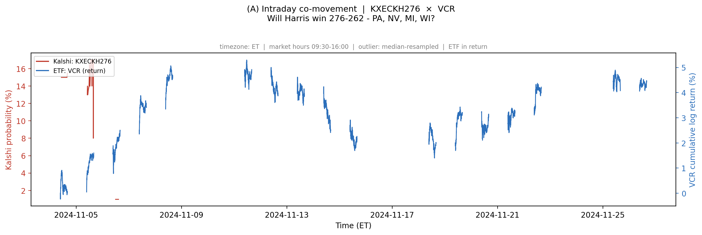
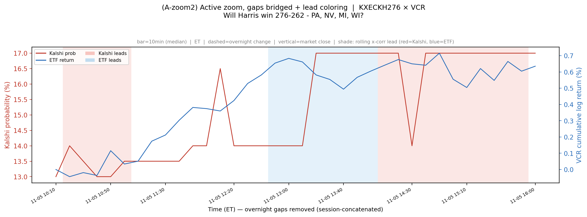
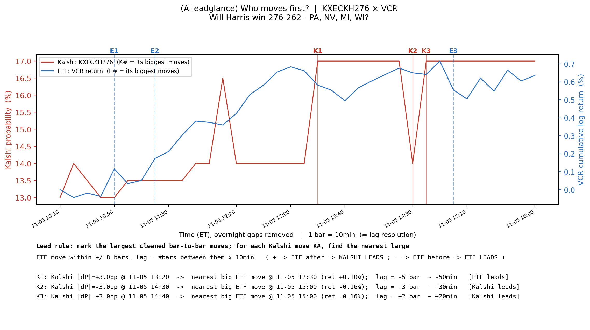
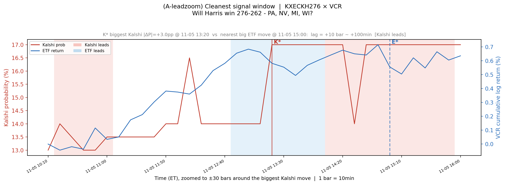
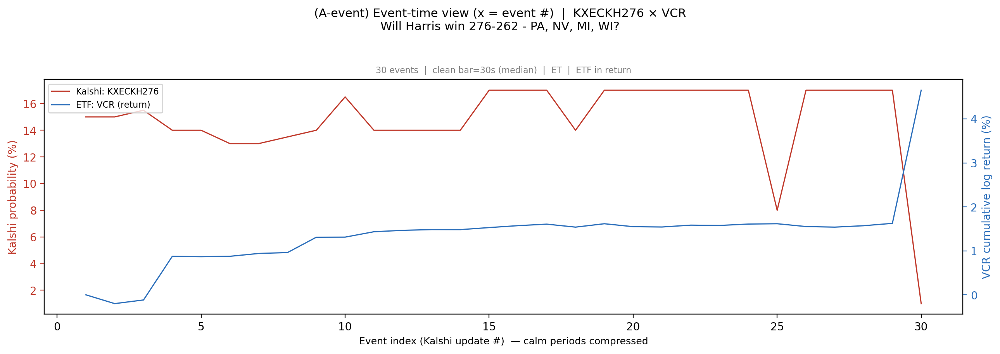
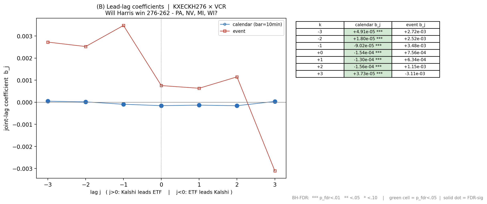

---

## Rank 23/48 — KXECKH276 × VDE  (n_sig=7, best_p=0.0e+00, n_trades=43)

```text
PAIR ANALYSIS    —    Rank 23 / 48
================================================================================================
KXECKH276   x   VDE
Contract : "Will Harris win 276-262 - PA, NV, MI, WI?"
Sector relevance : Election outcome (all sectors)
Window : 2024-11-04 to 2024-11-26     Kalshi trades : 43     primary bar : 10min     daily-screen R^2 : 0.63

>>> RELIABILITY:  Very-low-info   <<<   (see section 5; unreliable pairs still get figures, but read their problems in section 8)

DEFINITIONS
   xₜ₋ₖ = Kalshi yes-probability change, k bars before t   (1 bar = 10min)
   yₜ   = ETF log return over bar t
   calendar = full market-hours grid: x=0 in bars with no Kalshi trade (not dropped).
   k>0 => Kalshi leads ETF ;  k<0 => ETF leads Kalshi ;  k=0 => contemporaneous

1. CALENDAR-TIME REGRESSION (clock-time lags, full RTH grid)
   Full model:  yₜ = α + Σ(k=-3..3) βₖ·xₜ₋ₖ + Σ(d=1..5) γ_d·Day_d
      where  ADL ETF self-lags p=0 (BIC chose none -> no ETF self-lag term);  day-FE: 5 day dummies over 6 trading days (first day = baseline).
      controls counted (so you can see the total at a glance):  7 lead/lag x-terms + 0 ETF self-lag(s) + 5 day-FE dummies + 1 intercept = 13 RHS regressors  (model n_params=13).
   Significant terms (raw p<0.15) expanded:  yₜ = α + β₋₃·xₜ₊₃ + β₋₂·xₜ₊₂ + β₋₁·xₜ₊₁ + β₊₀·xₜ + β₊₁·xₜ₋₁ + β₊₂·xₜ₋₂ + β₊₃·xₜ₋₃
   where:
      β₋₃ = -5.530e-05   (t/z=-6.74, p=1.5e-11, p_fdr=1.5e-11) ***   [ETF leads]
      β₋₂ = -1.906e-04   (t/z=-44.23, p=0.0e+00, p_fdr=0.0e+00) ***   [ETF leads]
      β₋₁ = -2.044e-04   (t/z=-83.69, p=0.0e+00, p_fdr=0.0e+00) ***   [ETF leads]
      β₊₀ = -9.736e-05   (t/z=-47.73, p=0.0e+00, p_fdr=0.0e+00) ***   [contemporaneous]
      β₊₁ = -7.592e-05   (t/z=-44.13, p=0.0e+00, p_fdr=0.0e+00) ***   [Kalshi leads]
      β₊₂ = -1.796e-04   (t/z=-102.01, p=0.0e+00, p_fdr=0.0e+00) ***   [Kalshi leads]
      β₊₃ = -5.526e-05   (t/z=-22.91, p=3.7e-116, p_fdr=4.4e-116) ***   [Kalshi leads]
   Lean by count of significant lags: balanced/no clear side  (k>0:3, k<0:3).

2. EVENT-TIME REGRESSION (event-count lags)
   Full model:  yₜ = α + Σ(k=-3..3) βₖ·xₜ₋ₖ + φ₁·yₜ₋₁ + φ₂·yₜ₋₂ + φ₃·yₜ₋₃
      where  ADL ETF self-lags p=3 (BIC-chosen): φ₁·yₜ₋₁ + φ₂·yₜ₋₂ + φ₃·yₜ₋₃;  day-FE: none (single trading day -> clustered SE degrades to HC3).
      controls counted (so you can see the total at a glance):  7 lead/lag x-terms + 3 ETF self-lag(s) + 0 day-FE dummies + 1 intercept = 11 RHS regressors  (model n_params=11).
   -> 7 coefficients tested, NONE significant at raw p<0.15.

3. FULL COEFFICIENT TABLE  (calendar primary bar  vs  event)
      k |       calendar b (FDR) |          event b (FDR)
   ------------------------------------------------------
     -3 |          -5.53e-05 *** |          -4.61e-03    
     -2 |          -1.91e-04 *** |          -6.40e-03    
     -1 |          -2.04e-04 *** |          -8.71e-03    
     +0 |          -9.74e-05 *** |          -8.99e-03    
     +1 |          -7.59e-05 *** |          -6.88e-03    
     +2 |          -1.80e-04 *** |          -4.96e-03    
     +3 |          -5.53e-05 *** |          +1.37e-03    
   (stars = BH-FDR corrected:  *** p_fdr<.01  ** <.05  * <.10)

4. DIRECTIONAL TEST (probit, ETF up/down)
   Model: P(ETFₜ up) = Φ(α + βₖ·xₜ₋ₖ),  one probit per lag k
   calendar: n/a
   event: n/a
   -> no significant directional predictability either mode (raw p<0.15).

5. DATA RELIABILITY (statistical, not a trade-count cutoff)
   Tier: Very-low-info
   (criterion = n_active: bars with an actual Kalshi move (x!=0) = the real sample that identifies the lead-lag. Full RTH grid makes n_obs large, so n_active is the honest size.)
   calendar(full RTH grid): n_active=7  n_obs=110  n_days=6  K=3  params=13  df=97  median_SE=2.41e-06  sig(FDR)=7
   event: n_active=7  n_obs=12  n_days=1  K=3  params=11  df=1  median_SE=3.53e+00  sig(FDR)=0
   => Very low info: even 'significant' coefficients are untrustworthy (huge SE, possibly spurious significance).

6. COARSE-FREQUENCY ROBUSTNESS (re-run calendar at 30min / 60min)
    30min: not estimable (n_obs=12 < minimum) -- coarser bars have even fewer observations
    60min: not estimable (n_obs=7 < minimum) -- coarser bars have even fewer observations

7. VERDICT
   Only one time-axis significant (balanced) -- weak / single-mode evidence.
   (Note: this pair lacks the data to support reliable inference; the verdict above is descriptive only -- do not put it in the conclusions.)

8. FIGURE CAVEATS — figures are still drawn, but know their problems
   - Very low info (only 7 bars with an actual Kalshi move, < 15): even 'significant' coefficients are untrustworthy (huge SE, possibly spurious significance).
   - Most of the chart is flat no-trade lines; only a handful of bars carry real variation, so the lead calls in leadglance/segments are not robust.
   - Kalshi updates only on trades (flat line = no trade, NOT 'no change'); ETF mid refreshes continuously.

9. REAL-WORLD CONTEXT (WebSearch-verified; see URLs)
   - 2024 US presidential election held Tue Nov 5, 2024; ballots counted overnight Nov 5-6.
   - AP called the race for Trump ~5:34-5:37 AM ET on Wed Nov 6, 2024 (Wisconsin pushed him past 270) -- this is PRE-MARKET, so the regular-hours equity reaction shows up at the Nov 6 open.
   - Final electoral result: Trump 312, Harris 226.
   - Sources: en.wikipedia.org/wiki/2024_United_States_presidential_election ; spectrumlocalnews.com/us/snplus/news/2024/11/06/trump-wins-ap-projection-2024-election

------------------------------------------------------------------------------------------------
Conventions: ET | 09:30-16:00 (forward windows capped to 16:00) | ETF in log return | median causal bars | full RTH grid | day-grouped lags (no overnight) | ADL self-control | significance = BH-FDR corrected.
Figures for this pair follow on the next page.
```

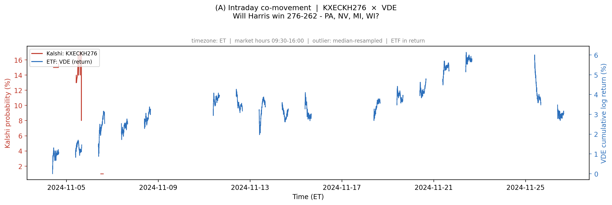
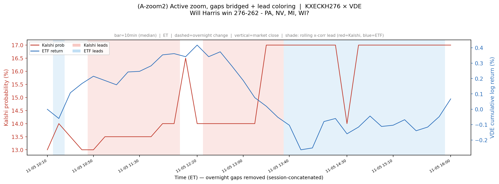
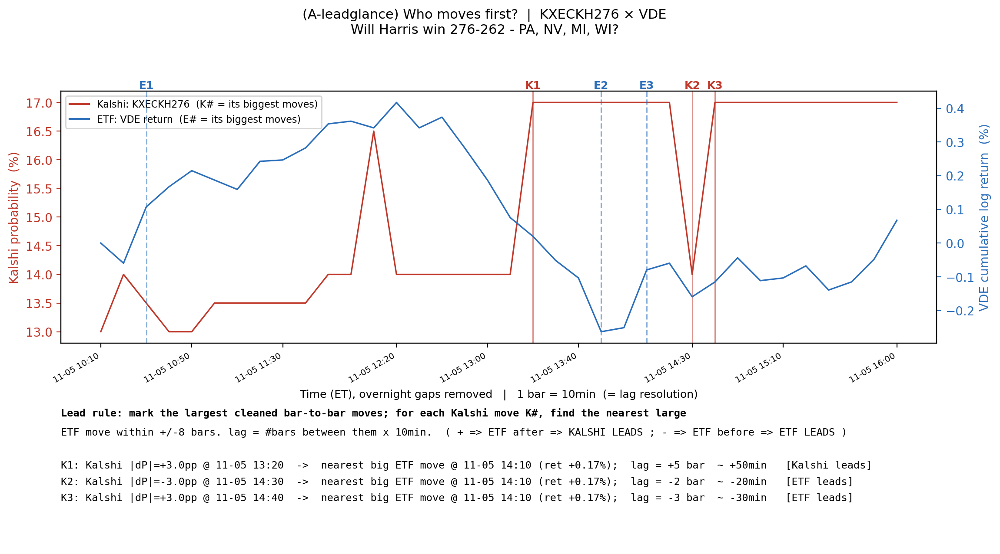
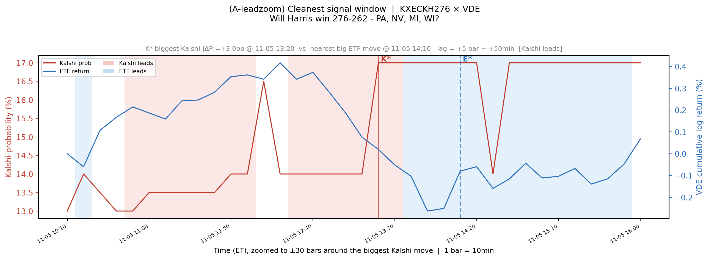
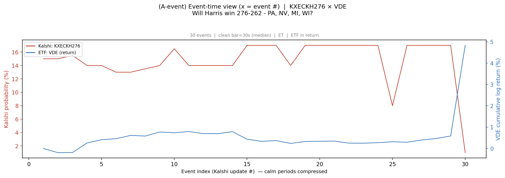
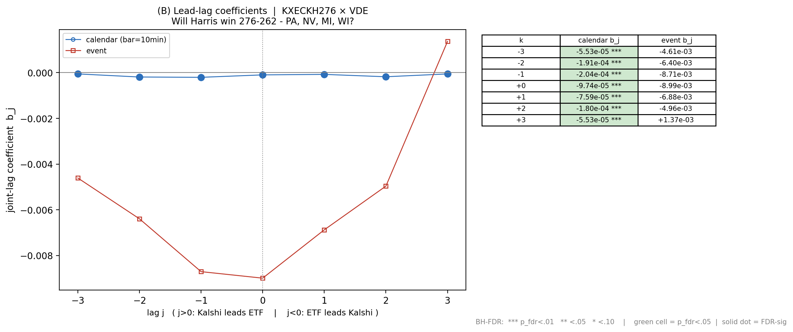

---

## Rank 24/48 — KXECKH276 × VGT  (n_sig=7, best_p=0.0e+00, n_trades=43)

```text
PAIR ANALYSIS    —    Rank 24 / 48
================================================================================================
KXECKH276   x   VGT
Contract : "Will Harris win 276-262 - PA, NV, MI, WI?"
Sector relevance : Election outcome (all sectors)
Window : 2024-11-04 to 2024-11-26     Kalshi trades : 43     primary bar : 10min     daily-screen R^2 : 0.59

>>> RELIABILITY:  Very-low-info   <<<   (see section 5; unreliable pairs still get figures, but read their problems in section 8)

DEFINITIONS
   xₜ₋ₖ = Kalshi yes-probability change, k bars before t   (1 bar = 10min)
   yₜ   = ETF log return over bar t
   calendar = full market-hours grid: x=0 in bars with no Kalshi trade (not dropped).
   k>0 => Kalshi leads ETF ;  k<0 => ETF leads Kalshi ;  k=0 => contemporaneous

1. CALENDAR-TIME REGRESSION (clock-time lags, full RTH grid)
   Full model:  yₜ = α + Σ(k=-3..3) βₖ·xₜ₋ₖ + Σ(d=1..5) γ_d·Day_d
      where  ADL ETF self-lags p=0 (BIC chose none -> no ETF self-lag term);  day-FE: 5 day dummies over 6 trading days (first day = baseline).
      controls counted (so you can see the total at a glance):  7 lead/lag x-terms + 0 ETF self-lag(s) + 5 day-FE dummies + 1 intercept = 13 RHS regressors  (model n_params=13).
   Significant terms (raw p<0.15) expanded:  yₜ = α + β₋₃·xₜ₊₃ + β₋₂·xₜ₊₂ + β₋₁·xₜ₊₁ + β₊₀·xₜ + β₊₁·xₜ₋₁ + β₊₂·xₜ₋₂ + β₊₃·xₜ₋₃
   where:
      β₋₃ = +7.730e-05   (t/z=+23.67, p=6.5e-124, p_fdr=6.5e-124) ***   [ETF leads]
      β₋₂ = -6.376e-05   (t/z=-37.17, p=2.3e-302, p_fdr=2.6e-302) ***   [ETF leads]
      β₋₁ = -6.446e-05   (t/z=-66.29, p=0.0e+00, p_fdr=0.0e+00) ***   [ETF leads]
      β₊₀ = -1.035e-04   (t/z=-127.45, p=0.0e+00, p_fdr=0.0e+00) ***   [contemporaneous]
      β₊₁ = -1.223e-04   (t/z=-178.56, p=0.0e+00, p_fdr=0.0e+00) ***   [Kalshi leads]
      β₊₂ = -1.240e-04   (t/z=-176.83, p=0.0e+00, p_fdr=0.0e+00) ***   [Kalshi leads]
      β₊₃ = +4.190e-05   (t/z=+43.63, p=0.0e+00, p_fdr=0.0e+00) ***   [Kalshi leads]
   Lean by count of significant lags: balanced/no clear side  (k>0:3, k<0:3).

2. EVENT-TIME REGRESSION (event-count lags)
   Full model:  yₜ = α + Σ(k=-3..3) βₖ·xₜ₋ₖ + φ₁·yₜ₋₁ + φ₂·yₜ₋₂ + φ₃·yₜ₋₃
      where  ADL ETF self-lags p=3 (BIC-chosen): φ₁·yₜ₋₁ + φ₂·yₜ₋₂ + φ₃·yₜ₋₃;  day-FE: none (single trading day -> clustered SE degrades to HC3).
      controls counted (so you can see the total at a glance):  7 lead/lag x-terms + 3 ETF self-lag(s) + 0 day-FE dummies + 1 intercept = 11 RHS regressors  (model n_params=11).
   -> 7 coefficients tested, NONE significant at raw p<0.15.

3. FULL COEFFICIENT TABLE  (calendar primary bar  vs  event)
      k |       calendar b (FDR) |          event b (FDR)
   ------------------------------------------------------
     -3 |          +7.73e-05 *** |          +7.11e-03    
     -2 |          -6.38e-05 *** |          +8.84e-03    
     -1 |          -6.45e-05 *** |          +9.62e-03    
     +0 |          -1.04e-04 *** |          +5.42e-03    
     +1 |          -1.22e-04 *** |          +2.92e-03    
     +2 |          -1.24e-04 *** |          +1.37e-03    
     +3 |          +4.19e-05 *** |          -5.16e-03    
   (stars = BH-FDR corrected:  *** p_fdr<.01  ** <.05  * <.10)

4. DIRECTIONAL TEST (probit, ETF up/down)
   Model: P(ETFₜ up) = Φ(α + βₖ·xₜ₋ₖ),  one probit per lag k
   calendar: n/a
   event: n/a
   -> no significant directional predictability either mode (raw p<0.15).

5. DATA RELIABILITY (statistical, not a trade-count cutoff)
   Tier: Very-low-info
   (criterion = n_active: bars with an actual Kalshi move (x!=0) = the real sample that identifies the lead-lag. Full RTH grid makes n_obs large, so n_active is the honest size.)
   calendar(full RTH grid): n_active=7  n_obs=110  n_days=6  K=3  params=13  df=97  median_SE=9.60e-07  sig(FDR)=7
   event: n_active=7  n_obs=12  n_days=1  K=3  params=11  df=1  median_SE=1.53e-02  sig(FDR)=0
   => Very low info: even 'significant' coefficients are untrustworthy (huge SE, possibly spurious significance).

6. COARSE-FREQUENCY ROBUSTNESS (re-run calendar at 30min / 60min)
    30min: not estimable (n_obs=12 < minimum) -- coarser bars have even fewer observations
    60min: not estimable (n_obs=7 < minimum) -- coarser bars have even fewer observations

7. VERDICT
   Only one time-axis significant (balanced) -- weak / single-mode evidence.
   (Note: this pair lacks the data to support reliable inference; the verdict above is descriptive only -- do not put it in the conclusions.)

8. FIGURE CAVEATS — figures are still drawn, but know their problems
   - Very low info (only 7 bars with an actual Kalshi move, < 15): even 'significant' coefficients are untrustworthy (huge SE, possibly spurious significance).
   - Most of the chart is flat no-trade lines; only a handful of bars carry real variation, so the lead calls in leadglance/segments are not robust.
   - Mixed coefficient signs across lags -- relationship not monotone.
   - Kalshi updates only on trades (flat line = no trade, NOT 'no change'); ETF mid refreshes continuously.

9. REAL-WORLD CONTEXT (WebSearch-verified; see URLs)
   - 2024 US presidential election held Tue Nov 5, 2024; ballots counted overnight Nov 5-6.
   - AP called the race for Trump ~5:34-5:37 AM ET on Wed Nov 6, 2024 (Wisconsin pushed him past 270) -- this is PRE-MARKET, so the regular-hours equity reaction shows up at the Nov 6 open.
   - Final electoral result: Trump 312, Harris 226.
   - Sources: en.wikipedia.org/wiki/2024_United_States_presidential_election ; spectrumlocalnews.com/us/snplus/news/2024/11/06/trump-wins-ap-projection-2024-election

------------------------------------------------------------------------------------------------
Conventions: ET | 09:30-16:00 (forward windows capped to 16:00) | ETF in log return | median causal bars | full RTH grid | day-grouped lags (no overnight) | ADL self-control | significance = BH-FDR corrected.
Figures for this pair follow on the next page.
```

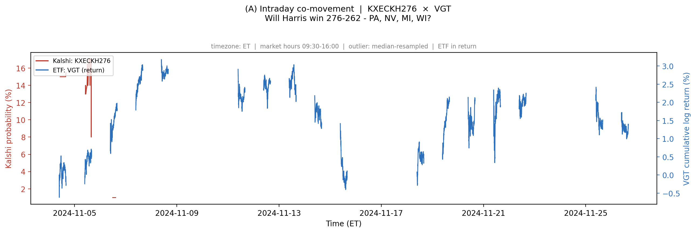
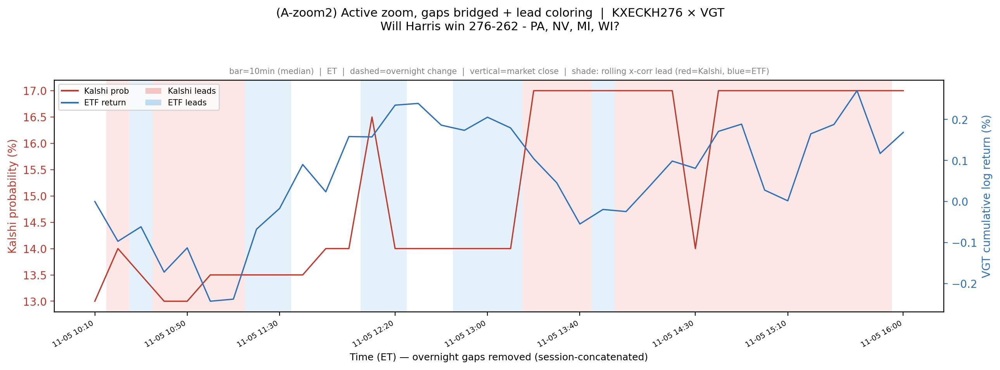
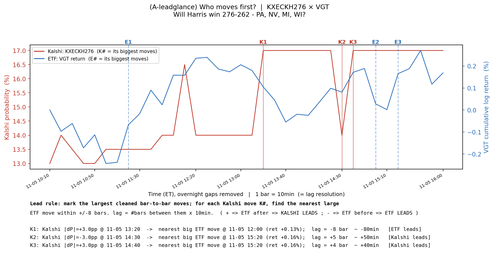
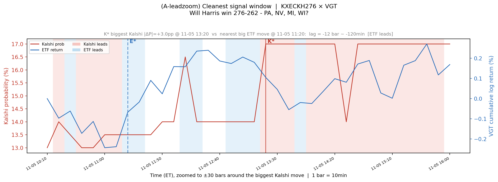
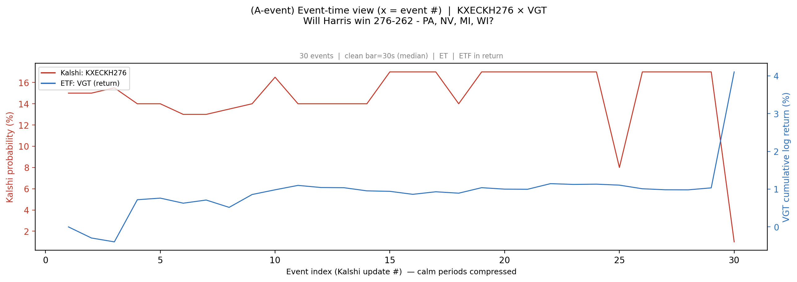
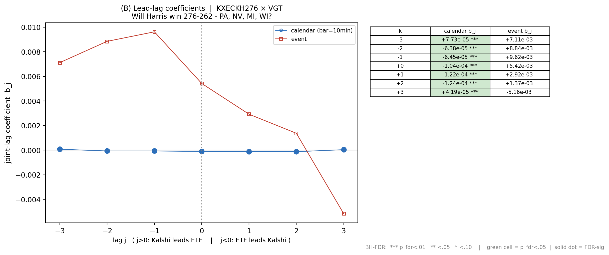

---

## Rank 25/48 — KXECKH276 × VDC  (n_sig=7, best_p=0.0e+00, n_trades=43)

```text
PAIR ANALYSIS    —    Rank 25 / 48
================================================================================================
KXECKH276   x   VDC
Contract : "Will Harris win 276-262 - PA, NV, MI, WI?"
Sector relevance : Election outcome (all sectors)
Window : 2024-11-04 to 2024-11-26     Kalshi trades : 43     primary bar : 10min     daily-screen R^2 : 0.53

>>> RELIABILITY:  Very-low-info   <<<   (see section 5; unreliable pairs still get figures, but read their problems in section 8)

DEFINITIONS
   xₜ₋ₖ = Kalshi yes-probability change, k bars before t   (1 bar = 10min)
   yₜ   = ETF log return over bar t
   calendar = full market-hours grid: x=0 in bars with no Kalshi trade (not dropped).
   k>0 => Kalshi leads ETF ;  k<0 => ETF leads Kalshi ;  k=0 => contemporaneous

1. CALENDAR-TIME REGRESSION (clock-time lags, full RTH grid)
   Full model:  yₜ = α + Σ(k=-3..3) βₖ·xₜ₋ₖ + Σ(d=1..5) γ_d·Day_d
      where  ADL ETF self-lags p=0 (BIC chose none -> no ETF self-lag term);  day-FE: 5 day dummies over 6 trading days (first day = baseline).
      controls counted (so you can see the total at a glance):  7 lead/lag x-terms + 0 ETF self-lag(s) + 5 day-FE dummies + 1 intercept = 13 RHS regressors  (model n_params=13).
   Significant terms (raw p<0.15) expanded:  yₜ = α + β₋₃·xₜ₊₃ + β₋₂·xₜ₊₂ + β₋₁·xₜ₊₁ + β₊₀·xₜ + β₊₁·xₜ₋₁ + β₊₂·xₜ₋₂ + β₊₃·xₜ₋₃
   where:
      β₋₃ = -1.475e-05   (t/z=-9.84, p=7.2e-23, p_fdr=7.2e-23) ***   [ETF leads]
      β₋₂ = -3.424e-05   (t/z=-43.50, p=0.0e+00, p_fdr=0.0e+00) ***   [ETF leads]
      β₋₁ = -7.025e-05   (t/z=-157.45, p=0.0e+00, p_fdr=0.0e+00) ***   [ETF leads]
      β₊₀ = -9.190e-05   (t/z=-246.59, p=0.0e+00, p_fdr=0.0e+00) ***   [contemporaneous]
      β₊₁ = -8.358e-05   (t/z=-265.95, p=0.0e+00, p_fdr=0.0e+00) ***   [Kalshi leads]
      β₊₂ = -4.469e-05   (t/z=-138.93, p=0.0e+00, p_fdr=0.0e+00) ***   [Kalshi leads]
      β₊₃ = +5.597e-05   (t/z=+127.02, p=0.0e+00, p_fdr=0.0e+00) ***   [Kalshi leads]
   Lean by count of significant lags: balanced/no clear side  (k>0:3, k<0:3).

2. EVENT-TIME REGRESSION (event-count lags)
   Full model:  yₜ = α + Σ(k=-3..3) βₖ·xₜ₋ₖ + φ₁·yₜ₋₁ + φ₂·yₜ₋₂ + φ₃·yₜ₋₃
      where  ADL ETF self-lags p=3 (BIC-chosen): φ₁·yₜ₋₁ + φ₂·yₜ₋₂ + φ₃·yₜ₋₃;  day-FE: none (single trading day -> clustered SE degrades to HC3).
      controls counted (so you can see the total at a glance):  7 lead/lag x-terms + 3 ETF self-lag(s) + 0 day-FE dummies + 1 intercept = 11 RHS regressors  (model n_params=11).
   -> 7 coefficients tested, NONE significant at raw p<0.15.

3. FULL COEFFICIENT TABLE  (calendar primary bar  vs  event)
      k |       calendar b (FDR) |          event b (FDR)
   ------------------------------------------------------
     -3 |          -1.47e-05 *** |          +4.38e-04    
     -2 |          -3.42e-05 *** |          +9.10e-04    
     -1 |          -7.02e-05 *** |          +1.23e-03    
     +0 |          -9.19e-05 *** |          +8.03e-04    
     +1 |          -8.36e-05 *** |          +1.05e-03    
     +2 |          -4.47e-05 *** |          +5.07e-04    
     +3 |          +5.60e-05 *** |          -3.26e-04    
   (stars = BH-FDR corrected:  *** p_fdr<.01  ** <.05  * <.10)

4. DIRECTIONAL TEST (probit, ETF up/down)
   Model: P(ETFₜ up) = Φ(α + βₖ·xₜ₋ₖ),  one probit per lag k
   calendar: n/a
   event: n/a
   -> no significant directional predictability either mode (raw p<0.15).

5. DATA RELIABILITY (statistical, not a trade-count cutoff)
   Tier: Very-low-info
   (criterion = n_active: bars with an actual Kalshi move (x!=0) = the real sample that identifies the lead-lag. Full RTH grid makes n_obs large, so n_active is the honest size.)
   calendar(full RTH grid): n_active=7  n_obs=110  n_days=6  K=3  params=13  df=97  median_SE=4.41e-07  sig(FDR)=7
   event: n_active=7  n_obs=12  n_days=1  K=3  params=11  df=1  median_SE=7.53e-03  sig(FDR)=0
   => Very low info: even 'significant' coefficients are untrustworthy (huge SE, possibly spurious significance).

6. COARSE-FREQUENCY ROBUSTNESS (re-run calendar at 30min / 60min)
    30min: not estimable (n_obs=12 < minimum) -- coarser bars have even fewer observations
    60min: not estimable (n_obs=7 < minimum) -- coarser bars have even fewer observations

7. VERDICT
   Only one time-axis significant (balanced) -- weak / single-mode evidence.
   (Note: this pair lacks the data to support reliable inference; the verdict above is descriptive only -- do not put it in the conclusions.)

8. FIGURE CAVEATS — figures are still drawn, but know their problems
   - Very low info (only 7 bars with an actual Kalshi move, < 15): even 'significant' coefficients are untrustworthy (huge SE, possibly spurious significance).
   - Most of the chart is flat no-trade lines; only a handful of bars carry real variation, so the lead calls in leadglance/segments are not robust.
   - Mixed coefficient signs across lags -- relationship not monotone.
   - Kalshi updates only on trades (flat line = no trade, NOT 'no change'); ETF mid refreshes continuously.

9. REAL-WORLD CONTEXT (WebSearch-verified; see URLs)
   - 2024 US presidential election held Tue Nov 5, 2024; ballots counted overnight Nov 5-6.
   - AP called the race for Trump ~5:34-5:37 AM ET on Wed Nov 6, 2024 (Wisconsin pushed him past 270) -- this is PRE-MARKET, so the regular-hours equity reaction shows up at the Nov 6 open.
   - Final electoral result: Trump 312, Harris 226.
   - Sources: en.wikipedia.org/wiki/2024_United_States_presidential_election ; spectrumlocalnews.com/us/snplus/news/2024/11/06/trump-wins-ap-projection-2024-election

------------------------------------------------------------------------------------------------
Conventions: ET | 09:30-16:00 (forward windows capped to 16:00) | ETF in log return | median causal bars | full RTH grid | day-grouped lags (no overnight) | ADL self-control | significance = BH-FDR corrected.
Figures for this pair follow on the next page.
```

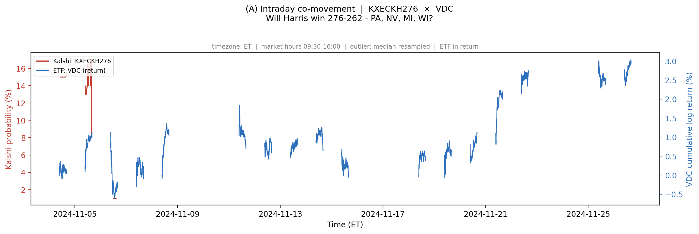
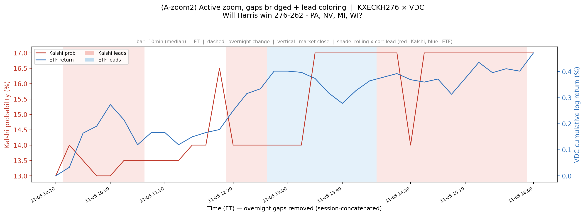
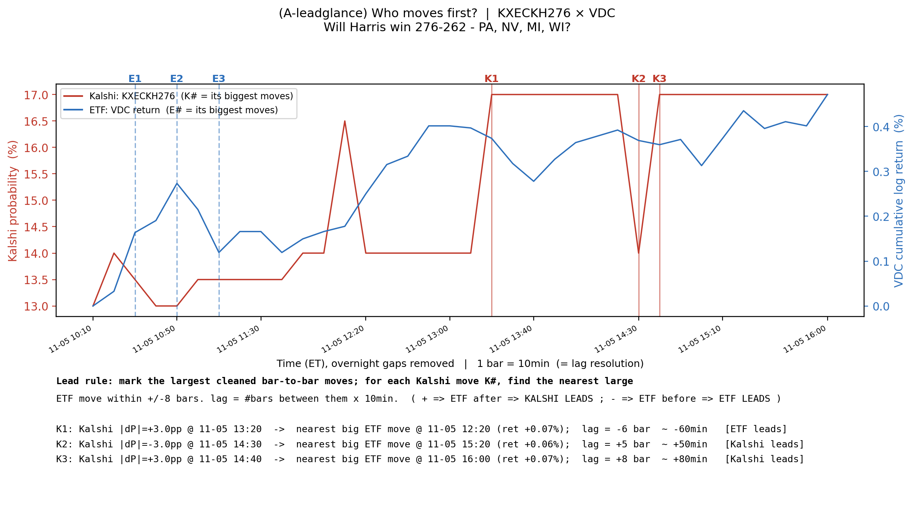
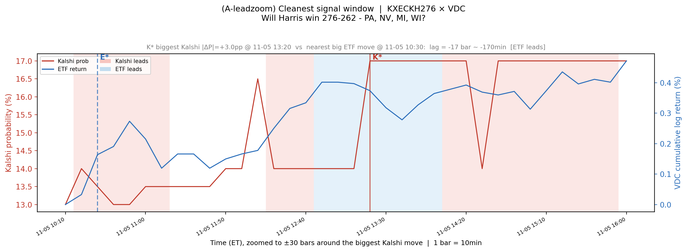
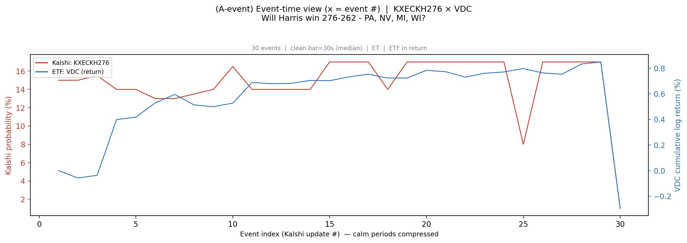
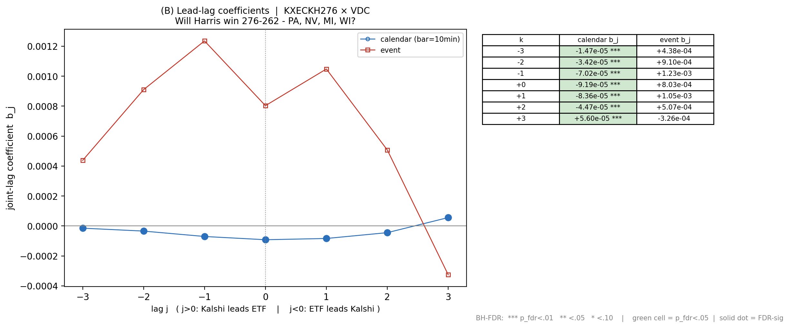

---

## Rank 26/48 — KXECKH276 × VAW  (n_sig=5, best_p=6.3e-25, n_trades=43)

```text
PAIR ANALYSIS    —    Rank 26 / 48
================================================================================================
KXECKH276   x   VAW
Contract : "Will Harris win 276-262 - PA, NV, MI, WI?"
Sector relevance : Election outcome (all sectors)
Window : 2024-11-04 to 2024-11-26     Kalshi trades : 43     primary bar : 10min     daily-screen R^2 : 0.44

>>> RELIABILITY:  Very-low-info   <<<   (see section 5; unreliable pairs still get figures, but read their problems in section 8)

DEFINITIONS
   xₜ₋ₖ = Kalshi yes-probability change, k bars before t   (1 bar = 10min)
   yₜ   = ETF log return over bar t
   calendar = full market-hours grid: x=0 in bars with no Kalshi trade (not dropped).
   k>0 => Kalshi leads ETF ;  k<0 => ETF leads Kalshi ;  k=0 => contemporaneous

1. CALENDAR-TIME REGRESSION (clock-time lags, full RTH grid)
   Full model:  yₜ = α + Σ(k=-3..3) βₖ·xₜ₋ₖ + φ₁·yₜ₋₁ + Σ(d=1..5) γ_d·Day_d
      where  ADL ETF self-lags p=1 (BIC-chosen): φ₁·yₜ₋₁;  day-FE: 5 day dummies over 6 trading days (first day = baseline).
      controls counted (so you can see the total at a glance):  7 lead/lag x-terms + 1 ETF self-lag(s) + 5 day-FE dummies + 1 intercept = 14 RHS regressors  (model n_params=14).
   Significant terms (raw p<0.15) expanded:  yₜ = α + β₋₃·xₜ₊₃ + β₋₂·xₜ₊₂ + β₊₀·xₜ + β₊₁·xₜ₋₁ + β₊₃·xₜ₋₃
   where:
      β₋₃ = +4.619e-05   (t/z=+4.90, p=9.7e-07, p_fdr=1.7e-06) ***   [ETF leads]
      β₋₂ = +5.094e-05   (t/z=+10.50, p=9.1e-26, p_fdr=6.3e-25) ***   [ETF leads]
      β₊₀ = -5.223e-05   (t/z=-7.13, p=9.9e-13, p_fdr=2.3e-12) ***   [contemporaneous]
      β₊₁ = -5.765e-05   (t/z=-3.03, p=2.4e-03, p_fdr=3.4e-03) ***   [Kalshi leads]
      β₊₃ = +1.035e-04   (t/z=+9.12, p=7.7e-20, p_fdr=2.7e-19) ***   [Kalshi leads]
   Lean by count of significant lags: balanced/no clear side  (k>0:2, k<0:2).

2. EVENT-TIME REGRESSION (event-count lags)
   Full model:  yₜ = α + Σ(k=-3..3) βₖ·xₜ₋ₖ + φ₁·yₜ₋₁ + φ₂·yₜ₋₂ + φ₃·yₜ₋₃
      where  ADL ETF self-lags p=3 (BIC-chosen): φ₁·yₜ₋₁ + φ₂·yₜ₋₂ + φ₃·yₜ₋₃;  day-FE: none (single trading day -> clustered SE degrades to HC3).
      controls counted (so you can see the total at a glance):  7 lead/lag x-terms + 3 ETF self-lag(s) + 0 day-FE dummies + 1 intercept = 11 RHS regressors  (model n_params=11).
   -> 7 coefficients tested, NONE significant at raw p<0.15.

3. FULL COEFFICIENT TABLE  (calendar primary bar  vs  event)
      k |       calendar b (FDR) |          event b (FDR)
   ------------------------------------------------------
     -3 |          +4.62e-05 *** |          -1.95e-04    
     -2 |          +5.09e-05 *** |          +2.17e-05    
     -1 |          +5.26e-07     |          +1.44e-04    
     +0 |          -5.22e-05 *** |          +8.85e-05    
     +1 |          -5.76e-05 *** |          +8.04e-05    
     +2 |          +1.33e-05     |          +1.15e-04    
     +3 |          +1.04e-04 *** |          +1.25e-05    
   (stars = BH-FDR corrected:  *** p_fdr<.01  ** <.05  * <.10)

4. DIRECTIONAL TEST (probit, ETF up/down)
   Model: P(ETFₜ up) = Φ(α + βₖ·xₜ₋ₖ),  one probit per lag k
   calendar: n/a
   event: n/a
   -> no significant directional predictability either mode (raw p<0.15).

5. DATA RELIABILITY (statistical, not a trade-count cutoff)
   Tier: Very-low-info
   (criterion = n_active: bars with an actual Kalshi move (x!=0) = the real sample that identifies the lead-lag. Full RTH grid makes n_obs large, so n_active is the honest size.)
   calendar(full RTH grid): n_active=7  n_obs=110  n_days=6  K=3  params=14  df=96  median_SE=9.43e-06  sig(FDR)=5
   event: n_active=7  n_obs=12  n_days=1  K=3  params=11  df=1  median_SE=1.78e-02  sig(FDR)=0
   => Very low info: even 'significant' coefficients are untrustworthy (huge SE, possibly spurious significance).

6. COARSE-FREQUENCY ROBUSTNESS (re-run calendar at 30min / 60min)
    30min: not estimable (n_obs=12 < minimum) -- coarser bars have even fewer observations
    60min: not estimable (n_obs=7 < minimum) -- coarser bars have even fewer observations

7. VERDICT
   Only one time-axis significant (balanced) -- weak / single-mode evidence.
   (Note: this pair lacks the data to support reliable inference; the verdict above is descriptive only -- do not put it in the conclusions.)

8. FIGURE CAVEATS — figures are still drawn, but know their problems
   - Very low info (only 7 bars with an actual Kalshi move, < 15): even 'significant' coefficients are untrustworthy (huge SE, possibly spurious significance).
   - Most of the chart is flat no-trade lines; only a handful of bars carry real variation, so the lead calls in leadglance/segments are not robust.
   - Mixed coefficient signs across lags -- relationship not monotone.
   - Kalshi updates only on trades (flat line = no trade, NOT 'no change'); ETF mid refreshes continuously.

9. REAL-WORLD CONTEXT (WebSearch-verified; see URLs)
   - 2024 US presidential election held Tue Nov 5, 2024; ballots counted overnight Nov 5-6.
   - AP called the race for Trump ~5:34-5:37 AM ET on Wed Nov 6, 2024 (Wisconsin pushed him past 270) -- this is PRE-MARKET, so the regular-hours equity reaction shows up at the Nov 6 open.
   - Final electoral result: Trump 312, Harris 226.
   - Sources: en.wikipedia.org/wiki/2024_United_States_presidential_election ; spectrumlocalnews.com/us/snplus/news/2024/11/06/trump-wins-ap-projection-2024-election

------------------------------------------------------------------------------------------------
Conventions: ET | 09:30-16:00 (forward windows capped to 16:00) | ETF in log return | median causal bars | full RTH grid | day-grouped lags (no overnight) | ADL self-control | significance = BH-FDR corrected.
Figures for this pair follow on the next page.
```

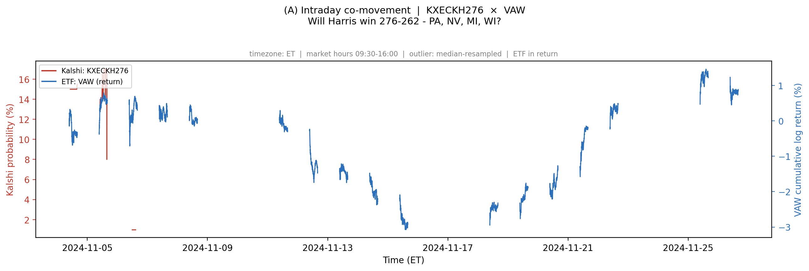
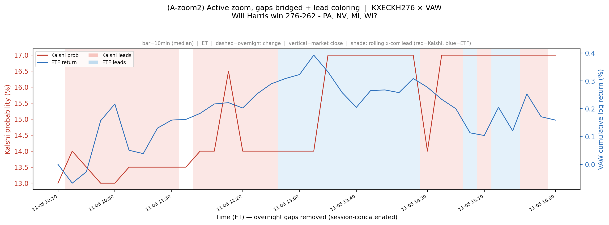
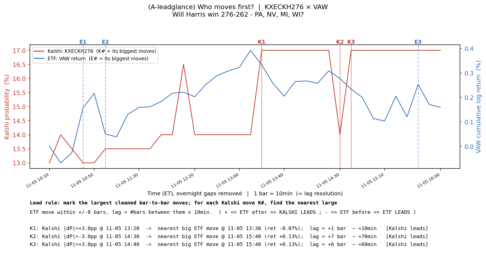
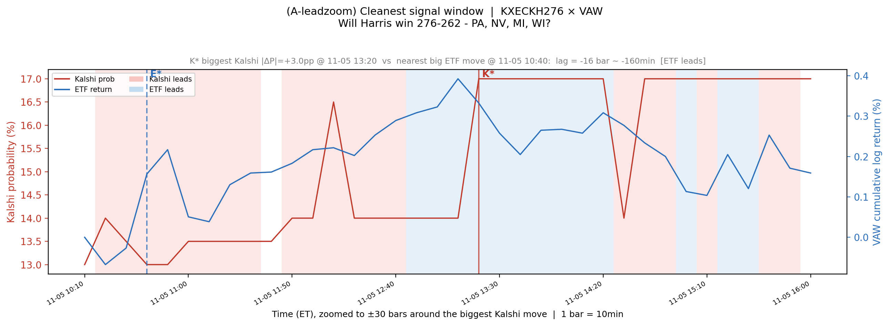
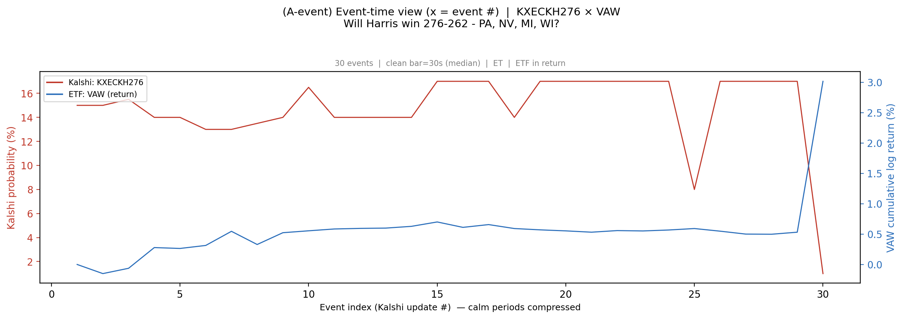
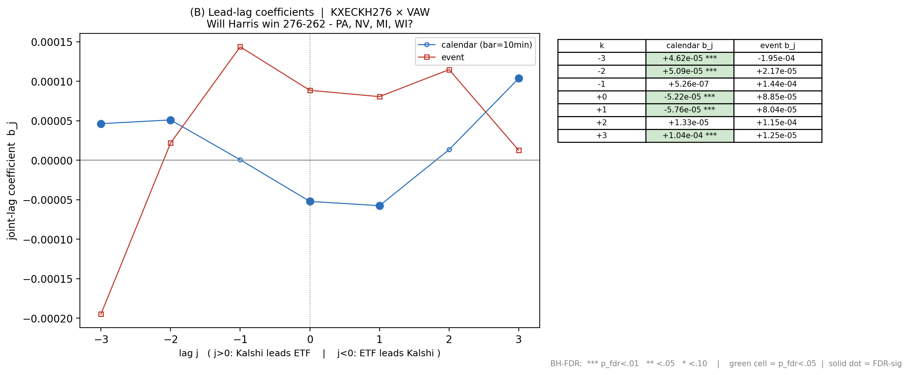

---

## Rank 27/48 — KXECKH287 × VNQ  (n_sig=2, best_p=7.0e-247, n_trades=39)

```text
PAIR ANALYSIS    —    Rank 27 / 48
================================================================================================
KXECKH287   x   VNQ
Contract : "Will Harris win 287-251 - PA, NV, MI, WI, AZ?"
Sector relevance : Election outcome (all sectors)
Window : 2024-11-04 to 2024-11-21     Kalshi trades : 39     primary bar : 10min     daily-screen R^2 : 0.68

>>> RELIABILITY:  Very-low-info   <<<   (see section 5; unreliable pairs still get figures, but read their problems in section 8)

DEFINITIONS
   xₜ₋ₖ = Kalshi yes-probability change, k bars before t   (1 bar = 10min)
   yₜ   = ETF log return over bar t
   calendar = full market-hours grid: x=0 in bars with no Kalshi trade (not dropped).
   k>0 => Kalshi leads ETF ;  k<0 => ETF leads Kalshi ;  k=0 => contemporaneous

1. CALENDAR-TIME REGRESSION (clock-time lags, full RTH grid)
   Full model:  yₜ = α + Σ(k=-3..3) βₖ·xₜ₋ₖ + Σ(d=1..4) γ_d·Day_d
      where  ADL ETF self-lags p=0 (BIC chose none -> no ETF self-lag term);  day-FE: 4 day dummies over 5 trading days (first day = baseline).
      controls counted (so you can see the total at a glance):  7 lead/lag x-terms + 0 ETF self-lag(s) + 4 day-FE dummies + 1 intercept = 12 RHS regressors  (model n_params=12).
   Significant terms (raw p<0.15) expanded:  yₜ = α + β₊₀·xₜ + β₊₃·xₜ₋₃
   where:
      β₊₀ = -5.683e-05   (t/z=-2.69, p=7.2e-03, p_fdr=2.5e-02) **   [contemporaneous]
      β₊₃ = -1.306e-04   (t/z=-33.62, p=1.0e-247, p_fdr=7.0e-247) ***   [Kalshi leads]
   Lean by count of significant lags: Kalshi-leads  (k>0:1, k<0:0).

2. EVENT-TIME REGRESSION (event-count lags)
   Full model:  yₜ = α + Σ(k) βₖ·xₜ₋ₖ + (ADL self-lags) + (day fixed effects)
   -> no regression result (insufficient data).

3. FULL COEFFICIENT TABLE  (calendar primary bar  vs  event)
      k |       calendar b (FDR) |          event b (FDR)
   ------------------------------------------------------
     -3 |          +5.67e-06     |                     --
     -2 |          +8.33e-06     |                     --
     -1 |          -8.19e-05     |                     --
     +0 |          -5.68e-05 **  |                     --
     +1 |          -6.57e-05     |                     --
     +2 |          -6.09e-05     |                     --
     +3 |          -1.31e-04 *** |                     --
   (stars = BH-FDR corrected:  *** p_fdr<.01  ** <.05  * <.10)

4. DIRECTIONAL TEST (probit, ETF up/down)
   Model: P(ETFₜ up) = Φ(α + βₖ·xₜ₋ₖ),  one probit per lag k
   calendar: n/a
   event: n/a
   -> no significant directional predictability either mode (raw p<0.15).

5. DATA RELIABILITY (statistical, not a trade-count cutoff)
   Tier: Very-low-info
   (criterion = n_active: bars with an actual Kalshi move (x!=0) = the real sample that identifies the lead-lag. Full RTH grid makes n_obs large, so n_active is the honest size.)
   calendar(full RTH grid): n_active=10  n_obs=91  n_days=5  K=3  params=12  df=79  median_SE=6.17e-05  sig(FDR)=2
   event: not estimable (insufficient data)
   => Very low info: even 'significant' coefficients are untrustworthy (huge SE, possibly spurious significance).

6. COARSE-FREQUENCY ROBUSTNESS (re-run calendar at 30min / 60min)
    30min: not estimable (n_obs=14 < minimum) -- coarser bars have even fewer observations
    60min: not estimable (n_obs=9 < minimum) -- coarser bars have even fewer observations

7. VERDICT
   Only one time-axis significant (Kalshi-leads) -- weak / single-mode evidence.
   (Note: this pair lacks the data to support reliable inference; the verdict above is descriptive only -- do not put it in the conclusions.)

8. FIGURE CAVEATS — figures are still drawn, but know their problems
   - Very low info (only 10 bars with an actual Kalshi move, < 15): even 'significant' coefficients are untrustworthy (huge SE, possibly spurious significance).
   - Most of the chart is flat no-trade lines; only a handful of bars carry real variation, so the lead calls in leadglance/segments are not robust.
   - Kalshi updates only on trades (flat line = no trade, NOT 'no change'); ETF mid refreshes continuously.

9. REAL-WORLD CONTEXT (WebSearch-verified; see URLs)
   - 2024 US presidential election held Tue Nov 5, 2024; ballots counted overnight Nov 5-6.
   - AP called the race for Trump ~5:34-5:37 AM ET on Wed Nov 6, 2024 (Wisconsin pushed him past 270) -- this is PRE-MARKET, so the regular-hours equity reaction shows up at the Nov 6 open.
   - Final electoral result: Trump 312, Harris 226.
   - Sources: en.wikipedia.org/wiki/2024_United_States_presidential_election ; spectrumlocalnews.com/us/snplus/news/2024/11/06/trump-wins-ap-projection-2024-election

------------------------------------------------------------------------------------------------
Conventions: ET | 09:30-16:00 (forward windows capped to 16:00) | ETF in log return | median causal bars | full RTH grid | day-grouped lags (no overnight) | ADL self-control | significance = BH-FDR corrected.
Figures for this pair follow on the next page.
```

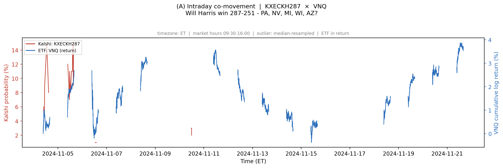
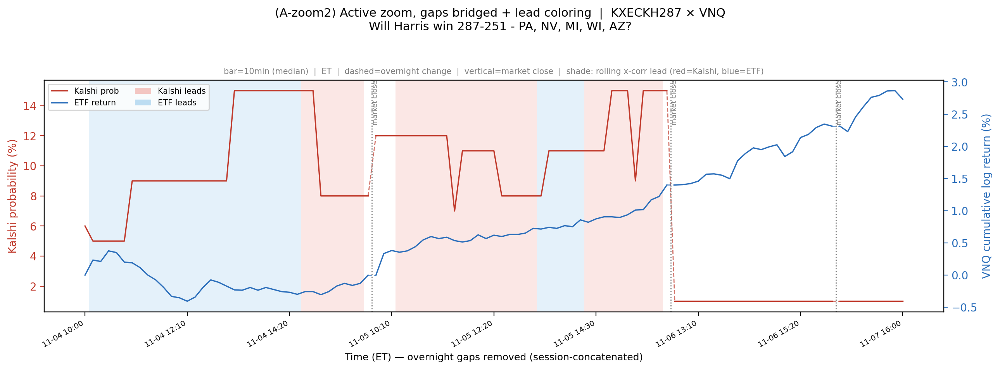
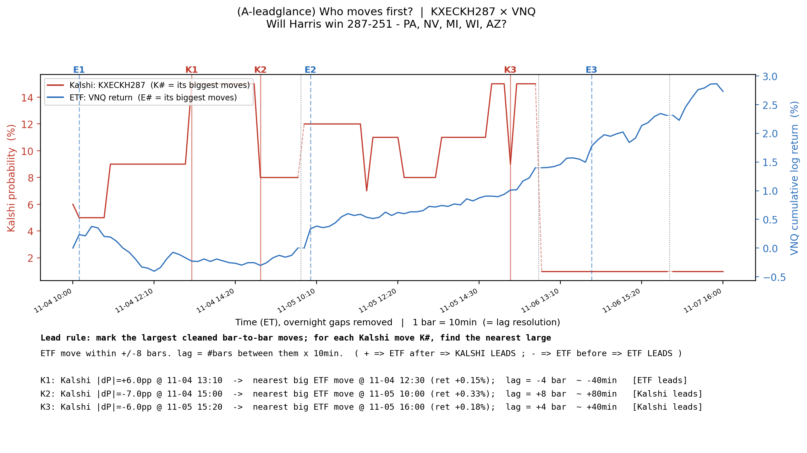
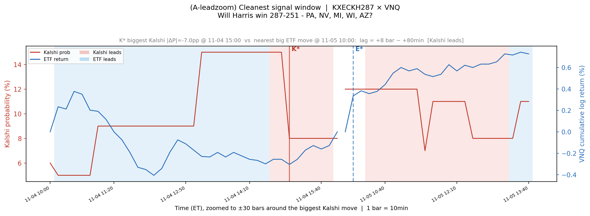
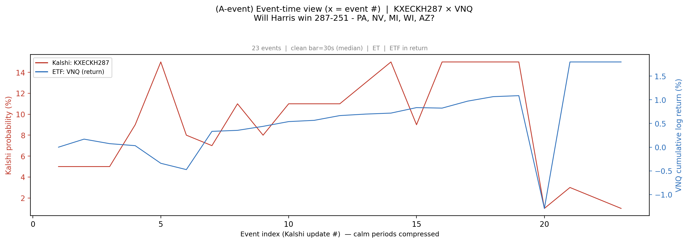
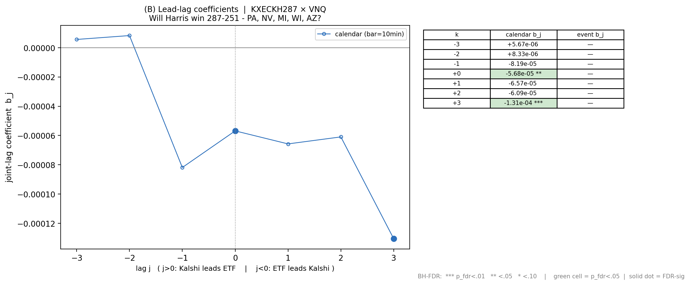

---

## Rank 28/48 — KX538APPROVEMIN-24NOV30-T37 × VFH  (n_sig=0, best_p=n/a, n_trades=65)  (no regression result)

```text
PAIR ANALYSIS    —    Rank 28 / 48
================================================================================================
KX538APPROVEMIN-24NOV30-T37   x   VFH
Contract : "Will the President's approval rating ever get below 37% by Nov 30, 2024?"
Sector relevance : Election outcome (all sectors)
Window : 2024-11-04 to 2024-11-29     Kalshi trades : 65     primary bar : n/a     daily-screen R^2 : 0.40

>>> RELIABILITY:  Cannot-estimate   <<<   (see section 5; unreliable pairs still get figures, but read their problems in section 8)

DEFINITIONS
   xₜ₋ₖ = Kalshi yes-probability change, k bars before t   (1 bar = n/a)
   yₜ   = ETF log return over bar t
   calendar = full market-hours grid: x=0 in bars with no Kalshi trade (not dropped).
   k>0 => Kalshi leads ETF ;  k<0 => ETF leads Kalshi ;  k=0 => contemporaneous

1. CALENDAR-TIME REGRESSION (clock-time lags, full RTH grid)
   Full model:  yₜ = α + Σ(k) βₖ·xₜ₋ₖ + (ADL self-lags) + (day fixed effects)
   -> no regression result (insufficient data).

2. EVENT-TIME REGRESSION (event-count lags)
   Full model:  yₜ = α + Σ(k) βₖ·xₜ₋ₖ + (ADL self-lags) + (day fixed effects)
   -> no regression result (insufficient data).

3. FULL COEFFICIENT TABLE  (calendar primary bar  vs  event)
   (no coefficients in either mode)

4. DIRECTIONAL TEST (probit, ETF up/down)
   Model: P(ETFₜ up) = Φ(α + βₖ·xₜ₋ₖ),  one probit per lag k
   calendar: n/a
   event: n/a
   -> no significant directional predictability either mode (raw p<0.15).

5. DATA RELIABILITY (statistical, not a trade-count cutoff)
   Tier: Cannot-estimate
   (criterion = n_active: bars with an actual Kalshi move (x!=0) = the real sample that identifies the lead-lag. Full RTH grid makes n_obs large, so n_active is the honest size.)
   calendar(full RTH grid): not estimable (insufficient data)
   event: not estimable (insufficient data)
   => Neither axis is estimable: this pair has descriptive figures only, no reliable regression result.

6. COARSE-FREQUENCY ROBUSTNESS (re-run calendar at 30min / 60min)
    30min: not estimable (n_obs=11 < minimum) -- coarser bars have even fewer observations
    60min: not estimable (n_obs=9 < minimum) -- coarser bars have even fewer observations

7. VERDICT
   No lead-lag detected -- too sparse / no significant structure.
   (Note: this pair lacks the data to support reliable inference; the verdict above is descriptive only -- do not put it in the conclusions.)

8. FIGURE CAVEATS — figures are still drawn, but know their problems
   - Regression cannot be estimated: the lag-coefficient plot (B) shows 'no regression result'; only the time-series / zoom plots are descriptive.
   - Long flat Kalshi segments = NO TRADE in that span (not 'probability unchanged'); do not read lead direction from them.
   - Too few active bars: the red/blue lead shading in zoom2/segments and the K#/E# pairing in leadglance are illustrative only, with no statistical meaning.
   - Kalshi updates only on trades (flat line = no trade, NOT 'no change'); ETF mid refreshes continuously.

------------------------------------------------------------------------------------------------
Conventions: ET | 09:30-16:00 (forward windows capped to 16:00) | ETF in log return | median causal bars | full RTH grid | day-grouped lags (no overnight) | ADL self-control | significance = BH-FDR corrected.
Figures for this pair follow on the next page.
```

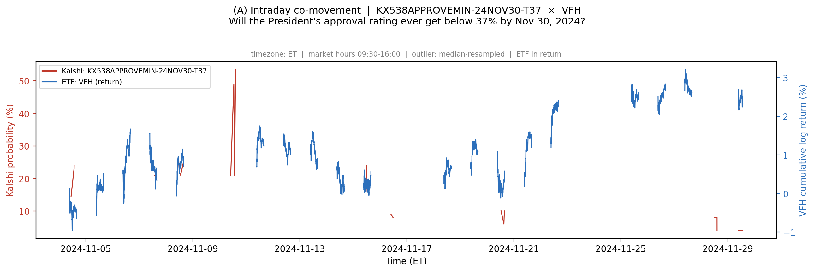
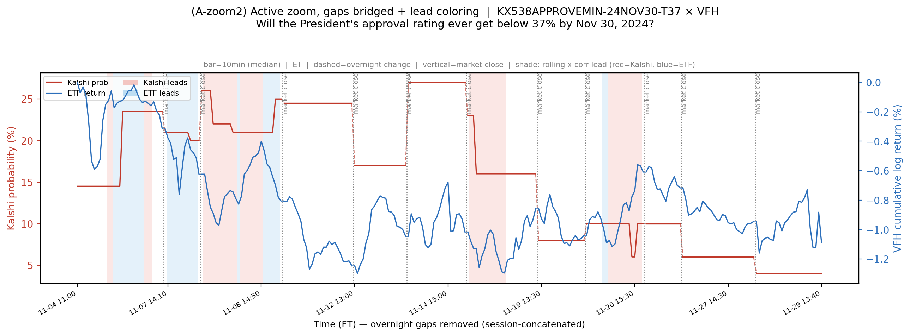
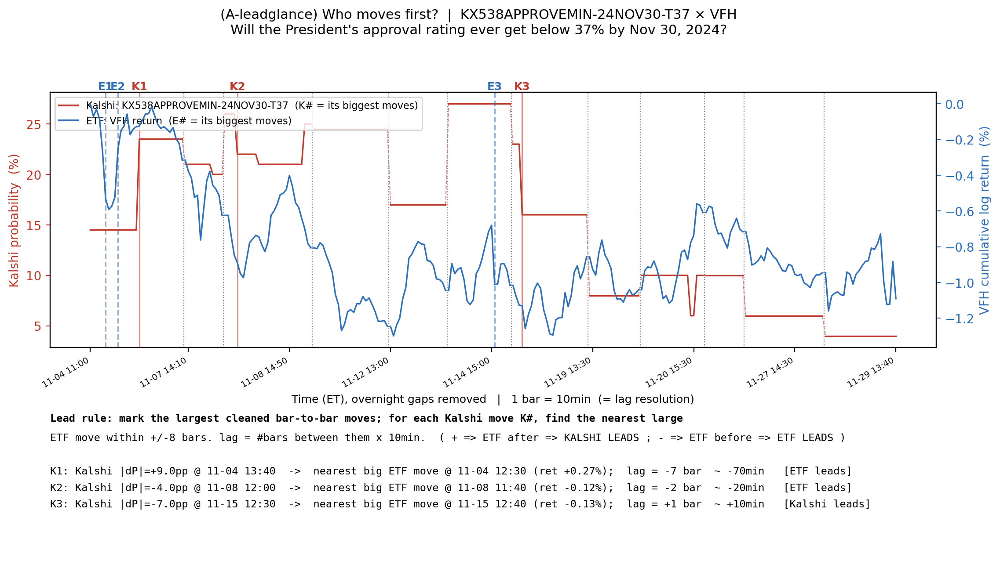
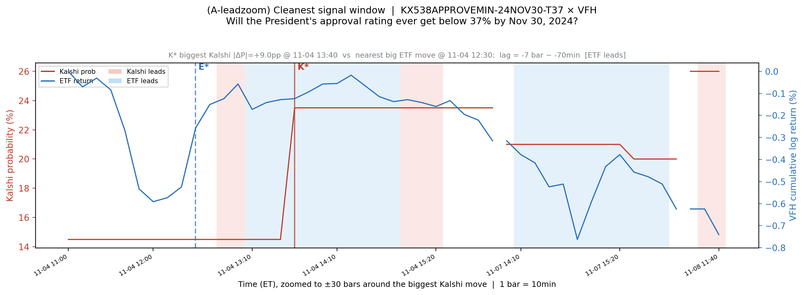
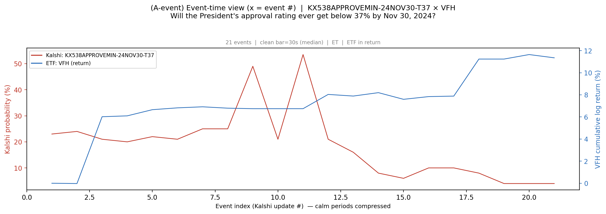


---

## Rank 29/48 — KX538APPROVEMIN-24NOV30-T37 × VNQ  (n_sig=0, best_p=n/a, n_trades=65)  (no regression result)

```text
PAIR ANALYSIS    —    Rank 29 / 48
================================================================================================
KX538APPROVEMIN-24NOV30-T37   x   VNQ
Contract : "Will the President's approval rating ever get below 37% by Nov 30, 2024?"
Sector relevance : Election outcome (all sectors)
Window : 2024-11-04 to 2024-11-29     Kalshi trades : 65     primary bar : n/a     daily-screen R^2 : 0.32

>>> RELIABILITY:  Cannot-estimate   <<<   (see section 5; unreliable pairs still get figures, but read their problems in section 8)

DEFINITIONS
   xₜ₋ₖ = Kalshi yes-probability change, k bars before t   (1 bar = n/a)
   yₜ   = ETF log return over bar t
   calendar = full market-hours grid: x=0 in bars with no Kalshi trade (not dropped).
   k>0 => Kalshi leads ETF ;  k<0 => ETF leads Kalshi ;  k=0 => contemporaneous

1. CALENDAR-TIME REGRESSION (clock-time lags, full RTH grid)
   Full model:  yₜ = α + Σ(k) βₖ·xₜ₋ₖ + (ADL self-lags) + (day fixed effects)
   -> no regression result (insufficient data).

2. EVENT-TIME REGRESSION (event-count lags)
   Full model:  yₜ = α + Σ(k) βₖ·xₜ₋ₖ + (ADL self-lags) + (day fixed effects)
   -> no regression result (insufficient data).

3. FULL COEFFICIENT TABLE  (calendar primary bar  vs  event)
   (no coefficients in either mode)

4. DIRECTIONAL TEST (probit, ETF up/down)
   Model: P(ETFₜ up) = Φ(α + βₖ·xₜ₋ₖ),  one probit per lag k
   calendar: n/a
   event: n/a
   -> no significant directional predictability either mode (raw p<0.15).

5. DATA RELIABILITY (statistical, not a trade-count cutoff)
   Tier: Cannot-estimate
   (criterion = n_active: bars with an actual Kalshi move (x!=0) = the real sample that identifies the lead-lag. Full RTH grid makes n_obs large, so n_active is the honest size.)
   calendar(full RTH grid): not estimable (insufficient data)
   event: not estimable (insufficient data)
   => Neither axis is estimable: this pair has descriptive figures only, no reliable regression result.

6. COARSE-FREQUENCY ROBUSTNESS (re-run calendar at 30min / 60min)
    30min: not estimable (n_obs=11 < minimum) -- coarser bars have even fewer observations
    60min: not estimable (n_obs=9 < minimum) -- coarser bars have even fewer observations

7. VERDICT
   No lead-lag detected -- too sparse / no significant structure.
   (Note: this pair lacks the data to support reliable inference; the verdict above is descriptive only -- do not put it in the conclusions.)

8. FIGURE CAVEATS — figures are still drawn, but know their problems
   - Regression cannot be estimated: the lag-coefficient plot (B) shows 'no regression result'; only the time-series / zoom plots are descriptive.
   - Long flat Kalshi segments = NO TRADE in that span (not 'probability unchanged'); do not read lead direction from them.
   - Too few active bars: the red/blue lead shading in zoom2/segments and the K#/E# pairing in leadglance are illustrative only, with no statistical meaning.
   - Kalshi updates only on trades (flat line = no trade, NOT 'no change'); ETF mid refreshes continuously.

------------------------------------------------------------------------------------------------
Conventions: ET | 09:30-16:00 (forward windows capped to 16:00) | ETF in log return | median causal bars | full RTH grid | day-grouped lags (no overnight) | ADL self-control | significance = BH-FDR corrected.
Figures for this pair follow on the next page.
```

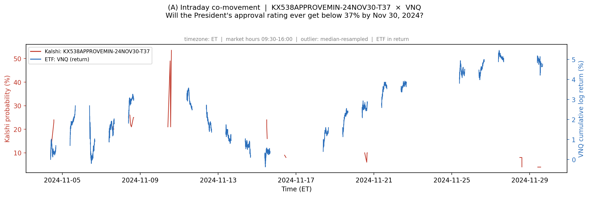
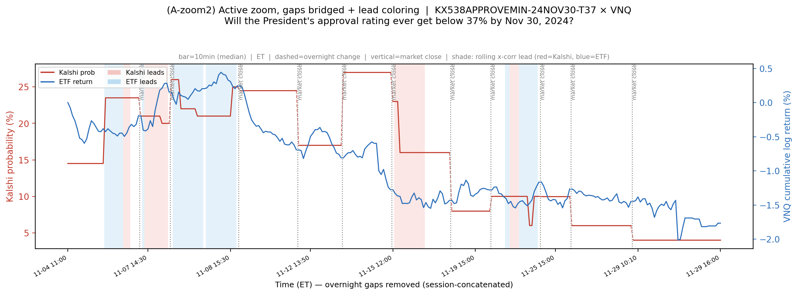
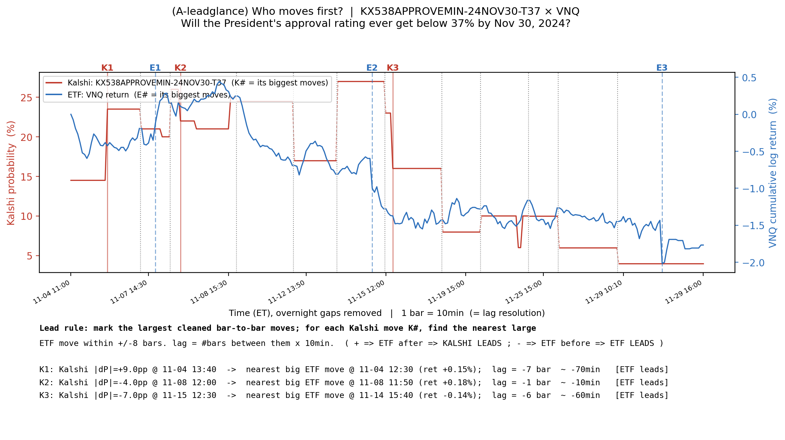
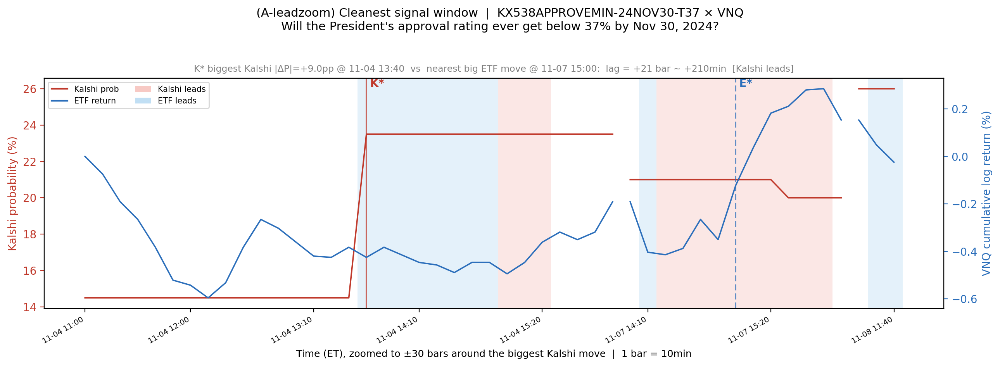
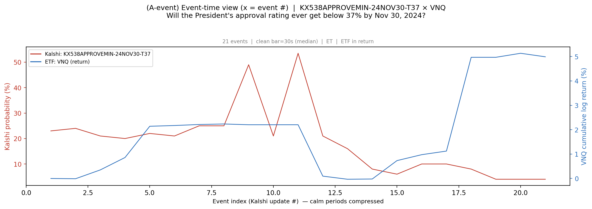
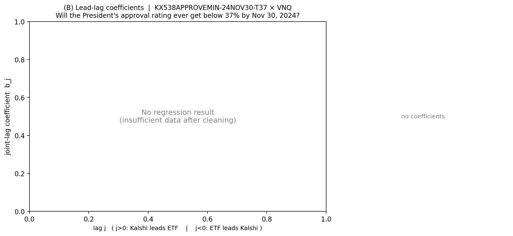

---

## Rank 30/48 — RATECUT-24SEP18 × VCR  (n_sig=0, best_p=n/a, n_trades=53)  (no regression result)

```text
PAIR ANALYSIS    —    Rank 30 / 48
================================================================================================
RATECUT-24SEP18   x   VCR
Contract : "Will the Federal Reserve cut rates before September 19, 2024?"
Sector relevance : VFH_VNQ_VPU (Rate-sensitive: Financials / Real Estate / Utilities)
Window : 2024-09-04 to 2024-09-18     Kalshi trades : 53     primary bar : n/a     daily-screen R^2 : 0.68

>>> RELIABILITY:  Cannot-estimate   <<<   (see section 5; unreliable pairs still get figures, but read their problems in section 8)

DEFINITIONS
   xₜ₋ₖ = Kalshi yes-probability change, k bars before t   (1 bar = n/a)
   yₜ   = ETF log return over bar t
   calendar = full market-hours grid: x=0 in bars with no Kalshi trade (not dropped).
   k>0 => Kalshi leads ETF ;  k<0 => ETF leads Kalshi ;  k=0 => contemporaneous

1. CALENDAR-TIME REGRESSION (clock-time lags, full RTH grid)
   Full model:  yₜ = α + Σ(k) βₖ·xₜ₋ₖ + (ADL self-lags) + (day fixed effects)
   -> no regression result (insufficient data).

2. EVENT-TIME REGRESSION (event-count lags)
   Full model:  yₜ = α + Σ(k) βₖ·xₜ₋ₖ + (ADL self-lags) + (day fixed effects)
   -> no regression result (insufficient data).

3. FULL COEFFICIENT TABLE  (calendar primary bar  vs  event)
   (no coefficients in either mode)

4. DIRECTIONAL TEST (probit, ETF up/down)
   Model: P(ETFₜ up) = Φ(α + βₖ·xₜ₋ₖ),  one probit per lag k
   calendar: n/a
   event: n/a
   -> no significant directional predictability either mode (raw p<0.15).

5. DATA RELIABILITY (statistical, not a trade-count cutoff)
   Tier: Cannot-estimate
   (criterion = n_active: bars with an actual Kalshi move (x!=0) = the real sample that identifies the lead-lag. Full RTH grid makes n_obs large, so n_active is the honest size.)
   calendar(full RTH grid): not estimable (insufficient data)
   event: not estimable (insufficient data)
   => Neither axis is estimable: this pair has descriptive figures only, no reliable regression result.

6. COARSE-FREQUENCY ROBUSTNESS (re-run calendar at 30min / 60min)
    30min: not estimable (n_obs=18 < minimum) -- coarser bars have even fewer observations
    60min: not estimable (n_obs=16 < minimum) -- coarser bars have even fewer observations

7. VERDICT
   No lead-lag detected -- too sparse / no significant structure.
   (Note: this pair lacks the data to support reliable inference; the verdict above is descriptive only -- do not put it in the conclusions.)

8. FIGURE CAVEATS — figures are still drawn, but know their problems
   - Regression cannot be estimated: the lag-coefficient plot (B) shows 'no regression result'; only the time-series / zoom plots are descriptive.
   - Long flat Kalshi segments = NO TRADE in that span (not 'probability unchanged'); do not read lead direction from them.
   - Too few active bars: the red/blue lead shading in zoom2/segments and the K#/E# pairing in leadglance are illustrative only, with no statistical meaning.
   - Kalshi updates only on trades (flat line = no trade, NOT 'no change'); ETF mid refreshes continuously.

------------------------------------------------------------------------------------------------
Conventions: ET | 09:30-16:00 (forward windows capped to 16:00) | ETF in log return | median causal bars | full RTH grid | day-grouped lags (no overnight) | ADL self-control | significance = BH-FDR corrected.
Figures for this pair follow on the next page.
```

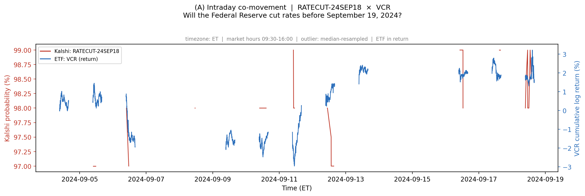
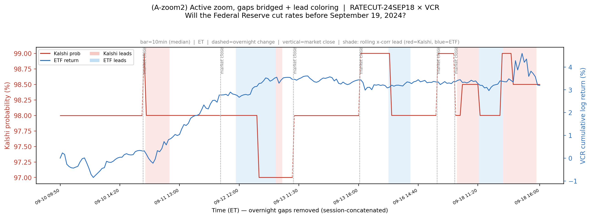
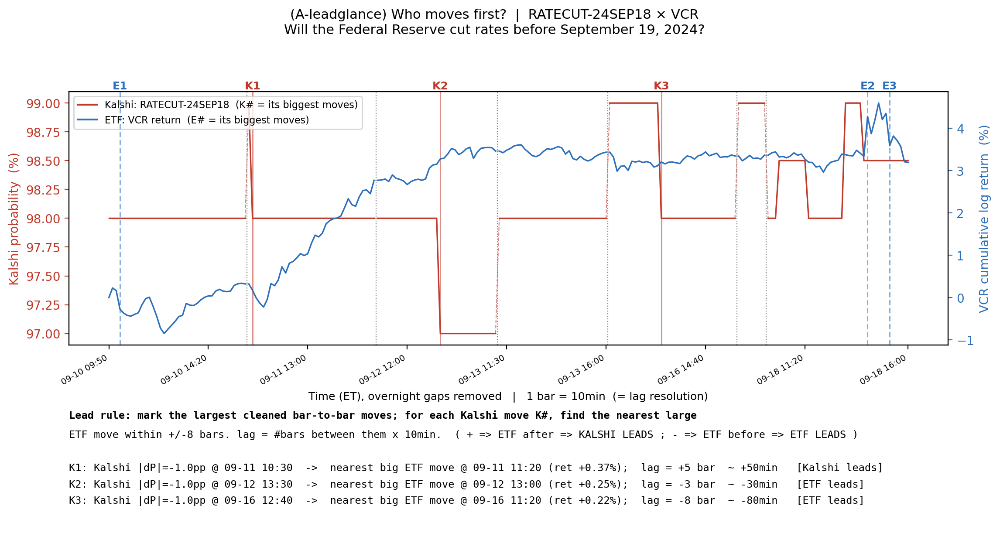
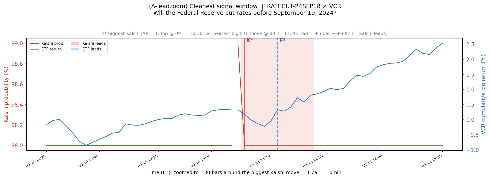
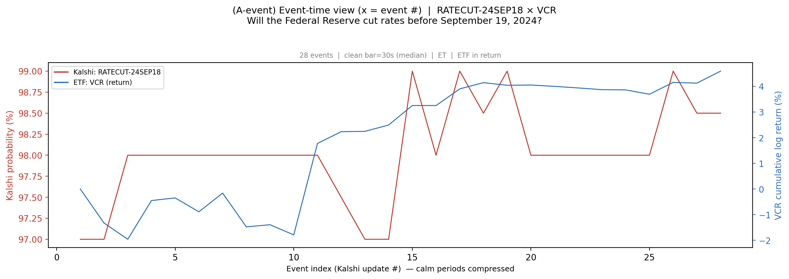
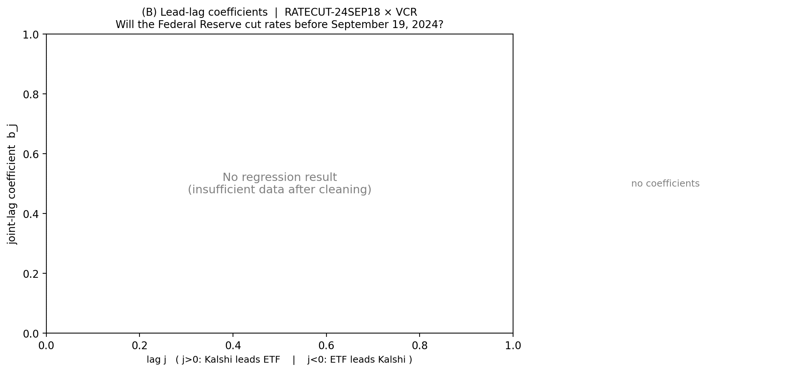

---

## Rank 31/48 — RATECUT-24SEP18 × VOX  (n_sig=0, best_p=n/a, n_trades=53)  (no regression result)

```text
PAIR ANALYSIS    —    Rank 31 / 48
================================================================================================
RATECUT-24SEP18   x   VOX
Contract : "Will the Federal Reserve cut rates before September 19, 2024?"
Sector relevance : VFH_VNQ_VPU (Rate-sensitive: Financials / Real Estate / Utilities)
Window : 2024-09-04 to 2024-09-18     Kalshi trades : 53     primary bar : n/a     daily-screen R^2 : 0.46

>>> RELIABILITY:  Cannot-estimate   <<<   (see section 5; unreliable pairs still get figures, but read their problems in section 8)

DEFINITIONS
   xₜ₋ₖ = Kalshi yes-probability change, k bars before t   (1 bar = n/a)
   yₜ   = ETF log return over bar t
   calendar = full market-hours grid: x=0 in bars with no Kalshi trade (not dropped).
   k>0 => Kalshi leads ETF ;  k<0 => ETF leads Kalshi ;  k=0 => contemporaneous

1. CALENDAR-TIME REGRESSION (clock-time lags, full RTH grid)
   Full model:  yₜ = α + Σ(k) βₖ·xₜ₋ₖ + (ADL self-lags) + (day fixed effects)
   -> no regression result (insufficient data).

2. EVENT-TIME REGRESSION (event-count lags)
   Full model:  yₜ = α + Σ(k) βₖ·xₜ₋ₖ + (ADL self-lags) + (day fixed effects)
   -> no regression result (insufficient data).

3. FULL COEFFICIENT TABLE  (calendar primary bar  vs  event)
   (no coefficients in either mode)

4. DIRECTIONAL TEST (probit, ETF up/down)
   Model: P(ETFₜ up) = Φ(α + βₖ·xₜ₋ₖ),  one probit per lag k
   calendar: n/a
   event: n/a
   -> no significant directional predictability either mode (raw p<0.15).

5. DATA RELIABILITY (statistical, not a trade-count cutoff)
   Tier: Cannot-estimate
   (criterion = n_active: bars with an actual Kalshi move (x!=0) = the real sample that identifies the lead-lag. Full RTH grid makes n_obs large, so n_active is the honest size.)
   calendar(full RTH grid): not estimable (insufficient data)
   event: not estimable (insufficient data)
   => Neither axis is estimable: this pair has descriptive figures only, no reliable regression result.

6. COARSE-FREQUENCY ROBUSTNESS (re-run calendar at 30min / 60min)
    30min: not estimable (n_obs=18 < minimum) -- coarser bars have even fewer observations
    60min: not estimable (n_obs=16 < minimum) -- coarser bars have even fewer observations

7. VERDICT
   No lead-lag detected -- too sparse / no significant structure.
   (Note: this pair lacks the data to support reliable inference; the verdict above is descriptive only -- do not put it in the conclusions.)

8. FIGURE CAVEATS — figures are still drawn, but know their problems
   - Regression cannot be estimated: the lag-coefficient plot (B) shows 'no regression result'; only the time-series / zoom plots are descriptive.
   - Long flat Kalshi segments = NO TRADE in that span (not 'probability unchanged'); do not read lead direction from them.
   - Too few active bars: the red/blue lead shading in zoom2/segments and the K#/E# pairing in leadglance are illustrative only, with no statistical meaning.
   - Kalshi updates only on trades (flat line = no trade, NOT 'no change'); ETF mid refreshes continuously.

------------------------------------------------------------------------------------------------
Conventions: ET | 09:30-16:00 (forward windows capped to 16:00) | ETF in log return | median causal bars | full RTH grid | day-grouped lags (no overnight) | ADL self-control | significance = BH-FDR corrected.
Figures for this pair follow on the next page.
```

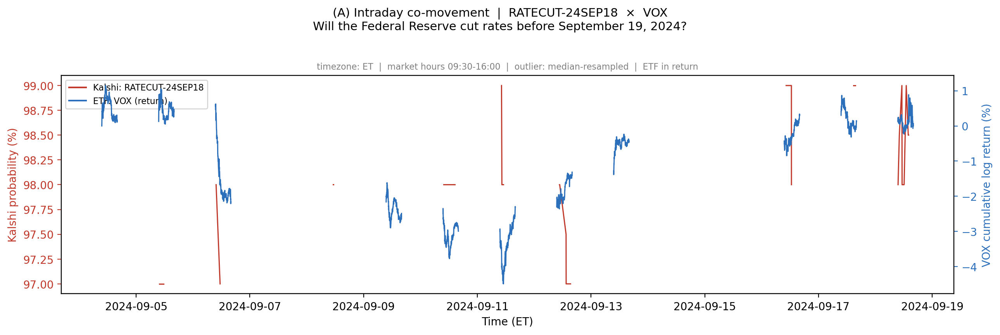
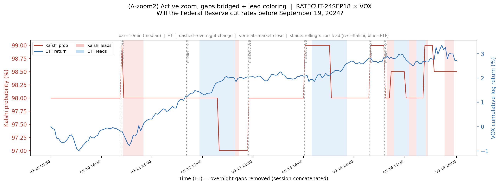
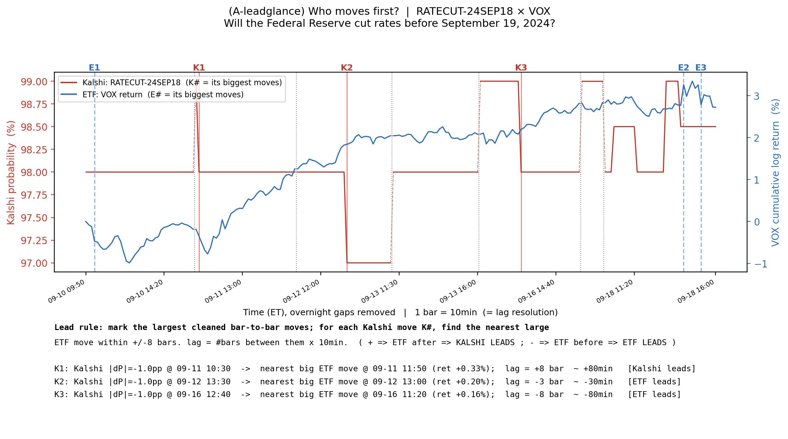
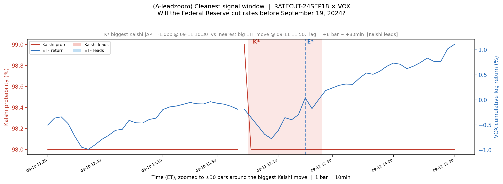
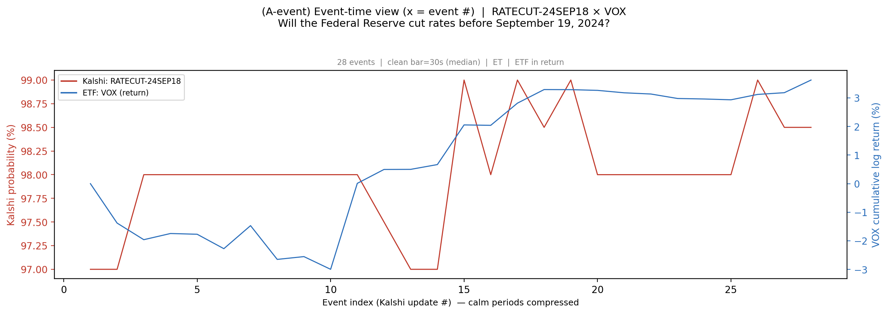


---

## Rank 32/48 — RATECUT-24SEP18 × VGT  (n_sig=0, best_p=n/a, n_trades=53)  (no regression result)

```text
PAIR ANALYSIS    —    Rank 32 / 48
================================================================================================
RATECUT-24SEP18   x   VGT
Contract : "Will the Federal Reserve cut rates before September 19, 2024?"
Sector relevance : VFH_VNQ_VPU (Rate-sensitive: Financials / Real Estate / Utilities)
Window : 2024-09-04 to 2024-09-18     Kalshi trades : 53     primary bar : n/a     daily-screen R^2 : 0.42

>>> RELIABILITY:  Cannot-estimate   <<<   (see section 5; unreliable pairs still get figures, but read their problems in section 8)

DEFINITIONS
   xₜ₋ₖ = Kalshi yes-probability change, k bars before t   (1 bar = n/a)
   yₜ   = ETF log return over bar t
   calendar = full market-hours grid: x=0 in bars with no Kalshi trade (not dropped).
   k>0 => Kalshi leads ETF ;  k<0 => ETF leads Kalshi ;  k=0 => contemporaneous

1. CALENDAR-TIME REGRESSION (clock-time lags, full RTH grid)
   Full model:  yₜ = α + Σ(k) βₖ·xₜ₋ₖ + (ADL self-lags) + (day fixed effects)
   -> no regression result (insufficient data).

2. EVENT-TIME REGRESSION (event-count lags)
   Full model:  yₜ = α + Σ(k) βₖ·xₜ₋ₖ + (ADL self-lags) + (day fixed effects)
   -> no regression result (insufficient data).

3. FULL COEFFICIENT TABLE  (calendar primary bar  vs  event)
   (no coefficients in either mode)

4. DIRECTIONAL TEST (probit, ETF up/down)
   Model: P(ETFₜ up) = Φ(α + βₖ·xₜ₋ₖ),  one probit per lag k
   calendar: n/a
   event: n/a
   -> no significant directional predictability either mode (raw p<0.15).

5. DATA RELIABILITY (statistical, not a trade-count cutoff)
   Tier: Cannot-estimate
   (criterion = n_active: bars with an actual Kalshi move (x!=0) = the real sample that identifies the lead-lag. Full RTH grid makes n_obs large, so n_active is the honest size.)
   calendar(full RTH grid): not estimable (insufficient data)
   event: not estimable (insufficient data)
   => Neither axis is estimable: this pair has descriptive figures only, no reliable regression result.

6. COARSE-FREQUENCY ROBUSTNESS (re-run calendar at 30min / 60min)
    30min: not estimable (n_obs=18 < minimum) -- coarser bars have even fewer observations
    60min: not estimable (n_obs=16 < minimum) -- coarser bars have even fewer observations

7. VERDICT
   No lead-lag detected -- too sparse / no significant structure.
   (Note: this pair lacks the data to support reliable inference; the verdict above is descriptive only -- do not put it in the conclusions.)

8. FIGURE CAVEATS — figures are still drawn, but know their problems
   - Regression cannot be estimated: the lag-coefficient plot (B) shows 'no regression result'; only the time-series / zoom plots are descriptive.
   - Long flat Kalshi segments = NO TRADE in that span (not 'probability unchanged'); do not read lead direction from them.
   - Too few active bars: the red/blue lead shading in zoom2/segments and the K#/E# pairing in leadglance are illustrative only, with no statistical meaning.
   - Kalshi updates only on trades (flat line = no trade, NOT 'no change'); ETF mid refreshes continuously.

------------------------------------------------------------------------------------------------
Conventions: ET | 09:30-16:00 (forward windows capped to 16:00) | ETF in log return | median causal bars | full RTH grid | day-grouped lags (no overnight) | ADL self-control | significance = BH-FDR corrected.
Figures for this pair follow on the next page.
```

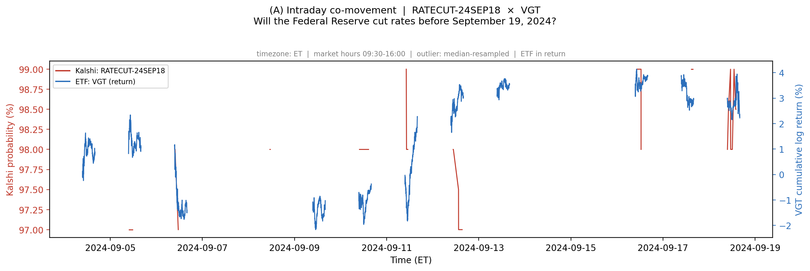
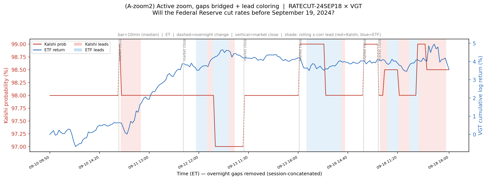
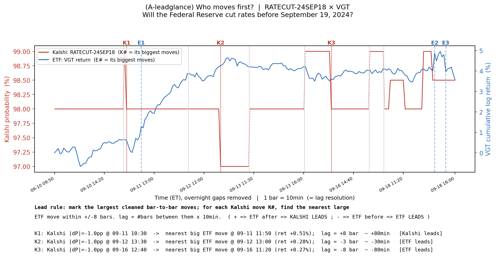
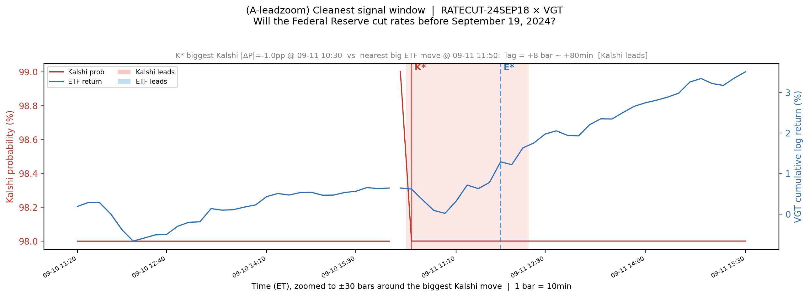
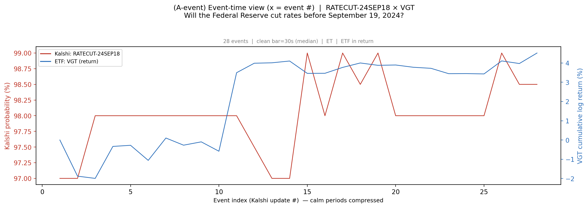


---

## Rank 33/48 — AAAGASM-24OCT31-US-3.20 × VHT  (n_sig=0, best_p=n/a, n_trades=44)  (no regression result)

```text
PAIR ANALYSIS    —    Rank 33 / 48
================================================================================================
AAAGASM-24OCT31-US-3.20   x   VHT
Contract : "Will average **gas prices** be above $3.20?"
Sector relevance : VDE (Energy)
Window : 2024-10-02 to 2024-10-30     Kalshi trades : 44     primary bar : n/a     daily-screen R^2 : 0.52

>>> RELIABILITY:  Cannot-estimate   <<<   (see section 5; unreliable pairs still get figures, but read their problems in section 8)

DEFINITIONS
   xₜ₋ₖ = Kalshi yes-probability change, k bars before t   (1 bar = n/a)
   yₜ   = ETF log return over bar t
   calendar = full market-hours grid: x=0 in bars with no Kalshi trade (not dropped).
   k>0 => Kalshi leads ETF ;  k<0 => ETF leads Kalshi ;  k=0 => contemporaneous

1. CALENDAR-TIME REGRESSION (clock-time lags, full RTH grid)
   Full model:  yₜ = α + Σ(k) βₖ·xₜ₋ₖ + (ADL self-lags) + (day fixed effects)
   -> no regression result (insufficient data).

2. EVENT-TIME REGRESSION (event-count lags)
   Full model:  yₜ = α + Σ(k) βₖ·xₜ₋ₖ + (ADL self-lags) + (day fixed effects)
   -> no regression result (insufficient data).

3. FULL COEFFICIENT TABLE  (calendar primary bar  vs  event)
   (no coefficients in either mode)

4. DIRECTIONAL TEST (probit, ETF up/down)
   Model: P(ETFₜ up) = Φ(α + βₖ·xₜ₋ₖ),  one probit per lag k
   calendar: n/a
   event: n/a
   -> no significant directional predictability either mode (raw p<0.15).

5. DATA RELIABILITY (statistical, not a trade-count cutoff)
   Tier: Cannot-estimate
   (criterion = n_active: bars with an actual Kalshi move (x!=0) = the real sample that identifies the lead-lag. Full RTH grid makes n_obs large, so n_active is the honest size.)
   calendar(full RTH grid): not estimable (insufficient data)
   event: not estimable (insufficient data)
   => Neither axis is estimable: this pair has descriptive figures only, no reliable regression result.

6. COARSE-FREQUENCY ROBUSTNESS (re-run calendar at 30min / 60min)
    30min: not estimable (n_obs=4 < minimum) -- coarser bars have even fewer observations
    60min: not estimable (n_obs=4 < minimum) -- coarser bars have even fewer observations

7. VERDICT
   No lead-lag detected -- too sparse / no significant structure.
   (Note: this pair lacks the data to support reliable inference; the verdict above is descriptive only -- do not put it in the conclusions.)

8. FIGURE CAVEATS — figures are still drawn, but know their problems
   - Regression cannot be estimated: the lag-coefficient plot (B) shows 'no regression result'; only the time-series / zoom plots are descriptive.
   - Long flat Kalshi segments = NO TRADE in that span (not 'probability unchanged'); do not read lead direction from them.
   - Too few active bars: the red/blue lead shading in zoom2/segments and the K#/E# pairing in leadglance are illustrative only, with no statistical meaning.
   - Kalshi updates only on trades (flat line = no trade, NOT 'no change'); ETF mid refreshes continuously.

------------------------------------------------------------------------------------------------
Conventions: ET | 09:30-16:00 (forward windows capped to 16:00) | ETF in log return | median causal bars | full RTH grid | day-grouped lags (no overnight) | ADL self-control | significance = BH-FDR corrected.
Figures for this pair follow on the next page.
```

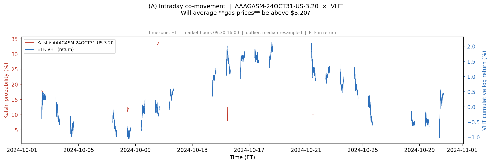
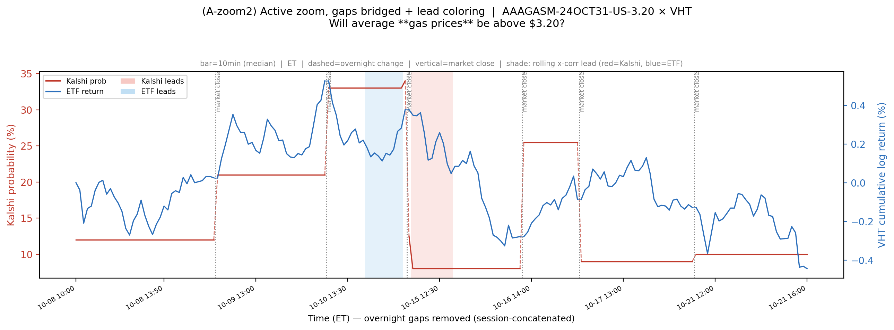
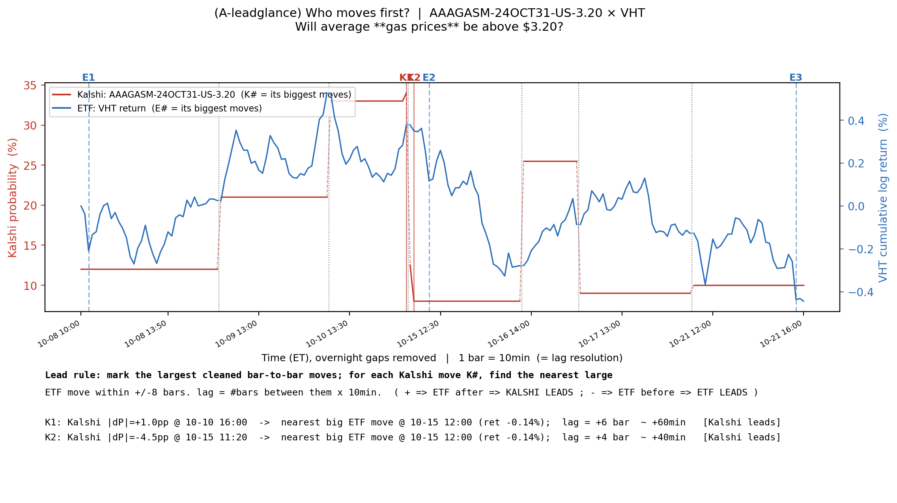
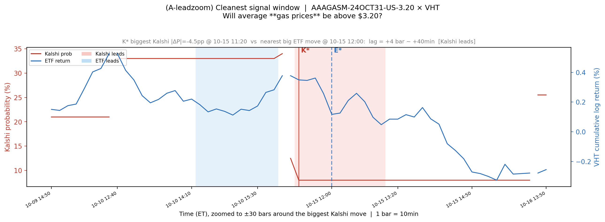
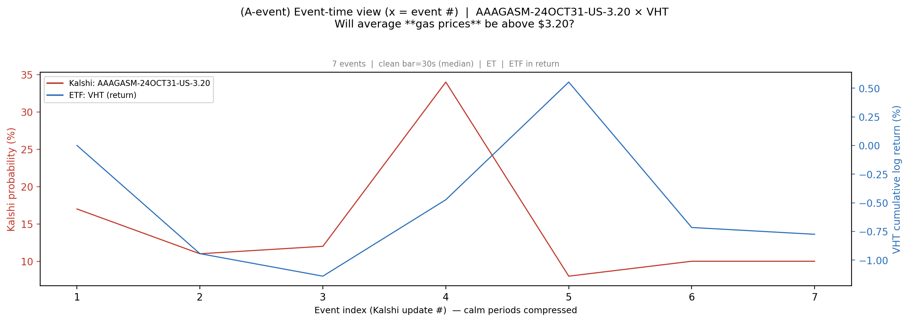
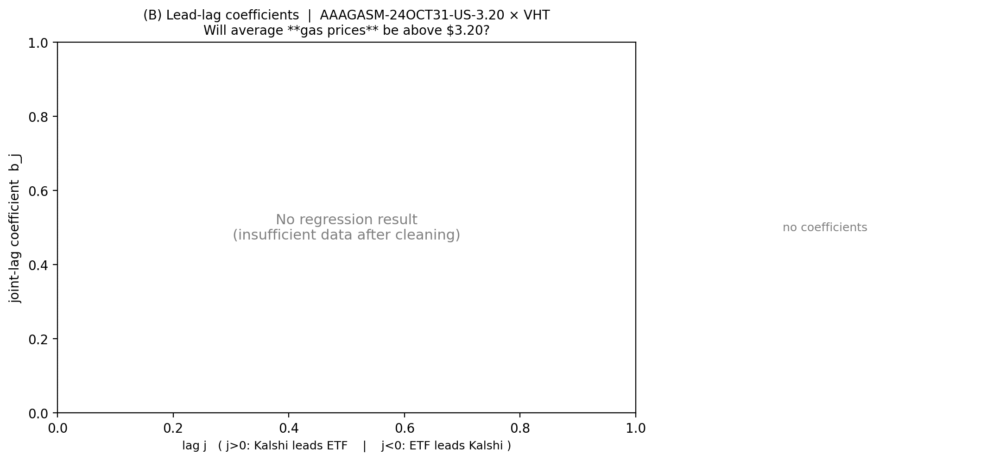

---

## Rank 34/48 — 538APPROVEMAX-24SEP30-T43 × VAW  (n_sig=0, best_p=n/a, n_trades=30)  (no regression result)

```text
PAIR ANALYSIS    —    Rank 34 / 48
================================================================================================
538APPROVEMAX-24SEP30-T43   x   VAW
Contract : "Will the President's approval rating ever get above 43% by Sep 30, 2024?"
Sector relevance : Election outcome (all sectors)
Window : 2024-09-04 to 2024-09-30     Kalshi trades : 30     primary bar : n/a     daily-screen R^2 : 0.44

>>> RELIABILITY:  Cannot-estimate   <<<   (see section 5; unreliable pairs still get figures, but read their problems in section 8)

DEFINITIONS
   xₜ₋ₖ = Kalshi yes-probability change, k bars before t   (1 bar = n/a)
   yₜ   = ETF log return over bar t
   calendar = full market-hours grid: x=0 in bars with no Kalshi trade (not dropped).
   k>0 => Kalshi leads ETF ;  k<0 => ETF leads Kalshi ;  k=0 => contemporaneous

1. CALENDAR-TIME REGRESSION (clock-time lags, full RTH grid)
   Full model:  yₜ = α + Σ(k) βₖ·xₜ₋ₖ + (ADL self-lags) + (day fixed effects)
   -> no regression result (insufficient data).

2. EVENT-TIME REGRESSION (event-count lags)
   Full model:  yₜ = α + Σ(k) βₖ·xₜ₋ₖ + (ADL self-lags) + (day fixed effects)
   -> no regression result (insufficient data).

3. FULL COEFFICIENT TABLE  (calendar primary bar  vs  event)
   (no coefficients in either mode)

4. DIRECTIONAL TEST (probit, ETF up/down)
   Model: P(ETFₜ up) = Φ(α + βₖ·xₜ₋ₖ),  one probit per lag k
   calendar: n/a
   event: n/a
   -> no significant directional predictability either mode (raw p<0.15).

5. DATA RELIABILITY (statistical, not a trade-count cutoff)
   Tier: Cannot-estimate
   (criterion = n_active: bars with an actual Kalshi move (x!=0) = the real sample that identifies the lead-lag. Full RTH grid makes n_obs large, so n_active is the honest size.)
   calendar(full RTH grid): not estimable (insufficient data)
   event: not estimable (insufficient data)
   => Neither axis is estimable: this pair has descriptive figures only, no reliable regression result.

6. COARSE-FREQUENCY ROBUSTNESS (re-run calendar at 30min / 60min)
    30min: not estimable (n_obs=4 < minimum) -- coarser bars have even fewer observations
    60min: not estimable (n_obs=4 < minimum) -- coarser bars have even fewer observations

7. VERDICT
   No lead-lag detected -- too sparse / no significant structure.
   (Note: this pair lacks the data to support reliable inference; the verdict above is descriptive only -- do not put it in the conclusions.)

8. FIGURE CAVEATS — figures are still drawn, but know their problems
   - Regression cannot be estimated: the lag-coefficient plot (B) shows 'no regression result'; only the time-series / zoom plots are descriptive.
   - Long flat Kalshi segments = NO TRADE in that span (not 'probability unchanged'); do not read lead direction from them.
   - Too few active bars: the red/blue lead shading in zoom2/segments and the K#/E# pairing in leadglance are illustrative only, with no statistical meaning.
   - Kalshi updates only on trades (flat line = no trade, NOT 'no change'); ETF mid refreshes continuously.

------------------------------------------------------------------------------------------------
Conventions: ET | 09:30-16:00 (forward windows capped to 16:00) | ETF in log return | median causal bars | full RTH grid | day-grouped lags (no overnight) | ADL self-control | significance = BH-FDR corrected.
Figures for this pair follow on the next page.
```

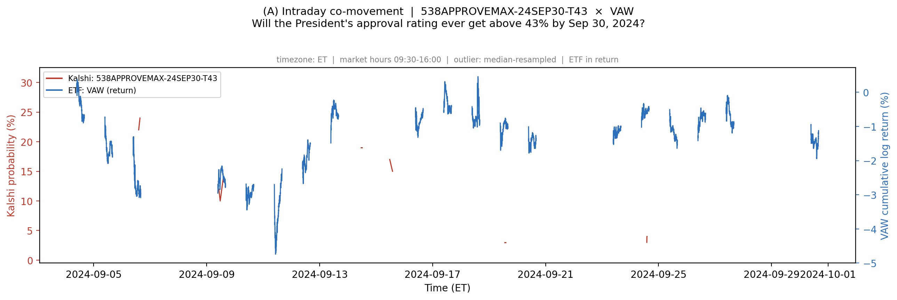
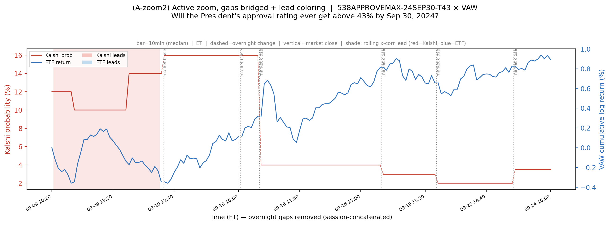
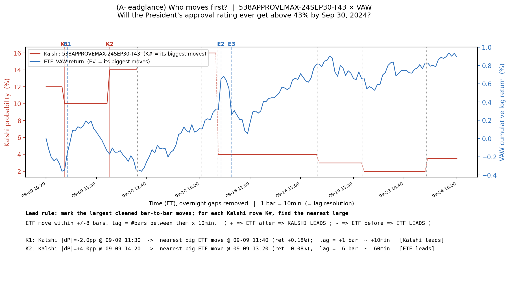
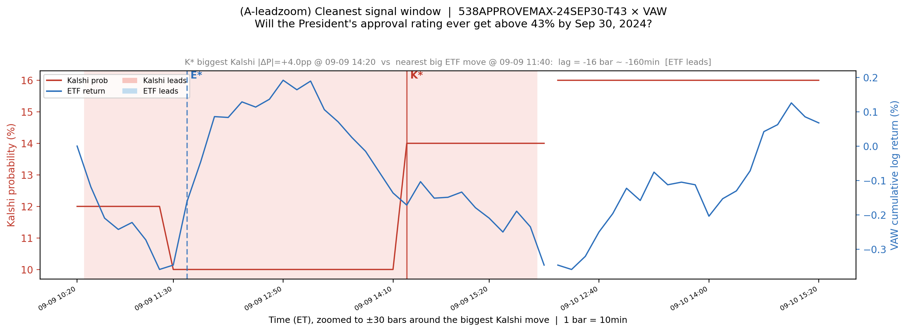
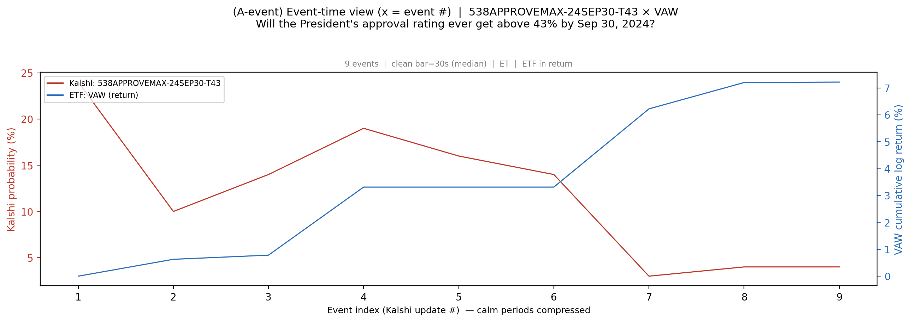


---

## Rank 35/48 — 538APPROVEMAX-24SEP30-T43 × VIS  (n_sig=0, best_p=n/a, n_trades=30)  (no regression result)

```text
PAIR ANALYSIS    —    Rank 35 / 48
================================================================================================
538APPROVEMAX-24SEP30-T43   x   VIS
Contract : "Will the President's approval rating ever get above 43% by Sep 30, 2024?"
Sector relevance : Election outcome (all sectors)
Window : 2024-09-04 to 2024-09-30     Kalshi trades : 30     primary bar : n/a     daily-screen R^2 : 0.38

>>> RELIABILITY:  Cannot-estimate   <<<   (see section 5; unreliable pairs still get figures, but read their problems in section 8)

DEFINITIONS
   xₜ₋ₖ = Kalshi yes-probability change, k bars before t   (1 bar = n/a)
   yₜ   = ETF log return over bar t
   calendar = full market-hours grid: x=0 in bars with no Kalshi trade (not dropped).
   k>0 => Kalshi leads ETF ;  k<0 => ETF leads Kalshi ;  k=0 => contemporaneous

1. CALENDAR-TIME REGRESSION (clock-time lags, full RTH grid)
   Full model:  yₜ = α + Σ(k) βₖ·xₜ₋ₖ + (ADL self-lags) + (day fixed effects)
   -> no regression result (insufficient data).

2. EVENT-TIME REGRESSION (event-count lags)
   Full model:  yₜ = α + Σ(k) βₖ·xₜ₋ₖ + (ADL self-lags) + (day fixed effects)
   -> no regression result (insufficient data).

3. FULL COEFFICIENT TABLE  (calendar primary bar  vs  event)
   (no coefficients in either mode)

4. DIRECTIONAL TEST (probit, ETF up/down)
   Model: P(ETFₜ up) = Φ(α + βₖ·xₜ₋ₖ),  one probit per lag k
   calendar: n/a
   event: n/a
   -> no significant directional predictability either mode (raw p<0.15).

5. DATA RELIABILITY (statistical, not a trade-count cutoff)
   Tier: Cannot-estimate
   (criterion = n_active: bars with an actual Kalshi move (x!=0) = the real sample that identifies the lead-lag. Full RTH grid makes n_obs large, so n_active is the honest size.)
   calendar(full RTH grid): not estimable (insufficient data)
   event: not estimable (insufficient data)
   => Neither axis is estimable: this pair has descriptive figures only, no reliable regression result.

6. COARSE-FREQUENCY ROBUSTNESS (re-run calendar at 30min / 60min)
    30min: not estimable (n_obs=4 < minimum) -- coarser bars have even fewer observations
    60min: not estimable (n_obs=4 < minimum) -- coarser bars have even fewer observations

7. VERDICT
   No lead-lag detected -- too sparse / no significant structure.
   (Note: this pair lacks the data to support reliable inference; the verdict above is descriptive only -- do not put it in the conclusions.)

8. FIGURE CAVEATS — figures are still drawn, but know their problems
   - Regression cannot be estimated: the lag-coefficient plot (B) shows 'no regression result'; only the time-series / zoom plots are descriptive.
   - Long flat Kalshi segments = NO TRADE in that span (not 'probability unchanged'); do not read lead direction from them.
   - Too few active bars: the red/blue lead shading in zoom2/segments and the K#/E# pairing in leadglance are illustrative only, with no statistical meaning.
   - Kalshi updates only on trades (flat line = no trade, NOT 'no change'); ETF mid refreshes continuously.

------------------------------------------------------------------------------------------------
Conventions: ET | 09:30-16:00 (forward windows capped to 16:00) | ETF in log return | median causal bars | full RTH grid | day-grouped lags (no overnight) | ADL self-control | significance = BH-FDR corrected.
Figures for this pair follow on the next page.
```

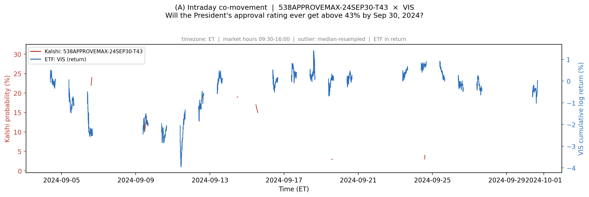
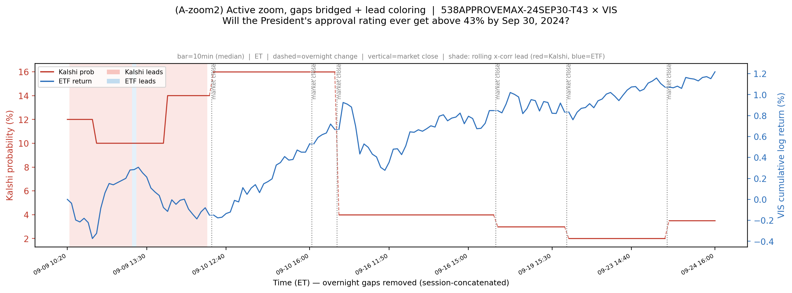
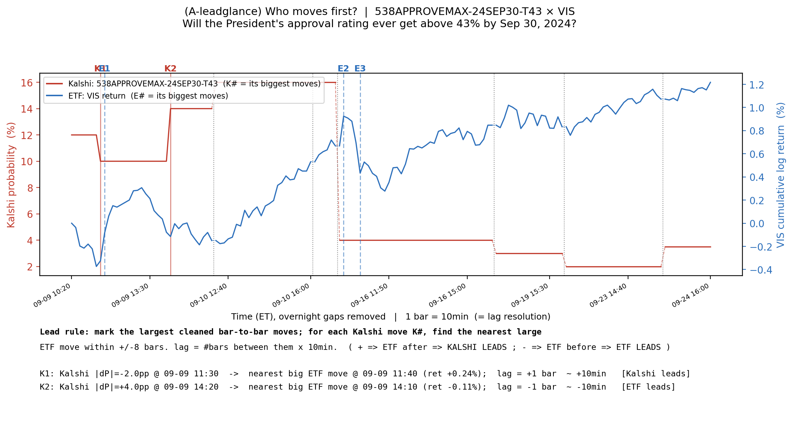
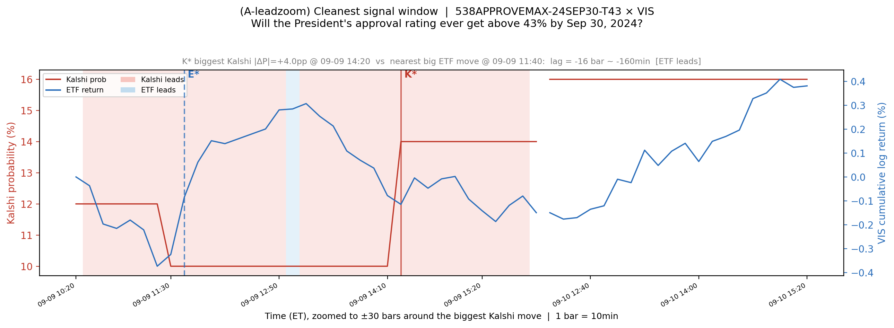
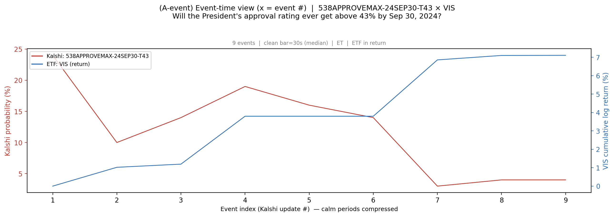


---

## Rank 36/48 — 538APPROVEMAX-24SEP30-T43 × VCR  (n_sig=0, best_p=n/a, n_trades=30)  (no regression result)

```text
PAIR ANALYSIS    —    Rank 36 / 48
================================================================================================
538APPROVEMAX-24SEP30-T43   x   VCR
Contract : "Will the President's approval rating ever get above 43% by Sep 30, 2024?"
Sector relevance : Election outcome (all sectors)
Window : 2024-09-04 to 2024-09-30     Kalshi trades : 30     primary bar : n/a     daily-screen R^2 : 0.27

>>> RELIABILITY:  Cannot-estimate   <<<   (see section 5; unreliable pairs still get figures, but read their problems in section 8)

DEFINITIONS
   xₜ₋ₖ = Kalshi yes-probability change, k bars before t   (1 bar = n/a)
   yₜ   = ETF log return over bar t
   calendar = full market-hours grid: x=0 in bars with no Kalshi trade (not dropped).
   k>0 => Kalshi leads ETF ;  k<0 => ETF leads Kalshi ;  k=0 => contemporaneous

1. CALENDAR-TIME REGRESSION (clock-time lags, full RTH grid)
   Full model:  yₜ = α + Σ(k) βₖ·xₜ₋ₖ + (ADL self-lags) + (day fixed effects)
   -> no regression result (insufficient data).

2. EVENT-TIME REGRESSION (event-count lags)
   Full model:  yₜ = α + Σ(k) βₖ·xₜ₋ₖ + (ADL self-lags) + (day fixed effects)
   -> no regression result (insufficient data).

3. FULL COEFFICIENT TABLE  (calendar primary bar  vs  event)
   (no coefficients in either mode)

4. DIRECTIONAL TEST (probit, ETF up/down)
   Model: P(ETFₜ up) = Φ(α + βₖ·xₜ₋ₖ),  one probit per lag k
   calendar: n/a
   event: n/a
   -> no significant directional predictability either mode (raw p<0.15).

5. DATA RELIABILITY (statistical, not a trade-count cutoff)
   Tier: Cannot-estimate
   (criterion = n_active: bars with an actual Kalshi move (x!=0) = the real sample that identifies the lead-lag. Full RTH grid makes n_obs large, so n_active is the honest size.)
   calendar(full RTH grid): not estimable (insufficient data)
   event: not estimable (insufficient data)
   => Neither axis is estimable: this pair has descriptive figures only, no reliable regression result.

6. COARSE-FREQUENCY ROBUSTNESS (re-run calendar at 30min / 60min)
    30min: not estimable (n_obs=4 < minimum) -- coarser bars have even fewer observations
    60min: not estimable (n_obs=4 < minimum) -- coarser bars have even fewer observations

7. VERDICT
   No lead-lag detected -- too sparse / no significant structure.
   (Note: this pair lacks the data to support reliable inference; the verdict above is descriptive only -- do not put it in the conclusions.)

8. FIGURE CAVEATS — figures are still drawn, but know their problems
   - Regression cannot be estimated: the lag-coefficient plot (B) shows 'no regression result'; only the time-series / zoom plots are descriptive.
   - Long flat Kalshi segments = NO TRADE in that span (not 'probability unchanged'); do not read lead direction from them.
   - Too few active bars: the red/blue lead shading in zoom2/segments and the K#/E# pairing in leadglance are illustrative only, with no statistical meaning.
   - Kalshi updates only on trades (flat line = no trade, NOT 'no change'); ETF mid refreshes continuously.

------------------------------------------------------------------------------------------------
Conventions: ET | 09:30-16:00 (forward windows capped to 16:00) | ETF in log return | median causal bars | full RTH grid | day-grouped lags (no overnight) | ADL self-control | significance = BH-FDR corrected.
Figures for this pair follow on the next page.
```

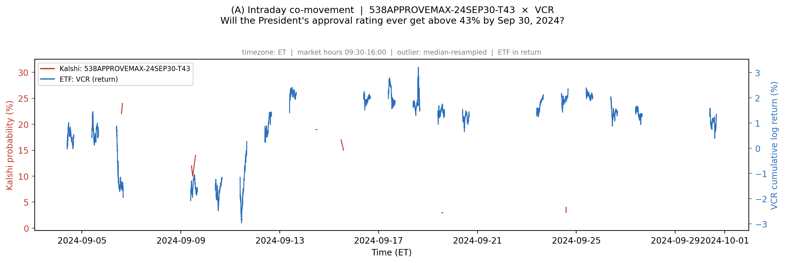
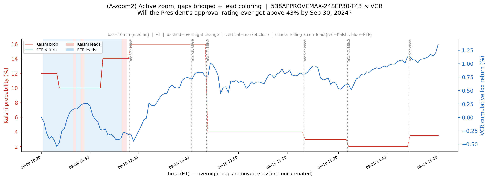
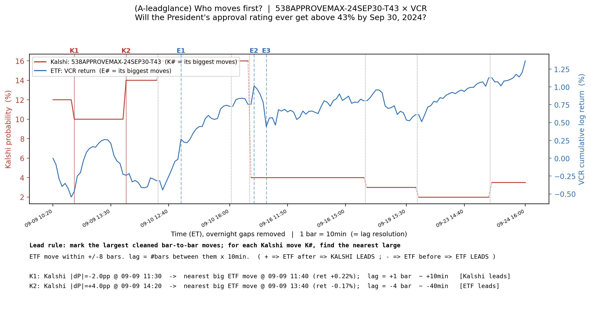
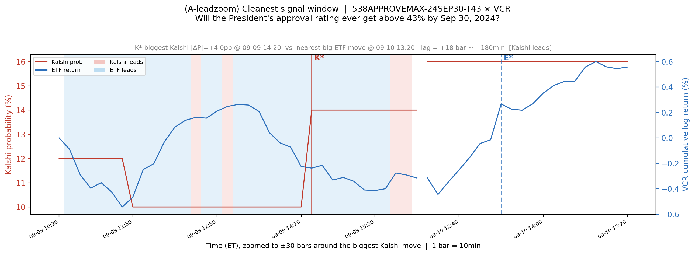
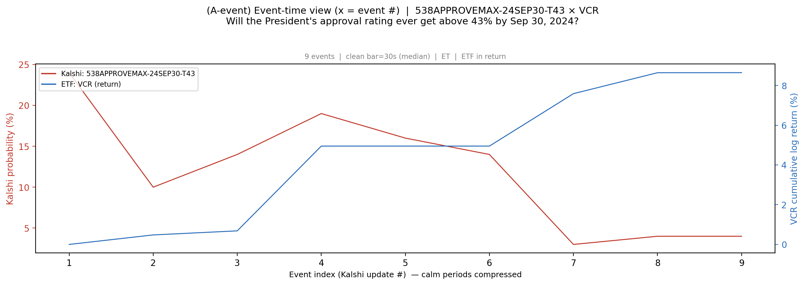


---

## Rank 37/48 — AAAGASM-24SEP30-US-3.15 × VIS  (n_sig=0, best_p=n/a, n_trades=24)  (no regression result)

```text
PAIR ANALYSIS    —    Rank 37 / 48
================================================================================================
AAAGASM-24SEP30-US-3.15   x   VIS
Contract : "Will average **gas prices** be above $3.15?"
Sector relevance : VDE (Energy)
Window : 2024-09-06 to 2024-09-26     Kalshi trades : 24     primary bar : n/a     daily-screen R^2 : 0.63

>>> RELIABILITY:  Cannot-estimate   <<<   (see section 5; unreliable pairs still get figures, but read their problems in section 8)

DEFINITIONS
   xₜ₋ₖ = Kalshi yes-probability change, k bars before t   (1 bar = n/a)
   yₜ   = ETF log return over bar t
   calendar = full market-hours grid: x=0 in bars with no Kalshi trade (not dropped).
   k>0 => Kalshi leads ETF ;  k<0 => ETF leads Kalshi ;  k=0 => contemporaneous

1. CALENDAR-TIME REGRESSION (clock-time lags, full RTH grid)
   Full model:  yₜ = α + Σ(k) βₖ·xₜ₋ₖ + (ADL self-lags) + (day fixed effects)
   -> no regression result (insufficient data).

2. EVENT-TIME REGRESSION (event-count lags)
   Full model:  yₜ = α + Σ(k) βₖ·xₜ₋ₖ + (ADL self-lags) + (day fixed effects)
   -> no regression result (insufficient data).

3. FULL COEFFICIENT TABLE  (calendar primary bar  vs  event)
   (no coefficients in either mode)

4. DIRECTIONAL TEST (probit, ETF up/down)
   Model: P(ETFₜ up) = Φ(α + βₖ·xₜ₋ₖ),  one probit per lag k
   calendar: n/a
   event: n/a
   -> no significant directional predictability either mode (raw p<0.15).

5. DATA RELIABILITY (statistical, not a trade-count cutoff)
   Tier: Cannot-estimate
   (criterion = n_active: bars with an actual Kalshi move (x!=0) = the real sample that identifies the lead-lag. Full RTH grid makes n_obs large, so n_active is the honest size.)
   calendar(full RTH grid): not estimable (insufficient data)
   event: not estimable (insufficient data)
   => Neither axis is estimable: this pair has descriptive figures only, no reliable regression result.

6. COARSE-FREQUENCY ROBUSTNESS (re-run calendar at 30min / 60min)
    30min: not estimable (n_obs=5 < minimum) -- coarser bars have even fewer observations
    60min: not estimable (n_obs=4 < minimum) -- coarser bars have even fewer observations

7. VERDICT
   No lead-lag detected -- too sparse / no significant structure.
   (Note: this pair lacks the data to support reliable inference; the verdict above is descriptive only -- do not put it in the conclusions.)

8. FIGURE CAVEATS — figures are still drawn, but know their problems
   - Regression cannot be estimated: the lag-coefficient plot (B) shows 'no regression result'; only the time-series / zoom plots are descriptive.
   - Long flat Kalshi segments = NO TRADE in that span (not 'probability unchanged'); do not read lead direction from them.
   - Too few active bars: the red/blue lead shading in zoom2/segments and the K#/E# pairing in leadglance are illustrative only, with no statistical meaning.
   - Kalshi updates only on trades (flat line = no trade, NOT 'no change'); ETF mid refreshes continuously.

------------------------------------------------------------------------------------------------
Conventions: ET | 09:30-16:00 (forward windows capped to 16:00) | ETF in log return | median causal bars | full RTH grid | day-grouped lags (no overnight) | ADL self-control | significance = BH-FDR corrected.
Figures for this pair follow on the next page.
```

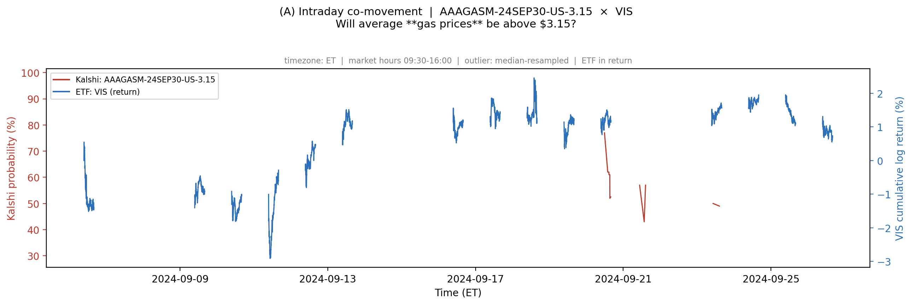
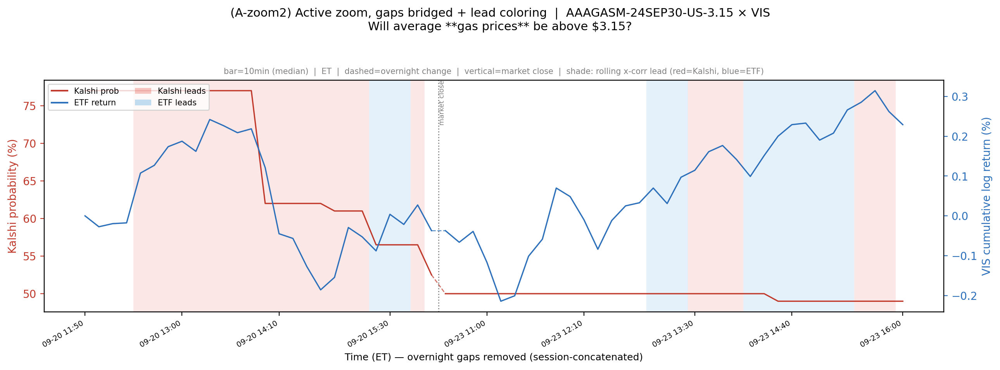
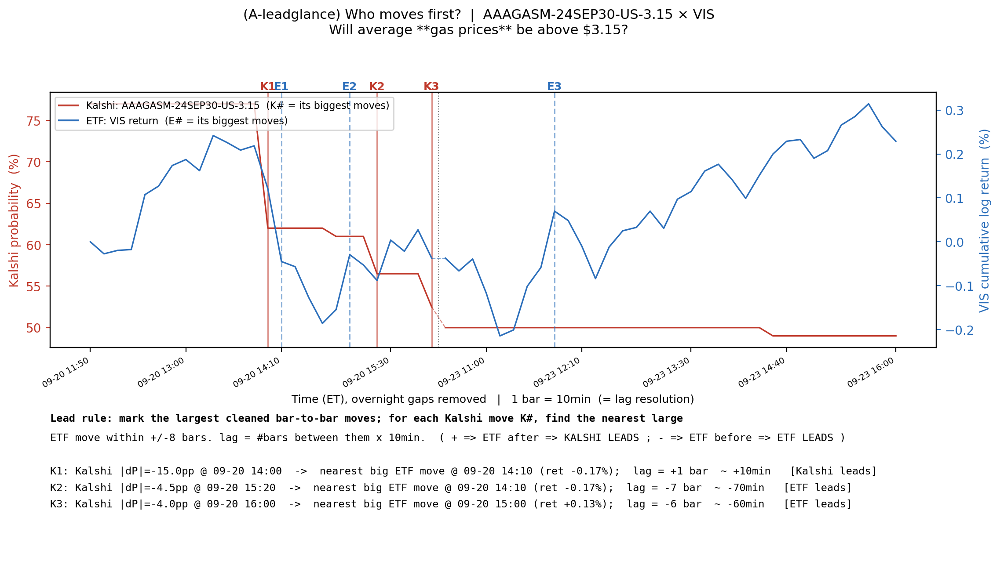
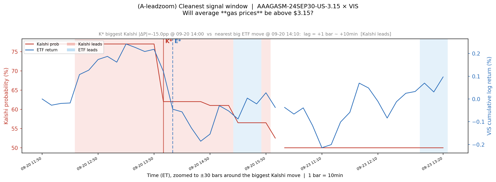
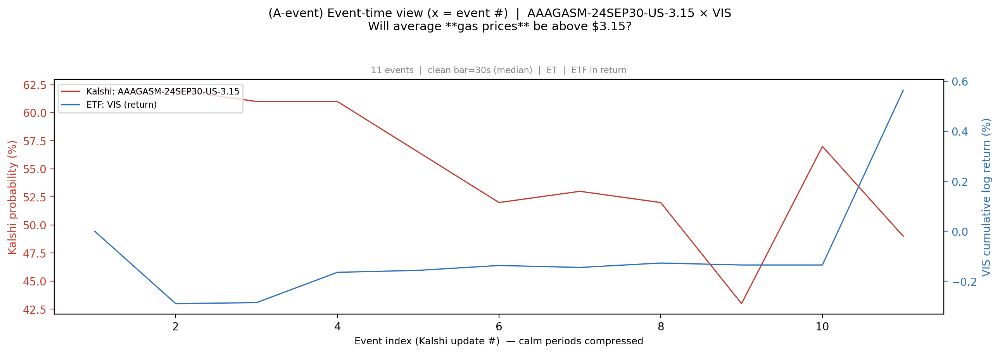
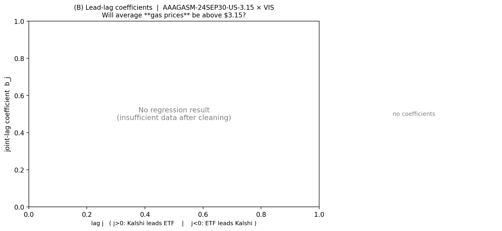

---

## Rank 38/48 — AAAGASM-24SEP30-US-3.15 × VGT  (n_sig=0, best_p=n/a, n_trades=24)  (no regression result)

```text
PAIR ANALYSIS    —    Rank 38 / 48
================================================================================================
AAAGASM-24SEP30-US-3.15   x   VGT
Contract : "Will average **gas prices** be above $3.15?"
Sector relevance : VDE (Energy)
Window : 2024-09-06 to 2024-09-26     Kalshi trades : 24     primary bar : n/a     daily-screen R^2 : 0.63

>>> RELIABILITY:  Cannot-estimate   <<<   (see section 5; unreliable pairs still get figures, but read their problems in section 8)

DEFINITIONS
   xₜ₋ₖ = Kalshi yes-probability change, k bars before t   (1 bar = n/a)
   yₜ   = ETF log return over bar t
   calendar = full market-hours grid: x=0 in bars with no Kalshi trade (not dropped).
   k>0 => Kalshi leads ETF ;  k<0 => ETF leads Kalshi ;  k=0 => contemporaneous

1. CALENDAR-TIME REGRESSION (clock-time lags, full RTH grid)
   Full model:  yₜ = α + Σ(k) βₖ·xₜ₋ₖ + (ADL self-lags) + (day fixed effects)
   -> no regression result (insufficient data).

2. EVENT-TIME REGRESSION (event-count lags)
   Full model:  yₜ = α + Σ(k) βₖ·xₜ₋ₖ + (ADL self-lags) + (day fixed effects)
   -> no regression result (insufficient data).

3. FULL COEFFICIENT TABLE  (calendar primary bar  vs  event)
   (no coefficients in either mode)

4. DIRECTIONAL TEST (probit, ETF up/down)
   Model: P(ETFₜ up) = Φ(α + βₖ·xₜ₋ₖ),  one probit per lag k
   calendar: n/a
   event: n/a
   -> no significant directional predictability either mode (raw p<0.15).

5. DATA RELIABILITY (statistical, not a trade-count cutoff)
   Tier: Cannot-estimate
   (criterion = n_active: bars with an actual Kalshi move (x!=0) = the real sample that identifies the lead-lag. Full RTH grid makes n_obs large, so n_active is the honest size.)
   calendar(full RTH grid): not estimable (insufficient data)
   event: not estimable (insufficient data)
   => Neither axis is estimable: this pair has descriptive figures only, no reliable regression result.

6. COARSE-FREQUENCY ROBUSTNESS (re-run calendar at 30min / 60min)
    30min: not estimable (n_obs=5 < minimum) -- coarser bars have even fewer observations
    60min: not estimable (n_obs=4 < minimum) -- coarser bars have even fewer observations

7. VERDICT
   No lead-lag detected -- too sparse / no significant structure.
   (Note: this pair lacks the data to support reliable inference; the verdict above is descriptive only -- do not put it in the conclusions.)

8. FIGURE CAVEATS — figures are still drawn, but know their problems
   - Regression cannot be estimated: the lag-coefficient plot (B) shows 'no regression result'; only the time-series / zoom plots are descriptive.
   - Long flat Kalshi segments = NO TRADE in that span (not 'probability unchanged'); do not read lead direction from them.
   - Too few active bars: the red/blue lead shading in zoom2/segments and the K#/E# pairing in leadglance are illustrative only, with no statistical meaning.
   - Kalshi updates only on trades (flat line = no trade, NOT 'no change'); ETF mid refreshes continuously.

------------------------------------------------------------------------------------------------
Conventions: ET | 09:30-16:00 (forward windows capped to 16:00) | ETF in log return | median causal bars | full RTH grid | day-grouped lags (no overnight) | ADL self-control | significance = BH-FDR corrected.
Figures for this pair follow on the next page.
```

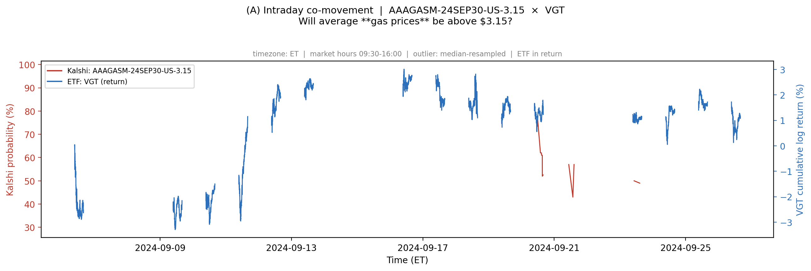
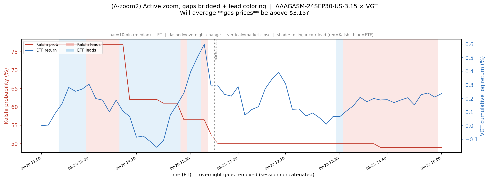
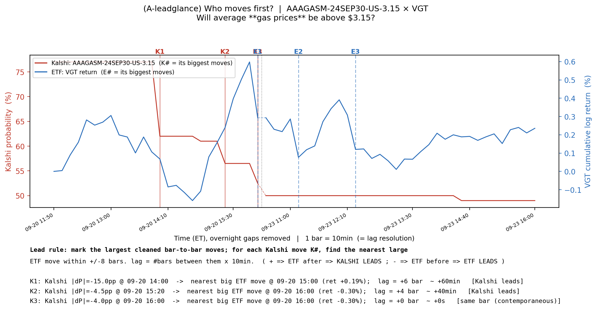
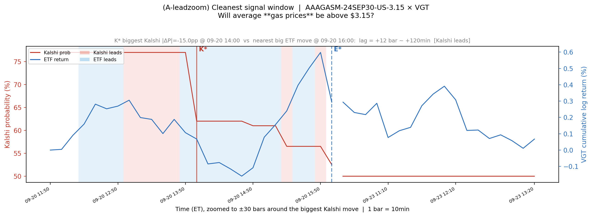
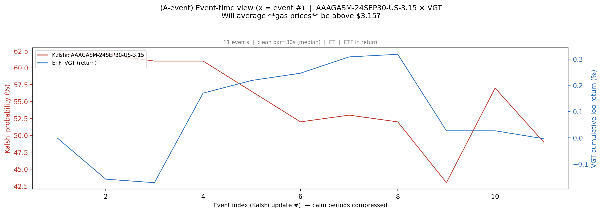


---

## Rank 39/48 — AAAGASM-24SEP30-US-3.15 × VAW  (n_sig=0, best_p=n/a, n_trades=24)  (no regression result)

```text
PAIR ANALYSIS    —    Rank 39 / 48
================================================================================================
AAAGASM-24SEP30-US-3.15   x   VAW
Contract : "Will average **gas prices** be above $3.15?"
Sector relevance : VDE (Energy)
Window : 2024-09-06 to 2024-09-26     Kalshi trades : 24     primary bar : n/a     daily-screen R^2 : 0.57

>>> RELIABILITY:  Cannot-estimate   <<<   (see section 5; unreliable pairs still get figures, but read their problems in section 8)

DEFINITIONS
   xₜ₋ₖ = Kalshi yes-probability change, k bars before t   (1 bar = n/a)
   yₜ   = ETF log return over bar t
   calendar = full market-hours grid: x=0 in bars with no Kalshi trade (not dropped).
   k>0 => Kalshi leads ETF ;  k<0 => ETF leads Kalshi ;  k=0 => contemporaneous

1. CALENDAR-TIME REGRESSION (clock-time lags, full RTH grid)
   Full model:  yₜ = α + Σ(k) βₖ·xₜ₋ₖ + (ADL self-lags) + (day fixed effects)
   -> no regression result (insufficient data).

2. EVENT-TIME REGRESSION (event-count lags)
   Full model:  yₜ = α + Σ(k) βₖ·xₜ₋ₖ + (ADL self-lags) + (day fixed effects)
   -> no regression result (insufficient data).

3. FULL COEFFICIENT TABLE  (calendar primary bar  vs  event)
   (no coefficients in either mode)

4. DIRECTIONAL TEST (probit, ETF up/down)
   Model: P(ETFₜ up) = Φ(α + βₖ·xₜ₋ₖ),  one probit per lag k
   calendar: n/a
   event: n/a
   -> no significant directional predictability either mode (raw p<0.15).

5. DATA RELIABILITY (statistical, not a trade-count cutoff)
   Tier: Cannot-estimate
   (criterion = n_active: bars with an actual Kalshi move (x!=0) = the real sample that identifies the lead-lag. Full RTH grid makes n_obs large, so n_active is the honest size.)
   calendar(full RTH grid): not estimable (insufficient data)
   event: not estimable (insufficient data)
   => Neither axis is estimable: this pair has descriptive figures only, no reliable regression result.

6. COARSE-FREQUENCY ROBUSTNESS (re-run calendar at 30min / 60min)
    30min: not estimable (n_obs=5 < minimum) -- coarser bars have even fewer observations
    60min: not estimable (n_obs=4 < minimum) -- coarser bars have even fewer observations

7. VERDICT
   No lead-lag detected -- too sparse / no significant structure.
   (Note: this pair lacks the data to support reliable inference; the verdict above is descriptive only -- do not put it in the conclusions.)

8. FIGURE CAVEATS — figures are still drawn, but know their problems
   - Regression cannot be estimated: the lag-coefficient plot (B) shows 'no regression result'; only the time-series / zoom plots are descriptive.
   - Long flat Kalshi segments = NO TRADE in that span (not 'probability unchanged'); do not read lead direction from them.
   - Too few active bars: the red/blue lead shading in zoom2/segments and the K#/E# pairing in leadglance are illustrative only, with no statistical meaning.
   - Kalshi updates only on trades (flat line = no trade, NOT 'no change'); ETF mid refreshes continuously.

------------------------------------------------------------------------------------------------
Conventions: ET | 09:30-16:00 (forward windows capped to 16:00) | ETF in log return | median causal bars | full RTH grid | day-grouped lags (no overnight) | ADL self-control | significance = BH-FDR corrected.
Figures for this pair follow on the next page.
```

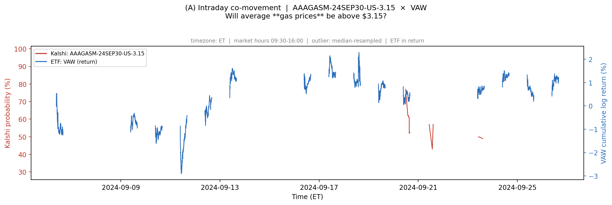
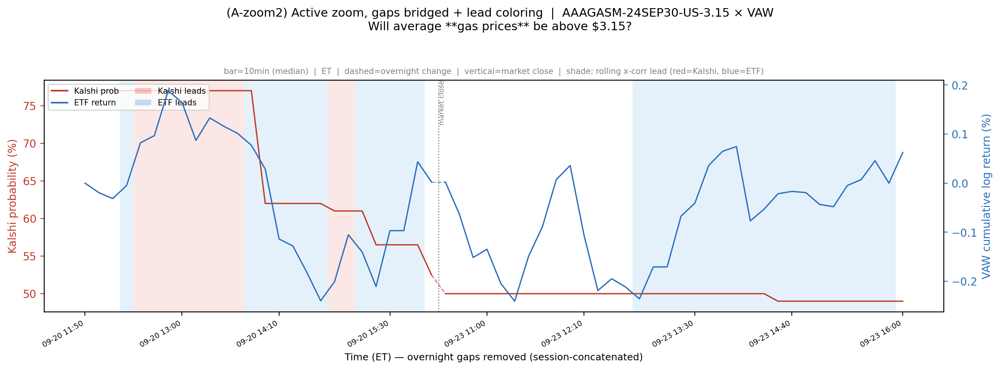
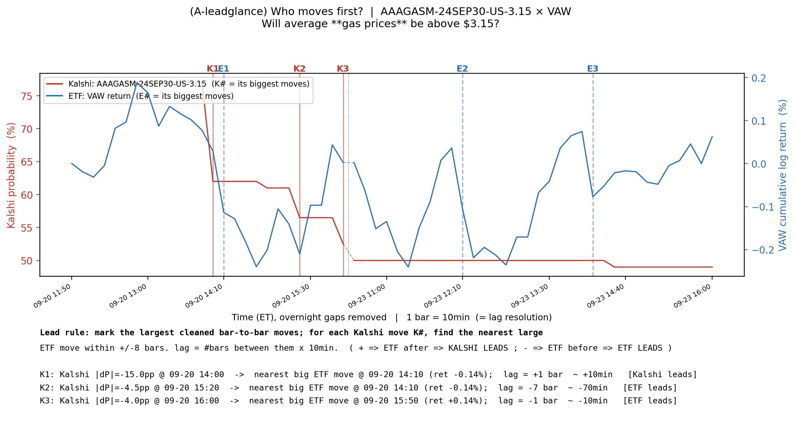
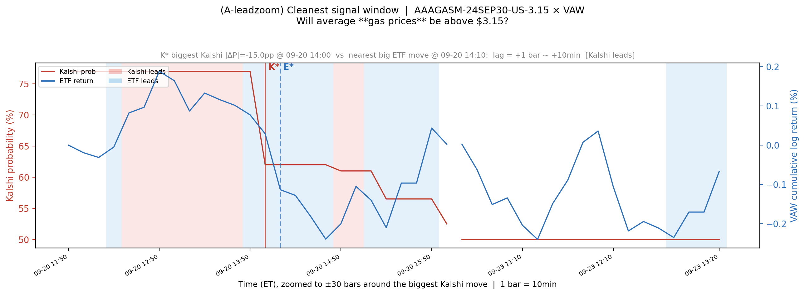
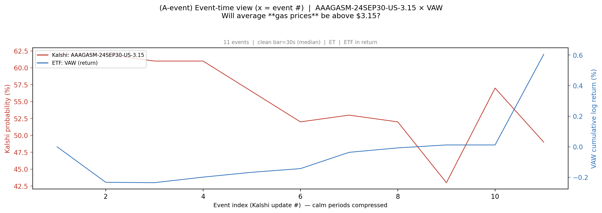
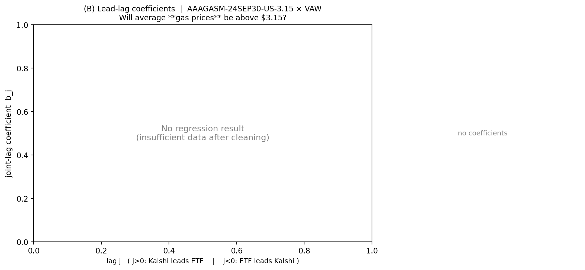

---

## Rank 40/48 — AAAGASM-24SEP30-US-3.15 × VCR  (n_sig=0, best_p=n/a, n_trades=24)  (no regression result)

```text
PAIR ANALYSIS    —    Rank 40 / 48
================================================================================================
AAAGASM-24SEP30-US-3.15   x   VCR
Contract : "Will average **gas prices** be above $3.15?"
Sector relevance : VDE (Energy)
Window : 2024-09-06 to 2024-09-26     Kalshi trades : 24     primary bar : n/a     daily-screen R^2 : 0.46

>>> RELIABILITY:  Cannot-estimate   <<<   (see section 5; unreliable pairs still get figures, but read their problems in section 8)

DEFINITIONS
   xₜ₋ₖ = Kalshi yes-probability change, k bars before t   (1 bar = n/a)
   yₜ   = ETF log return over bar t
   calendar = full market-hours grid: x=0 in bars with no Kalshi trade (not dropped).
   k>0 => Kalshi leads ETF ;  k<0 => ETF leads Kalshi ;  k=0 => contemporaneous

1. CALENDAR-TIME REGRESSION (clock-time lags, full RTH grid)
   Full model:  yₜ = α + Σ(k) βₖ·xₜ₋ₖ + (ADL self-lags) + (day fixed effects)
   -> no regression result (insufficient data).

2. EVENT-TIME REGRESSION (event-count lags)
   Full model:  yₜ = α + Σ(k) βₖ·xₜ₋ₖ + (ADL self-lags) + (day fixed effects)
   -> no regression result (insufficient data).

3. FULL COEFFICIENT TABLE  (calendar primary bar  vs  event)
   (no coefficients in either mode)

4. DIRECTIONAL TEST (probit, ETF up/down)
   Model: P(ETFₜ up) = Φ(α + βₖ·xₜ₋ₖ),  one probit per lag k
   calendar: n/a
   event: n/a
   -> no significant directional predictability either mode (raw p<0.15).

5. DATA RELIABILITY (statistical, not a trade-count cutoff)
   Tier: Cannot-estimate
   (criterion = n_active: bars with an actual Kalshi move (x!=0) = the real sample that identifies the lead-lag. Full RTH grid makes n_obs large, so n_active is the honest size.)
   calendar(full RTH grid): not estimable (insufficient data)
   event: not estimable (insufficient data)
   => Neither axis is estimable: this pair has descriptive figures only, no reliable regression result.

6. COARSE-FREQUENCY ROBUSTNESS (re-run calendar at 30min / 60min)
    30min: not estimable (n_obs=5 < minimum) -- coarser bars have even fewer observations
    60min: not estimable (n_obs=4 < minimum) -- coarser bars have even fewer observations

7. VERDICT
   No lead-lag detected -- too sparse / no significant structure.
   (Note: this pair lacks the data to support reliable inference; the verdict above is descriptive only -- do not put it in the conclusions.)

8. FIGURE CAVEATS — figures are still drawn, but know their problems
   - Regression cannot be estimated: the lag-coefficient plot (B) shows 'no regression result'; only the time-series / zoom plots are descriptive.
   - Long flat Kalshi segments = NO TRADE in that span (not 'probability unchanged'); do not read lead direction from them.
   - Too few active bars: the red/blue lead shading in zoom2/segments and the K#/E# pairing in leadglance are illustrative only, with no statistical meaning.
   - Kalshi updates only on trades (flat line = no trade, NOT 'no change'); ETF mid refreshes continuously.

------------------------------------------------------------------------------------------------
Conventions: ET | 09:30-16:00 (forward windows capped to 16:00) | ETF in log return | median causal bars | full RTH grid | day-grouped lags (no overnight) | ADL self-control | significance = BH-FDR corrected.
Figures for this pair follow on the next page.
```

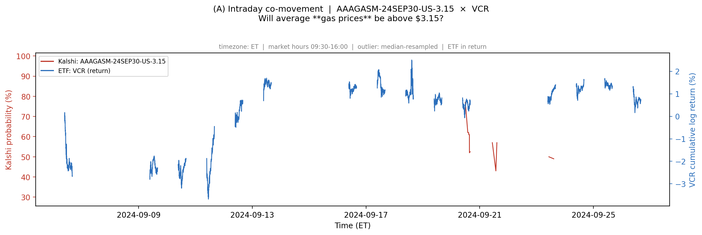
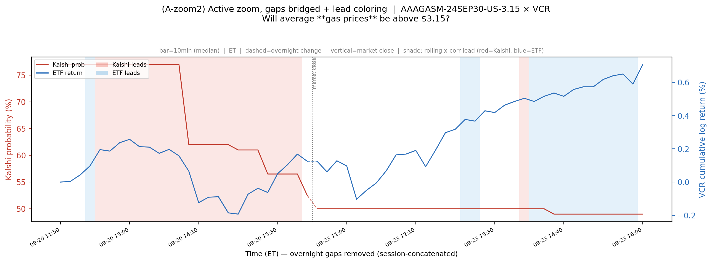
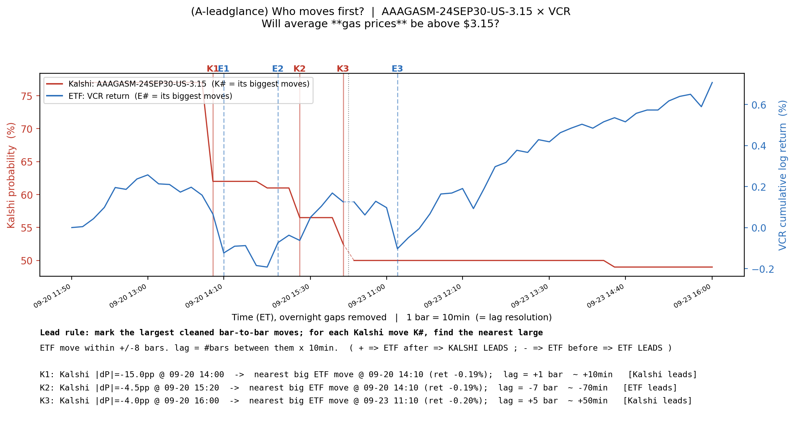
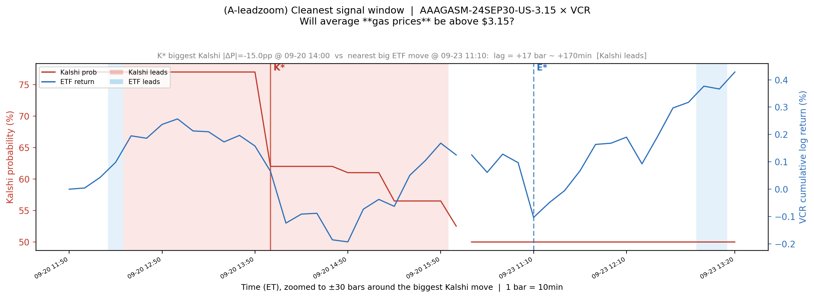
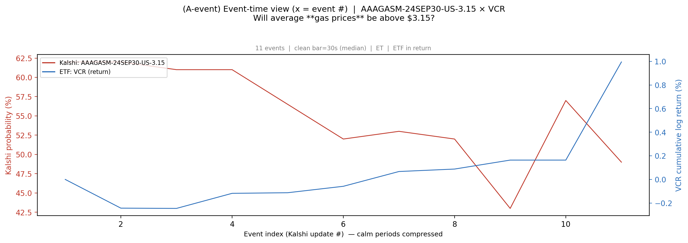


---

## Rank 41/48 — AAAGASM-24SEP30-US-3.15 × VOX  (n_sig=0, best_p=n/a, n_trades=24)  (no regression result)

```text
PAIR ANALYSIS    —    Rank 41 / 48
================================================================================================
AAAGASM-24SEP30-US-3.15   x   VOX
Contract : "Will average **gas prices** be above $3.15?"
Sector relevance : VDE (Energy)
Window : 2024-09-06 to 2024-09-26     Kalshi trades : 24     primary bar : n/a     daily-screen R^2 : 0.44

>>> RELIABILITY:  Cannot-estimate   <<<   (see section 5; unreliable pairs still get figures, but read their problems in section 8)

DEFINITIONS
   xₜ₋ₖ = Kalshi yes-probability change, k bars before t   (1 bar = n/a)
   yₜ   = ETF log return over bar t
   calendar = full market-hours grid: x=0 in bars with no Kalshi trade (not dropped).
   k>0 => Kalshi leads ETF ;  k<0 => ETF leads Kalshi ;  k=0 => contemporaneous

1. CALENDAR-TIME REGRESSION (clock-time lags, full RTH grid)
   Full model:  yₜ = α + Σ(k) βₖ·xₜ₋ₖ + (ADL self-lags) + (day fixed effects)
   -> no regression result (insufficient data).

2. EVENT-TIME REGRESSION (event-count lags)
   Full model:  yₜ = α + Σ(k) βₖ·xₜ₋ₖ + (ADL self-lags) + (day fixed effects)
   -> no regression result (insufficient data).

3. FULL COEFFICIENT TABLE  (calendar primary bar  vs  event)
   (no coefficients in either mode)

4. DIRECTIONAL TEST (probit, ETF up/down)
   Model: P(ETFₜ up) = Φ(α + βₖ·xₜ₋ₖ),  one probit per lag k
   calendar: n/a
   event: n/a
   -> no significant directional predictability either mode (raw p<0.15).

5. DATA RELIABILITY (statistical, not a trade-count cutoff)
   Tier: Cannot-estimate
   (criterion = n_active: bars with an actual Kalshi move (x!=0) = the real sample that identifies the lead-lag. Full RTH grid makes n_obs large, so n_active is the honest size.)
   calendar(full RTH grid): not estimable (insufficient data)
   event: not estimable (insufficient data)
   => Neither axis is estimable: this pair has descriptive figures only, no reliable regression result.

6. COARSE-FREQUENCY ROBUSTNESS (re-run calendar at 30min / 60min)
    30min: not estimable (n_obs=5 < minimum) -- coarser bars have even fewer observations
    60min: not estimable (n_obs=4 < minimum) -- coarser bars have even fewer observations

7. VERDICT
   No lead-lag detected -- too sparse / no significant structure.
   (Note: this pair lacks the data to support reliable inference; the verdict above is descriptive only -- do not put it in the conclusions.)

8. FIGURE CAVEATS — figures are still drawn, but know their problems
   - Regression cannot be estimated: the lag-coefficient plot (B) shows 'no regression result'; only the time-series / zoom plots are descriptive.
   - Long flat Kalshi segments = NO TRADE in that span (not 'probability unchanged'); do not read lead direction from them.
   - Too few active bars: the red/blue lead shading in zoom2/segments and the K#/E# pairing in leadglance are illustrative only, with no statistical meaning.
   - Kalshi updates only on trades (flat line = no trade, NOT 'no change'); ETF mid refreshes continuously.

------------------------------------------------------------------------------------------------
Conventions: ET | 09:30-16:00 (forward windows capped to 16:00) | ETF in log return | median causal bars | full RTH grid | day-grouped lags (no overnight) | ADL self-control | significance = BH-FDR corrected.
Figures for this pair follow on the next page.
```

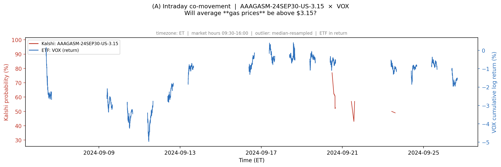
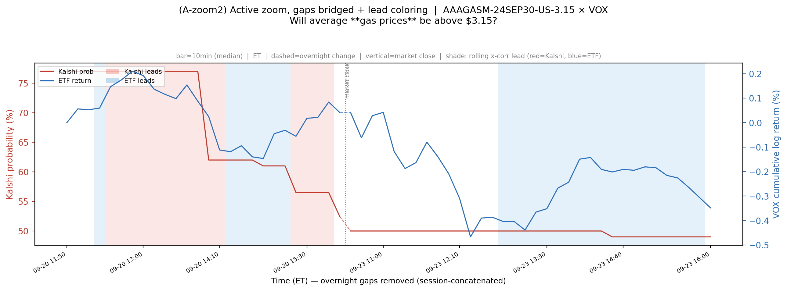
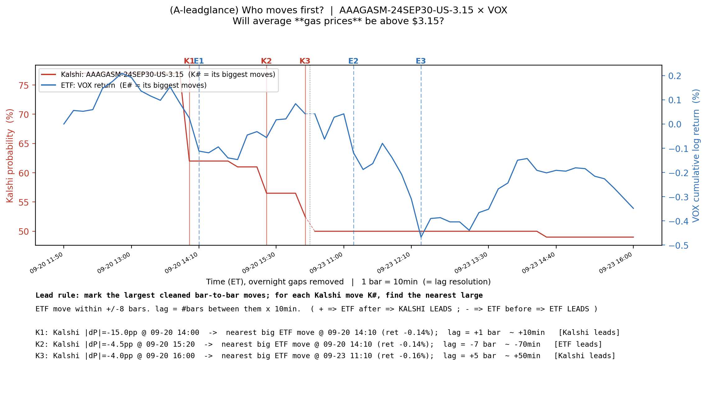
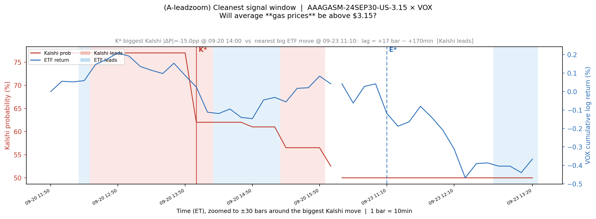
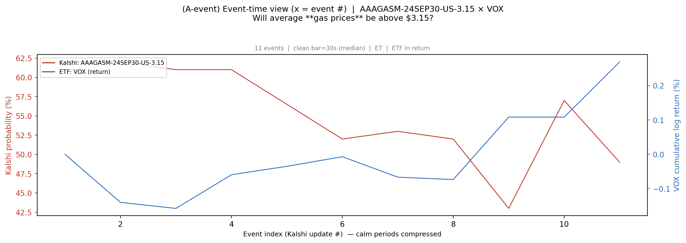


---

## Rank 42/48 — KX538APPROVEMAX-24NOV30-T41 × VGT  (n_sig=0, best_p=n/a, n_trades=22)  (no regression result)

```text
PAIR ANALYSIS    —    Rank 42 / 48
================================================================================================
KX538APPROVEMAX-24NOV30-T41   x   VGT
Contract : "Will the President's approval rating ever get above 41% by Nov 30, 2024?"
Sector relevance : Election outcome (all sectors)
Window : 2024-11-11 to 2024-11-25     Kalshi trades : 22     primary bar : n/a     daily-screen R^2 : 0.46

>>> RELIABILITY:  Cannot-estimate   <<<   (see section 5; unreliable pairs still get figures, but read their problems in section 8)

DEFINITIONS
   xₜ₋ₖ = Kalshi yes-probability change, k bars before t   (1 bar = n/a)
   yₜ   = ETF log return over bar t
   calendar = full market-hours grid: x=0 in bars with no Kalshi trade (not dropped).
   k>0 => Kalshi leads ETF ;  k<0 => ETF leads Kalshi ;  k=0 => contemporaneous

1. CALENDAR-TIME REGRESSION (clock-time lags, full RTH grid)
   Full model:  yₜ = α + Σ(k) βₖ·xₜ₋ₖ + (ADL self-lags) + (day fixed effects)
   -> no regression result (insufficient data).

2. EVENT-TIME REGRESSION (event-count lags)
   Full model:  yₜ = α + Σ(k) βₖ·xₜ₋ₖ + (ADL self-lags) + (day fixed effects)
   -> no regression result (insufficient data).

3. FULL COEFFICIENT TABLE  (calendar primary bar  vs  event)
   (no coefficients in either mode)

4. DIRECTIONAL TEST (probit, ETF up/down)
   Model: P(ETFₜ up) = Φ(α + βₖ·xₜ₋ₖ),  one probit per lag k
   calendar: n/a
   event: n/a
   -> no significant directional predictability either mode (raw p<0.15).

5. DATA RELIABILITY (statistical, not a trade-count cutoff)
   Tier: Cannot-estimate
   (criterion = n_active: bars with an actual Kalshi move (x!=0) = the real sample that identifies the lead-lag. Full RTH grid makes n_obs large, so n_active is the honest size.)
   calendar(full RTH grid): not estimable (insufficient data)
   event: not estimable (insufficient data)
   => Neither axis is estimable: this pair has descriptive figures only, no reliable regression result.

6. COARSE-FREQUENCY ROBUSTNESS (re-run calendar at 30min / 60min)
    30min: not estimable (n_obs=3 < minimum) -- coarser bars have even fewer observations
    60min: not estimable (n_obs=3 < minimum) -- coarser bars have even fewer observations

7. VERDICT
   No lead-lag detected -- too sparse / no significant structure.
   (Note: this pair lacks the data to support reliable inference; the verdict above is descriptive only -- do not put it in the conclusions.)

8. FIGURE CAVEATS — figures are still drawn, but know their problems
   - Regression cannot be estimated: the lag-coefficient plot (B) shows 'no regression result'; only the time-series / zoom plots are descriptive.
   - Long flat Kalshi segments = NO TRADE in that span (not 'probability unchanged'); do not read lead direction from them.
   - Too few active bars: the red/blue lead shading in zoom2/segments and the K#/E# pairing in leadglance are illustrative only, with no statistical meaning.
   - Kalshi updates only on trades (flat line = no trade, NOT 'no change'); ETF mid refreshes continuously.

------------------------------------------------------------------------------------------------
Conventions: ET | 09:30-16:00 (forward windows capped to 16:00) | ETF in log return | median causal bars | full RTH grid | day-grouped lags (no overnight) | ADL self-control | significance = BH-FDR corrected.
Figures for this pair follow on the next page.
```

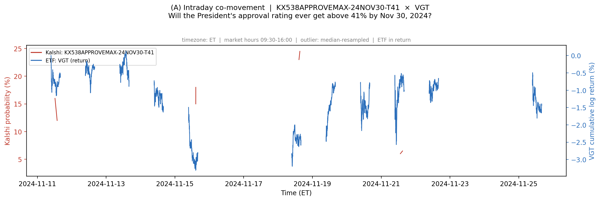
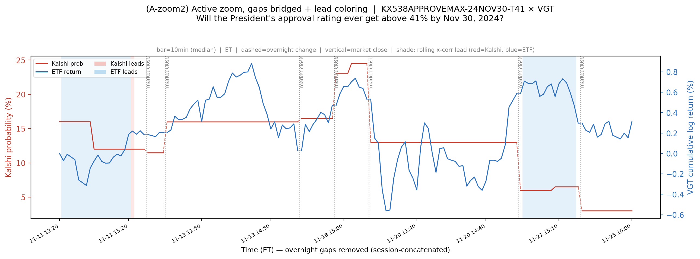
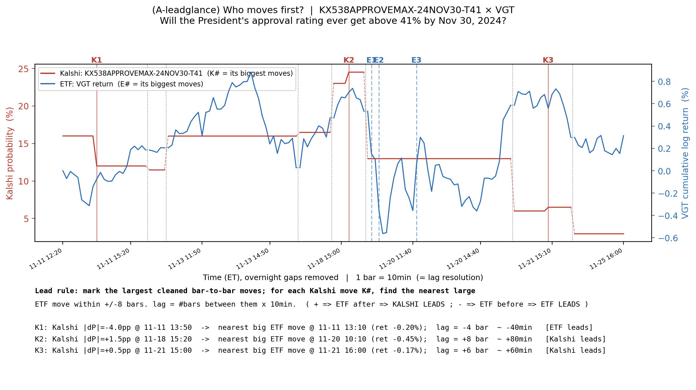
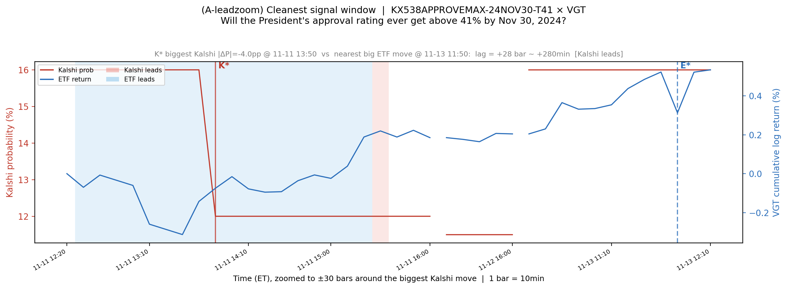
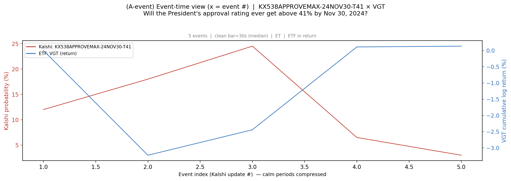


---

## Rank 43/48 — KX538APPROVEMAX-24NOV30-T41 × VHT  (n_sig=0, best_p=n/a, n_trades=22)  (no regression result)

```text
PAIR ANALYSIS    —    Rank 43 / 48
================================================================================================
KX538APPROVEMAX-24NOV30-T41   x   VHT
Contract : "Will the President's approval rating ever get above 41% by Nov 30, 2024?"
Sector relevance : Election outcome (all sectors)
Window : 2024-11-11 to 2024-11-25     Kalshi trades : 22     primary bar : n/a     daily-screen R^2 : 0.38

>>> RELIABILITY:  Cannot-estimate   <<<   (see section 5; unreliable pairs still get figures, but read their problems in section 8)

DEFINITIONS
   xₜ₋ₖ = Kalshi yes-probability change, k bars before t   (1 bar = n/a)
   yₜ   = ETF log return over bar t
   calendar = full market-hours grid: x=0 in bars with no Kalshi trade (not dropped).
   k>0 => Kalshi leads ETF ;  k<0 => ETF leads Kalshi ;  k=0 => contemporaneous

1. CALENDAR-TIME REGRESSION (clock-time lags, full RTH grid)
   Full model:  yₜ = α + Σ(k) βₖ·xₜ₋ₖ + (ADL self-lags) + (day fixed effects)
   -> no regression result (insufficient data).

2. EVENT-TIME REGRESSION (event-count lags)
   Full model:  yₜ = α + Σ(k) βₖ·xₜ₋ₖ + (ADL self-lags) + (day fixed effects)
   -> no regression result (insufficient data).

3. FULL COEFFICIENT TABLE  (calendar primary bar  vs  event)
   (no coefficients in either mode)

4. DIRECTIONAL TEST (probit, ETF up/down)
   Model: P(ETFₜ up) = Φ(α + βₖ·xₜ₋ₖ),  one probit per lag k
   calendar: n/a
   event: n/a
   -> no significant directional predictability either mode (raw p<0.15).

5. DATA RELIABILITY (statistical, not a trade-count cutoff)
   Tier: Cannot-estimate
   (criterion = n_active: bars with an actual Kalshi move (x!=0) = the real sample that identifies the lead-lag. Full RTH grid makes n_obs large, so n_active is the honest size.)
   calendar(full RTH grid): not estimable (insufficient data)
   event: not estimable (insufficient data)
   => Neither axis is estimable: this pair has descriptive figures only, no reliable regression result.

6. COARSE-FREQUENCY ROBUSTNESS (re-run calendar at 30min / 60min)
    30min: not estimable (n_obs=3 < minimum) -- coarser bars have even fewer observations
    60min: not estimable (n_obs=3 < minimum) -- coarser bars have even fewer observations

7. VERDICT
   No lead-lag detected -- too sparse / no significant structure.
   (Note: this pair lacks the data to support reliable inference; the verdict above is descriptive only -- do not put it in the conclusions.)

8. FIGURE CAVEATS — figures are still drawn, but know their problems
   - Regression cannot be estimated: the lag-coefficient plot (B) shows 'no regression result'; only the time-series / zoom plots are descriptive.
   - Long flat Kalshi segments = NO TRADE in that span (not 'probability unchanged'); do not read lead direction from them.
   - Too few active bars: the red/blue lead shading in zoom2/segments and the K#/E# pairing in leadglance are illustrative only, with no statistical meaning.
   - Kalshi updates only on trades (flat line = no trade, NOT 'no change'); ETF mid refreshes continuously.

------------------------------------------------------------------------------------------------
Conventions: ET | 09:30-16:00 (forward windows capped to 16:00) | ETF in log return | median causal bars | full RTH grid | day-grouped lags (no overnight) | ADL self-control | significance = BH-FDR corrected.
Figures for this pair follow on the next page.
```

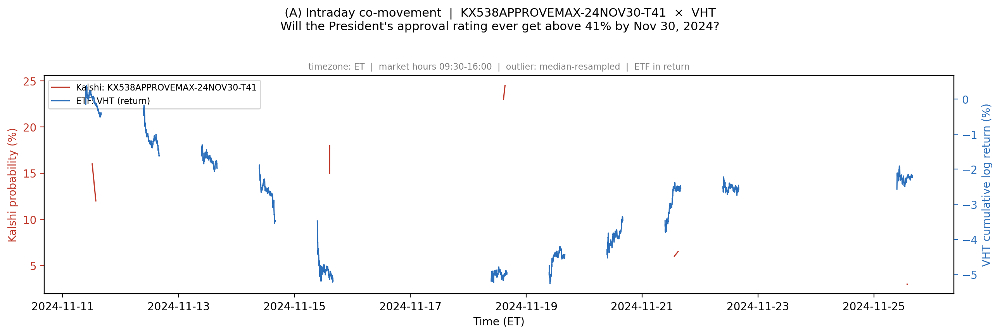
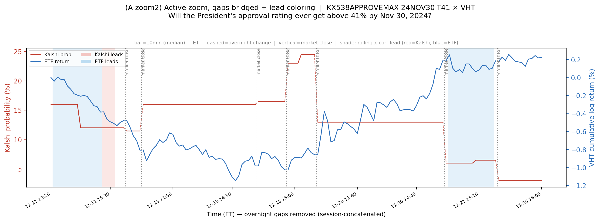
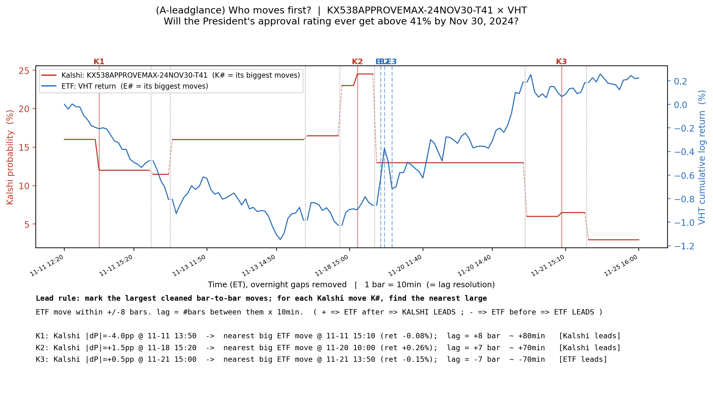
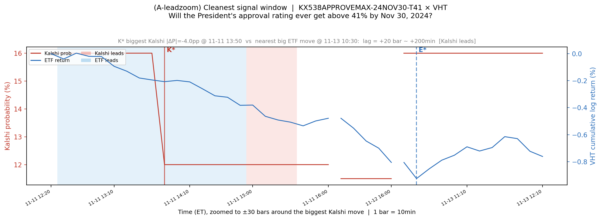
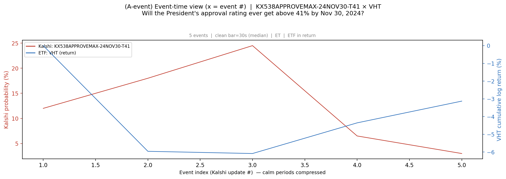


---

## Rank 44/48 — KXAAAGASM-24NOV30-US-3.30 × VFH  (n_sig=0, best_p=n/a, n_trades=14)  (no regression result)

```text
PAIR ANALYSIS    —    Rank 44 / 48
================================================================================================
KXAAAGASM-24NOV30-US-3.30   x   VFH
Contract : "Will average **gas prices** be above $3.30?"
Sector relevance : VDE (Energy)
Window : 2024-10-31 to 2024-11-20     Kalshi trades : 14     primary bar : n/a     daily-screen R^2 : 0.70

>>> RELIABILITY:  Cannot-estimate   <<<   (see section 5; unreliable pairs still get figures, but read their problems in section 8)

DEFINITIONS
   xₜ₋ₖ = Kalshi yes-probability change, k bars before t   (1 bar = n/a)
   yₜ   = ETF log return over bar t
   calendar = full market-hours grid: x=0 in bars with no Kalshi trade (not dropped).
   k>0 => Kalshi leads ETF ;  k<0 => ETF leads Kalshi ;  k=0 => contemporaneous

1. CALENDAR-TIME REGRESSION (clock-time lags, full RTH grid)
   Full model:  yₜ = α + Σ(k) βₖ·xₜ₋ₖ + (ADL self-lags) + (day fixed effects)
   -> no regression result (insufficient data).

2. EVENT-TIME REGRESSION (event-count lags)
   Full model:  yₜ = α + Σ(k) βₖ·xₜ₋ₖ + (ADL self-lags) + (day fixed effects)
   -> no regression result (insufficient data).

3. FULL COEFFICIENT TABLE  (calendar primary bar  vs  event)
   (no coefficients in either mode)

4. DIRECTIONAL TEST (probit, ETF up/down)
   Model: P(ETFₜ up) = Φ(α + βₖ·xₜ₋ₖ),  one probit per lag k
   calendar: n/a
   event: n/a
   -> no significant directional predictability either mode (raw p<0.15).

5. DATA RELIABILITY (statistical, not a trade-count cutoff)
   Tier: Cannot-estimate
   (criterion = n_active: bars with an actual Kalshi move (x!=0) = the real sample that identifies the lead-lag. Full RTH grid makes n_obs large, so n_active is the honest size.)
   calendar(full RTH grid): not estimable (insufficient data)
   event: not estimable (insufficient data)
   => Neither axis is estimable: this pair has descriptive figures only, no reliable regression result.

6. COARSE-FREQUENCY ROBUSTNESS (re-run calendar at 30min / 60min)
    30min: not estimable (n_obs=3 < minimum) -- coarser bars have even fewer observations
    60min: not estimable (n_obs=2 < minimum) -- coarser bars have even fewer observations

7. VERDICT
   No lead-lag detected -- too sparse / no significant structure.
   (Note: this pair lacks the data to support reliable inference; the verdict above is descriptive only -- do not put it in the conclusions.)

8. FIGURE CAVEATS — figures are still drawn, but know their problems
   - Regression cannot be estimated: the lag-coefficient plot (B) shows 'no regression result'; only the time-series / zoom plots are descriptive.
   - Long flat Kalshi segments = NO TRADE in that span (not 'probability unchanged'); do not read lead direction from them.
   - Too few active bars: the red/blue lead shading in zoom2/segments and the K#/E# pairing in leadglance are illustrative only, with no statistical meaning.
   - Kalshi updates only on trades (flat line = no trade, NOT 'no change'); ETF mid refreshes continuously.

------------------------------------------------------------------------------------------------
Conventions: ET | 09:30-16:00 (forward windows capped to 16:00) | ETF in log return | median causal bars | full RTH grid | day-grouped lags (no overnight) | ADL self-control | significance = BH-FDR corrected.
Figures for this pair follow on the next page.
```

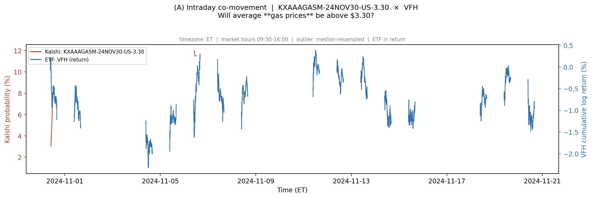
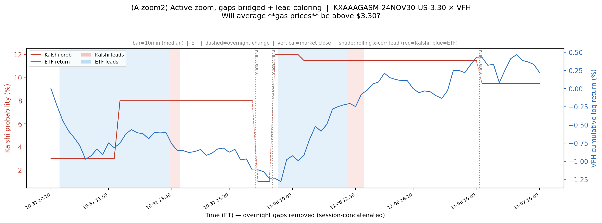
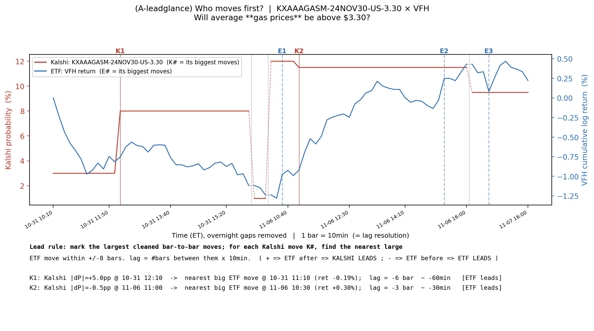
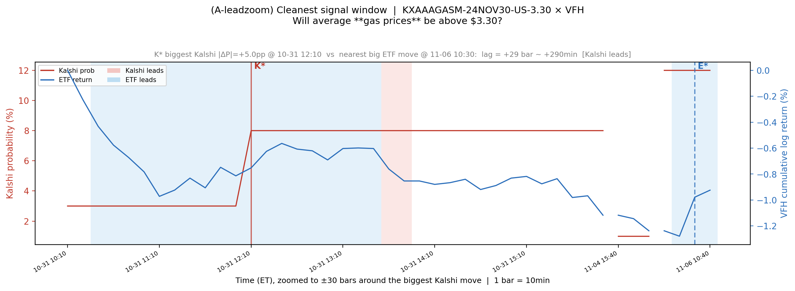
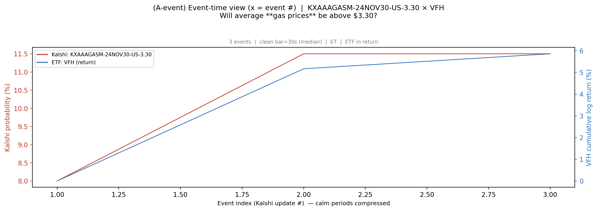


---

## Rank 45/48 — KXAAAGASM-24NOV30-US-3.30 × VDE  (n_sig=0, best_p=n/a, n_trades=14)  (no regression result)

```text
PAIR ANALYSIS    —    Rank 45 / 48
================================================================================================
KXAAAGASM-24NOV30-US-3.30   x   VDE
Contract : "Will average **gas prices** be above $3.30?"
Sector relevance : VDE (Energy)
Window : 2024-10-31 to 2024-11-20     Kalshi trades : 14     primary bar : n/a     daily-screen R^2 : 0.60

>>> RELIABILITY:  Cannot-estimate   <<<   (see section 5; unreliable pairs still get figures, but read their problems in section 8)

DEFINITIONS
   xₜ₋ₖ = Kalshi yes-probability change, k bars before t   (1 bar = n/a)
   yₜ   = ETF log return over bar t
   calendar = full market-hours grid: x=0 in bars with no Kalshi trade (not dropped).
   k>0 => Kalshi leads ETF ;  k<0 => ETF leads Kalshi ;  k=0 => contemporaneous

1. CALENDAR-TIME REGRESSION (clock-time lags, full RTH grid)
   Full model:  yₜ = α + Σ(k) βₖ·xₜ₋ₖ + (ADL self-lags) + (day fixed effects)
   -> no regression result (insufficient data).

2. EVENT-TIME REGRESSION (event-count lags)
   Full model:  yₜ = α + Σ(k) βₖ·xₜ₋ₖ + (ADL self-lags) + (day fixed effects)
   -> no regression result (insufficient data).

3. FULL COEFFICIENT TABLE  (calendar primary bar  vs  event)
   (no coefficients in either mode)

4. DIRECTIONAL TEST (probit, ETF up/down)
   Model: P(ETFₜ up) = Φ(α + βₖ·xₜ₋ₖ),  one probit per lag k
   calendar: n/a
   event: n/a
   -> no significant directional predictability either mode (raw p<0.15).

5. DATA RELIABILITY (statistical, not a trade-count cutoff)
   Tier: Cannot-estimate
   (criterion = n_active: bars with an actual Kalshi move (x!=0) = the real sample that identifies the lead-lag. Full RTH grid makes n_obs large, so n_active is the honest size.)
   calendar(full RTH grid): not estimable (insufficient data)
   event: not estimable (insufficient data)
   => Neither axis is estimable: this pair has descriptive figures only, no reliable regression result.

6. COARSE-FREQUENCY ROBUSTNESS (re-run calendar at 30min / 60min)
    30min: not estimable (n_obs=3 < minimum) -- coarser bars have even fewer observations
    60min: not estimable (n_obs=2 < minimum) -- coarser bars have even fewer observations

7. VERDICT
   No lead-lag detected -- too sparse / no significant structure.
   (Note: this pair lacks the data to support reliable inference; the verdict above is descriptive only -- do not put it in the conclusions.)

8. FIGURE CAVEATS — figures are still drawn, but know their problems
   - Regression cannot be estimated: the lag-coefficient plot (B) shows 'no regression result'; only the time-series / zoom plots are descriptive.
   - Long flat Kalshi segments = NO TRADE in that span (not 'probability unchanged'); do not read lead direction from them.
   - Too few active bars: the red/blue lead shading in zoom2/segments and the K#/E# pairing in leadglance are illustrative only, with no statistical meaning.
   - Kalshi updates only on trades (flat line = no trade, NOT 'no change'); ETF mid refreshes continuously.

------------------------------------------------------------------------------------------------
Conventions: ET | 09:30-16:00 (forward windows capped to 16:00) | ETF in log return | median causal bars | full RTH grid | day-grouped lags (no overnight) | ADL self-control | significance = BH-FDR corrected.
Figures for this pair follow on the next page.
```

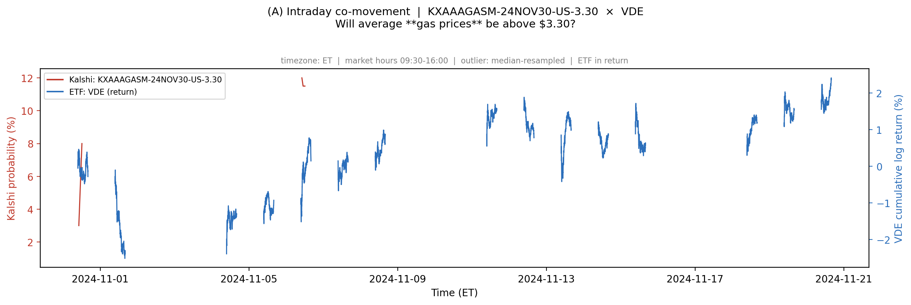
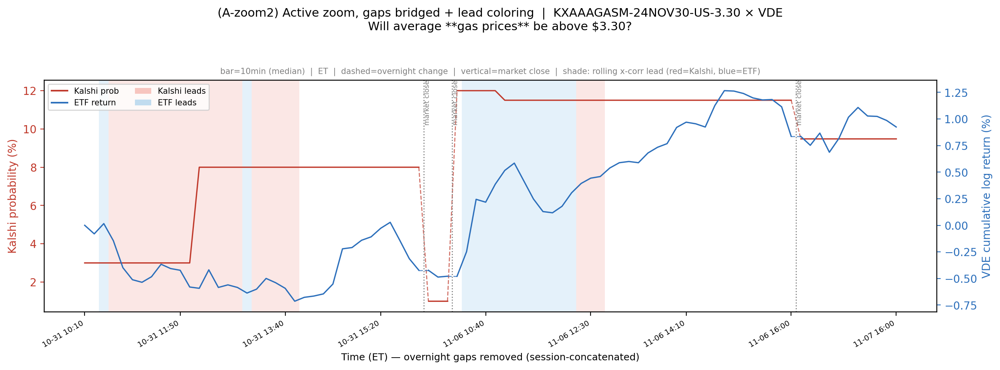
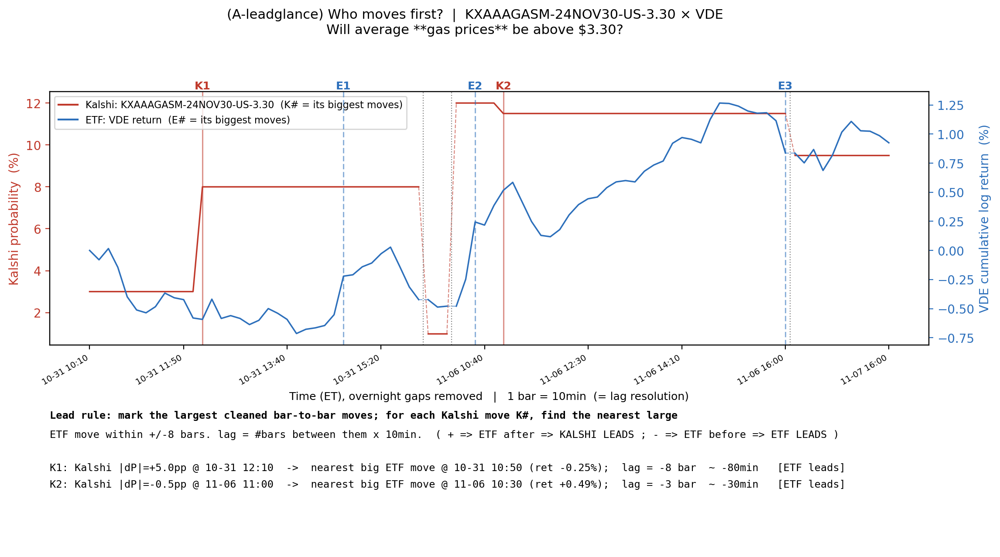
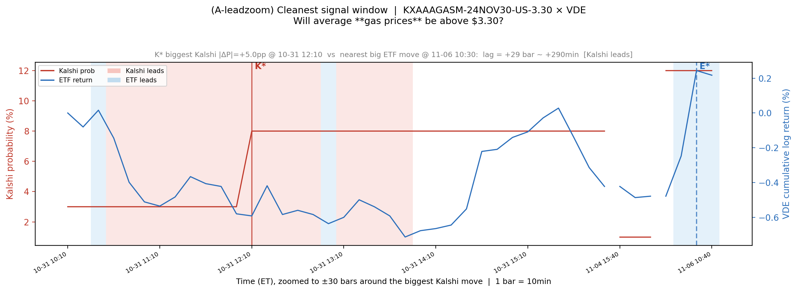
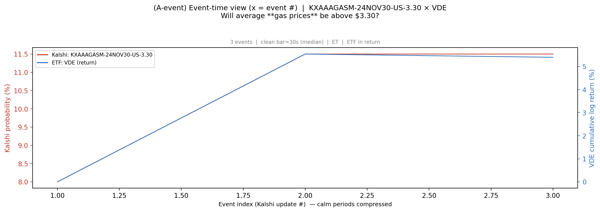
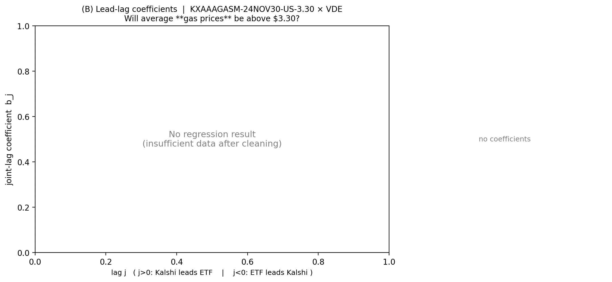

---

## Rank 46/48 — KXAAAGASM-24NOV30-US-3.30 × VDC  (n_sig=0, best_p=n/a, n_trades=14)  (no regression result)

```text
PAIR ANALYSIS    —    Rank 46 / 48
================================================================================================
KXAAAGASM-24NOV30-US-3.30   x   VDC
Contract : "Will average **gas prices** be above $3.30?"
Sector relevance : VDE (Energy)
Window : 2024-10-31 to 2024-11-20     Kalshi trades : 14     primary bar : n/a     daily-screen R^2 : 0.59

>>> RELIABILITY:  Cannot-estimate   <<<   (see section 5; unreliable pairs still get figures, but read their problems in section 8)

DEFINITIONS
   xₜ₋ₖ = Kalshi yes-probability change, k bars before t   (1 bar = n/a)
   yₜ   = ETF log return over bar t
   calendar = full market-hours grid: x=0 in bars with no Kalshi trade (not dropped).
   k>0 => Kalshi leads ETF ;  k<0 => ETF leads Kalshi ;  k=0 => contemporaneous

1. CALENDAR-TIME REGRESSION (clock-time lags, full RTH grid)
   Full model:  yₜ = α + Σ(k) βₖ·xₜ₋ₖ + (ADL self-lags) + (day fixed effects)
   -> no regression result (insufficient data).

2. EVENT-TIME REGRESSION (event-count lags)
   Full model:  yₜ = α + Σ(k) βₖ·xₜ₋ₖ + (ADL self-lags) + (day fixed effects)
   -> no regression result (insufficient data).

3. FULL COEFFICIENT TABLE  (calendar primary bar  vs  event)
   (no coefficients in either mode)

4. DIRECTIONAL TEST (probit, ETF up/down)
   Model: P(ETFₜ up) = Φ(α + βₖ·xₜ₋ₖ),  one probit per lag k
   calendar: n/a
   event: n/a
   -> no significant directional predictability either mode (raw p<0.15).

5. DATA RELIABILITY (statistical, not a trade-count cutoff)
   Tier: Cannot-estimate
   (criterion = n_active: bars with an actual Kalshi move (x!=0) = the real sample that identifies the lead-lag. Full RTH grid makes n_obs large, so n_active is the honest size.)
   calendar(full RTH grid): not estimable (insufficient data)
   event: not estimable (insufficient data)
   => Neither axis is estimable: this pair has descriptive figures only, no reliable regression result.

6. COARSE-FREQUENCY ROBUSTNESS (re-run calendar at 30min / 60min)
    30min: not estimable (n_obs=3 < minimum) -- coarser bars have even fewer observations
    60min: not estimable (n_obs=2 < minimum) -- coarser bars have even fewer observations

7. VERDICT
   No lead-lag detected -- too sparse / no significant structure.
   (Note: this pair lacks the data to support reliable inference; the verdict above is descriptive only -- do not put it in the conclusions.)

8. FIGURE CAVEATS — figures are still drawn, but know their problems
   - Regression cannot be estimated: the lag-coefficient plot (B) shows 'no regression result'; only the time-series / zoom plots are descriptive.
   - Long flat Kalshi segments = NO TRADE in that span (not 'probability unchanged'); do not read lead direction from them.
   - Too few active bars: the red/blue lead shading in zoom2/segments and the K#/E# pairing in leadglance are illustrative only, with no statistical meaning.
   - Kalshi updates only on trades (flat line = no trade, NOT 'no change'); ETF mid refreshes continuously.

------------------------------------------------------------------------------------------------
Conventions: ET | 09:30-16:00 (forward windows capped to 16:00) | ETF in log return | median causal bars | full RTH grid | day-grouped lags (no overnight) | ADL self-control | significance = BH-FDR corrected.
Figures for this pair follow on the next page.
```

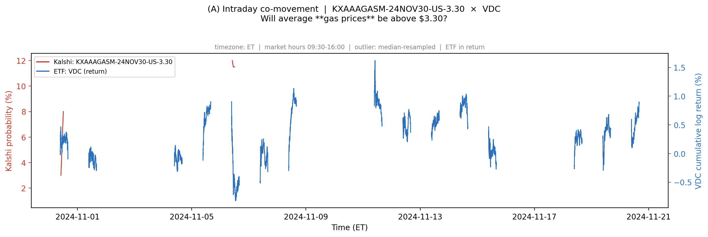
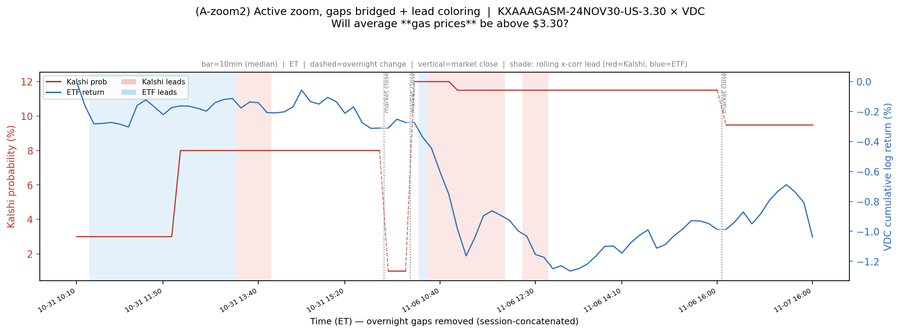
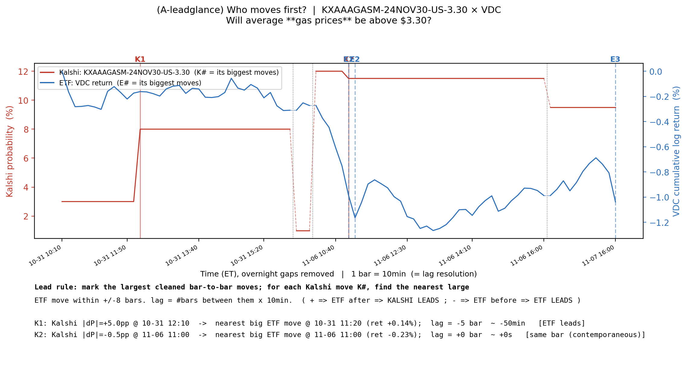
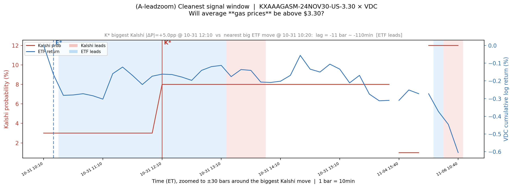
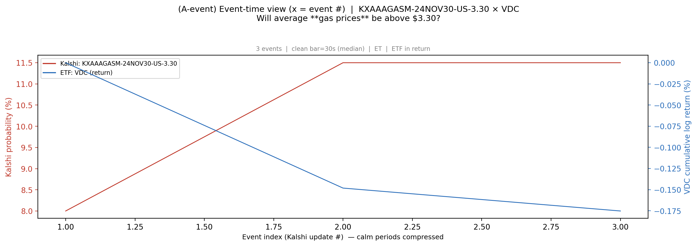


---

## Rank 47/48 — KXAAAGASM-24NOV30-US-3.30 × VNQ  (n_sig=0, best_p=n/a, n_trades=14)  (no regression result)

```text
PAIR ANALYSIS    —    Rank 47 / 48
================================================================================================
KXAAAGASM-24NOV30-US-3.30   x   VNQ
Contract : "Will average **gas prices** be above $3.30?"
Sector relevance : VDE (Energy)
Window : 2024-10-31 to 2024-11-20     Kalshi trades : 14     primary bar : n/a     daily-screen R^2 : 0.47

>>> RELIABILITY:  Cannot-estimate   <<<   (see section 5; unreliable pairs still get figures, but read their problems in section 8)

DEFINITIONS
   xₜ₋ₖ = Kalshi yes-probability change, k bars before t   (1 bar = n/a)
   yₜ   = ETF log return over bar t
   calendar = full market-hours grid: x=0 in bars with no Kalshi trade (not dropped).
   k>0 => Kalshi leads ETF ;  k<0 => ETF leads Kalshi ;  k=0 => contemporaneous

1. CALENDAR-TIME REGRESSION (clock-time lags, full RTH grid)
   Full model:  yₜ = α + Σ(k) βₖ·xₜ₋ₖ + (ADL self-lags) + (day fixed effects)
   -> no regression result (insufficient data).

2. EVENT-TIME REGRESSION (event-count lags)
   Full model:  yₜ = α + Σ(k) βₖ·xₜ₋ₖ + (ADL self-lags) + (day fixed effects)
   -> no regression result (insufficient data).

3. FULL COEFFICIENT TABLE  (calendar primary bar  vs  event)
   (no coefficients in either mode)

4. DIRECTIONAL TEST (probit, ETF up/down)
   Model: P(ETFₜ up) = Φ(α + βₖ·xₜ₋ₖ),  one probit per lag k
   calendar: n/a
   event: n/a
   -> no significant directional predictability either mode (raw p<0.15).

5. DATA RELIABILITY (statistical, not a trade-count cutoff)
   Tier: Cannot-estimate
   (criterion = n_active: bars with an actual Kalshi move (x!=0) = the real sample that identifies the lead-lag. Full RTH grid makes n_obs large, so n_active is the honest size.)
   calendar(full RTH grid): not estimable (insufficient data)
   event: not estimable (insufficient data)
   => Neither axis is estimable: this pair has descriptive figures only, no reliable regression result.

6. COARSE-FREQUENCY ROBUSTNESS (re-run calendar at 30min / 60min)
    30min: not estimable (n_obs=3 < minimum) -- coarser bars have even fewer observations
    60min: not estimable (n_obs=2 < minimum) -- coarser bars have even fewer observations

7. VERDICT
   No lead-lag detected -- too sparse / no significant structure.
   (Note: this pair lacks the data to support reliable inference; the verdict above is descriptive only -- do not put it in the conclusions.)

8. FIGURE CAVEATS — figures are still drawn, but know their problems
   - Regression cannot be estimated: the lag-coefficient plot (B) shows 'no regression result'; only the time-series / zoom plots are descriptive.
   - Long flat Kalshi segments = NO TRADE in that span (not 'probability unchanged'); do not read lead direction from them.
   - Too few active bars: the red/blue lead shading in zoom2/segments and the K#/E# pairing in leadglance are illustrative only, with no statistical meaning.
   - Kalshi updates only on trades (flat line = no trade, NOT 'no change'); ETF mid refreshes continuously.

------------------------------------------------------------------------------------------------
Conventions: ET | 09:30-16:00 (forward windows capped to 16:00) | ETF in log return | median causal bars | full RTH grid | day-grouped lags (no overnight) | ADL self-control | significance = BH-FDR corrected.
Figures for this pair follow on the next page.
```

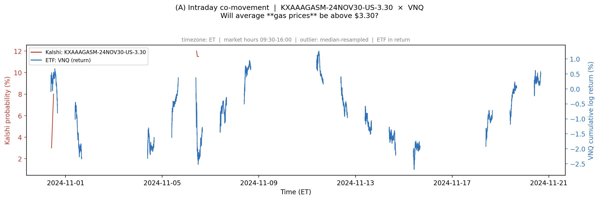
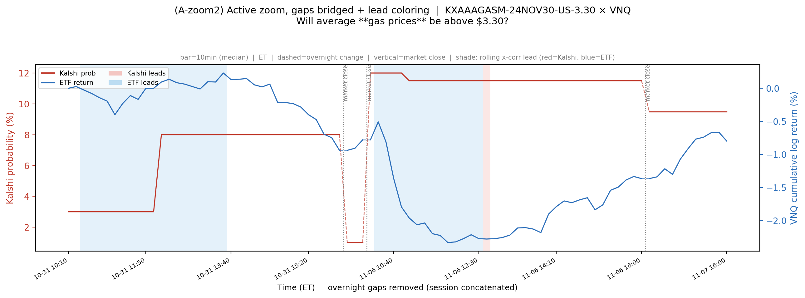
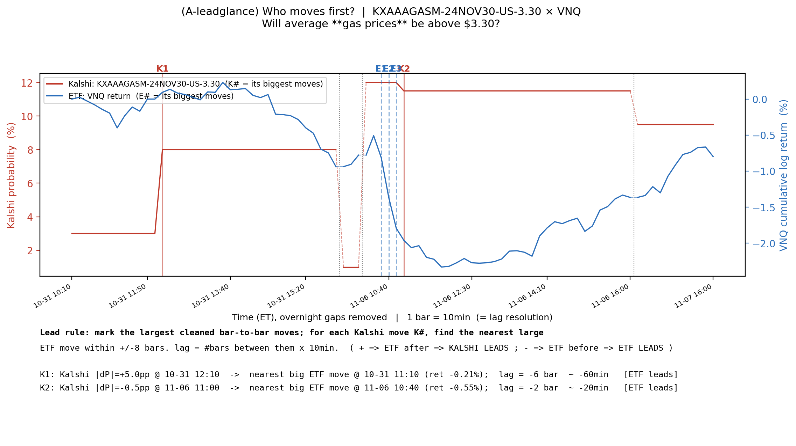
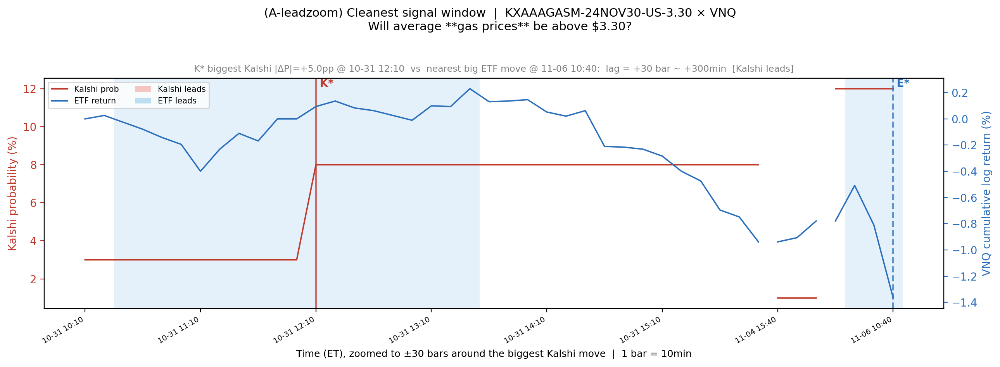
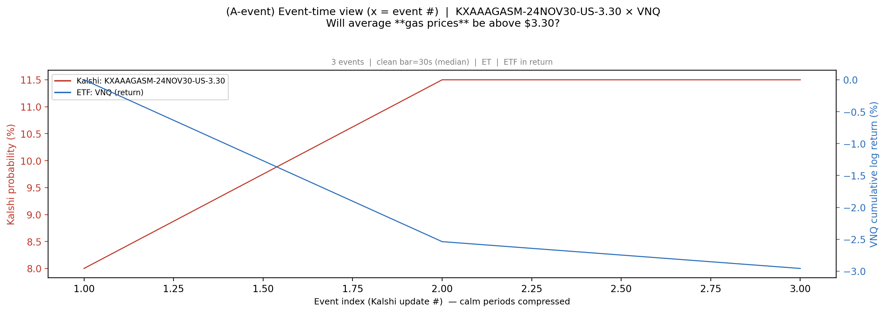


---

## Rank 48/48 — 538APPROVEMAX-24OCT31-T43 × VOX  (n_sig=0, best_p=n/a, n_trades=11)  (no regression result)

```text
PAIR ANALYSIS    —    Rank 48 / 48
================================================================================================
538APPROVEMAX-24OCT31-T43   x   VOX
Contract : "Will the President's approval rating ever get above 43% by Oct 31, 2024?"
Sector relevance : Election outcome (all sectors)
Window : 2024-10-07 to 2024-10-31     Kalshi trades : 11     primary bar : n/a     daily-screen R^2 : 0.70

>>> RELIABILITY:  Cannot-estimate   <<<   (see section 5; unreliable pairs still get figures, but read their problems in section 8)

DEFINITIONS
   xₜ₋ₖ = Kalshi yes-probability change, k bars before t   (1 bar = n/a)
   yₜ   = ETF log return over bar t
   calendar = full market-hours grid: x=0 in bars with no Kalshi trade (not dropped).
   k>0 => Kalshi leads ETF ;  k<0 => ETF leads Kalshi ;  k=0 => contemporaneous

1. CALENDAR-TIME REGRESSION (clock-time lags, full RTH grid)
   Full model:  yₜ = α + Σ(k) βₖ·xₜ₋ₖ + (ADL self-lags) + (day fixed effects)
   -> no regression result (insufficient data).

2. EVENT-TIME REGRESSION (event-count lags)
   Full model:  yₜ = α + Σ(k) βₖ·xₜ₋ₖ + (ADL self-lags) + (day fixed effects)
   -> no regression result (insufficient data).

3. FULL COEFFICIENT TABLE  (calendar primary bar  vs  event)
   (no coefficients in either mode)

4. DIRECTIONAL TEST (probit, ETF up/down)
   Model: P(ETFₜ up) = Φ(α + βₖ·xₜ₋ₖ),  one probit per lag k
   calendar: n/a
   event: n/a
   -> no significant directional predictability either mode (raw p<0.15).

5. DATA RELIABILITY (statistical, not a trade-count cutoff)
   Tier: Cannot-estimate
   (criterion = n_active: bars with an actual Kalshi move (x!=0) = the real sample that identifies the lead-lag. Full RTH grid makes n_obs large, so n_active is the honest size.)
   calendar(full RTH grid): not estimable (insufficient data)
   event: not estimable (insufficient data)
   => Neither axis is estimable: this pair has descriptive figures only, no reliable regression result.

6. COARSE-FREQUENCY ROBUSTNESS (re-run calendar at 30min / 60min)
    30min: not estimable (n_obs=2 < minimum) -- coarser bars have even fewer observations
    60min: not estimable (n_obs=1 < minimum) -- coarser bars have even fewer observations

7. VERDICT
   No lead-lag detected -- too sparse / no significant structure.
   (Note: this pair lacks the data to support reliable inference; the verdict above is descriptive only -- do not put it in the conclusions.)

8. FIGURE CAVEATS — figures are still drawn, but know their problems
   - Regression cannot be estimated: the lag-coefficient plot (B) shows 'no regression result'; only the time-series / zoom plots are descriptive.
   - Long flat Kalshi segments = NO TRADE in that span (not 'probability unchanged'); do not read lead direction from them.
   - Too few active bars: the red/blue lead shading in zoom2/segments and the K#/E# pairing in leadglance are illustrative only, with no statistical meaning.
   - Kalshi updates only on trades (flat line = no trade, NOT 'no change'); ETF mid refreshes continuously.

------------------------------------------------------------------------------------------------
Conventions: ET | 09:30-16:00 (forward windows capped to 16:00) | ETF in log return | median causal bars | full RTH grid | day-grouped lags (no overnight) | ADL self-control | significance = BH-FDR corrected.
Figures for this pair follow on the next page.
```

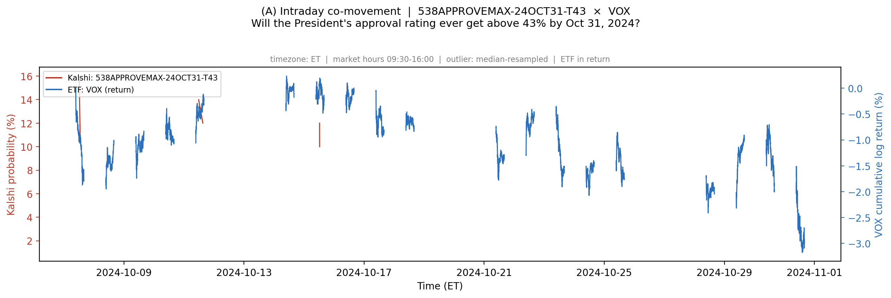
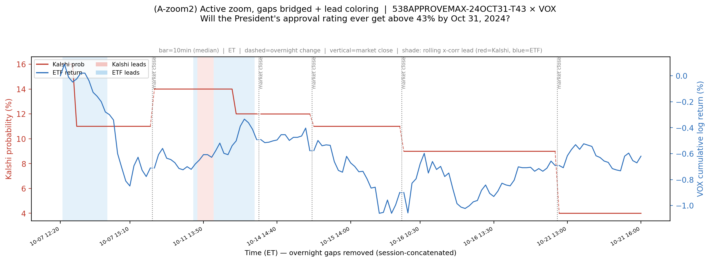
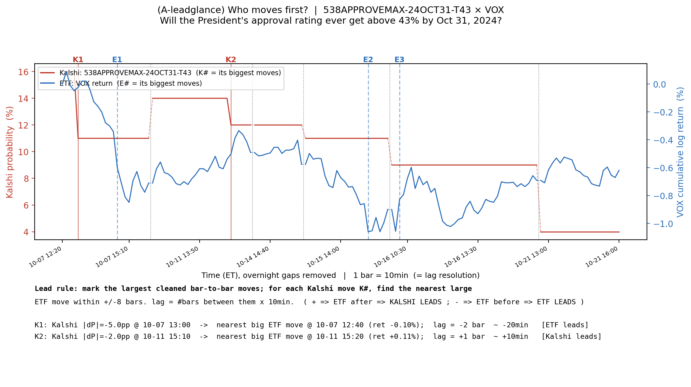
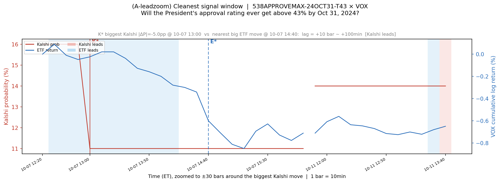
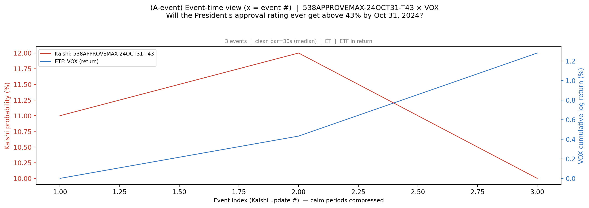
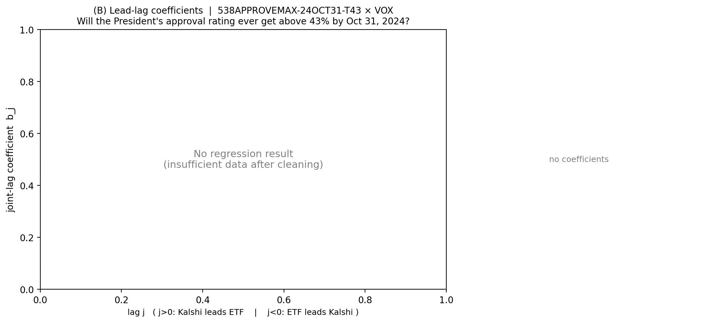
